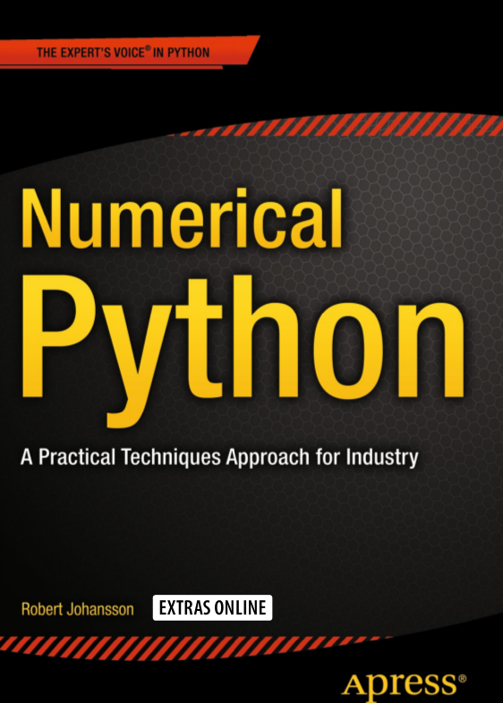

# Scientific Computing with Python

*  1. Getting Started
*  2. Intro: Numeric Computing with NumPy
*  3. Intro: Symbolic Computing with SymPy 
*  4. Intro: Plotting & Visualization with Matplotlib
*  5. Equation Solvers
*  6. Optimization
*  7. Interpolation
*  8. Integration
*  9. Ordinary Differential Equations (ODEs)
* 10. Sparse Matrices & Graphs
* 11. Partial Differential Equations (PDEs)
* 12. Intro: Data Analysis with Pandas

### TODO:

* 13. Statistics
* 14. Statistical Modeling
* 15. Machine Learning
* 16. Bayes
* 17. Signal Processing
* 18. Data I/O
* 19. Optimization
