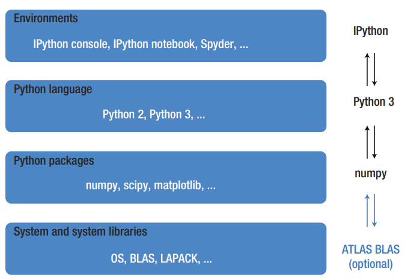
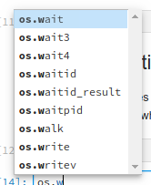

### Chapter 1: Computing with Python

### Overview: a typical Python-based scientific computing stack.


### Resources:
- [Intel MKL (Math Kernel Library)](https://software.intel.com/en-us/intel-mkl)
- [openBLAS](https://www.openblas.net)
- [ATLAS](https://math-atlas.sourceforge.net)
- [SciPy](http://www.scipy.org)
- [Python Numeric & Scientific topics](http://wiki.python.org/moin/NumericAndScientific)

### Interpreter
- The easist way to execute Python code: run the program directly.
- Use Jupyter magic command to write Python source file to disk:


```python
%%writefile hello.py
print("Hello from Python!")
```

    Overwriting hello.py


* Use the ! system shell command (included in the Python Jupyter kernel) to interactively run Python with hello.py as its argument.


```python
!python3 hello.py
```

    Hello from Python!


```python
!python3 --version
```

    Python 3.11.4


### Input and output caching

* Input & output history can be accessed using __In__ (a list) & __Out__ (a dictionary). Both can be indexed with a cell number. 


```python
3*3
In[1]
```


    'get_ipython().run_cell_magic(\'writefile\', \'hello.py\', \'print("Hello from Python!")\\n\')'


* A single underscore = the most recent output; 
* A double underscore = the _next_ most recent output.


```python
1+1
```


    2


```python
2+2
```


    4


```python
_, __
```


    (4, 2)


```python
# In = a list
In
```


    ['',
     'get_ipython().run_cell_magic(\'writefile\', \'hello.py\', \'print("Hello from Python!")\\n\')',
     "get_ipython().system('python3 hello.py')",
     "get_ipython().system('python3 --version')",
     '3*3\nIn[1]',
     '1+1',
     '2+2',
     '_, __',
     '# In = a list\nIn']


```python
# Out = a dictionary
Out
```


    {4: 'get_ipython().run_cell_magic(\'writefile\', \'hello.py\', \'print("Hello from Python!")\\n\')',
     5: 2,
     6: 4,
     7: (4, 2),
     8: ['',
      'get_ipython().run_cell_magic(\'writefile\', \'hello.py\', \'print("Hello from Python!")\\n\')',
      "get_ipython().system('python3 hello.py')",
      "get_ipython().system('python3 --version')",
      '3*3\nIn[1]',
      '1+1',
      '2+2',
      '_, __',
      '# In = a list\nIn',
      '# Out = a dictionary\nOut']}


```python
# Suppress output results by ending statement with a semicolon
1+2;
```

### Autocompletion

* The __Tab__ key activates autocompletion (displays list of symbol names that are valid completions of what has been typed thus far.)


```python
import os
```

* Results of typing "os.w", followed by \t:



### Documentation

* "Docstrings" provide a built-in reference manual for most Python modules. Display the docstring by appending a Python object with "?".


```python
import math
math.cos?
```


    Signature: math.cos(x, /)
    Docstring: Return the cosine of x (measured in radians).
    Type:      builtin_function_or_method


### Interaction with System Shell

* Anything after ! is evaluated using the system shell, such as bash.
* (I use Ubuntu Linux as my laptop OS. Your Windows equivalents will vary.)


```python
!touch file1.py file2.py file3.py
!ls file*
```

    file1.py  file2.py  file3.py


```python
# output of a system shell command can be captured in a Python variable
files = !ls file*
print(len(files))
print(files)
```

    3
    ['file1.py', 'file2.py', 'file3.py']


```python
# pass Python variable values to shell commands
# by prefixing the variable name with $.
file = "file1.py"
!ls -l $file
```

    -rw-rw-r-- 1 bjpcjp bjpcjp 0 Nov 14 08:18 file1.py


### IPython Extensions

* Commands start with one or two "%" characters. A single % is used for single-line commands; dual %% is used for cells (multiple lines).

* `%lsmagic` returns a list of available commands.


```python
%lsmagic
```


    Available line magics:
    %alias  %alias_magic  %autoawait  %autocall  %automagic  %autosave  %bookmark  %cat  %cd  %clear  %code_wrap  %colors  %conda  %config  %connect_info  %cp  %debug  %dhist  %dirs  %doctest_mode  %ed  %edit  %env  %gui  %hist  %history  %killbgscripts  %ldir  %less  %lf  %lk  %ll  %load  %load_ext  %loadpy  %logoff  %logon  %logstart  %logstate  %logstop  %ls  %lsmagic  %lx  %macro  %magic  %mamba  %man  %matplotlib  %micromamba  %mkdir  %more  %mv  %notebook  %page  %pastebin  %pdb  %pdef  %pdoc  %pfile  %pinfo  %pinfo2  %pip  %popd  %pprint  %precision  %prun  %psearch  %psource  %pushd  %pwd  %pycat  %pylab  %qtconsole  %quickref  %recall  %rehashx  %reload_ext  %rep  %rerun  %reset  %reset_selective  %rm  %rmdir  %run  %save  %sc  %set_env  %store  %sx  %system  %tb  %time  %timeit  %unalias  %unload_ext  %who  %who_ls  %whos  %xdel  %xmode
    
    Available cell magics:
    %%!  %%HTML  %%SVG  %%bash  %%capture  %%code_wrap  %%debug  %%file  %%html  %%javascript  %%js  %%latex  %%markdown  %%perl  %%prun  %%pypy  %%python  %%python2  %%python3  %%ruby  %%script  %%sh  %%svg  %%sx  %%system  %%time  %%timeit  %%writefile
    
    Automagic is ON, % prefix IS NOT needed for line magics.


### Running scripts

- `%run` executes an external Python source file within an interactive IPython session.


```python
%%writefile fib.py

def fib(N): 
    """ 
    Return a list of the first N Fibonacci numbers.
    """ 
    f0, f1 = 0, 1
    f = [1] * N
    for n in range(1, N):
        f[n] = f0 + f1
        f0, f1 = f1, f[n]

    return f

print(fib(10))
```

    Overwriting fib.py


```python
!python3 fib.py
```

    [1, 1, 2, 3, 5, 8, 13, 21, 34, 55]


```python
%run fib.py
```

    [1, 1, 2, 3, 5, 8, 13, 21, 34, 55]


```python
fib(6)
```


    [1, 1, 2, 3, 5, 8]


## Listing all defined symbols

* `%who` lists all defined symbols
* `%whos` provides more detailed info.


```python
%who
```

    fib	 file	 files	 math	 os	 


```python
%whos
```

    Variable   Type        Data/Info
    --------------------------------
    fib        function    <function fib at 0x7f39400d40e0>
    file       str         file1.py
    files      SList       ['file1.py', 'file2.py', 'file3.py']
    math       module      <module 'math' (built-in)>
    os         module      <module 'os' (frozen)>


## Debugger

* Use `%debug` to step directly into the Python debugger.


```python
# fib function fails - can't use floating point numbers.
try:
    fib(1.0)
except TypeError:
    print("nope. can't do that.")
```

    nope. can't do that.


```python
#%debug
```

### Resetting the Python namespace
- Ensures a program is run in a pristine environment, uncluttered by existing variables and functions. Although it is necessary to reimport modules, it is important to know that even if the modules have changed since the last
import, a new import after a %reset will not import the new module but rather reenable a cached version from the previous import. 

- When developing Python modules, this is usually not the desired behavior. In that case, a reimport of a previously imported (and since updated) module can often be achieved by using the reload function from `IPython.lib.deepreload`. However, this method does not always work, as
some libraries run code at import time that is only intended to run once. In this case, the only option might be to terminate and restart the IPython interpreter.


```python
%reset
```

    Once deleted, variables cannot be recovered. Proceed (y/[n])?  


    Nothing done.


## Timing and profiling code

* `%timeit` and `%time` provide simple benchmarking utilities.


```python
# first, re-define fibonacci code used above.
def fib(N): 
    """ 
    Return a list of the first N Fibonacci numbers.
    """ 
    f0, f1 = 0, 1
    f = [1] * N
    for n in range(1, N):
        f[n] = f0 + f1
        f0, f1 = f1, f[n]

    return f
```


```python
# timeit does not return expression's resulting value.
%timeit fib(50)
```

    1.38 µs ± 12.2 ns per loop (mean ± std. dev. of 7 runs, 1,000,000 loops each)


```python
# %time only runs once. less accurate estimate.
result = %time fib(100)
```

    CPU times: user 8 µs, sys: 0 ns, total: 8 µs
    Wall time: 8.82 µs


```python
len(result)
```


    100


* The __cProfile__ module provides __%prun__ (for statements) and __%run__ (for external scripts) profiling commands.


```python
import numpy as np

def random_walker_max_distance(M, N):
    """
    Simulate N random walkers taking M steps
    Return the largest distance from the starting point.
    """
    trajectories = [np.random.randn(M).cumsum() 
                    for _ in range(N)]
    return np.max(np.abs(trajectories))
```


```python
# returns call counts, runtime & cume runtime for each function.
%prun random_walker_max_distance(400, 10000)
```

     


             20013 function calls in 0.100 seconds
    
       Ordered by: internal time
    
       ncalls  tottime  percall  cumtime  percall filename:lineno(function)
        10000    0.058    0.000    0.058    0.000 {method 'randn' of 'numpy.random.mtrand.RandomState' objects}
        10000    0.022    0.000    0.022    0.000 {method 'cumsum' of 'numpy.ndarray' objects}
            1    0.013    0.013    0.099    0.099 220825864.py:3(random_walker_max_distance)
            1    0.003    0.003    0.084    0.084 220825864.py:8(<listcomp>)
            1    0.002    0.002    0.002    0.002 {method 'reduce' of 'numpy.ufunc' objects}
            1    0.001    0.001    0.100    0.100 <string>:1(<module>)
            1    0.000    0.000    0.100    0.100 {built-in method builtins.exec}
            1    0.000    0.000    0.002    0.002 fromnumeric.py:69(_wrapreduction)
            1    0.000    0.000    0.002    0.002 <__array_function__ internals>:177(amax)
            1    0.000    0.000    0.002    0.002 fromnumeric.py:2703(amax)
            1    0.000    0.000    0.002    0.002 {built-in method numpy.core._multiarray_umath.implement_array_function}
            1    0.000    0.000    0.000    0.000 fromnumeric.py:70(<dictcomp>)
            1    0.000    0.000    0.000    0.000 fromnumeric.py:2698(_amax_dispatcher)
            1    0.000    0.000    0.000    0.000 {method 'items' of 'dict' objects}
            1    0.000    0.000    0.000    0.000 {method 'disable' of '_lsprof.Profiler' objects}


### Jupyter: External image rendering


```python
from IPython.display import display, Image, HTML, Math
```


```python
Image(url='http://python.org/images/python-logo.gif')
```


### Jupyter: HTML rendering


```python
import scipy, numpy, matplotlib
modules = [numpy, matplotlib, scipy]

row = "<tr><td>%s</td><td>%s</td></tr>"
rows = "\n".join(
    [row % 
     (module.__name__, module.__version__) 
     for module in modules])
table = "<table><tr><th>Library</th><th>Version</th></tr> %s </table>" % rows
```


```python
HTML(table)
```


<table><tr><th>Library</th><th>Version</th></tr> <tr><td>numpy</td><td>1.24.2</td></tr>
<tr><td>matplotlib</td><td>3.5.2</td></tr>
<tr><td>scipy</td><td>1.10.1</td></tr> </table>


```python
# another method
class HTMLdisplayer(object):
    def __init__(self,code):
        self.code = code
    def _repr_html_(self):
        return self.code
    
HTMLdisplayer(table)
```


<table><tr><th>Library</th><th>Version</th></tr> <tr><td>numpy</td><td>1.24.2</td></tr>
<tr><td>matplotlib</td><td>3.5.2</td></tr>
<tr><td>scipy</td><td>1.10.1</td></tr> </table>


### Jupyter: Formula rendering using Latex


```python
Math(r'\hat{H} = -\frac{1}{2}\epsilon \hat{\sigma}_z-\frac{1}{2}\delta \hat{\sigma}_x')
```


$\displaystyle \hat{H} = -\frac{1}{2}\epsilon \hat{\sigma}_z-\frac{1}{2}\delta \hat{\sigma}_x$


### Jupyter: UI Widgets


```python
import matplotlib.pyplot as plt
import numpy as np
from scipy import stats

def f(mu):
    X = stats.norm(loc=mu, scale=np.sqrt(mu))
    N = stats.poisson(mu)
    x = np.linspace(0, X.ppf(0.999))
    n = np.arange(0, x[-1])
    
    fig, ax = plt.subplots()
    ax.plot(x, X.pdf(x), color='black', lw=2, label="Normal($\mu=%d, \sigma^2=%d$)" % (mu,mu))
    ax.bar(n, N.pmf(n), align='edge', label=r"Poisson($\lambda=%d$)" % mu)
    ax.set_ylim(0, X.pdf(x).max() * 1.25)
    ax.legend(loc=2, ncol=2)
    plt.close(fig)
    return fig
```


```python
from ipywidgets import interact
import ipywidgets as widgets
```


```python
interact(f, mu=widgets.FloatSlider(min=1.0, max=20.0, step=1.0));
```


    interactive(children=(FloatSlider(value=1.0, description='mu', max=20.0, min=1.0, step=1.0), Output()), _dom_c…


### nbconvert to HTML


```python
!jupyter nbconvert --to html ch01-intro.ipynb
```

    [NbConvertApp] Converting notebook ch01-intro.ipynb to html
    [NbConvertApp] WARNING | Alternative text is missing on 1 image(s).
    [NbConvertApp] Writing 348064 bytes to ch01-intro.html


### nbconvert to PDF
* [Requires a LaTeX environment](https://nbconvert.readthedocs.io/en/latest/install.html#installing-tex) to be installed.
* On this system (Ubuntu Linux): ```sudo apt-get install texlive-xetex```


```python
# be sure to install pandoc first.
!jupyter nbconvert --to pdf ch01-intro.ipynb;
```

    [NbConvertApp] Converting notebook ch01-intro.ipynb to pdf
    [NbConvertApp] Writing 63377 bytes to notebook.tex
    [NbConvertApp] Building PDF
    [NbConvertApp] Running xelatex 3 times: ['xelatex', 'notebook.tex', '-quiet']
    [NbConvertApp] Running bibtex 1 time: ['bibtex', 'notebook']
    [NbConvertApp] WARNING | bibtex had problems, most likely because there were no citations
    [NbConvertApp] PDF successfully created
    [NbConvertApp] Writing 128251 bytes to ch01-intro.pdf


```python
!ls ch01*
```

    ch01-intro.html  ch01-intro.ipynb  ch01-intro.pdf  ch01-intro.py

