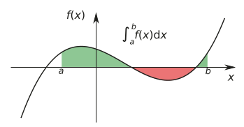

# Integration
- __Numerical Methods__
- __Numerical Integration with SciPy__
- __Tabulated Integrand__
- __Multiple Integration__
- __Symbolic & Arbitrary-Precision Integration__
- __Line Integrals__
- __Integral Transforms__

* Main focus: numerical integration (aka "quadrature").


```python
%matplotlib inline
import matplotlib.pyplot as plt
import matplotlib as mpl
```


```python
import numpy as np
from scipy import integrate
import sympy
sympy.init_printing()
```

### Simpson's rule
* Definite integrals - interpreted as area between integrand curve and x axis:



* Strategy for evaluating integral I(f): write it as discrete sum that approximates value of integral. ("n-point quadrature rule".)
* Quadrature rules derived from f(x) interpolations along interval [a,b].
* __Midpoint rule__: using 0th-order polynomial (constant value) of midpoint.
* __Trapezoid rule__: using 1st-order polynomial, evalated at endpoints.
* __Simpson's rule__: using 2nd-order polynomial, midpoint & endpoints.


```python
a, b, X = sympy.symbols("a, b, x")
f = sympy.Function("f")
```


```python
x = a, (a+b)/2, b # simpson's rule
```


```python
# weight factors
w = [sympy.symbols("w_%d" % i) 
     for i in range(len(x))] 
w
```


$\displaystyle \left[ w_{0}, \  w_{1}, \  w_{2}\right]$


```python
# quadrature rule
q_rule = sum([w[i] * f(x[i]) 
              for i in range(len(x))])
q_rule
```


$\displaystyle w_{0} f{\left(a \right)} + w_{1} f{\left(\frac{a}{2} + \frac{b}{2} \right)} + w_{2} f{\left(b \right)}$


```python
# using lambda to create symbolics for basis functions
phi = [sympy.Lambda(X, X**n) 
       for n in range(len(x))]
phi
```


$\displaystyle \left[ \left( x \mapsto 1 \right), \  \left( x \mapsto x \right), \  \left( x \mapsto x^{2} \right)\right]$


```python
eqs = [q_rule.subs(f, phi[n]) 
       - sympy.integrate(phi[n](X), (X, a, b)) 
       for n in range(len(phi))]
eqs
```


$\displaystyle \left[ a - b + w_{0} + w_{1} + w_{2}, \  \frac{a^{2}}{2} + a w_{0} - \frac{b^{2}}{2} + b w_{2} + w_{1} \left(\frac{a}{2} + \frac{b}{2}\right), \  \frac{a^{3}}{3} + a^{2} w_{0} - \frac{b^{3}}{3} + b^{2} w_{2} + w_{1} \left(\frac{a}{2} + \frac{b}{2}\right)^{2}\right]$


```python
# solves for weight factors
w_sol = sympy.solve(eqs, w); w_sol
```


$\displaystyle \left\{ w_{0} : - \frac{a}{6} + \frac{b}{6}, \  w_{1} : - \frac{2 a}{3} + \frac{2 b}{3}, \  w_{2} : - \frac{a}{6} + \frac{b}{6}\right\}$


```python
q_rule.subs(w_sol).simplify()
```


$\displaystyle \frac{\left(a - b\right) \left(- f{\left(a \right)} - f{\left(b \right)} - 4 f{\left(\frac{a}{2} + \frac{b}{2} \right)}\right)}{6}$


### Numerical Integration w/ SciPy
* Two types of quadrature routines:

1) accepts integrand as Python function using a __Gaussian__ quadrature - *quad(), quadrature(), fixed_quad()*)

2) __Newton-Cotes methods__: accepts arrays of integrand samples at given points - *trapz(), simps(), romb()*)

### Simple integration example


```python
def f(x):
    return np.exp(-x**2)
```


```python
# integrate.quad(function, upper limit, lower limit)
# return estimated integral & abs error
# error tolerances can be set using epsabs, epsrel keywords
val, err = integrate.quad(f, -1, 1)
val, err
```


$\displaystyle \left( 1.49364826562485, \  1.65828269518814 \cdot 10^{-14}\right)$


### Extra arguments


```python
def f(x, a, b, c):
    return a * np.exp(-((x-b)/c)**2)
```


```python
val, err = integrate.quad(f, -1, 1, args=(1, 2, 3))
val, err
```


$\displaystyle \left( 1.27630683510222, \  1.41698523481695 \cdot 10^{-14}\right)$


### Reshuffle arguments


```python
from scipy.special import jv # zeroth-order bessel function
```


```python
val, err = integrate.quad(lambda x: jv(0, x), 0, 5)
val, err
```


$\displaystyle \left( 0.715311917784768, \  2.47260738289741 \cdot 10^{-14}\right)$


### Infinite limits 


```python
f = lambda x: np.exp(-x**2)
```


```python
val, err = integrate.quad(f, -np.inf, np.inf)
val, err
```


$\displaystyle \left( 1.77245385090552, \  1.42026367809449 \cdot 10^{-8}\right)$


### Singularities
* quadrature() & fixed_quad() functions only support finite integration limits.


```python
f = lambda x: 1/np.sqrt(abs(x))
```


```python
a, b = -1, 1
```


```python
# this integral diverges at x=0. quad() can't handle it.
integrate.quad(f, a, b)
```

    /tmp/ipykernel_65767/525825373.py:1: RuntimeWarning: divide by zero encountered in scalar divide
      f = lambda x: 1/np.sqrt(abs(x))
    /tmp/ipykernel_65767/14331687.py:2: IntegrationWarning: The maximum number of subdivisions (50) has been achieved.
      If increasing the limit yields no improvement it is advised to analyze 
      the integrand in order to determine the difficulties.  If the position of a 
      local difficulty can be determined (singularity, discontinuity) one will 
      probably gain from splitting up the interval and calling the integrator 
      on the subranges.  Perhaps a special-purpose integrator should be used.
      integrate.quad(f, a, b)


$\displaystyle \left( \text{NaN}, \  \text{NaN}\right)$


```python
# to avoid problem points, use points keyword
integrate.quad(f, a, b, points=[0])
```


$\displaystyle \left( 3.99999999999998, \  5.6843418860808 \cdot 10^{-14}\right)$


```python
# visualize to see what's going on
fig, ax = plt.subplots(figsize=(8, 3))

x = np.linspace(a, b, 10000)
ax.plot(x, f(x), lw=2)
ax.fill_between(x, f(x), color='green', alpha=0.5)
ax.set_xlabel("$x$", fontsize=18)
ax.set_ylabel("$f(x)$", fontsize=18)
ax.set_ylim(0, 25)

fig.tight_layout()
fig.savefig("ch8-diverging-integrand.pdf")
```


    

    


### Tabulated integrand
* use case: integrand that is specified only at predetermined points. (ie, not using a Python function that can be evaluated at any point.)


```python
f = lambda x: np.sqrt(x)
```


```python
a, b = 0, 2
```


```python
x = np.linspace(a, b, 25)
```


```python
y = f(x)
```


```python
fig, ax = plt.subplots(figsize=(8, 3))
ax.plot(x, y, 'bo')
xx = np.linspace(a, b, 500)
ax.plot(xx, f(xx), 'b-')
ax.fill_between(xx, f(xx), color='green', alpha=0.5)
ax.set_xlabel(r"$x$", fontsize=18)
ax.set_ylabel(r"$f(x)$", fontsize=18)
fig.tight_layout()
fig.savefig("ch8-tabulated-integrand.pdf")
```


    

    


```python
# trapezoid method
val_trapz = integrate.trapz(y, x)
val_trapz
```


$\displaystyle 1.88082171605085$


```python
# simpson's rule
val_simps = integrate.simps(y, x)
val_simps
```


$\displaystyle 1.88366510244871$


```python
# find error estimates by computing integral & comparising to above estimate
val_exact = 2.0/3.0 * (b-a)**(3.0/2.0)

val_exact, (val_exact-val_trapz), (val_exact-val_simps)
```


$\displaystyle \left( 1.88561808316413, \  0.00479636711327625, \  0.00195298071541172\right)$


* We can't ask trapz or simps to find more accurate answers unless more samples are given, or a higher-order method is used.
* romb() function helps -- implementation of Romberg method


```python
x = np.linspace(a, b, 1 + 2**6)
len(x)
```


$\displaystyle 65$


```python
y = f(x)
```


```python
val_exact - integrate.romb(y, dx=(x[1]-x[0]))
```


$\displaystyle 0.000378798422913107$


```python
val_exact - integrate.simps(y, dx=x[1]-x[0])
```


$\displaystyle 0.000448485554158218$


## Multiple integration
- __dblquad__ and __tplquad__ functions available in SciPy.


```python
def f(x):
    return np.exp(-x**2)
```


```python
%time integrate.quad(f, a, b)
```

    CPU times: user 37 µs, sys: 21 µs, total: 58 µs
    Wall time: 60.1 µs


$\displaystyle \left( 0.882081390762422, \  9.7930706961782 \cdot 10^{-15}\right)$


```python
def f(x, y):
    return np.exp(-x**2-y**2)
```


```python
a, b = 0, 1
```


```python
g = lambda x: 0
h = lambda x: 1
```


```python
integrate.dblquad(f, a, b, g, h)
```


$\displaystyle \left( 0.557746285351034, \  8.29137438153541 \cdot 10^{-15}\right)$


```python
integrate.dblquad(
    lambda x, y: np.exp(-x**2-y**2), 
    0, 1, 
    lambda x: 0, 
    lambda x: 1)
```


$\displaystyle \left( 0.557746285351034, \  8.29137438153541 \cdot 10^{-15}\right)$


```python
fig, ax = plt.subplots(figsize=(6, 5))

x = y = np.linspace(-1.25, 1.25, 75)
X, Y = np.meshgrid(x, y)

c = ax.contour(X, Y, f(X, Y), 15, cmap=mpl.cm.RdBu, vmin=-1, vmax=1)

bound_rect = plt.Rectangle((0, 0), 1, 1,
                           facecolor="grey")
ax.add_patch(bound_rect)

ax.axis('tight')
ax.set_xlabel('$x$', fontsize=18)
ax.set_ylabel('$y$', fontsize=18)

fig.tight_layout()
fig.savefig("ch8-multi-dim-integrand.pdf")
```


    

    


```python
# because g&h are functions,
# we can find integrals with x-dependent integration limits along y.
integrate.dblquad(
    f, 
    0, 1, 
    lambda x: -1+x, 
    lambda x: 1-x)
```


$\displaystyle \left( 0.732093100000809, \  1.6564972931774 \cdot 10^{-14}\right)$


### triple integrals


```python
def f(x, y, z):
    return np.exp(-x**2 - y**2 - z**2)
```


```python
integrate.tplquad(f, 0, 1, 
                  lambda x : 0, 
                  lambda x : 1, 
                  lambda x, y : 0, 
                  lambda x, y : 1)
```


$\displaystyle \left( 0.416538385886638, \  8.29133528731442 \cdot 10^{-15}\right)$


```python
integrate.nquad(f, [(0, 1), (0, 1), (0, 1)])
```


$\displaystyle \left( 0.416538385886638, \  8.29133528731442 \cdot 10^{-15}\right)$


### Arbitrary number of integrations
* Computational complexity grows very quickly.


```python
def f(*args):
    return  np.exp(-np.sum(np.array(args)**2))
```


```python
%time integrate.nquad(f, [(0,1)] * 1)
```

    CPU times: user 110 µs, sys: 60 µs, total: 170 µs
    Wall time: 173 µs


$\displaystyle \left( 0.746824132812427, \  8.29141347594073 \cdot 10^{-15}\right)$


```python
%time integrate.nquad(f, [(0,1)] * 2)
```

    CPU times: user 1.55 ms, sys: 0 ns, total: 1.55 ms
    Wall time: 1.55 ms


$\displaystyle \left( 0.557746285351034, \  8.29137438153541 \cdot 10^{-15}\right)$


```python
%time integrate.nquad(f, [(0,1)] * 3)
```

    CPU times: user 40.2 ms, sys: 134 µs, total: 40.3 ms
    Wall time: 40.3 ms


$\displaystyle \left( 0.416538385886638, \  8.29133528731442 \cdot 10^{-15}\right)$


```python
%time integrate.nquad(f, [(0,1)] * 4)
```

    CPU times: user 593 ms, sys: 1.2 ms, total: 594 ms
    Wall time: 593 ms


$\displaystyle \left( 0.311080918822877, \  8.29129619327777 \cdot 10^{-15}\right)$


```python
%time integrate.nquad(f, [(0,1)] * 5)
```

    CPU times: user 11.4 s, sys: 2.3 ms, total: 11.4 s
    Wall time: 11.4 s


$\displaystyle \left( 0.232322737434388, \  8.29125709942545 \cdot 10^{-15}\right)$


## Symbolic and multi-precision quadrature


```python
x = sympy.symbols("x")
```


```python
f = 2 * sympy.sqrt(1-x**2)
```


```python
a, b = -1, 1
```


```python
sympy.plot(f, (x, -2, 2));
```


    

    


```python
val_sym = sympy.integrate(f, (x, a, b))
val_sym
```


$\displaystyle \pi$


### Sympy mpath library
- alternate method of numerical quadrature using arbitrary-precisin math
- much slower than floating-point math, but better precision than SciPy quadrature funcs.


```python
import mpmath as mpmath
```


```python
mpmath.mp.dps = 75 # number of digits of precision
```


```python
# need mpmath-compatible python function as integrand.
f_mpmath = sympy.lambdify(x, f, 'mpmath')
```


```python
# compute integral & display result
val = mpmath.quad(f_mpmath, (a, b))
sympy.sympify(val)
```


$\displaystyle 3.14159265358979323846264338327950288419716939937510582097494459230781640629$


```python
# compare result with known value. error sufficiently small?
sympy.N(val_sym, mpmath.mp.dps+1) - val
```


$\displaystyle 6.90893484407555570030908149024031965689280029154902510801896277613487344253 \cdot 10^{-77}$


```python
%timeit mpmath.quad(f_mpmath, [a, b])
```

    2.27 ms ± 501 µs per loop (mean ± std. dev. of 7 runs, 100 loops each)


```python
f_numpy = sympy.lambdify(x, f, 'numpy')
```


```python
%timeit integrate.quad(f_numpy, a, b)
```

    242 µs ± 54.3 µs per loop (mean ± std. dev. of 7 runs, 1,000 loops each)


### Line integrals
- 1st argument = integrand (symPy expression)
- 2nd argument = symPy Curve object
- 3rd argument = list of integration variables


```python
t, x, y = sympy.symbols("t, x, y")
```


```python
C = sympy.Curve([sympy.cos(t), sympy.sin(t)], (t, 0, 2 * sympy.pi))
```


```python
sympy.line_integrate(1, C, [x, y])
```


$\displaystyle 2 \pi$


```python
sympy.line_integrate(x**2 * y**2, C, [x, y])
```


$\displaystyle \frac{\pi}{4}$


### Integral transformations
* __integral transform__: accepts a function as input, returns another function.
* best when computed symbolically
* two examples: __laplace__ (differential equation into algebraic equation) and __fourier__ (time domain to frequency domain).

### Laplace transforms


```python
s    = sympy.symbols("s")
a, t = sympy.symbols("a, t", positive=True)
f    = sympy.sin(a*t)
```


```python
# compute transform
# returns tuple: result transform, value 'A' from convergence condition, any add'l conditions.

sympy.laplace_transform(f, t, s)
```


$\displaystyle \left( \frac{a}{a^{2} + s^{2}}, \  0, \  \text{True}\right)$


```python
# if you want just the result function:
F = sympy.laplace_transform(f, t, s, noconds=True); F
```


$\displaystyle \frac{a}{a^{2} + s^{2}}$


```python
# inverse transform (swap 's','t' arguments)
sympy.inverse_laplace_transform(F, s, t, noconds=True)
```


$\displaystyle \sin{\left(a t \right)}$


```python
# sympy can find transforms for many elementary functions automatically
# ex: laplace transforms of polynomials

[sympy.laplace_transform(f, t, s, noconds=True) 
 for f in [t, t**2, t**3, t**4]]
```


$\displaystyle \left[ \frac{1}{s^{2}}, \  \frac{2}{s^{3}}, \  \frac{6}{s^{4}}, \  \frac{24}{s^{5}}\right]$


```python
# computing general results with arbitrary integer exponents
n = sympy.symbols(
    "n", integer=True, positive=True)

sympy.laplace_transform(t**n, t, s, noconds=True)
```


$\displaystyle s^{- n - 1} \Gamma\left(n + 1\right)$


```python
# laplace xform of composite expression
sympy.laplace_transform(
    (1 - a*t) * sympy.exp(-a*t), t, s, noconds=True)
```


$\displaystyle \frac{s}{\left(a + s\right)^{2}}$


### Fourier Transforms
* available functions: __fourier_transform()__, __inverse_fourier_transform()__


```python
w = sympy.symbols("omega")
```


```python
f = sympy.exp(-a*t**2)
```


```python
F = sympy.fourier_transform(f, t, w); F
```


$\displaystyle \frac{\sqrt{\pi} e^{- \frac{\pi^{2} \omega^{2}}{a}}}{\sqrt{a}}$


```python
sympy.inverse_fourier_transform(F, w, t)
```


$\displaystyle e^{- a t^{2}}$


