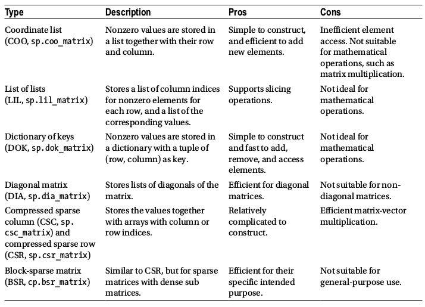
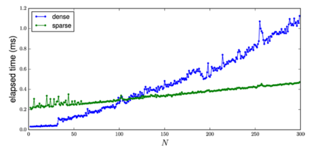
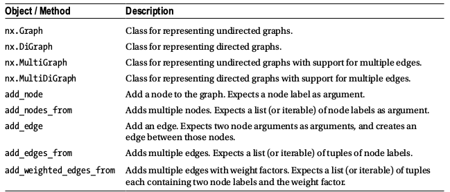

# Sparse matrices and graphs

- __SciPy sparse matrices__
- __Creating__
- __Sparse Linear Algebra__
- __Linear Equation Systems__
- __Eigenvalue Problems__
- __Graphs & Networks__


```python
%matplotlib inline
%config InlineBackend.figure_format='retina'
```


```python
import matplotlib.pyplot as plt
import matplotlib as mpl
mpl.rcParams['text.usetex'] = True
```


```python
import scipy.sparse as sp
import scipy.sparse.linalg
import scipy.linalg as la
import numpy as np
```


```python
import networkx as nx
```



### Coordinate list format
* store lists of column & row indices together with a list of nonzero values.


```python
values = [1, 2, 3, 4]
rows   = [0, 1, 2, 3]
cols   = [1, 3, 2, 0]
```


```python
# coo_matrix() == coordinate list format
A = sp.coo_matrix((values, (rows, cols)), shape=[4, 4])
A.todense()
```


    matrix([[0, 1, 0, 0],
            [0, 0, 0, 2],
            [0, 0, 3, 0],
            [4, 0, 0, 0]])


```python
# various attributes
A.shape, A.size, A.dtype, A.ndim
```


    ((4, 4), 4, dtype('int64'), 2)


```python
# nnz = number of non-zeros
# data = nonzero values
A.nnz, A.data, A.row, A.col
```


    (4,
     array([1, 2, 3, 4]),
     array([0, 1, 2, 3], dtype=int32),
     array([1, 3, 2, 0], dtype=int32))


```python
# convert to CSR (compressed sparse row) format)
# not as intuitive, but well suited for matrix math & linear algebra operations.
# CSR & CSC = main formats for sparse matrix math.
A = np.array([[1, 2, 0, 0], [0, 3, 4, 0], [0, 0, 5, 6], [7, 0, 8, 9]]); A
```


    array([[1, 2, 0, 0],
           [0, 3, 4, 0],
           [0, 0, 5, 6],
           [7, 0, 8, 9]])


```python
A = sp.csr_matrix(A)
A.data, A.indices, A.indptr
```


    (array([1, 2, 3, 4, 5, 6, 7, 8, 9]),
     array([0, 1, 1, 2, 2, 3, 0, 2, 3], dtype=int32),
     array([0, 2, 4, 6, 9], dtype=int32))


### Functions for constructing sparse matrices
* Often more convenient to use __sp.sparse__ templates:
* __sp.eye__ (ones on diagonal)
* __sp.diags__ (spec'd pattern on diagonal)
* __sp.kron__  (kronecker tensor product of 2 sparse matrices)
* __sp.bmat__, __sp.vstack__, __sp.hstack__


```python
N = 10
```


```python
A = -2 * sp.eye(N) + sp.eye(N, k=1) + sp.eye(N, k=-1); A
```


    <10x10 sparse matrix of type '<class 'numpy.float64'>'
    	with 28 stored elements (3 diagonals) in DIAgonal format>


```python
A.todense()
```


    matrix([[-2.,  1.,  0.,  0.,  0.,  0.,  0.,  0.,  0.,  0.],
            [ 1., -2.,  1.,  0.,  0.,  0.,  0.,  0.,  0.,  0.],
            [ 0.,  1., -2.,  1.,  0.,  0.,  0.,  0.,  0.,  0.],
            [ 0.,  0.,  1., -2.,  1.,  0.,  0.,  0.,  0.,  0.],
            [ 0.,  0.,  0.,  1., -2.,  1.,  0.,  0.,  0.,  0.],
            [ 0.,  0.,  0.,  0.,  1., -2.,  1.,  0.,  0.,  0.],
            [ 0.,  0.,  0.,  0.,  0.,  1., -2.,  1.,  0.,  0.],
            [ 0.,  0.,  0.,  0.,  0.,  0.,  1., -2.,  1.,  0.],
            [ 0.,  0.,  0.,  0.,  0.,  0.,  0.,  1., -2.,  1.],
            [ 0.,  0.,  0.,  0.,  0.,  0.,  0.,  0.,  1., -2.]])


```python
# matplot lib spy function for viewing sparse matrix data
fig, ax = plt.subplots()
ax.spy(A)
fig.savefig("ch10-sparse-matrix-1.pdf");
```


    ---------------------------------------------------------------------------

    CalledProcessError                        Traceback (most recent call last)

    File /usr/lib/python3/dist-packages/matplotlib/texmanager.py:233, in TexManager._run_checked_subprocess(self, command, tex, cwd)
        232 try:
    --> 233     report = subprocess.check_output(
        234         command, cwd=cwd if cwd is not None else self.texcache,
        235         stderr=subprocess.STDOUT)
        236 except FileNotFoundError as exc:


    File /usr/lib/python3.11/subprocess.py:466, in check_output(timeout, *popenargs, **kwargs)
        464     kwargs['input'] = empty
    --> 466 return run(*popenargs, stdout=PIPE, timeout=timeout, check=True,
        467            **kwargs).stdout


    File /usr/lib/python3.11/subprocess.py:571, in run(input, capture_output, timeout, check, *popenargs, **kwargs)
        570     if check and retcode:
    --> 571         raise CalledProcessError(retcode, process.args,
        572                                  output=stdout, stderr=stderr)
        573 return CompletedProcess(process.args, retcode, stdout, stderr)


    CalledProcessError: Command '['latex', '-interaction=nonstopmode', '--halt-on-error', '../1acea6f6c115d0ec7a634ed0529287b9.tex']' returned non-zero exit status 1.

    
    The above exception was the direct cause of the following exception:


    RuntimeError                              Traceback (most recent call last)

    Cell In[15], line 4
          2 fig, ax = plt.subplots()
          3 ax.spy(A)
    ----> 4 fig.savefig("ch10-sparse-matrix-1.pdf");


    File /usr/lib/python3/dist-packages/matplotlib/figure.py:3046, in Figure.savefig(self, fname, transparent, **kwargs)
       3042     for ax in self.axes:
       3043         stack.enter_context(
       3044             ax.patch._cm_set(facecolor='none', edgecolor='none'))
    -> 3046 self.canvas.print_figure(fname, **kwargs)


    File /usr/lib/python3/dist-packages/matplotlib/backend_bases.py:2319, in FigureCanvasBase.print_figure(self, filename, dpi, facecolor, edgecolor, orientation, format, bbox_inches, pad_inches, bbox_extra_artists, backend, **kwargs)
       2315 try:
       2316     # _get_renderer may change the figure dpi (as vector formats
       2317     # force the figure dpi to 72), so we need to set it again here.
       2318     with cbook._setattr_cm(self.figure, dpi=dpi):
    -> 2319         result = print_method(
       2320             filename,
       2321             facecolor=facecolor,
       2322             edgecolor=edgecolor,
       2323             orientation=orientation,
       2324             bbox_inches_restore=_bbox_inches_restore,
       2325             **kwargs)
       2326 finally:
       2327     if bbox_inches and restore_bbox:


    File /usr/lib/python3/dist-packages/matplotlib/backend_bases.py:1648, in _check_savefig_extra_args.<locals>.wrapper(*args, **kwargs)
       1640     _api.warn_deprecated(
       1641         '3.3', name=name, removal='3.6',
       1642         message='%(name)s() got unexpected keyword argument "'
       1643                 + arg + '" which is no longer supported as of '
       1644                 '%(since)s and will become an error '
       1645                 '%(removal)s')
       1646     kwargs.pop(arg)
    -> 1648 return func(*args, **kwargs)


    File /usr/lib/python3/dist-packages/matplotlib/_api/deprecation.py:389, in delete_parameter.<locals>.wrapper(*inner_args, **inner_kwargs)
        384 @functools.wraps(func)
        385 def wrapper(*inner_args, **inner_kwargs):
        386     if len(inner_args) <= name_idx and name not in inner_kwargs:
        387         # Early return in the simple, non-deprecated case (much faster than
        388         # calling bind()).
    --> 389         return func(*inner_args, **inner_kwargs)
        390     arguments = signature.bind(*inner_args, **inner_kwargs).arguments
        391     if is_varargs and arguments.get(name):


    File /usr/lib/python3/dist-packages/matplotlib/backends/backend_pdf.py:2790, in FigureCanvasPdf.print_pdf(self, filename, dpi, bbox_inches_restore, metadata)
       2785 file.newPage(width, height)
       2786 renderer = MixedModeRenderer(
       2787     self.figure, width, height, dpi,
       2788     RendererPdf(file, dpi, height, width),
       2789     bbox_inches_restore=bbox_inches_restore)
    -> 2790 self.figure.draw(renderer)
       2791 renderer.finalize()
       2792 if not isinstance(filename, PdfPages):


    File /usr/lib/python3/dist-packages/matplotlib/artist.py:73, in _finalize_rasterization.<locals>.draw_wrapper(artist, renderer, *args, **kwargs)
         71 @wraps(draw)
         72 def draw_wrapper(artist, renderer, *args, **kwargs):
    ---> 73     result = draw(artist, renderer, *args, **kwargs)
         74     if renderer._rasterizing:
         75         renderer.stop_rasterizing()


    File /usr/lib/python3/dist-packages/matplotlib/artist.py:50, in allow_rasterization.<locals>.draw_wrapper(artist, renderer)
         47     if artist.get_agg_filter() is not None:
         48         renderer.start_filter()
    ---> 50     return draw(artist, renderer)
         51 finally:
         52     if artist.get_agg_filter() is not None:


    File /usr/lib/python3/dist-packages/matplotlib/figure.py:2837, in Figure.draw(self, renderer)
       2834         # ValueError can occur when resizing a window.
       2836 self.patch.draw(renderer)
    -> 2837 mimage._draw_list_compositing_images(
       2838     renderer, self, artists, self.suppressComposite)
       2840 for sfig in self.subfigs:
       2841     sfig.draw(renderer)


    File /usr/lib/python3/dist-packages/matplotlib/image.py:132, in _draw_list_compositing_images(renderer, parent, artists, suppress_composite)
        130 if not_composite or not has_images:
        131     for a in artists:
    --> 132         a.draw(renderer)
        133 else:
        134     # Composite any adjacent images together
        135     image_group = []


    File /usr/lib/python3/dist-packages/matplotlib/artist.py:50, in allow_rasterization.<locals>.draw_wrapper(artist, renderer)
         47     if artist.get_agg_filter() is not None:
         48         renderer.start_filter()
    ---> 50     return draw(artist, renderer)
         51 finally:
         52     if artist.get_agg_filter() is not None:


    File /usr/lib/python3/dist-packages/matplotlib/axes/_base.py:3055, in _AxesBase.draw(self, renderer)
       3052     for spine in self.spines.values():
       3053         artists.remove(spine)
    -> 3055 self._update_title_position(renderer)
       3057 if not self.axison:
       3058     for _axis in self._get_axis_list():


    File /usr/lib/python3/dist-packages/matplotlib/axes/_base.py:2991, in _AxesBase._update_title_position(self, renderer)
       2988 for ax in axs:
       2989     if (ax.xaxis.get_ticks_position() in ['top', 'unknown']
       2990             or ax.xaxis.get_label_position() == 'top'):
    -> 2991         bb = ax.xaxis.get_tightbbox(renderer)
       2992     else:
       2993         if 'outline' in ax.spines:
       2994             # Special case for colorbars:


    File /usr/lib/python3/dist-packages/matplotlib/axis.py:1105, in Axis.get_tightbbox(self, renderer, for_layout_only)
       1101     return
       1103 ticks_to_draw = self._update_ticks()
    -> 1105 self._update_label_position(renderer)
       1107 # go back to just this axis's tick labels
       1108 ticklabelBoxes, ticklabelBoxes2 = self._get_tick_bboxes(
       1109             ticks_to_draw, renderer)


    File /usr/lib/python3/dist-packages/matplotlib/axis.py:2083, in XAxis._update_label_position(self, renderer)
       2079     return
       2081 # get bounding boxes for this axis and any siblings
       2082 # that have been set by `fig.align_xlabels()`
    -> 2083 bboxes, bboxes2 = self._get_tick_boxes_siblings(renderer=renderer)
       2085 x, y = self.label.get_position()
       2086 if self.label_position == 'bottom':


    File /usr/lib/python3/dist-packages/matplotlib/axis.py:1881, in Axis._get_tick_boxes_siblings(self, renderer)
       1879 axis = getattr(ax, f"{axis_name}axis")
       1880 ticks_to_draw = axis._update_ticks()
    -> 1881 tlb, tlb2 = axis._get_tick_bboxes(ticks_to_draw, renderer)
       1882 bboxes.extend(tlb)
       1883 bboxes2.extend(tlb2)


    File /usr/lib/python3/dist-packages/matplotlib/axis.py:1087, in Axis._get_tick_bboxes(self, ticks, renderer)
       1083 def _get_tick_bboxes(self, ticks, renderer):
       1084     """Return lists of bboxes for ticks' label1's and label2's."""
       1085     return ([tick.label1.get_window_extent(renderer)
       1086              for tick in ticks if tick.label1.get_visible()],
    -> 1087             [tick.label2.get_window_extent(renderer)
       1088              for tick in ticks if tick.label2.get_visible()])


    File /usr/lib/python3/dist-packages/matplotlib/axis.py:1087, in <listcomp>(.0)
       1083 def _get_tick_bboxes(self, ticks, renderer):
       1084     """Return lists of bboxes for ticks' label1's and label2's."""
       1085     return ([tick.label1.get_window_extent(renderer)
       1086              for tick in ticks if tick.label1.get_visible()],
    -> 1087             [tick.label2.get_window_extent(renderer)
       1088              for tick in ticks if tick.label2.get_visible()])


    File /usr/lib/python3/dist-packages/matplotlib/text.py:910, in Text.get_window_extent(self, renderer, dpi)
        907     raise RuntimeError('Cannot get window extent w/o renderer')
        909 with cbook._setattr_cm(self.figure, dpi=dpi):
    --> 910     bbox, info, descent = self._get_layout(self._renderer)
        911     x, y = self.get_unitless_position()
        912     x, y = self.get_transform().transform((x, y))


    File /usr/lib/python3/dist-packages/matplotlib/text.py:309, in Text._get_layout(self, renderer)
        306 ys = []
        308 # Full vertical extent of font, including ascenders and descenders:
    --> 309 _, lp_h, lp_d = renderer.get_text_width_height_descent(
        310     "lp", self._fontproperties,
        311     ismath="TeX" if self.get_usetex() else False)
        312 min_dy = (lp_h - lp_d) * self._linespacing
        314 for i, line in enumerate(lines):


    File /usr/lib/python3/dist-packages/matplotlib/backends/_backend_pdf_ps.py:107, in RendererPDFPSBase.get_text_width_height_descent(self, s, prop, ismath)
        105     texmanager = self.get_texmanager()
        106     fontsize = prop.get_size_in_points()
    --> 107     w, h, d = texmanager.get_text_width_height_descent(
        108         s, fontsize, renderer=self)
        109     return w, h, d
        110 elif ismath:
        111     # Circular import.


    File /usr/lib/python3/dist-packages/matplotlib/texmanager.py:335, in TexManager.get_text_width_height_descent(self, tex, fontsize, renderer)
        333 if tex.strip() == '':
        334     return 0, 0, 0
    --> 335 dvifile = self.make_dvi(tex, fontsize)
        336 dpi_fraction = renderer.points_to_pixels(1.) if renderer else 1
        337 with dviread.Dvi(dvifile, 72 * dpi_fraction) as dvi:


    File /usr/lib/python3/dist-packages/matplotlib/texmanager.py:271, in TexManager.make_dvi(self, tex, fontsize)
        262     # Generate the dvi in a temporary directory to avoid race
        263     # conditions e.g. if multiple processes try to process the same tex
        264     # string at the same time.  Having tmpdir be a subdirectory of the
       (...)
        268     # the absolute path may contain characters (e.g. ~) that TeX does
        269     # not support.)
        270     with TemporaryDirectory(dir=Path(dvifile).parent) as tmpdir:
    --> 271         self._run_checked_subprocess(
        272             ["latex", "-interaction=nonstopmode", "--halt-on-error",
        273              f"../{texfile.name}"], tex, cwd=tmpdir)
        274         (Path(tmpdir) / Path(dvifile).name).replace(dvifile)
        275 return dvifile


    File /usr/lib/python3/dist-packages/matplotlib/texmanager.py:241, in TexManager._run_checked_subprocess(self, command, tex, cwd)
        237     raise RuntimeError(
        238         'Failed to process string with tex because {} could not be '
        239         'found'.format(command[0])) from exc
        240 except subprocess.CalledProcessError as exc:
    --> 241     raise RuntimeError(
        242         '{prog} was not able to process the following string:\n'
        243         '{tex!r}\n\n'
        244         'Here is the full report generated by {prog}:\n'
        245         '{exc}\n\n'.format(
        246             prog=command[0],
        247             tex=tex.encode('unicode_escape'),
        248             exc=exc.output.decode('utf-8'))) from exc
        249 _log.debug(report)
        250 return report


    RuntimeError: latex was not able to process the following string:
    b'lp'
    
    Here is the full report generated by latex:
    This is pdfTeX, Version 3.141592653-2.6-1.40.24 (TeX Live 2022/Debian) (preloaded format=latex)
     restricted \write18 enabled.
    entering extended mode
    (../1acea6f6c115d0ec7a634ed0529287b9.tex
    LaTeX2e <2022-11-01> patch level 1
    L3 programming layer <2023-01-16>
    (/usr/share/texlive/texmf-dist/tex/latex/base/article.cls
    Document Class: article 2022/07/02 v1.4n Standard LaTeX document class
    (/usr/share/texlive/texmf-dist/tex/latex/base/size10.clo))
    (/usr/share/texlive/texmf-dist/tex/latex/type1cm/type1cm.sty)
    
    ! LaTeX Error: File `type1ec.sty' not found.
    
    Type X to quit or <RETURN> to proceed,
    or enter new name. (Default extension: sty)
    
    Enter file name: 
    ! Emergency stop.
    <read *> 
             
    l.6 \usepackage
                   [utf8]{inputenc}^^M
    No pages of output.
    Transcript written on 1acea6f6c115d0ec7a634ed0529287b9.log.
    
    


    ---------------------------------------------------------------------------

    CalledProcessError                        Traceback (most recent call last)

    File /usr/lib/python3/dist-packages/matplotlib/texmanager.py:233, in TexManager._run_checked_subprocess(self, command, tex, cwd)
        232 try:
    --> 233     report = subprocess.check_output(
        234         command, cwd=cwd if cwd is not None else self.texcache,
        235         stderr=subprocess.STDOUT)
        236 except FileNotFoundError as exc:


    File /usr/lib/python3.11/subprocess.py:466, in check_output(timeout, *popenargs, **kwargs)
        464     kwargs['input'] = empty
    --> 466 return run(*popenargs, stdout=PIPE, timeout=timeout, check=True,
        467            **kwargs).stdout


    File /usr/lib/python3.11/subprocess.py:571, in run(input, capture_output, timeout, check, *popenargs, **kwargs)
        570     if check and retcode:
    --> 571         raise CalledProcessError(retcode, process.args,
        572                                  output=stdout, stderr=stderr)
        573 return CompletedProcess(process.args, retcode, stdout, stderr)


    CalledProcessError: Command '['latex', '-interaction=nonstopmode', '--halt-on-error', '../1acea6f6c115d0ec7a634ed0529287b9.tex']' returned non-zero exit status 1.

    
    The above exception was the direct cause of the following exception:


    RuntimeError                              Traceback (most recent call last)

    File ~/.local/lib/python3.11/site-packages/IPython/core/formatters.py:340, in BaseFormatter.__call__(self, obj)
        338     pass
        339 else:
    --> 340     return printer(obj)
        341 # Finally look for special method names
        342 method = get_real_method(obj, self.print_method)


    File ~/.local/lib/python3.11/site-packages/IPython/core/pylabtools.py:169, in retina_figure(fig, base64, **kwargs)
        160 def retina_figure(fig, base64=False, **kwargs):
        161     """format a figure as a pixel-doubled (retina) PNG
        162 
        163     If `base64` is True, return base64-encoded str instead of raw bytes
       (...)
        167         base64 argument
        168     """
    --> 169     pngdata = print_figure(fig, fmt="retina", base64=False, **kwargs)
        170     # Make sure that retina_figure acts just like print_figure and returns
        171     # None when the figure is empty.
        172     if pngdata is None:


    File ~/.local/lib/python3.11/site-packages/IPython/core/pylabtools.py:152, in print_figure(fig, fmt, bbox_inches, base64, **kwargs)
        149     from matplotlib.backend_bases import FigureCanvasBase
        150     FigureCanvasBase(fig)
    --> 152 fig.canvas.print_figure(bytes_io, **kw)
        153 data = bytes_io.getvalue()
        154 if fmt == 'svg':


    File /usr/lib/python3/dist-packages/matplotlib/backend_bases.py:2295, in FigureCanvasBase.print_figure(self, filename, dpi, facecolor, edgecolor, orientation, format, bbox_inches, pad_inches, bbox_extra_artists, backend, **kwargs)
       2289     renderer = _get_renderer(
       2290         self.figure,
       2291         functools.partial(
       2292             print_method, orientation=orientation)
       2293     )
       2294     with getattr(renderer, "_draw_disabled", nullcontext)():
    -> 2295         self.figure.draw(renderer)
       2297 if bbox_inches:
       2298     if bbox_inches == "tight":


    File /usr/lib/python3/dist-packages/matplotlib/artist.py:73, in _finalize_rasterization.<locals>.draw_wrapper(artist, renderer, *args, **kwargs)
         71 @wraps(draw)
         72 def draw_wrapper(artist, renderer, *args, **kwargs):
    ---> 73     result = draw(artist, renderer, *args, **kwargs)
         74     if renderer._rasterizing:
         75         renderer.stop_rasterizing()


    File /usr/lib/python3/dist-packages/matplotlib/artist.py:50, in allow_rasterization.<locals>.draw_wrapper(artist, renderer)
         47     if artist.get_agg_filter() is not None:
         48         renderer.start_filter()
    ---> 50     return draw(artist, renderer)
         51 finally:
         52     if artist.get_agg_filter() is not None:


    File /usr/lib/python3/dist-packages/matplotlib/figure.py:2837, in Figure.draw(self, renderer)
       2834         # ValueError can occur when resizing a window.
       2836 self.patch.draw(renderer)
    -> 2837 mimage._draw_list_compositing_images(
       2838     renderer, self, artists, self.suppressComposite)
       2840 for sfig in self.subfigs:
       2841     sfig.draw(renderer)


    File /usr/lib/python3/dist-packages/matplotlib/image.py:132, in _draw_list_compositing_images(renderer, parent, artists, suppress_composite)
        130 if not_composite or not has_images:
        131     for a in artists:
    --> 132         a.draw(renderer)
        133 else:
        134     # Composite any adjacent images together
        135     image_group = []


    File /usr/lib/python3/dist-packages/matplotlib/artist.py:50, in allow_rasterization.<locals>.draw_wrapper(artist, renderer)
         47     if artist.get_agg_filter() is not None:
         48         renderer.start_filter()
    ---> 50     return draw(artist, renderer)
         51 finally:
         52     if artist.get_agg_filter() is not None:


    File /usr/lib/python3/dist-packages/matplotlib/axes/_base.py:3055, in _AxesBase.draw(self, renderer)
       3052     for spine in self.spines.values():
       3053         artists.remove(spine)
    -> 3055 self._update_title_position(renderer)
       3057 if not self.axison:
       3058     for _axis in self._get_axis_list():


    File /usr/lib/python3/dist-packages/matplotlib/axes/_base.py:2991, in _AxesBase._update_title_position(self, renderer)
       2988 for ax in axs:
       2989     if (ax.xaxis.get_ticks_position() in ['top', 'unknown']
       2990             or ax.xaxis.get_label_position() == 'top'):
    -> 2991         bb = ax.xaxis.get_tightbbox(renderer)
       2992     else:
       2993         if 'outline' in ax.spines:
       2994             # Special case for colorbars:


    File /usr/lib/python3/dist-packages/matplotlib/axis.py:1105, in Axis.get_tightbbox(self, renderer, for_layout_only)
       1101     return
       1103 ticks_to_draw = self._update_ticks()
    -> 1105 self._update_label_position(renderer)
       1107 # go back to just this axis's tick labels
       1108 ticklabelBoxes, ticklabelBoxes2 = self._get_tick_bboxes(
       1109             ticks_to_draw, renderer)


    File /usr/lib/python3/dist-packages/matplotlib/axis.py:2083, in XAxis._update_label_position(self, renderer)
       2079     return
       2081 # get bounding boxes for this axis and any siblings
       2082 # that have been set by `fig.align_xlabels()`
    -> 2083 bboxes, bboxes2 = self._get_tick_boxes_siblings(renderer=renderer)
       2085 x, y = self.label.get_position()
       2086 if self.label_position == 'bottom':


    File /usr/lib/python3/dist-packages/matplotlib/axis.py:1881, in Axis._get_tick_boxes_siblings(self, renderer)
       1879 axis = getattr(ax, f"{axis_name}axis")
       1880 ticks_to_draw = axis._update_ticks()
    -> 1881 tlb, tlb2 = axis._get_tick_bboxes(ticks_to_draw, renderer)
       1882 bboxes.extend(tlb)
       1883 bboxes2.extend(tlb2)


    File /usr/lib/python3/dist-packages/matplotlib/axis.py:1087, in Axis._get_tick_bboxes(self, ticks, renderer)
       1083 def _get_tick_bboxes(self, ticks, renderer):
       1084     """Return lists of bboxes for ticks' label1's and label2's."""
       1085     return ([tick.label1.get_window_extent(renderer)
       1086              for tick in ticks if tick.label1.get_visible()],
    -> 1087             [tick.label2.get_window_extent(renderer)
       1088              for tick in ticks if tick.label2.get_visible()])


    File /usr/lib/python3/dist-packages/matplotlib/axis.py:1087, in <listcomp>(.0)
       1083 def _get_tick_bboxes(self, ticks, renderer):
       1084     """Return lists of bboxes for ticks' label1's and label2's."""
       1085     return ([tick.label1.get_window_extent(renderer)
       1086              for tick in ticks if tick.label1.get_visible()],
    -> 1087             [tick.label2.get_window_extent(renderer)
       1088              for tick in ticks if tick.label2.get_visible()])


    File /usr/lib/python3/dist-packages/matplotlib/text.py:910, in Text.get_window_extent(self, renderer, dpi)
        907     raise RuntimeError('Cannot get window extent w/o renderer')
        909 with cbook._setattr_cm(self.figure, dpi=dpi):
    --> 910     bbox, info, descent = self._get_layout(self._renderer)
        911     x, y = self.get_unitless_position()
        912     x, y = self.get_transform().transform((x, y))


    File /usr/lib/python3/dist-packages/matplotlib/text.py:309, in Text._get_layout(self, renderer)
        306 ys = []
        308 # Full vertical extent of font, including ascenders and descenders:
    --> 309 _, lp_h, lp_d = renderer.get_text_width_height_descent(
        310     "lp", self._fontproperties,
        311     ismath="TeX" if self.get_usetex() else False)
        312 min_dy = (lp_h - lp_d) * self._linespacing
        314 for i, line in enumerate(lines):


    File /usr/lib/python3/dist-packages/matplotlib/backends/backend_agg.py:259, in RendererAgg.get_text_width_height_descent(self, s, prop, ismath)
        257     texmanager = self.get_texmanager()
        258     fontsize = prop.get_size_in_points()
    --> 259     w, h, d = texmanager.get_text_width_height_descent(
        260         s, fontsize, renderer=self)
        261     return w, h, d
        263 if ismath:


    File /usr/lib/python3/dist-packages/matplotlib/texmanager.py:335, in TexManager.get_text_width_height_descent(self, tex, fontsize, renderer)
        333 if tex.strip() == '':
        334     return 0, 0, 0
    --> 335 dvifile = self.make_dvi(tex, fontsize)
        336 dpi_fraction = renderer.points_to_pixels(1.) if renderer else 1
        337 with dviread.Dvi(dvifile, 72 * dpi_fraction) as dvi:


    File /usr/lib/python3/dist-packages/matplotlib/texmanager.py:271, in TexManager.make_dvi(self, tex, fontsize)
        262     # Generate the dvi in a temporary directory to avoid race
        263     # conditions e.g. if multiple processes try to process the same tex
        264     # string at the same time.  Having tmpdir be a subdirectory of the
       (...)
        268     # the absolute path may contain characters (e.g. ~) that TeX does
        269     # not support.)
        270     with TemporaryDirectory(dir=Path(dvifile).parent) as tmpdir:
    --> 271         self._run_checked_subprocess(
        272             ["latex", "-interaction=nonstopmode", "--halt-on-error",
        273              f"../{texfile.name}"], tex, cwd=tmpdir)
        274         (Path(tmpdir) / Path(dvifile).name).replace(dvifile)
        275 return dvifile


    File /usr/lib/python3/dist-packages/matplotlib/texmanager.py:241, in TexManager._run_checked_subprocess(self, command, tex, cwd)
        237     raise RuntimeError(
        238         'Failed to process string with tex because {} could not be '
        239         'found'.format(command[0])) from exc
        240 except subprocess.CalledProcessError as exc:
    --> 241     raise RuntimeError(
        242         '{prog} was not able to process the following string:\n'
        243         '{tex!r}\n\n'
        244         'Here is the full report generated by {prog}:\n'
        245         '{exc}\n\n'.format(
        246             prog=command[0],
        247             tex=tex.encode('unicode_escape'),
        248             exc=exc.output.decode('utf-8'))) from exc
        249 _log.debug(report)
        250 return report


    RuntimeError: latex was not able to process the following string:
    b'lp'
    
    Here is the full report generated by latex:
    This is pdfTeX, Version 3.141592653-2.6-1.40.24 (TeX Live 2022/Debian) (preloaded format=latex)
     restricted \write18 enabled.
    entering extended mode
    (../1acea6f6c115d0ec7a634ed0529287b9.tex
    LaTeX2e <2022-11-01> patch level 1
    L3 programming layer <2023-01-16>
    (/usr/share/texlive/texmf-dist/tex/latex/base/article.cls
    Document Class: article 2022/07/02 v1.4n Standard LaTeX document class
    (/usr/share/texlive/texmf-dist/tex/latex/base/size10.clo))
    (/usr/share/texlive/texmf-dist/tex/latex/type1cm/type1cm.sty)
    
    ! LaTeX Error: File `type1ec.sty' not found.
    
    Type X to quit or <RETURN> to proceed,
    or enter new name. (Default extension: sty)
    
    Enter file name: 
    ! Emergency stop.
    <read *> 
             
    l.6 \usepackage
                   [utf8]{inputenc}^^M
    No pages of output.
    Transcript written on 1acea6f6c115d0ec7a634ed0529287b9.log.
    
    


    <Figure size 640x480 with 1 Axes>


* sparse matrices often associated with tensor products.
* use __sp.kron__ to compose sparse matrix from smaller components


```python
B = sp.diags([1, 1], [-1, 1], shape=[3,3])
C = sp.kron(A,B)

fig, (ax_A, ax_B, ax_C) = plt.subplots(1,3,figsize=(12,4))
ax_A.spy(A)
ax_B.spy(B)
ax_C.spy(C)
```


    <matplotlib.lines.Line2D at 0x7f0f142d4610>


    ---------------------------------------------------------------------------

    CalledProcessError                        Traceback (most recent call last)

    File /usr/lib/python3/dist-packages/matplotlib/texmanager.py:233, in TexManager._run_checked_subprocess(self, command, tex, cwd)
        232 try:
    --> 233     report = subprocess.check_output(
        234         command, cwd=cwd if cwd is not None else self.texcache,
        235         stderr=subprocess.STDOUT)
        236 except FileNotFoundError as exc:


    File /usr/lib/python3.11/subprocess.py:466, in check_output(timeout, *popenargs, **kwargs)
        464     kwargs['input'] = empty
    --> 466 return run(*popenargs, stdout=PIPE, timeout=timeout, check=True,
        467            **kwargs).stdout


    File /usr/lib/python3.11/subprocess.py:571, in run(input, capture_output, timeout, check, *popenargs, **kwargs)
        570     if check and retcode:
    --> 571         raise CalledProcessError(retcode, process.args,
        572                                  output=stdout, stderr=stderr)
        573 return CompletedProcess(process.args, retcode, stdout, stderr)


    CalledProcessError: Command '['latex', '-interaction=nonstopmode', '--halt-on-error', '../1acea6f6c115d0ec7a634ed0529287b9.tex']' returned non-zero exit status 1.

    
    The above exception was the direct cause of the following exception:


    RuntimeError                              Traceback (most recent call last)

    File ~/.local/lib/python3.11/site-packages/IPython/core/formatters.py:340, in BaseFormatter.__call__(self, obj)
        338     pass
        339 else:
    --> 340     return printer(obj)
        341 # Finally look for special method names
        342 method = get_real_method(obj, self.print_method)


    File ~/.local/lib/python3.11/site-packages/IPython/core/pylabtools.py:169, in retina_figure(fig, base64, **kwargs)
        160 def retina_figure(fig, base64=False, **kwargs):
        161     """format a figure as a pixel-doubled (retina) PNG
        162 
        163     If `base64` is True, return base64-encoded str instead of raw bytes
       (...)
        167         base64 argument
        168     """
    --> 169     pngdata = print_figure(fig, fmt="retina", base64=False, **kwargs)
        170     # Make sure that retina_figure acts just like print_figure and returns
        171     # None when the figure is empty.
        172     if pngdata is None:


    File ~/.local/lib/python3.11/site-packages/IPython/core/pylabtools.py:152, in print_figure(fig, fmt, bbox_inches, base64, **kwargs)
        149     from matplotlib.backend_bases import FigureCanvasBase
        150     FigureCanvasBase(fig)
    --> 152 fig.canvas.print_figure(bytes_io, **kw)
        153 data = bytes_io.getvalue()
        154 if fmt == 'svg':


    File /usr/lib/python3/dist-packages/matplotlib/backend_bases.py:2295, in FigureCanvasBase.print_figure(self, filename, dpi, facecolor, edgecolor, orientation, format, bbox_inches, pad_inches, bbox_extra_artists, backend, **kwargs)
       2289     renderer = _get_renderer(
       2290         self.figure,
       2291         functools.partial(
       2292             print_method, orientation=orientation)
       2293     )
       2294     with getattr(renderer, "_draw_disabled", nullcontext)():
    -> 2295         self.figure.draw(renderer)
       2297 if bbox_inches:
       2298     if bbox_inches == "tight":


    File /usr/lib/python3/dist-packages/matplotlib/artist.py:73, in _finalize_rasterization.<locals>.draw_wrapper(artist, renderer, *args, **kwargs)
         71 @wraps(draw)
         72 def draw_wrapper(artist, renderer, *args, **kwargs):
    ---> 73     result = draw(artist, renderer, *args, **kwargs)
         74     if renderer._rasterizing:
         75         renderer.stop_rasterizing()


    File /usr/lib/python3/dist-packages/matplotlib/artist.py:50, in allow_rasterization.<locals>.draw_wrapper(artist, renderer)
         47     if artist.get_agg_filter() is not None:
         48         renderer.start_filter()
    ---> 50     return draw(artist, renderer)
         51 finally:
         52     if artist.get_agg_filter() is not None:


    File /usr/lib/python3/dist-packages/matplotlib/figure.py:2837, in Figure.draw(self, renderer)
       2834         # ValueError can occur when resizing a window.
       2836 self.patch.draw(renderer)
    -> 2837 mimage._draw_list_compositing_images(
       2838     renderer, self, artists, self.suppressComposite)
       2840 for sfig in self.subfigs:
       2841     sfig.draw(renderer)


    File /usr/lib/python3/dist-packages/matplotlib/image.py:132, in _draw_list_compositing_images(renderer, parent, artists, suppress_composite)
        130 if not_composite or not has_images:
        131     for a in artists:
    --> 132         a.draw(renderer)
        133 else:
        134     # Composite any adjacent images together
        135     image_group = []


    File /usr/lib/python3/dist-packages/matplotlib/artist.py:50, in allow_rasterization.<locals>.draw_wrapper(artist, renderer)
         47     if artist.get_agg_filter() is not None:
         48         renderer.start_filter()
    ---> 50     return draw(artist, renderer)
         51 finally:
         52     if artist.get_agg_filter() is not None:


    File /usr/lib/python3/dist-packages/matplotlib/axes/_base.py:3055, in _AxesBase.draw(self, renderer)
       3052     for spine in self.spines.values():
       3053         artists.remove(spine)
    -> 3055 self._update_title_position(renderer)
       3057 if not self.axison:
       3058     for _axis in self._get_axis_list():


    File /usr/lib/python3/dist-packages/matplotlib/axes/_base.py:2991, in _AxesBase._update_title_position(self, renderer)
       2988 for ax in axs:
       2989     if (ax.xaxis.get_ticks_position() in ['top', 'unknown']
       2990             or ax.xaxis.get_label_position() == 'top'):
    -> 2991         bb = ax.xaxis.get_tightbbox(renderer)
       2992     else:
       2993         if 'outline' in ax.spines:
       2994             # Special case for colorbars:


    File /usr/lib/python3/dist-packages/matplotlib/axis.py:1105, in Axis.get_tightbbox(self, renderer, for_layout_only)
       1101     return
       1103 ticks_to_draw = self._update_ticks()
    -> 1105 self._update_label_position(renderer)
       1107 # go back to just this axis's tick labels
       1108 ticklabelBoxes, ticklabelBoxes2 = self._get_tick_bboxes(
       1109             ticks_to_draw, renderer)


    File /usr/lib/python3/dist-packages/matplotlib/axis.py:2083, in XAxis._update_label_position(self, renderer)
       2079     return
       2081 # get bounding boxes for this axis and any siblings
       2082 # that have been set by `fig.align_xlabels()`
    -> 2083 bboxes, bboxes2 = self._get_tick_boxes_siblings(renderer=renderer)
       2085 x, y = self.label.get_position()
       2086 if self.label_position == 'bottom':


    File /usr/lib/python3/dist-packages/matplotlib/axis.py:1881, in Axis._get_tick_boxes_siblings(self, renderer)
       1879 axis = getattr(ax, f"{axis_name}axis")
       1880 ticks_to_draw = axis._update_ticks()
    -> 1881 tlb, tlb2 = axis._get_tick_bboxes(ticks_to_draw, renderer)
       1882 bboxes.extend(tlb)
       1883 bboxes2.extend(tlb2)


    File /usr/lib/python3/dist-packages/matplotlib/axis.py:1087, in Axis._get_tick_bboxes(self, ticks, renderer)
       1083 def _get_tick_bboxes(self, ticks, renderer):
       1084     """Return lists of bboxes for ticks' label1's and label2's."""
       1085     return ([tick.label1.get_window_extent(renderer)
       1086              for tick in ticks if tick.label1.get_visible()],
    -> 1087             [tick.label2.get_window_extent(renderer)
       1088              for tick in ticks if tick.label2.get_visible()])


    File /usr/lib/python3/dist-packages/matplotlib/axis.py:1087, in <listcomp>(.0)
       1083 def _get_tick_bboxes(self, ticks, renderer):
       1084     """Return lists of bboxes for ticks' label1's and label2's."""
       1085     return ([tick.label1.get_window_extent(renderer)
       1086              for tick in ticks if tick.label1.get_visible()],
    -> 1087             [tick.label2.get_window_extent(renderer)
       1088              for tick in ticks if tick.label2.get_visible()])


    File /usr/lib/python3/dist-packages/matplotlib/text.py:910, in Text.get_window_extent(self, renderer, dpi)
        907     raise RuntimeError('Cannot get window extent w/o renderer')
        909 with cbook._setattr_cm(self.figure, dpi=dpi):
    --> 910     bbox, info, descent = self._get_layout(self._renderer)
        911     x, y = self.get_unitless_position()
        912     x, y = self.get_transform().transform((x, y))


    File /usr/lib/python3/dist-packages/matplotlib/text.py:309, in Text._get_layout(self, renderer)
        306 ys = []
        308 # Full vertical extent of font, including ascenders and descenders:
    --> 309 _, lp_h, lp_d = renderer.get_text_width_height_descent(
        310     "lp", self._fontproperties,
        311     ismath="TeX" if self.get_usetex() else False)
        312 min_dy = (lp_h - lp_d) * self._linespacing
        314 for i, line in enumerate(lines):


    File /usr/lib/python3/dist-packages/matplotlib/backends/backend_agg.py:259, in RendererAgg.get_text_width_height_descent(self, s, prop, ismath)
        257     texmanager = self.get_texmanager()
        258     fontsize = prop.get_size_in_points()
    --> 259     w, h, d = texmanager.get_text_width_height_descent(
        260         s, fontsize, renderer=self)
        261     return w, h, d
        263 if ismath:


    File /usr/lib/python3/dist-packages/matplotlib/texmanager.py:335, in TexManager.get_text_width_height_descent(self, tex, fontsize, renderer)
        333 if tex.strip() == '':
        334     return 0, 0, 0
    --> 335 dvifile = self.make_dvi(tex, fontsize)
        336 dpi_fraction = renderer.points_to_pixels(1.) if renderer else 1
        337 with dviread.Dvi(dvifile, 72 * dpi_fraction) as dvi:


    File /usr/lib/python3/dist-packages/matplotlib/texmanager.py:271, in TexManager.make_dvi(self, tex, fontsize)
        262     # Generate the dvi in a temporary directory to avoid race
        263     # conditions e.g. if multiple processes try to process the same tex
        264     # string at the same time.  Having tmpdir be a subdirectory of the
       (...)
        268     # the absolute path may contain characters (e.g. ~) that TeX does
        269     # not support.)
        270     with TemporaryDirectory(dir=Path(dvifile).parent) as tmpdir:
    --> 271         self._run_checked_subprocess(
        272             ["latex", "-interaction=nonstopmode", "--halt-on-error",
        273              f"../{texfile.name}"], tex, cwd=tmpdir)
        274         (Path(tmpdir) / Path(dvifile).name).replace(dvifile)
        275 return dvifile


    File /usr/lib/python3/dist-packages/matplotlib/texmanager.py:241, in TexManager._run_checked_subprocess(self, command, tex, cwd)
        237     raise RuntimeError(
        238         'Failed to process string with tex because {} could not be '
        239         'found'.format(command[0])) from exc
        240 except subprocess.CalledProcessError as exc:
    --> 241     raise RuntimeError(
        242         '{prog} was not able to process the following string:\n'
        243         '{tex!r}\n\n'
        244         'Here is the full report generated by {prog}:\n'
        245         '{exc}\n\n'.format(
        246             prog=command[0],
        247             tex=tex.encode('unicode_escape'),
        248             exc=exc.output.decode('utf-8'))) from exc
        249 _log.debug(report)
        250 return report


    RuntimeError: latex was not able to process the following string:
    b'lp'
    
    Here is the full report generated by latex:
    This is pdfTeX, Version 3.141592653-2.6-1.40.24 (TeX Live 2022/Debian) (preloaded format=latex)
     restricted \write18 enabled.
    entering extended mode
    (../1acea6f6c115d0ec7a634ed0529287b9.tex
    LaTeX2e <2022-11-01> patch level 1
    L3 programming layer <2023-01-16>
    (/usr/share/texlive/texmf-dist/tex/latex/base/article.cls
    Document Class: article 2022/07/02 v1.4n Standard LaTeX document class
    (/usr/share/texlive/texmf-dist/tex/latex/base/size10.clo))
    (/usr/share/texlive/texmf-dist/tex/latex/type1cm/type1cm.sty)
    
    ! LaTeX Error: File `type1ec.sty' not found.
    
    Type X to quit or <RETURN> to proceed,
    or enter new name. (Default extension: sty)
    
    Enter file name: 
    ! Emergency stop.
    <read *> 
             
    l.6 \usepackage
                   [utf8]{inputenc}^^M
    No pages of output.
    Transcript written on 1acea6f6c115d0ec7a634ed0529287b9.log.
    
    


    <Figure size 1200x400 with 3 Axes>


### Sparse linear algebra
* use case: large matrices == not well suited to dense matrix designs
* __scipy.sparse.linalg__ is NOT equal to __scipy.linalg__ (example: dense eigenvalue solvers typically return ALL results; sparse eigenvalue solvers return a subset, typically smallest or largest results.)
* Typical use case: solving Ax=b (A = sparse matrix, x & b = dense vectors)
* __linalg__ has direct & iterative solvers
* __linalg__ also has matrix LU factorization methods (__splu__, __spilu__)


```python
N = 10
A = sp.diags([1, -2, 1], [1, 0, -1], shape=[N, N], format='csc'); A
```


    <10x10 sparse matrix of type '<class 'numpy.float64'>'
    	with 28 stored elements in Compressed Sparse Column format>


```python
b = -np.ones(N); b
```


    array([-1., -1., -1., -1., -1., -1., -1., -1., -1., -1.])


```python
# direct solver, returns dense Numpy array:
sp.linalg.spsolve(A, b)
```


    array([ 5.,  9., 12., 14., 15., 15., 14., 12.,  9.,  5.])


```python
# to use dense solver, need to convert A to dense array first.
np.linalg.solve(A.todense(), b)
```


    array([ 5.,  9., 12., 14., 15., 15., 14., 12.,  9.,  5.])


* N=100 is typical performance crossover point


* LU factorization; returns L & U factors; has method to solve LUx=b for given b.
* use case: solve Ax=b for multiple vectors b


```python
# splu: returns object with L & U factors, and has solver method.
lu = sp.linalg.splu(A)
```


```python
lu.L, lu.U
```


    (<10x10 sparse matrix of type '<class 'numpy.float64'>'
     	with 20 stored elements in Compressed Sparse Column format>,
     <10x10 sparse matrix of type '<class 'numpy.float64'>'
     	with 20 stored elements in Compressed Sparse Column format>)


```python
# now can solve LUx=b
lu.solve(b)
```


    array([ 5.,  9., 12., 14., 15., 15., 14., 12.,  9.,  5.])


```python
lu.perm_r, lu.perm_c
```


    (array([0, 1, 2, 3, 4, 5, 6, 8, 7, 9], dtype=int32),
     array([0, 1, 2, 3, 4, 5, 6, 8, 7, 9], dtype=int32))


* LU factorization of A can introduce new nonzero elements in L & U (aka "fill-ins").
* LU factorization advantage is lost if number of fill-ins is large.
* Can reduce fill-ins by permuting rows & columns of A
    - so LU factorization is PrAPc = LU (Pr, Pc = row & column permutation matrices)
    - multiple methods available via "permc_spec" argument.
* Have to undo permutations to reconstruct A from lu.L, lu.U.


```python
def sp_permute(A, perm_r, perm_c):
    M, N = A.shape
    
    # row permumation matrix
    Pr = sp.coo_matrix(
        (np.ones(M), (perm_r, np.arange(N)))).tocsr()
    
    # column permutation matrix
    Pc = sp.coo_matrix((np.ones(M), (np.arange(M), perm_c))).tocsr()

    return Pr.T * A * Pc.T
```


```python
#lu.L * lu.U - A
lu.L * lu.U
```


    <10x10 sparse matrix of type '<class 'numpy.float64'>'
    	with 28 stored elements in Compressed Sparse Column format>


```python
sp_permute(lu.L * lu.U, lu.perm_r, lu.perm_c) - A # == 0
```


    <10x10 sparse matrix of type '<class 'numpy.float64'>'
    	with 0 stored elements in Compressed Sparse Column format>


* Default direct sparse linear solver in SciPy uses __SuperLU__ package.
* __UMFPACK__ package is an alternative (not standard).
* __sp.spsolve__ interfaces to direct solvers, which does matrix factorization.
    - multiple solvers available:
    - __bigc__ (biconjugate gradient)
    - __biggstab__ (biconjugate gradient, stabilized)
    - __cg__ (conjugate gradient)
    - __gmres__ (general min residual)
    - __lgmres__ (loose general min residual)


```python
x, info = sp.linalg.bicgstab(A,b); x
```


    array([ 5.,  9., 12., 14., 15., 15., 14., 12.,  9.,  5.])


```python
x, info = sp.linalg.lgmres(A,b); x
```

    /tmp/ipykernel_45983/1643016289.py:1: DeprecationWarning: scipy.sparse.linalg.lgmres called without specifying `atol`. The default value will change in the future. To preserve current behavior, set ``atol=tol``.
      x, info = sp.linalg.lgmres(A,b); x


    array([ 5.,  9., 12., 14., 15., 15., 14., 12.,  9.,  5.])


### Eigenvalue problems
* sparse eigenvalues ==> __sp.linalg.eigs()__
* singular-value problems ==> __sp.linalg.svds()__
* Real symmetric or complex hermitian matrices ==> __sp.linalg.eigsh()__
* return given number of eigenvalues & vectors (not all. default = 6)


```python
# example: find four lowest eigenvalues for sparse matrix of 1D Poisson problem

A = sp.diags(
    [1, -2, 1], 
    [1, 0, -1], 
    shape=[10,10], 
    format='csc')

evals, evecs = sp.linalg.eigs(A, k=4, which='LM'); evals

# evals = array of eigenvalues
# evecs = array (Nxk); columns = eigenvectors corresponding to eigenvalues in evals
```


    array([-3.91898595+0.j, -3.68250707+0.j, -3.30972147+0.j, -2.83083003+0.j])


```python
# (dot product A & a column in evecs) == (same evecs column scaled by corr. eigenvalue)?
np.allclose(A.dot(evecs[:,0]), evals[0] * evecs[:,0])
```


    True


```python
# in this case, sparse A is symmetric.
# so we could use eigsh instead of eigs - returns real-valued eigenvalue array

evals, evecs = sp.linalg.eigsh(A, k=4, which='LM'); evals
```


    array([-3.91898595, -3.68250707, -3.30972147, -2.83083003])


```python
# change which='LM' (largest magnitude) to which='SM' (smallest)
# instead get smallest magnitude eigenvalues

evals, evecs = sp.linalg.eigsh(A, k=4, which='SM'); evals
```


    array([-1.16916997, -0.69027853, -0.31749293, -0.08101405])


```python
np.real(evals).argsort()
```


    array([0, 1, 2, 3])


```python
# helper function - returns sorted eigenvalues
def sp_eigs_sorted(A, k=6, which='SR'):
    evals, evecs = sp.linalg.eigs(A, k=k, which=which)
    idx = np.real(evals).argsort()
    return evals[idx], evecs[idx]
```


```python
evals, evecs = sp_eigs_sorted(A, k=4, which='SM'); evals
```


    array([-1.16916997+0.j, -0.69027853+0.j, -0.31749293+0.j, -0.08101405+0.j])


* Less trivial example: plot eigenvalue spectrum of the following sparse matrix:
* (1-x)M1 + xM2, as a function of x; M1, M2 = two random matrices.


```python
N = 100
x_vec = np.linspace(0,1,50)
M1    = sp.rand(N,N,density=0.2)
M2    = sp.rand(N,N,density=0.2)

evals_mat = np.array(
    [sp_eigs_sorted((1-x)*M1 + x*M2, k=25)[0] for x in x_vec]
)
```


```python
fix,ax = plt.subplots(figsize=(8,4))
for idx in range(evals_mat.shape[1]):
    ax.plot(x_vec, np.real(evals_mat[:,idx]), lw=0.5)
ax.set_xlabel(R"$x$", fontsize=16)
ax.set_ylabel(r"eig.vals. of $(1-x)M_1+M_2$", fontsize=16)
```


    Text(0, 0.5, 'eig.vals. of $(1-x)M_1+M_2$')


    ---------------------------------------------------------------------------

    CalledProcessError                        Traceback (most recent call last)

    File /usr/lib/python3/dist-packages/matplotlib/texmanager.py:233, in TexManager._run_checked_subprocess(self, command, tex, cwd)
        232 try:
    --> 233     report = subprocess.check_output(
        234         command, cwd=cwd if cwd is not None else self.texcache,
        235         stderr=subprocess.STDOUT)
        236 except FileNotFoundError as exc:


    File /usr/lib/python3.11/subprocess.py:466, in check_output(timeout, *popenargs, **kwargs)
        464     kwargs['input'] = empty
    --> 466 return run(*popenargs, stdout=PIPE, timeout=timeout, check=True,
        467            **kwargs).stdout


    File /usr/lib/python3.11/subprocess.py:571, in run(input, capture_output, timeout, check, *popenargs, **kwargs)
        570     if check and retcode:
    --> 571         raise CalledProcessError(retcode, process.args,
        572                                  output=stdout, stderr=stderr)
        573 return CompletedProcess(process.args, retcode, stdout, stderr)


    CalledProcessError: Command '['latex', '-interaction=nonstopmode', '--halt-on-error', '../1acea6f6c115d0ec7a634ed0529287b9.tex']' returned non-zero exit status 1.

    
    The above exception was the direct cause of the following exception:


    RuntimeError                              Traceback (most recent call last)

    File ~/.local/lib/python3.11/site-packages/IPython/core/formatters.py:340, in BaseFormatter.__call__(self, obj)
        338     pass
        339 else:
    --> 340     return printer(obj)
        341 # Finally look for special method names
        342 method = get_real_method(obj, self.print_method)


    File ~/.local/lib/python3.11/site-packages/IPython/core/pylabtools.py:169, in retina_figure(fig, base64, **kwargs)
        160 def retina_figure(fig, base64=False, **kwargs):
        161     """format a figure as a pixel-doubled (retina) PNG
        162 
        163     If `base64` is True, return base64-encoded str instead of raw bytes
       (...)
        167         base64 argument
        168     """
    --> 169     pngdata = print_figure(fig, fmt="retina", base64=False, **kwargs)
        170     # Make sure that retina_figure acts just like print_figure and returns
        171     # None when the figure is empty.
        172     if pngdata is None:


    File ~/.local/lib/python3.11/site-packages/IPython/core/pylabtools.py:152, in print_figure(fig, fmt, bbox_inches, base64, **kwargs)
        149     from matplotlib.backend_bases import FigureCanvasBase
        150     FigureCanvasBase(fig)
    --> 152 fig.canvas.print_figure(bytes_io, **kw)
        153 data = bytes_io.getvalue()
        154 if fmt == 'svg':


    File /usr/lib/python3/dist-packages/matplotlib/backend_bases.py:2295, in FigureCanvasBase.print_figure(self, filename, dpi, facecolor, edgecolor, orientation, format, bbox_inches, pad_inches, bbox_extra_artists, backend, **kwargs)
       2289     renderer = _get_renderer(
       2290         self.figure,
       2291         functools.partial(
       2292             print_method, orientation=orientation)
       2293     )
       2294     with getattr(renderer, "_draw_disabled", nullcontext)():
    -> 2295         self.figure.draw(renderer)
       2297 if bbox_inches:
       2298     if bbox_inches == "tight":


    File /usr/lib/python3/dist-packages/matplotlib/artist.py:73, in _finalize_rasterization.<locals>.draw_wrapper(artist, renderer, *args, **kwargs)
         71 @wraps(draw)
         72 def draw_wrapper(artist, renderer, *args, **kwargs):
    ---> 73     result = draw(artist, renderer, *args, **kwargs)
         74     if renderer._rasterizing:
         75         renderer.stop_rasterizing()


    File /usr/lib/python3/dist-packages/matplotlib/artist.py:50, in allow_rasterization.<locals>.draw_wrapper(artist, renderer)
         47     if artist.get_agg_filter() is not None:
         48         renderer.start_filter()
    ---> 50     return draw(artist, renderer)
         51 finally:
         52     if artist.get_agg_filter() is not None:


    File /usr/lib/python3/dist-packages/matplotlib/figure.py:2837, in Figure.draw(self, renderer)
       2834         # ValueError can occur when resizing a window.
       2836 self.patch.draw(renderer)
    -> 2837 mimage._draw_list_compositing_images(
       2838     renderer, self, artists, self.suppressComposite)
       2840 for sfig in self.subfigs:
       2841     sfig.draw(renderer)


    File /usr/lib/python3/dist-packages/matplotlib/image.py:132, in _draw_list_compositing_images(renderer, parent, artists, suppress_composite)
        130 if not_composite or not has_images:
        131     for a in artists:
    --> 132         a.draw(renderer)
        133 else:
        134     # Composite any adjacent images together
        135     image_group = []


    File /usr/lib/python3/dist-packages/matplotlib/artist.py:50, in allow_rasterization.<locals>.draw_wrapper(artist, renderer)
         47     if artist.get_agg_filter() is not None:
         48         renderer.start_filter()
    ---> 50     return draw(artist, renderer)
         51 finally:
         52     if artist.get_agg_filter() is not None:


    File /usr/lib/python3/dist-packages/matplotlib/axes/_base.py:3091, in _AxesBase.draw(self, renderer)
       3088         a.draw(renderer)
       3089     renderer.stop_rasterizing()
    -> 3091 mimage._draw_list_compositing_images(
       3092     renderer, self, artists, self.figure.suppressComposite)
       3094 renderer.close_group('axes')
       3095 self.stale = False


    File /usr/lib/python3/dist-packages/matplotlib/image.py:132, in _draw_list_compositing_images(renderer, parent, artists, suppress_composite)
        130 if not_composite or not has_images:
        131     for a in artists:
    --> 132         a.draw(renderer)
        133 else:
        134     # Composite any adjacent images together
        135     image_group = []


    File /usr/lib/python3/dist-packages/matplotlib/artist.py:50, in allow_rasterization.<locals>.draw_wrapper(artist, renderer)
         47     if artist.get_agg_filter() is not None:
         48         renderer.start_filter()
    ---> 50     return draw(artist, renderer)
         51 finally:
         52     if artist.get_agg_filter() is not None:


    File /usr/lib/python3/dist-packages/matplotlib/axis.py:1159, in Axis.draw(self, renderer, *args, **kwargs)
       1156 renderer.open_group(__name__, gid=self.get_gid())
       1158 ticks_to_draw = self._update_ticks()
    -> 1159 ticklabelBoxes, ticklabelBoxes2 = self._get_tick_bboxes(ticks_to_draw,
       1160                                                         renderer)
       1162 for tick in ticks_to_draw:
       1163     tick.draw(renderer)


    File /usr/lib/python3/dist-packages/matplotlib/axis.py:1085, in Axis._get_tick_bboxes(self, ticks, renderer)
       1083 def _get_tick_bboxes(self, ticks, renderer):
       1084     """Return lists of bboxes for ticks' label1's and label2's."""
    -> 1085     return ([tick.label1.get_window_extent(renderer)
       1086              for tick in ticks if tick.label1.get_visible()],
       1087             [tick.label2.get_window_extent(renderer)
       1088              for tick in ticks if tick.label2.get_visible()])


    File /usr/lib/python3/dist-packages/matplotlib/axis.py:1085, in <listcomp>(.0)
       1083 def _get_tick_bboxes(self, ticks, renderer):
       1084     """Return lists of bboxes for ticks' label1's and label2's."""
    -> 1085     return ([tick.label1.get_window_extent(renderer)
       1086              for tick in ticks if tick.label1.get_visible()],
       1087             [tick.label2.get_window_extent(renderer)
       1088              for tick in ticks if tick.label2.get_visible()])


    File /usr/lib/python3/dist-packages/matplotlib/text.py:910, in Text.get_window_extent(self, renderer, dpi)
        907     raise RuntimeError('Cannot get window extent w/o renderer')
        909 with cbook._setattr_cm(self.figure, dpi=dpi):
    --> 910     bbox, info, descent = self._get_layout(self._renderer)
        911     x, y = self.get_unitless_position()
        912     x, y = self.get_transform().transform((x, y))


    File /usr/lib/python3/dist-packages/matplotlib/text.py:309, in Text._get_layout(self, renderer)
        306 ys = []
        308 # Full vertical extent of font, including ascenders and descenders:
    --> 309 _, lp_h, lp_d = renderer.get_text_width_height_descent(
        310     "lp", self._fontproperties,
        311     ismath="TeX" if self.get_usetex() else False)
        312 min_dy = (lp_h - lp_d) * self._linespacing
        314 for i, line in enumerate(lines):


    File /usr/lib/python3/dist-packages/matplotlib/backends/backend_agg.py:259, in RendererAgg.get_text_width_height_descent(self, s, prop, ismath)
        257     texmanager = self.get_texmanager()
        258     fontsize = prop.get_size_in_points()
    --> 259     w, h, d = texmanager.get_text_width_height_descent(
        260         s, fontsize, renderer=self)
        261     return w, h, d
        263 if ismath:


    File /usr/lib/python3/dist-packages/matplotlib/texmanager.py:335, in TexManager.get_text_width_height_descent(self, tex, fontsize, renderer)
        333 if tex.strip() == '':
        334     return 0, 0, 0
    --> 335 dvifile = self.make_dvi(tex, fontsize)
        336 dpi_fraction = renderer.points_to_pixels(1.) if renderer else 1
        337 with dviread.Dvi(dvifile, 72 * dpi_fraction) as dvi:


    File /usr/lib/python3/dist-packages/matplotlib/texmanager.py:271, in TexManager.make_dvi(self, tex, fontsize)
        262     # Generate the dvi in a temporary directory to avoid race
        263     # conditions e.g. if multiple processes try to process the same tex
        264     # string at the same time.  Having tmpdir be a subdirectory of the
       (...)
        268     # the absolute path may contain characters (e.g. ~) that TeX does
        269     # not support.)
        270     with TemporaryDirectory(dir=Path(dvifile).parent) as tmpdir:
    --> 271         self._run_checked_subprocess(
        272             ["latex", "-interaction=nonstopmode", "--halt-on-error",
        273              f"../{texfile.name}"], tex, cwd=tmpdir)
        274         (Path(tmpdir) / Path(dvifile).name).replace(dvifile)
        275 return dvifile


    File /usr/lib/python3/dist-packages/matplotlib/texmanager.py:241, in TexManager._run_checked_subprocess(self, command, tex, cwd)
        237     raise RuntimeError(
        238         'Failed to process string with tex because {} could not be '
        239         'found'.format(command[0])) from exc
        240 except subprocess.CalledProcessError as exc:
    --> 241     raise RuntimeError(
        242         '{prog} was not able to process the following string:\n'
        243         '{tex!r}\n\n'
        244         'Here is the full report generated by {prog}:\n'
        245         '{exc}\n\n'.format(
        246             prog=command[0],
        247             tex=tex.encode('unicode_escape'),
        248             exc=exc.output.decode('utf-8'))) from exc
        249 _log.debug(report)
        250 return report


    RuntimeError: latex was not able to process the following string:
    b'lp'
    
    Here is the full report generated by latex:
    This is pdfTeX, Version 3.141592653-2.6-1.40.24 (TeX Live 2022/Debian) (preloaded format=latex)
     restricted \write18 enabled.
    entering extended mode
    (../1acea6f6c115d0ec7a634ed0529287b9.tex
    LaTeX2e <2022-11-01> patch level 1
    L3 programming layer <2023-01-16>
    (/usr/share/texlive/texmf-dist/tex/latex/base/article.cls
    Document Class: article 2022/07/02 v1.4n Standard LaTeX document class
    (/usr/share/texlive/texmf-dist/tex/latex/base/size10.clo))
    (/usr/share/texlive/texmf-dist/tex/latex/type1cm/type1cm.sty)
    
    ! LaTeX Error: File `type1ec.sty' not found.
    
    Type X to quit or <RETURN> to proceed,
    or enter new name. (Default extension: sty)
    
    Enter file name: 
    ! Emergency stop.
    <read *> 
             
    l.6 \usepackage
                   [utf8]{inputenc}^^M
    No pages of output.
    Transcript written on 1acea6f6c115d0ec7a634ed0529287b9.log.
    
    


    <Figure size 800x400 with 1 Axes>


### An example of a matrix reording method: Reverse Cuthil McKee


```python
perm = sp.csgraph.reverse_cuthill_mckee(A)
perm
```


    array([9, 8, 7, 6, 5, 4, 3, 2, 1, 0], dtype=int32)


```python
fig, (ax1, ax2) = plt.subplots(1, 2, figsize=(8, 4))
ax1.spy(A)
ax2.spy(sp_permute(A, perm, perm))
```


    <matplotlib.lines.Line2D at 0x7f0f13a2fb10>


    ---------------------------------------------------------------------------

    CalledProcessError                        Traceback (most recent call last)

    File /usr/lib/python3/dist-packages/matplotlib/texmanager.py:233, in TexManager._run_checked_subprocess(self, command, tex, cwd)
        232 try:
    --> 233     report = subprocess.check_output(
        234         command, cwd=cwd if cwd is not None else self.texcache,
        235         stderr=subprocess.STDOUT)
        236 except FileNotFoundError as exc:


    File /usr/lib/python3.11/subprocess.py:466, in check_output(timeout, *popenargs, **kwargs)
        464     kwargs['input'] = empty
    --> 466 return run(*popenargs, stdout=PIPE, timeout=timeout, check=True,
        467            **kwargs).stdout


    File /usr/lib/python3.11/subprocess.py:571, in run(input, capture_output, timeout, check, *popenargs, **kwargs)
        570     if check and retcode:
    --> 571         raise CalledProcessError(retcode, process.args,
        572                                  output=stdout, stderr=stderr)
        573 return CompletedProcess(process.args, retcode, stdout, stderr)


    CalledProcessError: Command '['latex', '-interaction=nonstopmode', '--halt-on-error', '../1acea6f6c115d0ec7a634ed0529287b9.tex']' returned non-zero exit status 1.

    
    The above exception was the direct cause of the following exception:


    RuntimeError                              Traceback (most recent call last)

    File ~/.local/lib/python3.11/site-packages/IPython/core/formatters.py:340, in BaseFormatter.__call__(self, obj)
        338     pass
        339 else:
    --> 340     return printer(obj)
        341 # Finally look for special method names
        342 method = get_real_method(obj, self.print_method)


    File ~/.local/lib/python3.11/site-packages/IPython/core/pylabtools.py:169, in retina_figure(fig, base64, **kwargs)
        160 def retina_figure(fig, base64=False, **kwargs):
        161     """format a figure as a pixel-doubled (retina) PNG
        162 
        163     If `base64` is True, return base64-encoded str instead of raw bytes
       (...)
        167         base64 argument
        168     """
    --> 169     pngdata = print_figure(fig, fmt="retina", base64=False, **kwargs)
        170     # Make sure that retina_figure acts just like print_figure and returns
        171     # None when the figure is empty.
        172     if pngdata is None:


    File ~/.local/lib/python3.11/site-packages/IPython/core/pylabtools.py:152, in print_figure(fig, fmt, bbox_inches, base64, **kwargs)
        149     from matplotlib.backend_bases import FigureCanvasBase
        150     FigureCanvasBase(fig)
    --> 152 fig.canvas.print_figure(bytes_io, **kw)
        153 data = bytes_io.getvalue()
        154 if fmt == 'svg':


    File /usr/lib/python3/dist-packages/matplotlib/backend_bases.py:2295, in FigureCanvasBase.print_figure(self, filename, dpi, facecolor, edgecolor, orientation, format, bbox_inches, pad_inches, bbox_extra_artists, backend, **kwargs)
       2289     renderer = _get_renderer(
       2290         self.figure,
       2291         functools.partial(
       2292             print_method, orientation=orientation)
       2293     )
       2294     with getattr(renderer, "_draw_disabled", nullcontext)():
    -> 2295         self.figure.draw(renderer)
       2297 if bbox_inches:
       2298     if bbox_inches == "tight":


    File /usr/lib/python3/dist-packages/matplotlib/artist.py:73, in _finalize_rasterization.<locals>.draw_wrapper(artist, renderer, *args, **kwargs)
         71 @wraps(draw)
         72 def draw_wrapper(artist, renderer, *args, **kwargs):
    ---> 73     result = draw(artist, renderer, *args, **kwargs)
         74     if renderer._rasterizing:
         75         renderer.stop_rasterizing()


    File /usr/lib/python3/dist-packages/matplotlib/artist.py:50, in allow_rasterization.<locals>.draw_wrapper(artist, renderer)
         47     if artist.get_agg_filter() is not None:
         48         renderer.start_filter()
    ---> 50     return draw(artist, renderer)
         51 finally:
         52     if artist.get_agg_filter() is not None:


    File /usr/lib/python3/dist-packages/matplotlib/figure.py:2837, in Figure.draw(self, renderer)
       2834         # ValueError can occur when resizing a window.
       2836 self.patch.draw(renderer)
    -> 2837 mimage._draw_list_compositing_images(
       2838     renderer, self, artists, self.suppressComposite)
       2840 for sfig in self.subfigs:
       2841     sfig.draw(renderer)


    File /usr/lib/python3/dist-packages/matplotlib/image.py:132, in _draw_list_compositing_images(renderer, parent, artists, suppress_composite)
        130 if not_composite or not has_images:
        131     for a in artists:
    --> 132         a.draw(renderer)
        133 else:
        134     # Composite any adjacent images together
        135     image_group = []


    File /usr/lib/python3/dist-packages/matplotlib/artist.py:50, in allow_rasterization.<locals>.draw_wrapper(artist, renderer)
         47     if artist.get_agg_filter() is not None:
         48         renderer.start_filter()
    ---> 50     return draw(artist, renderer)
         51 finally:
         52     if artist.get_agg_filter() is not None:


    File /usr/lib/python3/dist-packages/matplotlib/axes/_base.py:3055, in _AxesBase.draw(self, renderer)
       3052     for spine in self.spines.values():
       3053         artists.remove(spine)
    -> 3055 self._update_title_position(renderer)
       3057 if not self.axison:
       3058     for _axis in self._get_axis_list():


    File /usr/lib/python3/dist-packages/matplotlib/axes/_base.py:2991, in _AxesBase._update_title_position(self, renderer)
       2988 for ax in axs:
       2989     if (ax.xaxis.get_ticks_position() in ['top', 'unknown']
       2990             or ax.xaxis.get_label_position() == 'top'):
    -> 2991         bb = ax.xaxis.get_tightbbox(renderer)
       2992     else:
       2993         if 'outline' in ax.spines:
       2994             # Special case for colorbars:


    File /usr/lib/python3/dist-packages/matplotlib/axis.py:1105, in Axis.get_tightbbox(self, renderer, for_layout_only)
       1101     return
       1103 ticks_to_draw = self._update_ticks()
    -> 1105 self._update_label_position(renderer)
       1107 # go back to just this axis's tick labels
       1108 ticklabelBoxes, ticklabelBoxes2 = self._get_tick_bboxes(
       1109             ticks_to_draw, renderer)


    File /usr/lib/python3/dist-packages/matplotlib/axis.py:2083, in XAxis._update_label_position(self, renderer)
       2079     return
       2081 # get bounding boxes for this axis and any siblings
       2082 # that have been set by `fig.align_xlabels()`
    -> 2083 bboxes, bboxes2 = self._get_tick_boxes_siblings(renderer=renderer)
       2085 x, y = self.label.get_position()
       2086 if self.label_position == 'bottom':


    File /usr/lib/python3/dist-packages/matplotlib/axis.py:1881, in Axis._get_tick_boxes_siblings(self, renderer)
       1879 axis = getattr(ax, f"{axis_name}axis")
       1880 ticks_to_draw = axis._update_ticks()
    -> 1881 tlb, tlb2 = axis._get_tick_bboxes(ticks_to_draw, renderer)
       1882 bboxes.extend(tlb)
       1883 bboxes2.extend(tlb2)


    File /usr/lib/python3/dist-packages/matplotlib/axis.py:1087, in Axis._get_tick_bboxes(self, ticks, renderer)
       1083 def _get_tick_bboxes(self, ticks, renderer):
       1084     """Return lists of bboxes for ticks' label1's and label2's."""
       1085     return ([tick.label1.get_window_extent(renderer)
       1086              for tick in ticks if tick.label1.get_visible()],
    -> 1087             [tick.label2.get_window_extent(renderer)
       1088              for tick in ticks if tick.label2.get_visible()])


    File /usr/lib/python3/dist-packages/matplotlib/axis.py:1087, in <listcomp>(.0)
       1083 def _get_tick_bboxes(self, ticks, renderer):
       1084     """Return lists of bboxes for ticks' label1's and label2's."""
       1085     return ([tick.label1.get_window_extent(renderer)
       1086              for tick in ticks if tick.label1.get_visible()],
    -> 1087             [tick.label2.get_window_extent(renderer)
       1088              for tick in ticks if tick.label2.get_visible()])


    File /usr/lib/python3/dist-packages/matplotlib/text.py:910, in Text.get_window_extent(self, renderer, dpi)
        907     raise RuntimeError('Cannot get window extent w/o renderer')
        909 with cbook._setattr_cm(self.figure, dpi=dpi):
    --> 910     bbox, info, descent = self._get_layout(self._renderer)
        911     x, y = self.get_unitless_position()
        912     x, y = self.get_transform().transform((x, y))


    File /usr/lib/python3/dist-packages/matplotlib/text.py:309, in Text._get_layout(self, renderer)
        306 ys = []
        308 # Full vertical extent of font, including ascenders and descenders:
    --> 309 _, lp_h, lp_d = renderer.get_text_width_height_descent(
        310     "lp", self._fontproperties,
        311     ismath="TeX" if self.get_usetex() else False)
        312 min_dy = (lp_h - lp_d) * self._linespacing
        314 for i, line in enumerate(lines):


    File /usr/lib/python3/dist-packages/matplotlib/backends/backend_agg.py:259, in RendererAgg.get_text_width_height_descent(self, s, prop, ismath)
        257     texmanager = self.get_texmanager()
        258     fontsize = prop.get_size_in_points()
    --> 259     w, h, d = texmanager.get_text_width_height_descent(
        260         s, fontsize, renderer=self)
        261     return w, h, d
        263 if ismath:


    File /usr/lib/python3/dist-packages/matplotlib/texmanager.py:335, in TexManager.get_text_width_height_descent(self, tex, fontsize, renderer)
        333 if tex.strip() == '':
        334     return 0, 0, 0
    --> 335 dvifile = self.make_dvi(tex, fontsize)
        336 dpi_fraction = renderer.points_to_pixels(1.) if renderer else 1
        337 with dviread.Dvi(dvifile, 72 * dpi_fraction) as dvi:


    File /usr/lib/python3/dist-packages/matplotlib/texmanager.py:271, in TexManager.make_dvi(self, tex, fontsize)
        262     # Generate the dvi in a temporary directory to avoid race
        263     # conditions e.g. if multiple processes try to process the same tex
        264     # string at the same time.  Having tmpdir be a subdirectory of the
       (...)
        268     # the absolute path may contain characters (e.g. ~) that TeX does
        269     # not support.)
        270     with TemporaryDirectory(dir=Path(dvifile).parent) as tmpdir:
    --> 271         self._run_checked_subprocess(
        272             ["latex", "-interaction=nonstopmode", "--halt-on-error",
        273              f"../{texfile.name}"], tex, cwd=tmpdir)
        274         (Path(tmpdir) / Path(dvifile).name).replace(dvifile)
        275 return dvifile


    File /usr/lib/python3/dist-packages/matplotlib/texmanager.py:241, in TexManager._run_checked_subprocess(self, command, tex, cwd)
        237     raise RuntimeError(
        238         'Failed to process string with tex because {} could not be '
        239         'found'.format(command[0])) from exc
        240 except subprocess.CalledProcessError as exc:
    --> 241     raise RuntimeError(
        242         '{prog} was not able to process the following string:\n'
        243         '{tex!r}\n\n'
        244         'Here is the full report generated by {prog}:\n'
        245         '{exc}\n\n'.format(
        246             prog=command[0],
        247             tex=tex.encode('unicode_escape'),
        248             exc=exc.output.decode('utf-8'))) from exc
        249 _log.debug(report)
        250 return report


    RuntimeError: latex was not able to process the following string:
    b'lp'
    
    Here is the full report generated by latex:
    This is pdfTeX, Version 3.141592653-2.6-1.40.24 (TeX Live 2022/Debian) (preloaded format=latex)
     restricted \write18 enabled.
    entering extended mode
    (../1acea6f6c115d0ec7a634ed0529287b9.tex
    LaTeX2e <2022-11-01> patch level 1
    L3 programming layer <2023-01-16>
    (/usr/share/texlive/texmf-dist/tex/latex/base/article.cls
    Document Class: article 2022/07/02 v1.4n Standard LaTeX document class
    (/usr/share/texlive/texmf-dist/tex/latex/base/size10.clo))
    (/usr/share/texlive/texmf-dist/tex/latex/type1cm/type1cm.sty)
    
    ! LaTeX Error: File `type1ec.sty' not found.
    
    Type X to quit or <RETURN> to proceed,
    or enter new name. (Default extension: sty)
    
    Enter file name: 
    ! Emergency stop.
    <read *> 
             
    l.6 \usepackage
                   [utf8]{inputenc}^^M
    No pages of output.
    Transcript written on 1acea6f6c115d0ec7a634ed0529287b9.log.
    
    


    <Figure size 800x400 with 2 Axes>


### Performance comparison sparse/dense


```python
# compare performance of solving Ax=b vs system size N,
# where A is the sparse matrix for the 1d poisson problem
import time

def setup(N):
    A = sp.diags([1,-2,1], [1,0,-1], shape=[N, N], format='csr')
    b = -np.ones(N)
    return A, A.todense(), b

reps = 10
N_vec = np.arange(2, 300, 1)
t_sparse = np.empty(len(N_vec))
t_dense = np.empty(len(N_vec))
for idx, N in enumerate(N_vec):
    A, A_dense, b = setup(N)
    t = time.time()
    for r in range(reps):
        x = np.linalg.solve(A_dense, b)
    t_dense[idx] = (time.time() - t)/reps
    t = time.time()
    for r in range(reps):
        #x = la.solve(A_dense, b)
        x = sp.linalg.spsolve(A, b, use_umfpack=True)
    t_sparse[idx] = (time.time() - t)/reps
    
fig, ax = plt.subplots(figsize=(8, 4))
ax.plot(N_vec, t_dense * 1e3, '.-', label="dense")
ax.plot(N_vec, t_sparse * 1e3, '.-', label="sparse")
ax.set_xlabel(r"$N$", fontsize=16)
ax.set_ylabel("elapsed time (ms)", fontsize=16)
ax.legend(loc=0)
fig.tight_layout()
fig.savefig("ch10-sparse-vs-dense.pdf")
```


    ---------------------------------------------------------------------------

    CalledProcessError                        Traceback (most recent call last)

    File /usr/lib/python3/dist-packages/matplotlib/texmanager.py:233, in TexManager._run_checked_subprocess(self, command, tex, cwd)
        232 try:
    --> 233     report = subprocess.check_output(
        234         command, cwd=cwd if cwd is not None else self.texcache,
        235         stderr=subprocess.STDOUT)
        236 except FileNotFoundError as exc:


    File /usr/lib/python3.11/subprocess.py:466, in check_output(timeout, *popenargs, **kwargs)
        464     kwargs['input'] = empty
    --> 466 return run(*popenargs, stdout=PIPE, timeout=timeout, check=True,
        467            **kwargs).stdout


    File /usr/lib/python3.11/subprocess.py:571, in run(input, capture_output, timeout, check, *popenargs, **kwargs)
        570     if check and retcode:
    --> 571         raise CalledProcessError(retcode, process.args,
        572                                  output=stdout, stderr=stderr)
        573 return CompletedProcess(process.args, retcode, stdout, stderr)


    CalledProcessError: Command '['latex', '-interaction=nonstopmode', '--halt-on-error', '../1acea6f6c115d0ec7a634ed0529287b9.tex']' returned non-zero exit status 1.

    
    The above exception was the direct cause of the following exception:


    RuntimeError                              Traceback (most recent call last)

    Cell In[41], line 32
         30 ax.set_ylabel("elapsed time (ms)", fontsize=16)
         31 ax.legend(loc=0)
    ---> 32 fig.tight_layout()
         33 fig.savefig("ch10-sparse-vs-dense.pdf")


    File /usr/lib/python3/dist-packages/matplotlib/figure.py:3224, in Figure.tight_layout(self, pad, h_pad, w_pad, rect)
       3222 renderer = get_renderer(self)
       3223 with getattr(renderer, "_draw_disabled", nullcontext)():
    -> 3224     kwargs = get_tight_layout_figure(
       3225         self, self.axes, subplotspec_list, renderer,
       3226         pad=pad, h_pad=h_pad, w_pad=w_pad, rect=rect)
       3227 if kwargs:
       3228     self.subplots_adjust(**kwargs)


    File /usr/lib/python3/dist-packages/matplotlib/tight_layout.py:320, in get_tight_layout_figure(fig, axes_list, subplotspec_list, renderer, pad, h_pad, w_pad, rect)
        315         return {}
        316     span_pairs.append((
        317         slice(ss.rowspan.start * div_row, ss.rowspan.stop * div_row),
        318         slice(ss.colspan.start * div_col, ss.colspan.stop * div_col)))
    --> 320 kwargs = _auto_adjust_subplotpars(fig, renderer,
        321                                   shape=(max_nrows, max_ncols),
        322                                   span_pairs=span_pairs,
        323                                   subplot_list=subplot_list,
        324                                   ax_bbox_list=ax_bbox_list,
        325                                   pad=pad, h_pad=h_pad, w_pad=w_pad)
        327 # kwargs can be none if tight_layout fails...
        328 if rect is not None and kwargs is not None:
        329     # if rect is given, the whole subplots area (including
        330     # labels) will fit into the rect instead of the
       (...)
        334     # auto_adjust_subplotpars twice, where the second run
        335     # with adjusted rect parameters.


    File /usr/lib/python3/dist-packages/matplotlib/tight_layout.py:82, in _auto_adjust_subplotpars(fig, renderer, shape, span_pairs, subplot_list, ax_bbox_list, pad, h_pad, w_pad, rect)
         80 if ax.get_visible():
         81     try:
    ---> 82         bb += [ax.get_tightbbox(renderer, for_layout_only=True)]
         83     except TypeError:
         84         bb += [ax.get_tightbbox(renderer)]


    File /usr/lib/python3/dist-packages/matplotlib/axes/_base.py:4628, in _AxesBase.get_tightbbox(self, renderer, call_axes_locator, bbox_extra_artists, for_layout_only)
       4626 if self.xaxis.get_visible():
       4627     try:
    -> 4628         bb_xaxis = self.xaxis.get_tightbbox(
       4629             renderer, for_layout_only=for_layout_only)
       4630     except TypeError:
       4631         # in case downstream library has redefined axis:
       4632         bb_xaxis = self.xaxis.get_tightbbox(renderer)


    File /usr/lib/python3/dist-packages/matplotlib/axis.py:1105, in Axis.get_tightbbox(self, renderer, for_layout_only)
       1101     return
       1103 ticks_to_draw = self._update_ticks()
    -> 1105 self._update_label_position(renderer)
       1107 # go back to just this axis's tick labels
       1108 ticklabelBoxes, ticklabelBoxes2 = self._get_tick_bboxes(
       1109             ticks_to_draw, renderer)


    File /usr/lib/python3/dist-packages/matplotlib/axis.py:2083, in XAxis._update_label_position(self, renderer)
       2079     return
       2081 # get bounding boxes for this axis and any siblings
       2082 # that have been set by `fig.align_xlabels()`
    -> 2083 bboxes, bboxes2 = self._get_tick_boxes_siblings(renderer=renderer)
       2085 x, y = self.label.get_position()
       2086 if self.label_position == 'bottom':


    File /usr/lib/python3/dist-packages/matplotlib/axis.py:1881, in Axis._get_tick_boxes_siblings(self, renderer)
       1879 axis = getattr(ax, f"{axis_name}axis")
       1880 ticks_to_draw = axis._update_ticks()
    -> 1881 tlb, tlb2 = axis._get_tick_bboxes(ticks_to_draw, renderer)
       1882 bboxes.extend(tlb)
       1883 bboxes2.extend(tlb2)


    File /usr/lib/python3/dist-packages/matplotlib/axis.py:1085, in Axis._get_tick_bboxes(self, ticks, renderer)
       1083 def _get_tick_bboxes(self, ticks, renderer):
       1084     """Return lists of bboxes for ticks' label1's and label2's."""
    -> 1085     return ([tick.label1.get_window_extent(renderer)
       1086              for tick in ticks if tick.label1.get_visible()],
       1087             [tick.label2.get_window_extent(renderer)
       1088              for tick in ticks if tick.label2.get_visible()])


    File /usr/lib/python3/dist-packages/matplotlib/axis.py:1085, in <listcomp>(.0)
       1083 def _get_tick_bboxes(self, ticks, renderer):
       1084     """Return lists of bboxes for ticks' label1's and label2's."""
    -> 1085     return ([tick.label1.get_window_extent(renderer)
       1086              for tick in ticks if tick.label1.get_visible()],
       1087             [tick.label2.get_window_extent(renderer)
       1088              for tick in ticks if tick.label2.get_visible()])


    File /usr/lib/python3/dist-packages/matplotlib/text.py:910, in Text.get_window_extent(self, renderer, dpi)
        907     raise RuntimeError('Cannot get window extent w/o renderer')
        909 with cbook._setattr_cm(self.figure, dpi=dpi):
    --> 910     bbox, info, descent = self._get_layout(self._renderer)
        911     x, y = self.get_unitless_position()
        912     x, y = self.get_transform().transform((x, y))


    File /usr/lib/python3/dist-packages/matplotlib/text.py:309, in Text._get_layout(self, renderer)
        306 ys = []
        308 # Full vertical extent of font, including ascenders and descenders:
    --> 309 _, lp_h, lp_d = renderer.get_text_width_height_descent(
        310     "lp", self._fontproperties,
        311     ismath="TeX" if self.get_usetex() else False)
        312 min_dy = (lp_h - lp_d) * self._linespacing
        314 for i, line in enumerate(lines):


    File /usr/lib/python3/dist-packages/matplotlib/backends/backend_agg.py:259, in RendererAgg.get_text_width_height_descent(self, s, prop, ismath)
        257     texmanager = self.get_texmanager()
        258     fontsize = prop.get_size_in_points()
    --> 259     w, h, d = texmanager.get_text_width_height_descent(
        260         s, fontsize, renderer=self)
        261     return w, h, d
        263 if ismath:


    File /usr/lib/python3/dist-packages/matplotlib/texmanager.py:335, in TexManager.get_text_width_height_descent(self, tex, fontsize, renderer)
        333 if tex.strip() == '':
        334     return 0, 0, 0
    --> 335 dvifile = self.make_dvi(tex, fontsize)
        336 dpi_fraction = renderer.points_to_pixels(1.) if renderer else 1
        337 with dviread.Dvi(dvifile, 72 * dpi_fraction) as dvi:


    File /usr/lib/python3/dist-packages/matplotlib/texmanager.py:271, in TexManager.make_dvi(self, tex, fontsize)
        262     # Generate the dvi in a temporary directory to avoid race
        263     # conditions e.g. if multiple processes try to process the same tex
        264     # string at the same time.  Having tmpdir be a subdirectory of the
       (...)
        268     # the absolute path may contain characters (e.g. ~) that TeX does
        269     # not support.)
        270     with TemporaryDirectory(dir=Path(dvifile).parent) as tmpdir:
    --> 271         self._run_checked_subprocess(
        272             ["latex", "-interaction=nonstopmode", "--halt-on-error",
        273              f"../{texfile.name}"], tex, cwd=tmpdir)
        274         (Path(tmpdir) / Path(dvifile).name).replace(dvifile)
        275 return dvifile


    File /usr/lib/python3/dist-packages/matplotlib/texmanager.py:241, in TexManager._run_checked_subprocess(self, command, tex, cwd)
        237     raise RuntimeError(
        238         'Failed to process string with tex because {} could not be '
        239         'found'.format(command[0])) from exc
        240 except subprocess.CalledProcessError as exc:
    --> 241     raise RuntimeError(
        242         '{prog} was not able to process the following string:\n'
        243         '{tex!r}\n\n'
        244         'Here is the full report generated by {prog}:\n'
        245         '{exc}\n\n'.format(
        246             prog=command[0],
        247             tex=tex.encode('unicode_escape'),
        248             exc=exc.output.decode('utf-8'))) from exc
        249 _log.debug(report)
        250 return report


    RuntimeError: latex was not able to process the following string:
    b'lp'
    
    Here is the full report generated by latex:
    This is pdfTeX, Version 3.141592653-2.6-1.40.24 (TeX Live 2022/Debian) (preloaded format=latex)
     restricted \write18 enabled.
    entering extended mode
    (../1acea6f6c115d0ec7a634ed0529287b9.tex
    LaTeX2e <2022-11-01> patch level 1
    L3 programming layer <2023-01-16>
    (/usr/share/texlive/texmf-dist/tex/latex/base/article.cls
    Document Class: article 2022/07/02 v1.4n Standard LaTeX document class
    (/usr/share/texlive/texmf-dist/tex/latex/base/size10.clo))
    (/usr/share/texlive/texmf-dist/tex/latex/type1cm/type1cm.sty)
    
    ! LaTeX Error: File `type1ec.sty' not found.
    
    Type X to quit or <RETURN> to proceed,
    or enter new name. (Default extension: sty)
    
    Enter file name: 
    ! Emergency stop.
    <read *> 
             
    l.6 \usepackage
                   [utf8]{inputenc}^^M
    No pages of output.
    Transcript written on 1acea6f6c115d0ec7a634ed0529287b9.log.
    
    


    ---------------------------------------------------------------------------

    CalledProcessError                        Traceback (most recent call last)

    File /usr/lib/python3/dist-packages/matplotlib/texmanager.py:233, in TexManager._run_checked_subprocess(self, command, tex, cwd)
        232 try:
    --> 233     report = subprocess.check_output(
        234         command, cwd=cwd if cwd is not None else self.texcache,
        235         stderr=subprocess.STDOUT)
        236 except FileNotFoundError as exc:


    File /usr/lib/python3.11/subprocess.py:466, in check_output(timeout, *popenargs, **kwargs)
        464     kwargs['input'] = empty
    --> 466 return run(*popenargs, stdout=PIPE, timeout=timeout, check=True,
        467            **kwargs).stdout


    File /usr/lib/python3.11/subprocess.py:571, in run(input, capture_output, timeout, check, *popenargs, **kwargs)
        570     if check and retcode:
    --> 571         raise CalledProcessError(retcode, process.args,
        572                                  output=stdout, stderr=stderr)
        573 return CompletedProcess(process.args, retcode, stdout, stderr)


    CalledProcessError: Command '['latex', '-interaction=nonstopmode', '--halt-on-error', '../1acea6f6c115d0ec7a634ed0529287b9.tex']' returned non-zero exit status 1.

    
    The above exception was the direct cause of the following exception:


    RuntimeError                              Traceback (most recent call last)

    File ~/.local/lib/python3.11/site-packages/IPython/core/formatters.py:340, in BaseFormatter.__call__(self, obj)
        338     pass
        339 else:
    --> 340     return printer(obj)
        341 # Finally look for special method names
        342 method = get_real_method(obj, self.print_method)


    File ~/.local/lib/python3.11/site-packages/IPython/core/pylabtools.py:169, in retina_figure(fig, base64, **kwargs)
        160 def retina_figure(fig, base64=False, **kwargs):
        161     """format a figure as a pixel-doubled (retina) PNG
        162 
        163     If `base64` is True, return base64-encoded str instead of raw bytes
       (...)
        167         base64 argument
        168     """
    --> 169     pngdata = print_figure(fig, fmt="retina", base64=False, **kwargs)
        170     # Make sure that retina_figure acts just like print_figure and returns
        171     # None when the figure is empty.
        172     if pngdata is None:


    File ~/.local/lib/python3.11/site-packages/IPython/core/pylabtools.py:152, in print_figure(fig, fmt, bbox_inches, base64, **kwargs)
        149     from matplotlib.backend_bases import FigureCanvasBase
        150     FigureCanvasBase(fig)
    --> 152 fig.canvas.print_figure(bytes_io, **kw)
        153 data = bytes_io.getvalue()
        154 if fmt == 'svg':


    File /usr/lib/python3/dist-packages/matplotlib/backend_bases.py:2295, in FigureCanvasBase.print_figure(self, filename, dpi, facecolor, edgecolor, orientation, format, bbox_inches, pad_inches, bbox_extra_artists, backend, **kwargs)
       2289     renderer = _get_renderer(
       2290         self.figure,
       2291         functools.partial(
       2292             print_method, orientation=orientation)
       2293     )
       2294     with getattr(renderer, "_draw_disabled", nullcontext)():
    -> 2295         self.figure.draw(renderer)
       2297 if bbox_inches:
       2298     if bbox_inches == "tight":


    File /usr/lib/python3/dist-packages/matplotlib/artist.py:73, in _finalize_rasterization.<locals>.draw_wrapper(artist, renderer, *args, **kwargs)
         71 @wraps(draw)
         72 def draw_wrapper(artist, renderer, *args, **kwargs):
    ---> 73     result = draw(artist, renderer, *args, **kwargs)
         74     if renderer._rasterizing:
         75         renderer.stop_rasterizing()


    File /usr/lib/python3/dist-packages/matplotlib/artist.py:50, in allow_rasterization.<locals>.draw_wrapper(artist, renderer)
         47     if artist.get_agg_filter() is not None:
         48         renderer.start_filter()
    ---> 50     return draw(artist, renderer)
         51 finally:
         52     if artist.get_agg_filter() is not None:


    File /usr/lib/python3/dist-packages/matplotlib/figure.py:2837, in Figure.draw(self, renderer)
       2834         # ValueError can occur when resizing a window.
       2836 self.patch.draw(renderer)
    -> 2837 mimage._draw_list_compositing_images(
       2838     renderer, self, artists, self.suppressComposite)
       2840 for sfig in self.subfigs:
       2841     sfig.draw(renderer)


    File /usr/lib/python3/dist-packages/matplotlib/image.py:132, in _draw_list_compositing_images(renderer, parent, artists, suppress_composite)
        130 if not_composite or not has_images:
        131     for a in artists:
    --> 132         a.draw(renderer)
        133 else:
        134     # Composite any adjacent images together
        135     image_group = []


    File /usr/lib/python3/dist-packages/matplotlib/artist.py:50, in allow_rasterization.<locals>.draw_wrapper(artist, renderer)
         47     if artist.get_agg_filter() is not None:
         48         renderer.start_filter()
    ---> 50     return draw(artist, renderer)
         51 finally:
         52     if artist.get_agg_filter() is not None:


    File /usr/lib/python3/dist-packages/matplotlib/axes/_base.py:3091, in _AxesBase.draw(self, renderer)
       3088         a.draw(renderer)
       3089     renderer.stop_rasterizing()
    -> 3091 mimage._draw_list_compositing_images(
       3092     renderer, self, artists, self.figure.suppressComposite)
       3094 renderer.close_group('axes')
       3095 self.stale = False


    File /usr/lib/python3/dist-packages/matplotlib/image.py:132, in _draw_list_compositing_images(renderer, parent, artists, suppress_composite)
        130 if not_composite or not has_images:
        131     for a in artists:
    --> 132         a.draw(renderer)
        133 else:
        134     # Composite any adjacent images together
        135     image_group = []


    File /usr/lib/python3/dist-packages/matplotlib/artist.py:50, in allow_rasterization.<locals>.draw_wrapper(artist, renderer)
         47     if artist.get_agg_filter() is not None:
         48         renderer.start_filter()
    ---> 50     return draw(artist, renderer)
         51 finally:
         52     if artist.get_agg_filter() is not None:


    File /usr/lib/python3/dist-packages/matplotlib/axis.py:1159, in Axis.draw(self, renderer, *args, **kwargs)
       1156 renderer.open_group(__name__, gid=self.get_gid())
       1158 ticks_to_draw = self._update_ticks()
    -> 1159 ticklabelBoxes, ticklabelBoxes2 = self._get_tick_bboxes(ticks_to_draw,
       1160                                                         renderer)
       1162 for tick in ticks_to_draw:
       1163     tick.draw(renderer)


    File /usr/lib/python3/dist-packages/matplotlib/axis.py:1085, in Axis._get_tick_bboxes(self, ticks, renderer)
       1083 def _get_tick_bboxes(self, ticks, renderer):
       1084     """Return lists of bboxes for ticks' label1's and label2's."""
    -> 1085     return ([tick.label1.get_window_extent(renderer)
       1086              for tick in ticks if tick.label1.get_visible()],
       1087             [tick.label2.get_window_extent(renderer)
       1088              for tick in ticks if tick.label2.get_visible()])


    File /usr/lib/python3/dist-packages/matplotlib/axis.py:1085, in <listcomp>(.0)
       1083 def _get_tick_bboxes(self, ticks, renderer):
       1084     """Return lists of bboxes for ticks' label1's and label2's."""
    -> 1085     return ([tick.label1.get_window_extent(renderer)
       1086              for tick in ticks if tick.label1.get_visible()],
       1087             [tick.label2.get_window_extent(renderer)
       1088              for tick in ticks if tick.label2.get_visible()])


    File /usr/lib/python3/dist-packages/matplotlib/text.py:910, in Text.get_window_extent(self, renderer, dpi)
        907     raise RuntimeError('Cannot get window extent w/o renderer')
        909 with cbook._setattr_cm(self.figure, dpi=dpi):
    --> 910     bbox, info, descent = self._get_layout(self._renderer)
        911     x, y = self.get_unitless_position()
        912     x, y = self.get_transform().transform((x, y))


    File /usr/lib/python3/dist-packages/matplotlib/text.py:309, in Text._get_layout(self, renderer)
        306 ys = []
        308 # Full vertical extent of font, including ascenders and descenders:
    --> 309 _, lp_h, lp_d = renderer.get_text_width_height_descent(
        310     "lp", self._fontproperties,
        311     ismath="TeX" if self.get_usetex() else False)
        312 min_dy = (lp_h - lp_d) * self._linespacing
        314 for i, line in enumerate(lines):


    File /usr/lib/python3/dist-packages/matplotlib/backends/backend_agg.py:259, in RendererAgg.get_text_width_height_descent(self, s, prop, ismath)
        257     texmanager = self.get_texmanager()
        258     fontsize = prop.get_size_in_points()
    --> 259     w, h, d = texmanager.get_text_width_height_descent(
        260         s, fontsize, renderer=self)
        261     return w, h, d
        263 if ismath:


    File /usr/lib/python3/dist-packages/matplotlib/texmanager.py:335, in TexManager.get_text_width_height_descent(self, tex, fontsize, renderer)
        333 if tex.strip() == '':
        334     return 0, 0, 0
    --> 335 dvifile = self.make_dvi(tex, fontsize)
        336 dpi_fraction = renderer.points_to_pixels(1.) if renderer else 1
        337 with dviread.Dvi(dvifile, 72 * dpi_fraction) as dvi:


    File /usr/lib/python3/dist-packages/matplotlib/texmanager.py:271, in TexManager.make_dvi(self, tex, fontsize)
        262     # Generate the dvi in a temporary directory to avoid race
        263     # conditions e.g. if multiple processes try to process the same tex
        264     # string at the same time.  Having tmpdir be a subdirectory of the
       (...)
        268     # the absolute path may contain characters (e.g. ~) that TeX does
        269     # not support.)
        270     with TemporaryDirectory(dir=Path(dvifile).parent) as tmpdir:
    --> 271         self._run_checked_subprocess(
        272             ["latex", "-interaction=nonstopmode", "--halt-on-error",
        273              f"../{texfile.name}"], tex, cwd=tmpdir)
        274         (Path(tmpdir) / Path(dvifile).name).replace(dvifile)
        275 return dvifile


    File /usr/lib/python3/dist-packages/matplotlib/texmanager.py:241, in TexManager._run_checked_subprocess(self, command, tex, cwd)
        237     raise RuntimeError(
        238         'Failed to process string with tex because {} could not be '
        239         'found'.format(command[0])) from exc
        240 except subprocess.CalledProcessError as exc:
    --> 241     raise RuntimeError(
        242         '{prog} was not able to process the following string:\n'
        243         '{tex!r}\n\n'
        244         'Here is the full report generated by {prog}:\n'
        245         '{exc}\n\n'.format(
        246             prog=command[0],
        247             tex=tex.encode('unicode_escape'),
        248             exc=exc.output.decode('utf-8'))) from exc
        249 _log.debug(report)
        250 return report


    RuntimeError: latex was not able to process the following string:
    b'lp'
    
    Here is the full report generated by latex:
    This is pdfTeX, Version 3.141592653-2.6-1.40.24 (TeX Live 2022/Debian) (preloaded format=latex)
     restricted \write18 enabled.
    entering extended mode
    (../1acea6f6c115d0ec7a634ed0529287b9.tex
    LaTeX2e <2022-11-01> patch level 1
    L3 programming layer <2023-01-16>
    (/usr/share/texlive/texmf-dist/tex/latex/base/article.cls
    Document Class: article 2022/07/02 v1.4n Standard LaTeX document class
    (/usr/share/texlive/texmf-dist/tex/latex/base/size10.clo))
    (/usr/share/texlive/texmf-dist/tex/latex/type1cm/type1cm.sty)
    
    ! LaTeX Error: File `type1ec.sty' not found.
    
    Type X to quit or <RETURN> to proceed,
    or enter new name. (Default extension: sty)
    
    Enter file name: 
    ! Emergency stop.
    <read *> 
             
    l.6 \usepackage
                   [utf8]{inputenc}^^M
    No pages of output.
    Transcript written on 1acea6f6c115d0ec7a634ed0529287b9.log.
    
    


    <Figure size 800x400 with 1 Axes>


### Graphs & Networks
* sparse matrix use case: graphs as adjacency matrices
* __Scipy.sparse.csgraph__ module available
* __NetworkX__ library == more comprehensive




```python
g = nx.MultiGraph()
g.add_node(1)
g.nodes()
```


```python
g.add_nodes_from([3, 4, 5])
g.nodes()
```


```python
# add_edge connects nodes together
g.add_edge(1, 2)
g.edges()
```


    ---------------------------------------------------------------------------

    NameError                                 Traceback (most recent call last)

    Cell In[42], line 2
          1 # add_edge connects nodes together
    ----> 2 g.add_edge(1, 2)
          3 g.edges()


    NameError: name 'g' is not defined


```python
g.add_edges_from([(3, 4), (5, 6)])
g.edges()
```


    ---------------------------------------------------------------------------

    NameError                                 Traceback (most recent call last)

    Cell In[43], line 1
    ----> 1 g.add_edges_from([(3, 4), (5, 6)])
          2 g.edges()


    NameError: name 'g' is not defined


```python
g.add_weighted_edges_from([(1, 3, 1.5), (3, 5, 2.5)])
g.edges(data=True)
```


    ---------------------------------------------------------------------------

    NameError                                 Traceback (most recent call last)

    Cell In[44], line 1
    ----> 1 g.add_weighted_edges_from([(1, 3, 1.5), (3, 5, 2.5)])
          2 g.edges(data=True)


    NameError: name 'g' is not defined


```python
g.add_weighted_edges_from([(6, 7, 1.5)])
g.nodes(), g.edges()
```


    ---------------------------------------------------------------------------

    NameError                                 Traceback (most recent call last)

    Cell In[45], line 1
    ----> 1 g.add_weighted_edges_from([(6, 7, 1.5)])
          2 g.nodes(), g.edges()


    NameError: name 'g' is not defined


```python
# let's build graph from Tokyo Metro dataset (JSON)
import numpy as np
import json
```


```python
with open("tokyo-metro.json") as f:
    data = json.load(f)

# data contents: 
# travel times between stations (travel_times)
# possible xfer points to other lines (transfer)
# line color
```


```python
data.keys()
```


    dict_keys(['C', 'G', 'F', 'H', 'M', 'N', 'T', 'Y', 'Z'])


```python
data["C"]
```


    {'color': '#149848',
     'transfers': [['C3', 'F15'],
      ['C4', 'Z2'],
      ['C4', 'G2'],
      ['C7', 'M14'],
      ['C7', 'N6'],
      ['C7', 'G6'],
      ['C8', 'M15'],
      ['C8', 'H6'],
      ['C9', 'H7'],
      ['C9', 'Y18'],
      ['C11', 'T9'],
      ['C11', 'M18'],
      ['C11', 'Z8'],
      ['C12', 'M19'],
      ['C18', 'H21']],
     'travel_times': [['C1', 'C2', 2],
      ['C2', 'C3', 2],
      ['C3', 'C4', 1],
      ['C4', 'C5', 2],
      ['C5', 'C6', 2],
      ['C6', 'C7', 2],
      ['C7', 'C8', 1],
      ['C8', 'C9', 3],
      ['C9', 'C10', 1],
      ['C10', 'C11', 2],
      ['C11', 'C12', 2],
      ['C12', 'C13', 2],
      ['C13', 'C14', 2],
      ['C14', 'C15', 2],
      ['C15', 'C16', 2],
      ['C16', 'C17', 3],
      ['C17', 'C18', 3],
      ['C18', 'C19', 3]]}


```python
# create a graph - iterate over each metro line dictionary

g = nx.Graph()

for line in data.values():
    g.add_weighted_edges_from(line["travel_times"])
    g.add_edges_from(line["transfers"])
```


```python
# line xfer edges don't have weights.
# mark them by adding boolean attribute "transfer" to each edge

for n1, n2 in g.edges():
    g[n1][n2]["transfer"] = "weight" not in g[n1][n2]
```


```python
# for plotting:
# create lists of edges with transfer edges & on-train edges
# also create list of node colors

on_foot = [edge for edge in g.edges() 
           if g.get_edge_data(*edge)["transfer"]]

on_train = [edge for edge in g.edges() 
            if not g.get_edge_data(*edge)["transfer"]]

colors = [data[n[0].upper()]["color"] 
          for n in g.nodes()]
```


```python
# visualize using Networkx library primitives (Matplotlib based)
# nx.draw = draw node
# nx.draw_networx_labels = draw node labels
# nx.draw_network_edges = draw edges

fig, ax = plt.subplots(1, 1, figsize=(14, 10))

pos = nx.drawing.nx_agraph.graphviz_layout(g, prog="neato")
nx.draw(g, pos, ax=ax, node_size=200, node_color=colors)
nx.draw_networkx_labels(g, pos=pos, ax=ax, font_size=6)
nx.draw_networkx_edges(g, pos=pos, ax=ax, edgelist=on_train, width=2)
nx.draw_networkx_edges(g, pos=pos, ax=ax, edgelist=on_foot, edge_color="blue")

fig.savefig("ch10-metro-graph.pdf")
fig.savefig("ch10-metro-graph.png")
fig.tight_layout()
```

    /home/bjpcjp/anaconda3/lib/python3.6/site-packages/networkx/drawing/nx_pylab.py:611: MatplotlibDeprecationWarning: isinstance(..., numbers.Number)
      if cb.is_numlike(alpha):


    

    


* Once graph is constructed, use NetworkX methods for analysis


```python
# degree() = number of connections to a node for each node
g.degree()
```


    DegreeView({'C1': 1, 'C2': 2, 'C3': 3, 'C4': 4, 'C5': 2, 'C6': 2, 'C7': 5, 'C8': 4, 'C9': 4, 'C10': 2, 'C11': 5, 'C12': 3, 'C13': 2, 'C14': 2, 'C15': 2, 'C16': 2, 'C17': 2, 'C18': 3, 'C19': 1, 'F15': 3, 'Z2': 4, 'G2': 4, 'M14': 5, 'N6': 5, 'G6': 5, 'M15': 4, 'H6': 4, 'H7': 4, 'Y18': 4, 'T9': 5, 'M18': 5, 'Z8': 5, 'M19': 3, 'H21': 2, 'G1': 3, 'G3': 2, 'G4': 3, 'G5': 6, 'G7': 2, 'G8': 2, 'G9': 4, 'G10': 2, 'G11': 3, 'G12': 3, 'G13': 2, 'G14': 2, 'G15': 3, 'G16': 3, 'G17': 2, 'G18': 2, 'G19': 1, 'Z1': 3, 'F16': 3, 'Z3': 3, 'M13': 6, 'Y16': 6, 'Z4': 6, 'N7': 6, 'M16': 4, 'H8': 4, 'T10': 3, 'Z9': 3, 'H16': 3, 'H17': 3, 'F1': 2, 'F2': 3, 'F3': 3, 'F4': 3, 'F5': 3, 'F6': 3, 'F7': 3, 'F8': 3, 'F9': 4, 'F10': 2, 'F11': 2, 'F12': 2, 'F13': 3, 'F14': 2, 'Y1': 2, 'Y2': 3, 'Y3': 3, 'Y4': 3, 'Y5': 3, 'Y6': 3, 'Y7': 3, 'Y8': 3, 'Y9': 4, 'M25': 3, 'M9': 3, 'H1': 1, 'H2': 2, 'H3': 2, 'H4': 2, 'H5': 2, 'H9': 2, 'H10': 2, 'H11': 2, 'H12': 3, 'H13': 2, 'H14': 2, 'H15': 2, 'H18': 2, 'H19': 2, 'H20': 2, 'T11': 3, 'M1': 1, 'M2': 2, 'M3': 2, 'M4': 2, 'M5': 2, 'M6': 3, 'M7': 2, 'M8': 2, 'M10': 2, 'M11': 2, 'M12': 3, 'M17': 2, 'M20': 2, 'M21': 2, 'M22': 3, 'M23': 2, 'M24': 2, 'm3': 1, 'm4': 2, 'm5': 2, 'N8': 3, 'N11': 3, 'N1': 2, 'N2': 3, 'N3': 3, 'N4': 2, 'N5': 2, 'N9': 3, 'N10': 4, 'N12': 2, 'N13': 2, 'N14': 2, 'N15': 2, 'N16': 2, 'N17': 2, 'N18': 2, 'N19': 1, 'T1': 2, 'T2': 3, 'T3': 3, 'Y14': 3, 'Y13': 4, 'T6': 4, 'T4': 2, 'T5': 2, 'T7': 3, 'T8': 2, 'T12': 2, 'T13': 2, 'T14': 2, 'T15': 2, 'T16': 2, 'T17': 2, 'T18': 2, 'T19': 2, 'T20': 2, 'T21': 2, 'T22': 2, 'T23': 2, 'T24': 1, 'Z6': 3, 'Y10': 2, 'Y11': 2, 'Y12': 2, 'Y15': 2, 'Y17': 2, 'Y19': 2, 'Y20': 2, 'Y21': 2, 'Y22': 2, 'Y23': 2, 'Y24': 1, 'Z5': 2, 'Z7': 2, 'Z10': 2, 'Z11': 2, 'Z12': 2, 'Z13': 2, 'Z14': 1})


```python
# find most highly connected station
d_max = max(d for (n, d) in g.degree()); d_max
```


    6


```python
[(n, d) for (n, d) in g.degree() if d == d_max]
```


    [('G5', 6), ('M13', 6), ('Y16', 6), ('Z4', 6), ('N7', 6)]


```python
# shortest path between Y24 & C19 stations
p = nx.shortest_path(g, "Y24", "C19"); np.array(p)
```


    array(['Y24', 'Y23', 'Y22', 'Y21', 'Y20', 'Y19', 'Y18', 'C9', 'C10',
           'C11', 'C12', 'C13', 'C14', 'C15', 'C16', 'C17', 'C18', 'C19'],
          dtype='<U3')


```python
# travel time (weights) from Y24 to C19 stations
np.sum([g[p[n]][p[n+1]]["weight"] 
        for n in range(len(p)-1) 
        if "weight" in g[p[n]][p[n+1]]])
```


    35


```python
# not 100% true - transfer nodes have no weights = zero transfer time (??)
# let's fix.
# first, create copy of graph.
h = g.copy()
```


```python
# assume 5 min transfer time to any transfer node.
# iterate through edges; update those with transfer attribute set to True.

for n1, n2 in h.edges():
    if "transfer" in h[n1][n2]:
        h[n1][n2]["weight"] = 5
```


```python
# re-run minimum travel time:
p = nx.shortest_path(h, "Y24", "C19")
np.array(p)
```


    array(['Y24', 'Y23', 'Y22', 'Y21', 'Y20', 'Y19', 'Y18', 'C9', 'C10',
           'C11', 'C12', 'C13', 'C14', 'C15', 'C16', 'C17', 'C18', 'C19'],
          dtype='<U3')


```python
np.sum([h[p[n]][p[n+1]]["weight"] 
        for n in range(len(p)-1)])
```


    85


```python
# now we can find optimal path between arbitrary nodes.
p = nx.shortest_path(h, "Z1", "H16")
np.array(p)
```


    array(['Z1', 'Z2', 'Z3', 'Z4', 'Z5', 'Z6', 'Z7', 'Z8', 'Z9', 'G12', 'G13',
           'G14', 'G15', 'H16'], dtype='<U3')


```python
# travel time, Z1 -> H16
np.sum([h[p[n]][p[n+1]]["weight"] for n in range(len(p)-1)])
```


    65


* NetworkX representation can be converted to an adjacency matrix with __to_scipy_sparse_matrix()__, for analysis via **sp.csgraph**
* Cuthill-KcKee ordering: reorder that reduces max distance of matrix elements from the diagonal.


```python
# convert Tokyo Metro to adjacency matrix
A = nx.to_scipy_sparse_matrix(g); A
```


    <184x184 sparse matrix of type '<class 'numpy.int64'>'
    	with 486 stored elements in Compressed Sparse Row format>


```python
# compute adj.matrix's reverse Cuthill-McKee ordering
perm = sp.csgraph.reverse_cuthill_mckee(A)
```


```python
# visualize
fig, (ax1, ax2) = plt.subplots(1, 2, figsize=(8, 4))
ax1.spy(A, markersize=2)
ax2.spy(sp_permute(A, perm, perm), markersize=2)
fig.tight_layout()
fig.savefig("ch12-rcm-graph.pdf")
```


    

    


```python

```
