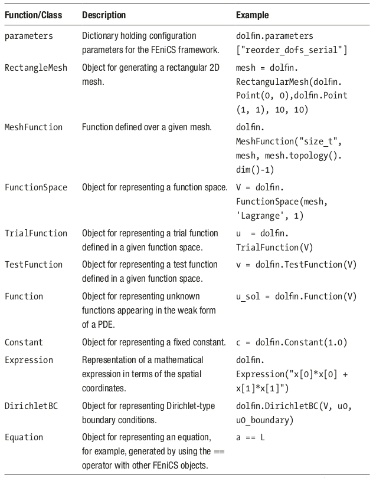
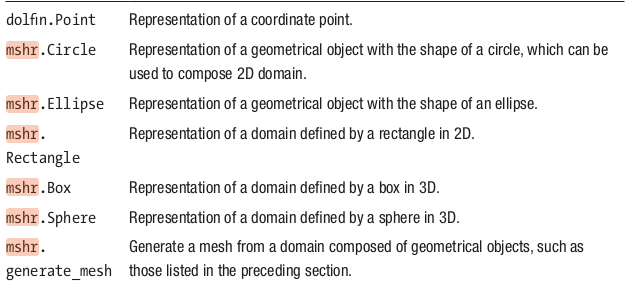

### Chapter 11: Partial differential equations (PDEs)
* multivariate equations with derivatives of >1 dependent variables (ie, derivatives in equation are partial derivatives)
 Two common techniques: 1) finite-difference methods (FDMs: derivatives are approximated), and 2) finite-element methods (FEMs - unknown funct written as linear combination of simple basis functions)
* PDE solvers == **much** more computationally demanding due to #points expanding exponentially with #dimensions. Heavy reliance on sparse matrix operations


```python
import numpy as np
```


```python
%matplotlib inline
%config InlineBackend.figure_format='retina'
import matplotlib.pyplot as plt
import matplotlib as mpl
import mpl_toolkits.mplot3d
```


```python
import scipy.sparse as sp
import scipy.sparse.linalg
import scipy.linalg as la
```


```python
# FEniCS FEM framework
import dolfin
import mshr
```


    ---------------------------------------------------------------------------

    ModuleNotFoundError                       Traceback (most recent call last)

    Cell In[4], line 2
          1 # FEniCS FEM framework
    ----> 2 import dolfin
          3 import mshr


    ModuleNotFoundError: No module named 'dolfin'


- typical use case: heat equations (2D cartesian coordinates, where $u=(t,x,y)$ describes temperature at a spatial & temporal point.
- To specify a PDE solution we need to define its *boundary conditions*, and initial values (if the problem is time-dependent.)
- Two important types of boundary conditions:
    - **Dirichlet** (describes function values at the boundary)
    - **Neumann** (describes a normal derivative at the boundary).

### Finite-difference methods
- Basic idea: *approximate the derivatives with their finite-difference formulas on a discretized space*. Assuming sufficient granularity, FD formulas can provide good approximations.
- Replacing ODE/PDE derivatives with FD formulas recasts the equations as algebraic equations. If the original ODE/PDE is linear, so is the algebra.
- Example: Steady-state heat equation:
    $$u_{xx}=-5, u(x=0)=1, u(x=1)=2$$
    $$u_{xx}[n]=(u[n-1]-2u[n]+u[n+1])/dx^2$$


```python
N     = 5          # interior points
u0,u1 = 1,2        # function values at boundaries
dx    = 1.0/(N+1)  # spacing between neighboring points
```

- A describes the coupling of the equations for $u_n$ to values at neighboring points due to the finite-difference formula that was used to approximate the second-order derivative in the ODE. 
- The boundary values are included in $b$, which also contains the constant right-hand side of the original ODE (the source term).
- We can solve $Au = b$ for u and thereby get the approximate values of the u(x) at the discrete points ${x_n}$.


```python
# equation for interior points = Au=b
A = ((np.eye(N, k=-1) - 2*np.eye(N) + np.eye(N, k=1))) / dx**2
A
```


    array([[-72.,  36.,   0.,   0.,   0.],
           [ 36., -72.,  36.,   0.,   0.],
           [  0.,  36., -72.,  36.,   0.],
           [  0.,   0.,  36., -72.,  36.],
           [  0.,   0.,   0.,  36., -72.]])


- Next: define an array for the vector b, which corresponds to the source term –5 in the differential equation, as well as the boundary condition. 
- The boundary conditions enter into the equations via the FD expressions for the derivatives of the first and the last equation ( $u_1$ and $u_N$), but these terms are missing from the expression represented by A and must be added to b.


```python
# define b (a vector)
b       = -5*np.ones(N)
b[0]   -= u0/dx**2
b[N-1] -= u1/dx**2
b
```


    array([-41.,  -5.,  -5.,  -5., -77.])


```python
# apply SciPy linear equation solver (can also use np.linalg.solve)
u = np.linalg.solve(A,b); print(u)
```

    [1.51388889 1.88888889 2.125      2.22222222 2.18055556]


- This completes the solution of this ODE. To visualize the solution, create an array x that contains the discrete coordinate points for which we have solved the problem, including the boundary points.
- Also create an array U that combines the boundary values and the interior points in one array.


```python
x = np.linspace(0, 1, N+2)
U = np.hstack([[u0], u, [u1]])
```


```python
fig, ax = plt.subplots(figsize=(8, 4))
ax.plot(x, U)
ax.plot(x[1:-1], u, 'ks')
ax.set_xlim(0, 1)
ax.set_xlabel(r"$x$", fontsize=16)
ax.set_ylabel(r"$u(x)$", fontsize=16)
#fig.savefig("ch11-fdm-1d.pdf")
fig.tight_layout();
```


    

    


### Extending Finite Differences to 2D
- u = 2D array of unknown interior function values 
- laplace equation: $u_{xx} + u_{yy} = 0$
- boundary conditions:
    - $u(x=0)= 3$, $u(x=1)=-1$
    - $u(y=0)=-5$, $u(y=1)= 5$


```python
N = 100               # number of interior points
u0_t, u0_b = 5, -5    # boundary values of unit square
u0_l, u0_r = 3, -1
dx = 1.0/(N+1)        # separation betw uniformly spaced points
```


```python
# Construct A that describes FD system for a 2D PDE
# First, define 1D formula along one coordinate
A_1d = (sp.eye(N,k=-1) + sp.eye(N,k=1) - 4*sp.eye(N)) / (dx**2)
```


```python
# A = very sparse matrix (49.6K non-zero, 10e8 total)
A = sp.kron(sp.eye(N),A_1d) + (sp.eye(N**2,k=-N) + sp.eye(N**2,k=N)) / (dx**2)
A
```


    <10000x10000 sparse matrix of type '<class 'numpy.float64'>'
    	with 49600 stored elements in Compressed Sparse Row format>


```python
# sparsity
A.nnz * 1.0/ np.prod(A.shape) * 2000
```


    0.992


```python
# construct vector b from boundary conditions:
# create NxN of zeros & assign boundary conditions to edge elements
# then reshape to a N^2x1 vector for use in Av=b equation.
b = np.zeros((N, N))

b[0,  :] += u0_b # bottom
b[-1, :] += u0_t # top
b[:,  0] += u0_l # left
b[:, -1] += u0_r # right

b = b.reshape(N**2) / dx**2; b.shape
```


    (10000,)


```python
# solve for v, then reshape back to NxN
u = sp.linalg.spsolve(A,b).reshape(N, N)
u.shape
```


    (100, 100)


```python
# for plotting - combine u with boundary conditions
U = np.vstack(
    [np.ones((1,N+2))*u0_b,
     np.hstack([np.ones((N,1))*u0_l, 
                u, 
                np.ones((N,1))*u0_r]),
     np.ones((1,N+2))*u0_t])
```


```python
# plot 2D heat equation with Dirichlet boundary conditions
fig, ax = plt.subplots(1, 1, figsize=(8, 6))

x = np.linspace(0, 1, N+2)
X, Y = np.meshgrid(x, x)

c = ax.pcolor(X, Y, U, vmin=-5, vmax=5, cmap=mpl.cm.get_cmap('RdBu_r'))
cb = plt.colorbar(c, ax=ax)

ax.set_xlabel(r"$x_1$", fontsize=18)
ax.set_ylabel(r"$x_2$", fontsize=18)
cb.set_label(r"$u(x_1, x_2)$", fontsize=18)
#fig.savefig("ch11-fdm-2d.pdf")
fig.tight_layout()
```

    <ipython-input-18-87805b07d886>:7: MatplotlibDeprecationWarning: shading='flat' when X and Y have the same dimensions as C is deprecated since 3.3.  Either specify the corners of the quadrilaterals with X and Y, or pass shading='auto', 'nearest' or 'gouraud', or set rcParams['pcolor.shading'].  This will become an error two minor releases later.
      c = ax.pcolor(X, Y, U, vmin=-5, vmax=5, cmap=mpl.cm.get_cmap('RdBu_r'))


    

    


```python
# 3D surface map of solution
x    = np.linspace(0, 1, N+2)
X, Y = np.meshgrid(x, x)
fig  = plt.figure(figsize=(12, 5.5))
cmap = mpl.cm.get_cmap('RdBu_r')
ax   = fig.add_subplot(1, 2, 1)
p    = ax.pcolor(X, Y, U, vmin=-5, vmax=5, cmap=cmap)

ax.set_xlabel(r"$x_1$", fontsize=18)
ax.set_ylabel(r"$x_2$", fontsize=18)

ax = fig.add_subplot(1, 2, 2, projection='3d')
p  = ax.plot_surface(X, Y, U, vmin=-5, vmax=5, rstride=3, cstride=3, linewidth=0, cmap=cmap)
ax.set_xlabel(r"$x_1$", fontsize=16)
ax.set_ylabel(r"$x_2$", fontsize=16)
cb = plt.colorbar(p, ax=ax, shrink=0.75)
cb.set_label(r"$u(x_1, x_2)$", fontsize=18)

#fig.savefig("ch11-fdm-2d.pdf")
#fig.savefig("ch11-fdm-2d.png")
fig.tight_layout()
```

    <ipython-input-19-e28d100f7374>:7: MatplotlibDeprecationWarning: shading='flat' when X and Y have the same dimensions as C is deprecated since 3.3.  Either specify the corners of the quadrilaterals with X and Y, or pass shading='auto', 'nearest' or 'gouraud', or set rcParams['pcolor.shading'].  This will become an error two minor releases later.
      p    = ax.pcolor(X, Y, U, vmin=-5, vmax=5, cmap=cmap)


    

    


### Compare performance when using dense/sparse matrices


```python
A_dense = A.todense()
```


```python
dense_solver_time = %timeit np.linalg.solve(A_dense, b)
dense_solver_time
```

    4.91 s ± 103 ms per loop (mean ± std. dev. of 7 runs, 1 loop each)


```python
sparse_solver_time = %timeit sp.linalg.spsolve(A, b)
sparse_solver_time
```

    69.1 ms ± 2.46 ms per loop (mean ± std. dev. of 7 runs, 10 loops each)


- The finite-difference method that we used in the last two examples is a powerful and relatively simple method for solving ODE boundary value problems and PDE problems with simple geometries. 
- However, it is not so easily adapted to problems on more complicated domains or problems on nonuniform coordinate grids. For such problems finite-element methods are typically more flexible and convenient to work with, and although FEMs are conceptually more complicated than FDMs, they can be computationally efficient and adapt well to complicated problem domains and more involved boundary conditions.

### Finite-Element Methods
- A strategy for converting PDEs into algebra
- Idea: represent domain with a set of discrete regions (elements) & approximate the unknown function as a *linear combination of basis functions*
- In practice, a very large number of basis functions can be required to obtain a good approximation to the exact solution, and the linear equation system generated by FEMs is therefore often very large. However, the fact that each basis function has support only at one or a few nearby elements in the discretization of the problem domain ensures that the matrix A is sparse, which makes it tractable to solve.
- Typical examples of basis functions are low-order polynomials that are nonzero only within a single element.

- When using FEM to solve a PDE, you typically need to convert the PDE to weak form by hand, and rewrite it in bilinear form: *a(u,v)=L(v)*.
- You'll also need to discretize the problem, ie "mesh it". There are tools for auto-generating meshes for simplier geometries.

### FEM Libraries
- [FiPy](http://www.ctcms.nist.gov/fipy)
- [SfePy](http://sfepy.org)
- **FEniCS** (used in this example)
    - [dolfin](): Python interface to FEniCS
    - [mshr](): mesh generation library
    
### Dolfin functions/classes




### Setup
- reconsider steady-state 2D heat equation previously solved.
- assume boundary conditions: 
    - u(x=0,y) = u(x=1,y) = 0
    - u(x,y=0) = u(x,y=1) = 0
- first step: define discretization mesh. In this simple case, use a *unit square* as the problem domain. Use **RectangleMesh** to generate it.


```python
# dolfin configuration
dolfin.parameters["reorder_dofs_serial"] = False
dolfin.parameters["allow_extrapolation"] = True
```


```python
N1 = N2 = 75
mesh = dolfin.RectangleMesh(
    dolfin.Point(0,0),
    dolfin.Point(1,1),N1,N2)
mesh
```


<!DOCTYPE html>
<html>
  <head>
    <meta http-equiv="content-type" content="text/html;charset=UTF-8" />
    <meta name="generator" content="FEniCS/DOLFIN (http://fenicsproject.org)" />
    <title>FEniCS/DOLFIN X3DOM plot</title>
    <script type="text/javascript" src="https://www.x3dom.org/download/x3dom.js"></script>
    <script type="text/javascript" src="https://code.jquery.com/jquery-3.1.0.js"></script>
    <script type="text/javascript" src="https://rawgit.com/plscott/fenics-x3dom/master/x3dom_support.js"></script>
    <link rel="stylesheet" type="text/css" href="https://www.x3dom.org/download/x3dom.css" />
    <link rel="stylesheet" type="text/css" href="https://rawgit.com/plscott/fenics-x3dom/master/x3dom_support.css" />
  </head>
  <body>
    <x3d showStat="false" xmlns="http://www.web3d.org/specifications/x3d-namespace" width="500.000000px" height="400.000000px">
      <scene>
        <shape>
          <appearance>
            <material diffuseColor="1.000000 1.000000 1.000000" emissiveColor="0.000000 0.000000 0.000000" specularColor="0.000000 0.000000 0.000000" ambientIntensity="0" shininess="0.5" transparency="0"></material>
          </appearance>
          <indexedFaceSet solid="false" colorPerVertex="false" coordIndex="0 77 1 -1 0 77 76 -1 1 78 2 -1 1 78 77 -1 2 79 3 -1 2 79 78 -1 3 80 4 -1 3 80 79 -1 4 81 5 -1 4 81 80 -1 5 82 6 -1 5 82 81 -1 6 83 7 -1 6 83 82 -1 7 84 8 -1 7 84 83 -1 8 85 9 -1 8 85 84 -1 9 86 10 -1 9 86 85 -1 10 87 11 -1 10 87 86 -1 11 88 12 -1 11 88 87 -1 12 89 13 -1 12 89 88 -1 13 90 14 -1 13 90 89 -1 14 91 15 -1 14 91 90 -1 15 92 16 -1 15 92 91 -1 16 93 17 -1 16 93 92 -1 17 94 18 -1 17 94 93 -1 18 95 19 -1 18 95 94 -1 19 96 20 -1 19 96 95 -1 20 97 21 -1 20 97 96 -1 21 98 22 -1 21 98 97 -1 22 99 23 -1 22 99 98 -1 23 100 24 -1 23 100 99 -1 24 101 25 -1 24 101 100 -1 25 102 26 -1 25 102 101 -1 26 103 27 -1 26 103 102 -1 27 104 28 -1 27 104 103 -1 28 105 29 -1 28 105 104 -1 29 106 30 -1 29 106 105 -1 30 107 31 -1 30 107 106 -1 31 108 32 -1 31 108 107 -1 32 109 33 -1 32 109 108 -1 33 110 34 -1 33 110 109 -1 34 111 35 -1 34 111 110 -1 35 112 36 -1 35 112 111 -1 36 113 37 -1 36 113 112 -1 37 114 38 -1 37 114 113 -1 38 115 39 -1 38 115 114 -1 39 116 40 -1 39 116 115 -1 40 117 41 -1 40 117 116 -1 41 118 42 -1 41 118 117 -1 42 119 43 -1 42 119 118 -1 43 120 44 -1 43 120 119 -1 44 121 45 -1 44 121 120 -1 45 122 46 -1 45 122 121 -1 46 123 47 -1 46 123 122 -1 47 124 48 -1 47 124 123 -1 48 125 49 -1 48 125 124 -1 49 126 50 -1 49 126 125 -1 50 127 51 -1 50 127 126 -1 51 128 52 -1 51 128 127 -1 52 129 53 -1 52 129 128 -1 53 130 54 -1 53 130 129 -1 54 131 55 -1 54 131 130 -1 55 132 56 -1 55 132 131 -1 56 133 57 -1 56 133 132 -1 57 134 58 -1 57 134 133 -1 58 135 59 -1 58 135 134 -1 59 136 60 -1 59 136 135 -1 60 137 61 -1 60 137 136 -1 61 138 62 -1 61 138 137 -1 62 139 63 -1 62 139 138 -1 63 140 64 -1 63 140 139 -1 64 141 65 -1 64 141 140 -1 65 142 66 -1 65 142 141 -1 66 143 67 -1 66 143 142 -1 67 144 68 -1 67 144 143 -1 68 145 69 -1 68 145 144 -1 69 146 70 -1 69 146 145 -1 70 147 71 -1 70 147 146 -1 71 148 72 -1 71 148 147 -1 72 149 73 -1 72 149 148 -1 73 150 74 -1 73 150 149 -1 74 151 75 -1 74 151 150 -1 76 153 77 -1 76 153 152 -1 77 154 78 -1 77 154 153 -1 78 155 79 -1 78 155 154 -1 79 156 80 -1 79 156 155 -1 80 157 81 -1 80 157 156 -1 81 158 82 -1 81 158 157 -1 82 159 83 -1 82 159 158 -1 83 160 84 -1 83 160 159 -1 84 161 85 -1 84 161 160 -1 85 162 86 -1 85 162 161 -1 86 163 87 -1 86 163 162 -1 87 164 88 -1 87 164 163 -1 88 165 89 -1 88 165 164 -1 89 166 90 -1 89 166 165 -1 90 167 91 -1 90 167 166 -1 91 168 92 -1 91 168 167 -1 92 169 93 -1 92 169 168 -1 93 170 94 -1 93 170 169 -1 94 171 95 -1 94 171 170 -1 95 172 96 -1 95 172 171 -1 96 173 97 -1 96 173 172 -1 97 174 98 -1 97 174 173 -1 98 175 99 -1 98 175 174 -1 99 176 100 -1 99 176 175 -1 100 177 101 -1 100 177 176 -1 101 178 102 -1 101 178 177 -1 102 179 103 -1 102 179 178 -1 103 180 104 -1 103 180 179 -1 104 181 105 -1 104 181 180 -1 105 182 106 -1 105 182 181 -1 106 183 107 -1 106 183 182 -1 107 184 108 -1 107 184 183 -1 108 185 109 -1 108 185 184 -1 109 186 110 -1 109 186 185 -1 110 187 111 -1 110 187 186 -1 111 188 112 -1 111 188 187 -1 112 189 113 -1 112 189 188 -1 113 190 114 -1 113 190 189 -1 114 191 115 -1 114 191 190 -1 115 192 116 -1 115 192 191 -1 116 193 117 -1 116 193 192 -1 117 194 118 -1 117 194 193 -1 118 195 119 -1 118 195 194 -1 119 196 120 -1 119 196 195 -1 120 197 121 -1 120 197 196 -1 121 198 122 -1 121 198 197 -1 122 199 123 -1 122 199 198 -1 123 200 124 -1 123 200 199 -1 124 201 125 -1 124 201 200 -1 125 202 126 -1 125 202 201 -1 126 203 127 -1 126 203 202 -1 127 204 128 -1 127 204 203 -1 128 205 129 -1 128 205 204 -1 129 206 130 -1 129 206 205 -1 130 207 131 -1 130 207 206 -1 131 208 132 -1 131 208 207 -1 132 209 133 -1 132 209 208 -1 133 210 134 -1 133 210 209 -1 134 211 135 -1 134 211 210 -1 135 212 136 -1 135 212 211 -1 136 213 137 -1 136 213 212 -1 137 214 138 -1 137 214 213 -1 138 215 139 -1 138 215 214 -1 139 216 140 -1 139 216 215 -1 140 217 141 -1 140 217 216 -1 141 218 142 -1 141 218 217 -1 142 219 143 -1 142 219 218 -1 143 220 144 -1 143 220 219 -1 144 221 145 -1 144 221 220 -1 145 222 146 -1 145 222 221 -1 146 223 147 -1 146 223 222 -1 147 224 148 -1 147 224 223 -1 148 225 149 -1 148 225 224 -1 149 226 150 -1 149 226 225 -1 150 227 151 -1 150 227 226 -1 152 229 153 -1 152 229 228 -1 153 230 154 -1 153 230 229 -1 154 231 155 -1 154 231 230 -1 155 232 156 -1 155 232 231 -1 156 233 157 -1 156 233 232 -1 157 234 158 -1 157 234 233 -1 158 235 159 -1 158 235 234 -1 159 236 160 -1 159 236 235 -1 160 237 161 -1 160 237 236 -1 161 238 162 -1 161 238 237 -1 162 239 163 -1 162 239 238 -1 163 240 164 -1 163 240 239 -1 164 241 165 -1 164 241 240 -1 165 242 166 -1 165 242 241 -1 166 243 167 -1 166 243 242 -1 167 244 168 -1 167 244 243 -1 168 245 169 -1 168 245 244 -1 169 246 170 -1 169 246 245 -1 170 247 171 -1 170 247 246 -1 171 248 172 -1 171 248 247 -1 172 249 173 -1 172 249 248 -1 173 250 174 -1 173 250 249 -1 174 251 175 -1 174 251 250 -1 175 252 176 -1 175 252 251 -1 176 253 177 -1 176 253 252 -1 177 254 178 -1 177 254 253 -1 178 255 179 -1 178 255 254 -1 179 256 180 -1 179 256 255 -1 180 257 181 -1 180 257 256 -1 181 258 182 -1 181 258 257 -1 182 259 183 -1 182 259 258 -1 183 260 184 -1 183 260 259 -1 184 261 185 -1 184 261 260 -1 185 262 186 -1 185 262 261 -1 186 263 187 -1 186 263 262 -1 187 264 188 -1 187 264 263 -1 188 265 189 -1 188 265 264 -1 189 266 190 -1 189 266 265 -1 190 267 191 -1 190 267 266 -1 191 268 192 -1 191 268 267 -1 192 269 193 -1 192 269 268 -1 193 270 194 -1 193 270 269 -1 194 271 195 -1 194 271 270 -1 195 272 196 -1 195 272 271 -1 196 273 197 -1 196 273 272 -1 197 274 198 -1 197 274 273 -1 198 275 199 -1 198 275 274 -1 199 276 200 -1 199 276 275 -1 200 277 201 -1 200 277 276 -1 201 278 202 -1 201 278 277 -1 202 279 203 -1 202 279 278 -1 203 280 204 -1 203 280 279 -1 204 281 205 -1 204 281 280 -1 205 282 206 -1 205 282 281 -1 206 283 207 -1 206 283 282 -1 207 284 208 -1 207 284 283 -1 208 285 209 -1 208 285 284 -1 209 286 210 -1 209 286 285 -1 210 287 211 -1 210 287 286 -1 211 288 212 -1 211 288 287 -1 212 289 213 -1 212 289 288 -1 213 290 214 -1 213 290 289 -1 214 291 215 -1 214 291 290 -1 215 292 216 -1 215 292 291 -1 216 293 217 -1 216 293 292 -1 217 294 218 -1 217 294 293 -1 218 295 219 -1 218 295 294 -1 219 296 220 -1 219 296 295 -1 220 297 221 -1 220 297 296 -1 221 298 222 -1 221 298 297 -1 222 299 223 -1 222 299 298 -1 223 300 224 -1 223 300 299 -1 224 301 225 -1 224 301 300 -1 225 302 226 -1 225 302 301 -1 226 303 227 -1 226 303 302 -1 228 305 229 -1 228 305 304 -1 229 306 230 -1 229 306 305 -1 230 307 231 -1 230 307 306 -1 231 308 232 -1 231 308 307 -1 232 309 233 -1 232 309 308 -1 233 310 234 -1 233 310 309 -1 234 311 235 -1 234 311 310 -1 235 312 236 -1 235 312 311 -1 236 313 237 -1 236 313 312 -1 237 314 238 -1 237 314 313 -1 238 315 239 -1 238 315 314 -1 239 316 240 -1 239 316 315 -1 240 317 241 -1 240 317 316 -1 241 318 242 -1 241 318 317 -1 242 319 243 -1 242 319 318 -1 243 320 244 -1 243 320 319 -1 244 321 245 -1 244 321 320 -1 245 322 246 -1 245 322 321 -1 246 323 247 -1 246 323 322 -1 247 324 248 -1 247 324 323 -1 248 325 249 -1 248 325 324 -1 249 326 250 -1 249 326 325 -1 250 327 251 -1 250 327 326 -1 251 328 252 -1 251 328 327 -1 252 329 253 -1 252 329 328 -1 253 330 254 -1 253 330 329 -1 254 331 255 -1 254 331 330 -1 255 332 256 -1 255 332 331 -1 256 333 257 -1 256 333 332 -1 257 334 258 -1 257 334 333 -1 258 335 259 -1 258 335 334 -1 259 336 260 -1 259 336 335 -1 260 337 261 -1 260 337 336 -1 261 338 262 -1 261 338 337 -1 262 339 263 -1 262 339 338 -1 263 340 264 -1 263 340 339 -1 264 341 265 -1 264 341 340 -1 265 342 266 -1 265 342 341 -1 266 343 267 -1 266 343 342 -1 267 344 268 -1 267 344 343 -1 268 345 269 -1 268 345 344 -1 269 346 270 -1 269 346 345 -1 270 347 271 -1 270 347 346 -1 271 348 272 -1 271 348 347 -1 272 349 273 -1 272 349 348 -1 273 350 274 -1 273 350 349 -1 274 351 275 -1 274 351 350 -1 275 352 276 -1 275 352 351 -1 276 353 277 -1 276 353 352 -1 277 354 278 -1 277 354 353 -1 278 355 279 -1 278 355 354 -1 279 356 280 -1 279 356 355 -1 280 357 281 -1 280 357 356 -1 281 358 282 -1 281 358 357 -1 282 359 283 -1 282 359 358 -1 283 360 284 -1 283 360 359 -1 284 361 285 -1 284 361 360 -1 285 362 286 -1 285 362 361 -1 286 363 287 -1 286 363 362 -1 287 364 288 -1 287 364 363 -1 288 365 289 -1 288 365 364 -1 289 366 290 -1 289 366 365 -1 290 367 291 -1 290 367 366 -1 291 368 292 -1 291 368 367 -1 292 369 293 -1 292 369 368 -1 293 370 294 -1 293 370 369 -1 294 371 295 -1 294 371 370 -1 295 372 296 -1 295 372 371 -1 296 373 297 -1 296 373 372 -1 297 374 298 -1 297 374 373 -1 298 375 299 -1 298 375 374 -1 299 376 300 -1 299 376 375 -1 300 377 301 -1 300 377 376 -1 301 378 302 -1 301 378 377 -1 302 379 303 -1 302 379 378 -1 304 381 305 -1 304 381 380 -1 305 382 306 -1 305 382 381 -1 306 383 307 -1 306 383 382 -1 307 384 308 -1 307 384 383 -1 308 385 309 -1 308 385 384 -1 309 386 310 -1 309 386 385 -1 310 387 311 -1 310 387 386 -1 311 388 312 -1 311 388 387 -1 312 389 313 -1 312 389 388 -1 313 390 314 -1 313 390 389 -1 314 391 315 -1 314 391 390 -1 315 392 316 -1 315 392 391 -1 316 393 317 -1 316 393 392 -1 317 394 318 -1 317 394 393 -1 318 395 319 -1 318 395 394 -1 319 396 320 -1 319 396 395 -1 320 397 321 -1 320 397 396 -1 321 398 322 -1 321 398 397 -1 322 399 323 -1 322 399 398 -1 323 400 324 -1 323 400 399 -1 324 401 325 -1 324 401 400 -1 325 402 326 -1 325 402 401 -1 326 403 327 -1 326 403 402 -1 327 404 328 -1 327 404 403 -1 328 405 329 -1 328 405 404 -1 329 406 330 -1 329 406 405 -1 330 407 331 -1 330 407 406 -1 331 408 332 -1 331 408 407 -1 332 409 333 -1 332 409 408 -1 333 410 334 -1 333 410 409 -1 334 411 335 -1 334 411 410 -1 335 412 336 -1 335 412 411 -1 336 413 337 -1 336 413 412 -1 337 414 338 -1 337 414 413 -1 338 415 339 -1 338 415 414 -1 339 416 340 -1 339 416 415 -1 340 417 341 -1 340 417 416 -1 341 418 342 -1 341 418 417 -1 342 419 343 -1 342 419 418 -1 343 420 344 -1 343 420 419 -1 344 421 345 -1 344 421 420 -1 345 422 346 -1 345 422 421 -1 346 423 347 -1 346 423 422 -1 347 424 348 -1 347 424 423 -1 348 425 349 -1 348 425 424 -1 349 426 350 -1 349 426 425 -1 350 427 351 -1 350 427 426 -1 351 428 352 -1 351 428 427 -1 352 429 353 -1 352 429 428 -1 353 430 354 -1 353 430 429 -1 354 431 355 -1 354 431 430 -1 355 432 356 -1 355 432 431 -1 356 433 357 -1 356 433 432 -1 357 434 358 -1 357 434 433 -1 358 435 359 -1 358 435 434 -1 359 436 360 -1 359 436 435 -1 360 437 361 -1 360 437 436 -1 361 438 362 -1 361 438 437 -1 362 439 363 -1 362 439 438 -1 363 440 364 -1 363 440 439 -1 364 441 365 -1 364 441 440 -1 365 442 366 -1 365 442 441 -1 366 443 367 -1 366 443 442 -1 367 444 368 -1 367 444 443 -1 368 445 369 -1 368 445 444 -1 369 446 370 -1 369 446 445 -1 370 447 371 -1 370 447 446 -1 371 448 372 -1 371 448 447 -1 372 449 373 -1 372 449 448 -1 373 450 374 -1 373 450 449 -1 374 451 375 -1 374 451 450 -1 375 452 376 -1 375 452 451 -1 376 453 377 -1 376 453 452 -1 377 454 378 -1 377 454 453 -1 378 455 379 -1 378 455 454 -1 380 457 381 -1 380 457 456 -1 381 458 382 -1 381 458 457 -1 382 459 383 -1 382 459 458 -1 383 460 384 -1 383 460 459 -1 384 461 385 -1 384 461 460 -1 385 462 386 -1 385 462 461 -1 386 463 387 -1 386 463 462 -1 387 464 388 -1 387 464 463 -1 388 465 389 -1 388 465 464 -1 389 466 390 -1 389 466 465 -1 390 467 391 -1 390 467 466 -1 391 468 392 -1 391 468 467 -1 392 469 393 -1 392 469 468 -1 393 470 394 -1 393 470 469 -1 394 471 395 -1 394 471 470 -1 395 472 396 -1 395 472 471 -1 396 473 397 -1 396 473 472 -1 397 474 398 -1 397 474 473 -1 398 475 399 -1 398 475 474 -1 399 476 400 -1 399 476 475 -1 400 477 401 -1 400 477 476 -1 401 478 402 -1 401 478 477 -1 402 479 403 -1 402 479 478 -1 403 480 404 -1 403 480 479 -1 404 481 405 -1 404 481 480 -1 405 482 406 -1 405 482 481 -1 406 483 407 -1 406 483 482 -1 407 484 408 -1 407 484 483 -1 408 485 409 -1 408 485 484 -1 409 486 410 -1 409 486 485 -1 410 487 411 -1 410 487 486 -1 411 488 412 -1 411 488 487 -1 412 489 413 -1 412 489 488 -1 413 490 414 -1 413 490 489 -1 414 491 415 -1 414 491 490 -1 415 492 416 -1 415 492 491 -1 416 493 417 -1 416 493 492 -1 417 494 418 -1 417 494 493 -1 418 495 419 -1 418 495 494 -1 419 496 420 -1 419 496 495 -1 420 497 421 -1 420 497 496 -1 421 498 422 -1 421 498 497 -1 422 499 423 -1 422 499 498 -1 423 500 424 -1 423 500 499 -1 424 501 425 -1 424 501 500 -1 425 502 426 -1 425 502 501 -1 426 503 427 -1 426 503 502 -1 427 504 428 -1 427 504 503 -1 428 505 429 -1 428 505 504 -1 429 506 430 -1 429 506 505 -1 430 507 431 -1 430 507 506 -1 431 508 432 -1 431 508 507 -1 432 509 433 -1 432 509 508 -1 433 510 434 -1 433 510 509 -1 434 511 435 -1 434 511 510 -1 435 512 436 -1 435 512 511 -1 436 513 437 -1 436 513 512 -1 437 514 438 -1 437 514 513 -1 438 515 439 -1 438 515 514 -1 439 516 440 -1 439 516 515 -1 440 517 441 -1 440 517 516 -1 441 518 442 -1 441 518 517 -1 442 519 443 -1 442 519 518 -1 443 520 444 -1 443 520 519 -1 444 521 445 -1 444 521 520 -1 445 522 446 -1 445 522 521 -1 446 523 447 -1 446 523 522 -1 447 524 448 -1 447 524 523 -1 448 525 449 -1 448 525 524 -1 449 526 450 -1 449 526 525 -1 450 527 451 -1 450 527 526 -1 451 528 452 -1 451 528 527 -1 452 529 453 -1 452 529 528 -1 453 530 454 -1 453 530 529 -1 454 531 455 -1 454 531 530 -1 456 533 457 -1 456 533 532 -1 457 534 458 -1 457 534 533 -1 458 535 459 -1 458 535 534 -1 459 536 460 -1 459 536 535 -1 460 537 461 -1 460 537 536 -1 461 538 462 -1 461 538 537 -1 462 539 463 -1 462 539 538 -1 463 540 464 -1 463 540 539 -1 464 541 465 -1 464 541 540 -1 465 542 466 -1 465 542 541 -1 466 543 467 -1 466 543 542 -1 467 544 468 -1 467 544 543 -1 468 545 469 -1 468 545 544 -1 469 546 470 -1 469 546 545 -1 470 547 471 -1 470 547 546 -1 471 548 472 -1 471 548 547 -1 472 549 473 -1 472 549 548 -1 473 550 474 -1 473 550 549 -1 474 551 475 -1 474 551 550 -1 475 552 476 -1 475 552 551 -1 476 553 477 -1 476 553 552 -1 477 554 478 -1 477 554 553 -1 478 555 479 -1 478 555 554 -1 479 556 480 -1 479 556 555 -1 480 557 481 -1 480 557 556 -1 481 558 482 -1 481 558 557 -1 482 559 483 -1 482 559 558 -1 483 560 484 -1 483 560 559 -1 484 561 485 -1 484 561 560 -1 485 562 486 -1 485 562 561 -1 486 563 487 -1 486 563 562 -1 487 564 488 -1 487 564 563 -1 488 565 489 -1 488 565 564 -1 489 566 490 -1 489 566 565 -1 490 567 491 -1 490 567 566 -1 491 568 492 -1 491 568 567 -1 492 569 493 -1 492 569 568 -1 493 570 494 -1 493 570 569 -1 494 571 495 -1 494 571 570 -1 495 572 496 -1 495 572 571 -1 496 573 497 -1 496 573 572 -1 497 574 498 -1 497 574 573 -1 498 575 499 -1 498 575 574 -1 499 576 500 -1 499 576 575 -1 500 577 501 -1 500 577 576 -1 501 578 502 -1 501 578 577 -1 502 579 503 -1 502 579 578 -1 503 580 504 -1 503 580 579 -1 504 581 505 -1 504 581 580 -1 505 582 506 -1 505 582 581 -1 506 583 507 -1 506 583 582 -1 507 584 508 -1 507 584 583 -1 508 585 509 -1 508 585 584 -1 509 586 510 -1 509 586 585 -1 510 587 511 -1 510 587 586 -1 511 588 512 -1 511 588 587 -1 512 589 513 -1 512 589 588 -1 513 590 514 -1 513 590 589 -1 514 591 515 -1 514 591 590 -1 515 592 516 -1 515 592 591 -1 516 593 517 -1 516 593 592 -1 517 594 518 -1 517 594 593 -1 518 595 519 -1 518 595 594 -1 519 596 520 -1 519 596 595 -1 520 597 521 -1 520 597 596 -1 521 598 522 -1 521 598 597 -1 522 599 523 -1 522 599 598 -1 523 600 524 -1 523 600 599 -1 524 601 525 -1 524 601 600 -1 525 602 526 -1 525 602 601 -1 526 603 527 -1 526 603 602 -1 527 604 528 -1 527 604 603 -1 528 605 529 -1 528 605 604 -1 529 606 530 -1 529 606 605 -1 530 607 531 -1 530 607 606 -1 532 609 533 -1 532 609 608 -1 533 610 534 -1 533 610 609 -1 534 611 535 -1 534 611 610 -1 535 612 536 -1 535 612 611 -1 536 613 537 -1 536 613 612 -1 537 614 538 -1 537 614 613 -1 538 615 539 -1 538 615 614 -1 539 616 540 -1 539 616 615 -1 540 617 541 -1 540 617 616 -1 541 618 542 -1 541 618 617 -1 542 619 543 -1 542 619 618 -1 543 620 544 -1 543 620 619 -1 544 621 545 -1 544 621 620 -1 545 622 546 -1 545 622 621 -1 546 623 547 -1 546 623 622 -1 547 624 548 -1 547 624 623 -1 548 625 549 -1 548 625 624 -1 549 626 550 -1 549 626 625 -1 550 627 551 -1 550 627 626 -1 551 628 552 -1 551 628 627 -1 552 629 553 -1 552 629 628 -1 553 630 554 -1 553 630 629 -1 554 631 555 -1 554 631 630 -1 555 632 556 -1 555 632 631 -1 556 633 557 -1 556 633 632 -1 557 634 558 -1 557 634 633 -1 558 635 559 -1 558 635 634 -1 559 636 560 -1 559 636 635 -1 560 637 561 -1 560 637 636 -1 561 638 562 -1 561 638 637 -1 562 639 563 -1 562 639 638 -1 563 640 564 -1 563 640 639 -1 564 641 565 -1 564 641 640 -1 565 642 566 -1 565 642 641 -1 566 643 567 -1 566 643 642 -1 567 644 568 -1 567 644 643 -1 568 645 569 -1 568 645 644 -1 569 646 570 -1 569 646 645 -1 570 647 571 -1 570 647 646 -1 571 648 572 -1 571 648 647 -1 572 649 573 -1 572 649 648 -1 573 650 574 -1 573 650 649 -1 574 651 575 -1 574 651 650 -1 575 652 576 -1 575 652 651 -1 576 653 577 -1 576 653 652 -1 577 654 578 -1 577 654 653 -1 578 655 579 -1 578 655 654 -1 579 656 580 -1 579 656 655 -1 580 657 581 -1 580 657 656 -1 581 658 582 -1 581 658 657 -1 582 659 583 -1 582 659 658 -1 583 660 584 -1 583 660 659 -1 584 661 585 -1 584 661 660 -1 585 662 586 -1 585 662 661 -1 586 663 587 -1 586 663 662 -1 587 664 588 -1 587 664 663 -1 588 665 589 -1 588 665 664 -1 589 666 590 -1 589 666 665 -1 590 667 591 -1 590 667 666 -1 591 668 592 -1 591 668 667 -1 592 669 593 -1 592 669 668 -1 593 670 594 -1 593 670 669 -1 594 671 595 -1 594 671 670 -1 595 672 596 -1 595 672 671 -1 596 673 597 -1 596 673 672 -1 597 674 598 -1 597 674 673 -1 598 675 599 -1 598 675 674 -1 599 676 600 -1 599 676 675 -1 600 677 601 -1 600 677 676 -1 601 678 602 -1 601 678 677 -1 602 679 603 -1 602 679 678 -1 603 680 604 -1 603 680 679 -1 604 681 605 -1 604 681 680 -1 605 682 606 -1 605 682 681 -1 606 683 607 -1 606 683 682 -1 608 685 609 -1 608 685 684 -1 609 686 610 -1 609 686 685 -1 610 687 611 -1 610 687 686 -1 611 688 612 -1 611 688 687 -1 612 689 613 -1 612 689 688 -1 613 690 614 -1 613 690 689 -1 614 691 615 -1 614 691 690 -1 615 692 616 -1 615 692 691 -1 616 693 617 -1 616 693 692 -1 617 694 618 -1 617 694 693 -1 618 695 619 -1 618 695 694 -1 619 696 620 -1 619 696 695 -1 620 697 621 -1 620 697 696 -1 621 698 622 -1 621 698 697 -1 622 699 623 -1 622 699 698 -1 623 700 624 -1 623 700 699 -1 624 701 625 -1 624 701 700 -1 625 702 626 -1 625 702 701 -1 626 703 627 -1 626 703 702 -1 627 704 628 -1 627 704 703 -1 628 705 629 -1 628 705 704 -1 629 706 630 -1 629 706 705 -1 630 707 631 -1 630 707 706 -1 631 708 632 -1 631 708 707 -1 632 709 633 -1 632 709 708 -1 633 710 634 -1 633 710 709 -1 634 711 635 -1 634 711 710 -1 635 712 636 -1 635 712 711 -1 636 713 637 -1 636 713 712 -1 637 714 638 -1 637 714 713 -1 638 715 639 -1 638 715 714 -1 639 716 640 -1 639 716 715 -1 640 717 641 -1 640 717 716 -1 641 718 642 -1 641 718 717 -1 642 719 643 -1 642 719 718 -1 643 720 644 -1 643 720 719 -1 644 721 645 -1 644 721 720 -1 645 722 646 -1 645 722 721 -1 646 723 647 -1 646 723 722 -1 647 724 648 -1 647 724 723 -1 648 725 649 -1 648 725 724 -1 649 726 650 -1 649 726 725 -1 650 727 651 -1 650 727 726 -1 651 728 652 -1 651 728 727 -1 652 729 653 -1 652 729 728 -1 653 730 654 -1 653 730 729 -1 654 731 655 -1 654 731 730 -1 655 732 656 -1 655 732 731 -1 656 733 657 -1 656 733 732 -1 657 734 658 -1 657 734 733 -1 658 735 659 -1 658 735 734 -1 659 736 660 -1 659 736 735 -1 660 737 661 -1 660 737 736 -1 661 738 662 -1 661 738 737 -1 662 739 663 -1 662 739 738 -1 663 740 664 -1 663 740 739 -1 664 741 665 -1 664 741 740 -1 665 742 666 -1 665 742 741 -1 666 743 667 -1 666 743 742 -1 667 744 668 -1 667 744 743 -1 668 745 669 -1 668 745 744 -1 669 746 670 -1 669 746 745 -1 670 747 671 -1 670 747 746 -1 671 748 672 -1 671 748 747 -1 672 749 673 -1 672 749 748 -1 673 750 674 -1 673 750 749 -1 674 751 675 -1 674 751 750 -1 675 752 676 -1 675 752 751 -1 676 753 677 -1 676 753 752 -1 677 754 678 -1 677 754 753 -1 678 755 679 -1 678 755 754 -1 679 756 680 -1 679 756 755 -1 680 757 681 -1 680 757 756 -1 681 758 682 -1 681 758 757 -1 682 759 683 -1 682 759 758 -1 684 761 685 -1 684 761 760 -1 685 762 686 -1 685 762 761 -1 686 763 687 -1 686 763 762 -1 687 764 688 -1 687 764 763 -1 688 765 689 -1 688 765 764 -1 689 766 690 -1 689 766 765 -1 690 767 691 -1 690 767 766 -1 691 768 692 -1 691 768 767 -1 692 769 693 -1 692 769 768 -1 693 770 694 -1 693 770 769 -1 694 771 695 -1 694 771 770 -1 695 772 696 -1 695 772 771 -1 696 773 697 -1 696 773 772 -1 697 774 698 -1 697 774 773 -1 698 775 699 -1 698 775 774 -1 699 776 700 -1 699 776 775 -1 700 777 701 -1 700 777 776 -1 701 778 702 -1 701 778 777 -1 702 779 703 -1 702 779 778 -1 703 780 704 -1 703 780 779 -1 704 781 705 -1 704 781 780 -1 705 782 706 -1 705 782 781 -1 706 783 707 -1 706 783 782 -1 707 784 708 -1 707 784 783 -1 708 785 709 -1 708 785 784 -1 709 786 710 -1 709 786 785 -1 710 787 711 -1 710 787 786 -1 711 788 712 -1 711 788 787 -1 712 789 713 -1 712 789 788 -1 713 790 714 -1 713 790 789 -1 714 791 715 -1 714 791 790 -1 715 792 716 -1 715 792 791 -1 716 793 717 -1 716 793 792 -1 717 794 718 -1 717 794 793 -1 718 795 719 -1 718 795 794 -1 719 796 720 -1 719 796 795 -1 720 797 721 -1 720 797 796 -1 721 798 722 -1 721 798 797 -1 722 799 723 -1 722 799 798 -1 723 800 724 -1 723 800 799 -1 724 801 725 -1 724 801 800 -1 725 802 726 -1 725 802 801 -1 726 803 727 -1 726 803 802 -1 727 804 728 -1 727 804 803 -1 728 805 729 -1 728 805 804 -1 729 806 730 -1 729 806 805 -1 730 807 731 -1 730 807 806 -1 731 808 732 -1 731 808 807 -1 732 809 733 -1 732 809 808 -1 733 810 734 -1 733 810 809 -1 734 811 735 -1 734 811 810 -1 735 812 736 -1 735 812 811 -1 736 813 737 -1 736 813 812 -1 737 814 738 -1 737 814 813 -1 738 815 739 -1 738 815 814 -1 739 816 740 -1 739 816 815 -1 740 817 741 -1 740 817 816 -1 741 818 742 -1 741 818 817 -1 742 819 743 -1 742 819 818 -1 743 820 744 -1 743 820 819 -1 744 821 745 -1 744 821 820 -1 745 822 746 -1 745 822 821 -1 746 823 747 -1 746 823 822 -1 747 824 748 -1 747 824 823 -1 748 825 749 -1 748 825 824 -1 749 826 750 -1 749 826 825 -1 750 827 751 -1 750 827 826 -1 751 828 752 -1 751 828 827 -1 752 829 753 -1 752 829 828 -1 753 830 754 -1 753 830 829 -1 754 831 755 -1 754 831 830 -1 755 832 756 -1 755 832 831 -1 756 833 757 -1 756 833 832 -1 757 834 758 -1 757 834 833 -1 758 835 759 -1 758 835 834 -1 760 837 761 -1 760 837 836 -1 761 838 762 -1 761 838 837 -1 762 839 763 -1 762 839 838 -1 763 840 764 -1 763 840 839 -1 764 841 765 -1 764 841 840 -1 765 842 766 -1 765 842 841 -1 766 843 767 -1 766 843 842 -1 767 844 768 -1 767 844 843 -1 768 845 769 -1 768 845 844 -1 769 846 770 -1 769 846 845 -1 770 847 771 -1 770 847 846 -1 771 848 772 -1 771 848 847 -1 772 849 773 -1 772 849 848 -1 773 850 774 -1 773 850 849 -1 774 851 775 -1 774 851 850 -1 775 852 776 -1 775 852 851 -1 776 853 777 -1 776 853 852 -1 777 854 778 -1 777 854 853 -1 778 855 779 -1 778 855 854 -1 779 856 780 -1 779 856 855 -1 780 857 781 -1 780 857 856 -1 781 858 782 -1 781 858 857 -1 782 859 783 -1 782 859 858 -1 783 860 784 -1 783 860 859 -1 784 861 785 -1 784 861 860 -1 785 862 786 -1 785 862 861 -1 786 863 787 -1 786 863 862 -1 787 864 788 -1 787 864 863 -1 788 865 789 -1 788 865 864 -1 789 866 790 -1 789 866 865 -1 790 867 791 -1 790 867 866 -1 791 868 792 -1 791 868 867 -1 792 869 793 -1 792 869 868 -1 793 870 794 -1 793 870 869 -1 794 871 795 -1 794 871 870 -1 795 872 796 -1 795 872 871 -1 796 873 797 -1 796 873 872 -1 797 874 798 -1 797 874 873 -1 798 875 799 -1 798 875 874 -1 799 876 800 -1 799 876 875 -1 800 877 801 -1 800 877 876 -1 801 878 802 -1 801 878 877 -1 802 879 803 -1 802 879 878 -1 803 880 804 -1 803 880 879 -1 804 881 805 -1 804 881 880 -1 805 882 806 -1 805 882 881 -1 806 883 807 -1 806 883 882 -1 807 884 808 -1 807 884 883 -1 808 885 809 -1 808 885 884 -1 809 886 810 -1 809 886 885 -1 810 887 811 -1 810 887 886 -1 811 888 812 -1 811 888 887 -1 812 889 813 -1 812 889 888 -1 813 890 814 -1 813 890 889 -1 814 891 815 -1 814 891 890 -1 815 892 816 -1 815 892 891 -1 816 893 817 -1 816 893 892 -1 817 894 818 -1 817 894 893 -1 818 895 819 -1 818 895 894 -1 819 896 820 -1 819 896 895 -1 820 897 821 -1 820 897 896 -1 821 898 822 -1 821 898 897 -1 822 899 823 -1 822 899 898 -1 823 900 824 -1 823 900 899 -1 824 901 825 -1 824 901 900 -1 825 902 826 -1 825 902 901 -1 826 903 827 -1 826 903 902 -1 827 904 828 -1 827 904 903 -1 828 905 829 -1 828 905 904 -1 829 906 830 -1 829 906 905 -1 830 907 831 -1 830 907 906 -1 831 908 832 -1 831 908 907 -1 832 909 833 -1 832 909 908 -1 833 910 834 -1 833 910 909 -1 834 911 835 -1 834 911 910 -1 836 913 837 -1 836 913 912 -1 837 914 838 -1 837 914 913 -1 838 915 839 -1 838 915 914 -1 839 916 840 -1 839 916 915 -1 840 917 841 -1 840 917 916 -1 841 918 842 -1 841 918 917 -1 842 919 843 -1 842 919 918 -1 843 920 844 -1 843 920 919 -1 844 921 845 -1 844 921 920 -1 845 922 846 -1 845 922 921 -1 846 923 847 -1 846 923 922 -1 847 924 848 -1 847 924 923 -1 848 925 849 -1 848 925 924 -1 849 926 850 -1 849 926 925 -1 850 927 851 -1 850 927 926 -1 851 928 852 -1 851 928 927 -1 852 929 853 -1 852 929 928 -1 853 930 854 -1 853 930 929 -1 854 931 855 -1 854 931 930 -1 855 932 856 -1 855 932 931 -1 856 933 857 -1 856 933 932 -1 857 934 858 -1 857 934 933 -1 858 935 859 -1 858 935 934 -1 859 936 860 -1 859 936 935 -1 860 937 861 -1 860 937 936 -1 861 938 862 -1 861 938 937 -1 862 939 863 -1 862 939 938 -1 863 940 864 -1 863 940 939 -1 864 941 865 -1 864 941 940 -1 865 942 866 -1 865 942 941 -1 866 943 867 -1 866 943 942 -1 867 944 868 -1 867 944 943 -1 868 945 869 -1 868 945 944 -1 869 946 870 -1 869 946 945 -1 870 947 871 -1 870 947 946 -1 871 948 872 -1 871 948 947 -1 872 949 873 -1 872 949 948 -1 873 950 874 -1 873 950 949 -1 874 951 875 -1 874 951 950 -1 875 952 876 -1 875 952 951 -1 876 953 877 -1 876 953 952 -1 877 954 878 -1 877 954 953 -1 878 955 879 -1 878 955 954 -1 879 956 880 -1 879 956 955 -1 880 957 881 -1 880 957 956 -1 881 958 882 -1 881 958 957 -1 882 959 883 -1 882 959 958 -1 883 960 884 -1 883 960 959 -1 884 961 885 -1 884 961 960 -1 885 962 886 -1 885 962 961 -1 886 963 887 -1 886 963 962 -1 887 964 888 -1 887 964 963 -1 888 965 889 -1 888 965 964 -1 889 966 890 -1 889 966 965 -1 890 967 891 -1 890 967 966 -1 891 968 892 -1 891 968 967 -1 892 969 893 -1 892 969 968 -1 893 970 894 -1 893 970 969 -1 894 971 895 -1 894 971 970 -1 895 972 896 -1 895 972 971 -1 896 973 897 -1 896 973 972 -1 897 974 898 -1 897 974 973 -1 898 975 899 -1 898 975 974 -1 899 976 900 -1 899 976 975 -1 900 977 901 -1 900 977 976 -1 901 978 902 -1 901 978 977 -1 902 979 903 -1 902 979 978 -1 903 980 904 -1 903 980 979 -1 904 981 905 -1 904 981 980 -1 905 982 906 -1 905 982 981 -1 906 983 907 -1 906 983 982 -1 907 984 908 -1 907 984 983 -1 908 985 909 -1 908 985 984 -1 909 986 910 -1 909 986 985 -1 910 987 911 -1 910 987 986 -1 912 989 913 -1 912 989 988 -1 913 990 914 -1 913 990 989 -1 914 991 915 -1 914 991 990 -1 915 992 916 -1 915 992 991 -1 916 993 917 -1 916 993 992 -1 917 994 918 -1 917 994 993 -1 918 995 919 -1 918 995 994 -1 919 996 920 -1 919 996 995 -1 920 997 921 -1 920 997 996 -1 921 998 922 -1 921 998 997 -1 922 999 923 -1 922 999 998 -1 923 1000 924 -1 923 1000 999 -1 924 1001 925 -1 924 1001 1000 -1 925 1002 926 -1 925 1002 1001 -1 926 1003 927 -1 926 1003 1002 -1 927 1004 928 -1 927 1004 1003 -1 928 1005 929 -1 928 1005 1004 -1 929 1006 930 -1 929 1006 1005 -1 930 1007 931 -1 930 1007 1006 -1 931 1008 932 -1 931 1008 1007 -1 932 1009 933 -1 932 1009 1008 -1 933 1010 934 -1 933 1010 1009 -1 934 1011 935 -1 934 1011 1010 -1 935 1012 936 -1 935 1012 1011 -1 936 1013 937 -1 936 1013 1012 -1 937 1014 938 -1 937 1014 1013 -1 938 1015 939 -1 938 1015 1014 -1 939 1016 940 -1 939 1016 1015 -1 940 1017 941 -1 940 1017 1016 -1 941 1018 942 -1 941 1018 1017 -1 942 1019 943 -1 942 1019 1018 -1 943 1020 944 -1 943 1020 1019 -1 944 1021 945 -1 944 1021 1020 -1 945 1022 946 -1 945 1022 1021 -1 946 1023 947 -1 946 1023 1022 -1 947 1024 948 -1 947 1024 1023 -1 948 1025 949 -1 948 1025 1024 -1 949 1026 950 -1 949 1026 1025 -1 950 1027 951 -1 950 1027 1026 -1 951 1028 952 -1 951 1028 1027 -1 952 1029 953 -1 952 1029 1028 -1 953 1030 954 -1 953 1030 1029 -1 954 1031 955 -1 954 1031 1030 -1 955 1032 956 -1 955 1032 1031 -1 956 1033 957 -1 956 1033 1032 -1 957 1034 958 -1 957 1034 1033 -1 958 1035 959 -1 958 1035 1034 -1 959 1036 960 -1 959 1036 1035 -1 960 1037 961 -1 960 1037 1036 -1 961 1038 962 -1 961 1038 1037 -1 962 1039 963 -1 962 1039 1038 -1 963 1040 964 -1 963 1040 1039 -1 964 1041 965 -1 964 1041 1040 -1 965 1042 966 -1 965 1042 1041 -1 966 1043 967 -1 966 1043 1042 -1 967 1044 968 -1 967 1044 1043 -1 968 1045 969 -1 968 1045 1044 -1 969 1046 970 -1 969 1046 1045 -1 970 1047 971 -1 970 1047 1046 -1 971 1048 972 -1 971 1048 1047 -1 972 1049 973 -1 972 1049 1048 -1 973 1050 974 -1 973 1050 1049 -1 974 1051 975 -1 974 1051 1050 -1 975 1052 976 -1 975 1052 1051 -1 976 1053 977 -1 976 1053 1052 -1 977 1054 978 -1 977 1054 1053 -1 978 1055 979 -1 978 1055 1054 -1 979 1056 980 -1 979 1056 1055 -1 980 1057 981 -1 980 1057 1056 -1 981 1058 982 -1 981 1058 1057 -1 982 1059 983 -1 982 1059 1058 -1 983 1060 984 -1 983 1060 1059 -1 984 1061 985 -1 984 1061 1060 -1 985 1062 986 -1 985 1062 1061 -1 986 1063 987 -1 986 1063 1062 -1 988 1065 989 -1 988 1065 1064 -1 989 1066 990 -1 989 1066 1065 -1 990 1067 991 -1 990 1067 1066 -1 991 1068 992 -1 991 1068 1067 -1 992 1069 993 -1 992 1069 1068 -1 993 1070 994 -1 993 1070 1069 -1 994 1071 995 -1 994 1071 1070 -1 995 1072 996 -1 995 1072 1071 -1 996 1073 997 -1 996 1073 1072 -1 997 1074 998 -1 997 1074 1073 -1 998 1075 999 -1 998 1075 1074 -1 999 1076 1000 -1 999 1076 1075 -1 1000 1077 1001 -1 1000 1077 1076 -1 1001 1078 1002 -1 1001 1078 1077 -1 1002 1079 1003 -1 1002 1079 1078 -1 1003 1080 1004 -1 1003 1080 1079 -1 1004 1081 1005 -1 1004 1081 1080 -1 1005 1082 1006 -1 1005 1082 1081 -1 1006 1083 1007 -1 1006 1083 1082 -1 1007 1084 1008 -1 1007 1084 1083 -1 1008 1085 1009 -1 1008 1085 1084 -1 1009 1086 1010 -1 1009 1086 1085 -1 1010 1087 1011 -1 1010 1087 1086 -1 1011 1088 1012 -1 1011 1088 1087 -1 1012 1089 1013 -1 1012 1089 1088 -1 1013 1090 1014 -1 1013 1090 1089 -1 1014 1091 1015 -1 1014 1091 1090 -1 1015 1092 1016 -1 1015 1092 1091 -1 1016 1093 1017 -1 1016 1093 1092 -1 1017 1094 1018 -1 1017 1094 1093 -1 1018 1095 1019 -1 1018 1095 1094 -1 1019 1096 1020 -1 1019 1096 1095 -1 1020 1097 1021 -1 1020 1097 1096 -1 1021 1098 1022 -1 1021 1098 1097 -1 1022 1099 1023 -1 1022 1099 1098 -1 1023 1100 1024 -1 1023 1100 1099 -1 1024 1101 1025 -1 1024 1101 1100 -1 1025 1102 1026 -1 1025 1102 1101 -1 1026 1103 1027 -1 1026 1103 1102 -1 1027 1104 1028 -1 1027 1104 1103 -1 1028 1105 1029 -1 1028 1105 1104 -1 1029 1106 1030 -1 1029 1106 1105 -1 1030 1107 1031 -1 1030 1107 1106 -1 1031 1108 1032 -1 1031 1108 1107 -1 1032 1109 1033 -1 1032 1109 1108 -1 1033 1110 1034 -1 1033 1110 1109 -1 1034 1111 1035 -1 1034 1111 1110 -1 1035 1112 1036 -1 1035 1112 1111 -1 1036 1113 1037 -1 1036 1113 1112 -1 1037 1114 1038 -1 1037 1114 1113 -1 1038 1115 1039 -1 1038 1115 1114 -1 1039 1116 1040 -1 1039 1116 1115 -1 1040 1117 1041 -1 1040 1117 1116 -1 1041 1118 1042 -1 1041 1118 1117 -1 1042 1119 1043 -1 1042 1119 1118 -1 1043 1120 1044 -1 1043 1120 1119 -1 1044 1121 1045 -1 1044 1121 1120 -1 1045 1122 1046 -1 1045 1122 1121 -1 1046 1123 1047 -1 1046 1123 1122 -1 1047 1124 1048 -1 1047 1124 1123 -1 1048 1125 1049 -1 1048 1125 1124 -1 1049 1126 1050 -1 1049 1126 1125 -1 1050 1127 1051 -1 1050 1127 1126 -1 1051 1128 1052 -1 1051 1128 1127 -1 1052 1129 1053 -1 1052 1129 1128 -1 1053 1130 1054 -1 1053 1130 1129 -1 1054 1131 1055 -1 1054 1131 1130 -1 1055 1132 1056 -1 1055 1132 1131 -1 1056 1133 1057 -1 1056 1133 1132 -1 1057 1134 1058 -1 1057 1134 1133 -1 1058 1135 1059 -1 1058 1135 1134 -1 1059 1136 1060 -1 1059 1136 1135 -1 1060 1137 1061 -1 1060 1137 1136 -1 1061 1138 1062 -1 1061 1138 1137 -1 1062 1139 1063 -1 1062 1139 1138 -1 1064 1141 1065 -1 1064 1141 1140 -1 1065 1142 1066 -1 1065 1142 1141 -1 1066 1143 1067 -1 1066 1143 1142 -1 1067 1144 1068 -1 1067 1144 1143 -1 1068 1145 1069 -1 1068 1145 1144 -1 1069 1146 1070 -1 1069 1146 1145 -1 1070 1147 1071 -1 1070 1147 1146 -1 1071 1148 1072 -1 1071 1148 1147 -1 1072 1149 1073 -1 1072 1149 1148 -1 1073 1150 1074 -1 1073 1150 1149 -1 1074 1151 1075 -1 1074 1151 1150 -1 1075 1152 1076 -1 1075 1152 1151 -1 1076 1153 1077 -1 1076 1153 1152 -1 1077 1154 1078 -1 1077 1154 1153 -1 1078 1155 1079 -1 1078 1155 1154 -1 1079 1156 1080 -1 1079 1156 1155 -1 1080 1157 1081 -1 1080 1157 1156 -1 1081 1158 1082 -1 1081 1158 1157 -1 1082 1159 1083 -1 1082 1159 1158 -1 1083 1160 1084 -1 1083 1160 1159 -1 1084 1161 1085 -1 1084 1161 1160 -1 1085 1162 1086 -1 1085 1162 1161 -1 1086 1163 1087 -1 1086 1163 1162 -1 1087 1164 1088 -1 1087 1164 1163 -1 1088 1165 1089 -1 1088 1165 1164 -1 1089 1166 1090 -1 1089 1166 1165 -1 1090 1167 1091 -1 1090 1167 1166 -1 1091 1168 1092 -1 1091 1168 1167 -1 1092 1169 1093 -1 1092 1169 1168 -1 1093 1170 1094 -1 1093 1170 1169 -1 1094 1171 1095 -1 1094 1171 1170 -1 1095 1172 1096 -1 1095 1172 1171 -1 1096 1173 1097 -1 1096 1173 1172 -1 1097 1174 1098 -1 1097 1174 1173 -1 1098 1175 1099 -1 1098 1175 1174 -1 1099 1176 1100 -1 1099 1176 1175 -1 1100 1177 1101 -1 1100 1177 1176 -1 1101 1178 1102 -1 1101 1178 1177 -1 1102 1179 1103 -1 1102 1179 1178 -1 1103 1180 1104 -1 1103 1180 1179 -1 1104 1181 1105 -1 1104 1181 1180 -1 1105 1182 1106 -1 1105 1182 1181 -1 1106 1183 1107 -1 1106 1183 1182 -1 1107 1184 1108 -1 1107 1184 1183 -1 1108 1185 1109 -1 1108 1185 1184 -1 1109 1186 1110 -1 1109 1186 1185 -1 1110 1187 1111 -1 1110 1187 1186 -1 1111 1188 1112 -1 1111 1188 1187 -1 1112 1189 1113 -1 1112 1189 1188 -1 1113 1190 1114 -1 1113 1190 1189 -1 1114 1191 1115 -1 1114 1191 1190 -1 1115 1192 1116 -1 1115 1192 1191 -1 1116 1193 1117 -1 1116 1193 1192 -1 1117 1194 1118 -1 1117 1194 1193 -1 1118 1195 1119 -1 1118 1195 1194 -1 1119 1196 1120 -1 1119 1196 1195 -1 1120 1197 1121 -1 1120 1197 1196 -1 1121 1198 1122 -1 1121 1198 1197 -1 1122 1199 1123 -1 1122 1199 1198 -1 1123 1200 1124 -1 1123 1200 1199 -1 1124 1201 1125 -1 1124 1201 1200 -1 1125 1202 1126 -1 1125 1202 1201 -1 1126 1203 1127 -1 1126 1203 1202 -1 1127 1204 1128 -1 1127 1204 1203 -1 1128 1205 1129 -1 1128 1205 1204 -1 1129 1206 1130 -1 1129 1206 1205 -1 1130 1207 1131 -1 1130 1207 1206 -1 1131 1208 1132 -1 1131 1208 1207 -1 1132 1209 1133 -1 1132 1209 1208 -1 1133 1210 1134 -1 1133 1210 1209 -1 1134 1211 1135 -1 1134 1211 1210 -1 1135 1212 1136 -1 1135 1212 1211 -1 1136 1213 1137 -1 1136 1213 1212 -1 1137 1214 1138 -1 1137 1214 1213 -1 1138 1215 1139 -1 1138 1215 1214 -1 1140 1217 1141 -1 1140 1217 1216 -1 1141 1218 1142 -1 1141 1218 1217 -1 1142 1219 1143 -1 1142 1219 1218 -1 1143 1220 1144 -1 1143 1220 1219 -1 1144 1221 1145 -1 1144 1221 1220 -1 1145 1222 1146 -1 1145 1222 1221 -1 1146 1223 1147 -1 1146 1223 1222 -1 1147 1224 1148 -1 1147 1224 1223 -1 1148 1225 1149 -1 1148 1225 1224 -1 1149 1226 1150 -1 1149 1226 1225 -1 1150 1227 1151 -1 1150 1227 1226 -1 1151 1228 1152 -1 1151 1228 1227 -1 1152 1229 1153 -1 1152 1229 1228 -1 1153 1230 1154 -1 1153 1230 1229 -1 1154 1231 1155 -1 1154 1231 1230 -1 1155 1232 1156 -1 1155 1232 1231 -1 1156 1233 1157 -1 1156 1233 1232 -1 1157 1234 1158 -1 1157 1234 1233 -1 1158 1235 1159 -1 1158 1235 1234 -1 1159 1236 1160 -1 1159 1236 1235 -1 1160 1237 1161 -1 1160 1237 1236 -1 1161 1238 1162 -1 1161 1238 1237 -1 1162 1239 1163 -1 1162 1239 1238 -1 1163 1240 1164 -1 1163 1240 1239 -1 1164 1241 1165 -1 1164 1241 1240 -1 1165 1242 1166 -1 1165 1242 1241 -1 1166 1243 1167 -1 1166 1243 1242 -1 1167 1244 1168 -1 1167 1244 1243 -1 1168 1245 1169 -1 1168 1245 1244 -1 1169 1246 1170 -1 1169 1246 1245 -1 1170 1247 1171 -1 1170 1247 1246 -1 1171 1248 1172 -1 1171 1248 1247 -1 1172 1249 1173 -1 1172 1249 1248 -1 1173 1250 1174 -1 1173 1250 1249 -1 1174 1251 1175 -1 1174 1251 1250 -1 1175 1252 1176 -1 1175 1252 1251 -1 1176 1253 1177 -1 1176 1253 1252 -1 1177 1254 1178 -1 1177 1254 1253 -1 1178 1255 1179 -1 1178 1255 1254 -1 1179 1256 1180 -1 1179 1256 1255 -1 1180 1257 1181 -1 1180 1257 1256 -1 1181 1258 1182 -1 1181 1258 1257 -1 1182 1259 1183 -1 1182 1259 1258 -1 1183 1260 1184 -1 1183 1260 1259 -1 1184 1261 1185 -1 1184 1261 1260 -1 1185 1262 1186 -1 1185 1262 1261 -1 1186 1263 1187 -1 1186 1263 1262 -1 1187 1264 1188 -1 1187 1264 1263 -1 1188 1265 1189 -1 1188 1265 1264 -1 1189 1266 1190 -1 1189 1266 1265 -1 1190 1267 1191 -1 1190 1267 1266 -1 1191 1268 1192 -1 1191 1268 1267 -1 1192 1269 1193 -1 1192 1269 1268 -1 1193 1270 1194 -1 1193 1270 1269 -1 1194 1271 1195 -1 1194 1271 1270 -1 1195 1272 1196 -1 1195 1272 1271 -1 1196 1273 1197 -1 1196 1273 1272 -1 1197 1274 1198 -1 1197 1274 1273 -1 1198 1275 1199 -1 1198 1275 1274 -1 1199 1276 1200 -1 1199 1276 1275 -1 1200 1277 1201 -1 1200 1277 1276 -1 1201 1278 1202 -1 1201 1278 1277 -1 1202 1279 1203 -1 1202 1279 1278 -1 1203 1280 1204 -1 1203 1280 1279 -1 1204 1281 1205 -1 1204 1281 1280 -1 1205 1282 1206 -1 1205 1282 1281 -1 1206 1283 1207 -1 1206 1283 1282 -1 1207 1284 1208 -1 1207 1284 1283 -1 1208 1285 1209 -1 1208 1285 1284 -1 1209 1286 1210 -1 1209 1286 1285 -1 1210 1287 1211 -1 1210 1287 1286 -1 1211 1288 1212 -1 1211 1288 1287 -1 1212 1289 1213 -1 1212 1289 1288 -1 1213 1290 1214 -1 1213 1290 1289 -1 1214 1291 1215 -1 1214 1291 1290 -1 1216 1293 1217 -1 1216 1293 1292 -1 1217 1294 1218 -1 1217 1294 1293 -1 1218 1295 1219 -1 1218 1295 1294 -1 1219 1296 1220 -1 1219 1296 1295 -1 1220 1297 1221 -1 1220 1297 1296 -1 1221 1298 1222 -1 1221 1298 1297 -1 1222 1299 1223 -1 1222 1299 1298 -1 1223 1300 1224 -1 1223 1300 1299 -1 1224 1301 1225 -1 1224 1301 1300 -1 1225 1302 1226 -1 1225 1302 1301 -1 1226 1303 1227 -1 1226 1303 1302 -1 1227 1304 1228 -1 1227 1304 1303 -1 1228 1305 1229 -1 1228 1305 1304 -1 1229 1306 1230 -1 1229 1306 1305 -1 1230 1307 1231 -1 1230 1307 1306 -1 1231 1308 1232 -1 1231 1308 1307 -1 1232 1309 1233 -1 1232 1309 1308 -1 1233 1310 1234 -1 1233 1310 1309 -1 1234 1311 1235 -1 1234 1311 1310 -1 1235 1312 1236 -1 1235 1312 1311 -1 1236 1313 1237 -1 1236 1313 1312 -1 1237 1314 1238 -1 1237 1314 1313 -1 1238 1315 1239 -1 1238 1315 1314 -1 1239 1316 1240 -1 1239 1316 1315 -1 1240 1317 1241 -1 1240 1317 1316 -1 1241 1318 1242 -1 1241 1318 1317 -1 1242 1319 1243 -1 1242 1319 1318 -1 1243 1320 1244 -1 1243 1320 1319 -1 1244 1321 1245 -1 1244 1321 1320 -1 1245 1322 1246 -1 1245 1322 1321 -1 1246 1323 1247 -1 1246 1323 1322 -1 1247 1324 1248 -1 1247 1324 1323 -1 1248 1325 1249 -1 1248 1325 1324 -1 1249 1326 1250 -1 1249 1326 1325 -1 1250 1327 1251 -1 1250 1327 1326 -1 1251 1328 1252 -1 1251 1328 1327 -1 1252 1329 1253 -1 1252 1329 1328 -1 1253 1330 1254 -1 1253 1330 1329 -1 1254 1331 1255 -1 1254 1331 1330 -1 1255 1332 1256 -1 1255 1332 1331 -1 1256 1333 1257 -1 1256 1333 1332 -1 1257 1334 1258 -1 1257 1334 1333 -1 1258 1335 1259 -1 1258 1335 1334 -1 1259 1336 1260 -1 1259 1336 1335 -1 1260 1337 1261 -1 1260 1337 1336 -1 1261 1338 1262 -1 1261 1338 1337 -1 1262 1339 1263 -1 1262 1339 1338 -1 1263 1340 1264 -1 1263 1340 1339 -1 1264 1341 1265 -1 1264 1341 1340 -1 1265 1342 1266 -1 1265 1342 1341 -1 1266 1343 1267 -1 1266 1343 1342 -1 1267 1344 1268 -1 1267 1344 1343 -1 1268 1345 1269 -1 1268 1345 1344 -1 1269 1346 1270 -1 1269 1346 1345 -1 1270 1347 1271 -1 1270 1347 1346 -1 1271 1348 1272 -1 1271 1348 1347 -1 1272 1349 1273 -1 1272 1349 1348 -1 1273 1350 1274 -1 1273 1350 1349 -1 1274 1351 1275 -1 1274 1351 1350 -1 1275 1352 1276 -1 1275 1352 1351 -1 1276 1353 1277 -1 1276 1353 1352 -1 1277 1354 1278 -1 1277 1354 1353 -1 1278 1355 1279 -1 1278 1355 1354 -1 1279 1356 1280 -1 1279 1356 1355 -1 1280 1357 1281 -1 1280 1357 1356 -1 1281 1358 1282 -1 1281 1358 1357 -1 1282 1359 1283 -1 1282 1359 1358 -1 1283 1360 1284 -1 1283 1360 1359 -1 1284 1361 1285 -1 1284 1361 1360 -1 1285 1362 1286 -1 1285 1362 1361 -1 1286 1363 1287 -1 1286 1363 1362 -1 1287 1364 1288 -1 1287 1364 1363 -1 1288 1365 1289 -1 1288 1365 1364 -1 1289 1366 1290 -1 1289 1366 1365 -1 1290 1367 1291 -1 1290 1367 1366 -1 1292 1369 1293 -1 1292 1369 1368 -1 1293 1370 1294 -1 1293 1370 1369 -1 1294 1371 1295 -1 1294 1371 1370 -1 1295 1372 1296 -1 1295 1372 1371 -1 1296 1373 1297 -1 1296 1373 1372 -1 1297 1374 1298 -1 1297 1374 1373 -1 1298 1375 1299 -1 1298 1375 1374 -1 1299 1376 1300 -1 1299 1376 1375 -1 1300 1377 1301 -1 1300 1377 1376 -1 1301 1378 1302 -1 1301 1378 1377 -1 1302 1379 1303 -1 1302 1379 1378 -1 1303 1380 1304 -1 1303 1380 1379 -1 1304 1381 1305 -1 1304 1381 1380 -1 1305 1382 1306 -1 1305 1382 1381 -1 1306 1383 1307 -1 1306 1383 1382 -1 1307 1384 1308 -1 1307 1384 1383 -1 1308 1385 1309 -1 1308 1385 1384 -1 1309 1386 1310 -1 1309 1386 1385 -1 1310 1387 1311 -1 1310 1387 1386 -1 1311 1388 1312 -1 1311 1388 1387 -1 1312 1389 1313 -1 1312 1389 1388 -1 1313 1390 1314 -1 1313 1390 1389 -1 1314 1391 1315 -1 1314 1391 1390 -1 1315 1392 1316 -1 1315 1392 1391 -1 1316 1393 1317 -1 1316 1393 1392 -1 1317 1394 1318 -1 1317 1394 1393 -1 1318 1395 1319 -1 1318 1395 1394 -1 1319 1396 1320 -1 1319 1396 1395 -1 1320 1397 1321 -1 1320 1397 1396 -1 1321 1398 1322 -1 1321 1398 1397 -1 1322 1399 1323 -1 1322 1399 1398 -1 1323 1400 1324 -1 1323 1400 1399 -1 1324 1401 1325 -1 1324 1401 1400 -1 1325 1402 1326 -1 1325 1402 1401 -1 1326 1403 1327 -1 1326 1403 1402 -1 1327 1404 1328 -1 1327 1404 1403 -1 1328 1405 1329 -1 1328 1405 1404 -1 1329 1406 1330 -1 1329 1406 1405 -1 1330 1407 1331 -1 1330 1407 1406 -1 1331 1408 1332 -1 1331 1408 1407 -1 1332 1409 1333 -1 1332 1409 1408 -1 1333 1410 1334 -1 1333 1410 1409 -1 1334 1411 1335 -1 1334 1411 1410 -1 1335 1412 1336 -1 1335 1412 1411 -1 1336 1413 1337 -1 1336 1413 1412 -1 1337 1414 1338 -1 1337 1414 1413 -1 1338 1415 1339 -1 1338 1415 1414 -1 1339 1416 1340 -1 1339 1416 1415 -1 1340 1417 1341 -1 1340 1417 1416 -1 1341 1418 1342 -1 1341 1418 1417 -1 1342 1419 1343 -1 1342 1419 1418 -1 1343 1420 1344 -1 1343 1420 1419 -1 1344 1421 1345 -1 1344 1421 1420 -1 1345 1422 1346 -1 1345 1422 1421 -1 1346 1423 1347 -1 1346 1423 1422 -1 1347 1424 1348 -1 1347 1424 1423 -1 1348 1425 1349 -1 1348 1425 1424 -1 1349 1426 1350 -1 1349 1426 1425 -1 1350 1427 1351 -1 1350 1427 1426 -1 1351 1428 1352 -1 1351 1428 1427 -1 1352 1429 1353 -1 1352 1429 1428 -1 1353 1430 1354 -1 1353 1430 1429 -1 1354 1431 1355 -1 1354 1431 1430 -1 1355 1432 1356 -1 1355 1432 1431 -1 1356 1433 1357 -1 1356 1433 1432 -1 1357 1434 1358 -1 1357 1434 1433 -1 1358 1435 1359 -1 1358 1435 1434 -1 1359 1436 1360 -1 1359 1436 1435 -1 1360 1437 1361 -1 1360 1437 1436 -1 1361 1438 1362 -1 1361 1438 1437 -1 1362 1439 1363 -1 1362 1439 1438 -1 1363 1440 1364 -1 1363 1440 1439 -1 1364 1441 1365 -1 1364 1441 1440 -1 1365 1442 1366 -1 1365 1442 1441 -1 1366 1443 1367 -1 1366 1443 1442 -1 1368 1445 1369 -1 1368 1445 1444 -1 1369 1446 1370 -1 1369 1446 1445 -1 1370 1447 1371 -1 1370 1447 1446 -1 1371 1448 1372 -1 1371 1448 1447 -1 1372 1449 1373 -1 1372 1449 1448 -1 1373 1450 1374 -1 1373 1450 1449 -1 1374 1451 1375 -1 1374 1451 1450 -1 1375 1452 1376 -1 1375 1452 1451 -1 1376 1453 1377 -1 1376 1453 1452 -1 1377 1454 1378 -1 1377 1454 1453 -1 1378 1455 1379 -1 1378 1455 1454 -1 1379 1456 1380 -1 1379 1456 1455 -1 1380 1457 1381 -1 1380 1457 1456 -1 1381 1458 1382 -1 1381 1458 1457 -1 1382 1459 1383 -1 1382 1459 1458 -1 1383 1460 1384 -1 1383 1460 1459 -1 1384 1461 1385 -1 1384 1461 1460 -1 1385 1462 1386 -1 1385 1462 1461 -1 1386 1463 1387 -1 1386 1463 1462 -1 1387 1464 1388 -1 1387 1464 1463 -1 1388 1465 1389 -1 1388 1465 1464 -1 1389 1466 1390 -1 1389 1466 1465 -1 1390 1467 1391 -1 1390 1467 1466 -1 1391 1468 1392 -1 1391 1468 1467 -1 1392 1469 1393 -1 1392 1469 1468 -1 1393 1470 1394 -1 1393 1470 1469 -1 1394 1471 1395 -1 1394 1471 1470 -1 1395 1472 1396 -1 1395 1472 1471 -1 1396 1473 1397 -1 1396 1473 1472 -1 1397 1474 1398 -1 1397 1474 1473 -1 1398 1475 1399 -1 1398 1475 1474 -1 1399 1476 1400 -1 1399 1476 1475 -1 1400 1477 1401 -1 1400 1477 1476 -1 1401 1478 1402 -1 1401 1478 1477 -1 1402 1479 1403 -1 1402 1479 1478 -1 1403 1480 1404 -1 1403 1480 1479 -1 1404 1481 1405 -1 1404 1481 1480 -1 1405 1482 1406 -1 1405 1482 1481 -1 1406 1483 1407 -1 1406 1483 1482 -1 1407 1484 1408 -1 1407 1484 1483 -1 1408 1485 1409 -1 1408 1485 1484 -1 1409 1486 1410 -1 1409 1486 1485 -1 1410 1487 1411 -1 1410 1487 1486 -1 1411 1488 1412 -1 1411 1488 1487 -1 1412 1489 1413 -1 1412 1489 1488 -1 1413 1490 1414 -1 1413 1490 1489 -1 1414 1491 1415 -1 1414 1491 1490 -1 1415 1492 1416 -1 1415 1492 1491 -1 1416 1493 1417 -1 1416 1493 1492 -1 1417 1494 1418 -1 1417 1494 1493 -1 1418 1495 1419 -1 1418 1495 1494 -1 1419 1496 1420 -1 1419 1496 1495 -1 1420 1497 1421 -1 1420 1497 1496 -1 1421 1498 1422 -1 1421 1498 1497 -1 1422 1499 1423 -1 1422 1499 1498 -1 1423 1500 1424 -1 1423 1500 1499 -1 1424 1501 1425 -1 1424 1501 1500 -1 1425 1502 1426 -1 1425 1502 1501 -1 1426 1503 1427 -1 1426 1503 1502 -1 1427 1504 1428 -1 1427 1504 1503 -1 1428 1505 1429 -1 1428 1505 1504 -1 1429 1506 1430 -1 1429 1506 1505 -1 1430 1507 1431 -1 1430 1507 1506 -1 1431 1508 1432 -1 1431 1508 1507 -1 1432 1509 1433 -1 1432 1509 1508 -1 1433 1510 1434 -1 1433 1510 1509 -1 1434 1511 1435 -1 1434 1511 1510 -1 1435 1512 1436 -1 1435 1512 1511 -1 1436 1513 1437 -1 1436 1513 1512 -1 1437 1514 1438 -1 1437 1514 1513 -1 1438 1515 1439 -1 1438 1515 1514 -1 1439 1516 1440 -1 1439 1516 1515 -1 1440 1517 1441 -1 1440 1517 1516 -1 1441 1518 1442 -1 1441 1518 1517 -1 1442 1519 1443 -1 1442 1519 1518 -1 1444 1521 1445 -1 1444 1521 1520 -1 1445 1522 1446 -1 1445 1522 1521 -1 1446 1523 1447 -1 1446 1523 1522 -1 1447 1524 1448 -1 1447 1524 1523 -1 1448 1525 1449 -1 1448 1525 1524 -1 1449 1526 1450 -1 1449 1526 1525 -1 1450 1527 1451 -1 1450 1527 1526 -1 1451 1528 1452 -1 1451 1528 1527 -1 1452 1529 1453 -1 1452 1529 1528 -1 1453 1530 1454 -1 1453 1530 1529 -1 1454 1531 1455 -1 1454 1531 1530 -1 1455 1532 1456 -1 1455 1532 1531 -1 1456 1533 1457 -1 1456 1533 1532 -1 1457 1534 1458 -1 1457 1534 1533 -1 1458 1535 1459 -1 1458 1535 1534 -1 1459 1536 1460 -1 1459 1536 1535 -1 1460 1537 1461 -1 1460 1537 1536 -1 1461 1538 1462 -1 1461 1538 1537 -1 1462 1539 1463 -1 1462 1539 1538 -1 1463 1540 1464 -1 1463 1540 1539 -1 1464 1541 1465 -1 1464 1541 1540 -1 1465 1542 1466 -1 1465 1542 1541 -1 1466 1543 1467 -1 1466 1543 1542 -1 1467 1544 1468 -1 1467 1544 1543 -1 1468 1545 1469 -1 1468 1545 1544 -1 1469 1546 1470 -1 1469 1546 1545 -1 1470 1547 1471 -1 1470 1547 1546 -1 1471 1548 1472 -1 1471 1548 1547 -1 1472 1549 1473 -1 1472 1549 1548 -1 1473 1550 1474 -1 1473 1550 1549 -1 1474 1551 1475 -1 1474 1551 1550 -1 1475 1552 1476 -1 1475 1552 1551 -1 1476 1553 1477 -1 1476 1553 1552 -1 1477 1554 1478 -1 1477 1554 1553 -1 1478 1555 1479 -1 1478 1555 1554 -1 1479 1556 1480 -1 1479 1556 1555 -1 1480 1557 1481 -1 1480 1557 1556 -1 1481 1558 1482 -1 1481 1558 1557 -1 1482 1559 1483 -1 1482 1559 1558 -1 1483 1560 1484 -1 1483 1560 1559 -1 1484 1561 1485 -1 1484 1561 1560 -1 1485 1562 1486 -1 1485 1562 1561 -1 1486 1563 1487 -1 1486 1563 1562 -1 1487 1564 1488 -1 1487 1564 1563 -1 1488 1565 1489 -1 1488 1565 1564 -1 1489 1566 1490 -1 1489 1566 1565 -1 1490 1567 1491 -1 1490 1567 1566 -1 1491 1568 1492 -1 1491 1568 1567 -1 1492 1569 1493 -1 1492 1569 1568 -1 1493 1570 1494 -1 1493 1570 1569 -1 1494 1571 1495 -1 1494 1571 1570 -1 1495 1572 1496 -1 1495 1572 1571 -1 1496 1573 1497 -1 1496 1573 1572 -1 1497 1574 1498 -1 1497 1574 1573 -1 1498 1575 1499 -1 1498 1575 1574 -1 1499 1576 1500 -1 1499 1576 1575 -1 1500 1577 1501 -1 1500 1577 1576 -1 1501 1578 1502 -1 1501 1578 1577 -1 1502 1579 1503 -1 1502 1579 1578 -1 1503 1580 1504 -1 1503 1580 1579 -1 1504 1581 1505 -1 1504 1581 1580 -1 1505 1582 1506 -1 1505 1582 1581 -1 1506 1583 1507 -1 1506 1583 1582 -1 1507 1584 1508 -1 1507 1584 1583 -1 1508 1585 1509 -1 1508 1585 1584 -1 1509 1586 1510 -1 1509 1586 1585 -1 1510 1587 1511 -1 1510 1587 1586 -1 1511 1588 1512 -1 1511 1588 1587 -1 1512 1589 1513 -1 1512 1589 1588 -1 1513 1590 1514 -1 1513 1590 1589 -1 1514 1591 1515 -1 1514 1591 1590 -1 1515 1592 1516 -1 1515 1592 1591 -1 1516 1593 1517 -1 1516 1593 1592 -1 1517 1594 1518 -1 1517 1594 1593 -1 1518 1595 1519 -1 1518 1595 1594 -1 1520 1597 1521 -1 1520 1597 1596 -1 1521 1598 1522 -1 1521 1598 1597 -1 1522 1599 1523 -1 1522 1599 1598 -1 1523 1600 1524 -1 1523 1600 1599 -1 1524 1601 1525 -1 1524 1601 1600 -1 1525 1602 1526 -1 1525 1602 1601 -1 1526 1603 1527 -1 1526 1603 1602 -1 1527 1604 1528 -1 1527 1604 1603 -1 1528 1605 1529 -1 1528 1605 1604 -1 1529 1606 1530 -1 1529 1606 1605 -1 1530 1607 1531 -1 1530 1607 1606 -1 1531 1608 1532 -1 1531 1608 1607 -1 1532 1609 1533 -1 1532 1609 1608 -1 1533 1610 1534 -1 1533 1610 1609 -1 1534 1611 1535 -1 1534 1611 1610 -1 1535 1612 1536 -1 1535 1612 1611 -1 1536 1613 1537 -1 1536 1613 1612 -1 1537 1614 1538 -1 1537 1614 1613 -1 1538 1615 1539 -1 1538 1615 1614 -1 1539 1616 1540 -1 1539 1616 1615 -1 1540 1617 1541 -1 1540 1617 1616 -1 1541 1618 1542 -1 1541 1618 1617 -1 1542 1619 1543 -1 1542 1619 1618 -1 1543 1620 1544 -1 1543 1620 1619 -1 1544 1621 1545 -1 1544 1621 1620 -1 1545 1622 1546 -1 1545 1622 1621 -1 1546 1623 1547 -1 1546 1623 1622 -1 1547 1624 1548 -1 1547 1624 1623 -1 1548 1625 1549 -1 1548 1625 1624 -1 1549 1626 1550 -1 1549 1626 1625 -1 1550 1627 1551 -1 1550 1627 1626 -1 1551 1628 1552 -1 1551 1628 1627 -1 1552 1629 1553 -1 1552 1629 1628 -1 1553 1630 1554 -1 1553 1630 1629 -1 1554 1631 1555 -1 1554 1631 1630 -1 1555 1632 1556 -1 1555 1632 1631 -1 1556 1633 1557 -1 1556 1633 1632 -1 1557 1634 1558 -1 1557 1634 1633 -1 1558 1635 1559 -1 1558 1635 1634 -1 1559 1636 1560 -1 1559 1636 1635 -1 1560 1637 1561 -1 1560 1637 1636 -1 1561 1638 1562 -1 1561 1638 1637 -1 1562 1639 1563 -1 1562 1639 1638 -1 1563 1640 1564 -1 1563 1640 1639 -1 1564 1641 1565 -1 1564 1641 1640 -1 1565 1642 1566 -1 1565 1642 1641 -1 1566 1643 1567 -1 1566 1643 1642 -1 1567 1644 1568 -1 1567 1644 1643 -1 1568 1645 1569 -1 1568 1645 1644 -1 1569 1646 1570 -1 1569 1646 1645 -1 1570 1647 1571 -1 1570 1647 1646 -1 1571 1648 1572 -1 1571 1648 1647 -1 1572 1649 1573 -1 1572 1649 1648 -1 1573 1650 1574 -1 1573 1650 1649 -1 1574 1651 1575 -1 1574 1651 1650 -1 1575 1652 1576 -1 1575 1652 1651 -1 1576 1653 1577 -1 1576 1653 1652 -1 1577 1654 1578 -1 1577 1654 1653 -1 1578 1655 1579 -1 1578 1655 1654 -1 1579 1656 1580 -1 1579 1656 1655 -1 1580 1657 1581 -1 1580 1657 1656 -1 1581 1658 1582 -1 1581 1658 1657 -1 1582 1659 1583 -1 1582 1659 1658 -1 1583 1660 1584 -1 1583 1660 1659 -1 1584 1661 1585 -1 1584 1661 1660 -1 1585 1662 1586 -1 1585 1662 1661 -1 1586 1663 1587 -1 1586 1663 1662 -1 1587 1664 1588 -1 1587 1664 1663 -1 1588 1665 1589 -1 1588 1665 1664 -1 1589 1666 1590 -1 1589 1666 1665 -1 1590 1667 1591 -1 1590 1667 1666 -1 1591 1668 1592 -1 1591 1668 1667 -1 1592 1669 1593 -1 1592 1669 1668 -1 1593 1670 1594 -1 1593 1670 1669 -1 1594 1671 1595 -1 1594 1671 1670 -1 1596 1673 1597 -1 1596 1673 1672 -1 1597 1674 1598 -1 1597 1674 1673 -1 1598 1675 1599 -1 1598 1675 1674 -1 1599 1676 1600 -1 1599 1676 1675 -1 1600 1677 1601 -1 1600 1677 1676 -1 1601 1678 1602 -1 1601 1678 1677 -1 1602 1679 1603 -1 1602 1679 1678 -1 1603 1680 1604 -1 1603 1680 1679 -1 1604 1681 1605 -1 1604 1681 1680 -1 1605 1682 1606 -1 1605 1682 1681 -1 1606 1683 1607 -1 1606 1683 1682 -1 1607 1684 1608 -1 1607 1684 1683 -1 1608 1685 1609 -1 1608 1685 1684 -1 1609 1686 1610 -1 1609 1686 1685 -1 1610 1687 1611 -1 1610 1687 1686 -1 1611 1688 1612 -1 1611 1688 1687 -1 1612 1689 1613 -1 1612 1689 1688 -1 1613 1690 1614 -1 1613 1690 1689 -1 1614 1691 1615 -1 1614 1691 1690 -1 1615 1692 1616 -1 1615 1692 1691 -1 1616 1693 1617 -1 1616 1693 1692 -1 1617 1694 1618 -1 1617 1694 1693 -1 1618 1695 1619 -1 1618 1695 1694 -1 1619 1696 1620 -1 1619 1696 1695 -1 1620 1697 1621 -1 1620 1697 1696 -1 1621 1698 1622 -1 1621 1698 1697 -1 1622 1699 1623 -1 1622 1699 1698 -1 1623 1700 1624 -1 1623 1700 1699 -1 1624 1701 1625 -1 1624 1701 1700 -1 1625 1702 1626 -1 1625 1702 1701 -1 1626 1703 1627 -1 1626 1703 1702 -1 1627 1704 1628 -1 1627 1704 1703 -1 1628 1705 1629 -1 1628 1705 1704 -1 1629 1706 1630 -1 1629 1706 1705 -1 1630 1707 1631 -1 1630 1707 1706 -1 1631 1708 1632 -1 1631 1708 1707 -1 1632 1709 1633 -1 1632 1709 1708 -1 1633 1710 1634 -1 1633 1710 1709 -1 1634 1711 1635 -1 1634 1711 1710 -1 1635 1712 1636 -1 1635 1712 1711 -1 1636 1713 1637 -1 1636 1713 1712 -1 1637 1714 1638 -1 1637 1714 1713 -1 1638 1715 1639 -1 1638 1715 1714 -1 1639 1716 1640 -1 1639 1716 1715 -1 1640 1717 1641 -1 1640 1717 1716 -1 1641 1718 1642 -1 1641 1718 1717 -1 1642 1719 1643 -1 1642 1719 1718 -1 1643 1720 1644 -1 1643 1720 1719 -1 1644 1721 1645 -1 1644 1721 1720 -1 1645 1722 1646 -1 1645 1722 1721 -1 1646 1723 1647 -1 1646 1723 1722 -1 1647 1724 1648 -1 1647 1724 1723 -1 1648 1725 1649 -1 1648 1725 1724 -1 1649 1726 1650 -1 1649 1726 1725 -1 1650 1727 1651 -1 1650 1727 1726 -1 1651 1728 1652 -1 1651 1728 1727 -1 1652 1729 1653 -1 1652 1729 1728 -1 1653 1730 1654 -1 1653 1730 1729 -1 1654 1731 1655 -1 1654 1731 1730 -1 1655 1732 1656 -1 1655 1732 1731 -1 1656 1733 1657 -1 1656 1733 1732 -1 1657 1734 1658 -1 1657 1734 1733 -1 1658 1735 1659 -1 1658 1735 1734 -1 1659 1736 1660 -1 1659 1736 1735 -1 1660 1737 1661 -1 1660 1737 1736 -1 1661 1738 1662 -1 1661 1738 1737 -1 1662 1739 1663 -1 1662 1739 1738 -1 1663 1740 1664 -1 1663 1740 1739 -1 1664 1741 1665 -1 1664 1741 1740 -1 1665 1742 1666 -1 1665 1742 1741 -1 1666 1743 1667 -1 1666 1743 1742 -1 1667 1744 1668 -1 1667 1744 1743 -1 1668 1745 1669 -1 1668 1745 1744 -1 1669 1746 1670 -1 1669 1746 1745 -1 1670 1747 1671 -1 1670 1747 1746 -1 1672 1749 1673 -1 1672 1749 1748 -1 1673 1750 1674 -1 1673 1750 1749 -1 1674 1751 1675 -1 1674 1751 1750 -1 1675 1752 1676 -1 1675 1752 1751 -1 1676 1753 1677 -1 1676 1753 1752 -1 1677 1754 1678 -1 1677 1754 1753 -1 1678 1755 1679 -1 1678 1755 1754 -1 1679 1756 1680 -1 1679 1756 1755 -1 1680 1757 1681 -1 1680 1757 1756 -1 1681 1758 1682 -1 1681 1758 1757 -1 1682 1759 1683 -1 1682 1759 1758 -1 1683 1760 1684 -1 1683 1760 1759 -1 1684 1761 1685 -1 1684 1761 1760 -1 1685 1762 1686 -1 1685 1762 1761 -1 1686 1763 1687 -1 1686 1763 1762 -1 1687 1764 1688 -1 1687 1764 1763 -1 1688 1765 1689 -1 1688 1765 1764 -1 1689 1766 1690 -1 1689 1766 1765 -1 1690 1767 1691 -1 1690 1767 1766 -1 1691 1768 1692 -1 1691 1768 1767 -1 1692 1769 1693 -1 1692 1769 1768 -1 1693 1770 1694 -1 1693 1770 1769 -1 1694 1771 1695 -1 1694 1771 1770 -1 1695 1772 1696 -1 1695 1772 1771 -1 1696 1773 1697 -1 1696 1773 1772 -1 1697 1774 1698 -1 1697 1774 1773 -1 1698 1775 1699 -1 1698 1775 1774 -1 1699 1776 1700 -1 1699 1776 1775 -1 1700 1777 1701 -1 1700 1777 1776 -1 1701 1778 1702 -1 1701 1778 1777 -1 1702 1779 1703 -1 1702 1779 1778 -1 1703 1780 1704 -1 1703 1780 1779 -1 1704 1781 1705 -1 1704 1781 1780 -1 1705 1782 1706 -1 1705 1782 1781 -1 1706 1783 1707 -1 1706 1783 1782 -1 1707 1784 1708 -1 1707 1784 1783 -1 1708 1785 1709 -1 1708 1785 1784 -1 1709 1786 1710 -1 1709 1786 1785 -1 1710 1787 1711 -1 1710 1787 1786 -1 1711 1788 1712 -1 1711 1788 1787 -1 1712 1789 1713 -1 1712 1789 1788 -1 1713 1790 1714 -1 1713 1790 1789 -1 1714 1791 1715 -1 1714 1791 1790 -1 1715 1792 1716 -1 1715 1792 1791 -1 1716 1793 1717 -1 1716 1793 1792 -1 1717 1794 1718 -1 1717 1794 1793 -1 1718 1795 1719 -1 1718 1795 1794 -1 1719 1796 1720 -1 1719 1796 1795 -1 1720 1797 1721 -1 1720 1797 1796 -1 1721 1798 1722 -1 1721 1798 1797 -1 1722 1799 1723 -1 1722 1799 1798 -1 1723 1800 1724 -1 1723 1800 1799 -1 1724 1801 1725 -1 1724 1801 1800 -1 1725 1802 1726 -1 1725 1802 1801 -1 1726 1803 1727 -1 1726 1803 1802 -1 1727 1804 1728 -1 1727 1804 1803 -1 1728 1805 1729 -1 1728 1805 1804 -1 1729 1806 1730 -1 1729 1806 1805 -1 1730 1807 1731 -1 1730 1807 1806 -1 1731 1808 1732 -1 1731 1808 1807 -1 1732 1809 1733 -1 1732 1809 1808 -1 1733 1810 1734 -1 1733 1810 1809 -1 1734 1811 1735 -1 1734 1811 1810 -1 1735 1812 1736 -1 1735 1812 1811 -1 1736 1813 1737 -1 1736 1813 1812 -1 1737 1814 1738 -1 1737 1814 1813 -1 1738 1815 1739 -1 1738 1815 1814 -1 1739 1816 1740 -1 1739 1816 1815 -1 1740 1817 1741 -1 1740 1817 1816 -1 1741 1818 1742 -1 1741 1818 1817 -1 1742 1819 1743 -1 1742 1819 1818 -1 1743 1820 1744 -1 1743 1820 1819 -1 1744 1821 1745 -1 1744 1821 1820 -1 1745 1822 1746 -1 1745 1822 1821 -1 1746 1823 1747 -1 1746 1823 1822 -1 1748 1825 1749 -1 1748 1825 1824 -1 1749 1826 1750 -1 1749 1826 1825 -1 1750 1827 1751 -1 1750 1827 1826 -1 1751 1828 1752 -1 1751 1828 1827 -1 1752 1829 1753 -1 1752 1829 1828 -1 1753 1830 1754 -1 1753 1830 1829 -1 1754 1831 1755 -1 1754 1831 1830 -1 1755 1832 1756 -1 1755 1832 1831 -1 1756 1833 1757 -1 1756 1833 1832 -1 1757 1834 1758 -1 1757 1834 1833 -1 1758 1835 1759 -1 1758 1835 1834 -1 1759 1836 1760 -1 1759 1836 1835 -1 1760 1837 1761 -1 1760 1837 1836 -1 1761 1838 1762 -1 1761 1838 1837 -1 1762 1839 1763 -1 1762 1839 1838 -1 1763 1840 1764 -1 1763 1840 1839 -1 1764 1841 1765 -1 1764 1841 1840 -1 1765 1842 1766 -1 1765 1842 1841 -1 1766 1843 1767 -1 1766 1843 1842 -1 1767 1844 1768 -1 1767 1844 1843 -1 1768 1845 1769 -1 1768 1845 1844 -1 1769 1846 1770 -1 1769 1846 1845 -1 1770 1847 1771 -1 1770 1847 1846 -1 1771 1848 1772 -1 1771 1848 1847 -1 1772 1849 1773 -1 1772 1849 1848 -1 1773 1850 1774 -1 1773 1850 1849 -1 1774 1851 1775 -1 1774 1851 1850 -1 1775 1852 1776 -1 1775 1852 1851 -1 1776 1853 1777 -1 1776 1853 1852 -1 1777 1854 1778 -1 1777 1854 1853 -1 1778 1855 1779 -1 1778 1855 1854 -1 1779 1856 1780 -1 1779 1856 1855 -1 1780 1857 1781 -1 1780 1857 1856 -1 1781 1858 1782 -1 1781 1858 1857 -1 1782 1859 1783 -1 1782 1859 1858 -1 1783 1860 1784 -1 1783 1860 1859 -1 1784 1861 1785 -1 1784 1861 1860 -1 1785 1862 1786 -1 1785 1862 1861 -1 1786 1863 1787 -1 1786 1863 1862 -1 1787 1864 1788 -1 1787 1864 1863 -1 1788 1865 1789 -1 1788 1865 1864 -1 1789 1866 1790 -1 1789 1866 1865 -1 1790 1867 1791 -1 1790 1867 1866 -1 1791 1868 1792 -1 1791 1868 1867 -1 1792 1869 1793 -1 1792 1869 1868 -1 1793 1870 1794 -1 1793 1870 1869 -1 1794 1871 1795 -1 1794 1871 1870 -1 1795 1872 1796 -1 1795 1872 1871 -1 1796 1873 1797 -1 1796 1873 1872 -1 1797 1874 1798 -1 1797 1874 1873 -1 1798 1875 1799 -1 1798 1875 1874 -1 1799 1876 1800 -1 1799 1876 1875 -1 1800 1877 1801 -1 1800 1877 1876 -1 1801 1878 1802 -1 1801 1878 1877 -1 1802 1879 1803 -1 1802 1879 1878 -1 1803 1880 1804 -1 1803 1880 1879 -1 1804 1881 1805 -1 1804 1881 1880 -1 1805 1882 1806 -1 1805 1882 1881 -1 1806 1883 1807 -1 1806 1883 1882 -1 1807 1884 1808 -1 1807 1884 1883 -1 1808 1885 1809 -1 1808 1885 1884 -1 1809 1886 1810 -1 1809 1886 1885 -1 1810 1887 1811 -1 1810 1887 1886 -1 1811 1888 1812 -1 1811 1888 1887 -1 1812 1889 1813 -1 1812 1889 1888 -1 1813 1890 1814 -1 1813 1890 1889 -1 1814 1891 1815 -1 1814 1891 1890 -1 1815 1892 1816 -1 1815 1892 1891 -1 1816 1893 1817 -1 1816 1893 1892 -1 1817 1894 1818 -1 1817 1894 1893 -1 1818 1895 1819 -1 1818 1895 1894 -1 1819 1896 1820 -1 1819 1896 1895 -1 1820 1897 1821 -1 1820 1897 1896 -1 1821 1898 1822 -1 1821 1898 1897 -1 1822 1899 1823 -1 1822 1899 1898 -1 1824 1901 1825 -1 1824 1901 1900 -1 1825 1902 1826 -1 1825 1902 1901 -1 1826 1903 1827 -1 1826 1903 1902 -1 1827 1904 1828 -1 1827 1904 1903 -1 1828 1905 1829 -1 1828 1905 1904 -1 1829 1906 1830 -1 1829 1906 1905 -1 1830 1907 1831 -1 1830 1907 1906 -1 1831 1908 1832 -1 1831 1908 1907 -1 1832 1909 1833 -1 1832 1909 1908 -1 1833 1910 1834 -1 1833 1910 1909 -1 1834 1911 1835 -1 1834 1911 1910 -1 1835 1912 1836 -1 1835 1912 1911 -1 1836 1913 1837 -1 1836 1913 1912 -1 1837 1914 1838 -1 1837 1914 1913 -1 1838 1915 1839 -1 1838 1915 1914 -1 1839 1916 1840 -1 1839 1916 1915 -1 1840 1917 1841 -1 1840 1917 1916 -1 1841 1918 1842 -1 1841 1918 1917 -1 1842 1919 1843 -1 1842 1919 1918 -1 1843 1920 1844 -1 1843 1920 1919 -1 1844 1921 1845 -1 1844 1921 1920 -1 1845 1922 1846 -1 1845 1922 1921 -1 1846 1923 1847 -1 1846 1923 1922 -1 1847 1924 1848 -1 1847 1924 1923 -1 1848 1925 1849 -1 1848 1925 1924 -1 1849 1926 1850 -1 1849 1926 1925 -1 1850 1927 1851 -1 1850 1927 1926 -1 1851 1928 1852 -1 1851 1928 1927 -1 1852 1929 1853 -1 1852 1929 1928 -1 1853 1930 1854 -1 1853 1930 1929 -1 1854 1931 1855 -1 1854 1931 1930 -1 1855 1932 1856 -1 1855 1932 1931 -1 1856 1933 1857 -1 1856 1933 1932 -1 1857 1934 1858 -1 1857 1934 1933 -1 1858 1935 1859 -1 1858 1935 1934 -1 1859 1936 1860 -1 1859 1936 1935 -1 1860 1937 1861 -1 1860 1937 1936 -1 1861 1938 1862 -1 1861 1938 1937 -1 1862 1939 1863 -1 1862 1939 1938 -1 1863 1940 1864 -1 1863 1940 1939 -1 1864 1941 1865 -1 1864 1941 1940 -1 1865 1942 1866 -1 1865 1942 1941 -1 1866 1943 1867 -1 1866 1943 1942 -1 1867 1944 1868 -1 1867 1944 1943 -1 1868 1945 1869 -1 1868 1945 1944 -1 1869 1946 1870 -1 1869 1946 1945 -1 1870 1947 1871 -1 1870 1947 1946 -1 1871 1948 1872 -1 1871 1948 1947 -1 1872 1949 1873 -1 1872 1949 1948 -1 1873 1950 1874 -1 1873 1950 1949 -1 1874 1951 1875 -1 1874 1951 1950 -1 1875 1952 1876 -1 1875 1952 1951 -1 1876 1953 1877 -1 1876 1953 1952 -1 1877 1954 1878 -1 1877 1954 1953 -1 1878 1955 1879 -1 1878 1955 1954 -1 1879 1956 1880 -1 1879 1956 1955 -1 1880 1957 1881 -1 1880 1957 1956 -1 1881 1958 1882 -1 1881 1958 1957 -1 1882 1959 1883 -1 1882 1959 1958 -1 1883 1960 1884 -1 1883 1960 1959 -1 1884 1961 1885 -1 1884 1961 1960 -1 1885 1962 1886 -1 1885 1962 1961 -1 1886 1963 1887 -1 1886 1963 1962 -1 1887 1964 1888 -1 1887 1964 1963 -1 1888 1965 1889 -1 1888 1965 1964 -1 1889 1966 1890 -1 1889 1966 1965 -1 1890 1967 1891 -1 1890 1967 1966 -1 1891 1968 1892 -1 1891 1968 1967 -1 1892 1969 1893 -1 1892 1969 1968 -1 1893 1970 1894 -1 1893 1970 1969 -1 1894 1971 1895 -1 1894 1971 1970 -1 1895 1972 1896 -1 1895 1972 1971 -1 1896 1973 1897 -1 1896 1973 1972 -1 1897 1974 1898 -1 1897 1974 1973 -1 1898 1975 1899 -1 1898 1975 1974 -1 1900 1977 1901 -1 1900 1977 1976 -1 1901 1978 1902 -1 1901 1978 1977 -1 1902 1979 1903 -1 1902 1979 1978 -1 1903 1980 1904 -1 1903 1980 1979 -1 1904 1981 1905 -1 1904 1981 1980 -1 1905 1982 1906 -1 1905 1982 1981 -1 1906 1983 1907 -1 1906 1983 1982 -1 1907 1984 1908 -1 1907 1984 1983 -1 1908 1985 1909 -1 1908 1985 1984 -1 1909 1986 1910 -1 1909 1986 1985 -1 1910 1987 1911 -1 1910 1987 1986 -1 1911 1988 1912 -1 1911 1988 1987 -1 1912 1989 1913 -1 1912 1989 1988 -1 1913 1990 1914 -1 1913 1990 1989 -1 1914 1991 1915 -1 1914 1991 1990 -1 1915 1992 1916 -1 1915 1992 1991 -1 1916 1993 1917 -1 1916 1993 1992 -1 1917 1994 1918 -1 1917 1994 1993 -1 1918 1995 1919 -1 1918 1995 1994 -1 1919 1996 1920 -1 1919 1996 1995 -1 1920 1997 1921 -1 1920 1997 1996 -1 1921 1998 1922 -1 1921 1998 1997 -1 1922 1999 1923 -1 1922 1999 1998 -1 1923 2000 1924 -1 1923 2000 1999 -1 1924 2001 1925 -1 1924 2001 2000 -1 1925 2002 1926 -1 1925 2002 2001 -1 1926 2003 1927 -1 1926 2003 2002 -1 1927 2004 1928 -1 1927 2004 2003 -1 1928 2005 1929 -1 1928 2005 2004 -1 1929 2006 1930 -1 1929 2006 2005 -1 1930 2007 1931 -1 1930 2007 2006 -1 1931 2008 1932 -1 1931 2008 2007 -1 1932 2009 1933 -1 1932 2009 2008 -1 1933 2010 1934 -1 1933 2010 2009 -1 1934 2011 1935 -1 1934 2011 2010 -1 1935 2012 1936 -1 1935 2012 2011 -1 1936 2013 1937 -1 1936 2013 2012 -1 1937 2014 1938 -1 1937 2014 2013 -1 1938 2015 1939 -1 1938 2015 2014 -1 1939 2016 1940 -1 1939 2016 2015 -1 1940 2017 1941 -1 1940 2017 2016 -1 1941 2018 1942 -1 1941 2018 2017 -1 1942 2019 1943 -1 1942 2019 2018 -1 1943 2020 1944 -1 1943 2020 2019 -1 1944 2021 1945 -1 1944 2021 2020 -1 1945 2022 1946 -1 1945 2022 2021 -1 1946 2023 1947 -1 1946 2023 2022 -1 1947 2024 1948 -1 1947 2024 2023 -1 1948 2025 1949 -1 1948 2025 2024 -1 1949 2026 1950 -1 1949 2026 2025 -1 1950 2027 1951 -1 1950 2027 2026 -1 1951 2028 1952 -1 1951 2028 2027 -1 1952 2029 1953 -1 1952 2029 2028 -1 1953 2030 1954 -1 1953 2030 2029 -1 1954 2031 1955 -1 1954 2031 2030 -1 1955 2032 1956 -1 1955 2032 2031 -1 1956 2033 1957 -1 1956 2033 2032 -1 1957 2034 1958 -1 1957 2034 2033 -1 1958 2035 1959 -1 1958 2035 2034 -1 1959 2036 1960 -1 1959 2036 2035 -1 1960 2037 1961 -1 1960 2037 2036 -1 1961 2038 1962 -1 1961 2038 2037 -1 1962 2039 1963 -1 1962 2039 2038 -1 1963 2040 1964 -1 1963 2040 2039 -1 1964 2041 1965 -1 1964 2041 2040 -1 1965 2042 1966 -1 1965 2042 2041 -1 1966 2043 1967 -1 1966 2043 2042 -1 1967 2044 1968 -1 1967 2044 2043 -1 1968 2045 1969 -1 1968 2045 2044 -1 1969 2046 1970 -1 1969 2046 2045 -1 1970 2047 1971 -1 1970 2047 2046 -1 1971 2048 1972 -1 1971 2048 2047 -1 1972 2049 1973 -1 1972 2049 2048 -1 1973 2050 1974 -1 1973 2050 2049 -1 1974 2051 1975 -1 1974 2051 2050 -1 1976 2053 1977 -1 1976 2053 2052 -1 1977 2054 1978 -1 1977 2054 2053 -1 1978 2055 1979 -1 1978 2055 2054 -1 1979 2056 1980 -1 1979 2056 2055 -1 1980 2057 1981 -1 1980 2057 2056 -1 1981 2058 1982 -1 1981 2058 2057 -1 1982 2059 1983 -1 1982 2059 2058 -1 1983 2060 1984 -1 1983 2060 2059 -1 1984 2061 1985 -1 1984 2061 2060 -1 1985 2062 1986 -1 1985 2062 2061 -1 1986 2063 1987 -1 1986 2063 2062 -1 1987 2064 1988 -1 1987 2064 2063 -1 1988 2065 1989 -1 1988 2065 2064 -1 1989 2066 1990 -1 1989 2066 2065 -1 1990 2067 1991 -1 1990 2067 2066 -1 1991 2068 1992 -1 1991 2068 2067 -1 1992 2069 1993 -1 1992 2069 2068 -1 1993 2070 1994 -1 1993 2070 2069 -1 1994 2071 1995 -1 1994 2071 2070 -1 1995 2072 1996 -1 1995 2072 2071 -1 1996 2073 1997 -1 1996 2073 2072 -1 1997 2074 1998 -1 1997 2074 2073 -1 1998 2075 1999 -1 1998 2075 2074 -1 1999 2076 2000 -1 1999 2076 2075 -1 2000 2077 2001 -1 2000 2077 2076 -1 2001 2078 2002 -1 2001 2078 2077 -1 2002 2079 2003 -1 2002 2079 2078 -1 2003 2080 2004 -1 2003 2080 2079 -1 2004 2081 2005 -1 2004 2081 2080 -1 2005 2082 2006 -1 2005 2082 2081 -1 2006 2083 2007 -1 2006 2083 2082 -1 2007 2084 2008 -1 2007 2084 2083 -1 2008 2085 2009 -1 2008 2085 2084 -1 2009 2086 2010 -1 2009 2086 2085 -1 2010 2087 2011 -1 2010 2087 2086 -1 2011 2088 2012 -1 2011 2088 2087 -1 2012 2089 2013 -1 2012 2089 2088 -1 2013 2090 2014 -1 2013 2090 2089 -1 2014 2091 2015 -1 2014 2091 2090 -1 2015 2092 2016 -1 2015 2092 2091 -1 2016 2093 2017 -1 2016 2093 2092 -1 2017 2094 2018 -1 2017 2094 2093 -1 2018 2095 2019 -1 2018 2095 2094 -1 2019 2096 2020 -1 2019 2096 2095 -1 2020 2097 2021 -1 2020 2097 2096 -1 2021 2098 2022 -1 2021 2098 2097 -1 2022 2099 2023 -1 2022 2099 2098 -1 2023 2100 2024 -1 2023 2100 2099 -1 2024 2101 2025 -1 2024 2101 2100 -1 2025 2102 2026 -1 2025 2102 2101 -1 2026 2103 2027 -1 2026 2103 2102 -1 2027 2104 2028 -1 2027 2104 2103 -1 2028 2105 2029 -1 2028 2105 2104 -1 2029 2106 2030 -1 2029 2106 2105 -1 2030 2107 2031 -1 2030 2107 2106 -1 2031 2108 2032 -1 2031 2108 2107 -1 2032 2109 2033 -1 2032 2109 2108 -1 2033 2110 2034 -1 2033 2110 2109 -1 2034 2111 2035 -1 2034 2111 2110 -1 2035 2112 2036 -1 2035 2112 2111 -1 2036 2113 2037 -1 2036 2113 2112 -1 2037 2114 2038 -1 2037 2114 2113 -1 2038 2115 2039 -1 2038 2115 2114 -1 2039 2116 2040 -1 2039 2116 2115 -1 2040 2117 2041 -1 2040 2117 2116 -1 2041 2118 2042 -1 2041 2118 2117 -1 2042 2119 2043 -1 2042 2119 2118 -1 2043 2120 2044 -1 2043 2120 2119 -1 2044 2121 2045 -1 2044 2121 2120 -1 2045 2122 2046 -1 2045 2122 2121 -1 2046 2123 2047 -1 2046 2123 2122 -1 2047 2124 2048 -1 2047 2124 2123 -1 2048 2125 2049 -1 2048 2125 2124 -1 2049 2126 2050 -1 2049 2126 2125 -1 2050 2127 2051 -1 2050 2127 2126 -1 2052 2129 2053 -1 2052 2129 2128 -1 2053 2130 2054 -1 2053 2130 2129 -1 2054 2131 2055 -1 2054 2131 2130 -1 2055 2132 2056 -1 2055 2132 2131 -1 2056 2133 2057 -1 2056 2133 2132 -1 2057 2134 2058 -1 2057 2134 2133 -1 2058 2135 2059 -1 2058 2135 2134 -1 2059 2136 2060 -1 2059 2136 2135 -1 2060 2137 2061 -1 2060 2137 2136 -1 2061 2138 2062 -1 2061 2138 2137 -1 2062 2139 2063 -1 2062 2139 2138 -1 2063 2140 2064 -1 2063 2140 2139 -1 2064 2141 2065 -1 2064 2141 2140 -1 2065 2142 2066 -1 2065 2142 2141 -1 2066 2143 2067 -1 2066 2143 2142 -1 2067 2144 2068 -1 2067 2144 2143 -1 2068 2145 2069 -1 2068 2145 2144 -1 2069 2146 2070 -1 2069 2146 2145 -1 2070 2147 2071 -1 2070 2147 2146 -1 2071 2148 2072 -1 2071 2148 2147 -1 2072 2149 2073 -1 2072 2149 2148 -1 2073 2150 2074 -1 2073 2150 2149 -1 2074 2151 2075 -1 2074 2151 2150 -1 2075 2152 2076 -1 2075 2152 2151 -1 2076 2153 2077 -1 2076 2153 2152 -1 2077 2154 2078 -1 2077 2154 2153 -1 2078 2155 2079 -1 2078 2155 2154 -1 2079 2156 2080 -1 2079 2156 2155 -1 2080 2157 2081 -1 2080 2157 2156 -1 2081 2158 2082 -1 2081 2158 2157 -1 2082 2159 2083 -1 2082 2159 2158 -1 2083 2160 2084 -1 2083 2160 2159 -1 2084 2161 2085 -1 2084 2161 2160 -1 2085 2162 2086 -1 2085 2162 2161 -1 2086 2163 2087 -1 2086 2163 2162 -1 2087 2164 2088 -1 2087 2164 2163 -1 2088 2165 2089 -1 2088 2165 2164 -1 2089 2166 2090 -1 2089 2166 2165 -1 2090 2167 2091 -1 2090 2167 2166 -1 2091 2168 2092 -1 2091 2168 2167 -1 2092 2169 2093 -1 2092 2169 2168 -1 2093 2170 2094 -1 2093 2170 2169 -1 2094 2171 2095 -1 2094 2171 2170 -1 2095 2172 2096 -1 2095 2172 2171 -1 2096 2173 2097 -1 2096 2173 2172 -1 2097 2174 2098 -1 2097 2174 2173 -1 2098 2175 2099 -1 2098 2175 2174 -1 2099 2176 2100 -1 2099 2176 2175 -1 2100 2177 2101 -1 2100 2177 2176 -1 2101 2178 2102 -1 2101 2178 2177 -1 2102 2179 2103 -1 2102 2179 2178 -1 2103 2180 2104 -1 2103 2180 2179 -1 2104 2181 2105 -1 2104 2181 2180 -1 2105 2182 2106 -1 2105 2182 2181 -1 2106 2183 2107 -1 2106 2183 2182 -1 2107 2184 2108 -1 2107 2184 2183 -1 2108 2185 2109 -1 2108 2185 2184 -1 2109 2186 2110 -1 2109 2186 2185 -1 2110 2187 2111 -1 2110 2187 2186 -1 2111 2188 2112 -1 2111 2188 2187 -1 2112 2189 2113 -1 2112 2189 2188 -1 2113 2190 2114 -1 2113 2190 2189 -1 2114 2191 2115 -1 2114 2191 2190 -1 2115 2192 2116 -1 2115 2192 2191 -1 2116 2193 2117 -1 2116 2193 2192 -1 2117 2194 2118 -1 2117 2194 2193 -1 2118 2195 2119 -1 2118 2195 2194 -1 2119 2196 2120 -1 2119 2196 2195 -1 2120 2197 2121 -1 2120 2197 2196 -1 2121 2198 2122 -1 2121 2198 2197 -1 2122 2199 2123 -1 2122 2199 2198 -1 2123 2200 2124 -1 2123 2200 2199 -1 2124 2201 2125 -1 2124 2201 2200 -1 2125 2202 2126 -1 2125 2202 2201 -1 2126 2203 2127 -1 2126 2203 2202 -1 2128 2205 2129 -1 2128 2205 2204 -1 2129 2206 2130 -1 2129 2206 2205 -1 2130 2207 2131 -1 2130 2207 2206 -1 2131 2208 2132 -1 2131 2208 2207 -1 2132 2209 2133 -1 2132 2209 2208 -1 2133 2210 2134 -1 2133 2210 2209 -1 2134 2211 2135 -1 2134 2211 2210 -1 2135 2212 2136 -1 2135 2212 2211 -1 2136 2213 2137 -1 2136 2213 2212 -1 2137 2214 2138 -1 2137 2214 2213 -1 2138 2215 2139 -1 2138 2215 2214 -1 2139 2216 2140 -1 2139 2216 2215 -1 2140 2217 2141 -1 2140 2217 2216 -1 2141 2218 2142 -1 2141 2218 2217 -1 2142 2219 2143 -1 2142 2219 2218 -1 2143 2220 2144 -1 2143 2220 2219 -1 2144 2221 2145 -1 2144 2221 2220 -1 2145 2222 2146 -1 2145 2222 2221 -1 2146 2223 2147 -1 2146 2223 2222 -1 2147 2224 2148 -1 2147 2224 2223 -1 2148 2225 2149 -1 2148 2225 2224 -1 2149 2226 2150 -1 2149 2226 2225 -1 2150 2227 2151 -1 2150 2227 2226 -1 2151 2228 2152 -1 2151 2228 2227 -1 2152 2229 2153 -1 2152 2229 2228 -1 2153 2230 2154 -1 2153 2230 2229 -1 2154 2231 2155 -1 2154 2231 2230 -1 2155 2232 2156 -1 2155 2232 2231 -1 2156 2233 2157 -1 2156 2233 2232 -1 2157 2234 2158 -1 2157 2234 2233 -1 2158 2235 2159 -1 2158 2235 2234 -1 2159 2236 2160 -1 2159 2236 2235 -1 2160 2237 2161 -1 2160 2237 2236 -1 2161 2238 2162 -1 2161 2238 2237 -1 2162 2239 2163 -1 2162 2239 2238 -1 2163 2240 2164 -1 2163 2240 2239 -1 2164 2241 2165 -1 2164 2241 2240 -1 2165 2242 2166 -1 2165 2242 2241 -1 2166 2243 2167 -1 2166 2243 2242 -1 2167 2244 2168 -1 2167 2244 2243 -1 2168 2245 2169 -1 2168 2245 2244 -1 2169 2246 2170 -1 2169 2246 2245 -1 2170 2247 2171 -1 2170 2247 2246 -1 2171 2248 2172 -1 2171 2248 2247 -1 2172 2249 2173 -1 2172 2249 2248 -1 2173 2250 2174 -1 2173 2250 2249 -1 2174 2251 2175 -1 2174 2251 2250 -1 2175 2252 2176 -1 2175 2252 2251 -1 2176 2253 2177 -1 2176 2253 2252 -1 2177 2254 2178 -1 2177 2254 2253 -1 2178 2255 2179 -1 2178 2255 2254 -1 2179 2256 2180 -1 2179 2256 2255 -1 2180 2257 2181 -1 2180 2257 2256 -1 2181 2258 2182 -1 2181 2258 2257 -1 2182 2259 2183 -1 2182 2259 2258 -1 2183 2260 2184 -1 2183 2260 2259 -1 2184 2261 2185 -1 2184 2261 2260 -1 2185 2262 2186 -1 2185 2262 2261 -1 2186 2263 2187 -1 2186 2263 2262 -1 2187 2264 2188 -1 2187 2264 2263 -1 2188 2265 2189 -1 2188 2265 2264 -1 2189 2266 2190 -1 2189 2266 2265 -1 2190 2267 2191 -1 2190 2267 2266 -1 2191 2268 2192 -1 2191 2268 2267 -1 2192 2269 2193 -1 2192 2269 2268 -1 2193 2270 2194 -1 2193 2270 2269 -1 2194 2271 2195 -1 2194 2271 2270 -1 2195 2272 2196 -1 2195 2272 2271 -1 2196 2273 2197 -1 2196 2273 2272 -1 2197 2274 2198 -1 2197 2274 2273 -1 2198 2275 2199 -1 2198 2275 2274 -1 2199 2276 2200 -1 2199 2276 2275 -1 2200 2277 2201 -1 2200 2277 2276 -1 2201 2278 2202 -1 2201 2278 2277 -1 2202 2279 2203 -1 2202 2279 2278 -1 2204 2281 2205 -1 2204 2281 2280 -1 2205 2282 2206 -1 2205 2282 2281 -1 2206 2283 2207 -1 2206 2283 2282 -1 2207 2284 2208 -1 2207 2284 2283 -1 2208 2285 2209 -1 2208 2285 2284 -1 2209 2286 2210 -1 2209 2286 2285 -1 2210 2287 2211 -1 2210 2287 2286 -1 2211 2288 2212 -1 2211 2288 2287 -1 2212 2289 2213 -1 2212 2289 2288 -1 2213 2290 2214 -1 2213 2290 2289 -1 2214 2291 2215 -1 2214 2291 2290 -1 2215 2292 2216 -1 2215 2292 2291 -1 2216 2293 2217 -1 2216 2293 2292 -1 2217 2294 2218 -1 2217 2294 2293 -1 2218 2295 2219 -1 2218 2295 2294 -1 2219 2296 2220 -1 2219 2296 2295 -1 2220 2297 2221 -1 2220 2297 2296 -1 2221 2298 2222 -1 2221 2298 2297 -1 2222 2299 2223 -1 2222 2299 2298 -1 2223 2300 2224 -1 2223 2300 2299 -1 2224 2301 2225 -1 2224 2301 2300 -1 2225 2302 2226 -1 2225 2302 2301 -1 2226 2303 2227 -1 2226 2303 2302 -1 2227 2304 2228 -1 2227 2304 2303 -1 2228 2305 2229 -1 2228 2305 2304 -1 2229 2306 2230 -1 2229 2306 2305 -1 2230 2307 2231 -1 2230 2307 2306 -1 2231 2308 2232 -1 2231 2308 2307 -1 2232 2309 2233 -1 2232 2309 2308 -1 2233 2310 2234 -1 2233 2310 2309 -1 2234 2311 2235 -1 2234 2311 2310 -1 2235 2312 2236 -1 2235 2312 2311 -1 2236 2313 2237 -1 2236 2313 2312 -1 2237 2314 2238 -1 2237 2314 2313 -1 2238 2315 2239 -1 2238 2315 2314 -1 2239 2316 2240 -1 2239 2316 2315 -1 2240 2317 2241 -1 2240 2317 2316 -1 2241 2318 2242 -1 2241 2318 2317 -1 2242 2319 2243 -1 2242 2319 2318 -1 2243 2320 2244 -1 2243 2320 2319 -1 2244 2321 2245 -1 2244 2321 2320 -1 2245 2322 2246 -1 2245 2322 2321 -1 2246 2323 2247 -1 2246 2323 2322 -1 2247 2324 2248 -1 2247 2324 2323 -1 2248 2325 2249 -1 2248 2325 2324 -1 2249 2326 2250 -1 2249 2326 2325 -1 2250 2327 2251 -1 2250 2327 2326 -1 2251 2328 2252 -1 2251 2328 2327 -1 2252 2329 2253 -1 2252 2329 2328 -1 2253 2330 2254 -1 2253 2330 2329 -1 2254 2331 2255 -1 2254 2331 2330 -1 2255 2332 2256 -1 2255 2332 2331 -1 2256 2333 2257 -1 2256 2333 2332 -1 2257 2334 2258 -1 2257 2334 2333 -1 2258 2335 2259 -1 2258 2335 2334 -1 2259 2336 2260 -1 2259 2336 2335 -1 2260 2337 2261 -1 2260 2337 2336 -1 2261 2338 2262 -1 2261 2338 2337 -1 2262 2339 2263 -1 2262 2339 2338 -1 2263 2340 2264 -1 2263 2340 2339 -1 2264 2341 2265 -1 2264 2341 2340 -1 2265 2342 2266 -1 2265 2342 2341 -1 2266 2343 2267 -1 2266 2343 2342 -1 2267 2344 2268 -1 2267 2344 2343 -1 2268 2345 2269 -1 2268 2345 2344 -1 2269 2346 2270 -1 2269 2346 2345 -1 2270 2347 2271 -1 2270 2347 2346 -1 2271 2348 2272 -1 2271 2348 2347 -1 2272 2349 2273 -1 2272 2349 2348 -1 2273 2350 2274 -1 2273 2350 2349 -1 2274 2351 2275 -1 2274 2351 2350 -1 2275 2352 2276 -1 2275 2352 2351 -1 2276 2353 2277 -1 2276 2353 2352 -1 2277 2354 2278 -1 2277 2354 2353 -1 2278 2355 2279 -1 2278 2355 2354 -1 2280 2357 2281 -1 2280 2357 2356 -1 2281 2358 2282 -1 2281 2358 2357 -1 2282 2359 2283 -1 2282 2359 2358 -1 2283 2360 2284 -1 2283 2360 2359 -1 2284 2361 2285 -1 2284 2361 2360 -1 2285 2362 2286 -1 2285 2362 2361 -1 2286 2363 2287 -1 2286 2363 2362 -1 2287 2364 2288 -1 2287 2364 2363 -1 2288 2365 2289 -1 2288 2365 2364 -1 2289 2366 2290 -1 2289 2366 2365 -1 2290 2367 2291 -1 2290 2367 2366 -1 2291 2368 2292 -1 2291 2368 2367 -1 2292 2369 2293 -1 2292 2369 2368 -1 2293 2370 2294 -1 2293 2370 2369 -1 2294 2371 2295 -1 2294 2371 2370 -1 2295 2372 2296 -1 2295 2372 2371 -1 2296 2373 2297 -1 2296 2373 2372 -1 2297 2374 2298 -1 2297 2374 2373 -1 2298 2375 2299 -1 2298 2375 2374 -1 2299 2376 2300 -1 2299 2376 2375 -1 2300 2377 2301 -1 2300 2377 2376 -1 2301 2378 2302 -1 2301 2378 2377 -1 2302 2379 2303 -1 2302 2379 2378 -1 2303 2380 2304 -1 2303 2380 2379 -1 2304 2381 2305 -1 2304 2381 2380 -1 2305 2382 2306 -1 2305 2382 2381 -1 2306 2383 2307 -1 2306 2383 2382 -1 2307 2384 2308 -1 2307 2384 2383 -1 2308 2385 2309 -1 2308 2385 2384 -1 2309 2386 2310 -1 2309 2386 2385 -1 2310 2387 2311 -1 2310 2387 2386 -1 2311 2388 2312 -1 2311 2388 2387 -1 2312 2389 2313 -1 2312 2389 2388 -1 2313 2390 2314 -1 2313 2390 2389 -1 2314 2391 2315 -1 2314 2391 2390 -1 2315 2392 2316 -1 2315 2392 2391 -1 2316 2393 2317 -1 2316 2393 2392 -1 2317 2394 2318 -1 2317 2394 2393 -1 2318 2395 2319 -1 2318 2395 2394 -1 2319 2396 2320 -1 2319 2396 2395 -1 2320 2397 2321 -1 2320 2397 2396 -1 2321 2398 2322 -1 2321 2398 2397 -1 2322 2399 2323 -1 2322 2399 2398 -1 2323 2400 2324 -1 2323 2400 2399 -1 2324 2401 2325 -1 2324 2401 2400 -1 2325 2402 2326 -1 2325 2402 2401 -1 2326 2403 2327 -1 2326 2403 2402 -1 2327 2404 2328 -1 2327 2404 2403 -1 2328 2405 2329 -1 2328 2405 2404 -1 2329 2406 2330 -1 2329 2406 2405 -1 2330 2407 2331 -1 2330 2407 2406 -1 2331 2408 2332 -1 2331 2408 2407 -1 2332 2409 2333 -1 2332 2409 2408 -1 2333 2410 2334 -1 2333 2410 2409 -1 2334 2411 2335 -1 2334 2411 2410 -1 2335 2412 2336 -1 2335 2412 2411 -1 2336 2413 2337 -1 2336 2413 2412 -1 2337 2414 2338 -1 2337 2414 2413 -1 2338 2415 2339 -1 2338 2415 2414 -1 2339 2416 2340 -1 2339 2416 2415 -1 2340 2417 2341 -1 2340 2417 2416 -1 2341 2418 2342 -1 2341 2418 2417 -1 2342 2419 2343 -1 2342 2419 2418 -1 2343 2420 2344 -1 2343 2420 2419 -1 2344 2421 2345 -1 2344 2421 2420 -1 2345 2422 2346 -1 2345 2422 2421 -1 2346 2423 2347 -1 2346 2423 2422 -1 2347 2424 2348 -1 2347 2424 2423 -1 2348 2425 2349 -1 2348 2425 2424 -1 2349 2426 2350 -1 2349 2426 2425 -1 2350 2427 2351 -1 2350 2427 2426 -1 2351 2428 2352 -1 2351 2428 2427 -1 2352 2429 2353 -1 2352 2429 2428 -1 2353 2430 2354 -1 2353 2430 2429 -1 2354 2431 2355 -1 2354 2431 2430 -1 2356 2433 2357 -1 2356 2433 2432 -1 2357 2434 2358 -1 2357 2434 2433 -1 2358 2435 2359 -1 2358 2435 2434 -1 2359 2436 2360 -1 2359 2436 2435 -1 2360 2437 2361 -1 2360 2437 2436 -1 2361 2438 2362 -1 2361 2438 2437 -1 2362 2439 2363 -1 2362 2439 2438 -1 2363 2440 2364 -1 2363 2440 2439 -1 2364 2441 2365 -1 2364 2441 2440 -1 2365 2442 2366 -1 2365 2442 2441 -1 2366 2443 2367 -1 2366 2443 2442 -1 2367 2444 2368 -1 2367 2444 2443 -1 2368 2445 2369 -1 2368 2445 2444 -1 2369 2446 2370 -1 2369 2446 2445 -1 2370 2447 2371 -1 2370 2447 2446 -1 2371 2448 2372 -1 2371 2448 2447 -1 2372 2449 2373 -1 2372 2449 2448 -1 2373 2450 2374 -1 2373 2450 2449 -1 2374 2451 2375 -1 2374 2451 2450 -1 2375 2452 2376 -1 2375 2452 2451 -1 2376 2453 2377 -1 2376 2453 2452 -1 2377 2454 2378 -1 2377 2454 2453 -1 2378 2455 2379 -1 2378 2455 2454 -1 2379 2456 2380 -1 2379 2456 2455 -1 2380 2457 2381 -1 2380 2457 2456 -1 2381 2458 2382 -1 2381 2458 2457 -1 2382 2459 2383 -1 2382 2459 2458 -1 2383 2460 2384 -1 2383 2460 2459 -1 2384 2461 2385 -1 2384 2461 2460 -1 2385 2462 2386 -1 2385 2462 2461 -1 2386 2463 2387 -1 2386 2463 2462 -1 2387 2464 2388 -1 2387 2464 2463 -1 2388 2465 2389 -1 2388 2465 2464 -1 2389 2466 2390 -1 2389 2466 2465 -1 2390 2467 2391 -1 2390 2467 2466 -1 2391 2468 2392 -1 2391 2468 2467 -1 2392 2469 2393 -1 2392 2469 2468 -1 2393 2470 2394 -1 2393 2470 2469 -1 2394 2471 2395 -1 2394 2471 2470 -1 2395 2472 2396 -1 2395 2472 2471 -1 2396 2473 2397 -1 2396 2473 2472 -1 2397 2474 2398 -1 2397 2474 2473 -1 2398 2475 2399 -1 2398 2475 2474 -1 2399 2476 2400 -1 2399 2476 2475 -1 2400 2477 2401 -1 2400 2477 2476 -1 2401 2478 2402 -1 2401 2478 2477 -1 2402 2479 2403 -1 2402 2479 2478 -1 2403 2480 2404 -1 2403 2480 2479 -1 2404 2481 2405 -1 2404 2481 2480 -1 2405 2482 2406 -1 2405 2482 2481 -1 2406 2483 2407 -1 2406 2483 2482 -1 2407 2484 2408 -1 2407 2484 2483 -1 2408 2485 2409 -1 2408 2485 2484 -1 2409 2486 2410 -1 2409 2486 2485 -1 2410 2487 2411 -1 2410 2487 2486 -1 2411 2488 2412 -1 2411 2488 2487 -1 2412 2489 2413 -1 2412 2489 2488 -1 2413 2490 2414 -1 2413 2490 2489 -1 2414 2491 2415 -1 2414 2491 2490 -1 2415 2492 2416 -1 2415 2492 2491 -1 2416 2493 2417 -1 2416 2493 2492 -1 2417 2494 2418 -1 2417 2494 2493 -1 2418 2495 2419 -1 2418 2495 2494 -1 2419 2496 2420 -1 2419 2496 2495 -1 2420 2497 2421 -1 2420 2497 2496 -1 2421 2498 2422 -1 2421 2498 2497 -1 2422 2499 2423 -1 2422 2499 2498 -1 2423 2500 2424 -1 2423 2500 2499 -1 2424 2501 2425 -1 2424 2501 2500 -1 2425 2502 2426 -1 2425 2502 2501 -1 2426 2503 2427 -1 2426 2503 2502 -1 2427 2504 2428 -1 2427 2504 2503 -1 2428 2505 2429 -1 2428 2505 2504 -1 2429 2506 2430 -1 2429 2506 2505 -1 2430 2507 2431 -1 2430 2507 2506 -1 2432 2509 2433 -1 2432 2509 2508 -1 2433 2510 2434 -1 2433 2510 2509 -1 2434 2511 2435 -1 2434 2511 2510 -1 2435 2512 2436 -1 2435 2512 2511 -1 2436 2513 2437 -1 2436 2513 2512 -1 2437 2514 2438 -1 2437 2514 2513 -1 2438 2515 2439 -1 2438 2515 2514 -1 2439 2516 2440 -1 2439 2516 2515 -1 2440 2517 2441 -1 2440 2517 2516 -1 2441 2518 2442 -1 2441 2518 2517 -1 2442 2519 2443 -1 2442 2519 2518 -1 2443 2520 2444 -1 2443 2520 2519 -1 2444 2521 2445 -1 2444 2521 2520 -1 2445 2522 2446 -1 2445 2522 2521 -1 2446 2523 2447 -1 2446 2523 2522 -1 2447 2524 2448 -1 2447 2524 2523 -1 2448 2525 2449 -1 2448 2525 2524 -1 2449 2526 2450 -1 2449 2526 2525 -1 2450 2527 2451 -1 2450 2527 2526 -1 2451 2528 2452 -1 2451 2528 2527 -1 2452 2529 2453 -1 2452 2529 2528 -1 2453 2530 2454 -1 2453 2530 2529 -1 2454 2531 2455 -1 2454 2531 2530 -1 2455 2532 2456 -1 2455 2532 2531 -1 2456 2533 2457 -1 2456 2533 2532 -1 2457 2534 2458 -1 2457 2534 2533 -1 2458 2535 2459 -1 2458 2535 2534 -1 2459 2536 2460 -1 2459 2536 2535 -1 2460 2537 2461 -1 2460 2537 2536 -1 2461 2538 2462 -1 2461 2538 2537 -1 2462 2539 2463 -1 2462 2539 2538 -1 2463 2540 2464 -1 2463 2540 2539 -1 2464 2541 2465 -1 2464 2541 2540 -1 2465 2542 2466 -1 2465 2542 2541 -1 2466 2543 2467 -1 2466 2543 2542 -1 2467 2544 2468 -1 2467 2544 2543 -1 2468 2545 2469 -1 2468 2545 2544 -1 2469 2546 2470 -1 2469 2546 2545 -1 2470 2547 2471 -1 2470 2547 2546 -1 2471 2548 2472 -1 2471 2548 2547 -1 2472 2549 2473 -1 2472 2549 2548 -1 2473 2550 2474 -1 2473 2550 2549 -1 2474 2551 2475 -1 2474 2551 2550 -1 2475 2552 2476 -1 2475 2552 2551 -1 2476 2553 2477 -1 2476 2553 2552 -1 2477 2554 2478 -1 2477 2554 2553 -1 2478 2555 2479 -1 2478 2555 2554 -1 2479 2556 2480 -1 2479 2556 2555 -1 2480 2557 2481 -1 2480 2557 2556 -1 2481 2558 2482 -1 2481 2558 2557 -1 2482 2559 2483 -1 2482 2559 2558 -1 2483 2560 2484 -1 2483 2560 2559 -1 2484 2561 2485 -1 2484 2561 2560 -1 2485 2562 2486 -1 2485 2562 2561 -1 2486 2563 2487 -1 2486 2563 2562 -1 2487 2564 2488 -1 2487 2564 2563 -1 2488 2565 2489 -1 2488 2565 2564 -1 2489 2566 2490 -1 2489 2566 2565 -1 2490 2567 2491 -1 2490 2567 2566 -1 2491 2568 2492 -1 2491 2568 2567 -1 2492 2569 2493 -1 2492 2569 2568 -1 2493 2570 2494 -1 2493 2570 2569 -1 2494 2571 2495 -1 2494 2571 2570 -1 2495 2572 2496 -1 2495 2572 2571 -1 2496 2573 2497 -1 2496 2573 2572 -1 2497 2574 2498 -1 2497 2574 2573 -1 2498 2575 2499 -1 2498 2575 2574 -1 2499 2576 2500 -1 2499 2576 2575 -1 2500 2577 2501 -1 2500 2577 2576 -1 2501 2578 2502 -1 2501 2578 2577 -1 2502 2579 2503 -1 2502 2579 2578 -1 2503 2580 2504 -1 2503 2580 2579 -1 2504 2581 2505 -1 2504 2581 2580 -1 2505 2582 2506 -1 2505 2582 2581 -1 2506 2583 2507 -1 2506 2583 2582 -1 2508 2585 2509 -1 2508 2585 2584 -1 2509 2586 2510 -1 2509 2586 2585 -1 2510 2587 2511 -1 2510 2587 2586 -1 2511 2588 2512 -1 2511 2588 2587 -1 2512 2589 2513 -1 2512 2589 2588 -1 2513 2590 2514 -1 2513 2590 2589 -1 2514 2591 2515 -1 2514 2591 2590 -1 2515 2592 2516 -1 2515 2592 2591 -1 2516 2593 2517 -1 2516 2593 2592 -1 2517 2594 2518 -1 2517 2594 2593 -1 2518 2595 2519 -1 2518 2595 2594 -1 2519 2596 2520 -1 2519 2596 2595 -1 2520 2597 2521 -1 2520 2597 2596 -1 2521 2598 2522 -1 2521 2598 2597 -1 2522 2599 2523 -1 2522 2599 2598 -1 2523 2600 2524 -1 2523 2600 2599 -1 2524 2601 2525 -1 2524 2601 2600 -1 2525 2602 2526 -1 2525 2602 2601 -1 2526 2603 2527 -1 2526 2603 2602 -1 2527 2604 2528 -1 2527 2604 2603 -1 2528 2605 2529 -1 2528 2605 2604 -1 2529 2606 2530 -1 2529 2606 2605 -1 2530 2607 2531 -1 2530 2607 2606 -1 2531 2608 2532 -1 2531 2608 2607 -1 2532 2609 2533 -1 2532 2609 2608 -1 2533 2610 2534 -1 2533 2610 2609 -1 2534 2611 2535 -1 2534 2611 2610 -1 2535 2612 2536 -1 2535 2612 2611 -1 2536 2613 2537 -1 2536 2613 2612 -1 2537 2614 2538 -1 2537 2614 2613 -1 2538 2615 2539 -1 2538 2615 2614 -1 2539 2616 2540 -1 2539 2616 2615 -1 2540 2617 2541 -1 2540 2617 2616 -1 2541 2618 2542 -1 2541 2618 2617 -1 2542 2619 2543 -1 2542 2619 2618 -1 2543 2620 2544 -1 2543 2620 2619 -1 2544 2621 2545 -1 2544 2621 2620 -1 2545 2622 2546 -1 2545 2622 2621 -1 2546 2623 2547 -1 2546 2623 2622 -1 2547 2624 2548 -1 2547 2624 2623 -1 2548 2625 2549 -1 2548 2625 2624 -1 2549 2626 2550 -1 2549 2626 2625 -1 2550 2627 2551 -1 2550 2627 2626 -1 2551 2628 2552 -1 2551 2628 2627 -1 2552 2629 2553 -1 2552 2629 2628 -1 2553 2630 2554 -1 2553 2630 2629 -1 2554 2631 2555 -1 2554 2631 2630 -1 2555 2632 2556 -1 2555 2632 2631 -1 2556 2633 2557 -1 2556 2633 2632 -1 2557 2634 2558 -1 2557 2634 2633 -1 2558 2635 2559 -1 2558 2635 2634 -1 2559 2636 2560 -1 2559 2636 2635 -1 2560 2637 2561 -1 2560 2637 2636 -1 2561 2638 2562 -1 2561 2638 2637 -1 2562 2639 2563 -1 2562 2639 2638 -1 2563 2640 2564 -1 2563 2640 2639 -1 2564 2641 2565 -1 2564 2641 2640 -1 2565 2642 2566 -1 2565 2642 2641 -1 2566 2643 2567 -1 2566 2643 2642 -1 2567 2644 2568 -1 2567 2644 2643 -1 2568 2645 2569 -1 2568 2645 2644 -1 2569 2646 2570 -1 2569 2646 2645 -1 2570 2647 2571 -1 2570 2647 2646 -1 2571 2648 2572 -1 2571 2648 2647 -1 2572 2649 2573 -1 2572 2649 2648 -1 2573 2650 2574 -1 2573 2650 2649 -1 2574 2651 2575 -1 2574 2651 2650 -1 2575 2652 2576 -1 2575 2652 2651 -1 2576 2653 2577 -1 2576 2653 2652 -1 2577 2654 2578 -1 2577 2654 2653 -1 2578 2655 2579 -1 2578 2655 2654 -1 2579 2656 2580 -1 2579 2656 2655 -1 2580 2657 2581 -1 2580 2657 2656 -1 2581 2658 2582 -1 2581 2658 2657 -1 2582 2659 2583 -1 2582 2659 2658 -1 2584 2661 2585 -1 2584 2661 2660 -1 2585 2662 2586 -1 2585 2662 2661 -1 2586 2663 2587 -1 2586 2663 2662 -1 2587 2664 2588 -1 2587 2664 2663 -1 2588 2665 2589 -1 2588 2665 2664 -1 2589 2666 2590 -1 2589 2666 2665 -1 2590 2667 2591 -1 2590 2667 2666 -1 2591 2668 2592 -1 2591 2668 2667 -1 2592 2669 2593 -1 2592 2669 2668 -1 2593 2670 2594 -1 2593 2670 2669 -1 2594 2671 2595 -1 2594 2671 2670 -1 2595 2672 2596 -1 2595 2672 2671 -1 2596 2673 2597 -1 2596 2673 2672 -1 2597 2674 2598 -1 2597 2674 2673 -1 2598 2675 2599 -1 2598 2675 2674 -1 2599 2676 2600 -1 2599 2676 2675 -1 2600 2677 2601 -1 2600 2677 2676 -1 2601 2678 2602 -1 2601 2678 2677 -1 2602 2679 2603 -1 2602 2679 2678 -1 2603 2680 2604 -1 2603 2680 2679 -1 2604 2681 2605 -1 2604 2681 2680 -1 2605 2682 2606 -1 2605 2682 2681 -1 2606 2683 2607 -1 2606 2683 2682 -1 2607 2684 2608 -1 2607 2684 2683 -1 2608 2685 2609 -1 2608 2685 2684 -1 2609 2686 2610 -1 2609 2686 2685 -1 2610 2687 2611 -1 2610 2687 2686 -1 2611 2688 2612 -1 2611 2688 2687 -1 2612 2689 2613 -1 2612 2689 2688 -1 2613 2690 2614 -1 2613 2690 2689 -1 2614 2691 2615 -1 2614 2691 2690 -1 2615 2692 2616 -1 2615 2692 2691 -1 2616 2693 2617 -1 2616 2693 2692 -1 2617 2694 2618 -1 2617 2694 2693 -1 2618 2695 2619 -1 2618 2695 2694 -1 2619 2696 2620 -1 2619 2696 2695 -1 2620 2697 2621 -1 2620 2697 2696 -1 2621 2698 2622 -1 2621 2698 2697 -1 2622 2699 2623 -1 2622 2699 2698 -1 2623 2700 2624 -1 2623 2700 2699 -1 2624 2701 2625 -1 2624 2701 2700 -1 2625 2702 2626 -1 2625 2702 2701 -1 2626 2703 2627 -1 2626 2703 2702 -1 2627 2704 2628 -1 2627 2704 2703 -1 2628 2705 2629 -1 2628 2705 2704 -1 2629 2706 2630 -1 2629 2706 2705 -1 2630 2707 2631 -1 2630 2707 2706 -1 2631 2708 2632 -1 2631 2708 2707 -1 2632 2709 2633 -1 2632 2709 2708 -1 2633 2710 2634 -1 2633 2710 2709 -1 2634 2711 2635 -1 2634 2711 2710 -1 2635 2712 2636 -1 2635 2712 2711 -1 2636 2713 2637 -1 2636 2713 2712 -1 2637 2714 2638 -1 2637 2714 2713 -1 2638 2715 2639 -1 2638 2715 2714 -1 2639 2716 2640 -1 2639 2716 2715 -1 2640 2717 2641 -1 2640 2717 2716 -1 2641 2718 2642 -1 2641 2718 2717 -1 2642 2719 2643 -1 2642 2719 2718 -1 2643 2720 2644 -1 2643 2720 2719 -1 2644 2721 2645 -1 2644 2721 2720 -1 2645 2722 2646 -1 2645 2722 2721 -1 2646 2723 2647 -1 2646 2723 2722 -1 2647 2724 2648 -1 2647 2724 2723 -1 2648 2725 2649 -1 2648 2725 2724 -1 2649 2726 2650 -1 2649 2726 2725 -1 2650 2727 2651 -1 2650 2727 2726 -1 2651 2728 2652 -1 2651 2728 2727 -1 2652 2729 2653 -1 2652 2729 2728 -1 2653 2730 2654 -1 2653 2730 2729 -1 2654 2731 2655 -1 2654 2731 2730 -1 2655 2732 2656 -1 2655 2732 2731 -1 2656 2733 2657 -1 2656 2733 2732 -1 2657 2734 2658 -1 2657 2734 2733 -1 2658 2735 2659 -1 2658 2735 2734 -1 2660 2737 2661 -1 2660 2737 2736 -1 2661 2738 2662 -1 2661 2738 2737 -1 2662 2739 2663 -1 2662 2739 2738 -1 2663 2740 2664 -1 2663 2740 2739 -1 2664 2741 2665 -1 2664 2741 2740 -1 2665 2742 2666 -1 2665 2742 2741 -1 2666 2743 2667 -1 2666 2743 2742 -1 2667 2744 2668 -1 2667 2744 2743 -1 2668 2745 2669 -1 2668 2745 2744 -1 2669 2746 2670 -1 2669 2746 2745 -1 2670 2747 2671 -1 2670 2747 2746 -1 2671 2748 2672 -1 2671 2748 2747 -1 2672 2749 2673 -1 2672 2749 2748 -1 2673 2750 2674 -1 2673 2750 2749 -1 2674 2751 2675 -1 2674 2751 2750 -1 2675 2752 2676 -1 2675 2752 2751 -1 2676 2753 2677 -1 2676 2753 2752 -1 2677 2754 2678 -1 2677 2754 2753 -1 2678 2755 2679 -1 2678 2755 2754 -1 2679 2756 2680 -1 2679 2756 2755 -1 2680 2757 2681 -1 2680 2757 2756 -1 2681 2758 2682 -1 2681 2758 2757 -1 2682 2759 2683 -1 2682 2759 2758 -1 2683 2760 2684 -1 2683 2760 2759 -1 2684 2761 2685 -1 2684 2761 2760 -1 2685 2762 2686 -1 2685 2762 2761 -1 2686 2763 2687 -1 2686 2763 2762 -1 2687 2764 2688 -1 2687 2764 2763 -1 2688 2765 2689 -1 2688 2765 2764 -1 2689 2766 2690 -1 2689 2766 2765 -1 2690 2767 2691 -1 2690 2767 2766 -1 2691 2768 2692 -1 2691 2768 2767 -1 2692 2769 2693 -1 2692 2769 2768 -1 2693 2770 2694 -1 2693 2770 2769 -1 2694 2771 2695 -1 2694 2771 2770 -1 2695 2772 2696 -1 2695 2772 2771 -1 2696 2773 2697 -1 2696 2773 2772 -1 2697 2774 2698 -1 2697 2774 2773 -1 2698 2775 2699 -1 2698 2775 2774 -1 2699 2776 2700 -1 2699 2776 2775 -1 2700 2777 2701 -1 2700 2777 2776 -1 2701 2778 2702 -1 2701 2778 2777 -1 2702 2779 2703 -1 2702 2779 2778 -1 2703 2780 2704 -1 2703 2780 2779 -1 2704 2781 2705 -1 2704 2781 2780 -1 2705 2782 2706 -1 2705 2782 2781 -1 2706 2783 2707 -1 2706 2783 2782 -1 2707 2784 2708 -1 2707 2784 2783 -1 2708 2785 2709 -1 2708 2785 2784 -1 2709 2786 2710 -1 2709 2786 2785 -1 2710 2787 2711 -1 2710 2787 2786 -1 2711 2788 2712 -1 2711 2788 2787 -1 2712 2789 2713 -1 2712 2789 2788 -1 2713 2790 2714 -1 2713 2790 2789 -1 2714 2791 2715 -1 2714 2791 2790 -1 2715 2792 2716 -1 2715 2792 2791 -1 2716 2793 2717 -1 2716 2793 2792 -1 2717 2794 2718 -1 2717 2794 2793 -1 2718 2795 2719 -1 2718 2795 2794 -1 2719 2796 2720 -1 2719 2796 2795 -1 2720 2797 2721 -1 2720 2797 2796 -1 2721 2798 2722 -1 2721 2798 2797 -1 2722 2799 2723 -1 2722 2799 2798 -1 2723 2800 2724 -1 2723 2800 2799 -1 2724 2801 2725 -1 2724 2801 2800 -1 2725 2802 2726 -1 2725 2802 2801 -1 2726 2803 2727 -1 2726 2803 2802 -1 2727 2804 2728 -1 2727 2804 2803 -1 2728 2805 2729 -1 2728 2805 2804 -1 2729 2806 2730 -1 2729 2806 2805 -1 2730 2807 2731 -1 2730 2807 2806 -1 2731 2808 2732 -1 2731 2808 2807 -1 2732 2809 2733 -1 2732 2809 2808 -1 2733 2810 2734 -1 2733 2810 2809 -1 2734 2811 2735 -1 2734 2811 2810 -1 2736 2813 2737 -1 2736 2813 2812 -1 2737 2814 2738 -1 2737 2814 2813 -1 2738 2815 2739 -1 2738 2815 2814 -1 2739 2816 2740 -1 2739 2816 2815 -1 2740 2817 2741 -1 2740 2817 2816 -1 2741 2818 2742 -1 2741 2818 2817 -1 2742 2819 2743 -1 2742 2819 2818 -1 2743 2820 2744 -1 2743 2820 2819 -1 2744 2821 2745 -1 2744 2821 2820 -1 2745 2822 2746 -1 2745 2822 2821 -1 2746 2823 2747 -1 2746 2823 2822 -1 2747 2824 2748 -1 2747 2824 2823 -1 2748 2825 2749 -1 2748 2825 2824 -1 2749 2826 2750 -1 2749 2826 2825 -1 2750 2827 2751 -1 2750 2827 2826 -1 2751 2828 2752 -1 2751 2828 2827 -1 2752 2829 2753 -1 2752 2829 2828 -1 2753 2830 2754 -1 2753 2830 2829 -1 2754 2831 2755 -1 2754 2831 2830 -1 2755 2832 2756 -1 2755 2832 2831 -1 2756 2833 2757 -1 2756 2833 2832 -1 2757 2834 2758 -1 2757 2834 2833 -1 2758 2835 2759 -1 2758 2835 2834 -1 2759 2836 2760 -1 2759 2836 2835 -1 2760 2837 2761 -1 2760 2837 2836 -1 2761 2838 2762 -1 2761 2838 2837 -1 2762 2839 2763 -1 2762 2839 2838 -1 2763 2840 2764 -1 2763 2840 2839 -1 2764 2841 2765 -1 2764 2841 2840 -1 2765 2842 2766 -1 2765 2842 2841 -1 2766 2843 2767 -1 2766 2843 2842 -1 2767 2844 2768 -1 2767 2844 2843 -1 2768 2845 2769 -1 2768 2845 2844 -1 2769 2846 2770 -1 2769 2846 2845 -1 2770 2847 2771 -1 2770 2847 2846 -1 2771 2848 2772 -1 2771 2848 2847 -1 2772 2849 2773 -1 2772 2849 2848 -1 2773 2850 2774 -1 2773 2850 2849 -1 2774 2851 2775 -1 2774 2851 2850 -1 2775 2852 2776 -1 2775 2852 2851 -1 2776 2853 2777 -1 2776 2853 2852 -1 2777 2854 2778 -1 2777 2854 2853 -1 2778 2855 2779 -1 2778 2855 2854 -1 2779 2856 2780 -1 2779 2856 2855 -1 2780 2857 2781 -1 2780 2857 2856 -1 2781 2858 2782 -1 2781 2858 2857 -1 2782 2859 2783 -1 2782 2859 2858 -1 2783 2860 2784 -1 2783 2860 2859 -1 2784 2861 2785 -1 2784 2861 2860 -1 2785 2862 2786 -1 2785 2862 2861 -1 2786 2863 2787 -1 2786 2863 2862 -1 2787 2864 2788 -1 2787 2864 2863 -1 2788 2865 2789 -1 2788 2865 2864 -1 2789 2866 2790 -1 2789 2866 2865 -1 2790 2867 2791 -1 2790 2867 2866 -1 2791 2868 2792 -1 2791 2868 2867 -1 2792 2869 2793 -1 2792 2869 2868 -1 2793 2870 2794 -1 2793 2870 2869 -1 2794 2871 2795 -1 2794 2871 2870 -1 2795 2872 2796 -1 2795 2872 2871 -1 2796 2873 2797 -1 2796 2873 2872 -1 2797 2874 2798 -1 2797 2874 2873 -1 2798 2875 2799 -1 2798 2875 2874 -1 2799 2876 2800 -1 2799 2876 2875 -1 2800 2877 2801 -1 2800 2877 2876 -1 2801 2878 2802 -1 2801 2878 2877 -1 2802 2879 2803 -1 2802 2879 2878 -1 2803 2880 2804 -1 2803 2880 2879 -1 2804 2881 2805 -1 2804 2881 2880 -1 2805 2882 2806 -1 2805 2882 2881 -1 2806 2883 2807 -1 2806 2883 2882 -1 2807 2884 2808 -1 2807 2884 2883 -1 2808 2885 2809 -1 2808 2885 2884 -1 2809 2886 2810 -1 2809 2886 2885 -1 2810 2887 2811 -1 2810 2887 2886 -1 2812 2889 2813 -1 2812 2889 2888 -1 2813 2890 2814 -1 2813 2890 2889 -1 2814 2891 2815 -1 2814 2891 2890 -1 2815 2892 2816 -1 2815 2892 2891 -1 2816 2893 2817 -1 2816 2893 2892 -1 2817 2894 2818 -1 2817 2894 2893 -1 2818 2895 2819 -1 2818 2895 2894 -1 2819 2896 2820 -1 2819 2896 2895 -1 2820 2897 2821 -1 2820 2897 2896 -1 2821 2898 2822 -1 2821 2898 2897 -1 2822 2899 2823 -1 2822 2899 2898 -1 2823 2900 2824 -1 2823 2900 2899 -1 2824 2901 2825 -1 2824 2901 2900 -1 2825 2902 2826 -1 2825 2902 2901 -1 2826 2903 2827 -1 2826 2903 2902 -1 2827 2904 2828 -1 2827 2904 2903 -1 2828 2905 2829 -1 2828 2905 2904 -1 2829 2906 2830 -1 2829 2906 2905 -1 2830 2907 2831 -1 2830 2907 2906 -1 2831 2908 2832 -1 2831 2908 2907 -1 2832 2909 2833 -1 2832 2909 2908 -1 2833 2910 2834 -1 2833 2910 2909 -1 2834 2911 2835 -1 2834 2911 2910 -1 2835 2912 2836 -1 2835 2912 2911 -1 2836 2913 2837 -1 2836 2913 2912 -1 2837 2914 2838 -1 2837 2914 2913 -1 2838 2915 2839 -1 2838 2915 2914 -1 2839 2916 2840 -1 2839 2916 2915 -1 2840 2917 2841 -1 2840 2917 2916 -1 2841 2918 2842 -1 2841 2918 2917 -1 2842 2919 2843 -1 2842 2919 2918 -1 2843 2920 2844 -1 2843 2920 2919 -1 2844 2921 2845 -1 2844 2921 2920 -1 2845 2922 2846 -1 2845 2922 2921 -1 2846 2923 2847 -1 2846 2923 2922 -1 2847 2924 2848 -1 2847 2924 2923 -1 2848 2925 2849 -1 2848 2925 2924 -1 2849 2926 2850 -1 2849 2926 2925 -1 2850 2927 2851 -1 2850 2927 2926 -1 2851 2928 2852 -1 2851 2928 2927 -1 2852 2929 2853 -1 2852 2929 2928 -1 2853 2930 2854 -1 2853 2930 2929 -1 2854 2931 2855 -1 2854 2931 2930 -1 2855 2932 2856 -1 2855 2932 2931 -1 2856 2933 2857 -1 2856 2933 2932 -1 2857 2934 2858 -1 2857 2934 2933 -1 2858 2935 2859 -1 2858 2935 2934 -1 2859 2936 2860 -1 2859 2936 2935 -1 2860 2937 2861 -1 2860 2937 2936 -1 2861 2938 2862 -1 2861 2938 2937 -1 2862 2939 2863 -1 2862 2939 2938 -1 2863 2940 2864 -1 2863 2940 2939 -1 2864 2941 2865 -1 2864 2941 2940 -1 2865 2942 2866 -1 2865 2942 2941 -1 2866 2943 2867 -1 2866 2943 2942 -1 2867 2944 2868 -1 2867 2944 2943 -1 2868 2945 2869 -1 2868 2945 2944 -1 2869 2946 2870 -1 2869 2946 2945 -1 2870 2947 2871 -1 2870 2947 2946 -1 2871 2948 2872 -1 2871 2948 2947 -1 2872 2949 2873 -1 2872 2949 2948 -1 2873 2950 2874 -1 2873 2950 2949 -1 2874 2951 2875 -1 2874 2951 2950 -1 2875 2952 2876 -1 2875 2952 2951 -1 2876 2953 2877 -1 2876 2953 2952 -1 2877 2954 2878 -1 2877 2954 2953 -1 2878 2955 2879 -1 2878 2955 2954 -1 2879 2956 2880 -1 2879 2956 2955 -1 2880 2957 2881 -1 2880 2957 2956 -1 2881 2958 2882 -1 2881 2958 2957 -1 2882 2959 2883 -1 2882 2959 2958 -1 2883 2960 2884 -1 2883 2960 2959 -1 2884 2961 2885 -1 2884 2961 2960 -1 2885 2962 2886 -1 2885 2962 2961 -1 2886 2963 2887 -1 2886 2963 2962 -1 2888 2965 2889 -1 2888 2965 2964 -1 2889 2966 2890 -1 2889 2966 2965 -1 2890 2967 2891 -1 2890 2967 2966 -1 2891 2968 2892 -1 2891 2968 2967 -1 2892 2969 2893 -1 2892 2969 2968 -1 2893 2970 2894 -1 2893 2970 2969 -1 2894 2971 2895 -1 2894 2971 2970 -1 2895 2972 2896 -1 2895 2972 2971 -1 2896 2973 2897 -1 2896 2973 2972 -1 2897 2974 2898 -1 2897 2974 2973 -1 2898 2975 2899 -1 2898 2975 2974 -1 2899 2976 2900 -1 2899 2976 2975 -1 2900 2977 2901 -1 2900 2977 2976 -1 2901 2978 2902 -1 2901 2978 2977 -1 2902 2979 2903 -1 2902 2979 2978 -1 2903 2980 2904 -1 2903 2980 2979 -1 2904 2981 2905 -1 2904 2981 2980 -1 2905 2982 2906 -1 2905 2982 2981 -1 2906 2983 2907 -1 2906 2983 2982 -1 2907 2984 2908 -1 2907 2984 2983 -1 2908 2985 2909 -1 2908 2985 2984 -1 2909 2986 2910 -1 2909 2986 2985 -1 2910 2987 2911 -1 2910 2987 2986 -1 2911 2988 2912 -1 2911 2988 2987 -1 2912 2989 2913 -1 2912 2989 2988 -1 2913 2990 2914 -1 2913 2990 2989 -1 2914 2991 2915 -1 2914 2991 2990 -1 2915 2992 2916 -1 2915 2992 2991 -1 2916 2993 2917 -1 2916 2993 2992 -1 2917 2994 2918 -1 2917 2994 2993 -1 2918 2995 2919 -1 2918 2995 2994 -1 2919 2996 2920 -1 2919 2996 2995 -1 2920 2997 2921 -1 2920 2997 2996 -1 2921 2998 2922 -1 2921 2998 2997 -1 2922 2999 2923 -1 2922 2999 2998 -1 2923 3000 2924 -1 2923 3000 2999 -1 2924 3001 2925 -1 2924 3001 3000 -1 2925 3002 2926 -1 2925 3002 3001 -1 2926 3003 2927 -1 2926 3003 3002 -1 2927 3004 2928 -1 2927 3004 3003 -1 2928 3005 2929 -1 2928 3005 3004 -1 2929 3006 2930 -1 2929 3006 3005 -1 2930 3007 2931 -1 2930 3007 3006 -1 2931 3008 2932 -1 2931 3008 3007 -1 2932 3009 2933 -1 2932 3009 3008 -1 2933 3010 2934 -1 2933 3010 3009 -1 2934 3011 2935 -1 2934 3011 3010 -1 2935 3012 2936 -1 2935 3012 3011 -1 2936 3013 2937 -1 2936 3013 3012 -1 2937 3014 2938 -1 2937 3014 3013 -1 2938 3015 2939 -1 2938 3015 3014 -1 2939 3016 2940 -1 2939 3016 3015 -1 2940 3017 2941 -1 2940 3017 3016 -1 2941 3018 2942 -1 2941 3018 3017 -1 2942 3019 2943 -1 2942 3019 3018 -1 2943 3020 2944 -1 2943 3020 3019 -1 2944 3021 2945 -1 2944 3021 3020 -1 2945 3022 2946 -1 2945 3022 3021 -1 2946 3023 2947 -1 2946 3023 3022 -1 2947 3024 2948 -1 2947 3024 3023 -1 2948 3025 2949 -1 2948 3025 3024 -1 2949 3026 2950 -1 2949 3026 3025 -1 2950 3027 2951 -1 2950 3027 3026 -1 2951 3028 2952 -1 2951 3028 3027 -1 2952 3029 2953 -1 2952 3029 3028 -1 2953 3030 2954 -1 2953 3030 3029 -1 2954 3031 2955 -1 2954 3031 3030 -1 2955 3032 2956 -1 2955 3032 3031 -1 2956 3033 2957 -1 2956 3033 3032 -1 2957 3034 2958 -1 2957 3034 3033 -1 2958 3035 2959 -1 2958 3035 3034 -1 2959 3036 2960 -1 2959 3036 3035 -1 2960 3037 2961 -1 2960 3037 3036 -1 2961 3038 2962 -1 2961 3038 3037 -1 2962 3039 2963 -1 2962 3039 3038 -1 2964 3041 2965 -1 2964 3041 3040 -1 2965 3042 2966 -1 2965 3042 3041 -1 2966 3043 2967 -1 2966 3043 3042 -1 2967 3044 2968 -1 2967 3044 3043 -1 2968 3045 2969 -1 2968 3045 3044 -1 2969 3046 2970 -1 2969 3046 3045 -1 2970 3047 2971 -1 2970 3047 3046 -1 2971 3048 2972 -1 2971 3048 3047 -1 2972 3049 2973 -1 2972 3049 3048 -1 2973 3050 2974 -1 2973 3050 3049 -1 2974 3051 2975 -1 2974 3051 3050 -1 2975 3052 2976 -1 2975 3052 3051 -1 2976 3053 2977 -1 2976 3053 3052 -1 2977 3054 2978 -1 2977 3054 3053 -1 2978 3055 2979 -1 2978 3055 3054 -1 2979 3056 2980 -1 2979 3056 3055 -1 2980 3057 2981 -1 2980 3057 3056 -1 2981 3058 2982 -1 2981 3058 3057 -1 2982 3059 2983 -1 2982 3059 3058 -1 2983 3060 2984 -1 2983 3060 3059 -1 2984 3061 2985 -1 2984 3061 3060 -1 2985 3062 2986 -1 2985 3062 3061 -1 2986 3063 2987 -1 2986 3063 3062 -1 2987 3064 2988 -1 2987 3064 3063 -1 2988 3065 2989 -1 2988 3065 3064 -1 2989 3066 2990 -1 2989 3066 3065 -1 2990 3067 2991 -1 2990 3067 3066 -1 2991 3068 2992 -1 2991 3068 3067 -1 2992 3069 2993 -1 2992 3069 3068 -1 2993 3070 2994 -1 2993 3070 3069 -1 2994 3071 2995 -1 2994 3071 3070 -1 2995 3072 2996 -1 2995 3072 3071 -1 2996 3073 2997 -1 2996 3073 3072 -1 2997 3074 2998 -1 2997 3074 3073 -1 2998 3075 2999 -1 2998 3075 3074 -1 2999 3076 3000 -1 2999 3076 3075 -1 3000 3077 3001 -1 3000 3077 3076 -1 3001 3078 3002 -1 3001 3078 3077 -1 3002 3079 3003 -1 3002 3079 3078 -1 3003 3080 3004 -1 3003 3080 3079 -1 3004 3081 3005 -1 3004 3081 3080 -1 3005 3082 3006 -1 3005 3082 3081 -1 3006 3083 3007 -1 3006 3083 3082 -1 3007 3084 3008 -1 3007 3084 3083 -1 3008 3085 3009 -1 3008 3085 3084 -1 3009 3086 3010 -1 3009 3086 3085 -1 3010 3087 3011 -1 3010 3087 3086 -1 3011 3088 3012 -1 3011 3088 3087 -1 3012 3089 3013 -1 3012 3089 3088 -1 3013 3090 3014 -1 3013 3090 3089 -1 3014 3091 3015 -1 3014 3091 3090 -1 3015 3092 3016 -1 3015 3092 3091 -1 3016 3093 3017 -1 3016 3093 3092 -1 3017 3094 3018 -1 3017 3094 3093 -1 3018 3095 3019 -1 3018 3095 3094 -1 3019 3096 3020 -1 3019 3096 3095 -1 3020 3097 3021 -1 3020 3097 3096 -1 3021 3098 3022 -1 3021 3098 3097 -1 3022 3099 3023 -1 3022 3099 3098 -1 3023 3100 3024 -1 3023 3100 3099 -1 3024 3101 3025 -1 3024 3101 3100 -1 3025 3102 3026 -1 3025 3102 3101 -1 3026 3103 3027 -1 3026 3103 3102 -1 3027 3104 3028 -1 3027 3104 3103 -1 3028 3105 3029 -1 3028 3105 3104 -1 3029 3106 3030 -1 3029 3106 3105 -1 3030 3107 3031 -1 3030 3107 3106 -1 3031 3108 3032 -1 3031 3108 3107 -1 3032 3109 3033 -1 3032 3109 3108 -1 3033 3110 3034 -1 3033 3110 3109 -1 3034 3111 3035 -1 3034 3111 3110 -1 3035 3112 3036 -1 3035 3112 3111 -1 3036 3113 3037 -1 3036 3113 3112 -1 3037 3114 3038 -1 3037 3114 3113 -1 3038 3115 3039 -1 3038 3115 3114 -1 3040 3117 3041 -1 3040 3117 3116 -1 3041 3118 3042 -1 3041 3118 3117 -1 3042 3119 3043 -1 3042 3119 3118 -1 3043 3120 3044 -1 3043 3120 3119 -1 3044 3121 3045 -1 3044 3121 3120 -1 3045 3122 3046 -1 3045 3122 3121 -1 3046 3123 3047 -1 3046 3123 3122 -1 3047 3124 3048 -1 3047 3124 3123 -1 3048 3125 3049 -1 3048 3125 3124 -1 3049 3126 3050 -1 3049 3126 3125 -1 3050 3127 3051 -1 3050 3127 3126 -1 3051 3128 3052 -1 3051 3128 3127 -1 3052 3129 3053 -1 3052 3129 3128 -1 3053 3130 3054 -1 3053 3130 3129 -1 3054 3131 3055 -1 3054 3131 3130 -1 3055 3132 3056 -1 3055 3132 3131 -1 3056 3133 3057 -1 3056 3133 3132 -1 3057 3134 3058 -1 3057 3134 3133 -1 3058 3135 3059 -1 3058 3135 3134 -1 3059 3136 3060 -1 3059 3136 3135 -1 3060 3137 3061 -1 3060 3137 3136 -1 3061 3138 3062 -1 3061 3138 3137 -1 3062 3139 3063 -1 3062 3139 3138 -1 3063 3140 3064 -1 3063 3140 3139 -1 3064 3141 3065 -1 3064 3141 3140 -1 3065 3142 3066 -1 3065 3142 3141 -1 3066 3143 3067 -1 3066 3143 3142 -1 3067 3144 3068 -1 3067 3144 3143 -1 3068 3145 3069 -1 3068 3145 3144 -1 3069 3146 3070 -1 3069 3146 3145 -1 3070 3147 3071 -1 3070 3147 3146 -1 3071 3148 3072 -1 3071 3148 3147 -1 3072 3149 3073 -1 3072 3149 3148 -1 3073 3150 3074 -1 3073 3150 3149 -1 3074 3151 3075 -1 3074 3151 3150 -1 3075 3152 3076 -1 3075 3152 3151 -1 3076 3153 3077 -1 3076 3153 3152 -1 3077 3154 3078 -1 3077 3154 3153 -1 3078 3155 3079 -1 3078 3155 3154 -1 3079 3156 3080 -1 3079 3156 3155 -1 3080 3157 3081 -1 3080 3157 3156 -1 3081 3158 3082 -1 3081 3158 3157 -1 3082 3159 3083 -1 3082 3159 3158 -1 3083 3160 3084 -1 3083 3160 3159 -1 3084 3161 3085 -1 3084 3161 3160 -1 3085 3162 3086 -1 3085 3162 3161 -1 3086 3163 3087 -1 3086 3163 3162 -1 3087 3164 3088 -1 3087 3164 3163 -1 3088 3165 3089 -1 3088 3165 3164 -1 3089 3166 3090 -1 3089 3166 3165 -1 3090 3167 3091 -1 3090 3167 3166 -1 3091 3168 3092 -1 3091 3168 3167 -1 3092 3169 3093 -1 3092 3169 3168 -1 3093 3170 3094 -1 3093 3170 3169 -1 3094 3171 3095 -1 3094 3171 3170 -1 3095 3172 3096 -1 3095 3172 3171 -1 3096 3173 3097 -1 3096 3173 3172 -1 3097 3174 3098 -1 3097 3174 3173 -1 3098 3175 3099 -1 3098 3175 3174 -1 3099 3176 3100 -1 3099 3176 3175 -1 3100 3177 3101 -1 3100 3177 3176 -1 3101 3178 3102 -1 3101 3178 3177 -1 3102 3179 3103 -1 3102 3179 3178 -1 3103 3180 3104 -1 3103 3180 3179 -1 3104 3181 3105 -1 3104 3181 3180 -1 3105 3182 3106 -1 3105 3182 3181 -1 3106 3183 3107 -1 3106 3183 3182 -1 3107 3184 3108 -1 3107 3184 3183 -1 3108 3185 3109 -1 3108 3185 3184 -1 3109 3186 3110 -1 3109 3186 3185 -1 3110 3187 3111 -1 3110 3187 3186 -1 3111 3188 3112 -1 3111 3188 3187 -1 3112 3189 3113 -1 3112 3189 3188 -1 3113 3190 3114 -1 3113 3190 3189 -1 3114 3191 3115 -1 3114 3191 3190 -1 3116 3193 3117 -1 3116 3193 3192 -1 3117 3194 3118 -1 3117 3194 3193 -1 3118 3195 3119 -1 3118 3195 3194 -1 3119 3196 3120 -1 3119 3196 3195 -1 3120 3197 3121 -1 3120 3197 3196 -1 3121 3198 3122 -1 3121 3198 3197 -1 3122 3199 3123 -1 3122 3199 3198 -1 3123 3200 3124 -1 3123 3200 3199 -1 3124 3201 3125 -1 3124 3201 3200 -1 3125 3202 3126 -1 3125 3202 3201 -1 3126 3203 3127 -1 3126 3203 3202 -1 3127 3204 3128 -1 3127 3204 3203 -1 3128 3205 3129 -1 3128 3205 3204 -1 3129 3206 3130 -1 3129 3206 3205 -1 3130 3207 3131 -1 3130 3207 3206 -1 3131 3208 3132 -1 3131 3208 3207 -1 3132 3209 3133 -1 3132 3209 3208 -1 3133 3210 3134 -1 3133 3210 3209 -1 3134 3211 3135 -1 3134 3211 3210 -1 3135 3212 3136 -1 3135 3212 3211 -1 3136 3213 3137 -1 3136 3213 3212 -1 3137 3214 3138 -1 3137 3214 3213 -1 3138 3215 3139 -1 3138 3215 3214 -1 3139 3216 3140 -1 3139 3216 3215 -1 3140 3217 3141 -1 3140 3217 3216 -1 3141 3218 3142 -1 3141 3218 3217 -1 3142 3219 3143 -1 3142 3219 3218 -1 3143 3220 3144 -1 3143 3220 3219 -1 3144 3221 3145 -1 3144 3221 3220 -1 3145 3222 3146 -1 3145 3222 3221 -1 3146 3223 3147 -1 3146 3223 3222 -1 3147 3224 3148 -1 3147 3224 3223 -1 3148 3225 3149 -1 3148 3225 3224 -1 3149 3226 3150 -1 3149 3226 3225 -1 3150 3227 3151 -1 3150 3227 3226 -1 3151 3228 3152 -1 3151 3228 3227 -1 3152 3229 3153 -1 3152 3229 3228 -1 3153 3230 3154 -1 3153 3230 3229 -1 3154 3231 3155 -1 3154 3231 3230 -1 3155 3232 3156 -1 3155 3232 3231 -1 3156 3233 3157 -1 3156 3233 3232 -1 3157 3234 3158 -1 3157 3234 3233 -1 3158 3235 3159 -1 3158 3235 3234 -1 3159 3236 3160 -1 3159 3236 3235 -1 3160 3237 3161 -1 3160 3237 3236 -1 3161 3238 3162 -1 3161 3238 3237 -1 3162 3239 3163 -1 3162 3239 3238 -1 3163 3240 3164 -1 3163 3240 3239 -1 3164 3241 3165 -1 3164 3241 3240 -1 3165 3242 3166 -1 3165 3242 3241 -1 3166 3243 3167 -1 3166 3243 3242 -1 3167 3244 3168 -1 3167 3244 3243 -1 3168 3245 3169 -1 3168 3245 3244 -1 3169 3246 3170 -1 3169 3246 3245 -1 3170 3247 3171 -1 3170 3247 3246 -1 3171 3248 3172 -1 3171 3248 3247 -1 3172 3249 3173 -1 3172 3249 3248 -1 3173 3250 3174 -1 3173 3250 3249 -1 3174 3251 3175 -1 3174 3251 3250 -1 3175 3252 3176 -1 3175 3252 3251 -1 3176 3253 3177 -1 3176 3253 3252 -1 3177 3254 3178 -1 3177 3254 3253 -1 3178 3255 3179 -1 3178 3255 3254 -1 3179 3256 3180 -1 3179 3256 3255 -1 3180 3257 3181 -1 3180 3257 3256 -1 3181 3258 3182 -1 3181 3258 3257 -1 3182 3259 3183 -1 3182 3259 3258 -1 3183 3260 3184 -1 3183 3260 3259 -1 3184 3261 3185 -1 3184 3261 3260 -1 3185 3262 3186 -1 3185 3262 3261 -1 3186 3263 3187 -1 3186 3263 3262 -1 3187 3264 3188 -1 3187 3264 3263 -1 3188 3265 3189 -1 3188 3265 3264 -1 3189 3266 3190 -1 3189 3266 3265 -1 3190 3267 3191 -1 3190 3267 3266 -1 3192 3269 3193 -1 3192 3269 3268 -1 3193 3270 3194 -1 3193 3270 3269 -1 3194 3271 3195 -1 3194 3271 3270 -1 3195 3272 3196 -1 3195 3272 3271 -1 3196 3273 3197 -1 3196 3273 3272 -1 3197 3274 3198 -1 3197 3274 3273 -1 3198 3275 3199 -1 3198 3275 3274 -1 3199 3276 3200 -1 3199 3276 3275 -1 3200 3277 3201 -1 3200 3277 3276 -1 3201 3278 3202 -1 3201 3278 3277 -1 3202 3279 3203 -1 3202 3279 3278 -1 3203 3280 3204 -1 3203 3280 3279 -1 3204 3281 3205 -1 3204 3281 3280 -1 3205 3282 3206 -1 3205 3282 3281 -1 3206 3283 3207 -1 3206 3283 3282 -1 3207 3284 3208 -1 3207 3284 3283 -1 3208 3285 3209 -1 3208 3285 3284 -1 3209 3286 3210 -1 3209 3286 3285 -1 3210 3287 3211 -1 3210 3287 3286 -1 3211 3288 3212 -1 3211 3288 3287 -1 3212 3289 3213 -1 3212 3289 3288 -1 3213 3290 3214 -1 3213 3290 3289 -1 3214 3291 3215 -1 3214 3291 3290 -1 3215 3292 3216 -1 3215 3292 3291 -1 3216 3293 3217 -1 3216 3293 3292 -1 3217 3294 3218 -1 3217 3294 3293 -1 3218 3295 3219 -1 3218 3295 3294 -1 3219 3296 3220 -1 3219 3296 3295 -1 3220 3297 3221 -1 3220 3297 3296 -1 3221 3298 3222 -1 3221 3298 3297 -1 3222 3299 3223 -1 3222 3299 3298 -1 3223 3300 3224 -1 3223 3300 3299 -1 3224 3301 3225 -1 3224 3301 3300 -1 3225 3302 3226 -1 3225 3302 3301 -1 3226 3303 3227 -1 3226 3303 3302 -1 3227 3304 3228 -1 3227 3304 3303 -1 3228 3305 3229 -1 3228 3305 3304 -1 3229 3306 3230 -1 3229 3306 3305 -1 3230 3307 3231 -1 3230 3307 3306 -1 3231 3308 3232 -1 3231 3308 3307 -1 3232 3309 3233 -1 3232 3309 3308 -1 3233 3310 3234 -1 3233 3310 3309 -1 3234 3311 3235 -1 3234 3311 3310 -1 3235 3312 3236 -1 3235 3312 3311 -1 3236 3313 3237 -1 3236 3313 3312 -1 3237 3314 3238 -1 3237 3314 3313 -1 3238 3315 3239 -1 3238 3315 3314 -1 3239 3316 3240 -1 3239 3316 3315 -1 3240 3317 3241 -1 3240 3317 3316 -1 3241 3318 3242 -1 3241 3318 3317 -1 3242 3319 3243 -1 3242 3319 3318 -1 3243 3320 3244 -1 3243 3320 3319 -1 3244 3321 3245 -1 3244 3321 3320 -1 3245 3322 3246 -1 3245 3322 3321 -1 3246 3323 3247 -1 3246 3323 3322 -1 3247 3324 3248 -1 3247 3324 3323 -1 3248 3325 3249 -1 3248 3325 3324 -1 3249 3326 3250 -1 3249 3326 3325 -1 3250 3327 3251 -1 3250 3327 3326 -1 3251 3328 3252 -1 3251 3328 3327 -1 3252 3329 3253 -1 3252 3329 3328 -1 3253 3330 3254 -1 3253 3330 3329 -1 3254 3331 3255 -1 3254 3331 3330 -1 3255 3332 3256 -1 3255 3332 3331 -1 3256 3333 3257 -1 3256 3333 3332 -1 3257 3334 3258 -1 3257 3334 3333 -1 3258 3335 3259 -1 3258 3335 3334 -1 3259 3336 3260 -1 3259 3336 3335 -1 3260 3337 3261 -1 3260 3337 3336 -1 3261 3338 3262 -1 3261 3338 3337 -1 3262 3339 3263 -1 3262 3339 3338 -1 3263 3340 3264 -1 3263 3340 3339 -1 3264 3341 3265 -1 3264 3341 3340 -1 3265 3342 3266 -1 3265 3342 3341 -1 3266 3343 3267 -1 3266 3343 3342 -1 3268 3345 3269 -1 3268 3345 3344 -1 3269 3346 3270 -1 3269 3346 3345 -1 3270 3347 3271 -1 3270 3347 3346 -1 3271 3348 3272 -1 3271 3348 3347 -1 3272 3349 3273 -1 3272 3349 3348 -1 3273 3350 3274 -1 3273 3350 3349 -1 3274 3351 3275 -1 3274 3351 3350 -1 3275 3352 3276 -1 3275 3352 3351 -1 3276 3353 3277 -1 3276 3353 3352 -1 3277 3354 3278 -1 3277 3354 3353 -1 3278 3355 3279 -1 3278 3355 3354 -1 3279 3356 3280 -1 3279 3356 3355 -1 3280 3357 3281 -1 3280 3357 3356 -1 3281 3358 3282 -1 3281 3358 3357 -1 3282 3359 3283 -1 3282 3359 3358 -1 3283 3360 3284 -1 3283 3360 3359 -1 3284 3361 3285 -1 3284 3361 3360 -1 3285 3362 3286 -1 3285 3362 3361 -1 3286 3363 3287 -1 3286 3363 3362 -1 3287 3364 3288 -1 3287 3364 3363 -1 3288 3365 3289 -1 3288 3365 3364 -1 3289 3366 3290 -1 3289 3366 3365 -1 3290 3367 3291 -1 3290 3367 3366 -1 3291 3368 3292 -1 3291 3368 3367 -1 3292 3369 3293 -1 3292 3369 3368 -1 3293 3370 3294 -1 3293 3370 3369 -1 3294 3371 3295 -1 3294 3371 3370 -1 3295 3372 3296 -1 3295 3372 3371 -1 3296 3373 3297 -1 3296 3373 3372 -1 3297 3374 3298 -1 3297 3374 3373 -1 3298 3375 3299 -1 3298 3375 3374 -1 3299 3376 3300 -1 3299 3376 3375 -1 3300 3377 3301 -1 3300 3377 3376 -1 3301 3378 3302 -1 3301 3378 3377 -1 3302 3379 3303 -1 3302 3379 3378 -1 3303 3380 3304 -1 3303 3380 3379 -1 3304 3381 3305 -1 3304 3381 3380 -1 3305 3382 3306 -1 3305 3382 3381 -1 3306 3383 3307 -1 3306 3383 3382 -1 3307 3384 3308 -1 3307 3384 3383 -1 3308 3385 3309 -1 3308 3385 3384 -1 3309 3386 3310 -1 3309 3386 3385 -1 3310 3387 3311 -1 3310 3387 3386 -1 3311 3388 3312 -1 3311 3388 3387 -1 3312 3389 3313 -1 3312 3389 3388 -1 3313 3390 3314 -1 3313 3390 3389 -1 3314 3391 3315 -1 3314 3391 3390 -1 3315 3392 3316 -1 3315 3392 3391 -1 3316 3393 3317 -1 3316 3393 3392 -1 3317 3394 3318 -1 3317 3394 3393 -1 3318 3395 3319 -1 3318 3395 3394 -1 3319 3396 3320 -1 3319 3396 3395 -1 3320 3397 3321 -1 3320 3397 3396 -1 3321 3398 3322 -1 3321 3398 3397 -1 3322 3399 3323 -1 3322 3399 3398 -1 3323 3400 3324 -1 3323 3400 3399 -1 3324 3401 3325 -1 3324 3401 3400 -1 3325 3402 3326 -1 3325 3402 3401 -1 3326 3403 3327 -1 3326 3403 3402 -1 3327 3404 3328 -1 3327 3404 3403 -1 3328 3405 3329 -1 3328 3405 3404 -1 3329 3406 3330 -1 3329 3406 3405 -1 3330 3407 3331 -1 3330 3407 3406 -1 3331 3408 3332 -1 3331 3408 3407 -1 3332 3409 3333 -1 3332 3409 3408 -1 3333 3410 3334 -1 3333 3410 3409 -1 3334 3411 3335 -1 3334 3411 3410 -1 3335 3412 3336 -1 3335 3412 3411 -1 3336 3413 3337 -1 3336 3413 3412 -1 3337 3414 3338 -1 3337 3414 3413 -1 3338 3415 3339 -1 3338 3415 3414 -1 3339 3416 3340 -1 3339 3416 3415 -1 3340 3417 3341 -1 3340 3417 3416 -1 3341 3418 3342 -1 3341 3418 3417 -1 3342 3419 3343 -1 3342 3419 3418 -1 3344 3421 3345 -1 3344 3421 3420 -1 3345 3422 3346 -1 3345 3422 3421 -1 3346 3423 3347 -1 3346 3423 3422 -1 3347 3424 3348 -1 3347 3424 3423 -1 3348 3425 3349 -1 3348 3425 3424 -1 3349 3426 3350 -1 3349 3426 3425 -1 3350 3427 3351 -1 3350 3427 3426 -1 3351 3428 3352 -1 3351 3428 3427 -1 3352 3429 3353 -1 3352 3429 3428 -1 3353 3430 3354 -1 3353 3430 3429 -1 3354 3431 3355 -1 3354 3431 3430 -1 3355 3432 3356 -1 3355 3432 3431 -1 3356 3433 3357 -1 3356 3433 3432 -1 3357 3434 3358 -1 3357 3434 3433 -1 3358 3435 3359 -1 3358 3435 3434 -1 3359 3436 3360 -1 3359 3436 3435 -1 3360 3437 3361 -1 3360 3437 3436 -1 3361 3438 3362 -1 3361 3438 3437 -1 3362 3439 3363 -1 3362 3439 3438 -1 3363 3440 3364 -1 3363 3440 3439 -1 3364 3441 3365 -1 3364 3441 3440 -1 3365 3442 3366 -1 3365 3442 3441 -1 3366 3443 3367 -1 3366 3443 3442 -1 3367 3444 3368 -1 3367 3444 3443 -1 3368 3445 3369 -1 3368 3445 3444 -1 3369 3446 3370 -1 3369 3446 3445 -1 3370 3447 3371 -1 3370 3447 3446 -1 3371 3448 3372 -1 3371 3448 3447 -1 3372 3449 3373 -1 3372 3449 3448 -1 3373 3450 3374 -1 3373 3450 3449 -1 3374 3451 3375 -1 3374 3451 3450 -1 3375 3452 3376 -1 3375 3452 3451 -1 3376 3453 3377 -1 3376 3453 3452 -1 3377 3454 3378 -1 3377 3454 3453 -1 3378 3455 3379 -1 3378 3455 3454 -1 3379 3456 3380 -1 3379 3456 3455 -1 3380 3457 3381 -1 3380 3457 3456 -1 3381 3458 3382 -1 3381 3458 3457 -1 3382 3459 3383 -1 3382 3459 3458 -1 3383 3460 3384 -1 3383 3460 3459 -1 3384 3461 3385 -1 3384 3461 3460 -1 3385 3462 3386 -1 3385 3462 3461 -1 3386 3463 3387 -1 3386 3463 3462 -1 3387 3464 3388 -1 3387 3464 3463 -1 3388 3465 3389 -1 3388 3465 3464 -1 3389 3466 3390 -1 3389 3466 3465 -1 3390 3467 3391 -1 3390 3467 3466 -1 3391 3468 3392 -1 3391 3468 3467 -1 3392 3469 3393 -1 3392 3469 3468 -1 3393 3470 3394 -1 3393 3470 3469 -1 3394 3471 3395 -1 3394 3471 3470 -1 3395 3472 3396 -1 3395 3472 3471 -1 3396 3473 3397 -1 3396 3473 3472 -1 3397 3474 3398 -1 3397 3474 3473 -1 3398 3475 3399 -1 3398 3475 3474 -1 3399 3476 3400 -1 3399 3476 3475 -1 3400 3477 3401 -1 3400 3477 3476 -1 3401 3478 3402 -1 3401 3478 3477 -1 3402 3479 3403 -1 3402 3479 3478 -1 3403 3480 3404 -1 3403 3480 3479 -1 3404 3481 3405 -1 3404 3481 3480 -1 3405 3482 3406 -1 3405 3482 3481 -1 3406 3483 3407 -1 3406 3483 3482 -1 3407 3484 3408 -1 3407 3484 3483 -1 3408 3485 3409 -1 3408 3485 3484 -1 3409 3486 3410 -1 3409 3486 3485 -1 3410 3487 3411 -1 3410 3487 3486 -1 3411 3488 3412 -1 3411 3488 3487 -1 3412 3489 3413 -1 3412 3489 3488 -1 3413 3490 3414 -1 3413 3490 3489 -1 3414 3491 3415 -1 3414 3491 3490 -1 3415 3492 3416 -1 3415 3492 3491 -1 3416 3493 3417 -1 3416 3493 3492 -1 3417 3494 3418 -1 3417 3494 3493 -1 3418 3495 3419 -1 3418 3495 3494 -1 3420 3497 3421 -1 3420 3497 3496 -1 3421 3498 3422 -1 3421 3498 3497 -1 3422 3499 3423 -1 3422 3499 3498 -1 3423 3500 3424 -1 3423 3500 3499 -1 3424 3501 3425 -1 3424 3501 3500 -1 3425 3502 3426 -1 3425 3502 3501 -1 3426 3503 3427 -1 3426 3503 3502 -1 3427 3504 3428 -1 3427 3504 3503 -1 3428 3505 3429 -1 3428 3505 3504 -1 3429 3506 3430 -1 3429 3506 3505 -1 3430 3507 3431 -1 3430 3507 3506 -1 3431 3508 3432 -1 3431 3508 3507 -1 3432 3509 3433 -1 3432 3509 3508 -1 3433 3510 3434 -1 3433 3510 3509 -1 3434 3511 3435 -1 3434 3511 3510 -1 3435 3512 3436 -1 3435 3512 3511 -1 3436 3513 3437 -1 3436 3513 3512 -1 3437 3514 3438 -1 3437 3514 3513 -1 3438 3515 3439 -1 3438 3515 3514 -1 3439 3516 3440 -1 3439 3516 3515 -1 3440 3517 3441 -1 3440 3517 3516 -1 3441 3518 3442 -1 3441 3518 3517 -1 3442 3519 3443 -1 3442 3519 3518 -1 3443 3520 3444 -1 3443 3520 3519 -1 3444 3521 3445 -1 3444 3521 3520 -1 3445 3522 3446 -1 3445 3522 3521 -1 3446 3523 3447 -1 3446 3523 3522 -1 3447 3524 3448 -1 3447 3524 3523 -1 3448 3525 3449 -1 3448 3525 3524 -1 3449 3526 3450 -1 3449 3526 3525 -1 3450 3527 3451 -1 3450 3527 3526 -1 3451 3528 3452 -1 3451 3528 3527 -1 3452 3529 3453 -1 3452 3529 3528 -1 3453 3530 3454 -1 3453 3530 3529 -1 3454 3531 3455 -1 3454 3531 3530 -1 3455 3532 3456 -1 3455 3532 3531 -1 3456 3533 3457 -1 3456 3533 3532 -1 3457 3534 3458 -1 3457 3534 3533 -1 3458 3535 3459 -1 3458 3535 3534 -1 3459 3536 3460 -1 3459 3536 3535 -1 3460 3537 3461 -1 3460 3537 3536 -1 3461 3538 3462 -1 3461 3538 3537 -1 3462 3539 3463 -1 3462 3539 3538 -1 3463 3540 3464 -1 3463 3540 3539 -1 3464 3541 3465 -1 3464 3541 3540 -1 3465 3542 3466 -1 3465 3542 3541 -1 3466 3543 3467 -1 3466 3543 3542 -1 3467 3544 3468 -1 3467 3544 3543 -1 3468 3545 3469 -1 3468 3545 3544 -1 3469 3546 3470 -1 3469 3546 3545 -1 3470 3547 3471 -1 3470 3547 3546 -1 3471 3548 3472 -1 3471 3548 3547 -1 3472 3549 3473 -1 3472 3549 3548 -1 3473 3550 3474 -1 3473 3550 3549 -1 3474 3551 3475 -1 3474 3551 3550 -1 3475 3552 3476 -1 3475 3552 3551 -1 3476 3553 3477 -1 3476 3553 3552 -1 3477 3554 3478 -1 3477 3554 3553 -1 3478 3555 3479 -1 3478 3555 3554 -1 3479 3556 3480 -1 3479 3556 3555 -1 3480 3557 3481 -1 3480 3557 3556 -1 3481 3558 3482 -1 3481 3558 3557 -1 3482 3559 3483 -1 3482 3559 3558 -1 3483 3560 3484 -1 3483 3560 3559 -1 3484 3561 3485 -1 3484 3561 3560 -1 3485 3562 3486 -1 3485 3562 3561 -1 3486 3563 3487 -1 3486 3563 3562 -1 3487 3564 3488 -1 3487 3564 3563 -1 3488 3565 3489 -1 3488 3565 3564 -1 3489 3566 3490 -1 3489 3566 3565 -1 3490 3567 3491 -1 3490 3567 3566 -1 3491 3568 3492 -1 3491 3568 3567 -1 3492 3569 3493 -1 3492 3569 3568 -1 3493 3570 3494 -1 3493 3570 3569 -1 3494 3571 3495 -1 3494 3571 3570 -1 3496 3573 3497 -1 3496 3573 3572 -1 3497 3574 3498 -1 3497 3574 3573 -1 3498 3575 3499 -1 3498 3575 3574 -1 3499 3576 3500 -1 3499 3576 3575 -1 3500 3577 3501 -1 3500 3577 3576 -1 3501 3578 3502 -1 3501 3578 3577 -1 3502 3579 3503 -1 3502 3579 3578 -1 3503 3580 3504 -1 3503 3580 3579 -1 3504 3581 3505 -1 3504 3581 3580 -1 3505 3582 3506 -1 3505 3582 3581 -1 3506 3583 3507 -1 3506 3583 3582 -1 3507 3584 3508 -1 3507 3584 3583 -1 3508 3585 3509 -1 3508 3585 3584 -1 3509 3586 3510 -1 3509 3586 3585 -1 3510 3587 3511 -1 3510 3587 3586 -1 3511 3588 3512 -1 3511 3588 3587 -1 3512 3589 3513 -1 3512 3589 3588 -1 3513 3590 3514 -1 3513 3590 3589 -1 3514 3591 3515 -1 3514 3591 3590 -1 3515 3592 3516 -1 3515 3592 3591 -1 3516 3593 3517 -1 3516 3593 3592 -1 3517 3594 3518 -1 3517 3594 3593 -1 3518 3595 3519 -1 3518 3595 3594 -1 3519 3596 3520 -1 3519 3596 3595 -1 3520 3597 3521 -1 3520 3597 3596 -1 3521 3598 3522 -1 3521 3598 3597 -1 3522 3599 3523 -1 3522 3599 3598 -1 3523 3600 3524 -1 3523 3600 3599 -1 3524 3601 3525 -1 3524 3601 3600 -1 3525 3602 3526 -1 3525 3602 3601 -1 3526 3603 3527 -1 3526 3603 3602 -1 3527 3604 3528 -1 3527 3604 3603 -1 3528 3605 3529 -1 3528 3605 3604 -1 3529 3606 3530 -1 3529 3606 3605 -1 3530 3607 3531 -1 3530 3607 3606 -1 3531 3608 3532 -1 3531 3608 3607 -1 3532 3609 3533 -1 3532 3609 3608 -1 3533 3610 3534 -1 3533 3610 3609 -1 3534 3611 3535 -1 3534 3611 3610 -1 3535 3612 3536 -1 3535 3612 3611 -1 3536 3613 3537 -1 3536 3613 3612 -1 3537 3614 3538 -1 3537 3614 3613 -1 3538 3615 3539 -1 3538 3615 3614 -1 3539 3616 3540 -1 3539 3616 3615 -1 3540 3617 3541 -1 3540 3617 3616 -1 3541 3618 3542 -1 3541 3618 3617 -1 3542 3619 3543 -1 3542 3619 3618 -1 3543 3620 3544 -1 3543 3620 3619 -1 3544 3621 3545 -1 3544 3621 3620 -1 3545 3622 3546 -1 3545 3622 3621 -1 3546 3623 3547 -1 3546 3623 3622 -1 3547 3624 3548 -1 3547 3624 3623 -1 3548 3625 3549 -1 3548 3625 3624 -1 3549 3626 3550 -1 3549 3626 3625 -1 3550 3627 3551 -1 3550 3627 3626 -1 3551 3628 3552 -1 3551 3628 3627 -1 3552 3629 3553 -1 3552 3629 3628 -1 3553 3630 3554 -1 3553 3630 3629 -1 3554 3631 3555 -1 3554 3631 3630 -1 3555 3632 3556 -1 3555 3632 3631 -1 3556 3633 3557 -1 3556 3633 3632 -1 3557 3634 3558 -1 3557 3634 3633 -1 3558 3635 3559 -1 3558 3635 3634 -1 3559 3636 3560 -1 3559 3636 3635 -1 3560 3637 3561 -1 3560 3637 3636 -1 3561 3638 3562 -1 3561 3638 3637 -1 3562 3639 3563 -1 3562 3639 3638 -1 3563 3640 3564 -1 3563 3640 3639 -1 3564 3641 3565 -1 3564 3641 3640 -1 3565 3642 3566 -1 3565 3642 3641 -1 3566 3643 3567 -1 3566 3643 3642 -1 3567 3644 3568 -1 3567 3644 3643 -1 3568 3645 3569 -1 3568 3645 3644 -1 3569 3646 3570 -1 3569 3646 3645 -1 3570 3647 3571 -1 3570 3647 3646 -1 3572 3649 3573 -1 3572 3649 3648 -1 3573 3650 3574 -1 3573 3650 3649 -1 3574 3651 3575 -1 3574 3651 3650 -1 3575 3652 3576 -1 3575 3652 3651 -1 3576 3653 3577 -1 3576 3653 3652 -1 3577 3654 3578 -1 3577 3654 3653 -1 3578 3655 3579 -1 3578 3655 3654 -1 3579 3656 3580 -1 3579 3656 3655 -1 3580 3657 3581 -1 3580 3657 3656 -1 3581 3658 3582 -1 3581 3658 3657 -1 3582 3659 3583 -1 3582 3659 3658 -1 3583 3660 3584 -1 3583 3660 3659 -1 3584 3661 3585 -1 3584 3661 3660 -1 3585 3662 3586 -1 3585 3662 3661 -1 3586 3663 3587 -1 3586 3663 3662 -1 3587 3664 3588 -1 3587 3664 3663 -1 3588 3665 3589 -1 3588 3665 3664 -1 3589 3666 3590 -1 3589 3666 3665 -1 3590 3667 3591 -1 3590 3667 3666 -1 3591 3668 3592 -1 3591 3668 3667 -1 3592 3669 3593 -1 3592 3669 3668 -1 3593 3670 3594 -1 3593 3670 3669 -1 3594 3671 3595 -1 3594 3671 3670 -1 3595 3672 3596 -1 3595 3672 3671 -1 3596 3673 3597 -1 3596 3673 3672 -1 3597 3674 3598 -1 3597 3674 3673 -1 3598 3675 3599 -1 3598 3675 3674 -1 3599 3676 3600 -1 3599 3676 3675 -1 3600 3677 3601 -1 3600 3677 3676 -1 3601 3678 3602 -1 3601 3678 3677 -1 3602 3679 3603 -1 3602 3679 3678 -1 3603 3680 3604 -1 3603 3680 3679 -1 3604 3681 3605 -1 3604 3681 3680 -1 3605 3682 3606 -1 3605 3682 3681 -1 3606 3683 3607 -1 3606 3683 3682 -1 3607 3684 3608 -1 3607 3684 3683 -1 3608 3685 3609 -1 3608 3685 3684 -1 3609 3686 3610 -1 3609 3686 3685 -1 3610 3687 3611 -1 3610 3687 3686 -1 3611 3688 3612 -1 3611 3688 3687 -1 3612 3689 3613 -1 3612 3689 3688 -1 3613 3690 3614 -1 3613 3690 3689 -1 3614 3691 3615 -1 3614 3691 3690 -1 3615 3692 3616 -1 3615 3692 3691 -1 3616 3693 3617 -1 3616 3693 3692 -1 3617 3694 3618 -1 3617 3694 3693 -1 3618 3695 3619 -1 3618 3695 3694 -1 3619 3696 3620 -1 3619 3696 3695 -1 3620 3697 3621 -1 3620 3697 3696 -1 3621 3698 3622 -1 3621 3698 3697 -1 3622 3699 3623 -1 3622 3699 3698 -1 3623 3700 3624 -1 3623 3700 3699 -1 3624 3701 3625 -1 3624 3701 3700 -1 3625 3702 3626 -1 3625 3702 3701 -1 3626 3703 3627 -1 3626 3703 3702 -1 3627 3704 3628 -1 3627 3704 3703 -1 3628 3705 3629 -1 3628 3705 3704 -1 3629 3706 3630 -1 3629 3706 3705 -1 3630 3707 3631 -1 3630 3707 3706 -1 3631 3708 3632 -1 3631 3708 3707 -1 3632 3709 3633 -1 3632 3709 3708 -1 3633 3710 3634 -1 3633 3710 3709 -1 3634 3711 3635 -1 3634 3711 3710 -1 3635 3712 3636 -1 3635 3712 3711 -1 3636 3713 3637 -1 3636 3713 3712 -1 3637 3714 3638 -1 3637 3714 3713 -1 3638 3715 3639 -1 3638 3715 3714 -1 3639 3716 3640 -1 3639 3716 3715 -1 3640 3717 3641 -1 3640 3717 3716 -1 3641 3718 3642 -1 3641 3718 3717 -1 3642 3719 3643 -1 3642 3719 3718 -1 3643 3720 3644 -1 3643 3720 3719 -1 3644 3721 3645 -1 3644 3721 3720 -1 3645 3722 3646 -1 3645 3722 3721 -1 3646 3723 3647 -1 3646 3723 3722 -1 3648 3725 3649 -1 3648 3725 3724 -1 3649 3726 3650 -1 3649 3726 3725 -1 3650 3727 3651 -1 3650 3727 3726 -1 3651 3728 3652 -1 3651 3728 3727 -1 3652 3729 3653 -1 3652 3729 3728 -1 3653 3730 3654 -1 3653 3730 3729 -1 3654 3731 3655 -1 3654 3731 3730 -1 3655 3732 3656 -1 3655 3732 3731 -1 3656 3733 3657 -1 3656 3733 3732 -1 3657 3734 3658 -1 3657 3734 3733 -1 3658 3735 3659 -1 3658 3735 3734 -1 3659 3736 3660 -1 3659 3736 3735 -1 3660 3737 3661 -1 3660 3737 3736 -1 3661 3738 3662 -1 3661 3738 3737 -1 3662 3739 3663 -1 3662 3739 3738 -1 3663 3740 3664 -1 3663 3740 3739 -1 3664 3741 3665 -1 3664 3741 3740 -1 3665 3742 3666 -1 3665 3742 3741 -1 3666 3743 3667 -1 3666 3743 3742 -1 3667 3744 3668 -1 3667 3744 3743 -1 3668 3745 3669 -1 3668 3745 3744 -1 3669 3746 3670 -1 3669 3746 3745 -1 3670 3747 3671 -1 3670 3747 3746 -1 3671 3748 3672 -1 3671 3748 3747 -1 3672 3749 3673 -1 3672 3749 3748 -1 3673 3750 3674 -1 3673 3750 3749 -1 3674 3751 3675 -1 3674 3751 3750 -1 3675 3752 3676 -1 3675 3752 3751 -1 3676 3753 3677 -1 3676 3753 3752 -1 3677 3754 3678 -1 3677 3754 3753 -1 3678 3755 3679 -1 3678 3755 3754 -1 3679 3756 3680 -1 3679 3756 3755 -1 3680 3757 3681 -1 3680 3757 3756 -1 3681 3758 3682 -1 3681 3758 3757 -1 3682 3759 3683 -1 3682 3759 3758 -1 3683 3760 3684 -1 3683 3760 3759 -1 3684 3761 3685 -1 3684 3761 3760 -1 3685 3762 3686 -1 3685 3762 3761 -1 3686 3763 3687 -1 3686 3763 3762 -1 3687 3764 3688 -1 3687 3764 3763 -1 3688 3765 3689 -1 3688 3765 3764 -1 3689 3766 3690 -1 3689 3766 3765 -1 3690 3767 3691 -1 3690 3767 3766 -1 3691 3768 3692 -1 3691 3768 3767 -1 3692 3769 3693 -1 3692 3769 3768 -1 3693 3770 3694 -1 3693 3770 3769 -1 3694 3771 3695 -1 3694 3771 3770 -1 3695 3772 3696 -1 3695 3772 3771 -1 3696 3773 3697 -1 3696 3773 3772 -1 3697 3774 3698 -1 3697 3774 3773 -1 3698 3775 3699 -1 3698 3775 3774 -1 3699 3776 3700 -1 3699 3776 3775 -1 3700 3777 3701 -1 3700 3777 3776 -1 3701 3778 3702 -1 3701 3778 3777 -1 3702 3779 3703 -1 3702 3779 3778 -1 3703 3780 3704 -1 3703 3780 3779 -1 3704 3781 3705 -1 3704 3781 3780 -1 3705 3782 3706 -1 3705 3782 3781 -1 3706 3783 3707 -1 3706 3783 3782 -1 3707 3784 3708 -1 3707 3784 3783 -1 3708 3785 3709 -1 3708 3785 3784 -1 3709 3786 3710 -1 3709 3786 3785 -1 3710 3787 3711 -1 3710 3787 3786 -1 3711 3788 3712 -1 3711 3788 3787 -1 3712 3789 3713 -1 3712 3789 3788 -1 3713 3790 3714 -1 3713 3790 3789 -1 3714 3791 3715 -1 3714 3791 3790 -1 3715 3792 3716 -1 3715 3792 3791 -1 3716 3793 3717 -1 3716 3793 3792 -1 3717 3794 3718 -1 3717 3794 3793 -1 3718 3795 3719 -1 3718 3795 3794 -1 3719 3796 3720 -1 3719 3796 3795 -1 3720 3797 3721 -1 3720 3797 3796 -1 3721 3798 3722 -1 3721 3798 3797 -1 3722 3799 3723 -1 3722 3799 3798 -1 3724 3801 3725 -1 3724 3801 3800 -1 3725 3802 3726 -1 3725 3802 3801 -1 3726 3803 3727 -1 3726 3803 3802 -1 3727 3804 3728 -1 3727 3804 3803 -1 3728 3805 3729 -1 3728 3805 3804 -1 3729 3806 3730 -1 3729 3806 3805 -1 3730 3807 3731 -1 3730 3807 3806 -1 3731 3808 3732 -1 3731 3808 3807 -1 3732 3809 3733 -1 3732 3809 3808 -1 3733 3810 3734 -1 3733 3810 3809 -1 3734 3811 3735 -1 3734 3811 3810 -1 3735 3812 3736 -1 3735 3812 3811 -1 3736 3813 3737 -1 3736 3813 3812 -1 3737 3814 3738 -1 3737 3814 3813 -1 3738 3815 3739 -1 3738 3815 3814 -1 3739 3816 3740 -1 3739 3816 3815 -1 3740 3817 3741 -1 3740 3817 3816 -1 3741 3818 3742 -1 3741 3818 3817 -1 3742 3819 3743 -1 3742 3819 3818 -1 3743 3820 3744 -1 3743 3820 3819 -1 3744 3821 3745 -1 3744 3821 3820 -1 3745 3822 3746 -1 3745 3822 3821 -1 3746 3823 3747 -1 3746 3823 3822 -1 3747 3824 3748 -1 3747 3824 3823 -1 3748 3825 3749 -1 3748 3825 3824 -1 3749 3826 3750 -1 3749 3826 3825 -1 3750 3827 3751 -1 3750 3827 3826 -1 3751 3828 3752 -1 3751 3828 3827 -1 3752 3829 3753 -1 3752 3829 3828 -1 3753 3830 3754 -1 3753 3830 3829 -1 3754 3831 3755 -1 3754 3831 3830 -1 3755 3832 3756 -1 3755 3832 3831 -1 3756 3833 3757 -1 3756 3833 3832 -1 3757 3834 3758 -1 3757 3834 3833 -1 3758 3835 3759 -1 3758 3835 3834 -1 3759 3836 3760 -1 3759 3836 3835 -1 3760 3837 3761 -1 3760 3837 3836 -1 3761 3838 3762 -1 3761 3838 3837 -1 3762 3839 3763 -1 3762 3839 3838 -1 3763 3840 3764 -1 3763 3840 3839 -1 3764 3841 3765 -1 3764 3841 3840 -1 3765 3842 3766 -1 3765 3842 3841 -1 3766 3843 3767 -1 3766 3843 3842 -1 3767 3844 3768 -1 3767 3844 3843 -1 3768 3845 3769 -1 3768 3845 3844 -1 3769 3846 3770 -1 3769 3846 3845 -1 3770 3847 3771 -1 3770 3847 3846 -1 3771 3848 3772 -1 3771 3848 3847 -1 3772 3849 3773 -1 3772 3849 3848 -1 3773 3850 3774 -1 3773 3850 3849 -1 3774 3851 3775 -1 3774 3851 3850 -1 3775 3852 3776 -1 3775 3852 3851 -1 3776 3853 3777 -1 3776 3853 3852 -1 3777 3854 3778 -1 3777 3854 3853 -1 3778 3855 3779 -1 3778 3855 3854 -1 3779 3856 3780 -1 3779 3856 3855 -1 3780 3857 3781 -1 3780 3857 3856 -1 3781 3858 3782 -1 3781 3858 3857 -1 3782 3859 3783 -1 3782 3859 3858 -1 3783 3860 3784 -1 3783 3860 3859 -1 3784 3861 3785 -1 3784 3861 3860 -1 3785 3862 3786 -1 3785 3862 3861 -1 3786 3863 3787 -1 3786 3863 3862 -1 3787 3864 3788 -1 3787 3864 3863 -1 3788 3865 3789 -1 3788 3865 3864 -1 3789 3866 3790 -1 3789 3866 3865 -1 3790 3867 3791 -1 3790 3867 3866 -1 3791 3868 3792 -1 3791 3868 3867 -1 3792 3869 3793 -1 3792 3869 3868 -1 3793 3870 3794 -1 3793 3870 3869 -1 3794 3871 3795 -1 3794 3871 3870 -1 3795 3872 3796 -1 3795 3872 3871 -1 3796 3873 3797 -1 3796 3873 3872 -1 3797 3874 3798 -1 3797 3874 3873 -1 3798 3875 3799 -1 3798 3875 3874 -1 3800 3877 3801 -1 3800 3877 3876 -1 3801 3878 3802 -1 3801 3878 3877 -1 3802 3879 3803 -1 3802 3879 3878 -1 3803 3880 3804 -1 3803 3880 3879 -1 3804 3881 3805 -1 3804 3881 3880 -1 3805 3882 3806 -1 3805 3882 3881 -1 3806 3883 3807 -1 3806 3883 3882 -1 3807 3884 3808 -1 3807 3884 3883 -1 3808 3885 3809 -1 3808 3885 3884 -1 3809 3886 3810 -1 3809 3886 3885 -1 3810 3887 3811 -1 3810 3887 3886 -1 3811 3888 3812 -1 3811 3888 3887 -1 3812 3889 3813 -1 3812 3889 3888 -1 3813 3890 3814 -1 3813 3890 3889 -1 3814 3891 3815 -1 3814 3891 3890 -1 3815 3892 3816 -1 3815 3892 3891 -1 3816 3893 3817 -1 3816 3893 3892 -1 3817 3894 3818 -1 3817 3894 3893 -1 3818 3895 3819 -1 3818 3895 3894 -1 3819 3896 3820 -1 3819 3896 3895 -1 3820 3897 3821 -1 3820 3897 3896 -1 3821 3898 3822 -1 3821 3898 3897 -1 3822 3899 3823 -1 3822 3899 3898 -1 3823 3900 3824 -1 3823 3900 3899 -1 3824 3901 3825 -1 3824 3901 3900 -1 3825 3902 3826 -1 3825 3902 3901 -1 3826 3903 3827 -1 3826 3903 3902 -1 3827 3904 3828 -1 3827 3904 3903 -1 3828 3905 3829 -1 3828 3905 3904 -1 3829 3906 3830 -1 3829 3906 3905 -1 3830 3907 3831 -1 3830 3907 3906 -1 3831 3908 3832 -1 3831 3908 3907 -1 3832 3909 3833 -1 3832 3909 3908 -1 3833 3910 3834 -1 3833 3910 3909 -1 3834 3911 3835 -1 3834 3911 3910 -1 3835 3912 3836 -1 3835 3912 3911 -1 3836 3913 3837 -1 3836 3913 3912 -1 3837 3914 3838 -1 3837 3914 3913 -1 3838 3915 3839 -1 3838 3915 3914 -1 3839 3916 3840 -1 3839 3916 3915 -1 3840 3917 3841 -1 3840 3917 3916 -1 3841 3918 3842 -1 3841 3918 3917 -1 3842 3919 3843 -1 3842 3919 3918 -1 3843 3920 3844 -1 3843 3920 3919 -1 3844 3921 3845 -1 3844 3921 3920 -1 3845 3922 3846 -1 3845 3922 3921 -1 3846 3923 3847 -1 3846 3923 3922 -1 3847 3924 3848 -1 3847 3924 3923 -1 3848 3925 3849 -1 3848 3925 3924 -1 3849 3926 3850 -1 3849 3926 3925 -1 3850 3927 3851 -1 3850 3927 3926 -1 3851 3928 3852 -1 3851 3928 3927 -1 3852 3929 3853 -1 3852 3929 3928 -1 3853 3930 3854 -1 3853 3930 3929 -1 3854 3931 3855 -1 3854 3931 3930 -1 3855 3932 3856 -1 3855 3932 3931 -1 3856 3933 3857 -1 3856 3933 3932 -1 3857 3934 3858 -1 3857 3934 3933 -1 3858 3935 3859 -1 3858 3935 3934 -1 3859 3936 3860 -1 3859 3936 3935 -1 3860 3937 3861 -1 3860 3937 3936 -1 3861 3938 3862 -1 3861 3938 3937 -1 3862 3939 3863 -1 3862 3939 3938 -1 3863 3940 3864 -1 3863 3940 3939 -1 3864 3941 3865 -1 3864 3941 3940 -1 3865 3942 3866 -1 3865 3942 3941 -1 3866 3943 3867 -1 3866 3943 3942 -1 3867 3944 3868 -1 3867 3944 3943 -1 3868 3945 3869 -1 3868 3945 3944 -1 3869 3946 3870 -1 3869 3946 3945 -1 3870 3947 3871 -1 3870 3947 3946 -1 3871 3948 3872 -1 3871 3948 3947 -1 3872 3949 3873 -1 3872 3949 3948 -1 3873 3950 3874 -1 3873 3950 3949 -1 3874 3951 3875 -1 3874 3951 3950 -1 3876 3953 3877 -1 3876 3953 3952 -1 3877 3954 3878 -1 3877 3954 3953 -1 3878 3955 3879 -1 3878 3955 3954 -1 3879 3956 3880 -1 3879 3956 3955 -1 3880 3957 3881 -1 3880 3957 3956 -1 3881 3958 3882 -1 3881 3958 3957 -1 3882 3959 3883 -1 3882 3959 3958 -1 3883 3960 3884 -1 3883 3960 3959 -1 3884 3961 3885 -1 3884 3961 3960 -1 3885 3962 3886 -1 3885 3962 3961 -1 3886 3963 3887 -1 3886 3963 3962 -1 3887 3964 3888 -1 3887 3964 3963 -1 3888 3965 3889 -1 3888 3965 3964 -1 3889 3966 3890 -1 3889 3966 3965 -1 3890 3967 3891 -1 3890 3967 3966 -1 3891 3968 3892 -1 3891 3968 3967 -1 3892 3969 3893 -1 3892 3969 3968 -1 3893 3970 3894 -1 3893 3970 3969 -1 3894 3971 3895 -1 3894 3971 3970 -1 3895 3972 3896 -1 3895 3972 3971 -1 3896 3973 3897 -1 3896 3973 3972 -1 3897 3974 3898 -1 3897 3974 3973 -1 3898 3975 3899 -1 3898 3975 3974 -1 3899 3976 3900 -1 3899 3976 3975 -1 3900 3977 3901 -1 3900 3977 3976 -1 3901 3978 3902 -1 3901 3978 3977 -1 3902 3979 3903 -1 3902 3979 3978 -1 3903 3980 3904 -1 3903 3980 3979 -1 3904 3981 3905 -1 3904 3981 3980 -1 3905 3982 3906 -1 3905 3982 3981 -1 3906 3983 3907 -1 3906 3983 3982 -1 3907 3984 3908 -1 3907 3984 3983 -1 3908 3985 3909 -1 3908 3985 3984 -1 3909 3986 3910 -1 3909 3986 3985 -1 3910 3987 3911 -1 3910 3987 3986 -1 3911 3988 3912 -1 3911 3988 3987 -1 3912 3989 3913 -1 3912 3989 3988 -1 3913 3990 3914 -1 3913 3990 3989 -1 3914 3991 3915 -1 3914 3991 3990 -1 3915 3992 3916 -1 3915 3992 3991 -1 3916 3993 3917 -1 3916 3993 3992 -1 3917 3994 3918 -1 3917 3994 3993 -1 3918 3995 3919 -1 3918 3995 3994 -1 3919 3996 3920 -1 3919 3996 3995 -1 3920 3997 3921 -1 3920 3997 3996 -1 3921 3998 3922 -1 3921 3998 3997 -1 3922 3999 3923 -1 3922 3999 3998 -1 3923 4000 3924 -1 3923 4000 3999 -1 3924 4001 3925 -1 3924 4001 4000 -1 3925 4002 3926 -1 3925 4002 4001 -1 3926 4003 3927 -1 3926 4003 4002 -1 3927 4004 3928 -1 3927 4004 4003 -1 3928 4005 3929 -1 3928 4005 4004 -1 3929 4006 3930 -1 3929 4006 4005 -1 3930 4007 3931 -1 3930 4007 4006 -1 3931 4008 3932 -1 3931 4008 4007 -1 3932 4009 3933 -1 3932 4009 4008 -1 3933 4010 3934 -1 3933 4010 4009 -1 3934 4011 3935 -1 3934 4011 4010 -1 3935 4012 3936 -1 3935 4012 4011 -1 3936 4013 3937 -1 3936 4013 4012 -1 3937 4014 3938 -1 3937 4014 4013 -1 3938 4015 3939 -1 3938 4015 4014 -1 3939 4016 3940 -1 3939 4016 4015 -1 3940 4017 3941 -1 3940 4017 4016 -1 3941 4018 3942 -1 3941 4018 4017 -1 3942 4019 3943 -1 3942 4019 4018 -1 3943 4020 3944 -1 3943 4020 4019 -1 3944 4021 3945 -1 3944 4021 4020 -1 3945 4022 3946 -1 3945 4022 4021 -1 3946 4023 3947 -1 3946 4023 4022 -1 3947 4024 3948 -1 3947 4024 4023 -1 3948 4025 3949 -1 3948 4025 4024 -1 3949 4026 3950 -1 3949 4026 4025 -1 3950 4027 3951 -1 3950 4027 4026 -1 3952 4029 3953 -1 3952 4029 4028 -1 3953 4030 3954 -1 3953 4030 4029 -1 3954 4031 3955 -1 3954 4031 4030 -1 3955 4032 3956 -1 3955 4032 4031 -1 3956 4033 3957 -1 3956 4033 4032 -1 3957 4034 3958 -1 3957 4034 4033 -1 3958 4035 3959 -1 3958 4035 4034 -1 3959 4036 3960 -1 3959 4036 4035 -1 3960 4037 3961 -1 3960 4037 4036 -1 3961 4038 3962 -1 3961 4038 4037 -1 3962 4039 3963 -1 3962 4039 4038 -1 3963 4040 3964 -1 3963 4040 4039 -1 3964 4041 3965 -1 3964 4041 4040 -1 3965 4042 3966 -1 3965 4042 4041 -1 3966 4043 3967 -1 3966 4043 4042 -1 3967 4044 3968 -1 3967 4044 4043 -1 3968 4045 3969 -1 3968 4045 4044 -1 3969 4046 3970 -1 3969 4046 4045 -1 3970 4047 3971 -1 3970 4047 4046 -1 3971 4048 3972 -1 3971 4048 4047 -1 3972 4049 3973 -1 3972 4049 4048 -1 3973 4050 3974 -1 3973 4050 4049 -1 3974 4051 3975 -1 3974 4051 4050 -1 3975 4052 3976 -1 3975 4052 4051 -1 3976 4053 3977 -1 3976 4053 4052 -1 3977 4054 3978 -1 3977 4054 4053 -1 3978 4055 3979 -1 3978 4055 4054 -1 3979 4056 3980 -1 3979 4056 4055 -1 3980 4057 3981 -1 3980 4057 4056 -1 3981 4058 3982 -1 3981 4058 4057 -1 3982 4059 3983 -1 3982 4059 4058 -1 3983 4060 3984 -1 3983 4060 4059 -1 3984 4061 3985 -1 3984 4061 4060 -1 3985 4062 3986 -1 3985 4062 4061 -1 3986 4063 3987 -1 3986 4063 4062 -1 3987 4064 3988 -1 3987 4064 4063 -1 3988 4065 3989 -1 3988 4065 4064 -1 3989 4066 3990 -1 3989 4066 4065 -1 3990 4067 3991 -1 3990 4067 4066 -1 3991 4068 3992 -1 3991 4068 4067 -1 3992 4069 3993 -1 3992 4069 4068 -1 3993 4070 3994 -1 3993 4070 4069 -1 3994 4071 3995 -1 3994 4071 4070 -1 3995 4072 3996 -1 3995 4072 4071 -1 3996 4073 3997 -1 3996 4073 4072 -1 3997 4074 3998 -1 3997 4074 4073 -1 3998 4075 3999 -1 3998 4075 4074 -1 3999 4076 4000 -1 3999 4076 4075 -1 4000 4077 4001 -1 4000 4077 4076 -1 4001 4078 4002 -1 4001 4078 4077 -1 4002 4079 4003 -1 4002 4079 4078 -1 4003 4080 4004 -1 4003 4080 4079 -1 4004 4081 4005 -1 4004 4081 4080 -1 4005 4082 4006 -1 4005 4082 4081 -1 4006 4083 4007 -1 4006 4083 4082 -1 4007 4084 4008 -1 4007 4084 4083 -1 4008 4085 4009 -1 4008 4085 4084 -1 4009 4086 4010 -1 4009 4086 4085 -1 4010 4087 4011 -1 4010 4087 4086 -1 4011 4088 4012 -1 4011 4088 4087 -1 4012 4089 4013 -1 4012 4089 4088 -1 4013 4090 4014 -1 4013 4090 4089 -1 4014 4091 4015 -1 4014 4091 4090 -1 4015 4092 4016 -1 4015 4092 4091 -1 4016 4093 4017 -1 4016 4093 4092 -1 4017 4094 4018 -1 4017 4094 4093 -1 4018 4095 4019 -1 4018 4095 4094 -1 4019 4096 4020 -1 4019 4096 4095 -1 4020 4097 4021 -1 4020 4097 4096 -1 4021 4098 4022 -1 4021 4098 4097 -1 4022 4099 4023 -1 4022 4099 4098 -1 4023 4100 4024 -1 4023 4100 4099 -1 4024 4101 4025 -1 4024 4101 4100 -1 4025 4102 4026 -1 4025 4102 4101 -1 4026 4103 4027 -1 4026 4103 4102 -1 4028 4105 4029 -1 4028 4105 4104 -1 4029 4106 4030 -1 4029 4106 4105 -1 4030 4107 4031 -1 4030 4107 4106 -1 4031 4108 4032 -1 4031 4108 4107 -1 4032 4109 4033 -1 4032 4109 4108 -1 4033 4110 4034 -1 4033 4110 4109 -1 4034 4111 4035 -1 4034 4111 4110 -1 4035 4112 4036 -1 4035 4112 4111 -1 4036 4113 4037 -1 4036 4113 4112 -1 4037 4114 4038 -1 4037 4114 4113 -1 4038 4115 4039 -1 4038 4115 4114 -1 4039 4116 4040 -1 4039 4116 4115 -1 4040 4117 4041 -1 4040 4117 4116 -1 4041 4118 4042 -1 4041 4118 4117 -1 4042 4119 4043 -1 4042 4119 4118 -1 4043 4120 4044 -1 4043 4120 4119 -1 4044 4121 4045 -1 4044 4121 4120 -1 4045 4122 4046 -1 4045 4122 4121 -1 4046 4123 4047 -1 4046 4123 4122 -1 4047 4124 4048 -1 4047 4124 4123 -1 4048 4125 4049 -1 4048 4125 4124 -1 4049 4126 4050 -1 4049 4126 4125 -1 4050 4127 4051 -1 4050 4127 4126 -1 4051 4128 4052 -1 4051 4128 4127 -1 4052 4129 4053 -1 4052 4129 4128 -1 4053 4130 4054 -1 4053 4130 4129 -1 4054 4131 4055 -1 4054 4131 4130 -1 4055 4132 4056 -1 4055 4132 4131 -1 4056 4133 4057 -1 4056 4133 4132 -1 4057 4134 4058 -1 4057 4134 4133 -1 4058 4135 4059 -1 4058 4135 4134 -1 4059 4136 4060 -1 4059 4136 4135 -1 4060 4137 4061 -1 4060 4137 4136 -1 4061 4138 4062 -1 4061 4138 4137 -1 4062 4139 4063 -1 4062 4139 4138 -1 4063 4140 4064 -1 4063 4140 4139 -1 4064 4141 4065 -1 4064 4141 4140 -1 4065 4142 4066 -1 4065 4142 4141 -1 4066 4143 4067 -1 4066 4143 4142 -1 4067 4144 4068 -1 4067 4144 4143 -1 4068 4145 4069 -1 4068 4145 4144 -1 4069 4146 4070 -1 4069 4146 4145 -1 4070 4147 4071 -1 4070 4147 4146 -1 4071 4148 4072 -1 4071 4148 4147 -1 4072 4149 4073 -1 4072 4149 4148 -1 4073 4150 4074 -1 4073 4150 4149 -1 4074 4151 4075 -1 4074 4151 4150 -1 4075 4152 4076 -1 4075 4152 4151 -1 4076 4153 4077 -1 4076 4153 4152 -1 4077 4154 4078 -1 4077 4154 4153 -1 4078 4155 4079 -1 4078 4155 4154 -1 4079 4156 4080 -1 4079 4156 4155 -1 4080 4157 4081 -1 4080 4157 4156 -1 4081 4158 4082 -1 4081 4158 4157 -1 4082 4159 4083 -1 4082 4159 4158 -1 4083 4160 4084 -1 4083 4160 4159 -1 4084 4161 4085 -1 4084 4161 4160 -1 4085 4162 4086 -1 4085 4162 4161 -1 4086 4163 4087 -1 4086 4163 4162 -1 4087 4164 4088 -1 4087 4164 4163 -1 4088 4165 4089 -1 4088 4165 4164 -1 4089 4166 4090 -1 4089 4166 4165 -1 4090 4167 4091 -1 4090 4167 4166 -1 4091 4168 4092 -1 4091 4168 4167 -1 4092 4169 4093 -1 4092 4169 4168 -1 4093 4170 4094 -1 4093 4170 4169 -1 4094 4171 4095 -1 4094 4171 4170 -1 4095 4172 4096 -1 4095 4172 4171 -1 4096 4173 4097 -1 4096 4173 4172 -1 4097 4174 4098 -1 4097 4174 4173 -1 4098 4175 4099 -1 4098 4175 4174 -1 4099 4176 4100 -1 4099 4176 4175 -1 4100 4177 4101 -1 4100 4177 4176 -1 4101 4178 4102 -1 4101 4178 4177 -1 4102 4179 4103 -1 4102 4179 4178 -1 4104 4181 4105 -1 4104 4181 4180 -1 4105 4182 4106 -1 4105 4182 4181 -1 4106 4183 4107 -1 4106 4183 4182 -1 4107 4184 4108 -1 4107 4184 4183 -1 4108 4185 4109 -1 4108 4185 4184 -1 4109 4186 4110 -1 4109 4186 4185 -1 4110 4187 4111 -1 4110 4187 4186 -1 4111 4188 4112 -1 4111 4188 4187 -1 4112 4189 4113 -1 4112 4189 4188 -1 4113 4190 4114 -1 4113 4190 4189 -1 4114 4191 4115 -1 4114 4191 4190 -1 4115 4192 4116 -1 4115 4192 4191 -1 4116 4193 4117 -1 4116 4193 4192 -1 4117 4194 4118 -1 4117 4194 4193 -1 4118 4195 4119 -1 4118 4195 4194 -1 4119 4196 4120 -1 4119 4196 4195 -1 4120 4197 4121 -1 4120 4197 4196 -1 4121 4198 4122 -1 4121 4198 4197 -1 4122 4199 4123 -1 4122 4199 4198 -1 4123 4200 4124 -1 4123 4200 4199 -1 4124 4201 4125 -1 4124 4201 4200 -1 4125 4202 4126 -1 4125 4202 4201 -1 4126 4203 4127 -1 4126 4203 4202 -1 4127 4204 4128 -1 4127 4204 4203 -1 4128 4205 4129 -1 4128 4205 4204 -1 4129 4206 4130 -1 4129 4206 4205 -1 4130 4207 4131 -1 4130 4207 4206 -1 4131 4208 4132 -1 4131 4208 4207 -1 4132 4209 4133 -1 4132 4209 4208 -1 4133 4210 4134 -1 4133 4210 4209 -1 4134 4211 4135 -1 4134 4211 4210 -1 4135 4212 4136 -1 4135 4212 4211 -1 4136 4213 4137 -1 4136 4213 4212 -1 4137 4214 4138 -1 4137 4214 4213 -1 4138 4215 4139 -1 4138 4215 4214 -1 4139 4216 4140 -1 4139 4216 4215 -1 4140 4217 4141 -1 4140 4217 4216 -1 4141 4218 4142 -1 4141 4218 4217 -1 4142 4219 4143 -1 4142 4219 4218 -1 4143 4220 4144 -1 4143 4220 4219 -1 4144 4221 4145 -1 4144 4221 4220 -1 4145 4222 4146 -1 4145 4222 4221 -1 4146 4223 4147 -1 4146 4223 4222 -1 4147 4224 4148 -1 4147 4224 4223 -1 4148 4225 4149 -1 4148 4225 4224 -1 4149 4226 4150 -1 4149 4226 4225 -1 4150 4227 4151 -1 4150 4227 4226 -1 4151 4228 4152 -1 4151 4228 4227 -1 4152 4229 4153 -1 4152 4229 4228 -1 4153 4230 4154 -1 4153 4230 4229 -1 4154 4231 4155 -1 4154 4231 4230 -1 4155 4232 4156 -1 4155 4232 4231 -1 4156 4233 4157 -1 4156 4233 4232 -1 4157 4234 4158 -1 4157 4234 4233 -1 4158 4235 4159 -1 4158 4235 4234 -1 4159 4236 4160 -1 4159 4236 4235 -1 4160 4237 4161 -1 4160 4237 4236 -1 4161 4238 4162 -1 4161 4238 4237 -1 4162 4239 4163 -1 4162 4239 4238 -1 4163 4240 4164 -1 4163 4240 4239 -1 4164 4241 4165 -1 4164 4241 4240 -1 4165 4242 4166 -1 4165 4242 4241 -1 4166 4243 4167 -1 4166 4243 4242 -1 4167 4244 4168 -1 4167 4244 4243 -1 4168 4245 4169 -1 4168 4245 4244 -1 4169 4246 4170 -1 4169 4246 4245 -1 4170 4247 4171 -1 4170 4247 4246 -1 4171 4248 4172 -1 4171 4248 4247 -1 4172 4249 4173 -1 4172 4249 4248 -1 4173 4250 4174 -1 4173 4250 4249 -1 4174 4251 4175 -1 4174 4251 4250 -1 4175 4252 4176 -1 4175 4252 4251 -1 4176 4253 4177 -1 4176 4253 4252 -1 4177 4254 4178 -1 4177 4254 4253 -1 4178 4255 4179 -1 4178 4255 4254 -1 4180 4257 4181 -1 4180 4257 4256 -1 4181 4258 4182 -1 4181 4258 4257 -1 4182 4259 4183 -1 4182 4259 4258 -1 4183 4260 4184 -1 4183 4260 4259 -1 4184 4261 4185 -1 4184 4261 4260 -1 4185 4262 4186 -1 4185 4262 4261 -1 4186 4263 4187 -1 4186 4263 4262 -1 4187 4264 4188 -1 4187 4264 4263 -1 4188 4265 4189 -1 4188 4265 4264 -1 4189 4266 4190 -1 4189 4266 4265 -1 4190 4267 4191 -1 4190 4267 4266 -1 4191 4268 4192 -1 4191 4268 4267 -1 4192 4269 4193 -1 4192 4269 4268 -1 4193 4270 4194 -1 4193 4270 4269 -1 4194 4271 4195 -1 4194 4271 4270 -1 4195 4272 4196 -1 4195 4272 4271 -1 4196 4273 4197 -1 4196 4273 4272 -1 4197 4274 4198 -1 4197 4274 4273 -1 4198 4275 4199 -1 4198 4275 4274 -1 4199 4276 4200 -1 4199 4276 4275 -1 4200 4277 4201 -1 4200 4277 4276 -1 4201 4278 4202 -1 4201 4278 4277 -1 4202 4279 4203 -1 4202 4279 4278 -1 4203 4280 4204 -1 4203 4280 4279 -1 4204 4281 4205 -1 4204 4281 4280 -1 4205 4282 4206 -1 4205 4282 4281 -1 4206 4283 4207 -1 4206 4283 4282 -1 4207 4284 4208 -1 4207 4284 4283 -1 4208 4285 4209 -1 4208 4285 4284 -1 4209 4286 4210 -1 4209 4286 4285 -1 4210 4287 4211 -1 4210 4287 4286 -1 4211 4288 4212 -1 4211 4288 4287 -1 4212 4289 4213 -1 4212 4289 4288 -1 4213 4290 4214 -1 4213 4290 4289 -1 4214 4291 4215 -1 4214 4291 4290 -1 4215 4292 4216 -1 4215 4292 4291 -1 4216 4293 4217 -1 4216 4293 4292 -1 4217 4294 4218 -1 4217 4294 4293 -1 4218 4295 4219 -1 4218 4295 4294 -1 4219 4296 4220 -1 4219 4296 4295 -1 4220 4297 4221 -1 4220 4297 4296 -1 4221 4298 4222 -1 4221 4298 4297 -1 4222 4299 4223 -1 4222 4299 4298 -1 4223 4300 4224 -1 4223 4300 4299 -1 4224 4301 4225 -1 4224 4301 4300 -1 4225 4302 4226 -1 4225 4302 4301 -1 4226 4303 4227 -1 4226 4303 4302 -1 4227 4304 4228 -1 4227 4304 4303 -1 4228 4305 4229 -1 4228 4305 4304 -1 4229 4306 4230 -1 4229 4306 4305 -1 4230 4307 4231 -1 4230 4307 4306 -1 4231 4308 4232 -1 4231 4308 4307 -1 4232 4309 4233 -1 4232 4309 4308 -1 4233 4310 4234 -1 4233 4310 4309 -1 4234 4311 4235 -1 4234 4311 4310 -1 4235 4312 4236 -1 4235 4312 4311 -1 4236 4313 4237 -1 4236 4313 4312 -1 4237 4314 4238 -1 4237 4314 4313 -1 4238 4315 4239 -1 4238 4315 4314 -1 4239 4316 4240 -1 4239 4316 4315 -1 4240 4317 4241 -1 4240 4317 4316 -1 4241 4318 4242 -1 4241 4318 4317 -1 4242 4319 4243 -1 4242 4319 4318 -1 4243 4320 4244 -1 4243 4320 4319 -1 4244 4321 4245 -1 4244 4321 4320 -1 4245 4322 4246 -1 4245 4322 4321 -1 4246 4323 4247 -1 4246 4323 4322 -1 4247 4324 4248 -1 4247 4324 4323 -1 4248 4325 4249 -1 4248 4325 4324 -1 4249 4326 4250 -1 4249 4326 4325 -1 4250 4327 4251 -1 4250 4327 4326 -1 4251 4328 4252 -1 4251 4328 4327 -1 4252 4329 4253 -1 4252 4329 4328 -1 4253 4330 4254 -1 4253 4330 4329 -1 4254 4331 4255 -1 4254 4331 4330 -1 4256 4333 4257 -1 4256 4333 4332 -1 4257 4334 4258 -1 4257 4334 4333 -1 4258 4335 4259 -1 4258 4335 4334 -1 4259 4336 4260 -1 4259 4336 4335 -1 4260 4337 4261 -1 4260 4337 4336 -1 4261 4338 4262 -1 4261 4338 4337 -1 4262 4339 4263 -1 4262 4339 4338 -1 4263 4340 4264 -1 4263 4340 4339 -1 4264 4341 4265 -1 4264 4341 4340 -1 4265 4342 4266 -1 4265 4342 4341 -1 4266 4343 4267 -1 4266 4343 4342 -1 4267 4344 4268 -1 4267 4344 4343 -1 4268 4345 4269 -1 4268 4345 4344 -1 4269 4346 4270 -1 4269 4346 4345 -1 4270 4347 4271 -1 4270 4347 4346 -1 4271 4348 4272 -1 4271 4348 4347 -1 4272 4349 4273 -1 4272 4349 4348 -1 4273 4350 4274 -1 4273 4350 4349 -1 4274 4351 4275 -1 4274 4351 4350 -1 4275 4352 4276 -1 4275 4352 4351 -1 4276 4353 4277 -1 4276 4353 4352 -1 4277 4354 4278 -1 4277 4354 4353 -1 4278 4355 4279 -1 4278 4355 4354 -1 4279 4356 4280 -1 4279 4356 4355 -1 4280 4357 4281 -1 4280 4357 4356 -1 4281 4358 4282 -1 4281 4358 4357 -1 4282 4359 4283 -1 4282 4359 4358 -1 4283 4360 4284 -1 4283 4360 4359 -1 4284 4361 4285 -1 4284 4361 4360 -1 4285 4362 4286 -1 4285 4362 4361 -1 4286 4363 4287 -1 4286 4363 4362 -1 4287 4364 4288 -1 4287 4364 4363 -1 4288 4365 4289 -1 4288 4365 4364 -1 4289 4366 4290 -1 4289 4366 4365 -1 4290 4367 4291 -1 4290 4367 4366 -1 4291 4368 4292 -1 4291 4368 4367 -1 4292 4369 4293 -1 4292 4369 4368 -1 4293 4370 4294 -1 4293 4370 4369 -1 4294 4371 4295 -1 4294 4371 4370 -1 4295 4372 4296 -1 4295 4372 4371 -1 4296 4373 4297 -1 4296 4373 4372 -1 4297 4374 4298 -1 4297 4374 4373 -1 4298 4375 4299 -1 4298 4375 4374 -1 4299 4376 4300 -1 4299 4376 4375 -1 4300 4377 4301 -1 4300 4377 4376 -1 4301 4378 4302 -1 4301 4378 4377 -1 4302 4379 4303 -1 4302 4379 4378 -1 4303 4380 4304 -1 4303 4380 4379 -1 4304 4381 4305 -1 4304 4381 4380 -1 4305 4382 4306 -1 4305 4382 4381 -1 4306 4383 4307 -1 4306 4383 4382 -1 4307 4384 4308 -1 4307 4384 4383 -1 4308 4385 4309 -1 4308 4385 4384 -1 4309 4386 4310 -1 4309 4386 4385 -1 4310 4387 4311 -1 4310 4387 4386 -1 4311 4388 4312 -1 4311 4388 4387 -1 4312 4389 4313 -1 4312 4389 4388 -1 4313 4390 4314 -1 4313 4390 4389 -1 4314 4391 4315 -1 4314 4391 4390 -1 4315 4392 4316 -1 4315 4392 4391 -1 4316 4393 4317 -1 4316 4393 4392 -1 4317 4394 4318 -1 4317 4394 4393 -1 4318 4395 4319 -1 4318 4395 4394 -1 4319 4396 4320 -1 4319 4396 4395 -1 4320 4397 4321 -1 4320 4397 4396 -1 4321 4398 4322 -1 4321 4398 4397 -1 4322 4399 4323 -1 4322 4399 4398 -1 4323 4400 4324 -1 4323 4400 4399 -1 4324 4401 4325 -1 4324 4401 4400 -1 4325 4402 4326 -1 4325 4402 4401 -1 4326 4403 4327 -1 4326 4403 4402 -1 4327 4404 4328 -1 4327 4404 4403 -1 4328 4405 4329 -1 4328 4405 4404 -1 4329 4406 4330 -1 4329 4406 4405 -1 4330 4407 4331 -1 4330 4407 4406 -1 4332 4409 4333 -1 4332 4409 4408 -1 4333 4410 4334 -1 4333 4410 4409 -1 4334 4411 4335 -1 4334 4411 4410 -1 4335 4412 4336 -1 4335 4412 4411 -1 4336 4413 4337 -1 4336 4413 4412 -1 4337 4414 4338 -1 4337 4414 4413 -1 4338 4415 4339 -1 4338 4415 4414 -1 4339 4416 4340 -1 4339 4416 4415 -1 4340 4417 4341 -1 4340 4417 4416 -1 4341 4418 4342 -1 4341 4418 4417 -1 4342 4419 4343 -1 4342 4419 4418 -1 4343 4420 4344 -1 4343 4420 4419 -1 4344 4421 4345 -1 4344 4421 4420 -1 4345 4422 4346 -1 4345 4422 4421 -1 4346 4423 4347 -1 4346 4423 4422 -1 4347 4424 4348 -1 4347 4424 4423 -1 4348 4425 4349 -1 4348 4425 4424 -1 4349 4426 4350 -1 4349 4426 4425 -1 4350 4427 4351 -1 4350 4427 4426 -1 4351 4428 4352 -1 4351 4428 4427 -1 4352 4429 4353 -1 4352 4429 4428 -1 4353 4430 4354 -1 4353 4430 4429 -1 4354 4431 4355 -1 4354 4431 4430 -1 4355 4432 4356 -1 4355 4432 4431 -1 4356 4433 4357 -1 4356 4433 4432 -1 4357 4434 4358 -1 4357 4434 4433 -1 4358 4435 4359 -1 4358 4435 4434 -1 4359 4436 4360 -1 4359 4436 4435 -1 4360 4437 4361 -1 4360 4437 4436 -1 4361 4438 4362 -1 4361 4438 4437 -1 4362 4439 4363 -1 4362 4439 4438 -1 4363 4440 4364 -1 4363 4440 4439 -1 4364 4441 4365 -1 4364 4441 4440 -1 4365 4442 4366 -1 4365 4442 4441 -1 4366 4443 4367 -1 4366 4443 4442 -1 4367 4444 4368 -1 4367 4444 4443 -1 4368 4445 4369 -1 4368 4445 4444 -1 4369 4446 4370 -1 4369 4446 4445 -1 4370 4447 4371 -1 4370 4447 4446 -1 4371 4448 4372 -1 4371 4448 4447 -1 4372 4449 4373 -1 4372 4449 4448 -1 4373 4450 4374 -1 4373 4450 4449 -1 4374 4451 4375 -1 4374 4451 4450 -1 4375 4452 4376 -1 4375 4452 4451 -1 4376 4453 4377 -1 4376 4453 4452 -1 4377 4454 4378 -1 4377 4454 4453 -1 4378 4455 4379 -1 4378 4455 4454 -1 4379 4456 4380 -1 4379 4456 4455 -1 4380 4457 4381 -1 4380 4457 4456 -1 4381 4458 4382 -1 4381 4458 4457 -1 4382 4459 4383 -1 4382 4459 4458 -1 4383 4460 4384 -1 4383 4460 4459 -1 4384 4461 4385 -1 4384 4461 4460 -1 4385 4462 4386 -1 4385 4462 4461 -1 4386 4463 4387 -1 4386 4463 4462 -1 4387 4464 4388 -1 4387 4464 4463 -1 4388 4465 4389 -1 4388 4465 4464 -1 4389 4466 4390 -1 4389 4466 4465 -1 4390 4467 4391 -1 4390 4467 4466 -1 4391 4468 4392 -1 4391 4468 4467 -1 4392 4469 4393 -1 4392 4469 4468 -1 4393 4470 4394 -1 4393 4470 4469 -1 4394 4471 4395 -1 4394 4471 4470 -1 4395 4472 4396 -1 4395 4472 4471 -1 4396 4473 4397 -1 4396 4473 4472 -1 4397 4474 4398 -1 4397 4474 4473 -1 4398 4475 4399 -1 4398 4475 4474 -1 4399 4476 4400 -1 4399 4476 4475 -1 4400 4477 4401 -1 4400 4477 4476 -1 4401 4478 4402 -1 4401 4478 4477 -1 4402 4479 4403 -1 4402 4479 4478 -1 4403 4480 4404 -1 4403 4480 4479 -1 4404 4481 4405 -1 4404 4481 4480 -1 4405 4482 4406 -1 4405 4482 4481 -1 4406 4483 4407 -1 4406 4483 4482 -1 4408 4485 4409 -1 4408 4485 4484 -1 4409 4486 4410 -1 4409 4486 4485 -1 4410 4487 4411 -1 4410 4487 4486 -1 4411 4488 4412 -1 4411 4488 4487 -1 4412 4489 4413 -1 4412 4489 4488 -1 4413 4490 4414 -1 4413 4490 4489 -1 4414 4491 4415 -1 4414 4491 4490 -1 4415 4492 4416 -1 4415 4492 4491 -1 4416 4493 4417 -1 4416 4493 4492 -1 4417 4494 4418 -1 4417 4494 4493 -1 4418 4495 4419 -1 4418 4495 4494 -1 4419 4496 4420 -1 4419 4496 4495 -1 4420 4497 4421 -1 4420 4497 4496 -1 4421 4498 4422 -1 4421 4498 4497 -1 4422 4499 4423 -1 4422 4499 4498 -1 4423 4500 4424 -1 4423 4500 4499 -1 4424 4501 4425 -1 4424 4501 4500 -1 4425 4502 4426 -1 4425 4502 4501 -1 4426 4503 4427 -1 4426 4503 4502 -1 4427 4504 4428 -1 4427 4504 4503 -1 4428 4505 4429 -1 4428 4505 4504 -1 4429 4506 4430 -1 4429 4506 4505 -1 4430 4507 4431 -1 4430 4507 4506 -1 4431 4508 4432 -1 4431 4508 4507 -1 4432 4509 4433 -1 4432 4509 4508 -1 4433 4510 4434 -1 4433 4510 4509 -1 4434 4511 4435 -1 4434 4511 4510 -1 4435 4512 4436 -1 4435 4512 4511 -1 4436 4513 4437 -1 4436 4513 4512 -1 4437 4514 4438 -1 4437 4514 4513 -1 4438 4515 4439 -1 4438 4515 4514 -1 4439 4516 4440 -1 4439 4516 4515 -1 4440 4517 4441 -1 4440 4517 4516 -1 4441 4518 4442 -1 4441 4518 4517 -1 4442 4519 4443 -1 4442 4519 4518 -1 4443 4520 4444 -1 4443 4520 4519 -1 4444 4521 4445 -1 4444 4521 4520 -1 4445 4522 4446 -1 4445 4522 4521 -1 4446 4523 4447 -1 4446 4523 4522 -1 4447 4524 4448 -1 4447 4524 4523 -1 4448 4525 4449 -1 4448 4525 4524 -1 4449 4526 4450 -1 4449 4526 4525 -1 4450 4527 4451 -1 4450 4527 4526 -1 4451 4528 4452 -1 4451 4528 4527 -1 4452 4529 4453 -1 4452 4529 4528 -1 4453 4530 4454 -1 4453 4530 4529 -1 4454 4531 4455 -1 4454 4531 4530 -1 4455 4532 4456 -1 4455 4532 4531 -1 4456 4533 4457 -1 4456 4533 4532 -1 4457 4534 4458 -1 4457 4534 4533 -1 4458 4535 4459 -1 4458 4535 4534 -1 4459 4536 4460 -1 4459 4536 4535 -1 4460 4537 4461 -1 4460 4537 4536 -1 4461 4538 4462 -1 4461 4538 4537 -1 4462 4539 4463 -1 4462 4539 4538 -1 4463 4540 4464 -1 4463 4540 4539 -1 4464 4541 4465 -1 4464 4541 4540 -1 4465 4542 4466 -1 4465 4542 4541 -1 4466 4543 4467 -1 4466 4543 4542 -1 4467 4544 4468 -1 4467 4544 4543 -1 4468 4545 4469 -1 4468 4545 4544 -1 4469 4546 4470 -1 4469 4546 4545 -1 4470 4547 4471 -1 4470 4547 4546 -1 4471 4548 4472 -1 4471 4548 4547 -1 4472 4549 4473 -1 4472 4549 4548 -1 4473 4550 4474 -1 4473 4550 4549 -1 4474 4551 4475 -1 4474 4551 4550 -1 4475 4552 4476 -1 4475 4552 4551 -1 4476 4553 4477 -1 4476 4553 4552 -1 4477 4554 4478 -1 4477 4554 4553 -1 4478 4555 4479 -1 4478 4555 4554 -1 4479 4556 4480 -1 4479 4556 4555 -1 4480 4557 4481 -1 4480 4557 4556 -1 4481 4558 4482 -1 4481 4558 4557 -1 4482 4559 4483 -1 4482 4559 4558 -1 4484 4561 4485 -1 4484 4561 4560 -1 4485 4562 4486 -1 4485 4562 4561 -1 4486 4563 4487 -1 4486 4563 4562 -1 4487 4564 4488 -1 4487 4564 4563 -1 4488 4565 4489 -1 4488 4565 4564 -1 4489 4566 4490 -1 4489 4566 4565 -1 4490 4567 4491 -1 4490 4567 4566 -1 4491 4568 4492 -1 4491 4568 4567 -1 4492 4569 4493 -1 4492 4569 4568 -1 4493 4570 4494 -1 4493 4570 4569 -1 4494 4571 4495 -1 4494 4571 4570 -1 4495 4572 4496 -1 4495 4572 4571 -1 4496 4573 4497 -1 4496 4573 4572 -1 4497 4574 4498 -1 4497 4574 4573 -1 4498 4575 4499 -1 4498 4575 4574 -1 4499 4576 4500 -1 4499 4576 4575 -1 4500 4577 4501 -1 4500 4577 4576 -1 4501 4578 4502 -1 4501 4578 4577 -1 4502 4579 4503 -1 4502 4579 4578 -1 4503 4580 4504 -1 4503 4580 4579 -1 4504 4581 4505 -1 4504 4581 4580 -1 4505 4582 4506 -1 4505 4582 4581 -1 4506 4583 4507 -1 4506 4583 4582 -1 4507 4584 4508 -1 4507 4584 4583 -1 4508 4585 4509 -1 4508 4585 4584 -1 4509 4586 4510 -1 4509 4586 4585 -1 4510 4587 4511 -1 4510 4587 4586 -1 4511 4588 4512 -1 4511 4588 4587 -1 4512 4589 4513 -1 4512 4589 4588 -1 4513 4590 4514 -1 4513 4590 4589 -1 4514 4591 4515 -1 4514 4591 4590 -1 4515 4592 4516 -1 4515 4592 4591 -1 4516 4593 4517 -1 4516 4593 4592 -1 4517 4594 4518 -1 4517 4594 4593 -1 4518 4595 4519 -1 4518 4595 4594 -1 4519 4596 4520 -1 4519 4596 4595 -1 4520 4597 4521 -1 4520 4597 4596 -1 4521 4598 4522 -1 4521 4598 4597 -1 4522 4599 4523 -1 4522 4599 4598 -1 4523 4600 4524 -1 4523 4600 4599 -1 4524 4601 4525 -1 4524 4601 4600 -1 4525 4602 4526 -1 4525 4602 4601 -1 4526 4603 4527 -1 4526 4603 4602 -1 4527 4604 4528 -1 4527 4604 4603 -1 4528 4605 4529 -1 4528 4605 4604 -1 4529 4606 4530 -1 4529 4606 4605 -1 4530 4607 4531 -1 4530 4607 4606 -1 4531 4608 4532 -1 4531 4608 4607 -1 4532 4609 4533 -1 4532 4609 4608 -1 4533 4610 4534 -1 4533 4610 4609 -1 4534 4611 4535 -1 4534 4611 4610 -1 4535 4612 4536 -1 4535 4612 4611 -1 4536 4613 4537 -1 4536 4613 4612 -1 4537 4614 4538 -1 4537 4614 4613 -1 4538 4615 4539 -1 4538 4615 4614 -1 4539 4616 4540 -1 4539 4616 4615 -1 4540 4617 4541 -1 4540 4617 4616 -1 4541 4618 4542 -1 4541 4618 4617 -1 4542 4619 4543 -1 4542 4619 4618 -1 4543 4620 4544 -1 4543 4620 4619 -1 4544 4621 4545 -1 4544 4621 4620 -1 4545 4622 4546 -1 4545 4622 4621 -1 4546 4623 4547 -1 4546 4623 4622 -1 4547 4624 4548 -1 4547 4624 4623 -1 4548 4625 4549 -1 4548 4625 4624 -1 4549 4626 4550 -1 4549 4626 4625 -1 4550 4627 4551 -1 4550 4627 4626 -1 4551 4628 4552 -1 4551 4628 4627 -1 4552 4629 4553 -1 4552 4629 4628 -1 4553 4630 4554 -1 4553 4630 4629 -1 4554 4631 4555 -1 4554 4631 4630 -1 4555 4632 4556 -1 4555 4632 4631 -1 4556 4633 4557 -1 4556 4633 4632 -1 4557 4634 4558 -1 4557 4634 4633 -1 4558 4635 4559 -1 4558 4635 4634 -1 4560 4637 4561 -1 4560 4637 4636 -1 4561 4638 4562 -1 4561 4638 4637 -1 4562 4639 4563 -1 4562 4639 4638 -1 4563 4640 4564 -1 4563 4640 4639 -1 4564 4641 4565 -1 4564 4641 4640 -1 4565 4642 4566 -1 4565 4642 4641 -1 4566 4643 4567 -1 4566 4643 4642 -1 4567 4644 4568 -1 4567 4644 4643 -1 4568 4645 4569 -1 4568 4645 4644 -1 4569 4646 4570 -1 4569 4646 4645 -1 4570 4647 4571 -1 4570 4647 4646 -1 4571 4648 4572 -1 4571 4648 4647 -1 4572 4649 4573 -1 4572 4649 4648 -1 4573 4650 4574 -1 4573 4650 4649 -1 4574 4651 4575 -1 4574 4651 4650 -1 4575 4652 4576 -1 4575 4652 4651 -1 4576 4653 4577 -1 4576 4653 4652 -1 4577 4654 4578 -1 4577 4654 4653 -1 4578 4655 4579 -1 4578 4655 4654 -1 4579 4656 4580 -1 4579 4656 4655 -1 4580 4657 4581 -1 4580 4657 4656 -1 4581 4658 4582 -1 4581 4658 4657 -1 4582 4659 4583 -1 4582 4659 4658 -1 4583 4660 4584 -1 4583 4660 4659 -1 4584 4661 4585 -1 4584 4661 4660 -1 4585 4662 4586 -1 4585 4662 4661 -1 4586 4663 4587 -1 4586 4663 4662 -1 4587 4664 4588 -1 4587 4664 4663 -1 4588 4665 4589 -1 4588 4665 4664 -1 4589 4666 4590 -1 4589 4666 4665 -1 4590 4667 4591 -1 4590 4667 4666 -1 4591 4668 4592 -1 4591 4668 4667 -1 4592 4669 4593 -1 4592 4669 4668 -1 4593 4670 4594 -1 4593 4670 4669 -1 4594 4671 4595 -1 4594 4671 4670 -1 4595 4672 4596 -1 4595 4672 4671 -1 4596 4673 4597 -1 4596 4673 4672 -1 4597 4674 4598 -1 4597 4674 4673 -1 4598 4675 4599 -1 4598 4675 4674 -1 4599 4676 4600 -1 4599 4676 4675 -1 4600 4677 4601 -1 4600 4677 4676 -1 4601 4678 4602 -1 4601 4678 4677 -1 4602 4679 4603 -1 4602 4679 4678 -1 4603 4680 4604 -1 4603 4680 4679 -1 4604 4681 4605 -1 4604 4681 4680 -1 4605 4682 4606 -1 4605 4682 4681 -1 4606 4683 4607 -1 4606 4683 4682 -1 4607 4684 4608 -1 4607 4684 4683 -1 4608 4685 4609 -1 4608 4685 4684 -1 4609 4686 4610 -1 4609 4686 4685 -1 4610 4687 4611 -1 4610 4687 4686 -1 4611 4688 4612 -1 4611 4688 4687 -1 4612 4689 4613 -1 4612 4689 4688 -1 4613 4690 4614 -1 4613 4690 4689 -1 4614 4691 4615 -1 4614 4691 4690 -1 4615 4692 4616 -1 4615 4692 4691 -1 4616 4693 4617 -1 4616 4693 4692 -1 4617 4694 4618 -1 4617 4694 4693 -1 4618 4695 4619 -1 4618 4695 4694 -1 4619 4696 4620 -1 4619 4696 4695 -1 4620 4697 4621 -1 4620 4697 4696 -1 4621 4698 4622 -1 4621 4698 4697 -1 4622 4699 4623 -1 4622 4699 4698 -1 4623 4700 4624 -1 4623 4700 4699 -1 4624 4701 4625 -1 4624 4701 4700 -1 4625 4702 4626 -1 4625 4702 4701 -1 4626 4703 4627 -1 4626 4703 4702 -1 4627 4704 4628 -1 4627 4704 4703 -1 4628 4705 4629 -1 4628 4705 4704 -1 4629 4706 4630 -1 4629 4706 4705 -1 4630 4707 4631 -1 4630 4707 4706 -1 4631 4708 4632 -1 4631 4708 4707 -1 4632 4709 4633 -1 4632 4709 4708 -1 4633 4710 4634 -1 4633 4710 4709 -1 4634 4711 4635 -1 4634 4711 4710 -1 4636 4713 4637 -1 4636 4713 4712 -1 4637 4714 4638 -1 4637 4714 4713 -1 4638 4715 4639 -1 4638 4715 4714 -1 4639 4716 4640 -1 4639 4716 4715 -1 4640 4717 4641 -1 4640 4717 4716 -1 4641 4718 4642 -1 4641 4718 4717 -1 4642 4719 4643 -1 4642 4719 4718 -1 4643 4720 4644 -1 4643 4720 4719 -1 4644 4721 4645 -1 4644 4721 4720 -1 4645 4722 4646 -1 4645 4722 4721 -1 4646 4723 4647 -1 4646 4723 4722 -1 4647 4724 4648 -1 4647 4724 4723 -1 4648 4725 4649 -1 4648 4725 4724 -1 4649 4726 4650 -1 4649 4726 4725 -1 4650 4727 4651 -1 4650 4727 4726 -1 4651 4728 4652 -1 4651 4728 4727 -1 4652 4729 4653 -1 4652 4729 4728 -1 4653 4730 4654 -1 4653 4730 4729 -1 4654 4731 4655 -1 4654 4731 4730 -1 4655 4732 4656 -1 4655 4732 4731 -1 4656 4733 4657 -1 4656 4733 4732 -1 4657 4734 4658 -1 4657 4734 4733 -1 4658 4735 4659 -1 4658 4735 4734 -1 4659 4736 4660 -1 4659 4736 4735 -1 4660 4737 4661 -1 4660 4737 4736 -1 4661 4738 4662 -1 4661 4738 4737 -1 4662 4739 4663 -1 4662 4739 4738 -1 4663 4740 4664 -1 4663 4740 4739 -1 4664 4741 4665 -1 4664 4741 4740 -1 4665 4742 4666 -1 4665 4742 4741 -1 4666 4743 4667 -1 4666 4743 4742 -1 4667 4744 4668 -1 4667 4744 4743 -1 4668 4745 4669 -1 4668 4745 4744 -1 4669 4746 4670 -1 4669 4746 4745 -1 4670 4747 4671 -1 4670 4747 4746 -1 4671 4748 4672 -1 4671 4748 4747 -1 4672 4749 4673 -1 4672 4749 4748 -1 4673 4750 4674 -1 4673 4750 4749 -1 4674 4751 4675 -1 4674 4751 4750 -1 4675 4752 4676 -1 4675 4752 4751 -1 4676 4753 4677 -1 4676 4753 4752 -1 4677 4754 4678 -1 4677 4754 4753 -1 4678 4755 4679 -1 4678 4755 4754 -1 4679 4756 4680 -1 4679 4756 4755 -1 4680 4757 4681 -1 4680 4757 4756 -1 4681 4758 4682 -1 4681 4758 4757 -1 4682 4759 4683 -1 4682 4759 4758 -1 4683 4760 4684 -1 4683 4760 4759 -1 4684 4761 4685 -1 4684 4761 4760 -1 4685 4762 4686 -1 4685 4762 4761 -1 4686 4763 4687 -1 4686 4763 4762 -1 4687 4764 4688 -1 4687 4764 4763 -1 4688 4765 4689 -1 4688 4765 4764 -1 4689 4766 4690 -1 4689 4766 4765 -1 4690 4767 4691 -1 4690 4767 4766 -1 4691 4768 4692 -1 4691 4768 4767 -1 4692 4769 4693 -1 4692 4769 4768 -1 4693 4770 4694 -1 4693 4770 4769 -1 4694 4771 4695 -1 4694 4771 4770 -1 4695 4772 4696 -1 4695 4772 4771 -1 4696 4773 4697 -1 4696 4773 4772 -1 4697 4774 4698 -1 4697 4774 4773 -1 4698 4775 4699 -1 4698 4775 4774 -1 4699 4776 4700 -1 4699 4776 4775 -1 4700 4777 4701 -1 4700 4777 4776 -1 4701 4778 4702 -1 4701 4778 4777 -1 4702 4779 4703 -1 4702 4779 4778 -1 4703 4780 4704 -1 4703 4780 4779 -1 4704 4781 4705 -1 4704 4781 4780 -1 4705 4782 4706 -1 4705 4782 4781 -1 4706 4783 4707 -1 4706 4783 4782 -1 4707 4784 4708 -1 4707 4784 4783 -1 4708 4785 4709 -1 4708 4785 4784 -1 4709 4786 4710 -1 4709 4786 4785 -1 4710 4787 4711 -1 4710 4787 4786 -1 4712 4789 4713 -1 4712 4789 4788 -1 4713 4790 4714 -1 4713 4790 4789 -1 4714 4791 4715 -1 4714 4791 4790 -1 4715 4792 4716 -1 4715 4792 4791 -1 4716 4793 4717 -1 4716 4793 4792 -1 4717 4794 4718 -1 4717 4794 4793 -1 4718 4795 4719 -1 4718 4795 4794 -1 4719 4796 4720 -1 4719 4796 4795 -1 4720 4797 4721 -1 4720 4797 4796 -1 4721 4798 4722 -1 4721 4798 4797 -1 4722 4799 4723 -1 4722 4799 4798 -1 4723 4800 4724 -1 4723 4800 4799 -1 4724 4801 4725 -1 4724 4801 4800 -1 4725 4802 4726 -1 4725 4802 4801 -1 4726 4803 4727 -1 4726 4803 4802 -1 4727 4804 4728 -1 4727 4804 4803 -1 4728 4805 4729 -1 4728 4805 4804 -1 4729 4806 4730 -1 4729 4806 4805 -1 4730 4807 4731 -1 4730 4807 4806 -1 4731 4808 4732 -1 4731 4808 4807 -1 4732 4809 4733 -1 4732 4809 4808 -1 4733 4810 4734 -1 4733 4810 4809 -1 4734 4811 4735 -1 4734 4811 4810 -1 4735 4812 4736 -1 4735 4812 4811 -1 4736 4813 4737 -1 4736 4813 4812 -1 4737 4814 4738 -1 4737 4814 4813 -1 4738 4815 4739 -1 4738 4815 4814 -1 4739 4816 4740 -1 4739 4816 4815 -1 4740 4817 4741 -1 4740 4817 4816 -1 4741 4818 4742 -1 4741 4818 4817 -1 4742 4819 4743 -1 4742 4819 4818 -1 4743 4820 4744 -1 4743 4820 4819 -1 4744 4821 4745 -1 4744 4821 4820 -1 4745 4822 4746 -1 4745 4822 4821 -1 4746 4823 4747 -1 4746 4823 4822 -1 4747 4824 4748 -1 4747 4824 4823 -1 4748 4825 4749 -1 4748 4825 4824 -1 4749 4826 4750 -1 4749 4826 4825 -1 4750 4827 4751 -1 4750 4827 4826 -1 4751 4828 4752 -1 4751 4828 4827 -1 4752 4829 4753 -1 4752 4829 4828 -1 4753 4830 4754 -1 4753 4830 4829 -1 4754 4831 4755 -1 4754 4831 4830 -1 4755 4832 4756 -1 4755 4832 4831 -1 4756 4833 4757 -1 4756 4833 4832 -1 4757 4834 4758 -1 4757 4834 4833 -1 4758 4835 4759 -1 4758 4835 4834 -1 4759 4836 4760 -1 4759 4836 4835 -1 4760 4837 4761 -1 4760 4837 4836 -1 4761 4838 4762 -1 4761 4838 4837 -1 4762 4839 4763 -1 4762 4839 4838 -1 4763 4840 4764 -1 4763 4840 4839 -1 4764 4841 4765 -1 4764 4841 4840 -1 4765 4842 4766 -1 4765 4842 4841 -1 4766 4843 4767 -1 4766 4843 4842 -1 4767 4844 4768 -1 4767 4844 4843 -1 4768 4845 4769 -1 4768 4845 4844 -1 4769 4846 4770 -1 4769 4846 4845 -1 4770 4847 4771 -1 4770 4847 4846 -1 4771 4848 4772 -1 4771 4848 4847 -1 4772 4849 4773 -1 4772 4849 4848 -1 4773 4850 4774 -1 4773 4850 4849 -1 4774 4851 4775 -1 4774 4851 4850 -1 4775 4852 4776 -1 4775 4852 4851 -1 4776 4853 4777 -1 4776 4853 4852 -1 4777 4854 4778 -1 4777 4854 4853 -1 4778 4855 4779 -1 4778 4855 4854 -1 4779 4856 4780 -1 4779 4856 4855 -1 4780 4857 4781 -1 4780 4857 4856 -1 4781 4858 4782 -1 4781 4858 4857 -1 4782 4859 4783 -1 4782 4859 4858 -1 4783 4860 4784 -1 4783 4860 4859 -1 4784 4861 4785 -1 4784 4861 4860 -1 4785 4862 4786 -1 4785 4862 4861 -1 4786 4863 4787 -1 4786 4863 4862 -1 4788 4865 4789 -1 4788 4865 4864 -1 4789 4866 4790 -1 4789 4866 4865 -1 4790 4867 4791 -1 4790 4867 4866 -1 4791 4868 4792 -1 4791 4868 4867 -1 4792 4869 4793 -1 4792 4869 4868 -1 4793 4870 4794 -1 4793 4870 4869 -1 4794 4871 4795 -1 4794 4871 4870 -1 4795 4872 4796 -1 4795 4872 4871 -1 4796 4873 4797 -1 4796 4873 4872 -1 4797 4874 4798 -1 4797 4874 4873 -1 4798 4875 4799 -1 4798 4875 4874 -1 4799 4876 4800 -1 4799 4876 4875 -1 4800 4877 4801 -1 4800 4877 4876 -1 4801 4878 4802 -1 4801 4878 4877 -1 4802 4879 4803 -1 4802 4879 4878 -1 4803 4880 4804 -1 4803 4880 4879 -1 4804 4881 4805 -1 4804 4881 4880 -1 4805 4882 4806 -1 4805 4882 4881 -1 4806 4883 4807 -1 4806 4883 4882 -1 4807 4884 4808 -1 4807 4884 4883 -1 4808 4885 4809 -1 4808 4885 4884 -1 4809 4886 4810 -1 4809 4886 4885 -1 4810 4887 4811 -1 4810 4887 4886 -1 4811 4888 4812 -1 4811 4888 4887 -1 4812 4889 4813 -1 4812 4889 4888 -1 4813 4890 4814 -1 4813 4890 4889 -1 4814 4891 4815 -1 4814 4891 4890 -1 4815 4892 4816 -1 4815 4892 4891 -1 4816 4893 4817 -1 4816 4893 4892 -1 4817 4894 4818 -1 4817 4894 4893 -1 4818 4895 4819 -1 4818 4895 4894 -1 4819 4896 4820 -1 4819 4896 4895 -1 4820 4897 4821 -1 4820 4897 4896 -1 4821 4898 4822 -1 4821 4898 4897 -1 4822 4899 4823 -1 4822 4899 4898 -1 4823 4900 4824 -1 4823 4900 4899 -1 4824 4901 4825 -1 4824 4901 4900 -1 4825 4902 4826 -1 4825 4902 4901 -1 4826 4903 4827 -1 4826 4903 4902 -1 4827 4904 4828 -1 4827 4904 4903 -1 4828 4905 4829 -1 4828 4905 4904 -1 4829 4906 4830 -1 4829 4906 4905 -1 4830 4907 4831 -1 4830 4907 4906 -1 4831 4908 4832 -1 4831 4908 4907 -1 4832 4909 4833 -1 4832 4909 4908 -1 4833 4910 4834 -1 4833 4910 4909 -1 4834 4911 4835 -1 4834 4911 4910 -1 4835 4912 4836 -1 4835 4912 4911 -1 4836 4913 4837 -1 4836 4913 4912 -1 4837 4914 4838 -1 4837 4914 4913 -1 4838 4915 4839 -1 4838 4915 4914 -1 4839 4916 4840 -1 4839 4916 4915 -1 4840 4917 4841 -1 4840 4917 4916 -1 4841 4918 4842 -1 4841 4918 4917 -1 4842 4919 4843 -1 4842 4919 4918 -1 4843 4920 4844 -1 4843 4920 4919 -1 4844 4921 4845 -1 4844 4921 4920 -1 4845 4922 4846 -1 4845 4922 4921 -1 4846 4923 4847 -1 4846 4923 4922 -1 4847 4924 4848 -1 4847 4924 4923 -1 4848 4925 4849 -1 4848 4925 4924 -1 4849 4926 4850 -1 4849 4926 4925 -1 4850 4927 4851 -1 4850 4927 4926 -1 4851 4928 4852 -1 4851 4928 4927 -1 4852 4929 4853 -1 4852 4929 4928 -1 4853 4930 4854 -1 4853 4930 4929 -1 4854 4931 4855 -1 4854 4931 4930 -1 4855 4932 4856 -1 4855 4932 4931 -1 4856 4933 4857 -1 4856 4933 4932 -1 4857 4934 4858 -1 4857 4934 4933 -1 4858 4935 4859 -1 4858 4935 4934 -1 4859 4936 4860 -1 4859 4936 4935 -1 4860 4937 4861 -1 4860 4937 4936 -1 4861 4938 4862 -1 4861 4938 4937 -1 4862 4939 4863 -1 4862 4939 4938 -1 4864 4941 4865 -1 4864 4941 4940 -1 4865 4942 4866 -1 4865 4942 4941 -1 4866 4943 4867 -1 4866 4943 4942 -1 4867 4944 4868 -1 4867 4944 4943 -1 4868 4945 4869 -1 4868 4945 4944 -1 4869 4946 4870 -1 4869 4946 4945 -1 4870 4947 4871 -1 4870 4947 4946 -1 4871 4948 4872 -1 4871 4948 4947 -1 4872 4949 4873 -1 4872 4949 4948 -1 4873 4950 4874 -1 4873 4950 4949 -1 4874 4951 4875 -1 4874 4951 4950 -1 4875 4952 4876 -1 4875 4952 4951 -1 4876 4953 4877 -1 4876 4953 4952 -1 4877 4954 4878 -1 4877 4954 4953 -1 4878 4955 4879 -1 4878 4955 4954 -1 4879 4956 4880 -1 4879 4956 4955 -1 4880 4957 4881 -1 4880 4957 4956 -1 4881 4958 4882 -1 4881 4958 4957 -1 4882 4959 4883 -1 4882 4959 4958 -1 4883 4960 4884 -1 4883 4960 4959 -1 4884 4961 4885 -1 4884 4961 4960 -1 4885 4962 4886 -1 4885 4962 4961 -1 4886 4963 4887 -1 4886 4963 4962 -1 4887 4964 4888 -1 4887 4964 4963 -1 4888 4965 4889 -1 4888 4965 4964 -1 4889 4966 4890 -1 4889 4966 4965 -1 4890 4967 4891 -1 4890 4967 4966 -1 4891 4968 4892 -1 4891 4968 4967 -1 4892 4969 4893 -1 4892 4969 4968 -1 4893 4970 4894 -1 4893 4970 4969 -1 4894 4971 4895 -1 4894 4971 4970 -1 4895 4972 4896 -1 4895 4972 4971 -1 4896 4973 4897 -1 4896 4973 4972 -1 4897 4974 4898 -1 4897 4974 4973 -1 4898 4975 4899 -1 4898 4975 4974 -1 4899 4976 4900 -1 4899 4976 4975 -1 4900 4977 4901 -1 4900 4977 4976 -1 4901 4978 4902 -1 4901 4978 4977 -1 4902 4979 4903 -1 4902 4979 4978 -1 4903 4980 4904 -1 4903 4980 4979 -1 4904 4981 4905 -1 4904 4981 4980 -1 4905 4982 4906 -1 4905 4982 4981 -1 4906 4983 4907 -1 4906 4983 4982 -1 4907 4984 4908 -1 4907 4984 4983 -1 4908 4985 4909 -1 4908 4985 4984 -1 4909 4986 4910 -1 4909 4986 4985 -1 4910 4987 4911 -1 4910 4987 4986 -1 4911 4988 4912 -1 4911 4988 4987 -1 4912 4989 4913 -1 4912 4989 4988 -1 4913 4990 4914 -1 4913 4990 4989 -1 4914 4991 4915 -1 4914 4991 4990 -1 4915 4992 4916 -1 4915 4992 4991 -1 4916 4993 4917 -1 4916 4993 4992 -1 4917 4994 4918 -1 4917 4994 4993 -1 4918 4995 4919 -1 4918 4995 4994 -1 4919 4996 4920 -1 4919 4996 4995 -1 4920 4997 4921 -1 4920 4997 4996 -1 4921 4998 4922 -1 4921 4998 4997 -1 4922 4999 4923 -1 4922 4999 4998 -1 4923 5000 4924 -1 4923 5000 4999 -1 4924 5001 4925 -1 4924 5001 5000 -1 4925 5002 4926 -1 4925 5002 5001 -1 4926 5003 4927 -1 4926 5003 5002 -1 4927 5004 4928 -1 4927 5004 5003 -1 4928 5005 4929 -1 4928 5005 5004 -1 4929 5006 4930 -1 4929 5006 5005 -1 4930 5007 4931 -1 4930 5007 5006 -1 4931 5008 4932 -1 4931 5008 5007 -1 4932 5009 4933 -1 4932 5009 5008 -1 4933 5010 4934 -1 4933 5010 5009 -1 4934 5011 4935 -1 4934 5011 5010 -1 4935 5012 4936 -1 4935 5012 5011 -1 4936 5013 4937 -1 4936 5013 5012 -1 4937 5014 4938 -1 4937 5014 5013 -1 4938 5015 4939 -1 4938 5015 5014 -1 4940 5017 4941 -1 4940 5017 5016 -1 4941 5018 4942 -1 4941 5018 5017 -1 4942 5019 4943 -1 4942 5019 5018 -1 4943 5020 4944 -1 4943 5020 5019 -1 4944 5021 4945 -1 4944 5021 5020 -1 4945 5022 4946 -1 4945 5022 5021 -1 4946 5023 4947 -1 4946 5023 5022 -1 4947 5024 4948 -1 4947 5024 5023 -1 4948 5025 4949 -1 4948 5025 5024 -1 4949 5026 4950 -1 4949 5026 5025 -1 4950 5027 4951 -1 4950 5027 5026 -1 4951 5028 4952 -1 4951 5028 5027 -1 4952 5029 4953 -1 4952 5029 5028 -1 4953 5030 4954 -1 4953 5030 5029 -1 4954 5031 4955 -1 4954 5031 5030 -1 4955 5032 4956 -1 4955 5032 5031 -1 4956 5033 4957 -1 4956 5033 5032 -1 4957 5034 4958 -1 4957 5034 5033 -1 4958 5035 4959 -1 4958 5035 5034 -1 4959 5036 4960 -1 4959 5036 5035 -1 4960 5037 4961 -1 4960 5037 5036 -1 4961 5038 4962 -1 4961 5038 5037 -1 4962 5039 4963 -1 4962 5039 5038 -1 4963 5040 4964 -1 4963 5040 5039 -1 4964 5041 4965 -1 4964 5041 5040 -1 4965 5042 4966 -1 4965 5042 5041 -1 4966 5043 4967 -1 4966 5043 5042 -1 4967 5044 4968 -1 4967 5044 5043 -1 4968 5045 4969 -1 4968 5045 5044 -1 4969 5046 4970 -1 4969 5046 5045 -1 4970 5047 4971 -1 4970 5047 5046 -1 4971 5048 4972 -1 4971 5048 5047 -1 4972 5049 4973 -1 4972 5049 5048 -1 4973 5050 4974 -1 4973 5050 5049 -1 4974 5051 4975 -1 4974 5051 5050 -1 4975 5052 4976 -1 4975 5052 5051 -1 4976 5053 4977 -1 4976 5053 5052 -1 4977 5054 4978 -1 4977 5054 5053 -1 4978 5055 4979 -1 4978 5055 5054 -1 4979 5056 4980 -1 4979 5056 5055 -1 4980 5057 4981 -1 4980 5057 5056 -1 4981 5058 4982 -1 4981 5058 5057 -1 4982 5059 4983 -1 4982 5059 5058 -1 4983 5060 4984 -1 4983 5060 5059 -1 4984 5061 4985 -1 4984 5061 5060 -1 4985 5062 4986 -1 4985 5062 5061 -1 4986 5063 4987 -1 4986 5063 5062 -1 4987 5064 4988 -1 4987 5064 5063 -1 4988 5065 4989 -1 4988 5065 5064 -1 4989 5066 4990 -1 4989 5066 5065 -1 4990 5067 4991 -1 4990 5067 5066 -1 4991 5068 4992 -1 4991 5068 5067 -1 4992 5069 4993 -1 4992 5069 5068 -1 4993 5070 4994 -1 4993 5070 5069 -1 4994 5071 4995 -1 4994 5071 5070 -1 4995 5072 4996 -1 4995 5072 5071 -1 4996 5073 4997 -1 4996 5073 5072 -1 4997 5074 4998 -1 4997 5074 5073 -1 4998 5075 4999 -1 4998 5075 5074 -1 4999 5076 5000 -1 4999 5076 5075 -1 5000 5077 5001 -1 5000 5077 5076 -1 5001 5078 5002 -1 5001 5078 5077 -1 5002 5079 5003 -1 5002 5079 5078 -1 5003 5080 5004 -1 5003 5080 5079 -1 5004 5081 5005 -1 5004 5081 5080 -1 5005 5082 5006 -1 5005 5082 5081 -1 5006 5083 5007 -1 5006 5083 5082 -1 5007 5084 5008 -1 5007 5084 5083 -1 5008 5085 5009 -1 5008 5085 5084 -1 5009 5086 5010 -1 5009 5086 5085 -1 5010 5087 5011 -1 5010 5087 5086 -1 5011 5088 5012 -1 5011 5088 5087 -1 5012 5089 5013 -1 5012 5089 5088 -1 5013 5090 5014 -1 5013 5090 5089 -1 5014 5091 5015 -1 5014 5091 5090 -1 5016 5093 5017 -1 5016 5093 5092 -1 5017 5094 5018 -1 5017 5094 5093 -1 5018 5095 5019 -1 5018 5095 5094 -1 5019 5096 5020 -1 5019 5096 5095 -1 5020 5097 5021 -1 5020 5097 5096 -1 5021 5098 5022 -1 5021 5098 5097 -1 5022 5099 5023 -1 5022 5099 5098 -1 5023 5100 5024 -1 5023 5100 5099 -1 5024 5101 5025 -1 5024 5101 5100 -1 5025 5102 5026 -1 5025 5102 5101 -1 5026 5103 5027 -1 5026 5103 5102 -1 5027 5104 5028 -1 5027 5104 5103 -1 5028 5105 5029 -1 5028 5105 5104 -1 5029 5106 5030 -1 5029 5106 5105 -1 5030 5107 5031 -1 5030 5107 5106 -1 5031 5108 5032 -1 5031 5108 5107 -1 5032 5109 5033 -1 5032 5109 5108 -1 5033 5110 5034 -1 5033 5110 5109 -1 5034 5111 5035 -1 5034 5111 5110 -1 5035 5112 5036 -1 5035 5112 5111 -1 5036 5113 5037 -1 5036 5113 5112 -1 5037 5114 5038 -1 5037 5114 5113 -1 5038 5115 5039 -1 5038 5115 5114 -1 5039 5116 5040 -1 5039 5116 5115 -1 5040 5117 5041 -1 5040 5117 5116 -1 5041 5118 5042 -1 5041 5118 5117 -1 5042 5119 5043 -1 5042 5119 5118 -1 5043 5120 5044 -1 5043 5120 5119 -1 5044 5121 5045 -1 5044 5121 5120 -1 5045 5122 5046 -1 5045 5122 5121 -1 5046 5123 5047 -1 5046 5123 5122 -1 5047 5124 5048 -1 5047 5124 5123 -1 5048 5125 5049 -1 5048 5125 5124 -1 5049 5126 5050 -1 5049 5126 5125 -1 5050 5127 5051 -1 5050 5127 5126 -1 5051 5128 5052 -1 5051 5128 5127 -1 5052 5129 5053 -1 5052 5129 5128 -1 5053 5130 5054 -1 5053 5130 5129 -1 5054 5131 5055 -1 5054 5131 5130 -1 5055 5132 5056 -1 5055 5132 5131 -1 5056 5133 5057 -1 5056 5133 5132 -1 5057 5134 5058 -1 5057 5134 5133 -1 5058 5135 5059 -1 5058 5135 5134 -1 5059 5136 5060 -1 5059 5136 5135 -1 5060 5137 5061 -1 5060 5137 5136 -1 5061 5138 5062 -1 5061 5138 5137 -1 5062 5139 5063 -1 5062 5139 5138 -1 5063 5140 5064 -1 5063 5140 5139 -1 5064 5141 5065 -1 5064 5141 5140 -1 5065 5142 5066 -1 5065 5142 5141 -1 5066 5143 5067 -1 5066 5143 5142 -1 5067 5144 5068 -1 5067 5144 5143 -1 5068 5145 5069 -1 5068 5145 5144 -1 5069 5146 5070 -1 5069 5146 5145 -1 5070 5147 5071 -1 5070 5147 5146 -1 5071 5148 5072 -1 5071 5148 5147 -1 5072 5149 5073 -1 5072 5149 5148 -1 5073 5150 5074 -1 5073 5150 5149 -1 5074 5151 5075 -1 5074 5151 5150 -1 5075 5152 5076 -1 5075 5152 5151 -1 5076 5153 5077 -1 5076 5153 5152 -1 5077 5154 5078 -1 5077 5154 5153 -1 5078 5155 5079 -1 5078 5155 5154 -1 5079 5156 5080 -1 5079 5156 5155 -1 5080 5157 5081 -1 5080 5157 5156 -1 5081 5158 5082 -1 5081 5158 5157 -1 5082 5159 5083 -1 5082 5159 5158 -1 5083 5160 5084 -1 5083 5160 5159 -1 5084 5161 5085 -1 5084 5161 5160 -1 5085 5162 5086 -1 5085 5162 5161 -1 5086 5163 5087 -1 5086 5163 5162 -1 5087 5164 5088 -1 5087 5164 5163 -1 5088 5165 5089 -1 5088 5165 5164 -1 5089 5166 5090 -1 5089 5166 5165 -1 5090 5167 5091 -1 5090 5167 5166 -1 5092 5169 5093 -1 5092 5169 5168 -1 5093 5170 5094 -1 5093 5170 5169 -1 5094 5171 5095 -1 5094 5171 5170 -1 5095 5172 5096 -1 5095 5172 5171 -1 5096 5173 5097 -1 5096 5173 5172 -1 5097 5174 5098 -1 5097 5174 5173 -1 5098 5175 5099 -1 5098 5175 5174 -1 5099 5176 5100 -1 5099 5176 5175 -1 5100 5177 5101 -1 5100 5177 5176 -1 5101 5178 5102 -1 5101 5178 5177 -1 5102 5179 5103 -1 5102 5179 5178 -1 5103 5180 5104 -1 5103 5180 5179 -1 5104 5181 5105 -1 5104 5181 5180 -1 5105 5182 5106 -1 5105 5182 5181 -1 5106 5183 5107 -1 5106 5183 5182 -1 5107 5184 5108 -1 5107 5184 5183 -1 5108 5185 5109 -1 5108 5185 5184 -1 5109 5186 5110 -1 5109 5186 5185 -1 5110 5187 5111 -1 5110 5187 5186 -1 5111 5188 5112 -1 5111 5188 5187 -1 5112 5189 5113 -1 5112 5189 5188 -1 5113 5190 5114 -1 5113 5190 5189 -1 5114 5191 5115 -1 5114 5191 5190 -1 5115 5192 5116 -1 5115 5192 5191 -1 5116 5193 5117 -1 5116 5193 5192 -1 5117 5194 5118 -1 5117 5194 5193 -1 5118 5195 5119 -1 5118 5195 5194 -1 5119 5196 5120 -1 5119 5196 5195 -1 5120 5197 5121 -1 5120 5197 5196 -1 5121 5198 5122 -1 5121 5198 5197 -1 5122 5199 5123 -1 5122 5199 5198 -1 5123 5200 5124 -1 5123 5200 5199 -1 5124 5201 5125 -1 5124 5201 5200 -1 5125 5202 5126 -1 5125 5202 5201 -1 5126 5203 5127 -1 5126 5203 5202 -1 5127 5204 5128 -1 5127 5204 5203 -1 5128 5205 5129 -1 5128 5205 5204 -1 5129 5206 5130 -1 5129 5206 5205 -1 5130 5207 5131 -1 5130 5207 5206 -1 5131 5208 5132 -1 5131 5208 5207 -1 5132 5209 5133 -1 5132 5209 5208 -1 5133 5210 5134 -1 5133 5210 5209 -1 5134 5211 5135 -1 5134 5211 5210 -1 5135 5212 5136 -1 5135 5212 5211 -1 5136 5213 5137 -1 5136 5213 5212 -1 5137 5214 5138 -1 5137 5214 5213 -1 5138 5215 5139 -1 5138 5215 5214 -1 5139 5216 5140 -1 5139 5216 5215 -1 5140 5217 5141 -1 5140 5217 5216 -1 5141 5218 5142 -1 5141 5218 5217 -1 5142 5219 5143 -1 5142 5219 5218 -1 5143 5220 5144 -1 5143 5220 5219 -1 5144 5221 5145 -1 5144 5221 5220 -1 5145 5222 5146 -1 5145 5222 5221 -1 5146 5223 5147 -1 5146 5223 5222 -1 5147 5224 5148 -1 5147 5224 5223 -1 5148 5225 5149 -1 5148 5225 5224 -1 5149 5226 5150 -1 5149 5226 5225 -1 5150 5227 5151 -1 5150 5227 5226 -1 5151 5228 5152 -1 5151 5228 5227 -1 5152 5229 5153 -1 5152 5229 5228 -1 5153 5230 5154 -1 5153 5230 5229 -1 5154 5231 5155 -1 5154 5231 5230 -1 5155 5232 5156 -1 5155 5232 5231 -1 5156 5233 5157 -1 5156 5233 5232 -1 5157 5234 5158 -1 5157 5234 5233 -1 5158 5235 5159 -1 5158 5235 5234 -1 5159 5236 5160 -1 5159 5236 5235 -1 5160 5237 5161 -1 5160 5237 5236 -1 5161 5238 5162 -1 5161 5238 5237 -1 5162 5239 5163 -1 5162 5239 5238 -1 5163 5240 5164 -1 5163 5240 5239 -1 5164 5241 5165 -1 5164 5241 5240 -1 5165 5242 5166 -1 5165 5242 5241 -1 5166 5243 5167 -1 5166 5243 5242 -1 5168 5245 5169 -1 5168 5245 5244 -1 5169 5246 5170 -1 5169 5246 5245 -1 5170 5247 5171 -1 5170 5247 5246 -1 5171 5248 5172 -1 5171 5248 5247 -1 5172 5249 5173 -1 5172 5249 5248 -1 5173 5250 5174 -1 5173 5250 5249 -1 5174 5251 5175 -1 5174 5251 5250 -1 5175 5252 5176 -1 5175 5252 5251 -1 5176 5253 5177 -1 5176 5253 5252 -1 5177 5254 5178 -1 5177 5254 5253 -1 5178 5255 5179 -1 5178 5255 5254 -1 5179 5256 5180 -1 5179 5256 5255 -1 5180 5257 5181 -1 5180 5257 5256 -1 5181 5258 5182 -1 5181 5258 5257 -1 5182 5259 5183 -1 5182 5259 5258 -1 5183 5260 5184 -1 5183 5260 5259 -1 5184 5261 5185 -1 5184 5261 5260 -1 5185 5262 5186 -1 5185 5262 5261 -1 5186 5263 5187 -1 5186 5263 5262 -1 5187 5264 5188 -1 5187 5264 5263 -1 5188 5265 5189 -1 5188 5265 5264 -1 5189 5266 5190 -1 5189 5266 5265 -1 5190 5267 5191 -1 5190 5267 5266 -1 5191 5268 5192 -1 5191 5268 5267 -1 5192 5269 5193 -1 5192 5269 5268 -1 5193 5270 5194 -1 5193 5270 5269 -1 5194 5271 5195 -1 5194 5271 5270 -1 5195 5272 5196 -1 5195 5272 5271 -1 5196 5273 5197 -1 5196 5273 5272 -1 5197 5274 5198 -1 5197 5274 5273 -1 5198 5275 5199 -1 5198 5275 5274 -1 5199 5276 5200 -1 5199 5276 5275 -1 5200 5277 5201 -1 5200 5277 5276 -1 5201 5278 5202 -1 5201 5278 5277 -1 5202 5279 5203 -1 5202 5279 5278 -1 5203 5280 5204 -1 5203 5280 5279 -1 5204 5281 5205 -1 5204 5281 5280 -1 5205 5282 5206 -1 5205 5282 5281 -1 5206 5283 5207 -1 5206 5283 5282 -1 5207 5284 5208 -1 5207 5284 5283 -1 5208 5285 5209 -1 5208 5285 5284 -1 5209 5286 5210 -1 5209 5286 5285 -1 5210 5287 5211 -1 5210 5287 5286 -1 5211 5288 5212 -1 5211 5288 5287 -1 5212 5289 5213 -1 5212 5289 5288 -1 5213 5290 5214 -1 5213 5290 5289 -1 5214 5291 5215 -1 5214 5291 5290 -1 5215 5292 5216 -1 5215 5292 5291 -1 5216 5293 5217 -1 5216 5293 5292 -1 5217 5294 5218 -1 5217 5294 5293 -1 5218 5295 5219 -1 5218 5295 5294 -1 5219 5296 5220 -1 5219 5296 5295 -1 5220 5297 5221 -1 5220 5297 5296 -1 5221 5298 5222 -1 5221 5298 5297 -1 5222 5299 5223 -1 5222 5299 5298 -1 5223 5300 5224 -1 5223 5300 5299 -1 5224 5301 5225 -1 5224 5301 5300 -1 5225 5302 5226 -1 5225 5302 5301 -1 5226 5303 5227 -1 5226 5303 5302 -1 5227 5304 5228 -1 5227 5304 5303 -1 5228 5305 5229 -1 5228 5305 5304 -1 5229 5306 5230 -1 5229 5306 5305 -1 5230 5307 5231 -1 5230 5307 5306 -1 5231 5308 5232 -1 5231 5308 5307 -1 5232 5309 5233 -1 5232 5309 5308 -1 5233 5310 5234 -1 5233 5310 5309 -1 5234 5311 5235 -1 5234 5311 5310 -1 5235 5312 5236 -1 5235 5312 5311 -1 5236 5313 5237 -1 5236 5313 5312 -1 5237 5314 5238 -1 5237 5314 5313 -1 5238 5315 5239 -1 5238 5315 5314 -1 5239 5316 5240 -1 5239 5316 5315 -1 5240 5317 5241 -1 5240 5317 5316 -1 5241 5318 5242 -1 5241 5318 5317 -1 5242 5319 5243 -1 5242 5319 5318 -1 5244 5321 5245 -1 5244 5321 5320 -1 5245 5322 5246 -1 5245 5322 5321 -1 5246 5323 5247 -1 5246 5323 5322 -1 5247 5324 5248 -1 5247 5324 5323 -1 5248 5325 5249 -1 5248 5325 5324 -1 5249 5326 5250 -1 5249 5326 5325 -1 5250 5327 5251 -1 5250 5327 5326 -1 5251 5328 5252 -1 5251 5328 5327 -1 5252 5329 5253 -1 5252 5329 5328 -1 5253 5330 5254 -1 5253 5330 5329 -1 5254 5331 5255 -1 5254 5331 5330 -1 5255 5332 5256 -1 5255 5332 5331 -1 5256 5333 5257 -1 5256 5333 5332 -1 5257 5334 5258 -1 5257 5334 5333 -1 5258 5335 5259 -1 5258 5335 5334 -1 5259 5336 5260 -1 5259 5336 5335 -1 5260 5337 5261 -1 5260 5337 5336 -1 5261 5338 5262 -1 5261 5338 5337 -1 5262 5339 5263 -1 5262 5339 5338 -1 5263 5340 5264 -1 5263 5340 5339 -1 5264 5341 5265 -1 5264 5341 5340 -1 5265 5342 5266 -1 5265 5342 5341 -1 5266 5343 5267 -1 5266 5343 5342 -1 5267 5344 5268 -1 5267 5344 5343 -1 5268 5345 5269 -1 5268 5345 5344 -1 5269 5346 5270 -1 5269 5346 5345 -1 5270 5347 5271 -1 5270 5347 5346 -1 5271 5348 5272 -1 5271 5348 5347 -1 5272 5349 5273 -1 5272 5349 5348 -1 5273 5350 5274 -1 5273 5350 5349 -1 5274 5351 5275 -1 5274 5351 5350 -1 5275 5352 5276 -1 5275 5352 5351 -1 5276 5353 5277 -1 5276 5353 5352 -1 5277 5354 5278 -1 5277 5354 5353 -1 5278 5355 5279 -1 5278 5355 5354 -1 5279 5356 5280 -1 5279 5356 5355 -1 5280 5357 5281 -1 5280 5357 5356 -1 5281 5358 5282 -1 5281 5358 5357 -1 5282 5359 5283 -1 5282 5359 5358 -1 5283 5360 5284 -1 5283 5360 5359 -1 5284 5361 5285 -1 5284 5361 5360 -1 5285 5362 5286 -1 5285 5362 5361 -1 5286 5363 5287 -1 5286 5363 5362 -1 5287 5364 5288 -1 5287 5364 5363 -1 5288 5365 5289 -1 5288 5365 5364 -1 5289 5366 5290 -1 5289 5366 5365 -1 5290 5367 5291 -1 5290 5367 5366 -1 5291 5368 5292 -1 5291 5368 5367 -1 5292 5369 5293 -1 5292 5369 5368 -1 5293 5370 5294 -1 5293 5370 5369 -1 5294 5371 5295 -1 5294 5371 5370 -1 5295 5372 5296 -1 5295 5372 5371 -1 5296 5373 5297 -1 5296 5373 5372 -1 5297 5374 5298 -1 5297 5374 5373 -1 5298 5375 5299 -1 5298 5375 5374 -1 5299 5376 5300 -1 5299 5376 5375 -1 5300 5377 5301 -1 5300 5377 5376 -1 5301 5378 5302 -1 5301 5378 5377 -1 5302 5379 5303 -1 5302 5379 5378 -1 5303 5380 5304 -1 5303 5380 5379 -1 5304 5381 5305 -1 5304 5381 5380 -1 5305 5382 5306 -1 5305 5382 5381 -1 5306 5383 5307 -1 5306 5383 5382 -1 5307 5384 5308 -1 5307 5384 5383 -1 5308 5385 5309 -1 5308 5385 5384 -1 5309 5386 5310 -1 5309 5386 5385 -1 5310 5387 5311 -1 5310 5387 5386 -1 5311 5388 5312 -1 5311 5388 5387 -1 5312 5389 5313 -1 5312 5389 5388 -1 5313 5390 5314 -1 5313 5390 5389 -1 5314 5391 5315 -1 5314 5391 5390 -1 5315 5392 5316 -1 5315 5392 5391 -1 5316 5393 5317 -1 5316 5393 5392 -1 5317 5394 5318 -1 5317 5394 5393 -1 5318 5395 5319 -1 5318 5395 5394 -1 5320 5397 5321 -1 5320 5397 5396 -1 5321 5398 5322 -1 5321 5398 5397 -1 5322 5399 5323 -1 5322 5399 5398 -1 5323 5400 5324 -1 5323 5400 5399 -1 5324 5401 5325 -1 5324 5401 5400 -1 5325 5402 5326 -1 5325 5402 5401 -1 5326 5403 5327 -1 5326 5403 5402 -1 5327 5404 5328 -1 5327 5404 5403 -1 5328 5405 5329 -1 5328 5405 5404 -1 5329 5406 5330 -1 5329 5406 5405 -1 5330 5407 5331 -1 5330 5407 5406 -1 5331 5408 5332 -1 5331 5408 5407 -1 5332 5409 5333 -1 5332 5409 5408 -1 5333 5410 5334 -1 5333 5410 5409 -1 5334 5411 5335 -1 5334 5411 5410 -1 5335 5412 5336 -1 5335 5412 5411 -1 5336 5413 5337 -1 5336 5413 5412 -1 5337 5414 5338 -1 5337 5414 5413 -1 5338 5415 5339 -1 5338 5415 5414 -1 5339 5416 5340 -1 5339 5416 5415 -1 5340 5417 5341 -1 5340 5417 5416 -1 5341 5418 5342 -1 5341 5418 5417 -1 5342 5419 5343 -1 5342 5419 5418 -1 5343 5420 5344 -1 5343 5420 5419 -1 5344 5421 5345 -1 5344 5421 5420 -1 5345 5422 5346 -1 5345 5422 5421 -1 5346 5423 5347 -1 5346 5423 5422 -1 5347 5424 5348 -1 5347 5424 5423 -1 5348 5425 5349 -1 5348 5425 5424 -1 5349 5426 5350 -1 5349 5426 5425 -1 5350 5427 5351 -1 5350 5427 5426 -1 5351 5428 5352 -1 5351 5428 5427 -1 5352 5429 5353 -1 5352 5429 5428 -1 5353 5430 5354 -1 5353 5430 5429 -1 5354 5431 5355 -1 5354 5431 5430 -1 5355 5432 5356 -1 5355 5432 5431 -1 5356 5433 5357 -1 5356 5433 5432 -1 5357 5434 5358 -1 5357 5434 5433 -1 5358 5435 5359 -1 5358 5435 5434 -1 5359 5436 5360 -1 5359 5436 5435 -1 5360 5437 5361 -1 5360 5437 5436 -1 5361 5438 5362 -1 5361 5438 5437 -1 5362 5439 5363 -1 5362 5439 5438 -1 5363 5440 5364 -1 5363 5440 5439 -1 5364 5441 5365 -1 5364 5441 5440 -1 5365 5442 5366 -1 5365 5442 5441 -1 5366 5443 5367 -1 5366 5443 5442 -1 5367 5444 5368 -1 5367 5444 5443 -1 5368 5445 5369 -1 5368 5445 5444 -1 5369 5446 5370 -1 5369 5446 5445 -1 5370 5447 5371 -1 5370 5447 5446 -1 5371 5448 5372 -1 5371 5448 5447 -1 5372 5449 5373 -1 5372 5449 5448 -1 5373 5450 5374 -1 5373 5450 5449 -1 5374 5451 5375 -1 5374 5451 5450 -1 5375 5452 5376 -1 5375 5452 5451 -1 5376 5453 5377 -1 5376 5453 5452 -1 5377 5454 5378 -1 5377 5454 5453 -1 5378 5455 5379 -1 5378 5455 5454 -1 5379 5456 5380 -1 5379 5456 5455 -1 5380 5457 5381 -1 5380 5457 5456 -1 5381 5458 5382 -1 5381 5458 5457 -1 5382 5459 5383 -1 5382 5459 5458 -1 5383 5460 5384 -1 5383 5460 5459 -1 5384 5461 5385 -1 5384 5461 5460 -1 5385 5462 5386 -1 5385 5462 5461 -1 5386 5463 5387 -1 5386 5463 5462 -1 5387 5464 5388 -1 5387 5464 5463 -1 5388 5465 5389 -1 5388 5465 5464 -1 5389 5466 5390 -1 5389 5466 5465 -1 5390 5467 5391 -1 5390 5467 5466 -1 5391 5468 5392 -1 5391 5468 5467 -1 5392 5469 5393 -1 5392 5469 5468 -1 5393 5470 5394 -1 5393 5470 5469 -1 5394 5471 5395 -1 5394 5471 5470 -1 5396 5473 5397 -1 5396 5473 5472 -1 5397 5474 5398 -1 5397 5474 5473 -1 5398 5475 5399 -1 5398 5475 5474 -1 5399 5476 5400 -1 5399 5476 5475 -1 5400 5477 5401 -1 5400 5477 5476 -1 5401 5478 5402 -1 5401 5478 5477 -1 5402 5479 5403 -1 5402 5479 5478 -1 5403 5480 5404 -1 5403 5480 5479 -1 5404 5481 5405 -1 5404 5481 5480 -1 5405 5482 5406 -1 5405 5482 5481 -1 5406 5483 5407 -1 5406 5483 5482 -1 5407 5484 5408 -1 5407 5484 5483 -1 5408 5485 5409 -1 5408 5485 5484 -1 5409 5486 5410 -1 5409 5486 5485 -1 5410 5487 5411 -1 5410 5487 5486 -1 5411 5488 5412 -1 5411 5488 5487 -1 5412 5489 5413 -1 5412 5489 5488 -1 5413 5490 5414 -1 5413 5490 5489 -1 5414 5491 5415 -1 5414 5491 5490 -1 5415 5492 5416 -1 5415 5492 5491 -1 5416 5493 5417 -1 5416 5493 5492 -1 5417 5494 5418 -1 5417 5494 5493 -1 5418 5495 5419 -1 5418 5495 5494 -1 5419 5496 5420 -1 5419 5496 5495 -1 5420 5497 5421 -1 5420 5497 5496 -1 5421 5498 5422 -1 5421 5498 5497 -1 5422 5499 5423 -1 5422 5499 5498 -1 5423 5500 5424 -1 5423 5500 5499 -1 5424 5501 5425 -1 5424 5501 5500 -1 5425 5502 5426 -1 5425 5502 5501 -1 5426 5503 5427 -1 5426 5503 5502 -1 5427 5504 5428 -1 5427 5504 5503 -1 5428 5505 5429 -1 5428 5505 5504 -1 5429 5506 5430 -1 5429 5506 5505 -1 5430 5507 5431 -1 5430 5507 5506 -1 5431 5508 5432 -1 5431 5508 5507 -1 5432 5509 5433 -1 5432 5509 5508 -1 5433 5510 5434 -1 5433 5510 5509 -1 5434 5511 5435 -1 5434 5511 5510 -1 5435 5512 5436 -1 5435 5512 5511 -1 5436 5513 5437 -1 5436 5513 5512 -1 5437 5514 5438 -1 5437 5514 5513 -1 5438 5515 5439 -1 5438 5515 5514 -1 5439 5516 5440 -1 5439 5516 5515 -1 5440 5517 5441 -1 5440 5517 5516 -1 5441 5518 5442 -1 5441 5518 5517 -1 5442 5519 5443 -1 5442 5519 5518 -1 5443 5520 5444 -1 5443 5520 5519 -1 5444 5521 5445 -1 5444 5521 5520 -1 5445 5522 5446 -1 5445 5522 5521 -1 5446 5523 5447 -1 5446 5523 5522 -1 5447 5524 5448 -1 5447 5524 5523 -1 5448 5525 5449 -1 5448 5525 5524 -1 5449 5526 5450 -1 5449 5526 5525 -1 5450 5527 5451 -1 5450 5527 5526 -1 5451 5528 5452 -1 5451 5528 5527 -1 5452 5529 5453 -1 5452 5529 5528 -1 5453 5530 5454 -1 5453 5530 5529 -1 5454 5531 5455 -1 5454 5531 5530 -1 5455 5532 5456 -1 5455 5532 5531 -1 5456 5533 5457 -1 5456 5533 5532 -1 5457 5534 5458 -1 5457 5534 5533 -1 5458 5535 5459 -1 5458 5535 5534 -1 5459 5536 5460 -1 5459 5536 5535 -1 5460 5537 5461 -1 5460 5537 5536 -1 5461 5538 5462 -1 5461 5538 5537 -1 5462 5539 5463 -1 5462 5539 5538 -1 5463 5540 5464 -1 5463 5540 5539 -1 5464 5541 5465 -1 5464 5541 5540 -1 5465 5542 5466 -1 5465 5542 5541 -1 5466 5543 5467 -1 5466 5543 5542 -1 5467 5544 5468 -1 5467 5544 5543 -1 5468 5545 5469 -1 5468 5545 5544 -1 5469 5546 5470 -1 5469 5546 5545 -1 5470 5547 5471 -1 5470 5547 5546 -1 5472 5549 5473 -1 5472 5549 5548 -1 5473 5550 5474 -1 5473 5550 5549 -1 5474 5551 5475 -1 5474 5551 5550 -1 5475 5552 5476 -1 5475 5552 5551 -1 5476 5553 5477 -1 5476 5553 5552 -1 5477 5554 5478 -1 5477 5554 5553 -1 5478 5555 5479 -1 5478 5555 5554 -1 5479 5556 5480 -1 5479 5556 5555 -1 5480 5557 5481 -1 5480 5557 5556 -1 5481 5558 5482 -1 5481 5558 5557 -1 5482 5559 5483 -1 5482 5559 5558 -1 5483 5560 5484 -1 5483 5560 5559 -1 5484 5561 5485 -1 5484 5561 5560 -1 5485 5562 5486 -1 5485 5562 5561 -1 5486 5563 5487 -1 5486 5563 5562 -1 5487 5564 5488 -1 5487 5564 5563 -1 5488 5565 5489 -1 5488 5565 5564 -1 5489 5566 5490 -1 5489 5566 5565 -1 5490 5567 5491 -1 5490 5567 5566 -1 5491 5568 5492 -1 5491 5568 5567 -1 5492 5569 5493 -1 5492 5569 5568 -1 5493 5570 5494 -1 5493 5570 5569 -1 5494 5571 5495 -1 5494 5571 5570 -1 5495 5572 5496 -1 5495 5572 5571 -1 5496 5573 5497 -1 5496 5573 5572 -1 5497 5574 5498 -1 5497 5574 5573 -1 5498 5575 5499 -1 5498 5575 5574 -1 5499 5576 5500 -1 5499 5576 5575 -1 5500 5577 5501 -1 5500 5577 5576 -1 5501 5578 5502 -1 5501 5578 5577 -1 5502 5579 5503 -1 5502 5579 5578 -1 5503 5580 5504 -1 5503 5580 5579 -1 5504 5581 5505 -1 5504 5581 5580 -1 5505 5582 5506 -1 5505 5582 5581 -1 5506 5583 5507 -1 5506 5583 5582 -1 5507 5584 5508 -1 5507 5584 5583 -1 5508 5585 5509 -1 5508 5585 5584 -1 5509 5586 5510 -1 5509 5586 5585 -1 5510 5587 5511 -1 5510 5587 5586 -1 5511 5588 5512 -1 5511 5588 5587 -1 5512 5589 5513 -1 5512 5589 5588 -1 5513 5590 5514 -1 5513 5590 5589 -1 5514 5591 5515 -1 5514 5591 5590 -1 5515 5592 5516 -1 5515 5592 5591 -1 5516 5593 5517 -1 5516 5593 5592 -1 5517 5594 5518 -1 5517 5594 5593 -1 5518 5595 5519 -1 5518 5595 5594 -1 5519 5596 5520 -1 5519 5596 5595 -1 5520 5597 5521 -1 5520 5597 5596 -1 5521 5598 5522 -1 5521 5598 5597 -1 5522 5599 5523 -1 5522 5599 5598 -1 5523 5600 5524 -1 5523 5600 5599 -1 5524 5601 5525 -1 5524 5601 5600 -1 5525 5602 5526 -1 5525 5602 5601 -1 5526 5603 5527 -1 5526 5603 5602 -1 5527 5604 5528 -1 5527 5604 5603 -1 5528 5605 5529 -1 5528 5605 5604 -1 5529 5606 5530 -1 5529 5606 5605 -1 5530 5607 5531 -1 5530 5607 5606 -1 5531 5608 5532 -1 5531 5608 5607 -1 5532 5609 5533 -1 5532 5609 5608 -1 5533 5610 5534 -1 5533 5610 5609 -1 5534 5611 5535 -1 5534 5611 5610 -1 5535 5612 5536 -1 5535 5612 5611 -1 5536 5613 5537 -1 5536 5613 5612 -1 5537 5614 5538 -1 5537 5614 5613 -1 5538 5615 5539 -1 5538 5615 5614 -1 5539 5616 5540 -1 5539 5616 5615 -1 5540 5617 5541 -1 5540 5617 5616 -1 5541 5618 5542 -1 5541 5618 5617 -1 5542 5619 5543 -1 5542 5619 5618 -1 5543 5620 5544 -1 5543 5620 5619 -1 5544 5621 5545 -1 5544 5621 5620 -1 5545 5622 5546 -1 5545 5622 5621 -1 5546 5623 5547 -1 5546 5623 5622 -1 5548 5625 5549 -1 5548 5625 5624 -1 5549 5626 5550 -1 5549 5626 5625 -1 5550 5627 5551 -1 5550 5627 5626 -1 5551 5628 5552 -1 5551 5628 5627 -1 5552 5629 5553 -1 5552 5629 5628 -1 5553 5630 5554 -1 5553 5630 5629 -1 5554 5631 5555 -1 5554 5631 5630 -1 5555 5632 5556 -1 5555 5632 5631 -1 5556 5633 5557 -1 5556 5633 5632 -1 5557 5634 5558 -1 5557 5634 5633 -1 5558 5635 5559 -1 5558 5635 5634 -1 5559 5636 5560 -1 5559 5636 5635 -1 5560 5637 5561 -1 5560 5637 5636 -1 5561 5638 5562 -1 5561 5638 5637 -1 5562 5639 5563 -1 5562 5639 5638 -1 5563 5640 5564 -1 5563 5640 5639 -1 5564 5641 5565 -1 5564 5641 5640 -1 5565 5642 5566 -1 5565 5642 5641 -1 5566 5643 5567 -1 5566 5643 5642 -1 5567 5644 5568 -1 5567 5644 5643 -1 5568 5645 5569 -1 5568 5645 5644 -1 5569 5646 5570 -1 5569 5646 5645 -1 5570 5647 5571 -1 5570 5647 5646 -1 5571 5648 5572 -1 5571 5648 5647 -1 5572 5649 5573 -1 5572 5649 5648 -1 5573 5650 5574 -1 5573 5650 5649 -1 5574 5651 5575 -1 5574 5651 5650 -1 5575 5652 5576 -1 5575 5652 5651 -1 5576 5653 5577 -1 5576 5653 5652 -1 5577 5654 5578 -1 5577 5654 5653 -1 5578 5655 5579 -1 5578 5655 5654 -1 5579 5656 5580 -1 5579 5656 5655 -1 5580 5657 5581 -1 5580 5657 5656 -1 5581 5658 5582 -1 5581 5658 5657 -1 5582 5659 5583 -1 5582 5659 5658 -1 5583 5660 5584 -1 5583 5660 5659 -1 5584 5661 5585 -1 5584 5661 5660 -1 5585 5662 5586 -1 5585 5662 5661 -1 5586 5663 5587 -1 5586 5663 5662 -1 5587 5664 5588 -1 5587 5664 5663 -1 5588 5665 5589 -1 5588 5665 5664 -1 5589 5666 5590 -1 5589 5666 5665 -1 5590 5667 5591 -1 5590 5667 5666 -1 5591 5668 5592 -1 5591 5668 5667 -1 5592 5669 5593 -1 5592 5669 5668 -1 5593 5670 5594 -1 5593 5670 5669 -1 5594 5671 5595 -1 5594 5671 5670 -1 5595 5672 5596 -1 5595 5672 5671 -1 5596 5673 5597 -1 5596 5673 5672 -1 5597 5674 5598 -1 5597 5674 5673 -1 5598 5675 5599 -1 5598 5675 5674 -1 5599 5676 5600 -1 5599 5676 5675 -1 5600 5677 5601 -1 5600 5677 5676 -1 5601 5678 5602 -1 5601 5678 5677 -1 5602 5679 5603 -1 5602 5679 5678 -1 5603 5680 5604 -1 5603 5680 5679 -1 5604 5681 5605 -1 5604 5681 5680 -1 5605 5682 5606 -1 5605 5682 5681 -1 5606 5683 5607 -1 5606 5683 5682 -1 5607 5684 5608 -1 5607 5684 5683 -1 5608 5685 5609 -1 5608 5685 5684 -1 5609 5686 5610 -1 5609 5686 5685 -1 5610 5687 5611 -1 5610 5687 5686 -1 5611 5688 5612 -1 5611 5688 5687 -1 5612 5689 5613 -1 5612 5689 5688 -1 5613 5690 5614 -1 5613 5690 5689 -1 5614 5691 5615 -1 5614 5691 5690 -1 5615 5692 5616 -1 5615 5692 5691 -1 5616 5693 5617 -1 5616 5693 5692 -1 5617 5694 5618 -1 5617 5694 5693 -1 5618 5695 5619 -1 5618 5695 5694 -1 5619 5696 5620 -1 5619 5696 5695 -1 5620 5697 5621 -1 5620 5697 5696 -1 5621 5698 5622 -1 5621 5698 5697 -1 5622 5699 5623 -1 5622 5699 5698 -1 5624 5701 5625 -1 5624 5701 5700 -1 5625 5702 5626 -1 5625 5702 5701 -1 5626 5703 5627 -1 5626 5703 5702 -1 5627 5704 5628 -1 5627 5704 5703 -1 5628 5705 5629 -1 5628 5705 5704 -1 5629 5706 5630 -1 5629 5706 5705 -1 5630 5707 5631 -1 5630 5707 5706 -1 5631 5708 5632 -1 5631 5708 5707 -1 5632 5709 5633 -1 5632 5709 5708 -1 5633 5710 5634 -1 5633 5710 5709 -1 5634 5711 5635 -1 5634 5711 5710 -1 5635 5712 5636 -1 5635 5712 5711 -1 5636 5713 5637 -1 5636 5713 5712 -1 5637 5714 5638 -1 5637 5714 5713 -1 5638 5715 5639 -1 5638 5715 5714 -1 5639 5716 5640 -1 5639 5716 5715 -1 5640 5717 5641 -1 5640 5717 5716 -1 5641 5718 5642 -1 5641 5718 5717 -1 5642 5719 5643 -1 5642 5719 5718 -1 5643 5720 5644 -1 5643 5720 5719 -1 5644 5721 5645 -1 5644 5721 5720 -1 5645 5722 5646 -1 5645 5722 5721 -1 5646 5723 5647 -1 5646 5723 5722 -1 5647 5724 5648 -1 5647 5724 5723 -1 5648 5725 5649 -1 5648 5725 5724 -1 5649 5726 5650 -1 5649 5726 5725 -1 5650 5727 5651 -1 5650 5727 5726 -1 5651 5728 5652 -1 5651 5728 5727 -1 5652 5729 5653 -1 5652 5729 5728 -1 5653 5730 5654 -1 5653 5730 5729 -1 5654 5731 5655 -1 5654 5731 5730 -1 5655 5732 5656 -1 5655 5732 5731 -1 5656 5733 5657 -1 5656 5733 5732 -1 5657 5734 5658 -1 5657 5734 5733 -1 5658 5735 5659 -1 5658 5735 5734 -1 5659 5736 5660 -1 5659 5736 5735 -1 5660 5737 5661 -1 5660 5737 5736 -1 5661 5738 5662 -1 5661 5738 5737 -1 5662 5739 5663 -1 5662 5739 5738 -1 5663 5740 5664 -1 5663 5740 5739 -1 5664 5741 5665 -1 5664 5741 5740 -1 5665 5742 5666 -1 5665 5742 5741 -1 5666 5743 5667 -1 5666 5743 5742 -1 5667 5744 5668 -1 5667 5744 5743 -1 5668 5745 5669 -1 5668 5745 5744 -1 5669 5746 5670 -1 5669 5746 5745 -1 5670 5747 5671 -1 5670 5747 5746 -1 5671 5748 5672 -1 5671 5748 5747 -1 5672 5749 5673 -1 5672 5749 5748 -1 5673 5750 5674 -1 5673 5750 5749 -1 5674 5751 5675 -1 5674 5751 5750 -1 5675 5752 5676 -1 5675 5752 5751 -1 5676 5753 5677 -1 5676 5753 5752 -1 5677 5754 5678 -1 5677 5754 5753 -1 5678 5755 5679 -1 5678 5755 5754 -1 5679 5756 5680 -1 5679 5756 5755 -1 5680 5757 5681 -1 5680 5757 5756 -1 5681 5758 5682 -1 5681 5758 5757 -1 5682 5759 5683 -1 5682 5759 5758 -1 5683 5760 5684 -1 5683 5760 5759 -1 5684 5761 5685 -1 5684 5761 5760 -1 5685 5762 5686 -1 5685 5762 5761 -1 5686 5763 5687 -1 5686 5763 5762 -1 5687 5764 5688 -1 5687 5764 5763 -1 5688 5765 5689 -1 5688 5765 5764 -1 5689 5766 5690 -1 5689 5766 5765 -1 5690 5767 5691 -1 5690 5767 5766 -1 5691 5768 5692 -1 5691 5768 5767 -1 5692 5769 5693 -1 5692 5769 5768 -1 5693 5770 5694 -1 5693 5770 5769 -1 5694 5771 5695 -1 5694 5771 5770 -1 5695 5772 5696 -1 5695 5772 5771 -1 5696 5773 5697 -1 5696 5773 5772 -1 5697 5774 5698 -1 5697 5774 5773 -1 5698 5775 5699 -1 5698 5775 5774 -1 ">
            <coordinate point="0 0 0 0.0133333 0 0 0.0266667 0 0 0.04 0 0 0.0533333 0 0 0.0666667 0 0 0.08 0 0 0.0933333 0 0 0.106667 0 0 0.12 0 0 0.133333 0 0 0.146667 0 0 0.16 0 0 0.173333 0 0 0.186667 0 0 0.2 0 0 0.213333 0 0 0.226667 0 0 0.24 0 0 0.253333 0 0 0.266667 0 0 0.28 0 0 0.293333 0 0 0.306667 0 0 0.32 0 0 0.333333 0 0 0.346667 0 0 0.36 0 0 0.373333 0 0 0.386667 0 0 0.4 0 0 0.413333 0 0 0.426667 0 0 0.44 0 0 0.453333 0 0 0.466667 0 0 0.48 0 0 0.493333 0 0 0.506667 0 0 0.52 0 0 0.533333 0 0 0.546667 0 0 0.56 0 0 0.573333 0 0 0.586667 0 0 0.6 0 0 0.613333 0 0 0.626667 0 0 0.64 0 0 0.653333 0 0 0.666667 0 0 0.68 0 0 0.693333 0 0 0.706667 0 0 0.72 0 0 0.733333 0 0 0.746667 0 0 0.76 0 0 0.773333 0 0 0.786667 0 0 0.8 0 0 0.813333 0 0 0.826667 0 0 0.84 0 0 0.853333 0 0 0.866667 0 0 0.88 0 0 0.893333 0 0 0.906667 0 0 0.92 0 0 0.933333 0 0 0.946667 0 0 0.96 0 0 0.973333 0 0 0.986667 0 0 1 0 0 0 0.0133333 0 0.0133333 0.0133333 0 0.0266667 0.0133333 0 0.04 0.0133333 0 0.0533333 0.0133333 0 0.0666667 0.0133333 0 0.08 0.0133333 0 0.0933333 0.0133333 0 0.106667 0.0133333 0 0.12 0.0133333 0 0.133333 0.0133333 0 0.146667 0.0133333 0 0.16 0.0133333 0 0.173333 0.0133333 0 0.186667 0.0133333 0 0.2 0.0133333 0 0.213333 0.0133333 0 0.226667 0.0133333 0 0.24 0.0133333 0 0.253333 0.0133333 0 0.266667 0.0133333 0 0.28 0.0133333 0 0.293333 0.0133333 0 0.306667 0.0133333 0 0.32 0.0133333 0 0.333333 0.0133333 0 0.346667 0.0133333 0 0.36 0.0133333 0 0.373333 0.0133333 0 0.386667 0.0133333 0 0.4 0.0133333 0 0.413333 0.0133333 0 0.426667 0.0133333 0 0.44 0.0133333 0 0.453333 0.0133333 0 0.466667 0.0133333 0 0.48 0.0133333 0 0.493333 0.0133333 0 0.506667 0.0133333 0 0.52 0.0133333 0 0.533333 0.0133333 0 0.546667 0.0133333 0 0.56 0.0133333 0 0.573333 0.0133333 0 0.586667 0.0133333 0 0.6 0.0133333 0 0.613333 0.0133333 0 0.626667 0.0133333 0 0.64 0.0133333 0 0.653333 0.0133333 0 0.666667 0.0133333 0 0.68 0.0133333 0 0.693333 0.0133333 0 0.706667 0.0133333 0 0.72 0.0133333 0 0.733333 0.0133333 0 0.746667 0.0133333 0 0.76 0.0133333 0 0.773333 0.0133333 0 0.786667 0.0133333 0 0.8 0.0133333 0 0.813333 0.0133333 0 0.826667 0.0133333 0 0.84 0.0133333 0 0.853333 0.0133333 0 0.866667 0.0133333 0 0.88 0.0133333 0 0.893333 0.0133333 0 0.906667 0.0133333 0 0.92 0.0133333 0 0.933333 0.0133333 0 0.946667 0.0133333 0 0.96 0.0133333 0 0.973333 0.0133333 0 0.986667 0.0133333 0 1 0.0133333 0 0 0.0266667 0 0.0133333 0.0266667 0 0.0266667 0.0266667 0 0.04 0.0266667 0 0.0533333 0.0266667 0 0.0666667 0.0266667 0 0.08 0.0266667 0 0.0933333 0.0266667 0 0.106667 0.0266667 0 0.12 0.0266667 0 0.133333 0.0266667 0 0.146667 0.0266667 0 0.16 0.0266667 0 0.173333 0.0266667 0 0.186667 0.0266667 0 0.2 0.0266667 0 0.213333 0.0266667 0 0.226667 0.0266667 0 0.24 0.0266667 0 0.253333 0.0266667 0 0.266667 0.0266667 0 0.28 0.0266667 0 0.293333 0.0266667 0 0.306667 0.0266667 0 0.32 0.0266667 0 0.333333 0.0266667 0 0.346667 0.0266667 0 0.36 0.0266667 0 0.373333 0.0266667 0 0.386667 0.0266667 0 0.4 0.0266667 0 0.413333 0.0266667 0 0.426667 0.0266667 0 0.44 0.0266667 0 0.453333 0.0266667 0 0.466667 0.0266667 0 0.48 0.0266667 0 0.493333 0.0266667 0 0.506667 0.0266667 0 0.52 0.0266667 0 0.533333 0.0266667 0 0.546667 0.0266667 0 0.56 0.0266667 0 0.573333 0.0266667 0 0.586667 0.0266667 0 0.6 0.0266667 0 0.613333 0.0266667 0 0.626667 0.0266667 0 0.64 0.0266667 0 0.653333 0.0266667 0 0.666667 0.0266667 0 0.68 0.0266667 0 0.693333 0.0266667 0 0.706667 0.0266667 0 0.72 0.0266667 0 0.733333 0.0266667 0 0.746667 0.0266667 0 0.76 0.0266667 0 0.773333 0.0266667 0 0.786667 0.0266667 0 0.8 0.0266667 0 0.813333 0.0266667 0 0.826667 0.0266667 0 0.84 0.0266667 0 0.853333 0.0266667 0 0.866667 0.0266667 0 0.88 0.0266667 0 0.893333 0.0266667 0 0.906667 0.0266667 0 0.92 0.0266667 0 0.933333 0.0266667 0 0.946667 0.0266667 0 0.96 0.0266667 0 0.973333 0.0266667 0 0.986667 0.0266667 0 1 0.0266667 0 0 0.04 0 0.0133333 0.04 0 0.0266667 0.04 0 0.04 0.04 0 0.0533333 0.04 0 0.0666667 0.04 0 0.08 0.04 0 0.0933333 0.04 0 0.106667 0.04 0 0.12 0.04 0 0.133333 0.04 0 0.146667 0.04 0 0.16 0.04 0 0.173333 0.04 0 0.186667 0.04 0 0.2 0.04 0 0.213333 0.04 0 0.226667 0.04 0 0.24 0.04 0 0.253333 0.04 0 0.266667 0.04 0 0.28 0.04 0 0.293333 0.04 0 0.306667 0.04 0 0.32 0.04 0 0.333333 0.04 0 0.346667 0.04 0 0.36 0.04 0 0.373333 0.04 0 0.386667 0.04 0 0.4 0.04 0 0.413333 0.04 0 0.426667 0.04 0 0.44 0.04 0 0.453333 0.04 0 0.466667 0.04 0 0.48 0.04 0 0.493333 0.04 0 0.506667 0.04 0 0.52 0.04 0 0.533333 0.04 0 0.546667 0.04 0 0.56 0.04 0 0.573333 0.04 0 0.586667 0.04 0 0.6 0.04 0 0.613333 0.04 0 0.626667 0.04 0 0.64 0.04 0 0.653333 0.04 0 0.666667 0.04 0 0.68 0.04 0 0.693333 0.04 0 0.706667 0.04 0 0.72 0.04 0 0.733333 0.04 0 0.746667 0.04 0 0.76 0.04 0 0.773333 0.04 0 0.786667 0.04 0 0.8 0.04 0 0.813333 0.04 0 0.826667 0.04 0 0.84 0.04 0 0.853333 0.04 0 0.866667 0.04 0 0.88 0.04 0 0.893333 0.04 0 0.906667 0.04 0 0.92 0.04 0 0.933333 0.04 0 0.946667 0.04 0 0.96 0.04 0 0.973333 0.04 0 0.986667 0.04 0 1 0.04 0 0 0.0533333 0 0.0133333 0.0533333 0 0.0266667 0.0533333 0 0.04 0.0533333 0 0.0533333 0.0533333 0 0.0666667 0.0533333 0 0.08 0.0533333 0 0.0933333 0.0533333 0 0.106667 0.0533333 0 0.12 0.0533333 0 0.133333 0.0533333 0 0.146667 0.0533333 0 0.16 0.0533333 0 0.173333 0.0533333 0 0.186667 0.0533333 0 0.2 0.0533333 0 0.213333 0.0533333 0 0.226667 0.0533333 0 0.24 0.0533333 0 0.253333 0.0533333 0 0.266667 0.0533333 0 0.28 0.0533333 0 0.293333 0.0533333 0 0.306667 0.0533333 0 0.32 0.0533333 0 0.333333 0.0533333 0 0.346667 0.0533333 0 0.36 0.0533333 0 0.373333 0.0533333 0 0.386667 0.0533333 0 0.4 0.0533333 0 0.413333 0.0533333 0 0.426667 0.0533333 0 0.44 0.0533333 0 0.453333 0.0533333 0 0.466667 0.0533333 0 0.48 0.0533333 0 0.493333 0.0533333 0 0.506667 0.0533333 0 0.52 0.0533333 0 0.533333 0.0533333 0 0.546667 0.0533333 0 0.56 0.0533333 0 0.573333 0.0533333 0 0.586667 0.0533333 0 0.6 0.0533333 0 0.613333 0.0533333 0 0.626667 0.0533333 0 0.64 0.0533333 0 0.653333 0.0533333 0 0.666667 0.0533333 0 0.68 0.0533333 0 0.693333 0.0533333 0 0.706667 0.0533333 0 0.72 0.0533333 0 0.733333 0.0533333 0 0.746667 0.0533333 0 0.76 0.0533333 0 0.773333 0.0533333 0 0.786667 0.0533333 0 0.8 0.0533333 0 0.813333 0.0533333 0 0.826667 0.0533333 0 0.84 0.0533333 0 0.853333 0.0533333 0 0.866667 0.0533333 0 0.88 0.0533333 0 0.893333 0.0533333 0 0.906667 0.0533333 0 0.92 0.0533333 0 0.933333 0.0533333 0 0.946667 0.0533333 0 0.96 0.0533333 0 0.973333 0.0533333 0 0.986667 0.0533333 0 1 0.0533333 0 0 0.0666667 0 0.0133333 0.0666667 0 0.0266667 0.0666667 0 0.04 0.0666667 0 0.0533333 0.0666667 0 0.0666667 0.0666667 0 0.08 0.0666667 0 0.0933333 0.0666667 0 0.106667 0.0666667 0 0.12 0.0666667 0 0.133333 0.0666667 0 0.146667 0.0666667 0 0.16 0.0666667 0 0.173333 0.0666667 0 0.186667 0.0666667 0 0.2 0.0666667 0 0.213333 0.0666667 0 0.226667 0.0666667 0 0.24 0.0666667 0 0.253333 0.0666667 0 0.266667 0.0666667 0 0.28 0.0666667 0 0.293333 0.0666667 0 0.306667 0.0666667 0 0.32 0.0666667 0 0.333333 0.0666667 0 0.346667 0.0666667 0 0.36 0.0666667 0 0.373333 0.0666667 0 0.386667 0.0666667 0 0.4 0.0666667 0 0.413333 0.0666667 0 0.426667 0.0666667 0 0.44 0.0666667 0 0.453333 0.0666667 0 0.466667 0.0666667 0 0.48 0.0666667 0 0.493333 0.0666667 0 0.506667 0.0666667 0 0.52 0.0666667 0 0.533333 0.0666667 0 0.546667 0.0666667 0 0.56 0.0666667 0 0.573333 0.0666667 0 0.586667 0.0666667 0 0.6 0.0666667 0 0.613333 0.0666667 0 0.626667 0.0666667 0 0.64 0.0666667 0 0.653333 0.0666667 0 0.666667 0.0666667 0 0.68 0.0666667 0 0.693333 0.0666667 0 0.706667 0.0666667 0 0.72 0.0666667 0 0.733333 0.0666667 0 0.746667 0.0666667 0 0.76 0.0666667 0 0.773333 0.0666667 0 0.786667 0.0666667 0 0.8 0.0666667 0 0.813333 0.0666667 0 0.826667 0.0666667 0 0.84 0.0666667 0 0.853333 0.0666667 0 0.866667 0.0666667 0 0.88 0.0666667 0 0.893333 0.0666667 0 0.906667 0.0666667 0 0.92 0.0666667 0 0.933333 0.0666667 0 0.946667 0.0666667 0 0.96 0.0666667 0 0.973333 0.0666667 0 0.986667 0.0666667 0 1 0.0666667 0 0 0.08 0 0.0133333 0.08 0 0.0266667 0.08 0 0.04 0.08 0 0.0533333 0.08 0 0.0666667 0.08 0 0.08 0.08 0 0.0933333 0.08 0 0.106667 0.08 0 0.12 0.08 0 0.133333 0.08 0 0.146667 0.08 0 0.16 0.08 0 0.173333 0.08 0 0.186667 0.08 0 0.2 0.08 0 0.213333 0.08 0 0.226667 0.08 0 0.24 0.08 0 0.253333 0.08 0 0.266667 0.08 0 0.28 0.08 0 0.293333 0.08 0 0.306667 0.08 0 0.32 0.08 0 0.333333 0.08 0 0.346667 0.08 0 0.36 0.08 0 0.373333 0.08 0 0.386667 0.08 0 0.4 0.08 0 0.413333 0.08 0 0.426667 0.08 0 0.44 0.08 0 0.453333 0.08 0 0.466667 0.08 0 0.48 0.08 0 0.493333 0.08 0 0.506667 0.08 0 0.52 0.08 0 0.533333 0.08 0 0.546667 0.08 0 0.56 0.08 0 0.573333 0.08 0 0.586667 0.08 0 0.6 0.08 0 0.613333 0.08 0 0.626667 0.08 0 0.64 0.08 0 0.653333 0.08 0 0.666667 0.08 0 0.68 0.08 0 0.693333 0.08 0 0.706667 0.08 0 0.72 0.08 0 0.733333 0.08 0 0.746667 0.08 0 0.76 0.08 0 0.773333 0.08 0 0.786667 0.08 0 0.8 0.08 0 0.813333 0.08 0 0.826667 0.08 0 0.84 0.08 0 0.853333 0.08 0 0.866667 0.08 0 0.88 0.08 0 0.893333 0.08 0 0.906667 0.08 0 0.92 0.08 0 0.933333 0.08 0 0.946667 0.08 0 0.96 0.08 0 0.973333 0.08 0 0.986667 0.08 0 1 0.08 0 0 0.0933333 0 0.0133333 0.0933333 0 0.0266667 0.0933333 0 0.04 0.0933333 0 0.0533333 0.0933333 0 0.0666667 0.0933333 0 0.08 0.0933333 0 0.0933333 0.0933333 0 0.106667 0.0933333 0 0.12 0.0933333 0 0.133333 0.0933333 0 0.146667 0.0933333 0 0.16 0.0933333 0 0.173333 0.0933333 0 0.186667 0.0933333 0 0.2 0.0933333 0 0.213333 0.0933333 0 0.226667 0.0933333 0 0.24 0.0933333 0 0.253333 0.0933333 0 0.266667 0.0933333 0 0.28 0.0933333 0 0.293333 0.0933333 0 0.306667 0.0933333 0 0.32 0.0933333 0 0.333333 0.0933333 0 0.346667 0.0933333 0 0.36 0.0933333 0 0.373333 0.0933333 0 0.386667 0.0933333 0 0.4 0.0933333 0 0.413333 0.0933333 0 0.426667 0.0933333 0 0.44 0.0933333 0 0.453333 0.0933333 0 0.466667 0.0933333 0 0.48 0.0933333 0 0.493333 0.0933333 0 0.506667 0.0933333 0 0.52 0.0933333 0 0.533333 0.0933333 0 0.546667 0.0933333 0 0.56 0.0933333 0 0.573333 0.0933333 0 0.586667 0.0933333 0 0.6 0.0933333 0 0.613333 0.0933333 0 0.626667 0.0933333 0 0.64 0.0933333 0 0.653333 0.0933333 0 0.666667 0.0933333 0 0.68 0.0933333 0 0.693333 0.0933333 0 0.706667 0.0933333 0 0.72 0.0933333 0 0.733333 0.0933333 0 0.746667 0.0933333 0 0.76 0.0933333 0 0.773333 0.0933333 0 0.786667 0.0933333 0 0.8 0.0933333 0 0.813333 0.0933333 0 0.826667 0.0933333 0 0.84 0.0933333 0 0.853333 0.0933333 0 0.866667 0.0933333 0 0.88 0.0933333 0 0.893333 0.0933333 0 0.906667 0.0933333 0 0.92 0.0933333 0 0.933333 0.0933333 0 0.946667 0.0933333 0 0.96 0.0933333 0 0.973333 0.0933333 0 0.986667 0.0933333 0 1 0.0933333 0 0 0.106667 0 0.0133333 0.106667 0 0.0266667 0.106667 0 0.04 0.106667 0 0.0533333 0.106667 0 0.0666667 0.106667 0 0.08 0.106667 0 0.0933333 0.106667 0 0.106667 0.106667 0 0.12 0.106667 0 0.133333 0.106667 0 0.146667 0.106667 0 0.16 0.106667 0 0.173333 0.106667 0 0.186667 0.106667 0 0.2 0.106667 0 0.213333 0.106667 0 0.226667 0.106667 0 0.24 0.106667 0 0.253333 0.106667 0 0.266667 0.106667 0 0.28 0.106667 0 0.293333 0.106667 0 0.306667 0.106667 0 0.32 0.106667 0 0.333333 0.106667 0 0.346667 0.106667 0 0.36 0.106667 0 0.373333 0.106667 0 0.386667 0.106667 0 0.4 0.106667 0 0.413333 0.106667 0 0.426667 0.106667 0 0.44 0.106667 0 0.453333 0.106667 0 0.466667 0.106667 0 0.48 0.106667 0 0.493333 0.106667 0 0.506667 0.106667 0 0.52 0.106667 0 0.533333 0.106667 0 0.546667 0.106667 0 0.56 0.106667 0 0.573333 0.106667 0 0.586667 0.106667 0 0.6 0.106667 0 0.613333 0.106667 0 0.626667 0.106667 0 0.64 0.106667 0 0.653333 0.106667 0 0.666667 0.106667 0 0.68 0.106667 0 0.693333 0.106667 0 0.706667 0.106667 0 0.72 0.106667 0 0.733333 0.106667 0 0.746667 0.106667 0 0.76 0.106667 0 0.773333 0.106667 0 0.786667 0.106667 0 0.8 0.106667 0 0.813333 0.106667 0 0.826667 0.106667 0 0.84 0.106667 0 0.853333 0.106667 0 0.866667 0.106667 0 0.88 0.106667 0 0.893333 0.106667 0 0.906667 0.106667 0 0.92 0.106667 0 0.933333 0.106667 0 0.946667 0.106667 0 0.96 0.106667 0 0.973333 0.106667 0 0.986667 0.106667 0 1 0.106667 0 0 0.12 0 0.0133333 0.12 0 0.0266667 0.12 0 0.04 0.12 0 0.0533333 0.12 0 0.0666667 0.12 0 0.08 0.12 0 0.0933333 0.12 0 0.106667 0.12 0 0.12 0.12 0 0.133333 0.12 0 0.146667 0.12 0 0.16 0.12 0 0.173333 0.12 0 0.186667 0.12 0 0.2 0.12 0 0.213333 0.12 0 0.226667 0.12 0 0.24 0.12 0 0.253333 0.12 0 0.266667 0.12 0 0.28 0.12 0 0.293333 0.12 0 0.306667 0.12 0 0.32 0.12 0 0.333333 0.12 0 0.346667 0.12 0 0.36 0.12 0 0.373333 0.12 0 0.386667 0.12 0 0.4 0.12 0 0.413333 0.12 0 0.426667 0.12 0 0.44 0.12 0 0.453333 0.12 0 0.466667 0.12 0 0.48 0.12 0 0.493333 0.12 0 0.506667 0.12 0 0.52 0.12 0 0.533333 0.12 0 0.546667 0.12 0 0.56 0.12 0 0.573333 0.12 0 0.586667 0.12 0 0.6 0.12 0 0.613333 0.12 0 0.626667 0.12 0 0.64 0.12 0 0.653333 0.12 0 0.666667 0.12 0 0.68 0.12 0 0.693333 0.12 0 0.706667 0.12 0 0.72 0.12 0 0.733333 0.12 0 0.746667 0.12 0 0.76 0.12 0 0.773333 0.12 0 0.786667 0.12 0 0.8 0.12 0 0.813333 0.12 0 0.826667 0.12 0 0.84 0.12 0 0.853333 0.12 0 0.866667 0.12 0 0.88 0.12 0 0.893333 0.12 0 0.906667 0.12 0 0.92 0.12 0 0.933333 0.12 0 0.946667 0.12 0 0.96 0.12 0 0.973333 0.12 0 0.986667 0.12 0 1 0.12 0 0 0.133333 0 0.0133333 0.133333 0 0.0266667 0.133333 0 0.04 0.133333 0 0.0533333 0.133333 0 0.0666667 0.133333 0 0.08 0.133333 0 0.0933333 0.133333 0 0.106667 0.133333 0 0.12 0.133333 0 0.133333 0.133333 0 0.146667 0.133333 0 0.16 0.133333 0 0.173333 0.133333 0 0.186667 0.133333 0 0.2 0.133333 0 0.213333 0.133333 0 0.226667 0.133333 0 0.24 0.133333 0 0.253333 0.133333 0 0.266667 0.133333 0 0.28 0.133333 0 0.293333 0.133333 0 0.306667 0.133333 0 0.32 0.133333 0 0.333333 0.133333 0 0.346667 0.133333 0 0.36 0.133333 0 0.373333 0.133333 0 0.386667 0.133333 0 0.4 0.133333 0 0.413333 0.133333 0 0.426667 0.133333 0 0.44 0.133333 0 0.453333 0.133333 0 0.466667 0.133333 0 0.48 0.133333 0 0.493333 0.133333 0 0.506667 0.133333 0 0.52 0.133333 0 0.533333 0.133333 0 0.546667 0.133333 0 0.56 0.133333 0 0.573333 0.133333 0 0.586667 0.133333 0 0.6 0.133333 0 0.613333 0.133333 0 0.626667 0.133333 0 0.64 0.133333 0 0.653333 0.133333 0 0.666667 0.133333 0 0.68 0.133333 0 0.693333 0.133333 0 0.706667 0.133333 0 0.72 0.133333 0 0.733333 0.133333 0 0.746667 0.133333 0 0.76 0.133333 0 0.773333 0.133333 0 0.786667 0.133333 0 0.8 0.133333 0 0.813333 0.133333 0 0.826667 0.133333 0 0.84 0.133333 0 0.853333 0.133333 0 0.866667 0.133333 0 0.88 0.133333 0 0.893333 0.133333 0 0.906667 0.133333 0 0.92 0.133333 0 0.933333 0.133333 0 0.946667 0.133333 0 0.96 0.133333 0 0.973333 0.133333 0 0.986667 0.133333 0 1 0.133333 0 0 0.146667 0 0.0133333 0.146667 0 0.0266667 0.146667 0 0.04 0.146667 0 0.0533333 0.146667 0 0.0666667 0.146667 0 0.08 0.146667 0 0.0933333 0.146667 0 0.106667 0.146667 0 0.12 0.146667 0 0.133333 0.146667 0 0.146667 0.146667 0 0.16 0.146667 0 0.173333 0.146667 0 0.186667 0.146667 0 0.2 0.146667 0 0.213333 0.146667 0 0.226667 0.146667 0 0.24 0.146667 0 0.253333 0.146667 0 0.266667 0.146667 0 0.28 0.146667 0 0.293333 0.146667 0 0.306667 0.146667 0 0.32 0.146667 0 0.333333 0.146667 0 0.346667 0.146667 0 0.36 0.146667 0 0.373333 0.146667 0 0.386667 0.146667 0 0.4 0.146667 0 0.413333 0.146667 0 0.426667 0.146667 0 0.44 0.146667 0 0.453333 0.146667 0 0.466667 0.146667 0 0.48 0.146667 0 0.493333 0.146667 0 0.506667 0.146667 0 0.52 0.146667 0 0.533333 0.146667 0 0.546667 0.146667 0 0.56 0.146667 0 0.573333 0.146667 0 0.586667 0.146667 0 0.6 0.146667 0 0.613333 0.146667 0 0.626667 0.146667 0 0.64 0.146667 0 0.653333 0.146667 0 0.666667 0.146667 0 0.68 0.146667 0 0.693333 0.146667 0 0.706667 0.146667 0 0.72 0.146667 0 0.733333 0.146667 0 0.746667 0.146667 0 0.76 0.146667 0 0.773333 0.146667 0 0.786667 0.146667 0 0.8 0.146667 0 0.813333 0.146667 0 0.826667 0.146667 0 0.84 0.146667 0 0.853333 0.146667 0 0.866667 0.146667 0 0.88 0.146667 0 0.893333 0.146667 0 0.906667 0.146667 0 0.92 0.146667 0 0.933333 0.146667 0 0.946667 0.146667 0 0.96 0.146667 0 0.973333 0.146667 0 0.986667 0.146667 0 1 0.146667 0 0 0.16 0 0.0133333 0.16 0 0.0266667 0.16 0 0.04 0.16 0 0.0533333 0.16 0 0.0666667 0.16 0 0.08 0.16 0 0.0933333 0.16 0 0.106667 0.16 0 0.12 0.16 0 0.133333 0.16 0 0.146667 0.16 0 0.16 0.16 0 0.173333 0.16 0 0.186667 0.16 0 0.2 0.16 0 0.213333 0.16 0 0.226667 0.16 0 0.24 0.16 0 0.253333 0.16 0 0.266667 0.16 0 0.28 0.16 0 0.293333 0.16 0 0.306667 0.16 0 0.32 0.16 0 0.333333 0.16 0 0.346667 0.16 0 0.36 0.16 0 0.373333 0.16 0 0.386667 0.16 0 0.4 0.16 0 0.413333 0.16 0 0.426667 0.16 0 0.44 0.16 0 0.453333 0.16 0 0.466667 0.16 0 0.48 0.16 0 0.493333 0.16 0 0.506667 0.16 0 0.52 0.16 0 0.533333 0.16 0 0.546667 0.16 0 0.56 0.16 0 0.573333 0.16 0 0.586667 0.16 0 0.6 0.16 0 0.613333 0.16 0 0.626667 0.16 0 0.64 0.16 0 0.653333 0.16 0 0.666667 0.16 0 0.68 0.16 0 0.693333 0.16 0 0.706667 0.16 0 0.72 0.16 0 0.733333 0.16 0 0.746667 0.16 0 0.76 0.16 0 0.773333 0.16 0 0.786667 0.16 0 0.8 0.16 0 0.813333 0.16 0 0.826667 0.16 0 0.84 0.16 0 0.853333 0.16 0 0.866667 0.16 0 0.88 0.16 0 0.893333 0.16 0 0.906667 0.16 0 0.92 0.16 0 0.933333 0.16 0 0.946667 0.16 0 0.96 0.16 0 0.973333 0.16 0 0.986667 0.16 0 1 0.16 0 0 0.173333 0 0.0133333 0.173333 0 0.0266667 0.173333 0 0.04 0.173333 0 0.0533333 0.173333 0 0.0666667 0.173333 0 0.08 0.173333 0 0.0933333 0.173333 0 0.106667 0.173333 0 0.12 0.173333 0 0.133333 0.173333 0 0.146667 0.173333 0 0.16 0.173333 0 0.173333 0.173333 0 0.186667 0.173333 0 0.2 0.173333 0 0.213333 0.173333 0 0.226667 0.173333 0 0.24 0.173333 0 0.253333 0.173333 0 0.266667 0.173333 0 0.28 0.173333 0 0.293333 0.173333 0 0.306667 0.173333 0 0.32 0.173333 0 0.333333 0.173333 0 0.346667 0.173333 0 0.36 0.173333 0 0.373333 0.173333 0 0.386667 0.173333 0 0.4 0.173333 0 0.413333 0.173333 0 0.426667 0.173333 0 0.44 0.173333 0 0.453333 0.173333 0 0.466667 0.173333 0 0.48 0.173333 0 0.493333 0.173333 0 0.506667 0.173333 0 0.52 0.173333 0 0.533333 0.173333 0 0.546667 0.173333 0 0.56 0.173333 0 0.573333 0.173333 0 0.586667 0.173333 0 0.6 0.173333 0 0.613333 0.173333 0 0.626667 0.173333 0 0.64 0.173333 0 0.653333 0.173333 0 0.666667 0.173333 0 0.68 0.173333 0 0.693333 0.173333 0 0.706667 0.173333 0 0.72 0.173333 0 0.733333 0.173333 0 0.746667 0.173333 0 0.76 0.173333 0 0.773333 0.173333 0 0.786667 0.173333 0 0.8 0.173333 0 0.813333 0.173333 0 0.826667 0.173333 0 0.84 0.173333 0 0.853333 0.173333 0 0.866667 0.173333 0 0.88 0.173333 0 0.893333 0.173333 0 0.906667 0.173333 0 0.92 0.173333 0 0.933333 0.173333 0 0.946667 0.173333 0 0.96 0.173333 0 0.973333 0.173333 0 0.986667 0.173333 0 1 0.173333 0 0 0.186667 0 0.0133333 0.186667 0 0.0266667 0.186667 0 0.04 0.186667 0 0.0533333 0.186667 0 0.0666667 0.186667 0 0.08 0.186667 0 0.0933333 0.186667 0 0.106667 0.186667 0 0.12 0.186667 0 0.133333 0.186667 0 0.146667 0.186667 0 0.16 0.186667 0 0.173333 0.186667 0 0.186667 0.186667 0 0.2 0.186667 0 0.213333 0.186667 0 0.226667 0.186667 0 0.24 0.186667 0 0.253333 0.186667 0 0.266667 0.186667 0 0.28 0.186667 0 0.293333 0.186667 0 0.306667 0.186667 0 0.32 0.186667 0 0.333333 0.186667 0 0.346667 0.186667 0 0.36 0.186667 0 0.373333 0.186667 0 0.386667 0.186667 0 0.4 0.186667 0 0.413333 0.186667 0 0.426667 0.186667 0 0.44 0.186667 0 0.453333 0.186667 0 0.466667 0.186667 0 0.48 0.186667 0 0.493333 0.186667 0 0.506667 0.186667 0 0.52 0.186667 0 0.533333 0.186667 0 0.546667 0.186667 0 0.56 0.186667 0 0.573333 0.186667 0 0.586667 0.186667 0 0.6 0.186667 0 0.613333 0.186667 0 0.626667 0.186667 0 0.64 0.186667 0 0.653333 0.186667 0 0.666667 0.186667 0 0.68 0.186667 0 0.693333 0.186667 0 0.706667 0.186667 0 0.72 0.186667 0 0.733333 0.186667 0 0.746667 0.186667 0 0.76 0.186667 0 0.773333 0.186667 0 0.786667 0.186667 0 0.8 0.186667 0 0.813333 0.186667 0 0.826667 0.186667 0 0.84 0.186667 0 0.853333 0.186667 0 0.866667 0.186667 0 0.88 0.186667 0 0.893333 0.186667 0 0.906667 0.186667 0 0.92 0.186667 0 0.933333 0.186667 0 0.946667 0.186667 0 0.96 0.186667 0 0.973333 0.186667 0 0.986667 0.186667 0 1 0.186667 0 0 0.2 0 0.0133333 0.2 0 0.0266667 0.2 0 0.04 0.2 0 0.0533333 0.2 0 0.0666667 0.2 0 0.08 0.2 0 0.0933333 0.2 0 0.106667 0.2 0 0.12 0.2 0 0.133333 0.2 0 0.146667 0.2 0 0.16 0.2 0 0.173333 0.2 0 0.186667 0.2 0 0.2 0.2 0 0.213333 0.2 0 0.226667 0.2 0 0.24 0.2 0 0.253333 0.2 0 0.266667 0.2 0 0.28 0.2 0 0.293333 0.2 0 0.306667 0.2 0 0.32 0.2 0 0.333333 0.2 0 0.346667 0.2 0 0.36 0.2 0 0.373333 0.2 0 0.386667 0.2 0 0.4 0.2 0 0.413333 0.2 0 0.426667 0.2 0 0.44 0.2 0 0.453333 0.2 0 0.466667 0.2 0 0.48 0.2 0 0.493333 0.2 0 0.506667 0.2 0 0.52 0.2 0 0.533333 0.2 0 0.546667 0.2 0 0.56 0.2 0 0.573333 0.2 0 0.586667 0.2 0 0.6 0.2 0 0.613333 0.2 0 0.626667 0.2 0 0.64 0.2 0 0.653333 0.2 0 0.666667 0.2 0 0.68 0.2 0 0.693333 0.2 0 0.706667 0.2 0 0.72 0.2 0 0.733333 0.2 0 0.746667 0.2 0 0.76 0.2 0 0.773333 0.2 0 0.786667 0.2 0 0.8 0.2 0 0.813333 0.2 0 0.826667 0.2 0 0.84 0.2 0 0.853333 0.2 0 0.866667 0.2 0 0.88 0.2 0 0.893333 0.2 0 0.906667 0.2 0 0.92 0.2 0 0.933333 0.2 0 0.946667 0.2 0 0.96 0.2 0 0.973333 0.2 0 0.986667 0.2 0 1 0.2 0 0 0.213333 0 0.0133333 0.213333 0 0.0266667 0.213333 0 0.04 0.213333 0 0.0533333 0.213333 0 0.0666667 0.213333 0 0.08 0.213333 0 0.0933333 0.213333 0 0.106667 0.213333 0 0.12 0.213333 0 0.133333 0.213333 0 0.146667 0.213333 0 0.16 0.213333 0 0.173333 0.213333 0 0.186667 0.213333 0 0.2 0.213333 0 0.213333 0.213333 0 0.226667 0.213333 0 0.24 0.213333 0 0.253333 0.213333 0 0.266667 0.213333 0 0.28 0.213333 0 0.293333 0.213333 0 0.306667 0.213333 0 0.32 0.213333 0 0.333333 0.213333 0 0.346667 0.213333 0 0.36 0.213333 0 0.373333 0.213333 0 0.386667 0.213333 0 0.4 0.213333 0 0.413333 0.213333 0 0.426667 0.213333 0 0.44 0.213333 0 0.453333 0.213333 0 0.466667 0.213333 0 0.48 0.213333 0 0.493333 0.213333 0 0.506667 0.213333 0 0.52 0.213333 0 0.533333 0.213333 0 0.546667 0.213333 0 0.56 0.213333 0 0.573333 0.213333 0 0.586667 0.213333 0 0.6 0.213333 0 0.613333 0.213333 0 0.626667 0.213333 0 0.64 0.213333 0 0.653333 0.213333 0 0.666667 0.213333 0 0.68 0.213333 0 0.693333 0.213333 0 0.706667 0.213333 0 0.72 0.213333 0 0.733333 0.213333 0 0.746667 0.213333 0 0.76 0.213333 0 0.773333 0.213333 0 0.786667 0.213333 0 0.8 0.213333 0 0.813333 0.213333 0 0.826667 0.213333 0 0.84 0.213333 0 0.853333 0.213333 0 0.866667 0.213333 0 0.88 0.213333 0 0.893333 0.213333 0 0.906667 0.213333 0 0.92 0.213333 0 0.933333 0.213333 0 0.946667 0.213333 0 0.96 0.213333 0 0.973333 0.213333 0 0.986667 0.213333 0 1 0.213333 0 0 0.226667 0 0.0133333 0.226667 0 0.0266667 0.226667 0 0.04 0.226667 0 0.0533333 0.226667 0 0.0666667 0.226667 0 0.08 0.226667 0 0.0933333 0.226667 0 0.106667 0.226667 0 0.12 0.226667 0 0.133333 0.226667 0 0.146667 0.226667 0 0.16 0.226667 0 0.173333 0.226667 0 0.186667 0.226667 0 0.2 0.226667 0 0.213333 0.226667 0 0.226667 0.226667 0 0.24 0.226667 0 0.253333 0.226667 0 0.266667 0.226667 0 0.28 0.226667 0 0.293333 0.226667 0 0.306667 0.226667 0 0.32 0.226667 0 0.333333 0.226667 0 0.346667 0.226667 0 0.36 0.226667 0 0.373333 0.226667 0 0.386667 0.226667 0 0.4 0.226667 0 0.413333 0.226667 0 0.426667 0.226667 0 0.44 0.226667 0 0.453333 0.226667 0 0.466667 0.226667 0 0.48 0.226667 0 0.493333 0.226667 0 0.506667 0.226667 0 0.52 0.226667 0 0.533333 0.226667 0 0.546667 0.226667 0 0.56 0.226667 0 0.573333 0.226667 0 0.586667 0.226667 0 0.6 0.226667 0 0.613333 0.226667 0 0.626667 0.226667 0 0.64 0.226667 0 0.653333 0.226667 0 0.666667 0.226667 0 0.68 0.226667 0 0.693333 0.226667 0 0.706667 0.226667 0 0.72 0.226667 0 0.733333 0.226667 0 0.746667 0.226667 0 0.76 0.226667 0 0.773333 0.226667 0 0.786667 0.226667 0 0.8 0.226667 0 0.813333 0.226667 0 0.826667 0.226667 0 0.84 0.226667 0 0.853333 0.226667 0 0.866667 0.226667 0 0.88 0.226667 0 0.893333 0.226667 0 0.906667 0.226667 0 0.92 0.226667 0 0.933333 0.226667 0 0.946667 0.226667 0 0.96 0.226667 0 0.973333 0.226667 0 0.986667 0.226667 0 1 0.226667 0 0 0.24 0 0.0133333 0.24 0 0.0266667 0.24 0 0.04 0.24 0 0.0533333 0.24 0 0.0666667 0.24 0 0.08 0.24 0 0.0933333 0.24 0 0.106667 0.24 0 0.12 0.24 0 0.133333 0.24 0 0.146667 0.24 0 0.16 0.24 0 0.173333 0.24 0 0.186667 0.24 0 0.2 0.24 0 0.213333 0.24 0 0.226667 0.24 0 0.24 0.24 0 0.253333 0.24 0 0.266667 0.24 0 0.28 0.24 0 0.293333 0.24 0 0.306667 0.24 0 0.32 0.24 0 0.333333 0.24 0 0.346667 0.24 0 0.36 0.24 0 0.373333 0.24 0 0.386667 0.24 0 0.4 0.24 0 0.413333 0.24 0 0.426667 0.24 0 0.44 0.24 0 0.453333 0.24 0 0.466667 0.24 0 0.48 0.24 0 0.493333 0.24 0 0.506667 0.24 0 0.52 0.24 0 0.533333 0.24 0 0.546667 0.24 0 0.56 0.24 0 0.573333 0.24 0 0.586667 0.24 0 0.6 0.24 0 0.613333 0.24 0 0.626667 0.24 0 0.64 0.24 0 0.653333 0.24 0 0.666667 0.24 0 0.68 0.24 0 0.693333 0.24 0 0.706667 0.24 0 0.72 0.24 0 0.733333 0.24 0 0.746667 0.24 0 0.76 0.24 0 0.773333 0.24 0 0.786667 0.24 0 0.8 0.24 0 0.813333 0.24 0 0.826667 0.24 0 0.84 0.24 0 0.853333 0.24 0 0.866667 0.24 0 0.88 0.24 0 0.893333 0.24 0 0.906667 0.24 0 0.92 0.24 0 0.933333 0.24 0 0.946667 0.24 0 0.96 0.24 0 0.973333 0.24 0 0.986667 0.24 0 1 0.24 0 0 0.253333 0 0.0133333 0.253333 0 0.0266667 0.253333 0 0.04 0.253333 0 0.0533333 0.253333 0 0.0666667 0.253333 0 0.08 0.253333 0 0.0933333 0.253333 0 0.106667 0.253333 0 0.12 0.253333 0 0.133333 0.253333 0 0.146667 0.253333 0 0.16 0.253333 0 0.173333 0.253333 0 0.186667 0.253333 0 0.2 0.253333 0 0.213333 0.253333 0 0.226667 0.253333 0 0.24 0.253333 0 0.253333 0.253333 0 0.266667 0.253333 0 0.28 0.253333 0 0.293333 0.253333 0 0.306667 0.253333 0 0.32 0.253333 0 0.333333 0.253333 0 0.346667 0.253333 0 0.36 0.253333 0 0.373333 0.253333 0 0.386667 0.253333 0 0.4 0.253333 0 0.413333 0.253333 0 0.426667 0.253333 0 0.44 0.253333 0 0.453333 0.253333 0 0.466667 0.253333 0 0.48 0.253333 0 0.493333 0.253333 0 0.506667 0.253333 0 0.52 0.253333 0 0.533333 0.253333 0 0.546667 0.253333 0 0.56 0.253333 0 0.573333 0.253333 0 0.586667 0.253333 0 0.6 0.253333 0 0.613333 0.253333 0 0.626667 0.253333 0 0.64 0.253333 0 0.653333 0.253333 0 0.666667 0.253333 0 0.68 0.253333 0 0.693333 0.253333 0 0.706667 0.253333 0 0.72 0.253333 0 0.733333 0.253333 0 0.746667 0.253333 0 0.76 0.253333 0 0.773333 0.253333 0 0.786667 0.253333 0 0.8 0.253333 0 0.813333 0.253333 0 0.826667 0.253333 0 0.84 0.253333 0 0.853333 0.253333 0 0.866667 0.253333 0 0.88 0.253333 0 0.893333 0.253333 0 0.906667 0.253333 0 0.92 0.253333 0 0.933333 0.253333 0 0.946667 0.253333 0 0.96 0.253333 0 0.973333 0.253333 0 0.986667 0.253333 0 1 0.253333 0 0 0.266667 0 0.0133333 0.266667 0 0.0266667 0.266667 0 0.04 0.266667 0 0.0533333 0.266667 0 0.0666667 0.266667 0 0.08 0.266667 0 0.0933333 0.266667 0 0.106667 0.266667 0 0.12 0.266667 0 0.133333 0.266667 0 0.146667 0.266667 0 0.16 0.266667 0 0.173333 0.266667 0 0.186667 0.266667 0 0.2 0.266667 0 0.213333 0.266667 0 0.226667 0.266667 0 0.24 0.266667 0 0.253333 0.266667 0 0.266667 0.266667 0 0.28 0.266667 0 0.293333 0.266667 0 0.306667 0.266667 0 0.32 0.266667 0 0.333333 0.266667 0 0.346667 0.266667 0 0.36 0.266667 0 0.373333 0.266667 0 0.386667 0.266667 0 0.4 0.266667 0 0.413333 0.266667 0 0.426667 0.266667 0 0.44 0.266667 0 0.453333 0.266667 0 0.466667 0.266667 0 0.48 0.266667 0 0.493333 0.266667 0 0.506667 0.266667 0 0.52 0.266667 0 0.533333 0.266667 0 0.546667 0.266667 0 0.56 0.266667 0 0.573333 0.266667 0 0.586667 0.266667 0 0.6 0.266667 0 0.613333 0.266667 0 0.626667 0.266667 0 0.64 0.266667 0 0.653333 0.266667 0 0.666667 0.266667 0 0.68 0.266667 0 0.693333 0.266667 0 0.706667 0.266667 0 0.72 0.266667 0 0.733333 0.266667 0 0.746667 0.266667 0 0.76 0.266667 0 0.773333 0.266667 0 0.786667 0.266667 0 0.8 0.266667 0 0.813333 0.266667 0 0.826667 0.266667 0 0.84 0.266667 0 0.853333 0.266667 0 0.866667 0.266667 0 0.88 0.266667 0 0.893333 0.266667 0 0.906667 0.266667 0 0.92 0.266667 0 0.933333 0.266667 0 0.946667 0.266667 0 0.96 0.266667 0 0.973333 0.266667 0 0.986667 0.266667 0 1 0.266667 0 0 0.28 0 0.0133333 0.28 0 0.0266667 0.28 0 0.04 0.28 0 0.0533333 0.28 0 0.0666667 0.28 0 0.08 0.28 0 0.0933333 0.28 0 0.106667 0.28 0 0.12 0.28 0 0.133333 0.28 0 0.146667 0.28 0 0.16 0.28 0 0.173333 0.28 0 0.186667 0.28 0 0.2 0.28 0 0.213333 0.28 0 0.226667 0.28 0 0.24 0.28 0 0.253333 0.28 0 0.266667 0.28 0 0.28 0.28 0 0.293333 0.28 0 0.306667 0.28 0 0.32 0.28 0 0.333333 0.28 0 0.346667 0.28 0 0.36 0.28 0 0.373333 0.28 0 0.386667 0.28 0 0.4 0.28 0 0.413333 0.28 0 0.426667 0.28 0 0.44 0.28 0 0.453333 0.28 0 0.466667 0.28 0 0.48 0.28 0 0.493333 0.28 0 0.506667 0.28 0 0.52 0.28 0 0.533333 0.28 0 0.546667 0.28 0 0.56 0.28 0 0.573333 0.28 0 0.586667 0.28 0 0.6 0.28 0 0.613333 0.28 0 0.626667 0.28 0 0.64 0.28 0 0.653333 0.28 0 0.666667 0.28 0 0.68 0.28 0 0.693333 0.28 0 0.706667 0.28 0 0.72 0.28 0 0.733333 0.28 0 0.746667 0.28 0 0.76 0.28 0 0.773333 0.28 0 0.786667 0.28 0 0.8 0.28 0 0.813333 0.28 0 0.826667 0.28 0 0.84 0.28 0 0.853333 0.28 0 0.866667 0.28 0 0.88 0.28 0 0.893333 0.28 0 0.906667 0.28 0 0.92 0.28 0 0.933333 0.28 0 0.946667 0.28 0 0.96 0.28 0 0.973333 0.28 0 0.986667 0.28 0 1 0.28 0 0 0.293333 0 0.0133333 0.293333 0 0.0266667 0.293333 0 0.04 0.293333 0 0.0533333 0.293333 0 0.0666667 0.293333 0 0.08 0.293333 0 0.0933333 0.293333 0 0.106667 0.293333 0 0.12 0.293333 0 0.133333 0.293333 0 0.146667 0.293333 0 0.16 0.293333 0 0.173333 0.293333 0 0.186667 0.293333 0 0.2 0.293333 0 0.213333 0.293333 0 0.226667 0.293333 0 0.24 0.293333 0 0.253333 0.293333 0 0.266667 0.293333 0 0.28 0.293333 0 0.293333 0.293333 0 0.306667 0.293333 0 0.32 0.293333 0 0.333333 0.293333 0 0.346667 0.293333 0 0.36 0.293333 0 0.373333 0.293333 0 0.386667 0.293333 0 0.4 0.293333 0 0.413333 0.293333 0 0.426667 0.293333 0 0.44 0.293333 0 0.453333 0.293333 0 0.466667 0.293333 0 0.48 0.293333 0 0.493333 0.293333 0 0.506667 0.293333 0 0.52 0.293333 0 0.533333 0.293333 0 0.546667 0.293333 0 0.56 0.293333 0 0.573333 0.293333 0 0.586667 0.293333 0 0.6 0.293333 0 0.613333 0.293333 0 0.626667 0.293333 0 0.64 0.293333 0 0.653333 0.293333 0 0.666667 0.293333 0 0.68 0.293333 0 0.693333 0.293333 0 0.706667 0.293333 0 0.72 0.293333 0 0.733333 0.293333 0 0.746667 0.293333 0 0.76 0.293333 0 0.773333 0.293333 0 0.786667 0.293333 0 0.8 0.293333 0 0.813333 0.293333 0 0.826667 0.293333 0 0.84 0.293333 0 0.853333 0.293333 0 0.866667 0.293333 0 0.88 0.293333 0 0.893333 0.293333 0 0.906667 0.293333 0 0.92 0.293333 0 0.933333 0.293333 0 0.946667 0.293333 0 0.96 0.293333 0 0.973333 0.293333 0 0.986667 0.293333 0 1 0.293333 0 0 0.306667 0 0.0133333 0.306667 0 0.0266667 0.306667 0 0.04 0.306667 0 0.0533333 0.306667 0 0.0666667 0.306667 0 0.08 0.306667 0 0.0933333 0.306667 0 0.106667 0.306667 0 0.12 0.306667 0 0.133333 0.306667 0 0.146667 0.306667 0 0.16 0.306667 0 0.173333 0.306667 0 0.186667 0.306667 0 0.2 0.306667 0 0.213333 0.306667 0 0.226667 0.306667 0 0.24 0.306667 0 0.253333 0.306667 0 0.266667 0.306667 0 0.28 0.306667 0 0.293333 0.306667 0 0.306667 0.306667 0 0.32 0.306667 0 0.333333 0.306667 0 0.346667 0.306667 0 0.36 0.306667 0 0.373333 0.306667 0 0.386667 0.306667 0 0.4 0.306667 0 0.413333 0.306667 0 0.426667 0.306667 0 0.44 0.306667 0 0.453333 0.306667 0 0.466667 0.306667 0 0.48 0.306667 0 0.493333 0.306667 0 0.506667 0.306667 0 0.52 0.306667 0 0.533333 0.306667 0 0.546667 0.306667 0 0.56 0.306667 0 0.573333 0.306667 0 0.586667 0.306667 0 0.6 0.306667 0 0.613333 0.306667 0 0.626667 0.306667 0 0.64 0.306667 0 0.653333 0.306667 0 0.666667 0.306667 0 0.68 0.306667 0 0.693333 0.306667 0 0.706667 0.306667 0 0.72 0.306667 0 0.733333 0.306667 0 0.746667 0.306667 0 0.76 0.306667 0 0.773333 0.306667 0 0.786667 0.306667 0 0.8 0.306667 0 0.813333 0.306667 0 0.826667 0.306667 0 0.84 0.306667 0 0.853333 0.306667 0 0.866667 0.306667 0 0.88 0.306667 0 0.893333 0.306667 0 0.906667 0.306667 0 0.92 0.306667 0 0.933333 0.306667 0 0.946667 0.306667 0 0.96 0.306667 0 0.973333 0.306667 0 0.986667 0.306667 0 1 0.306667 0 0 0.32 0 0.0133333 0.32 0 0.0266667 0.32 0 0.04 0.32 0 0.0533333 0.32 0 0.0666667 0.32 0 0.08 0.32 0 0.0933333 0.32 0 0.106667 0.32 0 0.12 0.32 0 0.133333 0.32 0 0.146667 0.32 0 0.16 0.32 0 0.173333 0.32 0 0.186667 0.32 0 0.2 0.32 0 0.213333 0.32 0 0.226667 0.32 0 0.24 0.32 0 0.253333 0.32 0 0.266667 0.32 0 0.28 0.32 0 0.293333 0.32 0 0.306667 0.32 0 0.32 0.32 0 0.333333 0.32 0 0.346667 0.32 0 0.36 0.32 0 0.373333 0.32 0 0.386667 0.32 0 0.4 0.32 0 0.413333 0.32 0 0.426667 0.32 0 0.44 0.32 0 0.453333 0.32 0 0.466667 0.32 0 0.48 0.32 0 0.493333 0.32 0 0.506667 0.32 0 0.52 0.32 0 0.533333 0.32 0 0.546667 0.32 0 0.56 0.32 0 0.573333 0.32 0 0.586667 0.32 0 0.6 0.32 0 0.613333 0.32 0 0.626667 0.32 0 0.64 0.32 0 0.653333 0.32 0 0.666667 0.32 0 0.68 0.32 0 0.693333 0.32 0 0.706667 0.32 0 0.72 0.32 0 0.733333 0.32 0 0.746667 0.32 0 0.76 0.32 0 0.773333 0.32 0 0.786667 0.32 0 0.8 0.32 0 0.813333 0.32 0 0.826667 0.32 0 0.84 0.32 0 0.853333 0.32 0 0.866667 0.32 0 0.88 0.32 0 0.893333 0.32 0 0.906667 0.32 0 0.92 0.32 0 0.933333 0.32 0 0.946667 0.32 0 0.96 0.32 0 0.973333 0.32 0 0.986667 0.32 0 1 0.32 0 0 0.333333 0 0.0133333 0.333333 0 0.0266667 0.333333 0 0.04 0.333333 0 0.0533333 0.333333 0 0.0666667 0.333333 0 0.08 0.333333 0 0.0933333 0.333333 0 0.106667 0.333333 0 0.12 0.333333 0 0.133333 0.333333 0 0.146667 0.333333 0 0.16 0.333333 0 0.173333 0.333333 0 0.186667 0.333333 0 0.2 0.333333 0 0.213333 0.333333 0 0.226667 0.333333 0 0.24 0.333333 0 0.253333 0.333333 0 0.266667 0.333333 0 0.28 0.333333 0 0.293333 0.333333 0 0.306667 0.333333 0 0.32 0.333333 0 0.333333 0.333333 0 0.346667 0.333333 0 0.36 0.333333 0 0.373333 0.333333 0 0.386667 0.333333 0 0.4 0.333333 0 0.413333 0.333333 0 0.426667 0.333333 0 0.44 0.333333 0 0.453333 0.333333 0 0.466667 0.333333 0 0.48 0.333333 0 0.493333 0.333333 0 0.506667 0.333333 0 0.52 0.333333 0 0.533333 0.333333 0 0.546667 0.333333 0 0.56 0.333333 0 0.573333 0.333333 0 0.586667 0.333333 0 0.6 0.333333 0 0.613333 0.333333 0 0.626667 0.333333 0 0.64 0.333333 0 0.653333 0.333333 0 0.666667 0.333333 0 0.68 0.333333 0 0.693333 0.333333 0 0.706667 0.333333 0 0.72 0.333333 0 0.733333 0.333333 0 0.746667 0.333333 0 0.76 0.333333 0 0.773333 0.333333 0 0.786667 0.333333 0 0.8 0.333333 0 0.813333 0.333333 0 0.826667 0.333333 0 0.84 0.333333 0 0.853333 0.333333 0 0.866667 0.333333 0 0.88 0.333333 0 0.893333 0.333333 0 0.906667 0.333333 0 0.92 0.333333 0 0.933333 0.333333 0 0.946667 0.333333 0 0.96 0.333333 0 0.973333 0.333333 0 0.986667 0.333333 0 1 0.333333 0 0 0.346667 0 0.0133333 0.346667 0 0.0266667 0.346667 0 0.04 0.346667 0 0.0533333 0.346667 0 0.0666667 0.346667 0 0.08 0.346667 0 0.0933333 0.346667 0 0.106667 0.346667 0 0.12 0.346667 0 0.133333 0.346667 0 0.146667 0.346667 0 0.16 0.346667 0 0.173333 0.346667 0 0.186667 0.346667 0 0.2 0.346667 0 0.213333 0.346667 0 0.226667 0.346667 0 0.24 0.346667 0 0.253333 0.346667 0 0.266667 0.346667 0 0.28 0.346667 0 0.293333 0.346667 0 0.306667 0.346667 0 0.32 0.346667 0 0.333333 0.346667 0 0.346667 0.346667 0 0.36 0.346667 0 0.373333 0.346667 0 0.386667 0.346667 0 0.4 0.346667 0 0.413333 0.346667 0 0.426667 0.346667 0 0.44 0.346667 0 0.453333 0.346667 0 0.466667 0.346667 0 0.48 0.346667 0 0.493333 0.346667 0 0.506667 0.346667 0 0.52 0.346667 0 0.533333 0.346667 0 0.546667 0.346667 0 0.56 0.346667 0 0.573333 0.346667 0 0.586667 0.346667 0 0.6 0.346667 0 0.613333 0.346667 0 0.626667 0.346667 0 0.64 0.346667 0 0.653333 0.346667 0 0.666667 0.346667 0 0.68 0.346667 0 0.693333 0.346667 0 0.706667 0.346667 0 0.72 0.346667 0 0.733333 0.346667 0 0.746667 0.346667 0 0.76 0.346667 0 0.773333 0.346667 0 0.786667 0.346667 0 0.8 0.346667 0 0.813333 0.346667 0 0.826667 0.346667 0 0.84 0.346667 0 0.853333 0.346667 0 0.866667 0.346667 0 0.88 0.346667 0 0.893333 0.346667 0 0.906667 0.346667 0 0.92 0.346667 0 0.933333 0.346667 0 0.946667 0.346667 0 0.96 0.346667 0 0.973333 0.346667 0 0.986667 0.346667 0 1 0.346667 0 0 0.36 0 0.0133333 0.36 0 0.0266667 0.36 0 0.04 0.36 0 0.0533333 0.36 0 0.0666667 0.36 0 0.08 0.36 0 0.0933333 0.36 0 0.106667 0.36 0 0.12 0.36 0 0.133333 0.36 0 0.146667 0.36 0 0.16 0.36 0 0.173333 0.36 0 0.186667 0.36 0 0.2 0.36 0 0.213333 0.36 0 0.226667 0.36 0 0.24 0.36 0 0.253333 0.36 0 0.266667 0.36 0 0.28 0.36 0 0.293333 0.36 0 0.306667 0.36 0 0.32 0.36 0 0.333333 0.36 0 0.346667 0.36 0 0.36 0.36 0 0.373333 0.36 0 0.386667 0.36 0 0.4 0.36 0 0.413333 0.36 0 0.426667 0.36 0 0.44 0.36 0 0.453333 0.36 0 0.466667 0.36 0 0.48 0.36 0 0.493333 0.36 0 0.506667 0.36 0 0.52 0.36 0 0.533333 0.36 0 0.546667 0.36 0 0.56 0.36 0 0.573333 0.36 0 0.586667 0.36 0 0.6 0.36 0 0.613333 0.36 0 0.626667 0.36 0 0.64 0.36 0 0.653333 0.36 0 0.666667 0.36 0 0.68 0.36 0 0.693333 0.36 0 0.706667 0.36 0 0.72 0.36 0 0.733333 0.36 0 0.746667 0.36 0 0.76 0.36 0 0.773333 0.36 0 0.786667 0.36 0 0.8 0.36 0 0.813333 0.36 0 0.826667 0.36 0 0.84 0.36 0 0.853333 0.36 0 0.866667 0.36 0 0.88 0.36 0 0.893333 0.36 0 0.906667 0.36 0 0.92 0.36 0 0.933333 0.36 0 0.946667 0.36 0 0.96 0.36 0 0.973333 0.36 0 0.986667 0.36 0 1 0.36 0 0 0.373333 0 0.0133333 0.373333 0 0.0266667 0.373333 0 0.04 0.373333 0 0.0533333 0.373333 0 0.0666667 0.373333 0 0.08 0.373333 0 0.0933333 0.373333 0 0.106667 0.373333 0 0.12 0.373333 0 0.133333 0.373333 0 0.146667 0.373333 0 0.16 0.373333 0 0.173333 0.373333 0 0.186667 0.373333 0 0.2 0.373333 0 0.213333 0.373333 0 0.226667 0.373333 0 0.24 0.373333 0 0.253333 0.373333 0 0.266667 0.373333 0 0.28 0.373333 0 0.293333 0.373333 0 0.306667 0.373333 0 0.32 0.373333 0 0.333333 0.373333 0 0.346667 0.373333 0 0.36 0.373333 0 0.373333 0.373333 0 0.386667 0.373333 0 0.4 0.373333 0 0.413333 0.373333 0 0.426667 0.373333 0 0.44 0.373333 0 0.453333 0.373333 0 0.466667 0.373333 0 0.48 0.373333 0 0.493333 0.373333 0 0.506667 0.373333 0 0.52 0.373333 0 0.533333 0.373333 0 0.546667 0.373333 0 0.56 0.373333 0 0.573333 0.373333 0 0.586667 0.373333 0 0.6 0.373333 0 0.613333 0.373333 0 0.626667 0.373333 0 0.64 0.373333 0 0.653333 0.373333 0 0.666667 0.373333 0 0.68 0.373333 0 0.693333 0.373333 0 0.706667 0.373333 0 0.72 0.373333 0 0.733333 0.373333 0 0.746667 0.373333 0 0.76 0.373333 0 0.773333 0.373333 0 0.786667 0.373333 0 0.8 0.373333 0 0.813333 0.373333 0 0.826667 0.373333 0 0.84 0.373333 0 0.853333 0.373333 0 0.866667 0.373333 0 0.88 0.373333 0 0.893333 0.373333 0 0.906667 0.373333 0 0.92 0.373333 0 0.933333 0.373333 0 0.946667 0.373333 0 0.96 0.373333 0 0.973333 0.373333 0 0.986667 0.373333 0 1 0.373333 0 0 0.386667 0 0.0133333 0.386667 0 0.0266667 0.386667 0 0.04 0.386667 0 0.0533333 0.386667 0 0.0666667 0.386667 0 0.08 0.386667 0 0.0933333 0.386667 0 0.106667 0.386667 0 0.12 0.386667 0 0.133333 0.386667 0 0.146667 0.386667 0 0.16 0.386667 0 0.173333 0.386667 0 0.186667 0.386667 0 0.2 0.386667 0 0.213333 0.386667 0 0.226667 0.386667 0 0.24 0.386667 0 0.253333 0.386667 0 0.266667 0.386667 0 0.28 0.386667 0 0.293333 0.386667 0 0.306667 0.386667 0 0.32 0.386667 0 0.333333 0.386667 0 0.346667 0.386667 0 0.36 0.386667 0 0.373333 0.386667 0 0.386667 0.386667 0 0.4 0.386667 0 0.413333 0.386667 0 0.426667 0.386667 0 0.44 0.386667 0 0.453333 0.386667 0 0.466667 0.386667 0 0.48 0.386667 0 0.493333 0.386667 0 0.506667 0.386667 0 0.52 0.386667 0 0.533333 0.386667 0 0.546667 0.386667 0 0.56 0.386667 0 0.573333 0.386667 0 0.586667 0.386667 0 0.6 0.386667 0 0.613333 0.386667 0 0.626667 0.386667 0 0.64 0.386667 0 0.653333 0.386667 0 0.666667 0.386667 0 0.68 0.386667 0 0.693333 0.386667 0 0.706667 0.386667 0 0.72 0.386667 0 0.733333 0.386667 0 0.746667 0.386667 0 0.76 0.386667 0 0.773333 0.386667 0 0.786667 0.386667 0 0.8 0.386667 0 0.813333 0.386667 0 0.826667 0.386667 0 0.84 0.386667 0 0.853333 0.386667 0 0.866667 0.386667 0 0.88 0.386667 0 0.893333 0.386667 0 0.906667 0.386667 0 0.92 0.386667 0 0.933333 0.386667 0 0.946667 0.386667 0 0.96 0.386667 0 0.973333 0.386667 0 0.986667 0.386667 0 1 0.386667 0 0 0.4 0 0.0133333 0.4 0 0.0266667 0.4 0 0.04 0.4 0 0.0533333 0.4 0 0.0666667 0.4 0 0.08 0.4 0 0.0933333 0.4 0 0.106667 0.4 0 0.12 0.4 0 0.133333 0.4 0 0.146667 0.4 0 0.16 0.4 0 0.173333 0.4 0 0.186667 0.4 0 0.2 0.4 0 0.213333 0.4 0 0.226667 0.4 0 0.24 0.4 0 0.253333 0.4 0 0.266667 0.4 0 0.28 0.4 0 0.293333 0.4 0 0.306667 0.4 0 0.32 0.4 0 0.333333 0.4 0 0.346667 0.4 0 0.36 0.4 0 0.373333 0.4 0 0.386667 0.4 0 0.4 0.4 0 0.413333 0.4 0 0.426667 0.4 0 0.44 0.4 0 0.453333 0.4 0 0.466667 0.4 0 0.48 0.4 0 0.493333 0.4 0 0.506667 0.4 0 0.52 0.4 0 0.533333 0.4 0 0.546667 0.4 0 0.56 0.4 0 0.573333 0.4 0 0.586667 0.4 0 0.6 0.4 0 0.613333 0.4 0 0.626667 0.4 0 0.64 0.4 0 0.653333 0.4 0 0.666667 0.4 0 0.68 0.4 0 0.693333 0.4 0 0.706667 0.4 0 0.72 0.4 0 0.733333 0.4 0 0.746667 0.4 0 0.76 0.4 0 0.773333 0.4 0 0.786667 0.4 0 0.8 0.4 0 0.813333 0.4 0 0.826667 0.4 0 0.84 0.4 0 0.853333 0.4 0 0.866667 0.4 0 0.88 0.4 0 0.893333 0.4 0 0.906667 0.4 0 0.92 0.4 0 0.933333 0.4 0 0.946667 0.4 0 0.96 0.4 0 0.973333 0.4 0 0.986667 0.4 0 1 0.4 0 0 0.413333 0 0.0133333 0.413333 0 0.0266667 0.413333 0 0.04 0.413333 0 0.0533333 0.413333 0 0.0666667 0.413333 0 0.08 0.413333 0 0.0933333 0.413333 0 0.106667 0.413333 0 0.12 0.413333 0 0.133333 0.413333 0 0.146667 0.413333 0 0.16 0.413333 0 0.173333 0.413333 0 0.186667 0.413333 0 0.2 0.413333 0 0.213333 0.413333 0 0.226667 0.413333 0 0.24 0.413333 0 0.253333 0.413333 0 0.266667 0.413333 0 0.28 0.413333 0 0.293333 0.413333 0 0.306667 0.413333 0 0.32 0.413333 0 0.333333 0.413333 0 0.346667 0.413333 0 0.36 0.413333 0 0.373333 0.413333 0 0.386667 0.413333 0 0.4 0.413333 0 0.413333 0.413333 0 0.426667 0.413333 0 0.44 0.413333 0 0.453333 0.413333 0 0.466667 0.413333 0 0.48 0.413333 0 0.493333 0.413333 0 0.506667 0.413333 0 0.52 0.413333 0 0.533333 0.413333 0 0.546667 0.413333 0 0.56 0.413333 0 0.573333 0.413333 0 0.586667 0.413333 0 0.6 0.413333 0 0.613333 0.413333 0 0.626667 0.413333 0 0.64 0.413333 0 0.653333 0.413333 0 0.666667 0.413333 0 0.68 0.413333 0 0.693333 0.413333 0 0.706667 0.413333 0 0.72 0.413333 0 0.733333 0.413333 0 0.746667 0.413333 0 0.76 0.413333 0 0.773333 0.413333 0 0.786667 0.413333 0 0.8 0.413333 0 0.813333 0.413333 0 0.826667 0.413333 0 0.84 0.413333 0 0.853333 0.413333 0 0.866667 0.413333 0 0.88 0.413333 0 0.893333 0.413333 0 0.906667 0.413333 0 0.92 0.413333 0 0.933333 0.413333 0 0.946667 0.413333 0 0.96 0.413333 0 0.973333 0.413333 0 0.986667 0.413333 0 1 0.413333 0 0 0.426667 0 0.0133333 0.426667 0 0.0266667 0.426667 0 0.04 0.426667 0 0.0533333 0.426667 0 0.0666667 0.426667 0 0.08 0.426667 0 0.0933333 0.426667 0 0.106667 0.426667 0 0.12 0.426667 0 0.133333 0.426667 0 0.146667 0.426667 0 0.16 0.426667 0 0.173333 0.426667 0 0.186667 0.426667 0 0.2 0.426667 0 0.213333 0.426667 0 0.226667 0.426667 0 0.24 0.426667 0 0.253333 0.426667 0 0.266667 0.426667 0 0.28 0.426667 0 0.293333 0.426667 0 0.306667 0.426667 0 0.32 0.426667 0 0.333333 0.426667 0 0.346667 0.426667 0 0.36 0.426667 0 0.373333 0.426667 0 0.386667 0.426667 0 0.4 0.426667 0 0.413333 0.426667 0 0.426667 0.426667 0 0.44 0.426667 0 0.453333 0.426667 0 0.466667 0.426667 0 0.48 0.426667 0 0.493333 0.426667 0 0.506667 0.426667 0 0.52 0.426667 0 0.533333 0.426667 0 0.546667 0.426667 0 0.56 0.426667 0 0.573333 0.426667 0 0.586667 0.426667 0 0.6 0.426667 0 0.613333 0.426667 0 0.626667 0.426667 0 0.64 0.426667 0 0.653333 0.426667 0 0.666667 0.426667 0 0.68 0.426667 0 0.693333 0.426667 0 0.706667 0.426667 0 0.72 0.426667 0 0.733333 0.426667 0 0.746667 0.426667 0 0.76 0.426667 0 0.773333 0.426667 0 0.786667 0.426667 0 0.8 0.426667 0 0.813333 0.426667 0 0.826667 0.426667 0 0.84 0.426667 0 0.853333 0.426667 0 0.866667 0.426667 0 0.88 0.426667 0 0.893333 0.426667 0 0.906667 0.426667 0 0.92 0.426667 0 0.933333 0.426667 0 0.946667 0.426667 0 0.96 0.426667 0 0.973333 0.426667 0 0.986667 0.426667 0 1 0.426667 0 0 0.44 0 0.0133333 0.44 0 0.0266667 0.44 0 0.04 0.44 0 0.0533333 0.44 0 0.0666667 0.44 0 0.08 0.44 0 0.0933333 0.44 0 0.106667 0.44 0 0.12 0.44 0 0.133333 0.44 0 0.146667 0.44 0 0.16 0.44 0 0.173333 0.44 0 0.186667 0.44 0 0.2 0.44 0 0.213333 0.44 0 0.226667 0.44 0 0.24 0.44 0 0.253333 0.44 0 0.266667 0.44 0 0.28 0.44 0 0.293333 0.44 0 0.306667 0.44 0 0.32 0.44 0 0.333333 0.44 0 0.346667 0.44 0 0.36 0.44 0 0.373333 0.44 0 0.386667 0.44 0 0.4 0.44 0 0.413333 0.44 0 0.426667 0.44 0 0.44 0.44 0 0.453333 0.44 0 0.466667 0.44 0 0.48 0.44 0 0.493333 0.44 0 0.506667 0.44 0 0.52 0.44 0 0.533333 0.44 0 0.546667 0.44 0 0.56 0.44 0 0.573333 0.44 0 0.586667 0.44 0 0.6 0.44 0 0.613333 0.44 0 0.626667 0.44 0 0.64 0.44 0 0.653333 0.44 0 0.666667 0.44 0 0.68 0.44 0 0.693333 0.44 0 0.706667 0.44 0 0.72 0.44 0 0.733333 0.44 0 0.746667 0.44 0 0.76 0.44 0 0.773333 0.44 0 0.786667 0.44 0 0.8 0.44 0 0.813333 0.44 0 0.826667 0.44 0 0.84 0.44 0 0.853333 0.44 0 0.866667 0.44 0 0.88 0.44 0 0.893333 0.44 0 0.906667 0.44 0 0.92 0.44 0 0.933333 0.44 0 0.946667 0.44 0 0.96 0.44 0 0.973333 0.44 0 0.986667 0.44 0 1 0.44 0 0 0.453333 0 0.0133333 0.453333 0 0.0266667 0.453333 0 0.04 0.453333 0 0.0533333 0.453333 0 0.0666667 0.453333 0 0.08 0.453333 0 0.0933333 0.453333 0 0.106667 0.453333 0 0.12 0.453333 0 0.133333 0.453333 0 0.146667 0.453333 0 0.16 0.453333 0 0.173333 0.453333 0 0.186667 0.453333 0 0.2 0.453333 0 0.213333 0.453333 0 0.226667 0.453333 0 0.24 0.453333 0 0.253333 0.453333 0 0.266667 0.453333 0 0.28 0.453333 0 0.293333 0.453333 0 0.306667 0.453333 0 0.32 0.453333 0 0.333333 0.453333 0 0.346667 0.453333 0 0.36 0.453333 0 0.373333 0.453333 0 0.386667 0.453333 0 0.4 0.453333 0 0.413333 0.453333 0 0.426667 0.453333 0 0.44 0.453333 0 0.453333 0.453333 0 0.466667 0.453333 0 0.48 0.453333 0 0.493333 0.453333 0 0.506667 0.453333 0 0.52 0.453333 0 0.533333 0.453333 0 0.546667 0.453333 0 0.56 0.453333 0 0.573333 0.453333 0 0.586667 0.453333 0 0.6 0.453333 0 0.613333 0.453333 0 0.626667 0.453333 0 0.64 0.453333 0 0.653333 0.453333 0 0.666667 0.453333 0 0.68 0.453333 0 0.693333 0.453333 0 0.706667 0.453333 0 0.72 0.453333 0 0.733333 0.453333 0 0.746667 0.453333 0 0.76 0.453333 0 0.773333 0.453333 0 0.786667 0.453333 0 0.8 0.453333 0 0.813333 0.453333 0 0.826667 0.453333 0 0.84 0.453333 0 0.853333 0.453333 0 0.866667 0.453333 0 0.88 0.453333 0 0.893333 0.453333 0 0.906667 0.453333 0 0.92 0.453333 0 0.933333 0.453333 0 0.946667 0.453333 0 0.96 0.453333 0 0.973333 0.453333 0 0.986667 0.453333 0 1 0.453333 0 0 0.466667 0 0.0133333 0.466667 0 0.0266667 0.466667 0 0.04 0.466667 0 0.0533333 0.466667 0 0.0666667 0.466667 0 0.08 0.466667 0 0.0933333 0.466667 0 0.106667 0.466667 0 0.12 0.466667 0 0.133333 0.466667 0 0.146667 0.466667 0 0.16 0.466667 0 0.173333 0.466667 0 0.186667 0.466667 0 0.2 0.466667 0 0.213333 0.466667 0 0.226667 0.466667 0 0.24 0.466667 0 0.253333 0.466667 0 0.266667 0.466667 0 0.28 0.466667 0 0.293333 0.466667 0 0.306667 0.466667 0 0.32 0.466667 0 0.333333 0.466667 0 0.346667 0.466667 0 0.36 0.466667 0 0.373333 0.466667 0 0.386667 0.466667 0 0.4 0.466667 0 0.413333 0.466667 0 0.426667 0.466667 0 0.44 0.466667 0 0.453333 0.466667 0 0.466667 0.466667 0 0.48 0.466667 0 0.493333 0.466667 0 0.506667 0.466667 0 0.52 0.466667 0 0.533333 0.466667 0 0.546667 0.466667 0 0.56 0.466667 0 0.573333 0.466667 0 0.586667 0.466667 0 0.6 0.466667 0 0.613333 0.466667 0 0.626667 0.466667 0 0.64 0.466667 0 0.653333 0.466667 0 0.666667 0.466667 0 0.68 0.466667 0 0.693333 0.466667 0 0.706667 0.466667 0 0.72 0.466667 0 0.733333 0.466667 0 0.746667 0.466667 0 0.76 0.466667 0 0.773333 0.466667 0 0.786667 0.466667 0 0.8 0.466667 0 0.813333 0.466667 0 0.826667 0.466667 0 0.84 0.466667 0 0.853333 0.466667 0 0.866667 0.466667 0 0.88 0.466667 0 0.893333 0.466667 0 0.906667 0.466667 0 0.92 0.466667 0 0.933333 0.466667 0 0.946667 0.466667 0 0.96 0.466667 0 0.973333 0.466667 0 0.986667 0.466667 0 1 0.466667 0 0 0.48 0 0.0133333 0.48 0 0.0266667 0.48 0 0.04 0.48 0 0.0533333 0.48 0 0.0666667 0.48 0 0.08 0.48 0 0.0933333 0.48 0 0.106667 0.48 0 0.12 0.48 0 0.133333 0.48 0 0.146667 0.48 0 0.16 0.48 0 0.173333 0.48 0 0.186667 0.48 0 0.2 0.48 0 0.213333 0.48 0 0.226667 0.48 0 0.24 0.48 0 0.253333 0.48 0 0.266667 0.48 0 0.28 0.48 0 0.293333 0.48 0 0.306667 0.48 0 0.32 0.48 0 0.333333 0.48 0 0.346667 0.48 0 0.36 0.48 0 0.373333 0.48 0 0.386667 0.48 0 0.4 0.48 0 0.413333 0.48 0 0.426667 0.48 0 0.44 0.48 0 0.453333 0.48 0 0.466667 0.48 0 0.48 0.48 0 0.493333 0.48 0 0.506667 0.48 0 0.52 0.48 0 0.533333 0.48 0 0.546667 0.48 0 0.56 0.48 0 0.573333 0.48 0 0.586667 0.48 0 0.6 0.48 0 0.613333 0.48 0 0.626667 0.48 0 0.64 0.48 0 0.653333 0.48 0 0.666667 0.48 0 0.68 0.48 0 0.693333 0.48 0 0.706667 0.48 0 0.72 0.48 0 0.733333 0.48 0 0.746667 0.48 0 0.76 0.48 0 0.773333 0.48 0 0.786667 0.48 0 0.8 0.48 0 0.813333 0.48 0 0.826667 0.48 0 0.84 0.48 0 0.853333 0.48 0 0.866667 0.48 0 0.88 0.48 0 0.893333 0.48 0 0.906667 0.48 0 0.92 0.48 0 0.933333 0.48 0 0.946667 0.48 0 0.96 0.48 0 0.973333 0.48 0 0.986667 0.48 0 1 0.48 0 0 0.493333 0 0.0133333 0.493333 0 0.0266667 0.493333 0 0.04 0.493333 0 0.0533333 0.493333 0 0.0666667 0.493333 0 0.08 0.493333 0 0.0933333 0.493333 0 0.106667 0.493333 0 0.12 0.493333 0 0.133333 0.493333 0 0.146667 0.493333 0 0.16 0.493333 0 0.173333 0.493333 0 0.186667 0.493333 0 0.2 0.493333 0 0.213333 0.493333 0 0.226667 0.493333 0 0.24 0.493333 0 0.253333 0.493333 0 0.266667 0.493333 0 0.28 0.493333 0 0.293333 0.493333 0 0.306667 0.493333 0 0.32 0.493333 0 0.333333 0.493333 0 0.346667 0.493333 0 0.36 0.493333 0 0.373333 0.493333 0 0.386667 0.493333 0 0.4 0.493333 0 0.413333 0.493333 0 0.426667 0.493333 0 0.44 0.493333 0 0.453333 0.493333 0 0.466667 0.493333 0 0.48 0.493333 0 0.493333 0.493333 0 0.506667 0.493333 0 0.52 0.493333 0 0.533333 0.493333 0 0.546667 0.493333 0 0.56 0.493333 0 0.573333 0.493333 0 0.586667 0.493333 0 0.6 0.493333 0 0.613333 0.493333 0 0.626667 0.493333 0 0.64 0.493333 0 0.653333 0.493333 0 0.666667 0.493333 0 0.68 0.493333 0 0.693333 0.493333 0 0.706667 0.493333 0 0.72 0.493333 0 0.733333 0.493333 0 0.746667 0.493333 0 0.76 0.493333 0 0.773333 0.493333 0 0.786667 0.493333 0 0.8 0.493333 0 0.813333 0.493333 0 0.826667 0.493333 0 0.84 0.493333 0 0.853333 0.493333 0 0.866667 0.493333 0 0.88 0.493333 0 0.893333 0.493333 0 0.906667 0.493333 0 0.92 0.493333 0 0.933333 0.493333 0 0.946667 0.493333 0 0.96 0.493333 0 0.973333 0.493333 0 0.986667 0.493333 0 1 0.493333 0 0 0.506667 0 0.0133333 0.506667 0 0.0266667 0.506667 0 0.04 0.506667 0 0.0533333 0.506667 0 0.0666667 0.506667 0 0.08 0.506667 0 0.0933333 0.506667 0 0.106667 0.506667 0 0.12 0.506667 0 0.133333 0.506667 0 0.146667 0.506667 0 0.16 0.506667 0 0.173333 0.506667 0 0.186667 0.506667 0 0.2 0.506667 0 0.213333 0.506667 0 0.226667 0.506667 0 0.24 0.506667 0 0.253333 0.506667 0 0.266667 0.506667 0 0.28 0.506667 0 0.293333 0.506667 0 0.306667 0.506667 0 0.32 0.506667 0 0.333333 0.506667 0 0.346667 0.506667 0 0.36 0.506667 0 0.373333 0.506667 0 0.386667 0.506667 0 0.4 0.506667 0 0.413333 0.506667 0 0.426667 0.506667 0 0.44 0.506667 0 0.453333 0.506667 0 0.466667 0.506667 0 0.48 0.506667 0 0.493333 0.506667 0 0.506667 0.506667 0 0.52 0.506667 0 0.533333 0.506667 0 0.546667 0.506667 0 0.56 0.506667 0 0.573333 0.506667 0 0.586667 0.506667 0 0.6 0.506667 0 0.613333 0.506667 0 0.626667 0.506667 0 0.64 0.506667 0 0.653333 0.506667 0 0.666667 0.506667 0 0.68 0.506667 0 0.693333 0.506667 0 0.706667 0.506667 0 0.72 0.506667 0 0.733333 0.506667 0 0.746667 0.506667 0 0.76 0.506667 0 0.773333 0.506667 0 0.786667 0.506667 0 0.8 0.506667 0 0.813333 0.506667 0 0.826667 0.506667 0 0.84 0.506667 0 0.853333 0.506667 0 0.866667 0.506667 0 0.88 0.506667 0 0.893333 0.506667 0 0.906667 0.506667 0 0.92 0.506667 0 0.933333 0.506667 0 0.946667 0.506667 0 0.96 0.506667 0 0.973333 0.506667 0 0.986667 0.506667 0 1 0.506667 0 0 0.52 0 0.0133333 0.52 0 0.0266667 0.52 0 0.04 0.52 0 0.0533333 0.52 0 0.0666667 0.52 0 0.08 0.52 0 0.0933333 0.52 0 0.106667 0.52 0 0.12 0.52 0 0.133333 0.52 0 0.146667 0.52 0 0.16 0.52 0 0.173333 0.52 0 0.186667 0.52 0 0.2 0.52 0 0.213333 0.52 0 0.226667 0.52 0 0.24 0.52 0 0.253333 0.52 0 0.266667 0.52 0 0.28 0.52 0 0.293333 0.52 0 0.306667 0.52 0 0.32 0.52 0 0.333333 0.52 0 0.346667 0.52 0 0.36 0.52 0 0.373333 0.52 0 0.386667 0.52 0 0.4 0.52 0 0.413333 0.52 0 0.426667 0.52 0 0.44 0.52 0 0.453333 0.52 0 0.466667 0.52 0 0.48 0.52 0 0.493333 0.52 0 0.506667 0.52 0 0.52 0.52 0 0.533333 0.52 0 0.546667 0.52 0 0.56 0.52 0 0.573333 0.52 0 0.586667 0.52 0 0.6 0.52 0 0.613333 0.52 0 0.626667 0.52 0 0.64 0.52 0 0.653333 0.52 0 0.666667 0.52 0 0.68 0.52 0 0.693333 0.52 0 0.706667 0.52 0 0.72 0.52 0 0.733333 0.52 0 0.746667 0.52 0 0.76 0.52 0 0.773333 0.52 0 0.786667 0.52 0 0.8 0.52 0 0.813333 0.52 0 0.826667 0.52 0 0.84 0.52 0 0.853333 0.52 0 0.866667 0.52 0 0.88 0.52 0 0.893333 0.52 0 0.906667 0.52 0 0.92 0.52 0 0.933333 0.52 0 0.946667 0.52 0 0.96 0.52 0 0.973333 0.52 0 0.986667 0.52 0 1 0.52 0 0 0.533333 0 0.0133333 0.533333 0 0.0266667 0.533333 0 0.04 0.533333 0 0.0533333 0.533333 0 0.0666667 0.533333 0 0.08 0.533333 0 0.0933333 0.533333 0 0.106667 0.533333 0 0.12 0.533333 0 0.133333 0.533333 0 0.146667 0.533333 0 0.16 0.533333 0 0.173333 0.533333 0 0.186667 0.533333 0 0.2 0.533333 0 0.213333 0.533333 0 0.226667 0.533333 0 0.24 0.533333 0 0.253333 0.533333 0 0.266667 0.533333 0 0.28 0.533333 0 0.293333 0.533333 0 0.306667 0.533333 0 0.32 0.533333 0 0.333333 0.533333 0 0.346667 0.533333 0 0.36 0.533333 0 0.373333 0.533333 0 0.386667 0.533333 0 0.4 0.533333 0 0.413333 0.533333 0 0.426667 0.533333 0 0.44 0.533333 0 0.453333 0.533333 0 0.466667 0.533333 0 0.48 0.533333 0 0.493333 0.533333 0 0.506667 0.533333 0 0.52 0.533333 0 0.533333 0.533333 0 0.546667 0.533333 0 0.56 0.533333 0 0.573333 0.533333 0 0.586667 0.533333 0 0.6 0.533333 0 0.613333 0.533333 0 0.626667 0.533333 0 0.64 0.533333 0 0.653333 0.533333 0 0.666667 0.533333 0 0.68 0.533333 0 0.693333 0.533333 0 0.706667 0.533333 0 0.72 0.533333 0 0.733333 0.533333 0 0.746667 0.533333 0 0.76 0.533333 0 0.773333 0.533333 0 0.786667 0.533333 0 0.8 0.533333 0 0.813333 0.533333 0 0.826667 0.533333 0 0.84 0.533333 0 0.853333 0.533333 0 0.866667 0.533333 0 0.88 0.533333 0 0.893333 0.533333 0 0.906667 0.533333 0 0.92 0.533333 0 0.933333 0.533333 0 0.946667 0.533333 0 0.96 0.533333 0 0.973333 0.533333 0 0.986667 0.533333 0 1 0.533333 0 0 0.546667 0 0.0133333 0.546667 0 0.0266667 0.546667 0 0.04 0.546667 0 0.0533333 0.546667 0 0.0666667 0.546667 0 0.08 0.546667 0 0.0933333 0.546667 0 0.106667 0.546667 0 0.12 0.546667 0 0.133333 0.546667 0 0.146667 0.546667 0 0.16 0.546667 0 0.173333 0.546667 0 0.186667 0.546667 0 0.2 0.546667 0 0.213333 0.546667 0 0.226667 0.546667 0 0.24 0.546667 0 0.253333 0.546667 0 0.266667 0.546667 0 0.28 0.546667 0 0.293333 0.546667 0 0.306667 0.546667 0 0.32 0.546667 0 0.333333 0.546667 0 0.346667 0.546667 0 0.36 0.546667 0 0.373333 0.546667 0 0.386667 0.546667 0 0.4 0.546667 0 0.413333 0.546667 0 0.426667 0.546667 0 0.44 0.546667 0 0.453333 0.546667 0 0.466667 0.546667 0 0.48 0.546667 0 0.493333 0.546667 0 0.506667 0.546667 0 0.52 0.546667 0 0.533333 0.546667 0 0.546667 0.546667 0 0.56 0.546667 0 0.573333 0.546667 0 0.586667 0.546667 0 0.6 0.546667 0 0.613333 0.546667 0 0.626667 0.546667 0 0.64 0.546667 0 0.653333 0.546667 0 0.666667 0.546667 0 0.68 0.546667 0 0.693333 0.546667 0 0.706667 0.546667 0 0.72 0.546667 0 0.733333 0.546667 0 0.746667 0.546667 0 0.76 0.546667 0 0.773333 0.546667 0 0.786667 0.546667 0 0.8 0.546667 0 0.813333 0.546667 0 0.826667 0.546667 0 0.84 0.546667 0 0.853333 0.546667 0 0.866667 0.546667 0 0.88 0.546667 0 0.893333 0.546667 0 0.906667 0.546667 0 0.92 0.546667 0 0.933333 0.546667 0 0.946667 0.546667 0 0.96 0.546667 0 0.973333 0.546667 0 0.986667 0.546667 0 1 0.546667 0 0 0.56 0 0.0133333 0.56 0 0.0266667 0.56 0 0.04 0.56 0 0.0533333 0.56 0 0.0666667 0.56 0 0.08 0.56 0 0.0933333 0.56 0 0.106667 0.56 0 0.12 0.56 0 0.133333 0.56 0 0.146667 0.56 0 0.16 0.56 0 0.173333 0.56 0 0.186667 0.56 0 0.2 0.56 0 0.213333 0.56 0 0.226667 0.56 0 0.24 0.56 0 0.253333 0.56 0 0.266667 0.56 0 0.28 0.56 0 0.293333 0.56 0 0.306667 0.56 0 0.32 0.56 0 0.333333 0.56 0 0.346667 0.56 0 0.36 0.56 0 0.373333 0.56 0 0.386667 0.56 0 0.4 0.56 0 0.413333 0.56 0 0.426667 0.56 0 0.44 0.56 0 0.453333 0.56 0 0.466667 0.56 0 0.48 0.56 0 0.493333 0.56 0 0.506667 0.56 0 0.52 0.56 0 0.533333 0.56 0 0.546667 0.56 0 0.56 0.56 0 0.573333 0.56 0 0.586667 0.56 0 0.6 0.56 0 0.613333 0.56 0 0.626667 0.56 0 0.64 0.56 0 0.653333 0.56 0 0.666667 0.56 0 0.68 0.56 0 0.693333 0.56 0 0.706667 0.56 0 0.72 0.56 0 0.733333 0.56 0 0.746667 0.56 0 0.76 0.56 0 0.773333 0.56 0 0.786667 0.56 0 0.8 0.56 0 0.813333 0.56 0 0.826667 0.56 0 0.84 0.56 0 0.853333 0.56 0 0.866667 0.56 0 0.88 0.56 0 0.893333 0.56 0 0.906667 0.56 0 0.92 0.56 0 0.933333 0.56 0 0.946667 0.56 0 0.96 0.56 0 0.973333 0.56 0 0.986667 0.56 0 1 0.56 0 0 0.573333 0 0.0133333 0.573333 0 0.0266667 0.573333 0 0.04 0.573333 0 0.0533333 0.573333 0 0.0666667 0.573333 0 0.08 0.573333 0 0.0933333 0.573333 0 0.106667 0.573333 0 0.12 0.573333 0 0.133333 0.573333 0 0.146667 0.573333 0 0.16 0.573333 0 0.173333 0.573333 0 0.186667 0.573333 0 0.2 0.573333 0 0.213333 0.573333 0 0.226667 0.573333 0 0.24 0.573333 0 0.253333 0.573333 0 0.266667 0.573333 0 0.28 0.573333 0 0.293333 0.573333 0 0.306667 0.573333 0 0.32 0.573333 0 0.333333 0.573333 0 0.346667 0.573333 0 0.36 0.573333 0 0.373333 0.573333 0 0.386667 0.573333 0 0.4 0.573333 0 0.413333 0.573333 0 0.426667 0.573333 0 0.44 0.573333 0 0.453333 0.573333 0 0.466667 0.573333 0 0.48 0.573333 0 0.493333 0.573333 0 0.506667 0.573333 0 0.52 0.573333 0 0.533333 0.573333 0 0.546667 0.573333 0 0.56 0.573333 0 0.573333 0.573333 0 0.586667 0.573333 0 0.6 0.573333 0 0.613333 0.573333 0 0.626667 0.573333 0 0.64 0.573333 0 0.653333 0.573333 0 0.666667 0.573333 0 0.68 0.573333 0 0.693333 0.573333 0 0.706667 0.573333 0 0.72 0.573333 0 0.733333 0.573333 0 0.746667 0.573333 0 0.76 0.573333 0 0.773333 0.573333 0 0.786667 0.573333 0 0.8 0.573333 0 0.813333 0.573333 0 0.826667 0.573333 0 0.84 0.573333 0 0.853333 0.573333 0 0.866667 0.573333 0 0.88 0.573333 0 0.893333 0.573333 0 0.906667 0.573333 0 0.92 0.573333 0 0.933333 0.573333 0 0.946667 0.573333 0 0.96 0.573333 0 0.973333 0.573333 0 0.986667 0.573333 0 1 0.573333 0 0 0.586667 0 0.0133333 0.586667 0 0.0266667 0.586667 0 0.04 0.586667 0 0.0533333 0.586667 0 0.0666667 0.586667 0 0.08 0.586667 0 0.0933333 0.586667 0 0.106667 0.586667 0 0.12 0.586667 0 0.133333 0.586667 0 0.146667 0.586667 0 0.16 0.586667 0 0.173333 0.586667 0 0.186667 0.586667 0 0.2 0.586667 0 0.213333 0.586667 0 0.226667 0.586667 0 0.24 0.586667 0 0.253333 0.586667 0 0.266667 0.586667 0 0.28 0.586667 0 0.293333 0.586667 0 0.306667 0.586667 0 0.32 0.586667 0 0.333333 0.586667 0 0.346667 0.586667 0 0.36 0.586667 0 0.373333 0.586667 0 0.386667 0.586667 0 0.4 0.586667 0 0.413333 0.586667 0 0.426667 0.586667 0 0.44 0.586667 0 0.453333 0.586667 0 0.466667 0.586667 0 0.48 0.586667 0 0.493333 0.586667 0 0.506667 0.586667 0 0.52 0.586667 0 0.533333 0.586667 0 0.546667 0.586667 0 0.56 0.586667 0 0.573333 0.586667 0 0.586667 0.586667 0 0.6 0.586667 0 0.613333 0.586667 0 0.626667 0.586667 0 0.64 0.586667 0 0.653333 0.586667 0 0.666667 0.586667 0 0.68 0.586667 0 0.693333 0.586667 0 0.706667 0.586667 0 0.72 0.586667 0 0.733333 0.586667 0 0.746667 0.586667 0 0.76 0.586667 0 0.773333 0.586667 0 0.786667 0.586667 0 0.8 0.586667 0 0.813333 0.586667 0 0.826667 0.586667 0 0.84 0.586667 0 0.853333 0.586667 0 0.866667 0.586667 0 0.88 0.586667 0 0.893333 0.586667 0 0.906667 0.586667 0 0.92 0.586667 0 0.933333 0.586667 0 0.946667 0.586667 0 0.96 0.586667 0 0.973333 0.586667 0 0.986667 0.586667 0 1 0.586667 0 0 0.6 0 0.0133333 0.6 0 0.0266667 0.6 0 0.04 0.6 0 0.0533333 0.6 0 0.0666667 0.6 0 0.08 0.6 0 0.0933333 0.6 0 0.106667 0.6 0 0.12 0.6 0 0.133333 0.6 0 0.146667 0.6 0 0.16 0.6 0 0.173333 0.6 0 0.186667 0.6 0 0.2 0.6 0 0.213333 0.6 0 0.226667 0.6 0 0.24 0.6 0 0.253333 0.6 0 0.266667 0.6 0 0.28 0.6 0 0.293333 0.6 0 0.306667 0.6 0 0.32 0.6 0 0.333333 0.6 0 0.346667 0.6 0 0.36 0.6 0 0.373333 0.6 0 0.386667 0.6 0 0.4 0.6 0 0.413333 0.6 0 0.426667 0.6 0 0.44 0.6 0 0.453333 0.6 0 0.466667 0.6 0 0.48 0.6 0 0.493333 0.6 0 0.506667 0.6 0 0.52 0.6 0 0.533333 0.6 0 0.546667 0.6 0 0.56 0.6 0 0.573333 0.6 0 0.586667 0.6 0 0.6 0.6 0 0.613333 0.6 0 0.626667 0.6 0 0.64 0.6 0 0.653333 0.6 0 0.666667 0.6 0 0.68 0.6 0 0.693333 0.6 0 0.706667 0.6 0 0.72 0.6 0 0.733333 0.6 0 0.746667 0.6 0 0.76 0.6 0 0.773333 0.6 0 0.786667 0.6 0 0.8 0.6 0 0.813333 0.6 0 0.826667 0.6 0 0.84 0.6 0 0.853333 0.6 0 0.866667 0.6 0 0.88 0.6 0 0.893333 0.6 0 0.906667 0.6 0 0.92 0.6 0 0.933333 0.6 0 0.946667 0.6 0 0.96 0.6 0 0.973333 0.6 0 0.986667 0.6 0 1 0.6 0 0 0.613333 0 0.0133333 0.613333 0 0.0266667 0.613333 0 0.04 0.613333 0 0.0533333 0.613333 0 0.0666667 0.613333 0 0.08 0.613333 0 0.0933333 0.613333 0 0.106667 0.613333 0 0.12 0.613333 0 0.133333 0.613333 0 0.146667 0.613333 0 0.16 0.613333 0 0.173333 0.613333 0 0.186667 0.613333 0 0.2 0.613333 0 0.213333 0.613333 0 0.226667 0.613333 0 0.24 0.613333 0 0.253333 0.613333 0 0.266667 0.613333 0 0.28 0.613333 0 0.293333 0.613333 0 0.306667 0.613333 0 0.32 0.613333 0 0.333333 0.613333 0 0.346667 0.613333 0 0.36 0.613333 0 0.373333 0.613333 0 0.386667 0.613333 0 0.4 0.613333 0 0.413333 0.613333 0 0.426667 0.613333 0 0.44 0.613333 0 0.453333 0.613333 0 0.466667 0.613333 0 0.48 0.613333 0 0.493333 0.613333 0 0.506667 0.613333 0 0.52 0.613333 0 0.533333 0.613333 0 0.546667 0.613333 0 0.56 0.613333 0 0.573333 0.613333 0 0.586667 0.613333 0 0.6 0.613333 0 0.613333 0.613333 0 0.626667 0.613333 0 0.64 0.613333 0 0.653333 0.613333 0 0.666667 0.613333 0 0.68 0.613333 0 0.693333 0.613333 0 0.706667 0.613333 0 0.72 0.613333 0 0.733333 0.613333 0 0.746667 0.613333 0 0.76 0.613333 0 0.773333 0.613333 0 0.786667 0.613333 0 0.8 0.613333 0 0.813333 0.613333 0 0.826667 0.613333 0 0.84 0.613333 0 0.853333 0.613333 0 0.866667 0.613333 0 0.88 0.613333 0 0.893333 0.613333 0 0.906667 0.613333 0 0.92 0.613333 0 0.933333 0.613333 0 0.946667 0.613333 0 0.96 0.613333 0 0.973333 0.613333 0 0.986667 0.613333 0 1 0.613333 0 0 0.626667 0 0.0133333 0.626667 0 0.0266667 0.626667 0 0.04 0.626667 0 0.0533333 0.626667 0 0.0666667 0.626667 0 0.08 0.626667 0 0.0933333 0.626667 0 0.106667 0.626667 0 0.12 0.626667 0 0.133333 0.626667 0 0.146667 0.626667 0 0.16 0.626667 0 0.173333 0.626667 0 0.186667 0.626667 0 0.2 0.626667 0 0.213333 0.626667 0 0.226667 0.626667 0 0.24 0.626667 0 0.253333 0.626667 0 0.266667 0.626667 0 0.28 0.626667 0 0.293333 0.626667 0 0.306667 0.626667 0 0.32 0.626667 0 0.333333 0.626667 0 0.346667 0.626667 0 0.36 0.626667 0 0.373333 0.626667 0 0.386667 0.626667 0 0.4 0.626667 0 0.413333 0.626667 0 0.426667 0.626667 0 0.44 0.626667 0 0.453333 0.626667 0 0.466667 0.626667 0 0.48 0.626667 0 0.493333 0.626667 0 0.506667 0.626667 0 0.52 0.626667 0 0.533333 0.626667 0 0.546667 0.626667 0 0.56 0.626667 0 0.573333 0.626667 0 0.586667 0.626667 0 0.6 0.626667 0 0.613333 0.626667 0 0.626667 0.626667 0 0.64 0.626667 0 0.653333 0.626667 0 0.666667 0.626667 0 0.68 0.626667 0 0.693333 0.626667 0 0.706667 0.626667 0 0.72 0.626667 0 0.733333 0.626667 0 0.746667 0.626667 0 0.76 0.626667 0 0.773333 0.626667 0 0.786667 0.626667 0 0.8 0.626667 0 0.813333 0.626667 0 0.826667 0.626667 0 0.84 0.626667 0 0.853333 0.626667 0 0.866667 0.626667 0 0.88 0.626667 0 0.893333 0.626667 0 0.906667 0.626667 0 0.92 0.626667 0 0.933333 0.626667 0 0.946667 0.626667 0 0.96 0.626667 0 0.973333 0.626667 0 0.986667 0.626667 0 1 0.626667 0 0 0.64 0 0.0133333 0.64 0 0.0266667 0.64 0 0.04 0.64 0 0.0533333 0.64 0 0.0666667 0.64 0 0.08 0.64 0 0.0933333 0.64 0 0.106667 0.64 0 0.12 0.64 0 0.133333 0.64 0 0.146667 0.64 0 0.16 0.64 0 0.173333 0.64 0 0.186667 0.64 0 0.2 0.64 0 0.213333 0.64 0 0.226667 0.64 0 0.24 0.64 0 0.253333 0.64 0 0.266667 0.64 0 0.28 0.64 0 0.293333 0.64 0 0.306667 0.64 0 0.32 0.64 0 0.333333 0.64 0 0.346667 0.64 0 0.36 0.64 0 0.373333 0.64 0 0.386667 0.64 0 0.4 0.64 0 0.413333 0.64 0 0.426667 0.64 0 0.44 0.64 0 0.453333 0.64 0 0.466667 0.64 0 0.48 0.64 0 0.493333 0.64 0 0.506667 0.64 0 0.52 0.64 0 0.533333 0.64 0 0.546667 0.64 0 0.56 0.64 0 0.573333 0.64 0 0.586667 0.64 0 0.6 0.64 0 0.613333 0.64 0 0.626667 0.64 0 0.64 0.64 0 0.653333 0.64 0 0.666667 0.64 0 0.68 0.64 0 0.693333 0.64 0 0.706667 0.64 0 0.72 0.64 0 0.733333 0.64 0 0.746667 0.64 0 0.76 0.64 0 0.773333 0.64 0 0.786667 0.64 0 0.8 0.64 0 0.813333 0.64 0 0.826667 0.64 0 0.84 0.64 0 0.853333 0.64 0 0.866667 0.64 0 0.88 0.64 0 0.893333 0.64 0 0.906667 0.64 0 0.92 0.64 0 0.933333 0.64 0 0.946667 0.64 0 0.96 0.64 0 0.973333 0.64 0 0.986667 0.64 0 1 0.64 0 0 0.653333 0 0.0133333 0.653333 0 0.0266667 0.653333 0 0.04 0.653333 0 0.0533333 0.653333 0 0.0666667 0.653333 0 0.08 0.653333 0 0.0933333 0.653333 0 0.106667 0.653333 0 0.12 0.653333 0 0.133333 0.653333 0 0.146667 0.653333 0 0.16 0.653333 0 0.173333 0.653333 0 0.186667 0.653333 0 0.2 0.653333 0 0.213333 0.653333 0 0.226667 0.653333 0 0.24 0.653333 0 0.253333 0.653333 0 0.266667 0.653333 0 0.28 0.653333 0 0.293333 0.653333 0 0.306667 0.653333 0 0.32 0.653333 0 0.333333 0.653333 0 0.346667 0.653333 0 0.36 0.653333 0 0.373333 0.653333 0 0.386667 0.653333 0 0.4 0.653333 0 0.413333 0.653333 0 0.426667 0.653333 0 0.44 0.653333 0 0.453333 0.653333 0 0.466667 0.653333 0 0.48 0.653333 0 0.493333 0.653333 0 0.506667 0.653333 0 0.52 0.653333 0 0.533333 0.653333 0 0.546667 0.653333 0 0.56 0.653333 0 0.573333 0.653333 0 0.586667 0.653333 0 0.6 0.653333 0 0.613333 0.653333 0 0.626667 0.653333 0 0.64 0.653333 0 0.653333 0.653333 0 0.666667 0.653333 0 0.68 0.653333 0 0.693333 0.653333 0 0.706667 0.653333 0 0.72 0.653333 0 0.733333 0.653333 0 0.746667 0.653333 0 0.76 0.653333 0 0.773333 0.653333 0 0.786667 0.653333 0 0.8 0.653333 0 0.813333 0.653333 0 0.826667 0.653333 0 0.84 0.653333 0 0.853333 0.653333 0 0.866667 0.653333 0 0.88 0.653333 0 0.893333 0.653333 0 0.906667 0.653333 0 0.92 0.653333 0 0.933333 0.653333 0 0.946667 0.653333 0 0.96 0.653333 0 0.973333 0.653333 0 0.986667 0.653333 0 1 0.653333 0 0 0.666667 0 0.0133333 0.666667 0 0.0266667 0.666667 0 0.04 0.666667 0 0.0533333 0.666667 0 0.0666667 0.666667 0 0.08 0.666667 0 0.0933333 0.666667 0 0.106667 0.666667 0 0.12 0.666667 0 0.133333 0.666667 0 0.146667 0.666667 0 0.16 0.666667 0 0.173333 0.666667 0 0.186667 0.666667 0 0.2 0.666667 0 0.213333 0.666667 0 0.226667 0.666667 0 0.24 0.666667 0 0.253333 0.666667 0 0.266667 0.666667 0 0.28 0.666667 0 0.293333 0.666667 0 0.306667 0.666667 0 0.32 0.666667 0 0.333333 0.666667 0 0.346667 0.666667 0 0.36 0.666667 0 0.373333 0.666667 0 0.386667 0.666667 0 0.4 0.666667 0 0.413333 0.666667 0 0.426667 0.666667 0 0.44 0.666667 0 0.453333 0.666667 0 0.466667 0.666667 0 0.48 0.666667 0 0.493333 0.666667 0 0.506667 0.666667 0 0.52 0.666667 0 0.533333 0.666667 0 0.546667 0.666667 0 0.56 0.666667 0 0.573333 0.666667 0 0.586667 0.666667 0 0.6 0.666667 0 0.613333 0.666667 0 0.626667 0.666667 0 0.64 0.666667 0 0.653333 0.666667 0 0.666667 0.666667 0 0.68 0.666667 0 0.693333 0.666667 0 0.706667 0.666667 0 0.72 0.666667 0 0.733333 0.666667 0 0.746667 0.666667 0 0.76 0.666667 0 0.773333 0.666667 0 0.786667 0.666667 0 0.8 0.666667 0 0.813333 0.666667 0 0.826667 0.666667 0 0.84 0.666667 0 0.853333 0.666667 0 0.866667 0.666667 0 0.88 0.666667 0 0.893333 0.666667 0 0.906667 0.666667 0 0.92 0.666667 0 0.933333 0.666667 0 0.946667 0.666667 0 0.96 0.666667 0 0.973333 0.666667 0 0.986667 0.666667 0 1 0.666667 0 0 0.68 0 0.0133333 0.68 0 0.0266667 0.68 0 0.04 0.68 0 0.0533333 0.68 0 0.0666667 0.68 0 0.08 0.68 0 0.0933333 0.68 0 0.106667 0.68 0 0.12 0.68 0 0.133333 0.68 0 0.146667 0.68 0 0.16 0.68 0 0.173333 0.68 0 0.186667 0.68 0 0.2 0.68 0 0.213333 0.68 0 0.226667 0.68 0 0.24 0.68 0 0.253333 0.68 0 0.266667 0.68 0 0.28 0.68 0 0.293333 0.68 0 0.306667 0.68 0 0.32 0.68 0 0.333333 0.68 0 0.346667 0.68 0 0.36 0.68 0 0.373333 0.68 0 0.386667 0.68 0 0.4 0.68 0 0.413333 0.68 0 0.426667 0.68 0 0.44 0.68 0 0.453333 0.68 0 0.466667 0.68 0 0.48 0.68 0 0.493333 0.68 0 0.506667 0.68 0 0.52 0.68 0 0.533333 0.68 0 0.546667 0.68 0 0.56 0.68 0 0.573333 0.68 0 0.586667 0.68 0 0.6 0.68 0 0.613333 0.68 0 0.626667 0.68 0 0.64 0.68 0 0.653333 0.68 0 0.666667 0.68 0 0.68 0.68 0 0.693333 0.68 0 0.706667 0.68 0 0.72 0.68 0 0.733333 0.68 0 0.746667 0.68 0 0.76 0.68 0 0.773333 0.68 0 0.786667 0.68 0 0.8 0.68 0 0.813333 0.68 0 0.826667 0.68 0 0.84 0.68 0 0.853333 0.68 0 0.866667 0.68 0 0.88 0.68 0 0.893333 0.68 0 0.906667 0.68 0 0.92 0.68 0 0.933333 0.68 0 0.946667 0.68 0 0.96 0.68 0 0.973333 0.68 0 0.986667 0.68 0 1 0.68 0 0 0.693333 0 0.0133333 0.693333 0 0.0266667 0.693333 0 0.04 0.693333 0 0.0533333 0.693333 0 0.0666667 0.693333 0 0.08 0.693333 0 0.0933333 0.693333 0 0.106667 0.693333 0 0.12 0.693333 0 0.133333 0.693333 0 0.146667 0.693333 0 0.16 0.693333 0 0.173333 0.693333 0 0.186667 0.693333 0 0.2 0.693333 0 0.213333 0.693333 0 0.226667 0.693333 0 0.24 0.693333 0 0.253333 0.693333 0 0.266667 0.693333 0 0.28 0.693333 0 0.293333 0.693333 0 0.306667 0.693333 0 0.32 0.693333 0 0.333333 0.693333 0 0.346667 0.693333 0 0.36 0.693333 0 0.373333 0.693333 0 0.386667 0.693333 0 0.4 0.693333 0 0.413333 0.693333 0 0.426667 0.693333 0 0.44 0.693333 0 0.453333 0.693333 0 0.466667 0.693333 0 0.48 0.693333 0 0.493333 0.693333 0 0.506667 0.693333 0 0.52 0.693333 0 0.533333 0.693333 0 0.546667 0.693333 0 0.56 0.693333 0 0.573333 0.693333 0 0.586667 0.693333 0 0.6 0.693333 0 0.613333 0.693333 0 0.626667 0.693333 0 0.64 0.693333 0 0.653333 0.693333 0 0.666667 0.693333 0 0.68 0.693333 0 0.693333 0.693333 0 0.706667 0.693333 0 0.72 0.693333 0 0.733333 0.693333 0 0.746667 0.693333 0 0.76 0.693333 0 0.773333 0.693333 0 0.786667 0.693333 0 0.8 0.693333 0 0.813333 0.693333 0 0.826667 0.693333 0 0.84 0.693333 0 0.853333 0.693333 0 0.866667 0.693333 0 0.88 0.693333 0 0.893333 0.693333 0 0.906667 0.693333 0 0.92 0.693333 0 0.933333 0.693333 0 0.946667 0.693333 0 0.96 0.693333 0 0.973333 0.693333 0 0.986667 0.693333 0 1 0.693333 0 0 0.706667 0 0.0133333 0.706667 0 0.0266667 0.706667 0 0.04 0.706667 0 0.0533333 0.706667 0 0.0666667 0.706667 0 0.08 0.706667 0 0.0933333 0.706667 0 0.106667 0.706667 0 0.12 0.706667 0 0.133333 0.706667 0 0.146667 0.706667 0 0.16 0.706667 0 0.173333 0.706667 0 0.186667 0.706667 0 0.2 0.706667 0 0.213333 0.706667 0 0.226667 0.706667 0 0.24 0.706667 0 0.253333 0.706667 0 0.266667 0.706667 0 0.28 0.706667 0 0.293333 0.706667 0 0.306667 0.706667 0 0.32 0.706667 0 0.333333 0.706667 0 0.346667 0.706667 0 0.36 0.706667 0 0.373333 0.706667 0 0.386667 0.706667 0 0.4 0.706667 0 0.413333 0.706667 0 0.426667 0.706667 0 0.44 0.706667 0 0.453333 0.706667 0 0.466667 0.706667 0 0.48 0.706667 0 0.493333 0.706667 0 0.506667 0.706667 0 0.52 0.706667 0 0.533333 0.706667 0 0.546667 0.706667 0 0.56 0.706667 0 0.573333 0.706667 0 0.586667 0.706667 0 0.6 0.706667 0 0.613333 0.706667 0 0.626667 0.706667 0 0.64 0.706667 0 0.653333 0.706667 0 0.666667 0.706667 0 0.68 0.706667 0 0.693333 0.706667 0 0.706667 0.706667 0 0.72 0.706667 0 0.733333 0.706667 0 0.746667 0.706667 0 0.76 0.706667 0 0.773333 0.706667 0 0.786667 0.706667 0 0.8 0.706667 0 0.813333 0.706667 0 0.826667 0.706667 0 0.84 0.706667 0 0.853333 0.706667 0 0.866667 0.706667 0 0.88 0.706667 0 0.893333 0.706667 0 0.906667 0.706667 0 0.92 0.706667 0 0.933333 0.706667 0 0.946667 0.706667 0 0.96 0.706667 0 0.973333 0.706667 0 0.986667 0.706667 0 1 0.706667 0 0 0.72 0 0.0133333 0.72 0 0.0266667 0.72 0 0.04 0.72 0 0.0533333 0.72 0 0.0666667 0.72 0 0.08 0.72 0 0.0933333 0.72 0 0.106667 0.72 0 0.12 0.72 0 0.133333 0.72 0 0.146667 0.72 0 0.16 0.72 0 0.173333 0.72 0 0.186667 0.72 0 0.2 0.72 0 0.213333 0.72 0 0.226667 0.72 0 0.24 0.72 0 0.253333 0.72 0 0.266667 0.72 0 0.28 0.72 0 0.293333 0.72 0 0.306667 0.72 0 0.32 0.72 0 0.333333 0.72 0 0.346667 0.72 0 0.36 0.72 0 0.373333 0.72 0 0.386667 0.72 0 0.4 0.72 0 0.413333 0.72 0 0.426667 0.72 0 0.44 0.72 0 0.453333 0.72 0 0.466667 0.72 0 0.48 0.72 0 0.493333 0.72 0 0.506667 0.72 0 0.52 0.72 0 0.533333 0.72 0 0.546667 0.72 0 0.56 0.72 0 0.573333 0.72 0 0.586667 0.72 0 0.6 0.72 0 0.613333 0.72 0 0.626667 0.72 0 0.64 0.72 0 0.653333 0.72 0 0.666667 0.72 0 0.68 0.72 0 0.693333 0.72 0 0.706667 0.72 0 0.72 0.72 0 0.733333 0.72 0 0.746667 0.72 0 0.76 0.72 0 0.773333 0.72 0 0.786667 0.72 0 0.8 0.72 0 0.813333 0.72 0 0.826667 0.72 0 0.84 0.72 0 0.853333 0.72 0 0.866667 0.72 0 0.88 0.72 0 0.893333 0.72 0 0.906667 0.72 0 0.92 0.72 0 0.933333 0.72 0 0.946667 0.72 0 0.96 0.72 0 0.973333 0.72 0 0.986667 0.72 0 1 0.72 0 0 0.733333 0 0.0133333 0.733333 0 0.0266667 0.733333 0 0.04 0.733333 0 0.0533333 0.733333 0 0.0666667 0.733333 0 0.08 0.733333 0 0.0933333 0.733333 0 0.106667 0.733333 0 0.12 0.733333 0 0.133333 0.733333 0 0.146667 0.733333 0 0.16 0.733333 0 0.173333 0.733333 0 0.186667 0.733333 0 0.2 0.733333 0 0.213333 0.733333 0 0.226667 0.733333 0 0.24 0.733333 0 0.253333 0.733333 0 0.266667 0.733333 0 0.28 0.733333 0 0.293333 0.733333 0 0.306667 0.733333 0 0.32 0.733333 0 0.333333 0.733333 0 0.346667 0.733333 0 0.36 0.733333 0 0.373333 0.733333 0 0.386667 0.733333 0 0.4 0.733333 0 0.413333 0.733333 0 0.426667 0.733333 0 0.44 0.733333 0 0.453333 0.733333 0 0.466667 0.733333 0 0.48 0.733333 0 0.493333 0.733333 0 0.506667 0.733333 0 0.52 0.733333 0 0.533333 0.733333 0 0.546667 0.733333 0 0.56 0.733333 0 0.573333 0.733333 0 0.586667 0.733333 0 0.6 0.733333 0 0.613333 0.733333 0 0.626667 0.733333 0 0.64 0.733333 0 0.653333 0.733333 0 0.666667 0.733333 0 0.68 0.733333 0 0.693333 0.733333 0 0.706667 0.733333 0 0.72 0.733333 0 0.733333 0.733333 0 0.746667 0.733333 0 0.76 0.733333 0 0.773333 0.733333 0 0.786667 0.733333 0 0.8 0.733333 0 0.813333 0.733333 0 0.826667 0.733333 0 0.84 0.733333 0 0.853333 0.733333 0 0.866667 0.733333 0 0.88 0.733333 0 0.893333 0.733333 0 0.906667 0.733333 0 0.92 0.733333 0 0.933333 0.733333 0 0.946667 0.733333 0 0.96 0.733333 0 0.973333 0.733333 0 0.986667 0.733333 0 1 0.733333 0 0 0.746667 0 0.0133333 0.746667 0 0.0266667 0.746667 0 0.04 0.746667 0 0.0533333 0.746667 0 0.0666667 0.746667 0 0.08 0.746667 0 0.0933333 0.746667 0 0.106667 0.746667 0 0.12 0.746667 0 0.133333 0.746667 0 0.146667 0.746667 0 0.16 0.746667 0 0.173333 0.746667 0 0.186667 0.746667 0 0.2 0.746667 0 0.213333 0.746667 0 0.226667 0.746667 0 0.24 0.746667 0 0.253333 0.746667 0 0.266667 0.746667 0 0.28 0.746667 0 0.293333 0.746667 0 0.306667 0.746667 0 0.32 0.746667 0 0.333333 0.746667 0 0.346667 0.746667 0 0.36 0.746667 0 0.373333 0.746667 0 0.386667 0.746667 0 0.4 0.746667 0 0.413333 0.746667 0 0.426667 0.746667 0 0.44 0.746667 0 0.453333 0.746667 0 0.466667 0.746667 0 0.48 0.746667 0 0.493333 0.746667 0 0.506667 0.746667 0 0.52 0.746667 0 0.533333 0.746667 0 0.546667 0.746667 0 0.56 0.746667 0 0.573333 0.746667 0 0.586667 0.746667 0 0.6 0.746667 0 0.613333 0.746667 0 0.626667 0.746667 0 0.64 0.746667 0 0.653333 0.746667 0 0.666667 0.746667 0 0.68 0.746667 0 0.693333 0.746667 0 0.706667 0.746667 0 0.72 0.746667 0 0.733333 0.746667 0 0.746667 0.746667 0 0.76 0.746667 0 0.773333 0.746667 0 0.786667 0.746667 0 0.8 0.746667 0 0.813333 0.746667 0 0.826667 0.746667 0 0.84 0.746667 0 0.853333 0.746667 0 0.866667 0.746667 0 0.88 0.746667 0 0.893333 0.746667 0 0.906667 0.746667 0 0.92 0.746667 0 0.933333 0.746667 0 0.946667 0.746667 0 0.96 0.746667 0 0.973333 0.746667 0 0.986667 0.746667 0 1 0.746667 0 0 0.76 0 0.0133333 0.76 0 0.0266667 0.76 0 0.04 0.76 0 0.0533333 0.76 0 0.0666667 0.76 0 0.08 0.76 0 0.0933333 0.76 0 0.106667 0.76 0 0.12 0.76 0 0.133333 0.76 0 0.146667 0.76 0 0.16 0.76 0 0.173333 0.76 0 0.186667 0.76 0 0.2 0.76 0 0.213333 0.76 0 0.226667 0.76 0 0.24 0.76 0 0.253333 0.76 0 0.266667 0.76 0 0.28 0.76 0 0.293333 0.76 0 0.306667 0.76 0 0.32 0.76 0 0.333333 0.76 0 0.346667 0.76 0 0.36 0.76 0 0.373333 0.76 0 0.386667 0.76 0 0.4 0.76 0 0.413333 0.76 0 0.426667 0.76 0 0.44 0.76 0 0.453333 0.76 0 0.466667 0.76 0 0.48 0.76 0 0.493333 0.76 0 0.506667 0.76 0 0.52 0.76 0 0.533333 0.76 0 0.546667 0.76 0 0.56 0.76 0 0.573333 0.76 0 0.586667 0.76 0 0.6 0.76 0 0.613333 0.76 0 0.626667 0.76 0 0.64 0.76 0 0.653333 0.76 0 0.666667 0.76 0 0.68 0.76 0 0.693333 0.76 0 0.706667 0.76 0 0.72 0.76 0 0.733333 0.76 0 0.746667 0.76 0 0.76 0.76 0 0.773333 0.76 0 0.786667 0.76 0 0.8 0.76 0 0.813333 0.76 0 0.826667 0.76 0 0.84 0.76 0 0.853333 0.76 0 0.866667 0.76 0 0.88 0.76 0 0.893333 0.76 0 0.906667 0.76 0 0.92 0.76 0 0.933333 0.76 0 0.946667 0.76 0 0.96 0.76 0 0.973333 0.76 0 0.986667 0.76 0 1 0.76 0 0 0.773333 0 0.0133333 0.773333 0 0.0266667 0.773333 0 0.04 0.773333 0 0.0533333 0.773333 0 0.0666667 0.773333 0 0.08 0.773333 0 0.0933333 0.773333 0 0.106667 0.773333 0 0.12 0.773333 0 0.133333 0.773333 0 0.146667 0.773333 0 0.16 0.773333 0 0.173333 0.773333 0 0.186667 0.773333 0 0.2 0.773333 0 0.213333 0.773333 0 0.226667 0.773333 0 0.24 0.773333 0 0.253333 0.773333 0 0.266667 0.773333 0 0.28 0.773333 0 0.293333 0.773333 0 0.306667 0.773333 0 0.32 0.773333 0 0.333333 0.773333 0 0.346667 0.773333 0 0.36 0.773333 0 0.373333 0.773333 0 0.386667 0.773333 0 0.4 0.773333 0 0.413333 0.773333 0 0.426667 0.773333 0 0.44 0.773333 0 0.453333 0.773333 0 0.466667 0.773333 0 0.48 0.773333 0 0.493333 0.773333 0 0.506667 0.773333 0 0.52 0.773333 0 0.533333 0.773333 0 0.546667 0.773333 0 0.56 0.773333 0 0.573333 0.773333 0 0.586667 0.773333 0 0.6 0.773333 0 0.613333 0.773333 0 0.626667 0.773333 0 0.64 0.773333 0 0.653333 0.773333 0 0.666667 0.773333 0 0.68 0.773333 0 0.693333 0.773333 0 0.706667 0.773333 0 0.72 0.773333 0 0.733333 0.773333 0 0.746667 0.773333 0 0.76 0.773333 0 0.773333 0.773333 0 0.786667 0.773333 0 0.8 0.773333 0 0.813333 0.773333 0 0.826667 0.773333 0 0.84 0.773333 0 0.853333 0.773333 0 0.866667 0.773333 0 0.88 0.773333 0 0.893333 0.773333 0 0.906667 0.773333 0 0.92 0.773333 0 0.933333 0.773333 0 0.946667 0.773333 0 0.96 0.773333 0 0.973333 0.773333 0 0.986667 0.773333 0 1 0.773333 0 0 0.786667 0 0.0133333 0.786667 0 0.0266667 0.786667 0 0.04 0.786667 0 0.0533333 0.786667 0 0.0666667 0.786667 0 0.08 0.786667 0 0.0933333 0.786667 0 0.106667 0.786667 0 0.12 0.786667 0 0.133333 0.786667 0 0.146667 0.786667 0 0.16 0.786667 0 0.173333 0.786667 0 0.186667 0.786667 0 0.2 0.786667 0 0.213333 0.786667 0 0.226667 0.786667 0 0.24 0.786667 0 0.253333 0.786667 0 0.266667 0.786667 0 0.28 0.786667 0 0.293333 0.786667 0 0.306667 0.786667 0 0.32 0.786667 0 0.333333 0.786667 0 0.346667 0.786667 0 0.36 0.786667 0 0.373333 0.786667 0 0.386667 0.786667 0 0.4 0.786667 0 0.413333 0.786667 0 0.426667 0.786667 0 0.44 0.786667 0 0.453333 0.786667 0 0.466667 0.786667 0 0.48 0.786667 0 0.493333 0.786667 0 0.506667 0.786667 0 0.52 0.786667 0 0.533333 0.786667 0 0.546667 0.786667 0 0.56 0.786667 0 0.573333 0.786667 0 0.586667 0.786667 0 0.6 0.786667 0 0.613333 0.786667 0 0.626667 0.786667 0 0.64 0.786667 0 0.653333 0.786667 0 0.666667 0.786667 0 0.68 0.786667 0 0.693333 0.786667 0 0.706667 0.786667 0 0.72 0.786667 0 0.733333 0.786667 0 0.746667 0.786667 0 0.76 0.786667 0 0.773333 0.786667 0 0.786667 0.786667 0 0.8 0.786667 0 0.813333 0.786667 0 0.826667 0.786667 0 0.84 0.786667 0 0.853333 0.786667 0 0.866667 0.786667 0 0.88 0.786667 0 0.893333 0.786667 0 0.906667 0.786667 0 0.92 0.786667 0 0.933333 0.786667 0 0.946667 0.786667 0 0.96 0.786667 0 0.973333 0.786667 0 0.986667 0.786667 0 1 0.786667 0 0 0.8 0 0.0133333 0.8 0 0.0266667 0.8 0 0.04 0.8 0 0.0533333 0.8 0 0.0666667 0.8 0 0.08 0.8 0 0.0933333 0.8 0 0.106667 0.8 0 0.12 0.8 0 0.133333 0.8 0 0.146667 0.8 0 0.16 0.8 0 0.173333 0.8 0 0.186667 0.8 0 0.2 0.8 0 0.213333 0.8 0 0.226667 0.8 0 0.24 0.8 0 0.253333 0.8 0 0.266667 0.8 0 0.28 0.8 0 0.293333 0.8 0 0.306667 0.8 0 0.32 0.8 0 0.333333 0.8 0 0.346667 0.8 0 0.36 0.8 0 0.373333 0.8 0 0.386667 0.8 0 0.4 0.8 0 0.413333 0.8 0 0.426667 0.8 0 0.44 0.8 0 0.453333 0.8 0 0.466667 0.8 0 0.48 0.8 0 0.493333 0.8 0 0.506667 0.8 0 0.52 0.8 0 0.533333 0.8 0 0.546667 0.8 0 0.56 0.8 0 0.573333 0.8 0 0.586667 0.8 0 0.6 0.8 0 0.613333 0.8 0 0.626667 0.8 0 0.64 0.8 0 0.653333 0.8 0 0.666667 0.8 0 0.68 0.8 0 0.693333 0.8 0 0.706667 0.8 0 0.72 0.8 0 0.733333 0.8 0 0.746667 0.8 0 0.76 0.8 0 0.773333 0.8 0 0.786667 0.8 0 0.8 0.8 0 0.813333 0.8 0 0.826667 0.8 0 0.84 0.8 0 0.853333 0.8 0 0.866667 0.8 0 0.88 0.8 0 0.893333 0.8 0 0.906667 0.8 0 0.92 0.8 0 0.933333 0.8 0 0.946667 0.8 0 0.96 0.8 0 0.973333 0.8 0 0.986667 0.8 0 1 0.8 0 0 0.813333 0 0.0133333 0.813333 0 0.0266667 0.813333 0 0.04 0.813333 0 0.0533333 0.813333 0 0.0666667 0.813333 0 0.08 0.813333 0 0.0933333 0.813333 0 0.106667 0.813333 0 0.12 0.813333 0 0.133333 0.813333 0 0.146667 0.813333 0 0.16 0.813333 0 0.173333 0.813333 0 0.186667 0.813333 0 0.2 0.813333 0 0.213333 0.813333 0 0.226667 0.813333 0 0.24 0.813333 0 0.253333 0.813333 0 0.266667 0.813333 0 0.28 0.813333 0 0.293333 0.813333 0 0.306667 0.813333 0 0.32 0.813333 0 0.333333 0.813333 0 0.346667 0.813333 0 0.36 0.813333 0 0.373333 0.813333 0 0.386667 0.813333 0 0.4 0.813333 0 0.413333 0.813333 0 0.426667 0.813333 0 0.44 0.813333 0 0.453333 0.813333 0 0.466667 0.813333 0 0.48 0.813333 0 0.493333 0.813333 0 0.506667 0.813333 0 0.52 0.813333 0 0.533333 0.813333 0 0.546667 0.813333 0 0.56 0.813333 0 0.573333 0.813333 0 0.586667 0.813333 0 0.6 0.813333 0 0.613333 0.813333 0 0.626667 0.813333 0 0.64 0.813333 0 0.653333 0.813333 0 0.666667 0.813333 0 0.68 0.813333 0 0.693333 0.813333 0 0.706667 0.813333 0 0.72 0.813333 0 0.733333 0.813333 0 0.746667 0.813333 0 0.76 0.813333 0 0.773333 0.813333 0 0.786667 0.813333 0 0.8 0.813333 0 0.813333 0.813333 0 0.826667 0.813333 0 0.84 0.813333 0 0.853333 0.813333 0 0.866667 0.813333 0 0.88 0.813333 0 0.893333 0.813333 0 0.906667 0.813333 0 0.92 0.813333 0 0.933333 0.813333 0 0.946667 0.813333 0 0.96 0.813333 0 0.973333 0.813333 0 0.986667 0.813333 0 1 0.813333 0 0 0.826667 0 0.0133333 0.826667 0 0.0266667 0.826667 0 0.04 0.826667 0 0.0533333 0.826667 0 0.0666667 0.826667 0 0.08 0.826667 0 0.0933333 0.826667 0 0.106667 0.826667 0 0.12 0.826667 0 0.133333 0.826667 0 0.146667 0.826667 0 0.16 0.826667 0 0.173333 0.826667 0 0.186667 0.826667 0 0.2 0.826667 0 0.213333 0.826667 0 0.226667 0.826667 0 0.24 0.826667 0 0.253333 0.826667 0 0.266667 0.826667 0 0.28 0.826667 0 0.293333 0.826667 0 0.306667 0.826667 0 0.32 0.826667 0 0.333333 0.826667 0 0.346667 0.826667 0 0.36 0.826667 0 0.373333 0.826667 0 0.386667 0.826667 0 0.4 0.826667 0 0.413333 0.826667 0 0.426667 0.826667 0 0.44 0.826667 0 0.453333 0.826667 0 0.466667 0.826667 0 0.48 0.826667 0 0.493333 0.826667 0 0.506667 0.826667 0 0.52 0.826667 0 0.533333 0.826667 0 0.546667 0.826667 0 0.56 0.826667 0 0.573333 0.826667 0 0.586667 0.826667 0 0.6 0.826667 0 0.613333 0.826667 0 0.626667 0.826667 0 0.64 0.826667 0 0.653333 0.826667 0 0.666667 0.826667 0 0.68 0.826667 0 0.693333 0.826667 0 0.706667 0.826667 0 0.72 0.826667 0 0.733333 0.826667 0 0.746667 0.826667 0 0.76 0.826667 0 0.773333 0.826667 0 0.786667 0.826667 0 0.8 0.826667 0 0.813333 0.826667 0 0.826667 0.826667 0 0.84 0.826667 0 0.853333 0.826667 0 0.866667 0.826667 0 0.88 0.826667 0 0.893333 0.826667 0 0.906667 0.826667 0 0.92 0.826667 0 0.933333 0.826667 0 0.946667 0.826667 0 0.96 0.826667 0 0.973333 0.826667 0 0.986667 0.826667 0 1 0.826667 0 0 0.84 0 0.0133333 0.84 0 0.0266667 0.84 0 0.04 0.84 0 0.0533333 0.84 0 0.0666667 0.84 0 0.08 0.84 0 0.0933333 0.84 0 0.106667 0.84 0 0.12 0.84 0 0.133333 0.84 0 0.146667 0.84 0 0.16 0.84 0 0.173333 0.84 0 0.186667 0.84 0 0.2 0.84 0 0.213333 0.84 0 0.226667 0.84 0 0.24 0.84 0 0.253333 0.84 0 0.266667 0.84 0 0.28 0.84 0 0.293333 0.84 0 0.306667 0.84 0 0.32 0.84 0 0.333333 0.84 0 0.346667 0.84 0 0.36 0.84 0 0.373333 0.84 0 0.386667 0.84 0 0.4 0.84 0 0.413333 0.84 0 0.426667 0.84 0 0.44 0.84 0 0.453333 0.84 0 0.466667 0.84 0 0.48 0.84 0 0.493333 0.84 0 0.506667 0.84 0 0.52 0.84 0 0.533333 0.84 0 0.546667 0.84 0 0.56 0.84 0 0.573333 0.84 0 0.586667 0.84 0 0.6 0.84 0 0.613333 0.84 0 0.626667 0.84 0 0.64 0.84 0 0.653333 0.84 0 0.666667 0.84 0 0.68 0.84 0 0.693333 0.84 0 0.706667 0.84 0 0.72 0.84 0 0.733333 0.84 0 0.746667 0.84 0 0.76 0.84 0 0.773333 0.84 0 0.786667 0.84 0 0.8 0.84 0 0.813333 0.84 0 0.826667 0.84 0 0.84 0.84 0 0.853333 0.84 0 0.866667 0.84 0 0.88 0.84 0 0.893333 0.84 0 0.906667 0.84 0 0.92 0.84 0 0.933333 0.84 0 0.946667 0.84 0 0.96 0.84 0 0.973333 0.84 0 0.986667 0.84 0 1 0.84 0 0 0.853333 0 0.0133333 0.853333 0 0.0266667 0.853333 0 0.04 0.853333 0 0.0533333 0.853333 0 0.0666667 0.853333 0 0.08 0.853333 0 0.0933333 0.853333 0 0.106667 0.853333 0 0.12 0.853333 0 0.133333 0.853333 0 0.146667 0.853333 0 0.16 0.853333 0 0.173333 0.853333 0 0.186667 0.853333 0 0.2 0.853333 0 0.213333 0.853333 0 0.226667 0.853333 0 0.24 0.853333 0 0.253333 0.853333 0 0.266667 0.853333 0 0.28 0.853333 0 0.293333 0.853333 0 0.306667 0.853333 0 0.32 0.853333 0 0.333333 0.853333 0 0.346667 0.853333 0 0.36 0.853333 0 0.373333 0.853333 0 0.386667 0.853333 0 0.4 0.853333 0 0.413333 0.853333 0 0.426667 0.853333 0 0.44 0.853333 0 0.453333 0.853333 0 0.466667 0.853333 0 0.48 0.853333 0 0.493333 0.853333 0 0.506667 0.853333 0 0.52 0.853333 0 0.533333 0.853333 0 0.546667 0.853333 0 0.56 0.853333 0 0.573333 0.853333 0 0.586667 0.853333 0 0.6 0.853333 0 0.613333 0.853333 0 0.626667 0.853333 0 0.64 0.853333 0 0.653333 0.853333 0 0.666667 0.853333 0 0.68 0.853333 0 0.693333 0.853333 0 0.706667 0.853333 0 0.72 0.853333 0 0.733333 0.853333 0 0.746667 0.853333 0 0.76 0.853333 0 0.773333 0.853333 0 0.786667 0.853333 0 0.8 0.853333 0 0.813333 0.853333 0 0.826667 0.853333 0 0.84 0.853333 0 0.853333 0.853333 0 0.866667 0.853333 0 0.88 0.853333 0 0.893333 0.853333 0 0.906667 0.853333 0 0.92 0.853333 0 0.933333 0.853333 0 0.946667 0.853333 0 0.96 0.853333 0 0.973333 0.853333 0 0.986667 0.853333 0 1 0.853333 0 0 0.866667 0 0.0133333 0.866667 0 0.0266667 0.866667 0 0.04 0.866667 0 0.0533333 0.866667 0 0.0666667 0.866667 0 0.08 0.866667 0 0.0933333 0.866667 0 0.106667 0.866667 0 0.12 0.866667 0 0.133333 0.866667 0 0.146667 0.866667 0 0.16 0.866667 0 0.173333 0.866667 0 0.186667 0.866667 0 0.2 0.866667 0 0.213333 0.866667 0 0.226667 0.866667 0 0.24 0.866667 0 0.253333 0.866667 0 0.266667 0.866667 0 0.28 0.866667 0 0.293333 0.866667 0 0.306667 0.866667 0 0.32 0.866667 0 0.333333 0.866667 0 0.346667 0.866667 0 0.36 0.866667 0 0.373333 0.866667 0 0.386667 0.866667 0 0.4 0.866667 0 0.413333 0.866667 0 0.426667 0.866667 0 0.44 0.866667 0 0.453333 0.866667 0 0.466667 0.866667 0 0.48 0.866667 0 0.493333 0.866667 0 0.506667 0.866667 0 0.52 0.866667 0 0.533333 0.866667 0 0.546667 0.866667 0 0.56 0.866667 0 0.573333 0.866667 0 0.586667 0.866667 0 0.6 0.866667 0 0.613333 0.866667 0 0.626667 0.866667 0 0.64 0.866667 0 0.653333 0.866667 0 0.666667 0.866667 0 0.68 0.866667 0 0.693333 0.866667 0 0.706667 0.866667 0 0.72 0.866667 0 0.733333 0.866667 0 0.746667 0.866667 0 0.76 0.866667 0 0.773333 0.866667 0 0.786667 0.866667 0 0.8 0.866667 0 0.813333 0.866667 0 0.826667 0.866667 0 0.84 0.866667 0 0.853333 0.866667 0 0.866667 0.866667 0 0.88 0.866667 0 0.893333 0.866667 0 0.906667 0.866667 0 0.92 0.866667 0 0.933333 0.866667 0 0.946667 0.866667 0 0.96 0.866667 0 0.973333 0.866667 0 0.986667 0.866667 0 1 0.866667 0 0 0.88 0 0.0133333 0.88 0 0.0266667 0.88 0 0.04 0.88 0 0.0533333 0.88 0 0.0666667 0.88 0 0.08 0.88 0 0.0933333 0.88 0 0.106667 0.88 0 0.12 0.88 0 0.133333 0.88 0 0.146667 0.88 0 0.16 0.88 0 0.173333 0.88 0 0.186667 0.88 0 0.2 0.88 0 0.213333 0.88 0 0.226667 0.88 0 0.24 0.88 0 0.253333 0.88 0 0.266667 0.88 0 0.28 0.88 0 0.293333 0.88 0 0.306667 0.88 0 0.32 0.88 0 0.333333 0.88 0 0.346667 0.88 0 0.36 0.88 0 0.373333 0.88 0 0.386667 0.88 0 0.4 0.88 0 0.413333 0.88 0 0.426667 0.88 0 0.44 0.88 0 0.453333 0.88 0 0.466667 0.88 0 0.48 0.88 0 0.493333 0.88 0 0.506667 0.88 0 0.52 0.88 0 0.533333 0.88 0 0.546667 0.88 0 0.56 0.88 0 0.573333 0.88 0 0.586667 0.88 0 0.6 0.88 0 0.613333 0.88 0 0.626667 0.88 0 0.64 0.88 0 0.653333 0.88 0 0.666667 0.88 0 0.68 0.88 0 0.693333 0.88 0 0.706667 0.88 0 0.72 0.88 0 0.733333 0.88 0 0.746667 0.88 0 0.76 0.88 0 0.773333 0.88 0 0.786667 0.88 0 0.8 0.88 0 0.813333 0.88 0 0.826667 0.88 0 0.84 0.88 0 0.853333 0.88 0 0.866667 0.88 0 0.88 0.88 0 0.893333 0.88 0 0.906667 0.88 0 0.92 0.88 0 0.933333 0.88 0 0.946667 0.88 0 0.96 0.88 0 0.973333 0.88 0 0.986667 0.88 0 1 0.88 0 0 0.893333 0 0.0133333 0.893333 0 0.0266667 0.893333 0 0.04 0.893333 0 0.0533333 0.893333 0 0.0666667 0.893333 0 0.08 0.893333 0 0.0933333 0.893333 0 0.106667 0.893333 0 0.12 0.893333 0 0.133333 0.893333 0 0.146667 0.893333 0 0.16 0.893333 0 0.173333 0.893333 0 0.186667 0.893333 0 0.2 0.893333 0 0.213333 0.893333 0 0.226667 0.893333 0 0.24 0.893333 0 0.253333 0.893333 0 0.266667 0.893333 0 0.28 0.893333 0 0.293333 0.893333 0 0.306667 0.893333 0 0.32 0.893333 0 0.333333 0.893333 0 0.346667 0.893333 0 0.36 0.893333 0 0.373333 0.893333 0 0.386667 0.893333 0 0.4 0.893333 0 0.413333 0.893333 0 0.426667 0.893333 0 0.44 0.893333 0 0.453333 0.893333 0 0.466667 0.893333 0 0.48 0.893333 0 0.493333 0.893333 0 0.506667 0.893333 0 0.52 0.893333 0 0.533333 0.893333 0 0.546667 0.893333 0 0.56 0.893333 0 0.573333 0.893333 0 0.586667 0.893333 0 0.6 0.893333 0 0.613333 0.893333 0 0.626667 0.893333 0 0.64 0.893333 0 0.653333 0.893333 0 0.666667 0.893333 0 0.68 0.893333 0 0.693333 0.893333 0 0.706667 0.893333 0 0.72 0.893333 0 0.733333 0.893333 0 0.746667 0.893333 0 0.76 0.893333 0 0.773333 0.893333 0 0.786667 0.893333 0 0.8 0.893333 0 0.813333 0.893333 0 0.826667 0.893333 0 0.84 0.893333 0 0.853333 0.893333 0 0.866667 0.893333 0 0.88 0.893333 0 0.893333 0.893333 0 0.906667 0.893333 0 0.92 0.893333 0 0.933333 0.893333 0 0.946667 0.893333 0 0.96 0.893333 0 0.973333 0.893333 0 0.986667 0.893333 0 1 0.893333 0 0 0.906667 0 0.0133333 0.906667 0 0.0266667 0.906667 0 0.04 0.906667 0 0.0533333 0.906667 0 0.0666667 0.906667 0 0.08 0.906667 0 0.0933333 0.906667 0 0.106667 0.906667 0 0.12 0.906667 0 0.133333 0.906667 0 0.146667 0.906667 0 0.16 0.906667 0 0.173333 0.906667 0 0.186667 0.906667 0 0.2 0.906667 0 0.213333 0.906667 0 0.226667 0.906667 0 0.24 0.906667 0 0.253333 0.906667 0 0.266667 0.906667 0 0.28 0.906667 0 0.293333 0.906667 0 0.306667 0.906667 0 0.32 0.906667 0 0.333333 0.906667 0 0.346667 0.906667 0 0.36 0.906667 0 0.373333 0.906667 0 0.386667 0.906667 0 0.4 0.906667 0 0.413333 0.906667 0 0.426667 0.906667 0 0.44 0.906667 0 0.453333 0.906667 0 0.466667 0.906667 0 0.48 0.906667 0 0.493333 0.906667 0 0.506667 0.906667 0 0.52 0.906667 0 0.533333 0.906667 0 0.546667 0.906667 0 0.56 0.906667 0 0.573333 0.906667 0 0.586667 0.906667 0 0.6 0.906667 0 0.613333 0.906667 0 0.626667 0.906667 0 0.64 0.906667 0 0.653333 0.906667 0 0.666667 0.906667 0 0.68 0.906667 0 0.693333 0.906667 0 0.706667 0.906667 0 0.72 0.906667 0 0.733333 0.906667 0 0.746667 0.906667 0 0.76 0.906667 0 0.773333 0.906667 0 0.786667 0.906667 0 0.8 0.906667 0 0.813333 0.906667 0 0.826667 0.906667 0 0.84 0.906667 0 0.853333 0.906667 0 0.866667 0.906667 0 0.88 0.906667 0 0.893333 0.906667 0 0.906667 0.906667 0 0.92 0.906667 0 0.933333 0.906667 0 0.946667 0.906667 0 0.96 0.906667 0 0.973333 0.906667 0 0.986667 0.906667 0 1 0.906667 0 0 0.92 0 0.0133333 0.92 0 0.0266667 0.92 0 0.04 0.92 0 0.0533333 0.92 0 0.0666667 0.92 0 0.08 0.92 0 0.0933333 0.92 0 0.106667 0.92 0 0.12 0.92 0 0.133333 0.92 0 0.146667 0.92 0 0.16 0.92 0 0.173333 0.92 0 0.186667 0.92 0 0.2 0.92 0 0.213333 0.92 0 0.226667 0.92 0 0.24 0.92 0 0.253333 0.92 0 0.266667 0.92 0 0.28 0.92 0 0.293333 0.92 0 0.306667 0.92 0 0.32 0.92 0 0.333333 0.92 0 0.346667 0.92 0 0.36 0.92 0 0.373333 0.92 0 0.386667 0.92 0 0.4 0.92 0 0.413333 0.92 0 0.426667 0.92 0 0.44 0.92 0 0.453333 0.92 0 0.466667 0.92 0 0.48 0.92 0 0.493333 0.92 0 0.506667 0.92 0 0.52 0.92 0 0.533333 0.92 0 0.546667 0.92 0 0.56 0.92 0 0.573333 0.92 0 0.586667 0.92 0 0.6 0.92 0 0.613333 0.92 0 0.626667 0.92 0 0.64 0.92 0 0.653333 0.92 0 0.666667 0.92 0 0.68 0.92 0 0.693333 0.92 0 0.706667 0.92 0 0.72 0.92 0 0.733333 0.92 0 0.746667 0.92 0 0.76 0.92 0 0.773333 0.92 0 0.786667 0.92 0 0.8 0.92 0 0.813333 0.92 0 0.826667 0.92 0 0.84 0.92 0 0.853333 0.92 0 0.866667 0.92 0 0.88 0.92 0 0.893333 0.92 0 0.906667 0.92 0 0.92 0.92 0 0.933333 0.92 0 0.946667 0.92 0 0.96 0.92 0 0.973333 0.92 0 0.986667 0.92 0 1 0.92 0 0 0.933333 0 0.0133333 0.933333 0 0.0266667 0.933333 0 0.04 0.933333 0 0.0533333 0.933333 0 0.0666667 0.933333 0 0.08 0.933333 0 0.0933333 0.933333 0 0.106667 0.933333 0 0.12 0.933333 0 0.133333 0.933333 0 0.146667 0.933333 0 0.16 0.933333 0 0.173333 0.933333 0 0.186667 0.933333 0 0.2 0.933333 0 0.213333 0.933333 0 0.226667 0.933333 0 0.24 0.933333 0 0.253333 0.933333 0 0.266667 0.933333 0 0.28 0.933333 0 0.293333 0.933333 0 0.306667 0.933333 0 0.32 0.933333 0 0.333333 0.933333 0 0.346667 0.933333 0 0.36 0.933333 0 0.373333 0.933333 0 0.386667 0.933333 0 0.4 0.933333 0 0.413333 0.933333 0 0.426667 0.933333 0 0.44 0.933333 0 0.453333 0.933333 0 0.466667 0.933333 0 0.48 0.933333 0 0.493333 0.933333 0 0.506667 0.933333 0 0.52 0.933333 0 0.533333 0.933333 0 0.546667 0.933333 0 0.56 0.933333 0 0.573333 0.933333 0 0.586667 0.933333 0 0.6 0.933333 0 0.613333 0.933333 0 0.626667 0.933333 0 0.64 0.933333 0 0.653333 0.933333 0 0.666667 0.933333 0 0.68 0.933333 0 0.693333 0.933333 0 0.706667 0.933333 0 0.72 0.933333 0 0.733333 0.933333 0 0.746667 0.933333 0 0.76 0.933333 0 0.773333 0.933333 0 0.786667 0.933333 0 0.8 0.933333 0 0.813333 0.933333 0 0.826667 0.933333 0 0.84 0.933333 0 0.853333 0.933333 0 0.866667 0.933333 0 0.88 0.933333 0 0.893333 0.933333 0 0.906667 0.933333 0 0.92 0.933333 0 0.933333 0.933333 0 0.946667 0.933333 0 0.96 0.933333 0 0.973333 0.933333 0 0.986667 0.933333 0 1 0.933333 0 0 0.946667 0 0.0133333 0.946667 0 0.0266667 0.946667 0 0.04 0.946667 0 0.0533333 0.946667 0 0.0666667 0.946667 0 0.08 0.946667 0 0.0933333 0.946667 0 0.106667 0.946667 0 0.12 0.946667 0 0.133333 0.946667 0 0.146667 0.946667 0 0.16 0.946667 0 0.173333 0.946667 0 0.186667 0.946667 0 0.2 0.946667 0 0.213333 0.946667 0 0.226667 0.946667 0 0.24 0.946667 0 0.253333 0.946667 0 0.266667 0.946667 0 0.28 0.946667 0 0.293333 0.946667 0 0.306667 0.946667 0 0.32 0.946667 0 0.333333 0.946667 0 0.346667 0.946667 0 0.36 0.946667 0 0.373333 0.946667 0 0.386667 0.946667 0 0.4 0.946667 0 0.413333 0.946667 0 0.426667 0.946667 0 0.44 0.946667 0 0.453333 0.946667 0 0.466667 0.946667 0 0.48 0.946667 0 0.493333 0.946667 0 0.506667 0.946667 0 0.52 0.946667 0 0.533333 0.946667 0 0.546667 0.946667 0 0.56 0.946667 0 0.573333 0.946667 0 0.586667 0.946667 0 0.6 0.946667 0 0.613333 0.946667 0 0.626667 0.946667 0 0.64 0.946667 0 0.653333 0.946667 0 0.666667 0.946667 0 0.68 0.946667 0 0.693333 0.946667 0 0.706667 0.946667 0 0.72 0.946667 0 0.733333 0.946667 0 0.746667 0.946667 0 0.76 0.946667 0 0.773333 0.946667 0 0.786667 0.946667 0 0.8 0.946667 0 0.813333 0.946667 0 0.826667 0.946667 0 0.84 0.946667 0 0.853333 0.946667 0 0.866667 0.946667 0 0.88 0.946667 0 0.893333 0.946667 0 0.906667 0.946667 0 0.92 0.946667 0 0.933333 0.946667 0 0.946667 0.946667 0 0.96 0.946667 0 0.973333 0.946667 0 0.986667 0.946667 0 1 0.946667 0 0 0.96 0 0.0133333 0.96 0 0.0266667 0.96 0 0.04 0.96 0 0.0533333 0.96 0 0.0666667 0.96 0 0.08 0.96 0 0.0933333 0.96 0 0.106667 0.96 0 0.12 0.96 0 0.133333 0.96 0 0.146667 0.96 0 0.16 0.96 0 0.173333 0.96 0 0.186667 0.96 0 0.2 0.96 0 0.213333 0.96 0 0.226667 0.96 0 0.24 0.96 0 0.253333 0.96 0 0.266667 0.96 0 0.28 0.96 0 0.293333 0.96 0 0.306667 0.96 0 0.32 0.96 0 0.333333 0.96 0 0.346667 0.96 0 0.36 0.96 0 0.373333 0.96 0 0.386667 0.96 0 0.4 0.96 0 0.413333 0.96 0 0.426667 0.96 0 0.44 0.96 0 0.453333 0.96 0 0.466667 0.96 0 0.48 0.96 0 0.493333 0.96 0 0.506667 0.96 0 0.52 0.96 0 0.533333 0.96 0 0.546667 0.96 0 0.56 0.96 0 0.573333 0.96 0 0.586667 0.96 0 0.6 0.96 0 0.613333 0.96 0 0.626667 0.96 0 0.64 0.96 0 0.653333 0.96 0 0.666667 0.96 0 0.68 0.96 0 0.693333 0.96 0 0.706667 0.96 0 0.72 0.96 0 0.733333 0.96 0 0.746667 0.96 0 0.76 0.96 0 0.773333 0.96 0 0.786667 0.96 0 0.8 0.96 0 0.813333 0.96 0 0.826667 0.96 0 0.84 0.96 0 0.853333 0.96 0 0.866667 0.96 0 0.88 0.96 0 0.893333 0.96 0 0.906667 0.96 0 0.92 0.96 0 0.933333 0.96 0 0.946667 0.96 0 0.96 0.96 0 0.973333 0.96 0 0.986667 0.96 0 1 0.96 0 0 0.973333 0 0.0133333 0.973333 0 0.0266667 0.973333 0 0.04 0.973333 0 0.0533333 0.973333 0 0.0666667 0.973333 0 0.08 0.973333 0 0.0933333 0.973333 0 0.106667 0.973333 0 0.12 0.973333 0 0.133333 0.973333 0 0.146667 0.973333 0 0.16 0.973333 0 0.173333 0.973333 0 0.186667 0.973333 0 0.2 0.973333 0 0.213333 0.973333 0 0.226667 0.973333 0 0.24 0.973333 0 0.253333 0.973333 0 0.266667 0.973333 0 0.28 0.973333 0 0.293333 0.973333 0 0.306667 0.973333 0 0.32 0.973333 0 0.333333 0.973333 0 0.346667 0.973333 0 0.36 0.973333 0 0.373333 0.973333 0 0.386667 0.973333 0 0.4 0.973333 0 0.413333 0.973333 0 0.426667 0.973333 0 0.44 0.973333 0 0.453333 0.973333 0 0.466667 0.973333 0 0.48 0.973333 0 0.493333 0.973333 0 0.506667 0.973333 0 0.52 0.973333 0 0.533333 0.973333 0 0.546667 0.973333 0 0.56 0.973333 0 0.573333 0.973333 0 0.586667 0.973333 0 0.6 0.973333 0 0.613333 0.973333 0 0.626667 0.973333 0 0.64 0.973333 0 0.653333 0.973333 0 0.666667 0.973333 0 0.68 0.973333 0 0.693333 0.973333 0 0.706667 0.973333 0 0.72 0.973333 0 0.733333 0.973333 0 0.746667 0.973333 0 0.76 0.973333 0 0.773333 0.973333 0 0.786667 0.973333 0 0.8 0.973333 0 0.813333 0.973333 0 0.826667 0.973333 0 0.84 0.973333 0 0.853333 0.973333 0 0.866667 0.973333 0 0.88 0.973333 0 0.893333 0.973333 0 0.906667 0.973333 0 0.92 0.973333 0 0.933333 0.973333 0 0.946667 0.973333 0 0.96 0.973333 0 0.973333 0.973333 0 0.986667 0.973333 0 1 0.973333 0 0 0.986667 0 0.0133333 0.986667 0 0.0266667 0.986667 0 0.04 0.986667 0 0.0533333 0.986667 0 0.0666667 0.986667 0 0.08 0.986667 0 0.0933333 0.986667 0 0.106667 0.986667 0 0.12 0.986667 0 0.133333 0.986667 0 0.146667 0.986667 0 0.16 0.986667 0 0.173333 0.986667 0 0.186667 0.986667 0 0.2 0.986667 0 0.213333 0.986667 0 0.226667 0.986667 0 0.24 0.986667 0 0.253333 0.986667 0 0.266667 0.986667 0 0.28 0.986667 0 0.293333 0.986667 0 0.306667 0.986667 0 0.32 0.986667 0 0.333333 0.986667 0 0.346667 0.986667 0 0.36 0.986667 0 0.373333 0.986667 0 0.386667 0.986667 0 0.4 0.986667 0 0.413333 0.986667 0 0.426667 0.986667 0 0.44 0.986667 0 0.453333 0.986667 0 0.466667 0.986667 0 0.48 0.986667 0 0.493333 0.986667 0 0.506667 0.986667 0 0.52 0.986667 0 0.533333 0.986667 0 0.546667 0.986667 0 0.56 0.986667 0 0.573333 0.986667 0 0.586667 0.986667 0 0.6 0.986667 0 0.613333 0.986667 0 0.626667 0.986667 0 0.64 0.986667 0 0.653333 0.986667 0 0.666667 0.986667 0 0.68 0.986667 0 0.693333 0.986667 0 0.706667 0.986667 0 0.72 0.986667 0 0.733333 0.986667 0 0.746667 0.986667 0 0.76 0.986667 0 0.773333 0.986667 0 0.786667 0.986667 0 0.8 0.986667 0 0.813333 0.986667 0 0.826667 0.986667 0 0.84 0.986667 0 0.853333 0.986667 0 0.866667 0.986667 0 0.88 0.986667 0 0.893333 0.986667 0 0.906667 0.986667 0 0.92 0.986667 0 0.933333 0.986667 0 0.946667 0.986667 0 0.96 0.986667 0 0.973333 0.986667 0 0.986667 0.986667 0 1 0.986667 0 0 1 0 0.0133333 1 0 0.0266667 1 0 0.04 1 0 0.0533333 1 0 0.0666667 1 0 0.08 1 0 0.0933333 1 0 0.106667 1 0 0.12 1 0 0.133333 1 0 0.146667 1 0 0.16 1 0 0.173333 1 0 0.186667 1 0 0.2 1 0 0.213333 1 0 0.226667 1 0 0.24 1 0 0.253333 1 0 0.266667 1 0 0.28 1 0 0.293333 1 0 0.306667 1 0 0.32 1 0 0.333333 1 0 0.346667 1 0 0.36 1 0 0.373333 1 0 0.386667 1 0 0.4 1 0 0.413333 1 0 0.426667 1 0 0.44 1 0 0.453333 1 0 0.466667 1 0 0.48 1 0 0.493333 1 0 0.506667 1 0 0.52 1 0 0.533333 1 0 0.546667 1 0 0.56 1 0 0.573333 1 0 0.586667 1 0 0.6 1 0 0.613333 1 0 0.626667 1 0 0.64 1 0 0.653333 1 0 0.666667 1 0 0.68 1 0 0.693333 1 0 0.706667 1 0 0.72 1 0 0.733333 1 0 0.746667 1 0 0.76 1 0 0.773333 1 0 0.786667 1 0 0.8 1 0 0.813333 1 0 0.826667 1 0 0.84 1 0 0.853333 1 0 0.866667 1 0 0.88 1 0 0.893333 1 0 0.906667 1 0 0.92 1 0 0.933333 1 0 0.946667 1 0 0.96 1 0 0.973333 1 0 0.986667 1 0 1 1 0 "></coordinate>
          </indexedFaceSet>
        </shape>
        <shape>
          <appearance>
            <material emissiveColor="0.000000 0.000000 0.000000" specularColor="0.000000 0.000000 0.000000" ambientIntensity="0" shininess="0.5" transparency="0"></material>
          </appearance>
          <indexedLineSet solid="false" colorPerVertex="false" coordIndex="0 1 -1 0 76 -1 0 77 -1 1 2 -1 1 77 -1 1 78 -1 2 3 -1 2 78 -1 2 79 -1 3 4 -1 3 79 -1 3 80 -1 4 5 -1 4 80 -1 4 81 -1 5 6 -1 5 81 -1 5 82 -1 6 7 -1 6 82 -1 6 83 -1 7 8 -1 7 83 -1 7 84 -1 8 9 -1 8 84 -1 8 85 -1 9 10 -1 9 85 -1 9 86 -1 10 11 -1 10 86 -1 10 87 -1 11 12 -1 11 87 -1 11 88 -1 12 13 -1 12 88 -1 12 89 -1 13 14 -1 13 89 -1 13 90 -1 14 15 -1 14 90 -1 14 91 -1 15 16 -1 15 91 -1 15 92 -1 16 17 -1 16 92 -1 16 93 -1 17 18 -1 17 93 -1 17 94 -1 18 19 -1 18 94 -1 18 95 -1 19 20 -1 19 95 -1 19 96 -1 20 21 -1 20 96 -1 20 97 -1 21 22 -1 21 97 -1 21 98 -1 22 23 -1 22 98 -1 22 99 -1 23 24 -1 23 99 -1 23 100 -1 24 25 -1 24 100 -1 24 101 -1 25 26 -1 25 101 -1 25 102 -1 26 27 -1 26 102 -1 26 103 -1 27 28 -1 27 103 -1 27 104 -1 28 29 -1 28 104 -1 28 105 -1 29 30 -1 29 105 -1 29 106 -1 30 31 -1 30 106 -1 30 107 -1 31 32 -1 31 107 -1 31 108 -1 32 33 -1 32 108 -1 32 109 -1 33 34 -1 33 109 -1 33 110 -1 34 35 -1 34 110 -1 34 111 -1 35 36 -1 35 111 -1 35 112 -1 36 37 -1 36 112 -1 36 113 -1 37 38 -1 37 113 -1 37 114 -1 38 39 -1 38 114 -1 38 115 -1 39 40 -1 39 115 -1 39 116 -1 40 41 -1 40 116 -1 40 117 -1 41 42 -1 41 117 -1 41 118 -1 42 43 -1 42 118 -1 42 119 -1 43 44 -1 43 119 -1 43 120 -1 44 45 -1 44 120 -1 44 121 -1 45 46 -1 45 121 -1 45 122 -1 46 47 -1 46 122 -1 46 123 -1 47 48 -1 47 123 -1 47 124 -1 48 49 -1 48 124 -1 48 125 -1 49 50 -1 49 125 -1 49 126 -1 50 51 -1 50 126 -1 50 127 -1 51 52 -1 51 127 -1 51 128 -1 52 53 -1 52 128 -1 52 129 -1 53 54 -1 53 129 -1 53 130 -1 54 55 -1 54 130 -1 54 131 -1 55 56 -1 55 131 -1 55 132 -1 56 57 -1 56 132 -1 56 133 -1 57 58 -1 57 133 -1 57 134 -1 58 59 -1 58 134 -1 58 135 -1 59 60 -1 59 135 -1 59 136 -1 60 61 -1 60 136 -1 60 137 -1 61 62 -1 61 137 -1 61 138 -1 62 63 -1 62 138 -1 62 139 -1 63 64 -1 63 139 -1 63 140 -1 64 65 -1 64 140 -1 64 141 -1 65 66 -1 65 141 -1 65 142 -1 66 67 -1 66 142 -1 66 143 -1 67 68 -1 67 143 -1 67 144 -1 68 69 -1 68 144 -1 68 145 -1 69 70 -1 69 145 -1 69 146 -1 70 71 -1 70 146 -1 70 147 -1 71 72 -1 71 147 -1 71 148 -1 72 73 -1 72 148 -1 72 149 -1 73 74 -1 73 149 -1 73 150 -1 74 75 -1 74 150 -1 74 151 -1 75 151 -1 76 77 -1 76 152 -1 76 153 -1 77 78 -1 77 153 -1 77 154 -1 78 79 -1 78 154 -1 78 155 -1 79 80 -1 79 155 -1 79 156 -1 80 81 -1 80 156 -1 80 157 -1 81 82 -1 81 157 -1 81 158 -1 82 83 -1 82 158 -1 82 159 -1 83 84 -1 83 159 -1 83 160 -1 84 85 -1 84 160 -1 84 161 -1 85 86 -1 85 161 -1 85 162 -1 86 87 -1 86 162 -1 86 163 -1 87 88 -1 87 163 -1 87 164 -1 88 89 -1 88 164 -1 88 165 -1 89 90 -1 89 165 -1 89 166 -1 90 91 -1 90 166 -1 90 167 -1 91 92 -1 91 167 -1 91 168 -1 92 93 -1 92 168 -1 92 169 -1 93 94 -1 93 169 -1 93 170 -1 94 95 -1 94 170 -1 94 171 -1 95 96 -1 95 171 -1 95 172 -1 96 97 -1 96 172 -1 96 173 -1 97 98 -1 97 173 -1 97 174 -1 98 99 -1 98 174 -1 98 175 -1 99 100 -1 99 175 -1 99 176 -1 100 101 -1 100 176 -1 100 177 -1 101 102 -1 101 177 -1 101 178 -1 102 103 -1 102 178 -1 102 179 -1 103 104 -1 103 179 -1 103 180 -1 104 105 -1 104 180 -1 104 181 -1 105 106 -1 105 181 -1 105 182 -1 106 107 -1 106 182 -1 106 183 -1 107 108 -1 107 183 -1 107 184 -1 108 109 -1 108 184 -1 108 185 -1 109 110 -1 109 185 -1 109 186 -1 110 111 -1 110 186 -1 110 187 -1 111 112 -1 111 187 -1 111 188 -1 112 113 -1 112 188 -1 112 189 -1 113 114 -1 113 189 -1 113 190 -1 114 115 -1 114 190 -1 114 191 -1 115 116 -1 115 191 -1 115 192 -1 116 117 -1 116 192 -1 116 193 -1 117 118 -1 117 193 -1 117 194 -1 118 119 -1 118 194 -1 118 195 -1 119 120 -1 119 195 -1 119 196 -1 120 121 -1 120 196 -1 120 197 -1 121 122 -1 121 197 -1 121 198 -1 122 123 -1 122 198 -1 122 199 -1 123 124 -1 123 199 -1 123 200 -1 124 125 -1 124 200 -1 124 201 -1 125 126 -1 125 201 -1 125 202 -1 126 127 -1 126 202 -1 126 203 -1 127 128 -1 127 203 -1 127 204 -1 128 129 -1 128 204 -1 128 205 -1 129 130 -1 129 205 -1 129 206 -1 130 131 -1 130 206 -1 130 207 -1 131 132 -1 131 207 -1 131 208 -1 132 133 -1 132 208 -1 132 209 -1 133 134 -1 133 209 -1 133 210 -1 134 135 -1 134 210 -1 134 211 -1 135 136 -1 135 211 -1 135 212 -1 136 137 -1 136 212 -1 136 213 -1 137 138 -1 137 213 -1 137 214 -1 138 139 -1 138 214 -1 138 215 -1 139 140 -1 139 215 -1 139 216 -1 140 141 -1 140 216 -1 140 217 -1 141 142 -1 141 217 -1 141 218 -1 142 143 -1 142 218 -1 142 219 -1 143 144 -1 143 219 -1 143 220 -1 144 145 -1 144 220 -1 144 221 -1 145 146 -1 145 221 -1 145 222 -1 146 147 -1 146 222 -1 146 223 -1 147 148 -1 147 223 -1 147 224 -1 148 149 -1 148 224 -1 148 225 -1 149 150 -1 149 225 -1 149 226 -1 150 151 -1 150 226 -1 150 227 -1 151 227 -1 152 153 -1 152 228 -1 152 229 -1 153 154 -1 153 229 -1 153 230 -1 154 155 -1 154 230 -1 154 231 -1 155 156 -1 155 231 -1 155 232 -1 156 157 -1 156 232 -1 156 233 -1 157 158 -1 157 233 -1 157 234 -1 158 159 -1 158 234 -1 158 235 -1 159 160 -1 159 235 -1 159 236 -1 160 161 -1 160 236 -1 160 237 -1 161 162 -1 161 237 -1 161 238 -1 162 163 -1 162 238 -1 162 239 -1 163 164 -1 163 239 -1 163 240 -1 164 165 -1 164 240 -1 164 241 -1 165 166 -1 165 241 -1 165 242 -1 166 167 -1 166 242 -1 166 243 -1 167 168 -1 167 243 -1 167 244 -1 168 169 -1 168 244 -1 168 245 -1 169 170 -1 169 245 -1 169 246 -1 170 171 -1 170 246 -1 170 247 -1 171 172 -1 171 247 -1 171 248 -1 172 173 -1 172 248 -1 172 249 -1 173 174 -1 173 249 -1 173 250 -1 174 175 -1 174 250 -1 174 251 -1 175 176 -1 175 251 -1 175 252 -1 176 177 -1 176 252 -1 176 253 -1 177 178 -1 177 253 -1 177 254 -1 178 179 -1 178 254 -1 178 255 -1 179 180 -1 179 255 -1 179 256 -1 180 181 -1 180 256 -1 180 257 -1 181 182 -1 181 257 -1 181 258 -1 182 183 -1 182 258 -1 182 259 -1 183 184 -1 183 259 -1 183 260 -1 184 185 -1 184 260 -1 184 261 -1 185 186 -1 185 261 -1 185 262 -1 186 187 -1 186 262 -1 186 263 -1 187 188 -1 187 263 -1 187 264 -1 188 189 -1 188 264 -1 188 265 -1 189 190 -1 189 265 -1 189 266 -1 190 191 -1 190 266 -1 190 267 -1 191 192 -1 191 267 -1 191 268 -1 192 193 -1 192 268 -1 192 269 -1 193 194 -1 193 269 -1 193 270 -1 194 195 -1 194 270 -1 194 271 -1 195 196 -1 195 271 -1 195 272 -1 196 197 -1 196 272 -1 196 273 -1 197 198 -1 197 273 -1 197 274 -1 198 199 -1 198 274 -1 198 275 -1 199 200 -1 199 275 -1 199 276 -1 200 201 -1 200 276 -1 200 277 -1 201 202 -1 201 277 -1 201 278 -1 202 203 -1 202 278 -1 202 279 -1 203 204 -1 203 279 -1 203 280 -1 204 205 -1 204 280 -1 204 281 -1 205 206 -1 205 281 -1 205 282 -1 206 207 -1 206 282 -1 206 283 -1 207 208 -1 207 283 -1 207 284 -1 208 209 -1 208 284 -1 208 285 -1 209 210 -1 209 285 -1 209 286 -1 210 211 -1 210 286 -1 210 287 -1 211 212 -1 211 287 -1 211 288 -1 212 213 -1 212 288 -1 212 289 -1 213 214 -1 213 289 -1 213 290 -1 214 215 -1 214 290 -1 214 291 -1 215 216 -1 215 291 -1 215 292 -1 216 217 -1 216 292 -1 216 293 -1 217 218 -1 217 293 -1 217 294 -1 218 219 -1 218 294 -1 218 295 -1 219 220 -1 219 295 -1 219 296 -1 220 221 -1 220 296 -1 220 297 -1 221 222 -1 221 297 -1 221 298 -1 222 223 -1 222 298 -1 222 299 -1 223 224 -1 223 299 -1 223 300 -1 224 225 -1 224 300 -1 224 301 -1 225 226 -1 225 301 -1 225 302 -1 226 227 -1 226 302 -1 226 303 -1 227 303 -1 228 229 -1 228 304 -1 228 305 -1 229 230 -1 229 305 -1 229 306 -1 230 231 -1 230 306 -1 230 307 -1 231 232 -1 231 307 -1 231 308 -1 232 233 -1 232 308 -1 232 309 -1 233 234 -1 233 309 -1 233 310 -1 234 235 -1 234 310 -1 234 311 -1 235 236 -1 235 311 -1 235 312 -1 236 237 -1 236 312 -1 236 313 -1 237 238 -1 237 313 -1 237 314 -1 238 239 -1 238 314 -1 238 315 -1 239 240 -1 239 315 -1 239 316 -1 240 241 -1 240 316 -1 240 317 -1 241 242 -1 241 317 -1 241 318 -1 242 243 -1 242 318 -1 242 319 -1 243 244 -1 243 319 -1 243 320 -1 244 245 -1 244 320 -1 244 321 -1 245 246 -1 245 321 -1 245 322 -1 246 247 -1 246 322 -1 246 323 -1 247 248 -1 247 323 -1 247 324 -1 248 249 -1 248 324 -1 248 325 -1 249 250 -1 249 325 -1 249 326 -1 250 251 -1 250 326 -1 250 327 -1 251 252 -1 251 327 -1 251 328 -1 252 253 -1 252 328 -1 252 329 -1 253 254 -1 253 329 -1 253 330 -1 254 255 -1 254 330 -1 254 331 -1 255 256 -1 255 331 -1 255 332 -1 256 257 -1 256 332 -1 256 333 -1 257 258 -1 257 333 -1 257 334 -1 258 259 -1 258 334 -1 258 335 -1 259 260 -1 259 335 -1 259 336 -1 260 261 -1 260 336 -1 260 337 -1 261 262 -1 261 337 -1 261 338 -1 262 263 -1 262 338 -1 262 339 -1 263 264 -1 263 339 -1 263 340 -1 264 265 -1 264 340 -1 264 341 -1 265 266 -1 265 341 -1 265 342 -1 266 267 -1 266 342 -1 266 343 -1 267 268 -1 267 343 -1 267 344 -1 268 269 -1 268 344 -1 268 345 -1 269 270 -1 269 345 -1 269 346 -1 270 271 -1 270 346 -1 270 347 -1 271 272 -1 271 347 -1 271 348 -1 272 273 -1 272 348 -1 272 349 -1 273 274 -1 273 349 -1 273 350 -1 274 275 -1 274 350 -1 274 351 -1 275 276 -1 275 351 -1 275 352 -1 276 277 -1 276 352 -1 276 353 -1 277 278 -1 277 353 -1 277 354 -1 278 279 -1 278 354 -1 278 355 -1 279 280 -1 279 355 -1 279 356 -1 280 281 -1 280 356 -1 280 357 -1 281 282 -1 281 357 -1 281 358 -1 282 283 -1 282 358 -1 282 359 -1 283 284 -1 283 359 -1 283 360 -1 284 285 -1 284 360 -1 284 361 -1 285 286 -1 285 361 -1 285 362 -1 286 287 -1 286 362 -1 286 363 -1 287 288 -1 287 363 -1 287 364 -1 288 289 -1 288 364 -1 288 365 -1 289 290 -1 289 365 -1 289 366 -1 290 291 -1 290 366 -1 290 367 -1 291 292 -1 291 367 -1 291 368 -1 292 293 -1 292 368 -1 292 369 -1 293 294 -1 293 369 -1 293 370 -1 294 295 -1 294 370 -1 294 371 -1 295 296 -1 295 371 -1 295 372 -1 296 297 -1 296 372 -1 296 373 -1 297 298 -1 297 373 -1 297 374 -1 298 299 -1 298 374 -1 298 375 -1 299 300 -1 299 375 -1 299 376 -1 300 301 -1 300 376 -1 300 377 -1 301 302 -1 301 377 -1 301 378 -1 302 303 -1 302 378 -1 302 379 -1 303 379 -1 304 305 -1 304 380 -1 304 381 -1 305 306 -1 305 381 -1 305 382 -1 306 307 -1 306 382 -1 306 383 -1 307 308 -1 307 383 -1 307 384 -1 308 309 -1 308 384 -1 308 385 -1 309 310 -1 309 385 -1 309 386 -1 310 311 -1 310 386 -1 310 387 -1 311 312 -1 311 387 -1 311 388 -1 312 313 -1 312 388 -1 312 389 -1 313 314 -1 313 389 -1 313 390 -1 314 315 -1 314 390 -1 314 391 -1 315 316 -1 315 391 -1 315 392 -1 316 317 -1 316 392 -1 316 393 -1 317 318 -1 317 393 -1 317 394 -1 318 319 -1 318 394 -1 318 395 -1 319 320 -1 319 395 -1 319 396 -1 320 321 -1 320 396 -1 320 397 -1 321 322 -1 321 397 -1 321 398 -1 322 323 -1 322 398 -1 322 399 -1 323 324 -1 323 399 -1 323 400 -1 324 325 -1 324 400 -1 324 401 -1 325 326 -1 325 401 -1 325 402 -1 326 327 -1 326 402 -1 326 403 -1 327 328 -1 327 403 -1 327 404 -1 328 329 -1 328 404 -1 328 405 -1 329 330 -1 329 405 -1 329 406 -1 330 331 -1 330 406 -1 330 407 -1 331 332 -1 331 407 -1 331 408 -1 332 333 -1 332 408 -1 332 409 -1 333 334 -1 333 409 -1 333 410 -1 334 335 -1 334 410 -1 334 411 -1 335 336 -1 335 411 -1 335 412 -1 336 337 -1 336 412 -1 336 413 -1 337 338 -1 337 413 -1 337 414 -1 338 339 -1 338 414 -1 338 415 -1 339 340 -1 339 415 -1 339 416 -1 340 341 -1 340 416 -1 340 417 -1 341 342 -1 341 417 -1 341 418 -1 342 343 -1 342 418 -1 342 419 -1 343 344 -1 343 419 -1 343 420 -1 344 345 -1 344 420 -1 344 421 -1 345 346 -1 345 421 -1 345 422 -1 346 347 -1 346 422 -1 346 423 -1 347 348 -1 347 423 -1 347 424 -1 348 349 -1 348 424 -1 348 425 -1 349 350 -1 349 425 -1 349 426 -1 350 351 -1 350 426 -1 350 427 -1 351 352 -1 351 427 -1 351 428 -1 352 353 -1 352 428 -1 352 429 -1 353 354 -1 353 429 -1 353 430 -1 354 355 -1 354 430 -1 354 431 -1 355 356 -1 355 431 -1 355 432 -1 356 357 -1 356 432 -1 356 433 -1 357 358 -1 357 433 -1 357 434 -1 358 359 -1 358 434 -1 358 435 -1 359 360 -1 359 435 -1 359 436 -1 360 361 -1 360 436 -1 360 437 -1 361 362 -1 361 437 -1 361 438 -1 362 363 -1 362 438 -1 362 439 -1 363 364 -1 363 439 -1 363 440 -1 364 365 -1 364 440 -1 364 441 -1 365 366 -1 365 441 -1 365 442 -1 366 367 -1 366 442 -1 366 443 -1 367 368 -1 367 443 -1 367 444 -1 368 369 -1 368 444 -1 368 445 -1 369 370 -1 369 445 -1 369 446 -1 370 371 -1 370 446 -1 370 447 -1 371 372 -1 371 447 -1 371 448 -1 372 373 -1 372 448 -1 372 449 -1 373 374 -1 373 449 -1 373 450 -1 374 375 -1 374 450 -1 374 451 -1 375 376 -1 375 451 -1 375 452 -1 376 377 -1 376 452 -1 376 453 -1 377 378 -1 377 453 -1 377 454 -1 378 379 -1 378 454 -1 378 455 -1 379 455 -1 380 381 -1 380 456 -1 380 457 -1 381 382 -1 381 457 -1 381 458 -1 382 383 -1 382 458 -1 382 459 -1 383 384 -1 383 459 -1 383 460 -1 384 385 -1 384 460 -1 384 461 -1 385 386 -1 385 461 -1 385 462 -1 386 387 -1 386 462 -1 386 463 -1 387 388 -1 387 463 -1 387 464 -1 388 389 -1 388 464 -1 388 465 -1 389 390 -1 389 465 -1 389 466 -1 390 391 -1 390 466 -1 390 467 -1 391 392 -1 391 467 -1 391 468 -1 392 393 -1 392 468 -1 392 469 -1 393 394 -1 393 469 -1 393 470 -1 394 395 -1 394 470 -1 394 471 -1 395 396 -1 395 471 -1 395 472 -1 396 397 -1 396 472 -1 396 473 -1 397 398 -1 397 473 -1 397 474 -1 398 399 -1 398 474 -1 398 475 -1 399 400 -1 399 475 -1 399 476 -1 400 401 -1 400 476 -1 400 477 -1 401 402 -1 401 477 -1 401 478 -1 402 403 -1 402 478 -1 402 479 -1 403 404 -1 403 479 -1 403 480 -1 404 405 -1 404 480 -1 404 481 -1 405 406 -1 405 481 -1 405 482 -1 406 407 -1 406 482 -1 406 483 -1 407 408 -1 407 483 -1 407 484 -1 408 409 -1 408 484 -1 408 485 -1 409 410 -1 409 485 -1 409 486 -1 410 411 -1 410 486 -1 410 487 -1 411 412 -1 411 487 -1 411 488 -1 412 413 -1 412 488 -1 412 489 -1 413 414 -1 413 489 -1 413 490 -1 414 415 -1 414 490 -1 414 491 -1 415 416 -1 415 491 -1 415 492 -1 416 417 -1 416 492 -1 416 493 -1 417 418 -1 417 493 -1 417 494 -1 418 419 -1 418 494 -1 418 495 -1 419 420 -1 419 495 -1 419 496 -1 420 421 -1 420 496 -1 420 497 -1 421 422 -1 421 497 -1 421 498 -1 422 423 -1 422 498 -1 422 499 -1 423 424 -1 423 499 -1 423 500 -1 424 425 -1 424 500 -1 424 501 -1 425 426 -1 425 501 -1 425 502 -1 426 427 -1 426 502 -1 426 503 -1 427 428 -1 427 503 -1 427 504 -1 428 429 -1 428 504 -1 428 505 -1 429 430 -1 429 505 -1 429 506 -1 430 431 -1 430 506 -1 430 507 -1 431 432 -1 431 507 -1 431 508 -1 432 433 -1 432 508 -1 432 509 -1 433 434 -1 433 509 -1 433 510 -1 434 435 -1 434 510 -1 434 511 -1 435 436 -1 435 511 -1 435 512 -1 436 437 -1 436 512 -1 436 513 -1 437 438 -1 437 513 -1 437 514 -1 438 439 -1 438 514 -1 438 515 -1 439 440 -1 439 515 -1 439 516 -1 440 441 -1 440 516 -1 440 517 -1 441 442 -1 441 517 -1 441 518 -1 442 443 -1 442 518 -1 442 519 -1 443 444 -1 443 519 -1 443 520 -1 444 445 -1 444 520 -1 444 521 -1 445 446 -1 445 521 -1 445 522 -1 446 447 -1 446 522 -1 446 523 -1 447 448 -1 447 523 -1 447 524 -1 448 449 -1 448 524 -1 448 525 -1 449 450 -1 449 525 -1 449 526 -1 450 451 -1 450 526 -1 450 527 -1 451 452 -1 451 527 -1 451 528 -1 452 453 -1 452 528 -1 452 529 -1 453 454 -1 453 529 -1 453 530 -1 454 455 -1 454 530 -1 454 531 -1 455 531 -1 456 457 -1 456 532 -1 456 533 -1 457 458 -1 457 533 -1 457 534 -1 458 459 -1 458 534 -1 458 535 -1 459 460 -1 459 535 -1 459 536 -1 460 461 -1 460 536 -1 460 537 -1 461 462 -1 461 537 -1 461 538 -1 462 463 -1 462 538 -1 462 539 -1 463 464 -1 463 539 -1 463 540 -1 464 465 -1 464 540 -1 464 541 -1 465 466 -1 465 541 -1 465 542 -1 466 467 -1 466 542 -1 466 543 -1 467 468 -1 467 543 -1 467 544 -1 468 469 -1 468 544 -1 468 545 -1 469 470 -1 469 545 -1 469 546 -1 470 471 -1 470 546 -1 470 547 -1 471 472 -1 471 547 -1 471 548 -1 472 473 -1 472 548 -1 472 549 -1 473 474 -1 473 549 -1 473 550 -1 474 475 -1 474 550 -1 474 551 -1 475 476 -1 475 551 -1 475 552 -1 476 477 -1 476 552 -1 476 553 -1 477 478 -1 477 553 -1 477 554 -1 478 479 -1 478 554 -1 478 555 -1 479 480 -1 479 555 -1 479 556 -1 480 481 -1 480 556 -1 480 557 -1 481 482 -1 481 557 -1 481 558 -1 482 483 -1 482 558 -1 482 559 -1 483 484 -1 483 559 -1 483 560 -1 484 485 -1 484 560 -1 484 561 -1 485 486 -1 485 561 -1 485 562 -1 486 487 -1 486 562 -1 486 563 -1 487 488 -1 487 563 -1 487 564 -1 488 489 -1 488 564 -1 488 565 -1 489 490 -1 489 565 -1 489 566 -1 490 491 -1 490 566 -1 490 567 -1 491 492 -1 491 567 -1 491 568 -1 492 493 -1 492 568 -1 492 569 -1 493 494 -1 493 569 -1 493 570 -1 494 495 -1 494 570 -1 494 571 -1 495 496 -1 495 571 -1 495 572 -1 496 497 -1 496 572 -1 496 573 -1 497 498 -1 497 573 -1 497 574 -1 498 499 -1 498 574 -1 498 575 -1 499 500 -1 499 575 -1 499 576 -1 500 501 -1 500 576 -1 500 577 -1 501 502 -1 501 577 -1 501 578 -1 502 503 -1 502 578 -1 502 579 -1 503 504 -1 503 579 -1 503 580 -1 504 505 -1 504 580 -1 504 581 -1 505 506 -1 505 581 -1 505 582 -1 506 507 -1 506 582 -1 506 583 -1 507 508 -1 507 583 -1 507 584 -1 508 509 -1 508 584 -1 508 585 -1 509 510 -1 509 585 -1 509 586 -1 510 511 -1 510 586 -1 510 587 -1 511 512 -1 511 587 -1 511 588 -1 512 513 -1 512 588 -1 512 589 -1 513 514 -1 513 589 -1 513 590 -1 514 515 -1 514 590 -1 514 591 -1 515 516 -1 515 591 -1 515 592 -1 516 517 -1 516 592 -1 516 593 -1 517 518 -1 517 593 -1 517 594 -1 518 519 -1 518 594 -1 518 595 -1 519 520 -1 519 595 -1 519 596 -1 520 521 -1 520 596 -1 520 597 -1 521 522 -1 521 597 -1 521 598 -1 522 523 -1 522 598 -1 522 599 -1 523 524 -1 523 599 -1 523 600 -1 524 525 -1 524 600 -1 524 601 -1 525 526 -1 525 601 -1 525 602 -1 526 527 -1 526 602 -1 526 603 -1 527 528 -1 527 603 -1 527 604 -1 528 529 -1 528 604 -1 528 605 -1 529 530 -1 529 605 -1 529 606 -1 530 531 -1 530 606 -1 530 607 -1 531 607 -1 532 533 -1 532 608 -1 532 609 -1 533 534 -1 533 609 -1 533 610 -1 534 535 -1 534 610 -1 534 611 -1 535 536 -1 535 611 -1 535 612 -1 536 537 -1 536 612 -1 536 613 -1 537 538 -1 537 613 -1 537 614 -1 538 539 -1 538 614 -1 538 615 -1 539 540 -1 539 615 -1 539 616 -1 540 541 -1 540 616 -1 540 617 -1 541 542 -1 541 617 -1 541 618 -1 542 543 -1 542 618 -1 542 619 -1 543 544 -1 543 619 -1 543 620 -1 544 545 -1 544 620 -1 544 621 -1 545 546 -1 545 621 -1 545 622 -1 546 547 -1 546 622 -1 546 623 -1 547 548 -1 547 623 -1 547 624 -1 548 549 -1 548 624 -1 548 625 -1 549 550 -1 549 625 -1 549 626 -1 550 551 -1 550 626 -1 550 627 -1 551 552 -1 551 627 -1 551 628 -1 552 553 -1 552 628 -1 552 629 -1 553 554 -1 553 629 -1 553 630 -1 554 555 -1 554 630 -1 554 631 -1 555 556 -1 555 631 -1 555 632 -1 556 557 -1 556 632 -1 556 633 -1 557 558 -1 557 633 -1 557 634 -1 558 559 -1 558 634 -1 558 635 -1 559 560 -1 559 635 -1 559 636 -1 560 561 -1 560 636 -1 560 637 -1 561 562 -1 561 637 -1 561 638 -1 562 563 -1 562 638 -1 562 639 -1 563 564 -1 563 639 -1 563 640 -1 564 565 -1 564 640 -1 564 641 -1 565 566 -1 565 641 -1 565 642 -1 566 567 -1 566 642 -1 566 643 -1 567 568 -1 567 643 -1 567 644 -1 568 569 -1 568 644 -1 568 645 -1 569 570 -1 569 645 -1 569 646 -1 570 571 -1 570 646 -1 570 647 -1 571 572 -1 571 647 -1 571 648 -1 572 573 -1 572 648 -1 572 649 -1 573 574 -1 573 649 -1 573 650 -1 574 575 -1 574 650 -1 574 651 -1 575 576 -1 575 651 -1 575 652 -1 576 577 -1 576 652 -1 576 653 -1 577 578 -1 577 653 -1 577 654 -1 578 579 -1 578 654 -1 578 655 -1 579 580 -1 579 655 -1 579 656 -1 580 581 -1 580 656 -1 580 657 -1 581 582 -1 581 657 -1 581 658 -1 582 583 -1 582 658 -1 582 659 -1 583 584 -1 583 659 -1 583 660 -1 584 585 -1 584 660 -1 584 661 -1 585 586 -1 585 661 -1 585 662 -1 586 587 -1 586 662 -1 586 663 -1 587 588 -1 587 663 -1 587 664 -1 588 589 -1 588 664 -1 588 665 -1 589 590 -1 589 665 -1 589 666 -1 590 591 -1 590 666 -1 590 667 -1 591 592 -1 591 667 -1 591 668 -1 592 593 -1 592 668 -1 592 669 -1 593 594 -1 593 669 -1 593 670 -1 594 595 -1 594 670 -1 594 671 -1 595 596 -1 595 671 -1 595 672 -1 596 597 -1 596 672 -1 596 673 -1 597 598 -1 597 673 -1 597 674 -1 598 599 -1 598 674 -1 598 675 -1 599 600 -1 599 675 -1 599 676 -1 600 601 -1 600 676 -1 600 677 -1 601 602 -1 601 677 -1 601 678 -1 602 603 -1 602 678 -1 602 679 -1 603 604 -1 603 679 -1 603 680 -1 604 605 -1 604 680 -1 604 681 -1 605 606 -1 605 681 -1 605 682 -1 606 607 -1 606 682 -1 606 683 -1 607 683 -1 608 609 -1 608 684 -1 608 685 -1 609 610 -1 609 685 -1 609 686 -1 610 611 -1 610 686 -1 610 687 -1 611 612 -1 611 687 -1 611 688 -1 612 613 -1 612 688 -1 612 689 -1 613 614 -1 613 689 -1 613 690 -1 614 615 -1 614 690 -1 614 691 -1 615 616 -1 615 691 -1 615 692 -1 616 617 -1 616 692 -1 616 693 -1 617 618 -1 617 693 -1 617 694 -1 618 619 -1 618 694 -1 618 695 -1 619 620 -1 619 695 -1 619 696 -1 620 621 -1 620 696 -1 620 697 -1 621 622 -1 621 697 -1 621 698 -1 622 623 -1 622 698 -1 622 699 -1 623 624 -1 623 699 -1 623 700 -1 624 625 -1 624 700 -1 624 701 -1 625 626 -1 625 701 -1 625 702 -1 626 627 -1 626 702 -1 626 703 -1 627 628 -1 627 703 -1 627 704 -1 628 629 -1 628 704 -1 628 705 -1 629 630 -1 629 705 -1 629 706 -1 630 631 -1 630 706 -1 630 707 -1 631 632 -1 631 707 -1 631 708 -1 632 633 -1 632 708 -1 632 709 -1 633 634 -1 633 709 -1 633 710 -1 634 635 -1 634 710 -1 634 711 -1 635 636 -1 635 711 -1 635 712 -1 636 637 -1 636 712 -1 636 713 -1 637 638 -1 637 713 -1 637 714 -1 638 639 -1 638 714 -1 638 715 -1 639 640 -1 639 715 -1 639 716 -1 640 641 -1 640 716 -1 640 717 -1 641 642 -1 641 717 -1 641 718 -1 642 643 -1 642 718 -1 642 719 -1 643 644 -1 643 719 -1 643 720 -1 644 645 -1 644 720 -1 644 721 -1 645 646 -1 645 721 -1 645 722 -1 646 647 -1 646 722 -1 646 723 -1 647 648 -1 647 723 -1 647 724 -1 648 649 -1 648 724 -1 648 725 -1 649 650 -1 649 725 -1 649 726 -1 650 651 -1 650 726 -1 650 727 -1 651 652 -1 651 727 -1 651 728 -1 652 653 -1 652 728 -1 652 729 -1 653 654 -1 653 729 -1 653 730 -1 654 655 -1 654 730 -1 654 731 -1 655 656 -1 655 731 -1 655 732 -1 656 657 -1 656 732 -1 656 733 -1 657 658 -1 657 733 -1 657 734 -1 658 659 -1 658 734 -1 658 735 -1 659 660 -1 659 735 -1 659 736 -1 660 661 -1 660 736 -1 660 737 -1 661 662 -1 661 737 -1 661 738 -1 662 663 -1 662 738 -1 662 739 -1 663 664 -1 663 739 -1 663 740 -1 664 665 -1 664 740 -1 664 741 -1 665 666 -1 665 741 -1 665 742 -1 666 667 -1 666 742 -1 666 743 -1 667 668 -1 667 743 -1 667 744 -1 668 669 -1 668 744 -1 668 745 -1 669 670 -1 669 745 -1 669 746 -1 670 671 -1 670 746 -1 670 747 -1 671 672 -1 671 747 -1 671 748 -1 672 673 -1 672 748 -1 672 749 -1 673 674 -1 673 749 -1 673 750 -1 674 675 -1 674 750 -1 674 751 -1 675 676 -1 675 751 -1 675 752 -1 676 677 -1 676 752 -1 676 753 -1 677 678 -1 677 753 -1 677 754 -1 678 679 -1 678 754 -1 678 755 -1 679 680 -1 679 755 -1 679 756 -1 680 681 -1 680 756 -1 680 757 -1 681 682 -1 681 757 -1 681 758 -1 682 683 -1 682 758 -1 682 759 -1 683 759 -1 684 685 -1 684 760 -1 684 761 -1 685 686 -1 685 761 -1 685 762 -1 686 687 -1 686 762 -1 686 763 -1 687 688 -1 687 763 -1 687 764 -1 688 689 -1 688 764 -1 688 765 -1 689 690 -1 689 765 -1 689 766 -1 690 691 -1 690 766 -1 690 767 -1 691 692 -1 691 767 -1 691 768 -1 692 693 -1 692 768 -1 692 769 -1 693 694 -1 693 769 -1 693 770 -1 694 695 -1 694 770 -1 694 771 -1 695 696 -1 695 771 -1 695 772 -1 696 697 -1 696 772 -1 696 773 -1 697 698 -1 697 773 -1 697 774 -1 698 699 -1 698 774 -1 698 775 -1 699 700 -1 699 775 -1 699 776 -1 700 701 -1 700 776 -1 700 777 -1 701 702 -1 701 777 -1 701 778 -1 702 703 -1 702 778 -1 702 779 -1 703 704 -1 703 779 -1 703 780 -1 704 705 -1 704 780 -1 704 781 -1 705 706 -1 705 781 -1 705 782 -1 706 707 -1 706 782 -1 706 783 -1 707 708 -1 707 783 -1 707 784 -1 708 709 -1 708 784 -1 708 785 -1 709 710 -1 709 785 -1 709 786 -1 710 711 -1 710 786 -1 710 787 -1 711 712 -1 711 787 -1 711 788 -1 712 713 -1 712 788 -1 712 789 -1 713 714 -1 713 789 -1 713 790 -1 714 715 -1 714 790 -1 714 791 -1 715 716 -1 715 791 -1 715 792 -1 716 717 -1 716 792 -1 716 793 -1 717 718 -1 717 793 -1 717 794 -1 718 719 -1 718 794 -1 718 795 -1 719 720 -1 719 795 -1 719 796 -1 720 721 -1 720 796 -1 720 797 -1 721 722 -1 721 797 -1 721 798 -1 722 723 -1 722 798 -1 722 799 -1 723 724 -1 723 799 -1 723 800 -1 724 725 -1 724 800 -1 724 801 -1 725 726 -1 725 801 -1 725 802 -1 726 727 -1 726 802 -1 726 803 -1 727 728 -1 727 803 -1 727 804 -1 728 729 -1 728 804 -1 728 805 -1 729 730 -1 729 805 -1 729 806 -1 730 731 -1 730 806 -1 730 807 -1 731 732 -1 731 807 -1 731 808 -1 732 733 -1 732 808 -1 732 809 -1 733 734 -1 733 809 -1 733 810 -1 734 735 -1 734 810 -1 734 811 -1 735 736 -1 735 811 -1 735 812 -1 736 737 -1 736 812 -1 736 813 -1 737 738 -1 737 813 -1 737 814 -1 738 739 -1 738 814 -1 738 815 -1 739 740 -1 739 815 -1 739 816 -1 740 741 -1 740 816 -1 740 817 -1 741 742 -1 741 817 -1 741 818 -1 742 743 -1 742 818 -1 742 819 -1 743 744 -1 743 819 -1 743 820 -1 744 745 -1 744 820 -1 744 821 -1 745 746 -1 745 821 -1 745 822 -1 746 747 -1 746 822 -1 746 823 -1 747 748 -1 747 823 -1 747 824 -1 748 749 -1 748 824 -1 748 825 -1 749 750 -1 749 825 -1 749 826 -1 750 751 -1 750 826 -1 750 827 -1 751 752 -1 751 827 -1 751 828 -1 752 753 -1 752 828 -1 752 829 -1 753 754 -1 753 829 -1 753 830 -1 754 755 -1 754 830 -1 754 831 -1 755 756 -1 755 831 -1 755 832 -1 756 757 -1 756 832 -1 756 833 -1 757 758 -1 757 833 -1 757 834 -1 758 759 -1 758 834 -1 758 835 -1 759 835 -1 760 761 -1 760 836 -1 760 837 -1 761 762 -1 761 837 -1 761 838 -1 762 763 -1 762 838 -1 762 839 -1 763 764 -1 763 839 -1 763 840 -1 764 765 -1 764 840 -1 764 841 -1 765 766 -1 765 841 -1 765 842 -1 766 767 -1 766 842 -1 766 843 -1 767 768 -1 767 843 -1 767 844 -1 768 769 -1 768 844 -1 768 845 -1 769 770 -1 769 845 -1 769 846 -1 770 771 -1 770 846 -1 770 847 -1 771 772 -1 771 847 -1 771 848 -1 772 773 -1 772 848 -1 772 849 -1 773 774 -1 773 849 -1 773 850 -1 774 775 -1 774 850 -1 774 851 -1 775 776 -1 775 851 -1 775 852 -1 776 777 -1 776 852 -1 776 853 -1 777 778 -1 777 853 -1 777 854 -1 778 779 -1 778 854 -1 778 855 -1 779 780 -1 779 855 -1 779 856 -1 780 781 -1 780 856 -1 780 857 -1 781 782 -1 781 857 -1 781 858 -1 782 783 -1 782 858 -1 782 859 -1 783 784 -1 783 859 -1 783 860 -1 784 785 -1 784 860 -1 784 861 -1 785 786 -1 785 861 -1 785 862 -1 786 787 -1 786 862 -1 786 863 -1 787 788 -1 787 863 -1 787 864 -1 788 789 -1 788 864 -1 788 865 -1 789 790 -1 789 865 -1 789 866 -1 790 791 -1 790 866 -1 790 867 -1 791 792 -1 791 867 -1 791 868 -1 792 793 -1 792 868 -1 792 869 -1 793 794 -1 793 869 -1 793 870 -1 794 795 -1 794 870 -1 794 871 -1 795 796 -1 795 871 -1 795 872 -1 796 797 -1 796 872 -1 796 873 -1 797 798 -1 797 873 -1 797 874 -1 798 799 -1 798 874 -1 798 875 -1 799 800 -1 799 875 -1 799 876 -1 800 801 -1 800 876 -1 800 877 -1 801 802 -1 801 877 -1 801 878 -1 802 803 -1 802 878 -1 802 879 -1 803 804 -1 803 879 -1 803 880 -1 804 805 -1 804 880 -1 804 881 -1 805 806 -1 805 881 -1 805 882 -1 806 807 -1 806 882 -1 806 883 -1 807 808 -1 807 883 -1 807 884 -1 808 809 -1 808 884 -1 808 885 -1 809 810 -1 809 885 -1 809 886 -1 810 811 -1 810 886 -1 810 887 -1 811 812 -1 811 887 -1 811 888 -1 812 813 -1 812 888 -1 812 889 -1 813 814 -1 813 889 -1 813 890 -1 814 815 -1 814 890 -1 814 891 -1 815 816 -1 815 891 -1 815 892 -1 816 817 -1 816 892 -1 816 893 -1 817 818 -1 817 893 -1 817 894 -1 818 819 -1 818 894 -1 818 895 -1 819 820 -1 819 895 -1 819 896 -1 820 821 -1 820 896 -1 820 897 -1 821 822 -1 821 897 -1 821 898 -1 822 823 -1 822 898 -1 822 899 -1 823 824 -1 823 899 -1 823 900 -1 824 825 -1 824 900 -1 824 901 -1 825 826 -1 825 901 -1 825 902 -1 826 827 -1 826 902 -1 826 903 -1 827 828 -1 827 903 -1 827 904 -1 828 829 -1 828 904 -1 828 905 -1 829 830 -1 829 905 -1 829 906 -1 830 831 -1 830 906 -1 830 907 -1 831 832 -1 831 907 -1 831 908 -1 832 833 -1 832 908 -1 832 909 -1 833 834 -1 833 909 -1 833 910 -1 834 835 -1 834 910 -1 834 911 -1 835 911 -1 836 837 -1 836 912 -1 836 913 -1 837 838 -1 837 913 -1 837 914 -1 838 839 -1 838 914 -1 838 915 -1 839 840 -1 839 915 -1 839 916 -1 840 841 -1 840 916 -1 840 917 -1 841 842 -1 841 917 -1 841 918 -1 842 843 -1 842 918 -1 842 919 -1 843 844 -1 843 919 -1 843 920 -1 844 845 -1 844 920 -1 844 921 -1 845 846 -1 845 921 -1 845 922 -1 846 847 -1 846 922 -1 846 923 -1 847 848 -1 847 923 -1 847 924 -1 848 849 -1 848 924 -1 848 925 -1 849 850 -1 849 925 -1 849 926 -1 850 851 -1 850 926 -1 850 927 -1 851 852 -1 851 927 -1 851 928 -1 852 853 -1 852 928 -1 852 929 -1 853 854 -1 853 929 -1 853 930 -1 854 855 -1 854 930 -1 854 931 -1 855 856 -1 855 931 -1 855 932 -1 856 857 -1 856 932 -1 856 933 -1 857 858 -1 857 933 -1 857 934 -1 858 859 -1 858 934 -1 858 935 -1 859 860 -1 859 935 -1 859 936 -1 860 861 -1 860 936 -1 860 937 -1 861 862 -1 861 937 -1 861 938 -1 862 863 -1 862 938 -1 862 939 -1 863 864 -1 863 939 -1 863 940 -1 864 865 -1 864 940 -1 864 941 -1 865 866 -1 865 941 -1 865 942 -1 866 867 -1 866 942 -1 866 943 -1 867 868 -1 867 943 -1 867 944 -1 868 869 -1 868 944 -1 868 945 -1 869 870 -1 869 945 -1 869 946 -1 870 871 -1 870 946 -1 870 947 -1 871 872 -1 871 947 -1 871 948 -1 872 873 -1 872 948 -1 872 949 -1 873 874 -1 873 949 -1 873 950 -1 874 875 -1 874 950 -1 874 951 -1 875 876 -1 875 951 -1 875 952 -1 876 877 -1 876 952 -1 876 953 -1 877 878 -1 877 953 -1 877 954 -1 878 879 -1 878 954 -1 878 955 -1 879 880 -1 879 955 -1 879 956 -1 880 881 -1 880 956 -1 880 957 -1 881 882 -1 881 957 -1 881 958 -1 882 883 -1 882 958 -1 882 959 -1 883 884 -1 883 959 -1 883 960 -1 884 885 -1 884 960 -1 884 961 -1 885 886 -1 885 961 -1 885 962 -1 886 887 -1 886 962 -1 886 963 -1 887 888 -1 887 963 -1 887 964 -1 888 889 -1 888 964 -1 888 965 -1 889 890 -1 889 965 -1 889 966 -1 890 891 -1 890 966 -1 890 967 -1 891 892 -1 891 967 -1 891 968 -1 892 893 -1 892 968 -1 892 969 -1 893 894 -1 893 969 -1 893 970 -1 894 895 -1 894 970 -1 894 971 -1 895 896 -1 895 971 -1 895 972 -1 896 897 -1 896 972 -1 896 973 -1 897 898 -1 897 973 -1 897 974 -1 898 899 -1 898 974 -1 898 975 -1 899 900 -1 899 975 -1 899 976 -1 900 901 -1 900 976 -1 900 977 -1 901 902 -1 901 977 -1 901 978 -1 902 903 -1 902 978 -1 902 979 -1 903 904 -1 903 979 -1 903 980 -1 904 905 -1 904 980 -1 904 981 -1 905 906 -1 905 981 -1 905 982 -1 906 907 -1 906 982 -1 906 983 -1 907 908 -1 907 983 -1 907 984 -1 908 909 -1 908 984 -1 908 985 -1 909 910 -1 909 985 -1 909 986 -1 910 911 -1 910 986 -1 910 987 -1 911 987 -1 912 913 -1 912 988 -1 912 989 -1 913 914 -1 913 989 -1 913 990 -1 914 915 -1 914 990 -1 914 991 -1 915 916 -1 915 991 -1 915 992 -1 916 917 -1 916 992 -1 916 993 -1 917 918 -1 917 993 -1 917 994 -1 918 919 -1 918 994 -1 918 995 -1 919 920 -1 919 995 -1 919 996 -1 920 921 -1 920 996 -1 920 997 -1 921 922 -1 921 997 -1 921 998 -1 922 923 -1 922 998 -1 922 999 -1 923 924 -1 923 999 -1 923 1000 -1 924 925 -1 924 1000 -1 924 1001 -1 925 926 -1 925 1001 -1 925 1002 -1 926 927 -1 926 1002 -1 926 1003 -1 927 928 -1 927 1003 -1 927 1004 -1 928 929 -1 928 1004 -1 928 1005 -1 929 930 -1 929 1005 -1 929 1006 -1 930 931 -1 930 1006 -1 930 1007 -1 931 932 -1 931 1007 -1 931 1008 -1 932 933 -1 932 1008 -1 932 1009 -1 933 934 -1 933 1009 -1 933 1010 -1 934 935 -1 934 1010 -1 934 1011 -1 935 936 -1 935 1011 -1 935 1012 -1 936 937 -1 936 1012 -1 936 1013 -1 937 938 -1 937 1013 -1 937 1014 -1 938 939 -1 938 1014 -1 938 1015 -1 939 940 -1 939 1015 -1 939 1016 -1 940 941 -1 940 1016 -1 940 1017 -1 941 942 -1 941 1017 -1 941 1018 -1 942 943 -1 942 1018 -1 942 1019 -1 943 944 -1 943 1019 -1 943 1020 -1 944 945 -1 944 1020 -1 944 1021 -1 945 946 -1 945 1021 -1 945 1022 -1 946 947 -1 946 1022 -1 946 1023 -1 947 948 -1 947 1023 -1 947 1024 -1 948 949 -1 948 1024 -1 948 1025 -1 949 950 -1 949 1025 -1 949 1026 -1 950 951 -1 950 1026 -1 950 1027 -1 951 952 -1 951 1027 -1 951 1028 -1 952 953 -1 952 1028 -1 952 1029 -1 953 954 -1 953 1029 -1 953 1030 -1 954 955 -1 954 1030 -1 954 1031 -1 955 956 -1 955 1031 -1 955 1032 -1 956 957 -1 956 1032 -1 956 1033 -1 957 958 -1 957 1033 -1 957 1034 -1 958 959 -1 958 1034 -1 958 1035 -1 959 960 -1 959 1035 -1 959 1036 -1 960 961 -1 960 1036 -1 960 1037 -1 961 962 -1 961 1037 -1 961 1038 -1 962 963 -1 962 1038 -1 962 1039 -1 963 964 -1 963 1039 -1 963 1040 -1 964 965 -1 964 1040 -1 964 1041 -1 965 966 -1 965 1041 -1 965 1042 -1 966 967 -1 966 1042 -1 966 1043 -1 967 968 -1 967 1043 -1 967 1044 -1 968 969 -1 968 1044 -1 968 1045 -1 969 970 -1 969 1045 -1 969 1046 -1 970 971 -1 970 1046 -1 970 1047 -1 971 972 -1 971 1047 -1 971 1048 -1 972 973 -1 972 1048 -1 972 1049 -1 973 974 -1 973 1049 -1 973 1050 -1 974 975 -1 974 1050 -1 974 1051 -1 975 976 -1 975 1051 -1 975 1052 -1 976 977 -1 976 1052 -1 976 1053 -1 977 978 -1 977 1053 -1 977 1054 -1 978 979 -1 978 1054 -1 978 1055 -1 979 980 -1 979 1055 -1 979 1056 -1 980 981 -1 980 1056 -1 980 1057 -1 981 982 -1 981 1057 -1 981 1058 -1 982 983 -1 982 1058 -1 982 1059 -1 983 984 -1 983 1059 -1 983 1060 -1 984 985 -1 984 1060 -1 984 1061 -1 985 986 -1 985 1061 -1 985 1062 -1 986 987 -1 986 1062 -1 986 1063 -1 987 1063 -1 988 989 -1 988 1064 -1 988 1065 -1 989 990 -1 989 1065 -1 989 1066 -1 990 991 -1 990 1066 -1 990 1067 -1 991 992 -1 991 1067 -1 991 1068 -1 992 993 -1 992 1068 -1 992 1069 -1 993 994 -1 993 1069 -1 993 1070 -1 994 995 -1 994 1070 -1 994 1071 -1 995 996 -1 995 1071 -1 995 1072 -1 996 997 -1 996 1072 -1 996 1073 -1 997 998 -1 997 1073 -1 997 1074 -1 998 999 -1 998 1074 -1 998 1075 -1 999 1000 -1 999 1075 -1 999 1076 -1 1000 1001 -1 1000 1076 -1 1000 1077 -1 1001 1002 -1 1001 1077 -1 1001 1078 -1 1002 1003 -1 1002 1078 -1 1002 1079 -1 1003 1004 -1 1003 1079 -1 1003 1080 -1 1004 1005 -1 1004 1080 -1 1004 1081 -1 1005 1006 -1 1005 1081 -1 1005 1082 -1 1006 1007 -1 1006 1082 -1 1006 1083 -1 1007 1008 -1 1007 1083 -1 1007 1084 -1 1008 1009 -1 1008 1084 -1 1008 1085 -1 1009 1010 -1 1009 1085 -1 1009 1086 -1 1010 1011 -1 1010 1086 -1 1010 1087 -1 1011 1012 -1 1011 1087 -1 1011 1088 -1 1012 1013 -1 1012 1088 -1 1012 1089 -1 1013 1014 -1 1013 1089 -1 1013 1090 -1 1014 1015 -1 1014 1090 -1 1014 1091 -1 1015 1016 -1 1015 1091 -1 1015 1092 -1 1016 1017 -1 1016 1092 -1 1016 1093 -1 1017 1018 -1 1017 1093 -1 1017 1094 -1 1018 1019 -1 1018 1094 -1 1018 1095 -1 1019 1020 -1 1019 1095 -1 1019 1096 -1 1020 1021 -1 1020 1096 -1 1020 1097 -1 1021 1022 -1 1021 1097 -1 1021 1098 -1 1022 1023 -1 1022 1098 -1 1022 1099 -1 1023 1024 -1 1023 1099 -1 1023 1100 -1 1024 1025 -1 1024 1100 -1 1024 1101 -1 1025 1026 -1 1025 1101 -1 1025 1102 -1 1026 1027 -1 1026 1102 -1 1026 1103 -1 1027 1028 -1 1027 1103 -1 1027 1104 -1 1028 1029 -1 1028 1104 -1 1028 1105 -1 1029 1030 -1 1029 1105 -1 1029 1106 -1 1030 1031 -1 1030 1106 -1 1030 1107 -1 1031 1032 -1 1031 1107 -1 1031 1108 -1 1032 1033 -1 1032 1108 -1 1032 1109 -1 1033 1034 -1 1033 1109 -1 1033 1110 -1 1034 1035 -1 1034 1110 -1 1034 1111 -1 1035 1036 -1 1035 1111 -1 1035 1112 -1 1036 1037 -1 1036 1112 -1 1036 1113 -1 1037 1038 -1 1037 1113 -1 1037 1114 -1 1038 1039 -1 1038 1114 -1 1038 1115 -1 1039 1040 -1 1039 1115 -1 1039 1116 -1 1040 1041 -1 1040 1116 -1 1040 1117 -1 1041 1042 -1 1041 1117 -1 1041 1118 -1 1042 1043 -1 1042 1118 -1 1042 1119 -1 1043 1044 -1 1043 1119 -1 1043 1120 -1 1044 1045 -1 1044 1120 -1 1044 1121 -1 1045 1046 -1 1045 1121 -1 1045 1122 -1 1046 1047 -1 1046 1122 -1 1046 1123 -1 1047 1048 -1 1047 1123 -1 1047 1124 -1 1048 1049 -1 1048 1124 -1 1048 1125 -1 1049 1050 -1 1049 1125 -1 1049 1126 -1 1050 1051 -1 1050 1126 -1 1050 1127 -1 1051 1052 -1 1051 1127 -1 1051 1128 -1 1052 1053 -1 1052 1128 -1 1052 1129 -1 1053 1054 -1 1053 1129 -1 1053 1130 -1 1054 1055 -1 1054 1130 -1 1054 1131 -1 1055 1056 -1 1055 1131 -1 1055 1132 -1 1056 1057 -1 1056 1132 -1 1056 1133 -1 1057 1058 -1 1057 1133 -1 1057 1134 -1 1058 1059 -1 1058 1134 -1 1058 1135 -1 1059 1060 -1 1059 1135 -1 1059 1136 -1 1060 1061 -1 1060 1136 -1 1060 1137 -1 1061 1062 -1 1061 1137 -1 1061 1138 -1 1062 1063 -1 1062 1138 -1 1062 1139 -1 1063 1139 -1 1064 1065 -1 1064 1140 -1 1064 1141 -1 1065 1066 -1 1065 1141 -1 1065 1142 -1 1066 1067 -1 1066 1142 -1 1066 1143 -1 1067 1068 -1 1067 1143 -1 1067 1144 -1 1068 1069 -1 1068 1144 -1 1068 1145 -1 1069 1070 -1 1069 1145 -1 1069 1146 -1 1070 1071 -1 1070 1146 -1 1070 1147 -1 1071 1072 -1 1071 1147 -1 1071 1148 -1 1072 1073 -1 1072 1148 -1 1072 1149 -1 1073 1074 -1 1073 1149 -1 1073 1150 -1 1074 1075 -1 1074 1150 -1 1074 1151 -1 1075 1076 -1 1075 1151 -1 1075 1152 -1 1076 1077 -1 1076 1152 -1 1076 1153 -1 1077 1078 -1 1077 1153 -1 1077 1154 -1 1078 1079 -1 1078 1154 -1 1078 1155 -1 1079 1080 -1 1079 1155 -1 1079 1156 -1 1080 1081 -1 1080 1156 -1 1080 1157 -1 1081 1082 -1 1081 1157 -1 1081 1158 -1 1082 1083 -1 1082 1158 -1 1082 1159 -1 1083 1084 -1 1083 1159 -1 1083 1160 -1 1084 1085 -1 1084 1160 -1 1084 1161 -1 1085 1086 -1 1085 1161 -1 1085 1162 -1 1086 1087 -1 1086 1162 -1 1086 1163 -1 1087 1088 -1 1087 1163 -1 1087 1164 -1 1088 1089 -1 1088 1164 -1 1088 1165 -1 1089 1090 -1 1089 1165 -1 1089 1166 -1 1090 1091 -1 1090 1166 -1 1090 1167 -1 1091 1092 -1 1091 1167 -1 1091 1168 -1 1092 1093 -1 1092 1168 -1 1092 1169 -1 1093 1094 -1 1093 1169 -1 1093 1170 -1 1094 1095 -1 1094 1170 -1 1094 1171 -1 1095 1096 -1 1095 1171 -1 1095 1172 -1 1096 1097 -1 1096 1172 -1 1096 1173 -1 1097 1098 -1 1097 1173 -1 1097 1174 -1 1098 1099 -1 1098 1174 -1 1098 1175 -1 1099 1100 -1 1099 1175 -1 1099 1176 -1 1100 1101 -1 1100 1176 -1 1100 1177 -1 1101 1102 -1 1101 1177 -1 1101 1178 -1 1102 1103 -1 1102 1178 -1 1102 1179 -1 1103 1104 -1 1103 1179 -1 1103 1180 -1 1104 1105 -1 1104 1180 -1 1104 1181 -1 1105 1106 -1 1105 1181 -1 1105 1182 -1 1106 1107 -1 1106 1182 -1 1106 1183 -1 1107 1108 -1 1107 1183 -1 1107 1184 -1 1108 1109 -1 1108 1184 -1 1108 1185 -1 1109 1110 -1 1109 1185 -1 1109 1186 -1 1110 1111 -1 1110 1186 -1 1110 1187 -1 1111 1112 -1 1111 1187 -1 1111 1188 -1 1112 1113 -1 1112 1188 -1 1112 1189 -1 1113 1114 -1 1113 1189 -1 1113 1190 -1 1114 1115 -1 1114 1190 -1 1114 1191 -1 1115 1116 -1 1115 1191 -1 1115 1192 -1 1116 1117 -1 1116 1192 -1 1116 1193 -1 1117 1118 -1 1117 1193 -1 1117 1194 -1 1118 1119 -1 1118 1194 -1 1118 1195 -1 1119 1120 -1 1119 1195 -1 1119 1196 -1 1120 1121 -1 1120 1196 -1 1120 1197 -1 1121 1122 -1 1121 1197 -1 1121 1198 -1 1122 1123 -1 1122 1198 -1 1122 1199 -1 1123 1124 -1 1123 1199 -1 1123 1200 -1 1124 1125 -1 1124 1200 -1 1124 1201 -1 1125 1126 -1 1125 1201 -1 1125 1202 -1 1126 1127 -1 1126 1202 -1 1126 1203 -1 1127 1128 -1 1127 1203 -1 1127 1204 -1 1128 1129 -1 1128 1204 -1 1128 1205 -1 1129 1130 -1 1129 1205 -1 1129 1206 -1 1130 1131 -1 1130 1206 -1 1130 1207 -1 1131 1132 -1 1131 1207 -1 1131 1208 -1 1132 1133 -1 1132 1208 -1 1132 1209 -1 1133 1134 -1 1133 1209 -1 1133 1210 -1 1134 1135 -1 1134 1210 -1 1134 1211 -1 1135 1136 -1 1135 1211 -1 1135 1212 -1 1136 1137 -1 1136 1212 -1 1136 1213 -1 1137 1138 -1 1137 1213 -1 1137 1214 -1 1138 1139 -1 1138 1214 -1 1138 1215 -1 1139 1215 -1 1140 1141 -1 1140 1216 -1 1140 1217 -1 1141 1142 -1 1141 1217 -1 1141 1218 -1 1142 1143 -1 1142 1218 -1 1142 1219 -1 1143 1144 -1 1143 1219 -1 1143 1220 -1 1144 1145 -1 1144 1220 -1 1144 1221 -1 1145 1146 -1 1145 1221 -1 1145 1222 -1 1146 1147 -1 1146 1222 -1 1146 1223 -1 1147 1148 -1 1147 1223 -1 1147 1224 -1 1148 1149 -1 1148 1224 -1 1148 1225 -1 1149 1150 -1 1149 1225 -1 1149 1226 -1 1150 1151 -1 1150 1226 -1 1150 1227 -1 1151 1152 -1 1151 1227 -1 1151 1228 -1 1152 1153 -1 1152 1228 -1 1152 1229 -1 1153 1154 -1 1153 1229 -1 1153 1230 -1 1154 1155 -1 1154 1230 -1 1154 1231 -1 1155 1156 -1 1155 1231 -1 1155 1232 -1 1156 1157 -1 1156 1232 -1 1156 1233 -1 1157 1158 -1 1157 1233 -1 1157 1234 -1 1158 1159 -1 1158 1234 -1 1158 1235 -1 1159 1160 -1 1159 1235 -1 1159 1236 -1 1160 1161 -1 1160 1236 -1 1160 1237 -1 1161 1162 -1 1161 1237 -1 1161 1238 -1 1162 1163 -1 1162 1238 -1 1162 1239 -1 1163 1164 -1 1163 1239 -1 1163 1240 -1 1164 1165 -1 1164 1240 -1 1164 1241 -1 1165 1166 -1 1165 1241 -1 1165 1242 -1 1166 1167 -1 1166 1242 -1 1166 1243 -1 1167 1168 -1 1167 1243 -1 1167 1244 -1 1168 1169 -1 1168 1244 -1 1168 1245 -1 1169 1170 -1 1169 1245 -1 1169 1246 -1 1170 1171 -1 1170 1246 -1 1170 1247 -1 1171 1172 -1 1171 1247 -1 1171 1248 -1 1172 1173 -1 1172 1248 -1 1172 1249 -1 1173 1174 -1 1173 1249 -1 1173 1250 -1 1174 1175 -1 1174 1250 -1 1174 1251 -1 1175 1176 -1 1175 1251 -1 1175 1252 -1 1176 1177 -1 1176 1252 -1 1176 1253 -1 1177 1178 -1 1177 1253 -1 1177 1254 -1 1178 1179 -1 1178 1254 -1 1178 1255 -1 1179 1180 -1 1179 1255 -1 1179 1256 -1 1180 1181 -1 1180 1256 -1 1180 1257 -1 1181 1182 -1 1181 1257 -1 1181 1258 -1 1182 1183 -1 1182 1258 -1 1182 1259 -1 1183 1184 -1 1183 1259 -1 1183 1260 -1 1184 1185 -1 1184 1260 -1 1184 1261 -1 1185 1186 -1 1185 1261 -1 1185 1262 -1 1186 1187 -1 1186 1262 -1 1186 1263 -1 1187 1188 -1 1187 1263 -1 1187 1264 -1 1188 1189 -1 1188 1264 -1 1188 1265 -1 1189 1190 -1 1189 1265 -1 1189 1266 -1 1190 1191 -1 1190 1266 -1 1190 1267 -1 1191 1192 -1 1191 1267 -1 1191 1268 -1 1192 1193 -1 1192 1268 -1 1192 1269 -1 1193 1194 -1 1193 1269 -1 1193 1270 -1 1194 1195 -1 1194 1270 -1 1194 1271 -1 1195 1196 -1 1195 1271 -1 1195 1272 -1 1196 1197 -1 1196 1272 -1 1196 1273 -1 1197 1198 -1 1197 1273 -1 1197 1274 -1 1198 1199 -1 1198 1274 -1 1198 1275 -1 1199 1200 -1 1199 1275 -1 1199 1276 -1 1200 1201 -1 1200 1276 -1 1200 1277 -1 1201 1202 -1 1201 1277 -1 1201 1278 -1 1202 1203 -1 1202 1278 -1 1202 1279 -1 1203 1204 -1 1203 1279 -1 1203 1280 -1 1204 1205 -1 1204 1280 -1 1204 1281 -1 1205 1206 -1 1205 1281 -1 1205 1282 -1 1206 1207 -1 1206 1282 -1 1206 1283 -1 1207 1208 -1 1207 1283 -1 1207 1284 -1 1208 1209 -1 1208 1284 -1 1208 1285 -1 1209 1210 -1 1209 1285 -1 1209 1286 -1 1210 1211 -1 1210 1286 -1 1210 1287 -1 1211 1212 -1 1211 1287 -1 1211 1288 -1 1212 1213 -1 1212 1288 -1 1212 1289 -1 1213 1214 -1 1213 1289 -1 1213 1290 -1 1214 1215 -1 1214 1290 -1 1214 1291 -1 1215 1291 -1 1216 1217 -1 1216 1292 -1 1216 1293 -1 1217 1218 -1 1217 1293 -1 1217 1294 -1 1218 1219 -1 1218 1294 -1 1218 1295 -1 1219 1220 -1 1219 1295 -1 1219 1296 -1 1220 1221 -1 1220 1296 -1 1220 1297 -1 1221 1222 -1 1221 1297 -1 1221 1298 -1 1222 1223 -1 1222 1298 -1 1222 1299 -1 1223 1224 -1 1223 1299 -1 1223 1300 -1 1224 1225 -1 1224 1300 -1 1224 1301 -1 1225 1226 -1 1225 1301 -1 1225 1302 -1 1226 1227 -1 1226 1302 -1 1226 1303 -1 1227 1228 -1 1227 1303 -1 1227 1304 -1 1228 1229 -1 1228 1304 -1 1228 1305 -1 1229 1230 -1 1229 1305 -1 1229 1306 -1 1230 1231 -1 1230 1306 -1 1230 1307 -1 1231 1232 -1 1231 1307 -1 1231 1308 -1 1232 1233 -1 1232 1308 -1 1232 1309 -1 1233 1234 -1 1233 1309 -1 1233 1310 -1 1234 1235 -1 1234 1310 -1 1234 1311 -1 1235 1236 -1 1235 1311 -1 1235 1312 -1 1236 1237 -1 1236 1312 -1 1236 1313 -1 1237 1238 -1 1237 1313 -1 1237 1314 -1 1238 1239 -1 1238 1314 -1 1238 1315 -1 1239 1240 -1 1239 1315 -1 1239 1316 -1 1240 1241 -1 1240 1316 -1 1240 1317 -1 1241 1242 -1 1241 1317 -1 1241 1318 -1 1242 1243 -1 1242 1318 -1 1242 1319 -1 1243 1244 -1 1243 1319 -1 1243 1320 -1 1244 1245 -1 1244 1320 -1 1244 1321 -1 1245 1246 -1 1245 1321 -1 1245 1322 -1 1246 1247 -1 1246 1322 -1 1246 1323 -1 1247 1248 -1 1247 1323 -1 1247 1324 -1 1248 1249 -1 1248 1324 -1 1248 1325 -1 1249 1250 -1 1249 1325 -1 1249 1326 -1 1250 1251 -1 1250 1326 -1 1250 1327 -1 1251 1252 -1 1251 1327 -1 1251 1328 -1 1252 1253 -1 1252 1328 -1 1252 1329 -1 1253 1254 -1 1253 1329 -1 1253 1330 -1 1254 1255 -1 1254 1330 -1 1254 1331 -1 1255 1256 -1 1255 1331 -1 1255 1332 -1 1256 1257 -1 1256 1332 -1 1256 1333 -1 1257 1258 -1 1257 1333 -1 1257 1334 -1 1258 1259 -1 1258 1334 -1 1258 1335 -1 1259 1260 -1 1259 1335 -1 1259 1336 -1 1260 1261 -1 1260 1336 -1 1260 1337 -1 1261 1262 -1 1261 1337 -1 1261 1338 -1 1262 1263 -1 1262 1338 -1 1262 1339 -1 1263 1264 -1 1263 1339 -1 1263 1340 -1 1264 1265 -1 1264 1340 -1 1264 1341 -1 1265 1266 -1 1265 1341 -1 1265 1342 -1 1266 1267 -1 1266 1342 -1 1266 1343 -1 1267 1268 -1 1267 1343 -1 1267 1344 -1 1268 1269 -1 1268 1344 -1 1268 1345 -1 1269 1270 -1 1269 1345 -1 1269 1346 -1 1270 1271 -1 1270 1346 -1 1270 1347 -1 1271 1272 -1 1271 1347 -1 1271 1348 -1 1272 1273 -1 1272 1348 -1 1272 1349 -1 1273 1274 -1 1273 1349 -1 1273 1350 -1 1274 1275 -1 1274 1350 -1 1274 1351 -1 1275 1276 -1 1275 1351 -1 1275 1352 -1 1276 1277 -1 1276 1352 -1 1276 1353 -1 1277 1278 -1 1277 1353 -1 1277 1354 -1 1278 1279 -1 1278 1354 -1 1278 1355 -1 1279 1280 -1 1279 1355 -1 1279 1356 -1 1280 1281 -1 1280 1356 -1 1280 1357 -1 1281 1282 -1 1281 1357 -1 1281 1358 -1 1282 1283 -1 1282 1358 -1 1282 1359 -1 1283 1284 -1 1283 1359 -1 1283 1360 -1 1284 1285 -1 1284 1360 -1 1284 1361 -1 1285 1286 -1 1285 1361 -1 1285 1362 -1 1286 1287 -1 1286 1362 -1 1286 1363 -1 1287 1288 -1 1287 1363 -1 1287 1364 -1 1288 1289 -1 1288 1364 -1 1288 1365 -1 1289 1290 -1 1289 1365 -1 1289 1366 -1 1290 1291 -1 1290 1366 -1 1290 1367 -1 1291 1367 -1 1292 1293 -1 1292 1368 -1 1292 1369 -1 1293 1294 -1 1293 1369 -1 1293 1370 -1 1294 1295 -1 1294 1370 -1 1294 1371 -1 1295 1296 -1 1295 1371 -1 1295 1372 -1 1296 1297 -1 1296 1372 -1 1296 1373 -1 1297 1298 -1 1297 1373 -1 1297 1374 -1 1298 1299 -1 1298 1374 -1 1298 1375 -1 1299 1300 -1 1299 1375 -1 1299 1376 -1 1300 1301 -1 1300 1376 -1 1300 1377 -1 1301 1302 -1 1301 1377 -1 1301 1378 -1 1302 1303 -1 1302 1378 -1 1302 1379 -1 1303 1304 -1 1303 1379 -1 1303 1380 -1 1304 1305 -1 1304 1380 -1 1304 1381 -1 1305 1306 -1 1305 1381 -1 1305 1382 -1 1306 1307 -1 1306 1382 -1 1306 1383 -1 1307 1308 -1 1307 1383 -1 1307 1384 -1 1308 1309 -1 1308 1384 -1 1308 1385 -1 1309 1310 -1 1309 1385 -1 1309 1386 -1 1310 1311 -1 1310 1386 -1 1310 1387 -1 1311 1312 -1 1311 1387 -1 1311 1388 -1 1312 1313 -1 1312 1388 -1 1312 1389 -1 1313 1314 -1 1313 1389 -1 1313 1390 -1 1314 1315 -1 1314 1390 -1 1314 1391 -1 1315 1316 -1 1315 1391 -1 1315 1392 -1 1316 1317 -1 1316 1392 -1 1316 1393 -1 1317 1318 -1 1317 1393 -1 1317 1394 -1 1318 1319 -1 1318 1394 -1 1318 1395 -1 1319 1320 -1 1319 1395 -1 1319 1396 -1 1320 1321 -1 1320 1396 -1 1320 1397 -1 1321 1322 -1 1321 1397 -1 1321 1398 -1 1322 1323 -1 1322 1398 -1 1322 1399 -1 1323 1324 -1 1323 1399 -1 1323 1400 -1 1324 1325 -1 1324 1400 -1 1324 1401 -1 1325 1326 -1 1325 1401 -1 1325 1402 -1 1326 1327 -1 1326 1402 -1 1326 1403 -1 1327 1328 -1 1327 1403 -1 1327 1404 -1 1328 1329 -1 1328 1404 -1 1328 1405 -1 1329 1330 -1 1329 1405 -1 1329 1406 -1 1330 1331 -1 1330 1406 -1 1330 1407 -1 1331 1332 -1 1331 1407 -1 1331 1408 -1 1332 1333 -1 1332 1408 -1 1332 1409 -1 1333 1334 -1 1333 1409 -1 1333 1410 -1 1334 1335 -1 1334 1410 -1 1334 1411 -1 1335 1336 -1 1335 1411 -1 1335 1412 -1 1336 1337 -1 1336 1412 -1 1336 1413 -1 1337 1338 -1 1337 1413 -1 1337 1414 -1 1338 1339 -1 1338 1414 -1 1338 1415 -1 1339 1340 -1 1339 1415 -1 1339 1416 -1 1340 1341 -1 1340 1416 -1 1340 1417 -1 1341 1342 -1 1341 1417 -1 1341 1418 -1 1342 1343 -1 1342 1418 -1 1342 1419 -1 1343 1344 -1 1343 1419 -1 1343 1420 -1 1344 1345 -1 1344 1420 -1 1344 1421 -1 1345 1346 -1 1345 1421 -1 1345 1422 -1 1346 1347 -1 1346 1422 -1 1346 1423 -1 1347 1348 -1 1347 1423 -1 1347 1424 -1 1348 1349 -1 1348 1424 -1 1348 1425 -1 1349 1350 -1 1349 1425 -1 1349 1426 -1 1350 1351 -1 1350 1426 -1 1350 1427 -1 1351 1352 -1 1351 1427 -1 1351 1428 -1 1352 1353 -1 1352 1428 -1 1352 1429 -1 1353 1354 -1 1353 1429 -1 1353 1430 -1 1354 1355 -1 1354 1430 -1 1354 1431 -1 1355 1356 -1 1355 1431 -1 1355 1432 -1 1356 1357 -1 1356 1432 -1 1356 1433 -1 1357 1358 -1 1357 1433 -1 1357 1434 -1 1358 1359 -1 1358 1434 -1 1358 1435 -1 1359 1360 -1 1359 1435 -1 1359 1436 -1 1360 1361 -1 1360 1436 -1 1360 1437 -1 1361 1362 -1 1361 1437 -1 1361 1438 -1 1362 1363 -1 1362 1438 -1 1362 1439 -1 1363 1364 -1 1363 1439 -1 1363 1440 -1 1364 1365 -1 1364 1440 -1 1364 1441 -1 1365 1366 -1 1365 1441 -1 1365 1442 -1 1366 1367 -1 1366 1442 -1 1366 1443 -1 1367 1443 -1 1368 1369 -1 1368 1444 -1 1368 1445 -1 1369 1370 -1 1369 1445 -1 1369 1446 -1 1370 1371 -1 1370 1446 -1 1370 1447 -1 1371 1372 -1 1371 1447 -1 1371 1448 -1 1372 1373 -1 1372 1448 -1 1372 1449 -1 1373 1374 -1 1373 1449 -1 1373 1450 -1 1374 1375 -1 1374 1450 -1 1374 1451 -1 1375 1376 -1 1375 1451 -1 1375 1452 -1 1376 1377 -1 1376 1452 -1 1376 1453 -1 1377 1378 -1 1377 1453 -1 1377 1454 -1 1378 1379 -1 1378 1454 -1 1378 1455 -1 1379 1380 -1 1379 1455 -1 1379 1456 -1 1380 1381 -1 1380 1456 -1 1380 1457 -1 1381 1382 -1 1381 1457 -1 1381 1458 -1 1382 1383 -1 1382 1458 -1 1382 1459 -1 1383 1384 -1 1383 1459 -1 1383 1460 -1 1384 1385 -1 1384 1460 -1 1384 1461 -1 1385 1386 -1 1385 1461 -1 1385 1462 -1 1386 1387 -1 1386 1462 -1 1386 1463 -1 1387 1388 -1 1387 1463 -1 1387 1464 -1 1388 1389 -1 1388 1464 -1 1388 1465 -1 1389 1390 -1 1389 1465 -1 1389 1466 -1 1390 1391 -1 1390 1466 -1 1390 1467 -1 1391 1392 -1 1391 1467 -1 1391 1468 -1 1392 1393 -1 1392 1468 -1 1392 1469 -1 1393 1394 -1 1393 1469 -1 1393 1470 -1 1394 1395 -1 1394 1470 -1 1394 1471 -1 1395 1396 -1 1395 1471 -1 1395 1472 -1 1396 1397 -1 1396 1472 -1 1396 1473 -1 1397 1398 -1 1397 1473 -1 1397 1474 -1 1398 1399 -1 1398 1474 -1 1398 1475 -1 1399 1400 -1 1399 1475 -1 1399 1476 -1 1400 1401 -1 1400 1476 -1 1400 1477 -1 1401 1402 -1 1401 1477 -1 1401 1478 -1 1402 1403 -1 1402 1478 -1 1402 1479 -1 1403 1404 -1 1403 1479 -1 1403 1480 -1 1404 1405 -1 1404 1480 -1 1404 1481 -1 1405 1406 -1 1405 1481 -1 1405 1482 -1 1406 1407 -1 1406 1482 -1 1406 1483 -1 1407 1408 -1 1407 1483 -1 1407 1484 -1 1408 1409 -1 1408 1484 -1 1408 1485 -1 1409 1410 -1 1409 1485 -1 1409 1486 -1 1410 1411 -1 1410 1486 -1 1410 1487 -1 1411 1412 -1 1411 1487 -1 1411 1488 -1 1412 1413 -1 1412 1488 -1 1412 1489 -1 1413 1414 -1 1413 1489 -1 1413 1490 -1 1414 1415 -1 1414 1490 -1 1414 1491 -1 1415 1416 -1 1415 1491 -1 1415 1492 -1 1416 1417 -1 1416 1492 -1 1416 1493 -1 1417 1418 -1 1417 1493 -1 1417 1494 -1 1418 1419 -1 1418 1494 -1 1418 1495 -1 1419 1420 -1 1419 1495 -1 1419 1496 -1 1420 1421 -1 1420 1496 -1 1420 1497 -1 1421 1422 -1 1421 1497 -1 1421 1498 -1 1422 1423 -1 1422 1498 -1 1422 1499 -1 1423 1424 -1 1423 1499 -1 1423 1500 -1 1424 1425 -1 1424 1500 -1 1424 1501 -1 1425 1426 -1 1425 1501 -1 1425 1502 -1 1426 1427 -1 1426 1502 -1 1426 1503 -1 1427 1428 -1 1427 1503 -1 1427 1504 -1 1428 1429 -1 1428 1504 -1 1428 1505 -1 1429 1430 -1 1429 1505 -1 1429 1506 -1 1430 1431 -1 1430 1506 -1 1430 1507 -1 1431 1432 -1 1431 1507 -1 1431 1508 -1 1432 1433 -1 1432 1508 -1 1432 1509 -1 1433 1434 -1 1433 1509 -1 1433 1510 -1 1434 1435 -1 1434 1510 -1 1434 1511 -1 1435 1436 -1 1435 1511 -1 1435 1512 -1 1436 1437 -1 1436 1512 -1 1436 1513 -1 1437 1438 -1 1437 1513 -1 1437 1514 -1 1438 1439 -1 1438 1514 -1 1438 1515 -1 1439 1440 -1 1439 1515 -1 1439 1516 -1 1440 1441 -1 1440 1516 -1 1440 1517 -1 1441 1442 -1 1441 1517 -1 1441 1518 -1 1442 1443 -1 1442 1518 -1 1442 1519 -1 1443 1519 -1 1444 1445 -1 1444 1520 -1 1444 1521 -1 1445 1446 -1 1445 1521 -1 1445 1522 -1 1446 1447 -1 1446 1522 -1 1446 1523 -1 1447 1448 -1 1447 1523 -1 1447 1524 -1 1448 1449 -1 1448 1524 -1 1448 1525 -1 1449 1450 -1 1449 1525 -1 1449 1526 -1 1450 1451 -1 1450 1526 -1 1450 1527 -1 1451 1452 -1 1451 1527 -1 1451 1528 -1 1452 1453 -1 1452 1528 -1 1452 1529 -1 1453 1454 -1 1453 1529 -1 1453 1530 -1 1454 1455 -1 1454 1530 -1 1454 1531 -1 1455 1456 -1 1455 1531 -1 1455 1532 -1 1456 1457 -1 1456 1532 -1 1456 1533 -1 1457 1458 -1 1457 1533 -1 1457 1534 -1 1458 1459 -1 1458 1534 -1 1458 1535 -1 1459 1460 -1 1459 1535 -1 1459 1536 -1 1460 1461 -1 1460 1536 -1 1460 1537 -1 1461 1462 -1 1461 1537 -1 1461 1538 -1 1462 1463 -1 1462 1538 -1 1462 1539 -1 1463 1464 -1 1463 1539 -1 1463 1540 -1 1464 1465 -1 1464 1540 -1 1464 1541 -1 1465 1466 -1 1465 1541 -1 1465 1542 -1 1466 1467 -1 1466 1542 -1 1466 1543 -1 1467 1468 -1 1467 1543 -1 1467 1544 -1 1468 1469 -1 1468 1544 -1 1468 1545 -1 1469 1470 -1 1469 1545 -1 1469 1546 -1 1470 1471 -1 1470 1546 -1 1470 1547 -1 1471 1472 -1 1471 1547 -1 1471 1548 -1 1472 1473 -1 1472 1548 -1 1472 1549 -1 1473 1474 -1 1473 1549 -1 1473 1550 -1 1474 1475 -1 1474 1550 -1 1474 1551 -1 1475 1476 -1 1475 1551 -1 1475 1552 -1 1476 1477 -1 1476 1552 -1 1476 1553 -1 1477 1478 -1 1477 1553 -1 1477 1554 -1 1478 1479 -1 1478 1554 -1 1478 1555 -1 1479 1480 -1 1479 1555 -1 1479 1556 -1 1480 1481 -1 1480 1556 -1 1480 1557 -1 1481 1482 -1 1481 1557 -1 1481 1558 -1 1482 1483 -1 1482 1558 -1 1482 1559 -1 1483 1484 -1 1483 1559 -1 1483 1560 -1 1484 1485 -1 1484 1560 -1 1484 1561 -1 1485 1486 -1 1485 1561 -1 1485 1562 -1 1486 1487 -1 1486 1562 -1 1486 1563 -1 1487 1488 -1 1487 1563 -1 1487 1564 -1 1488 1489 -1 1488 1564 -1 1488 1565 -1 1489 1490 -1 1489 1565 -1 1489 1566 -1 1490 1491 -1 1490 1566 -1 1490 1567 -1 1491 1492 -1 1491 1567 -1 1491 1568 -1 1492 1493 -1 1492 1568 -1 1492 1569 -1 1493 1494 -1 1493 1569 -1 1493 1570 -1 1494 1495 -1 1494 1570 -1 1494 1571 -1 1495 1496 -1 1495 1571 -1 1495 1572 -1 1496 1497 -1 1496 1572 -1 1496 1573 -1 1497 1498 -1 1497 1573 -1 1497 1574 -1 1498 1499 -1 1498 1574 -1 1498 1575 -1 1499 1500 -1 1499 1575 -1 1499 1576 -1 1500 1501 -1 1500 1576 -1 1500 1577 -1 1501 1502 -1 1501 1577 -1 1501 1578 -1 1502 1503 -1 1502 1578 -1 1502 1579 -1 1503 1504 -1 1503 1579 -1 1503 1580 -1 1504 1505 -1 1504 1580 -1 1504 1581 -1 1505 1506 -1 1505 1581 -1 1505 1582 -1 1506 1507 -1 1506 1582 -1 1506 1583 -1 1507 1508 -1 1507 1583 -1 1507 1584 -1 1508 1509 -1 1508 1584 -1 1508 1585 -1 1509 1510 -1 1509 1585 -1 1509 1586 -1 1510 1511 -1 1510 1586 -1 1510 1587 -1 1511 1512 -1 1511 1587 -1 1511 1588 -1 1512 1513 -1 1512 1588 -1 1512 1589 -1 1513 1514 -1 1513 1589 -1 1513 1590 -1 1514 1515 -1 1514 1590 -1 1514 1591 -1 1515 1516 -1 1515 1591 -1 1515 1592 -1 1516 1517 -1 1516 1592 -1 1516 1593 -1 1517 1518 -1 1517 1593 -1 1517 1594 -1 1518 1519 -1 1518 1594 -1 1518 1595 -1 1519 1595 -1 1520 1521 -1 1520 1596 -1 1520 1597 -1 1521 1522 -1 1521 1597 -1 1521 1598 -1 1522 1523 -1 1522 1598 -1 1522 1599 -1 1523 1524 -1 1523 1599 -1 1523 1600 -1 1524 1525 -1 1524 1600 -1 1524 1601 -1 1525 1526 -1 1525 1601 -1 1525 1602 -1 1526 1527 -1 1526 1602 -1 1526 1603 -1 1527 1528 -1 1527 1603 -1 1527 1604 -1 1528 1529 -1 1528 1604 -1 1528 1605 -1 1529 1530 -1 1529 1605 -1 1529 1606 -1 1530 1531 -1 1530 1606 -1 1530 1607 -1 1531 1532 -1 1531 1607 -1 1531 1608 -1 1532 1533 -1 1532 1608 -1 1532 1609 -1 1533 1534 -1 1533 1609 -1 1533 1610 -1 1534 1535 -1 1534 1610 -1 1534 1611 -1 1535 1536 -1 1535 1611 -1 1535 1612 -1 1536 1537 -1 1536 1612 -1 1536 1613 -1 1537 1538 -1 1537 1613 -1 1537 1614 -1 1538 1539 -1 1538 1614 -1 1538 1615 -1 1539 1540 -1 1539 1615 -1 1539 1616 -1 1540 1541 -1 1540 1616 -1 1540 1617 -1 1541 1542 -1 1541 1617 -1 1541 1618 -1 1542 1543 -1 1542 1618 -1 1542 1619 -1 1543 1544 -1 1543 1619 -1 1543 1620 -1 1544 1545 -1 1544 1620 -1 1544 1621 -1 1545 1546 -1 1545 1621 -1 1545 1622 -1 1546 1547 -1 1546 1622 -1 1546 1623 -1 1547 1548 -1 1547 1623 -1 1547 1624 -1 1548 1549 -1 1548 1624 -1 1548 1625 -1 1549 1550 -1 1549 1625 -1 1549 1626 -1 1550 1551 -1 1550 1626 -1 1550 1627 -1 1551 1552 -1 1551 1627 -1 1551 1628 -1 1552 1553 -1 1552 1628 -1 1552 1629 -1 1553 1554 -1 1553 1629 -1 1553 1630 -1 1554 1555 -1 1554 1630 -1 1554 1631 -1 1555 1556 -1 1555 1631 -1 1555 1632 -1 1556 1557 -1 1556 1632 -1 1556 1633 -1 1557 1558 -1 1557 1633 -1 1557 1634 -1 1558 1559 -1 1558 1634 -1 1558 1635 -1 1559 1560 -1 1559 1635 -1 1559 1636 -1 1560 1561 -1 1560 1636 -1 1560 1637 -1 1561 1562 -1 1561 1637 -1 1561 1638 -1 1562 1563 -1 1562 1638 -1 1562 1639 -1 1563 1564 -1 1563 1639 -1 1563 1640 -1 1564 1565 -1 1564 1640 -1 1564 1641 -1 1565 1566 -1 1565 1641 -1 1565 1642 -1 1566 1567 -1 1566 1642 -1 1566 1643 -1 1567 1568 -1 1567 1643 -1 1567 1644 -1 1568 1569 -1 1568 1644 -1 1568 1645 -1 1569 1570 -1 1569 1645 -1 1569 1646 -1 1570 1571 -1 1570 1646 -1 1570 1647 -1 1571 1572 -1 1571 1647 -1 1571 1648 -1 1572 1573 -1 1572 1648 -1 1572 1649 -1 1573 1574 -1 1573 1649 -1 1573 1650 -1 1574 1575 -1 1574 1650 -1 1574 1651 -1 1575 1576 -1 1575 1651 -1 1575 1652 -1 1576 1577 -1 1576 1652 -1 1576 1653 -1 1577 1578 -1 1577 1653 -1 1577 1654 -1 1578 1579 -1 1578 1654 -1 1578 1655 -1 1579 1580 -1 1579 1655 -1 1579 1656 -1 1580 1581 -1 1580 1656 -1 1580 1657 -1 1581 1582 -1 1581 1657 -1 1581 1658 -1 1582 1583 -1 1582 1658 -1 1582 1659 -1 1583 1584 -1 1583 1659 -1 1583 1660 -1 1584 1585 -1 1584 1660 -1 1584 1661 -1 1585 1586 -1 1585 1661 -1 1585 1662 -1 1586 1587 -1 1586 1662 -1 1586 1663 -1 1587 1588 -1 1587 1663 -1 1587 1664 -1 1588 1589 -1 1588 1664 -1 1588 1665 -1 1589 1590 -1 1589 1665 -1 1589 1666 -1 1590 1591 -1 1590 1666 -1 1590 1667 -1 1591 1592 -1 1591 1667 -1 1591 1668 -1 1592 1593 -1 1592 1668 -1 1592 1669 -1 1593 1594 -1 1593 1669 -1 1593 1670 -1 1594 1595 -1 1594 1670 -1 1594 1671 -1 1595 1671 -1 1596 1597 -1 1596 1672 -1 1596 1673 -1 1597 1598 -1 1597 1673 -1 1597 1674 -1 1598 1599 -1 1598 1674 -1 1598 1675 -1 1599 1600 -1 1599 1675 -1 1599 1676 -1 1600 1601 -1 1600 1676 -1 1600 1677 -1 1601 1602 -1 1601 1677 -1 1601 1678 -1 1602 1603 -1 1602 1678 -1 1602 1679 -1 1603 1604 -1 1603 1679 -1 1603 1680 -1 1604 1605 -1 1604 1680 -1 1604 1681 -1 1605 1606 -1 1605 1681 -1 1605 1682 -1 1606 1607 -1 1606 1682 -1 1606 1683 -1 1607 1608 -1 1607 1683 -1 1607 1684 -1 1608 1609 -1 1608 1684 -1 1608 1685 -1 1609 1610 -1 1609 1685 -1 1609 1686 -1 1610 1611 -1 1610 1686 -1 1610 1687 -1 1611 1612 -1 1611 1687 -1 1611 1688 -1 1612 1613 -1 1612 1688 -1 1612 1689 -1 1613 1614 -1 1613 1689 -1 1613 1690 -1 1614 1615 -1 1614 1690 -1 1614 1691 -1 1615 1616 -1 1615 1691 -1 1615 1692 -1 1616 1617 -1 1616 1692 -1 1616 1693 -1 1617 1618 -1 1617 1693 -1 1617 1694 -1 1618 1619 -1 1618 1694 -1 1618 1695 -1 1619 1620 -1 1619 1695 -1 1619 1696 -1 1620 1621 -1 1620 1696 -1 1620 1697 -1 1621 1622 -1 1621 1697 -1 1621 1698 -1 1622 1623 -1 1622 1698 -1 1622 1699 -1 1623 1624 -1 1623 1699 -1 1623 1700 -1 1624 1625 -1 1624 1700 -1 1624 1701 -1 1625 1626 -1 1625 1701 -1 1625 1702 -1 1626 1627 -1 1626 1702 -1 1626 1703 -1 1627 1628 -1 1627 1703 -1 1627 1704 -1 1628 1629 -1 1628 1704 -1 1628 1705 -1 1629 1630 -1 1629 1705 -1 1629 1706 -1 1630 1631 -1 1630 1706 -1 1630 1707 -1 1631 1632 -1 1631 1707 -1 1631 1708 -1 1632 1633 -1 1632 1708 -1 1632 1709 -1 1633 1634 -1 1633 1709 -1 1633 1710 -1 1634 1635 -1 1634 1710 -1 1634 1711 -1 1635 1636 -1 1635 1711 -1 1635 1712 -1 1636 1637 -1 1636 1712 -1 1636 1713 -1 1637 1638 -1 1637 1713 -1 1637 1714 -1 1638 1639 -1 1638 1714 -1 1638 1715 -1 1639 1640 -1 1639 1715 -1 1639 1716 -1 1640 1641 -1 1640 1716 -1 1640 1717 -1 1641 1642 -1 1641 1717 -1 1641 1718 -1 1642 1643 -1 1642 1718 -1 1642 1719 -1 1643 1644 -1 1643 1719 -1 1643 1720 -1 1644 1645 -1 1644 1720 -1 1644 1721 -1 1645 1646 -1 1645 1721 -1 1645 1722 -1 1646 1647 -1 1646 1722 -1 1646 1723 -1 1647 1648 -1 1647 1723 -1 1647 1724 -1 1648 1649 -1 1648 1724 -1 1648 1725 -1 1649 1650 -1 1649 1725 -1 1649 1726 -1 1650 1651 -1 1650 1726 -1 1650 1727 -1 1651 1652 -1 1651 1727 -1 1651 1728 -1 1652 1653 -1 1652 1728 -1 1652 1729 -1 1653 1654 -1 1653 1729 -1 1653 1730 -1 1654 1655 -1 1654 1730 -1 1654 1731 -1 1655 1656 -1 1655 1731 -1 1655 1732 -1 1656 1657 -1 1656 1732 -1 1656 1733 -1 1657 1658 -1 1657 1733 -1 1657 1734 -1 1658 1659 -1 1658 1734 -1 1658 1735 -1 1659 1660 -1 1659 1735 -1 1659 1736 -1 1660 1661 -1 1660 1736 -1 1660 1737 -1 1661 1662 -1 1661 1737 -1 1661 1738 -1 1662 1663 -1 1662 1738 -1 1662 1739 -1 1663 1664 -1 1663 1739 -1 1663 1740 -1 1664 1665 -1 1664 1740 -1 1664 1741 -1 1665 1666 -1 1665 1741 -1 1665 1742 -1 1666 1667 -1 1666 1742 -1 1666 1743 -1 1667 1668 -1 1667 1743 -1 1667 1744 -1 1668 1669 -1 1668 1744 -1 1668 1745 -1 1669 1670 -1 1669 1745 -1 1669 1746 -1 1670 1671 -1 1670 1746 -1 1670 1747 -1 1671 1747 -1 1672 1673 -1 1672 1748 -1 1672 1749 -1 1673 1674 -1 1673 1749 -1 1673 1750 -1 1674 1675 -1 1674 1750 -1 1674 1751 -1 1675 1676 -1 1675 1751 -1 1675 1752 -1 1676 1677 -1 1676 1752 -1 1676 1753 -1 1677 1678 -1 1677 1753 -1 1677 1754 -1 1678 1679 -1 1678 1754 -1 1678 1755 -1 1679 1680 -1 1679 1755 -1 1679 1756 -1 1680 1681 -1 1680 1756 -1 1680 1757 -1 1681 1682 -1 1681 1757 -1 1681 1758 -1 1682 1683 -1 1682 1758 -1 1682 1759 -1 1683 1684 -1 1683 1759 -1 1683 1760 -1 1684 1685 -1 1684 1760 -1 1684 1761 -1 1685 1686 -1 1685 1761 -1 1685 1762 -1 1686 1687 -1 1686 1762 -1 1686 1763 -1 1687 1688 -1 1687 1763 -1 1687 1764 -1 1688 1689 -1 1688 1764 -1 1688 1765 -1 1689 1690 -1 1689 1765 -1 1689 1766 -1 1690 1691 -1 1690 1766 -1 1690 1767 -1 1691 1692 -1 1691 1767 -1 1691 1768 -1 1692 1693 -1 1692 1768 -1 1692 1769 -1 1693 1694 -1 1693 1769 -1 1693 1770 -1 1694 1695 -1 1694 1770 -1 1694 1771 -1 1695 1696 -1 1695 1771 -1 1695 1772 -1 1696 1697 -1 1696 1772 -1 1696 1773 -1 1697 1698 -1 1697 1773 -1 1697 1774 -1 1698 1699 -1 1698 1774 -1 1698 1775 -1 1699 1700 -1 1699 1775 -1 1699 1776 -1 1700 1701 -1 1700 1776 -1 1700 1777 -1 1701 1702 -1 1701 1777 -1 1701 1778 -1 1702 1703 -1 1702 1778 -1 1702 1779 -1 1703 1704 -1 1703 1779 -1 1703 1780 -1 1704 1705 -1 1704 1780 -1 1704 1781 -1 1705 1706 -1 1705 1781 -1 1705 1782 -1 1706 1707 -1 1706 1782 -1 1706 1783 -1 1707 1708 -1 1707 1783 -1 1707 1784 -1 1708 1709 -1 1708 1784 -1 1708 1785 -1 1709 1710 -1 1709 1785 -1 1709 1786 -1 1710 1711 -1 1710 1786 -1 1710 1787 -1 1711 1712 -1 1711 1787 -1 1711 1788 -1 1712 1713 -1 1712 1788 -1 1712 1789 -1 1713 1714 -1 1713 1789 -1 1713 1790 -1 1714 1715 -1 1714 1790 -1 1714 1791 -1 1715 1716 -1 1715 1791 -1 1715 1792 -1 1716 1717 -1 1716 1792 -1 1716 1793 -1 1717 1718 -1 1717 1793 -1 1717 1794 -1 1718 1719 -1 1718 1794 -1 1718 1795 -1 1719 1720 -1 1719 1795 -1 1719 1796 -1 1720 1721 -1 1720 1796 -1 1720 1797 -1 1721 1722 -1 1721 1797 -1 1721 1798 -1 1722 1723 -1 1722 1798 -1 1722 1799 -1 1723 1724 -1 1723 1799 -1 1723 1800 -1 1724 1725 -1 1724 1800 -1 1724 1801 -1 1725 1726 -1 1725 1801 -1 1725 1802 -1 1726 1727 -1 1726 1802 -1 1726 1803 -1 1727 1728 -1 1727 1803 -1 1727 1804 -1 1728 1729 -1 1728 1804 -1 1728 1805 -1 1729 1730 -1 1729 1805 -1 1729 1806 -1 1730 1731 -1 1730 1806 -1 1730 1807 -1 1731 1732 -1 1731 1807 -1 1731 1808 -1 1732 1733 -1 1732 1808 -1 1732 1809 -1 1733 1734 -1 1733 1809 -1 1733 1810 -1 1734 1735 -1 1734 1810 -1 1734 1811 -1 1735 1736 -1 1735 1811 -1 1735 1812 -1 1736 1737 -1 1736 1812 -1 1736 1813 -1 1737 1738 -1 1737 1813 -1 1737 1814 -1 1738 1739 -1 1738 1814 -1 1738 1815 -1 1739 1740 -1 1739 1815 -1 1739 1816 -1 1740 1741 -1 1740 1816 -1 1740 1817 -1 1741 1742 -1 1741 1817 -1 1741 1818 -1 1742 1743 -1 1742 1818 -1 1742 1819 -1 1743 1744 -1 1743 1819 -1 1743 1820 -1 1744 1745 -1 1744 1820 -1 1744 1821 -1 1745 1746 -1 1745 1821 -1 1745 1822 -1 1746 1747 -1 1746 1822 -1 1746 1823 -1 1747 1823 -1 1748 1749 -1 1748 1824 -1 1748 1825 -1 1749 1750 -1 1749 1825 -1 1749 1826 -1 1750 1751 -1 1750 1826 -1 1750 1827 -1 1751 1752 -1 1751 1827 -1 1751 1828 -1 1752 1753 -1 1752 1828 -1 1752 1829 -1 1753 1754 -1 1753 1829 -1 1753 1830 -1 1754 1755 -1 1754 1830 -1 1754 1831 -1 1755 1756 -1 1755 1831 -1 1755 1832 -1 1756 1757 -1 1756 1832 -1 1756 1833 -1 1757 1758 -1 1757 1833 -1 1757 1834 -1 1758 1759 -1 1758 1834 -1 1758 1835 -1 1759 1760 -1 1759 1835 -1 1759 1836 -1 1760 1761 -1 1760 1836 -1 1760 1837 -1 1761 1762 -1 1761 1837 -1 1761 1838 -1 1762 1763 -1 1762 1838 -1 1762 1839 -1 1763 1764 -1 1763 1839 -1 1763 1840 -1 1764 1765 -1 1764 1840 -1 1764 1841 -1 1765 1766 -1 1765 1841 -1 1765 1842 -1 1766 1767 -1 1766 1842 -1 1766 1843 -1 1767 1768 -1 1767 1843 -1 1767 1844 -1 1768 1769 -1 1768 1844 -1 1768 1845 -1 1769 1770 -1 1769 1845 -1 1769 1846 -1 1770 1771 -1 1770 1846 -1 1770 1847 -1 1771 1772 -1 1771 1847 -1 1771 1848 -1 1772 1773 -1 1772 1848 -1 1772 1849 -1 1773 1774 -1 1773 1849 -1 1773 1850 -1 1774 1775 -1 1774 1850 -1 1774 1851 -1 1775 1776 -1 1775 1851 -1 1775 1852 -1 1776 1777 -1 1776 1852 -1 1776 1853 -1 1777 1778 -1 1777 1853 -1 1777 1854 -1 1778 1779 -1 1778 1854 -1 1778 1855 -1 1779 1780 -1 1779 1855 -1 1779 1856 -1 1780 1781 -1 1780 1856 -1 1780 1857 -1 1781 1782 -1 1781 1857 -1 1781 1858 -1 1782 1783 -1 1782 1858 -1 1782 1859 -1 1783 1784 -1 1783 1859 -1 1783 1860 -1 1784 1785 -1 1784 1860 -1 1784 1861 -1 1785 1786 -1 1785 1861 -1 1785 1862 -1 1786 1787 -1 1786 1862 -1 1786 1863 -1 1787 1788 -1 1787 1863 -1 1787 1864 -1 1788 1789 -1 1788 1864 -1 1788 1865 -1 1789 1790 -1 1789 1865 -1 1789 1866 -1 1790 1791 -1 1790 1866 -1 1790 1867 -1 1791 1792 -1 1791 1867 -1 1791 1868 -1 1792 1793 -1 1792 1868 -1 1792 1869 -1 1793 1794 -1 1793 1869 -1 1793 1870 -1 1794 1795 -1 1794 1870 -1 1794 1871 -1 1795 1796 -1 1795 1871 -1 1795 1872 -1 1796 1797 -1 1796 1872 -1 1796 1873 -1 1797 1798 -1 1797 1873 -1 1797 1874 -1 1798 1799 -1 1798 1874 -1 1798 1875 -1 1799 1800 -1 1799 1875 -1 1799 1876 -1 1800 1801 -1 1800 1876 -1 1800 1877 -1 1801 1802 -1 1801 1877 -1 1801 1878 -1 1802 1803 -1 1802 1878 -1 1802 1879 -1 1803 1804 -1 1803 1879 -1 1803 1880 -1 1804 1805 -1 1804 1880 -1 1804 1881 -1 1805 1806 -1 1805 1881 -1 1805 1882 -1 1806 1807 -1 1806 1882 -1 1806 1883 -1 1807 1808 -1 1807 1883 -1 1807 1884 -1 1808 1809 -1 1808 1884 -1 1808 1885 -1 1809 1810 -1 1809 1885 -1 1809 1886 -1 1810 1811 -1 1810 1886 -1 1810 1887 -1 1811 1812 -1 1811 1887 -1 1811 1888 -1 1812 1813 -1 1812 1888 -1 1812 1889 -1 1813 1814 -1 1813 1889 -1 1813 1890 -1 1814 1815 -1 1814 1890 -1 1814 1891 -1 1815 1816 -1 1815 1891 -1 1815 1892 -1 1816 1817 -1 1816 1892 -1 1816 1893 -1 1817 1818 -1 1817 1893 -1 1817 1894 -1 1818 1819 -1 1818 1894 -1 1818 1895 -1 1819 1820 -1 1819 1895 -1 1819 1896 -1 1820 1821 -1 1820 1896 -1 1820 1897 -1 1821 1822 -1 1821 1897 -1 1821 1898 -1 1822 1823 -1 1822 1898 -1 1822 1899 -1 1823 1899 -1 1824 1825 -1 1824 1900 -1 1824 1901 -1 1825 1826 -1 1825 1901 -1 1825 1902 -1 1826 1827 -1 1826 1902 -1 1826 1903 -1 1827 1828 -1 1827 1903 -1 1827 1904 -1 1828 1829 -1 1828 1904 -1 1828 1905 -1 1829 1830 -1 1829 1905 -1 1829 1906 -1 1830 1831 -1 1830 1906 -1 1830 1907 -1 1831 1832 -1 1831 1907 -1 1831 1908 -1 1832 1833 -1 1832 1908 -1 1832 1909 -1 1833 1834 -1 1833 1909 -1 1833 1910 -1 1834 1835 -1 1834 1910 -1 1834 1911 -1 1835 1836 -1 1835 1911 -1 1835 1912 -1 1836 1837 -1 1836 1912 -1 1836 1913 -1 1837 1838 -1 1837 1913 -1 1837 1914 -1 1838 1839 -1 1838 1914 -1 1838 1915 -1 1839 1840 -1 1839 1915 -1 1839 1916 -1 1840 1841 -1 1840 1916 -1 1840 1917 -1 1841 1842 -1 1841 1917 -1 1841 1918 -1 1842 1843 -1 1842 1918 -1 1842 1919 -1 1843 1844 -1 1843 1919 -1 1843 1920 -1 1844 1845 -1 1844 1920 -1 1844 1921 -1 1845 1846 -1 1845 1921 -1 1845 1922 -1 1846 1847 -1 1846 1922 -1 1846 1923 -1 1847 1848 -1 1847 1923 -1 1847 1924 -1 1848 1849 -1 1848 1924 -1 1848 1925 -1 1849 1850 -1 1849 1925 -1 1849 1926 -1 1850 1851 -1 1850 1926 -1 1850 1927 -1 1851 1852 -1 1851 1927 -1 1851 1928 -1 1852 1853 -1 1852 1928 -1 1852 1929 -1 1853 1854 -1 1853 1929 -1 1853 1930 -1 1854 1855 -1 1854 1930 -1 1854 1931 -1 1855 1856 -1 1855 1931 -1 1855 1932 -1 1856 1857 -1 1856 1932 -1 1856 1933 -1 1857 1858 -1 1857 1933 -1 1857 1934 -1 1858 1859 -1 1858 1934 -1 1858 1935 -1 1859 1860 -1 1859 1935 -1 1859 1936 -1 1860 1861 -1 1860 1936 -1 1860 1937 -1 1861 1862 -1 1861 1937 -1 1861 1938 -1 1862 1863 -1 1862 1938 -1 1862 1939 -1 1863 1864 -1 1863 1939 -1 1863 1940 -1 1864 1865 -1 1864 1940 -1 1864 1941 -1 1865 1866 -1 1865 1941 -1 1865 1942 -1 1866 1867 -1 1866 1942 -1 1866 1943 -1 1867 1868 -1 1867 1943 -1 1867 1944 -1 1868 1869 -1 1868 1944 -1 1868 1945 -1 1869 1870 -1 1869 1945 -1 1869 1946 -1 1870 1871 -1 1870 1946 -1 1870 1947 -1 1871 1872 -1 1871 1947 -1 1871 1948 -1 1872 1873 -1 1872 1948 -1 1872 1949 -1 1873 1874 -1 1873 1949 -1 1873 1950 -1 1874 1875 -1 1874 1950 -1 1874 1951 -1 1875 1876 -1 1875 1951 -1 1875 1952 -1 1876 1877 -1 1876 1952 -1 1876 1953 -1 1877 1878 -1 1877 1953 -1 1877 1954 -1 1878 1879 -1 1878 1954 -1 1878 1955 -1 1879 1880 -1 1879 1955 -1 1879 1956 -1 1880 1881 -1 1880 1956 -1 1880 1957 -1 1881 1882 -1 1881 1957 -1 1881 1958 -1 1882 1883 -1 1882 1958 -1 1882 1959 -1 1883 1884 -1 1883 1959 -1 1883 1960 -1 1884 1885 -1 1884 1960 -1 1884 1961 -1 1885 1886 -1 1885 1961 -1 1885 1962 -1 1886 1887 -1 1886 1962 -1 1886 1963 -1 1887 1888 -1 1887 1963 -1 1887 1964 -1 1888 1889 -1 1888 1964 -1 1888 1965 -1 1889 1890 -1 1889 1965 -1 1889 1966 -1 1890 1891 -1 1890 1966 -1 1890 1967 -1 1891 1892 -1 1891 1967 -1 1891 1968 -1 1892 1893 -1 1892 1968 -1 1892 1969 -1 1893 1894 -1 1893 1969 -1 1893 1970 -1 1894 1895 -1 1894 1970 -1 1894 1971 -1 1895 1896 -1 1895 1971 -1 1895 1972 -1 1896 1897 -1 1896 1972 -1 1896 1973 -1 1897 1898 -1 1897 1973 -1 1897 1974 -1 1898 1899 -1 1898 1974 -1 1898 1975 -1 1899 1975 -1 1900 1901 -1 1900 1976 -1 1900 1977 -1 1901 1902 -1 1901 1977 -1 1901 1978 -1 1902 1903 -1 1902 1978 -1 1902 1979 -1 1903 1904 -1 1903 1979 -1 1903 1980 -1 1904 1905 -1 1904 1980 -1 1904 1981 -1 1905 1906 -1 1905 1981 -1 1905 1982 -1 1906 1907 -1 1906 1982 -1 1906 1983 -1 1907 1908 -1 1907 1983 -1 1907 1984 -1 1908 1909 -1 1908 1984 -1 1908 1985 -1 1909 1910 -1 1909 1985 -1 1909 1986 -1 1910 1911 -1 1910 1986 -1 1910 1987 -1 1911 1912 -1 1911 1987 -1 1911 1988 -1 1912 1913 -1 1912 1988 -1 1912 1989 -1 1913 1914 -1 1913 1989 -1 1913 1990 -1 1914 1915 -1 1914 1990 -1 1914 1991 -1 1915 1916 -1 1915 1991 -1 1915 1992 -1 1916 1917 -1 1916 1992 -1 1916 1993 -1 1917 1918 -1 1917 1993 -1 1917 1994 -1 1918 1919 -1 1918 1994 -1 1918 1995 -1 1919 1920 -1 1919 1995 -1 1919 1996 -1 1920 1921 -1 1920 1996 -1 1920 1997 -1 1921 1922 -1 1921 1997 -1 1921 1998 -1 1922 1923 -1 1922 1998 -1 1922 1999 -1 1923 1924 -1 1923 1999 -1 1923 2000 -1 1924 1925 -1 1924 2000 -1 1924 2001 -1 1925 1926 -1 1925 2001 -1 1925 2002 -1 1926 1927 -1 1926 2002 -1 1926 2003 -1 1927 1928 -1 1927 2003 -1 1927 2004 -1 1928 1929 -1 1928 2004 -1 1928 2005 -1 1929 1930 -1 1929 2005 -1 1929 2006 -1 1930 1931 -1 1930 2006 -1 1930 2007 -1 1931 1932 -1 1931 2007 -1 1931 2008 -1 1932 1933 -1 1932 2008 -1 1932 2009 -1 1933 1934 -1 1933 2009 -1 1933 2010 -1 1934 1935 -1 1934 2010 -1 1934 2011 -1 1935 1936 -1 1935 2011 -1 1935 2012 -1 1936 1937 -1 1936 2012 -1 1936 2013 -1 1937 1938 -1 1937 2013 -1 1937 2014 -1 1938 1939 -1 1938 2014 -1 1938 2015 -1 1939 1940 -1 1939 2015 -1 1939 2016 -1 1940 1941 -1 1940 2016 -1 1940 2017 -1 1941 1942 -1 1941 2017 -1 1941 2018 -1 1942 1943 -1 1942 2018 -1 1942 2019 -1 1943 1944 -1 1943 2019 -1 1943 2020 -1 1944 1945 -1 1944 2020 -1 1944 2021 -1 1945 1946 -1 1945 2021 -1 1945 2022 -1 1946 1947 -1 1946 2022 -1 1946 2023 -1 1947 1948 -1 1947 2023 -1 1947 2024 -1 1948 1949 -1 1948 2024 -1 1948 2025 -1 1949 1950 -1 1949 2025 -1 1949 2026 -1 1950 1951 -1 1950 2026 -1 1950 2027 -1 1951 1952 -1 1951 2027 -1 1951 2028 -1 1952 1953 -1 1952 2028 -1 1952 2029 -1 1953 1954 -1 1953 2029 -1 1953 2030 -1 1954 1955 -1 1954 2030 -1 1954 2031 -1 1955 1956 -1 1955 2031 -1 1955 2032 -1 1956 1957 -1 1956 2032 -1 1956 2033 -1 1957 1958 -1 1957 2033 -1 1957 2034 -1 1958 1959 -1 1958 2034 -1 1958 2035 -1 1959 1960 -1 1959 2035 -1 1959 2036 -1 1960 1961 -1 1960 2036 -1 1960 2037 -1 1961 1962 -1 1961 2037 -1 1961 2038 -1 1962 1963 -1 1962 2038 -1 1962 2039 -1 1963 1964 -1 1963 2039 -1 1963 2040 -1 1964 1965 -1 1964 2040 -1 1964 2041 -1 1965 1966 -1 1965 2041 -1 1965 2042 -1 1966 1967 -1 1966 2042 -1 1966 2043 -1 1967 1968 -1 1967 2043 -1 1967 2044 -1 1968 1969 -1 1968 2044 -1 1968 2045 -1 1969 1970 -1 1969 2045 -1 1969 2046 -1 1970 1971 -1 1970 2046 -1 1970 2047 -1 1971 1972 -1 1971 2047 -1 1971 2048 -1 1972 1973 -1 1972 2048 -1 1972 2049 -1 1973 1974 -1 1973 2049 -1 1973 2050 -1 1974 1975 -1 1974 2050 -1 1974 2051 -1 1975 2051 -1 1976 1977 -1 1976 2052 -1 1976 2053 -1 1977 1978 -1 1977 2053 -1 1977 2054 -1 1978 1979 -1 1978 2054 -1 1978 2055 -1 1979 1980 -1 1979 2055 -1 1979 2056 -1 1980 1981 -1 1980 2056 -1 1980 2057 -1 1981 1982 -1 1981 2057 -1 1981 2058 -1 1982 1983 -1 1982 2058 -1 1982 2059 -1 1983 1984 -1 1983 2059 -1 1983 2060 -1 1984 1985 -1 1984 2060 -1 1984 2061 -1 1985 1986 -1 1985 2061 -1 1985 2062 -1 1986 1987 -1 1986 2062 -1 1986 2063 -1 1987 1988 -1 1987 2063 -1 1987 2064 -1 1988 1989 -1 1988 2064 -1 1988 2065 -1 1989 1990 -1 1989 2065 -1 1989 2066 -1 1990 1991 -1 1990 2066 -1 1990 2067 -1 1991 1992 -1 1991 2067 -1 1991 2068 -1 1992 1993 -1 1992 2068 -1 1992 2069 -1 1993 1994 -1 1993 2069 -1 1993 2070 -1 1994 1995 -1 1994 2070 -1 1994 2071 -1 1995 1996 -1 1995 2071 -1 1995 2072 -1 1996 1997 -1 1996 2072 -1 1996 2073 -1 1997 1998 -1 1997 2073 -1 1997 2074 -1 1998 1999 -1 1998 2074 -1 1998 2075 -1 1999 2000 -1 1999 2075 -1 1999 2076 -1 2000 2001 -1 2000 2076 -1 2000 2077 -1 2001 2002 -1 2001 2077 -1 2001 2078 -1 2002 2003 -1 2002 2078 -1 2002 2079 -1 2003 2004 -1 2003 2079 -1 2003 2080 -1 2004 2005 -1 2004 2080 -1 2004 2081 -1 2005 2006 -1 2005 2081 -1 2005 2082 -1 2006 2007 -1 2006 2082 -1 2006 2083 -1 2007 2008 -1 2007 2083 -1 2007 2084 -1 2008 2009 -1 2008 2084 -1 2008 2085 -1 2009 2010 -1 2009 2085 -1 2009 2086 -1 2010 2011 -1 2010 2086 -1 2010 2087 -1 2011 2012 -1 2011 2087 -1 2011 2088 -1 2012 2013 -1 2012 2088 -1 2012 2089 -1 2013 2014 -1 2013 2089 -1 2013 2090 -1 2014 2015 -1 2014 2090 -1 2014 2091 -1 2015 2016 -1 2015 2091 -1 2015 2092 -1 2016 2017 -1 2016 2092 -1 2016 2093 -1 2017 2018 -1 2017 2093 -1 2017 2094 -1 2018 2019 -1 2018 2094 -1 2018 2095 -1 2019 2020 -1 2019 2095 -1 2019 2096 -1 2020 2021 -1 2020 2096 -1 2020 2097 -1 2021 2022 -1 2021 2097 -1 2021 2098 -1 2022 2023 -1 2022 2098 -1 2022 2099 -1 2023 2024 -1 2023 2099 -1 2023 2100 -1 2024 2025 -1 2024 2100 -1 2024 2101 -1 2025 2026 -1 2025 2101 -1 2025 2102 -1 2026 2027 -1 2026 2102 -1 2026 2103 -1 2027 2028 -1 2027 2103 -1 2027 2104 -1 2028 2029 -1 2028 2104 -1 2028 2105 -1 2029 2030 -1 2029 2105 -1 2029 2106 -1 2030 2031 -1 2030 2106 -1 2030 2107 -1 2031 2032 -1 2031 2107 -1 2031 2108 -1 2032 2033 -1 2032 2108 -1 2032 2109 -1 2033 2034 -1 2033 2109 -1 2033 2110 -1 2034 2035 -1 2034 2110 -1 2034 2111 -1 2035 2036 -1 2035 2111 -1 2035 2112 -1 2036 2037 -1 2036 2112 -1 2036 2113 -1 2037 2038 -1 2037 2113 -1 2037 2114 -1 2038 2039 -1 2038 2114 -1 2038 2115 -1 2039 2040 -1 2039 2115 -1 2039 2116 -1 2040 2041 -1 2040 2116 -1 2040 2117 -1 2041 2042 -1 2041 2117 -1 2041 2118 -1 2042 2043 -1 2042 2118 -1 2042 2119 -1 2043 2044 -1 2043 2119 -1 2043 2120 -1 2044 2045 -1 2044 2120 -1 2044 2121 -1 2045 2046 -1 2045 2121 -1 2045 2122 -1 2046 2047 -1 2046 2122 -1 2046 2123 -1 2047 2048 -1 2047 2123 -1 2047 2124 -1 2048 2049 -1 2048 2124 -1 2048 2125 -1 2049 2050 -1 2049 2125 -1 2049 2126 -1 2050 2051 -1 2050 2126 -1 2050 2127 -1 2051 2127 -1 2052 2053 -1 2052 2128 -1 2052 2129 -1 2053 2054 -1 2053 2129 -1 2053 2130 -1 2054 2055 -1 2054 2130 -1 2054 2131 -1 2055 2056 -1 2055 2131 -1 2055 2132 -1 2056 2057 -1 2056 2132 -1 2056 2133 -1 2057 2058 -1 2057 2133 -1 2057 2134 -1 2058 2059 -1 2058 2134 -1 2058 2135 -1 2059 2060 -1 2059 2135 -1 2059 2136 -1 2060 2061 -1 2060 2136 -1 2060 2137 -1 2061 2062 -1 2061 2137 -1 2061 2138 -1 2062 2063 -1 2062 2138 -1 2062 2139 -1 2063 2064 -1 2063 2139 -1 2063 2140 -1 2064 2065 -1 2064 2140 -1 2064 2141 -1 2065 2066 -1 2065 2141 -1 2065 2142 -1 2066 2067 -1 2066 2142 -1 2066 2143 -1 2067 2068 -1 2067 2143 -1 2067 2144 -1 2068 2069 -1 2068 2144 -1 2068 2145 -1 2069 2070 -1 2069 2145 -1 2069 2146 -1 2070 2071 -1 2070 2146 -1 2070 2147 -1 2071 2072 -1 2071 2147 -1 2071 2148 -1 2072 2073 -1 2072 2148 -1 2072 2149 -1 2073 2074 -1 2073 2149 -1 2073 2150 -1 2074 2075 -1 2074 2150 -1 2074 2151 -1 2075 2076 -1 2075 2151 -1 2075 2152 -1 2076 2077 -1 2076 2152 -1 2076 2153 -1 2077 2078 -1 2077 2153 -1 2077 2154 -1 2078 2079 -1 2078 2154 -1 2078 2155 -1 2079 2080 -1 2079 2155 -1 2079 2156 -1 2080 2081 -1 2080 2156 -1 2080 2157 -1 2081 2082 -1 2081 2157 -1 2081 2158 -1 2082 2083 -1 2082 2158 -1 2082 2159 -1 2083 2084 -1 2083 2159 -1 2083 2160 -1 2084 2085 -1 2084 2160 -1 2084 2161 -1 2085 2086 -1 2085 2161 -1 2085 2162 -1 2086 2087 -1 2086 2162 -1 2086 2163 -1 2087 2088 -1 2087 2163 -1 2087 2164 -1 2088 2089 -1 2088 2164 -1 2088 2165 -1 2089 2090 -1 2089 2165 -1 2089 2166 -1 2090 2091 -1 2090 2166 -1 2090 2167 -1 2091 2092 -1 2091 2167 -1 2091 2168 -1 2092 2093 -1 2092 2168 -1 2092 2169 -1 2093 2094 -1 2093 2169 -1 2093 2170 -1 2094 2095 -1 2094 2170 -1 2094 2171 -1 2095 2096 -1 2095 2171 -1 2095 2172 -1 2096 2097 -1 2096 2172 -1 2096 2173 -1 2097 2098 -1 2097 2173 -1 2097 2174 -1 2098 2099 -1 2098 2174 -1 2098 2175 -1 2099 2100 -1 2099 2175 -1 2099 2176 -1 2100 2101 -1 2100 2176 -1 2100 2177 -1 2101 2102 -1 2101 2177 -1 2101 2178 -1 2102 2103 -1 2102 2178 -1 2102 2179 -1 2103 2104 -1 2103 2179 -1 2103 2180 -1 2104 2105 -1 2104 2180 -1 2104 2181 -1 2105 2106 -1 2105 2181 -1 2105 2182 -1 2106 2107 -1 2106 2182 -1 2106 2183 -1 2107 2108 -1 2107 2183 -1 2107 2184 -1 2108 2109 -1 2108 2184 -1 2108 2185 -1 2109 2110 -1 2109 2185 -1 2109 2186 -1 2110 2111 -1 2110 2186 -1 2110 2187 -1 2111 2112 -1 2111 2187 -1 2111 2188 -1 2112 2113 -1 2112 2188 -1 2112 2189 -1 2113 2114 -1 2113 2189 -1 2113 2190 -1 2114 2115 -1 2114 2190 -1 2114 2191 -1 2115 2116 -1 2115 2191 -1 2115 2192 -1 2116 2117 -1 2116 2192 -1 2116 2193 -1 2117 2118 -1 2117 2193 -1 2117 2194 -1 2118 2119 -1 2118 2194 -1 2118 2195 -1 2119 2120 -1 2119 2195 -1 2119 2196 -1 2120 2121 -1 2120 2196 -1 2120 2197 -1 2121 2122 -1 2121 2197 -1 2121 2198 -1 2122 2123 -1 2122 2198 -1 2122 2199 -1 2123 2124 -1 2123 2199 -1 2123 2200 -1 2124 2125 -1 2124 2200 -1 2124 2201 -1 2125 2126 -1 2125 2201 -1 2125 2202 -1 2126 2127 -1 2126 2202 -1 2126 2203 -1 2127 2203 -1 2128 2129 -1 2128 2204 -1 2128 2205 -1 2129 2130 -1 2129 2205 -1 2129 2206 -1 2130 2131 -1 2130 2206 -1 2130 2207 -1 2131 2132 -1 2131 2207 -1 2131 2208 -1 2132 2133 -1 2132 2208 -1 2132 2209 -1 2133 2134 -1 2133 2209 -1 2133 2210 -1 2134 2135 -1 2134 2210 -1 2134 2211 -1 2135 2136 -1 2135 2211 -1 2135 2212 -1 2136 2137 -1 2136 2212 -1 2136 2213 -1 2137 2138 -1 2137 2213 -1 2137 2214 -1 2138 2139 -1 2138 2214 -1 2138 2215 -1 2139 2140 -1 2139 2215 -1 2139 2216 -1 2140 2141 -1 2140 2216 -1 2140 2217 -1 2141 2142 -1 2141 2217 -1 2141 2218 -1 2142 2143 -1 2142 2218 -1 2142 2219 -1 2143 2144 -1 2143 2219 -1 2143 2220 -1 2144 2145 -1 2144 2220 -1 2144 2221 -1 2145 2146 -1 2145 2221 -1 2145 2222 -1 2146 2147 -1 2146 2222 -1 2146 2223 -1 2147 2148 -1 2147 2223 -1 2147 2224 -1 2148 2149 -1 2148 2224 -1 2148 2225 -1 2149 2150 -1 2149 2225 -1 2149 2226 -1 2150 2151 -1 2150 2226 -1 2150 2227 -1 2151 2152 -1 2151 2227 -1 2151 2228 -1 2152 2153 -1 2152 2228 -1 2152 2229 -1 2153 2154 -1 2153 2229 -1 2153 2230 -1 2154 2155 -1 2154 2230 -1 2154 2231 -1 2155 2156 -1 2155 2231 -1 2155 2232 -1 2156 2157 -1 2156 2232 -1 2156 2233 -1 2157 2158 -1 2157 2233 -1 2157 2234 -1 2158 2159 -1 2158 2234 -1 2158 2235 -1 2159 2160 -1 2159 2235 -1 2159 2236 -1 2160 2161 -1 2160 2236 -1 2160 2237 -1 2161 2162 -1 2161 2237 -1 2161 2238 -1 2162 2163 -1 2162 2238 -1 2162 2239 -1 2163 2164 -1 2163 2239 -1 2163 2240 -1 2164 2165 -1 2164 2240 -1 2164 2241 -1 2165 2166 -1 2165 2241 -1 2165 2242 -1 2166 2167 -1 2166 2242 -1 2166 2243 -1 2167 2168 -1 2167 2243 -1 2167 2244 -1 2168 2169 -1 2168 2244 -1 2168 2245 -1 2169 2170 -1 2169 2245 -1 2169 2246 -1 2170 2171 -1 2170 2246 -1 2170 2247 -1 2171 2172 -1 2171 2247 -1 2171 2248 -1 2172 2173 -1 2172 2248 -1 2172 2249 -1 2173 2174 -1 2173 2249 -1 2173 2250 -1 2174 2175 -1 2174 2250 -1 2174 2251 -1 2175 2176 -1 2175 2251 -1 2175 2252 -1 2176 2177 -1 2176 2252 -1 2176 2253 -1 2177 2178 -1 2177 2253 -1 2177 2254 -1 2178 2179 -1 2178 2254 -1 2178 2255 -1 2179 2180 -1 2179 2255 -1 2179 2256 -1 2180 2181 -1 2180 2256 -1 2180 2257 -1 2181 2182 -1 2181 2257 -1 2181 2258 -1 2182 2183 -1 2182 2258 -1 2182 2259 -1 2183 2184 -1 2183 2259 -1 2183 2260 -1 2184 2185 -1 2184 2260 -1 2184 2261 -1 2185 2186 -1 2185 2261 -1 2185 2262 -1 2186 2187 -1 2186 2262 -1 2186 2263 -1 2187 2188 -1 2187 2263 -1 2187 2264 -1 2188 2189 -1 2188 2264 -1 2188 2265 -1 2189 2190 -1 2189 2265 -1 2189 2266 -1 2190 2191 -1 2190 2266 -1 2190 2267 -1 2191 2192 -1 2191 2267 -1 2191 2268 -1 2192 2193 -1 2192 2268 -1 2192 2269 -1 2193 2194 -1 2193 2269 -1 2193 2270 -1 2194 2195 -1 2194 2270 -1 2194 2271 -1 2195 2196 -1 2195 2271 -1 2195 2272 -1 2196 2197 -1 2196 2272 -1 2196 2273 -1 2197 2198 -1 2197 2273 -1 2197 2274 -1 2198 2199 -1 2198 2274 -1 2198 2275 -1 2199 2200 -1 2199 2275 -1 2199 2276 -1 2200 2201 -1 2200 2276 -1 2200 2277 -1 2201 2202 -1 2201 2277 -1 2201 2278 -1 2202 2203 -1 2202 2278 -1 2202 2279 -1 2203 2279 -1 2204 2205 -1 2204 2280 -1 2204 2281 -1 2205 2206 -1 2205 2281 -1 2205 2282 -1 2206 2207 -1 2206 2282 -1 2206 2283 -1 2207 2208 -1 2207 2283 -1 2207 2284 -1 2208 2209 -1 2208 2284 -1 2208 2285 -1 2209 2210 -1 2209 2285 -1 2209 2286 -1 2210 2211 -1 2210 2286 -1 2210 2287 -1 2211 2212 -1 2211 2287 -1 2211 2288 -1 2212 2213 -1 2212 2288 -1 2212 2289 -1 2213 2214 -1 2213 2289 -1 2213 2290 -1 2214 2215 -1 2214 2290 -1 2214 2291 -1 2215 2216 -1 2215 2291 -1 2215 2292 -1 2216 2217 -1 2216 2292 -1 2216 2293 -1 2217 2218 -1 2217 2293 -1 2217 2294 -1 2218 2219 -1 2218 2294 -1 2218 2295 -1 2219 2220 -1 2219 2295 -1 2219 2296 -1 2220 2221 -1 2220 2296 -1 2220 2297 -1 2221 2222 -1 2221 2297 -1 2221 2298 -1 2222 2223 -1 2222 2298 -1 2222 2299 -1 2223 2224 -1 2223 2299 -1 2223 2300 -1 2224 2225 -1 2224 2300 -1 2224 2301 -1 2225 2226 -1 2225 2301 -1 2225 2302 -1 2226 2227 -1 2226 2302 -1 2226 2303 -1 2227 2228 -1 2227 2303 -1 2227 2304 -1 2228 2229 -1 2228 2304 -1 2228 2305 -1 2229 2230 -1 2229 2305 -1 2229 2306 -1 2230 2231 -1 2230 2306 -1 2230 2307 -1 2231 2232 -1 2231 2307 -1 2231 2308 -1 2232 2233 -1 2232 2308 -1 2232 2309 -1 2233 2234 -1 2233 2309 -1 2233 2310 -1 2234 2235 -1 2234 2310 -1 2234 2311 -1 2235 2236 -1 2235 2311 -1 2235 2312 -1 2236 2237 -1 2236 2312 -1 2236 2313 -1 2237 2238 -1 2237 2313 -1 2237 2314 -1 2238 2239 -1 2238 2314 -1 2238 2315 -1 2239 2240 -1 2239 2315 -1 2239 2316 -1 2240 2241 -1 2240 2316 -1 2240 2317 -1 2241 2242 -1 2241 2317 -1 2241 2318 -1 2242 2243 -1 2242 2318 -1 2242 2319 -1 2243 2244 -1 2243 2319 -1 2243 2320 -1 2244 2245 -1 2244 2320 -1 2244 2321 -1 2245 2246 -1 2245 2321 -1 2245 2322 -1 2246 2247 -1 2246 2322 -1 2246 2323 -1 2247 2248 -1 2247 2323 -1 2247 2324 -1 2248 2249 -1 2248 2324 -1 2248 2325 -1 2249 2250 -1 2249 2325 -1 2249 2326 -1 2250 2251 -1 2250 2326 -1 2250 2327 -1 2251 2252 -1 2251 2327 -1 2251 2328 -1 2252 2253 -1 2252 2328 -1 2252 2329 -1 2253 2254 -1 2253 2329 -1 2253 2330 -1 2254 2255 -1 2254 2330 -1 2254 2331 -1 2255 2256 -1 2255 2331 -1 2255 2332 -1 2256 2257 -1 2256 2332 -1 2256 2333 -1 2257 2258 -1 2257 2333 -1 2257 2334 -1 2258 2259 -1 2258 2334 -1 2258 2335 -1 2259 2260 -1 2259 2335 -1 2259 2336 -1 2260 2261 -1 2260 2336 -1 2260 2337 -1 2261 2262 -1 2261 2337 -1 2261 2338 -1 2262 2263 -1 2262 2338 -1 2262 2339 -1 2263 2264 -1 2263 2339 -1 2263 2340 -1 2264 2265 -1 2264 2340 -1 2264 2341 -1 2265 2266 -1 2265 2341 -1 2265 2342 -1 2266 2267 -1 2266 2342 -1 2266 2343 -1 2267 2268 -1 2267 2343 -1 2267 2344 -1 2268 2269 -1 2268 2344 -1 2268 2345 -1 2269 2270 -1 2269 2345 -1 2269 2346 -1 2270 2271 -1 2270 2346 -1 2270 2347 -1 2271 2272 -1 2271 2347 -1 2271 2348 -1 2272 2273 -1 2272 2348 -1 2272 2349 -1 2273 2274 -1 2273 2349 -1 2273 2350 -1 2274 2275 -1 2274 2350 -1 2274 2351 -1 2275 2276 -1 2275 2351 -1 2275 2352 -1 2276 2277 -1 2276 2352 -1 2276 2353 -1 2277 2278 -1 2277 2353 -1 2277 2354 -1 2278 2279 -1 2278 2354 -1 2278 2355 -1 2279 2355 -1 2280 2281 -1 2280 2356 -1 2280 2357 -1 2281 2282 -1 2281 2357 -1 2281 2358 -1 2282 2283 -1 2282 2358 -1 2282 2359 -1 2283 2284 -1 2283 2359 -1 2283 2360 -1 2284 2285 -1 2284 2360 -1 2284 2361 -1 2285 2286 -1 2285 2361 -1 2285 2362 -1 2286 2287 -1 2286 2362 -1 2286 2363 -1 2287 2288 -1 2287 2363 -1 2287 2364 -1 2288 2289 -1 2288 2364 -1 2288 2365 -1 2289 2290 -1 2289 2365 -1 2289 2366 -1 2290 2291 -1 2290 2366 -1 2290 2367 -1 2291 2292 -1 2291 2367 -1 2291 2368 -1 2292 2293 -1 2292 2368 -1 2292 2369 -1 2293 2294 -1 2293 2369 -1 2293 2370 -1 2294 2295 -1 2294 2370 -1 2294 2371 -1 2295 2296 -1 2295 2371 -1 2295 2372 -1 2296 2297 -1 2296 2372 -1 2296 2373 -1 2297 2298 -1 2297 2373 -1 2297 2374 -1 2298 2299 -1 2298 2374 -1 2298 2375 -1 2299 2300 -1 2299 2375 -1 2299 2376 -1 2300 2301 -1 2300 2376 -1 2300 2377 -1 2301 2302 -1 2301 2377 -1 2301 2378 -1 2302 2303 -1 2302 2378 -1 2302 2379 -1 2303 2304 -1 2303 2379 -1 2303 2380 -1 2304 2305 -1 2304 2380 -1 2304 2381 -1 2305 2306 -1 2305 2381 -1 2305 2382 -1 2306 2307 -1 2306 2382 -1 2306 2383 -1 2307 2308 -1 2307 2383 -1 2307 2384 -1 2308 2309 -1 2308 2384 -1 2308 2385 -1 2309 2310 -1 2309 2385 -1 2309 2386 -1 2310 2311 -1 2310 2386 -1 2310 2387 -1 2311 2312 -1 2311 2387 -1 2311 2388 -1 2312 2313 -1 2312 2388 -1 2312 2389 -1 2313 2314 -1 2313 2389 -1 2313 2390 -1 2314 2315 -1 2314 2390 -1 2314 2391 -1 2315 2316 -1 2315 2391 -1 2315 2392 -1 2316 2317 -1 2316 2392 -1 2316 2393 -1 2317 2318 -1 2317 2393 -1 2317 2394 -1 2318 2319 -1 2318 2394 -1 2318 2395 -1 2319 2320 -1 2319 2395 -1 2319 2396 -1 2320 2321 -1 2320 2396 -1 2320 2397 -1 2321 2322 -1 2321 2397 -1 2321 2398 -1 2322 2323 -1 2322 2398 -1 2322 2399 -1 2323 2324 -1 2323 2399 -1 2323 2400 -1 2324 2325 -1 2324 2400 -1 2324 2401 -1 2325 2326 -1 2325 2401 -1 2325 2402 -1 2326 2327 -1 2326 2402 -1 2326 2403 -1 2327 2328 -1 2327 2403 -1 2327 2404 -1 2328 2329 -1 2328 2404 -1 2328 2405 -1 2329 2330 -1 2329 2405 -1 2329 2406 -1 2330 2331 -1 2330 2406 -1 2330 2407 -1 2331 2332 -1 2331 2407 -1 2331 2408 -1 2332 2333 -1 2332 2408 -1 2332 2409 -1 2333 2334 -1 2333 2409 -1 2333 2410 -1 2334 2335 -1 2334 2410 -1 2334 2411 -1 2335 2336 -1 2335 2411 -1 2335 2412 -1 2336 2337 -1 2336 2412 -1 2336 2413 -1 2337 2338 -1 2337 2413 -1 2337 2414 -1 2338 2339 -1 2338 2414 -1 2338 2415 -1 2339 2340 -1 2339 2415 -1 2339 2416 -1 2340 2341 -1 2340 2416 -1 2340 2417 -1 2341 2342 -1 2341 2417 -1 2341 2418 -1 2342 2343 -1 2342 2418 -1 2342 2419 -1 2343 2344 -1 2343 2419 -1 2343 2420 -1 2344 2345 -1 2344 2420 -1 2344 2421 -1 2345 2346 -1 2345 2421 -1 2345 2422 -1 2346 2347 -1 2346 2422 -1 2346 2423 -1 2347 2348 -1 2347 2423 -1 2347 2424 -1 2348 2349 -1 2348 2424 -1 2348 2425 -1 2349 2350 -1 2349 2425 -1 2349 2426 -1 2350 2351 -1 2350 2426 -1 2350 2427 -1 2351 2352 -1 2351 2427 -1 2351 2428 -1 2352 2353 -1 2352 2428 -1 2352 2429 -1 2353 2354 -1 2353 2429 -1 2353 2430 -1 2354 2355 -1 2354 2430 -1 2354 2431 -1 2355 2431 -1 2356 2357 -1 2356 2432 -1 2356 2433 -1 2357 2358 -1 2357 2433 -1 2357 2434 -1 2358 2359 -1 2358 2434 -1 2358 2435 -1 2359 2360 -1 2359 2435 -1 2359 2436 -1 2360 2361 -1 2360 2436 -1 2360 2437 -1 2361 2362 -1 2361 2437 -1 2361 2438 -1 2362 2363 -1 2362 2438 -1 2362 2439 -1 2363 2364 -1 2363 2439 -1 2363 2440 -1 2364 2365 -1 2364 2440 -1 2364 2441 -1 2365 2366 -1 2365 2441 -1 2365 2442 -1 2366 2367 -1 2366 2442 -1 2366 2443 -1 2367 2368 -1 2367 2443 -1 2367 2444 -1 2368 2369 -1 2368 2444 -1 2368 2445 -1 2369 2370 -1 2369 2445 -1 2369 2446 -1 2370 2371 -1 2370 2446 -1 2370 2447 -1 2371 2372 -1 2371 2447 -1 2371 2448 -1 2372 2373 -1 2372 2448 -1 2372 2449 -1 2373 2374 -1 2373 2449 -1 2373 2450 -1 2374 2375 -1 2374 2450 -1 2374 2451 -1 2375 2376 -1 2375 2451 -1 2375 2452 -1 2376 2377 -1 2376 2452 -1 2376 2453 -1 2377 2378 -1 2377 2453 -1 2377 2454 -1 2378 2379 -1 2378 2454 -1 2378 2455 -1 2379 2380 -1 2379 2455 -1 2379 2456 -1 2380 2381 -1 2380 2456 -1 2380 2457 -1 2381 2382 -1 2381 2457 -1 2381 2458 -1 2382 2383 -1 2382 2458 -1 2382 2459 -1 2383 2384 -1 2383 2459 -1 2383 2460 -1 2384 2385 -1 2384 2460 -1 2384 2461 -1 2385 2386 -1 2385 2461 -1 2385 2462 -1 2386 2387 -1 2386 2462 -1 2386 2463 -1 2387 2388 -1 2387 2463 -1 2387 2464 -1 2388 2389 -1 2388 2464 -1 2388 2465 -1 2389 2390 -1 2389 2465 -1 2389 2466 -1 2390 2391 -1 2390 2466 -1 2390 2467 -1 2391 2392 -1 2391 2467 -1 2391 2468 -1 2392 2393 -1 2392 2468 -1 2392 2469 -1 2393 2394 -1 2393 2469 -1 2393 2470 -1 2394 2395 -1 2394 2470 -1 2394 2471 -1 2395 2396 -1 2395 2471 -1 2395 2472 -1 2396 2397 -1 2396 2472 -1 2396 2473 -1 2397 2398 -1 2397 2473 -1 2397 2474 -1 2398 2399 -1 2398 2474 -1 2398 2475 -1 2399 2400 -1 2399 2475 -1 2399 2476 -1 2400 2401 -1 2400 2476 -1 2400 2477 -1 2401 2402 -1 2401 2477 -1 2401 2478 -1 2402 2403 -1 2402 2478 -1 2402 2479 -1 2403 2404 -1 2403 2479 -1 2403 2480 -1 2404 2405 -1 2404 2480 -1 2404 2481 -1 2405 2406 -1 2405 2481 -1 2405 2482 -1 2406 2407 -1 2406 2482 -1 2406 2483 -1 2407 2408 -1 2407 2483 -1 2407 2484 -1 2408 2409 -1 2408 2484 -1 2408 2485 -1 2409 2410 -1 2409 2485 -1 2409 2486 -1 2410 2411 -1 2410 2486 -1 2410 2487 -1 2411 2412 -1 2411 2487 -1 2411 2488 -1 2412 2413 -1 2412 2488 -1 2412 2489 -1 2413 2414 -1 2413 2489 -1 2413 2490 -1 2414 2415 -1 2414 2490 -1 2414 2491 -1 2415 2416 -1 2415 2491 -1 2415 2492 -1 2416 2417 -1 2416 2492 -1 2416 2493 -1 2417 2418 -1 2417 2493 -1 2417 2494 -1 2418 2419 -1 2418 2494 -1 2418 2495 -1 2419 2420 -1 2419 2495 -1 2419 2496 -1 2420 2421 -1 2420 2496 -1 2420 2497 -1 2421 2422 -1 2421 2497 -1 2421 2498 -1 2422 2423 -1 2422 2498 -1 2422 2499 -1 2423 2424 -1 2423 2499 -1 2423 2500 -1 2424 2425 -1 2424 2500 -1 2424 2501 -1 2425 2426 -1 2425 2501 -1 2425 2502 -1 2426 2427 -1 2426 2502 -1 2426 2503 -1 2427 2428 -1 2427 2503 -1 2427 2504 -1 2428 2429 -1 2428 2504 -1 2428 2505 -1 2429 2430 -1 2429 2505 -1 2429 2506 -1 2430 2431 -1 2430 2506 -1 2430 2507 -1 2431 2507 -1 2432 2433 -1 2432 2508 -1 2432 2509 -1 2433 2434 -1 2433 2509 -1 2433 2510 -1 2434 2435 -1 2434 2510 -1 2434 2511 -1 2435 2436 -1 2435 2511 -1 2435 2512 -1 2436 2437 -1 2436 2512 -1 2436 2513 -1 2437 2438 -1 2437 2513 -1 2437 2514 -1 2438 2439 -1 2438 2514 -1 2438 2515 -1 2439 2440 -1 2439 2515 -1 2439 2516 -1 2440 2441 -1 2440 2516 -1 2440 2517 -1 2441 2442 -1 2441 2517 -1 2441 2518 -1 2442 2443 -1 2442 2518 -1 2442 2519 -1 2443 2444 -1 2443 2519 -1 2443 2520 -1 2444 2445 -1 2444 2520 -1 2444 2521 -1 2445 2446 -1 2445 2521 -1 2445 2522 -1 2446 2447 -1 2446 2522 -1 2446 2523 -1 2447 2448 -1 2447 2523 -1 2447 2524 -1 2448 2449 -1 2448 2524 -1 2448 2525 -1 2449 2450 -1 2449 2525 -1 2449 2526 -1 2450 2451 -1 2450 2526 -1 2450 2527 -1 2451 2452 -1 2451 2527 -1 2451 2528 -1 2452 2453 -1 2452 2528 -1 2452 2529 -1 2453 2454 -1 2453 2529 -1 2453 2530 -1 2454 2455 -1 2454 2530 -1 2454 2531 -1 2455 2456 -1 2455 2531 -1 2455 2532 -1 2456 2457 -1 2456 2532 -1 2456 2533 -1 2457 2458 -1 2457 2533 -1 2457 2534 -1 2458 2459 -1 2458 2534 -1 2458 2535 -1 2459 2460 -1 2459 2535 -1 2459 2536 -1 2460 2461 -1 2460 2536 -1 2460 2537 -1 2461 2462 -1 2461 2537 -1 2461 2538 -1 2462 2463 -1 2462 2538 -1 2462 2539 -1 2463 2464 -1 2463 2539 -1 2463 2540 -1 2464 2465 -1 2464 2540 -1 2464 2541 -1 2465 2466 -1 2465 2541 -1 2465 2542 -1 2466 2467 -1 2466 2542 -1 2466 2543 -1 2467 2468 -1 2467 2543 -1 2467 2544 -1 2468 2469 -1 2468 2544 -1 2468 2545 -1 2469 2470 -1 2469 2545 -1 2469 2546 -1 2470 2471 -1 2470 2546 -1 2470 2547 -1 2471 2472 -1 2471 2547 -1 2471 2548 -1 2472 2473 -1 2472 2548 -1 2472 2549 -1 2473 2474 -1 2473 2549 -1 2473 2550 -1 2474 2475 -1 2474 2550 -1 2474 2551 -1 2475 2476 -1 2475 2551 -1 2475 2552 -1 2476 2477 -1 2476 2552 -1 2476 2553 -1 2477 2478 -1 2477 2553 -1 2477 2554 -1 2478 2479 -1 2478 2554 -1 2478 2555 -1 2479 2480 -1 2479 2555 -1 2479 2556 -1 2480 2481 -1 2480 2556 -1 2480 2557 -1 2481 2482 -1 2481 2557 -1 2481 2558 -1 2482 2483 -1 2482 2558 -1 2482 2559 -1 2483 2484 -1 2483 2559 -1 2483 2560 -1 2484 2485 -1 2484 2560 -1 2484 2561 -1 2485 2486 -1 2485 2561 -1 2485 2562 -1 2486 2487 -1 2486 2562 -1 2486 2563 -1 2487 2488 -1 2487 2563 -1 2487 2564 -1 2488 2489 -1 2488 2564 -1 2488 2565 -1 2489 2490 -1 2489 2565 -1 2489 2566 -1 2490 2491 -1 2490 2566 -1 2490 2567 -1 2491 2492 -1 2491 2567 -1 2491 2568 -1 2492 2493 -1 2492 2568 -1 2492 2569 -1 2493 2494 -1 2493 2569 -1 2493 2570 -1 2494 2495 -1 2494 2570 -1 2494 2571 -1 2495 2496 -1 2495 2571 -1 2495 2572 -1 2496 2497 -1 2496 2572 -1 2496 2573 -1 2497 2498 -1 2497 2573 -1 2497 2574 -1 2498 2499 -1 2498 2574 -1 2498 2575 -1 2499 2500 -1 2499 2575 -1 2499 2576 -1 2500 2501 -1 2500 2576 -1 2500 2577 -1 2501 2502 -1 2501 2577 -1 2501 2578 -1 2502 2503 -1 2502 2578 -1 2502 2579 -1 2503 2504 -1 2503 2579 -1 2503 2580 -1 2504 2505 -1 2504 2580 -1 2504 2581 -1 2505 2506 -1 2505 2581 -1 2505 2582 -1 2506 2507 -1 2506 2582 -1 2506 2583 -1 2507 2583 -1 2508 2509 -1 2508 2584 -1 2508 2585 -1 2509 2510 -1 2509 2585 -1 2509 2586 -1 2510 2511 -1 2510 2586 -1 2510 2587 -1 2511 2512 -1 2511 2587 -1 2511 2588 -1 2512 2513 -1 2512 2588 -1 2512 2589 -1 2513 2514 -1 2513 2589 -1 2513 2590 -1 2514 2515 -1 2514 2590 -1 2514 2591 -1 2515 2516 -1 2515 2591 -1 2515 2592 -1 2516 2517 -1 2516 2592 -1 2516 2593 -1 2517 2518 -1 2517 2593 -1 2517 2594 -1 2518 2519 -1 2518 2594 -1 2518 2595 -1 2519 2520 -1 2519 2595 -1 2519 2596 -1 2520 2521 -1 2520 2596 -1 2520 2597 -1 2521 2522 -1 2521 2597 -1 2521 2598 -1 2522 2523 -1 2522 2598 -1 2522 2599 -1 2523 2524 -1 2523 2599 -1 2523 2600 -1 2524 2525 -1 2524 2600 -1 2524 2601 -1 2525 2526 -1 2525 2601 -1 2525 2602 -1 2526 2527 -1 2526 2602 -1 2526 2603 -1 2527 2528 -1 2527 2603 -1 2527 2604 -1 2528 2529 -1 2528 2604 -1 2528 2605 -1 2529 2530 -1 2529 2605 -1 2529 2606 -1 2530 2531 -1 2530 2606 -1 2530 2607 -1 2531 2532 -1 2531 2607 -1 2531 2608 -1 2532 2533 -1 2532 2608 -1 2532 2609 -1 2533 2534 -1 2533 2609 -1 2533 2610 -1 2534 2535 -1 2534 2610 -1 2534 2611 -1 2535 2536 -1 2535 2611 -1 2535 2612 -1 2536 2537 -1 2536 2612 -1 2536 2613 -1 2537 2538 -1 2537 2613 -1 2537 2614 -1 2538 2539 -1 2538 2614 -1 2538 2615 -1 2539 2540 -1 2539 2615 -1 2539 2616 -1 2540 2541 -1 2540 2616 -1 2540 2617 -1 2541 2542 -1 2541 2617 -1 2541 2618 -1 2542 2543 -1 2542 2618 -1 2542 2619 -1 2543 2544 -1 2543 2619 -1 2543 2620 -1 2544 2545 -1 2544 2620 -1 2544 2621 -1 2545 2546 -1 2545 2621 -1 2545 2622 -1 2546 2547 -1 2546 2622 -1 2546 2623 -1 2547 2548 -1 2547 2623 -1 2547 2624 -1 2548 2549 -1 2548 2624 -1 2548 2625 -1 2549 2550 -1 2549 2625 -1 2549 2626 -1 2550 2551 -1 2550 2626 -1 2550 2627 -1 2551 2552 -1 2551 2627 -1 2551 2628 -1 2552 2553 -1 2552 2628 -1 2552 2629 -1 2553 2554 -1 2553 2629 -1 2553 2630 -1 2554 2555 -1 2554 2630 -1 2554 2631 -1 2555 2556 -1 2555 2631 -1 2555 2632 -1 2556 2557 -1 2556 2632 -1 2556 2633 -1 2557 2558 -1 2557 2633 -1 2557 2634 -1 2558 2559 -1 2558 2634 -1 2558 2635 -1 2559 2560 -1 2559 2635 -1 2559 2636 -1 2560 2561 -1 2560 2636 -1 2560 2637 -1 2561 2562 -1 2561 2637 -1 2561 2638 -1 2562 2563 -1 2562 2638 -1 2562 2639 -1 2563 2564 -1 2563 2639 -1 2563 2640 -1 2564 2565 -1 2564 2640 -1 2564 2641 -1 2565 2566 -1 2565 2641 -1 2565 2642 -1 2566 2567 -1 2566 2642 -1 2566 2643 -1 2567 2568 -1 2567 2643 -1 2567 2644 -1 2568 2569 -1 2568 2644 -1 2568 2645 -1 2569 2570 -1 2569 2645 -1 2569 2646 -1 2570 2571 -1 2570 2646 -1 2570 2647 -1 2571 2572 -1 2571 2647 -1 2571 2648 -1 2572 2573 -1 2572 2648 -1 2572 2649 -1 2573 2574 -1 2573 2649 -1 2573 2650 -1 2574 2575 -1 2574 2650 -1 2574 2651 -1 2575 2576 -1 2575 2651 -1 2575 2652 -1 2576 2577 -1 2576 2652 -1 2576 2653 -1 2577 2578 -1 2577 2653 -1 2577 2654 -1 2578 2579 -1 2578 2654 -1 2578 2655 -1 2579 2580 -1 2579 2655 -1 2579 2656 -1 2580 2581 -1 2580 2656 -1 2580 2657 -1 2581 2582 -1 2581 2657 -1 2581 2658 -1 2582 2583 -1 2582 2658 -1 2582 2659 -1 2583 2659 -1 2584 2585 -1 2584 2660 -1 2584 2661 -1 2585 2586 -1 2585 2661 -1 2585 2662 -1 2586 2587 -1 2586 2662 -1 2586 2663 -1 2587 2588 -1 2587 2663 -1 2587 2664 -1 2588 2589 -1 2588 2664 -1 2588 2665 -1 2589 2590 -1 2589 2665 -1 2589 2666 -1 2590 2591 -1 2590 2666 -1 2590 2667 -1 2591 2592 -1 2591 2667 -1 2591 2668 -1 2592 2593 -1 2592 2668 -1 2592 2669 -1 2593 2594 -1 2593 2669 -1 2593 2670 -1 2594 2595 -1 2594 2670 -1 2594 2671 -1 2595 2596 -1 2595 2671 -1 2595 2672 -1 2596 2597 -1 2596 2672 -1 2596 2673 -1 2597 2598 -1 2597 2673 -1 2597 2674 -1 2598 2599 -1 2598 2674 -1 2598 2675 -1 2599 2600 -1 2599 2675 -1 2599 2676 -1 2600 2601 -1 2600 2676 -1 2600 2677 -1 2601 2602 -1 2601 2677 -1 2601 2678 -1 2602 2603 -1 2602 2678 -1 2602 2679 -1 2603 2604 -1 2603 2679 -1 2603 2680 -1 2604 2605 -1 2604 2680 -1 2604 2681 -1 2605 2606 -1 2605 2681 -1 2605 2682 -1 2606 2607 -1 2606 2682 -1 2606 2683 -1 2607 2608 -1 2607 2683 -1 2607 2684 -1 2608 2609 -1 2608 2684 -1 2608 2685 -1 2609 2610 -1 2609 2685 -1 2609 2686 -1 2610 2611 -1 2610 2686 -1 2610 2687 -1 2611 2612 -1 2611 2687 -1 2611 2688 -1 2612 2613 -1 2612 2688 -1 2612 2689 -1 2613 2614 -1 2613 2689 -1 2613 2690 -1 2614 2615 -1 2614 2690 -1 2614 2691 -1 2615 2616 -1 2615 2691 -1 2615 2692 -1 2616 2617 -1 2616 2692 -1 2616 2693 -1 2617 2618 -1 2617 2693 -1 2617 2694 -1 2618 2619 -1 2618 2694 -1 2618 2695 -1 2619 2620 -1 2619 2695 -1 2619 2696 -1 2620 2621 -1 2620 2696 -1 2620 2697 -1 2621 2622 -1 2621 2697 -1 2621 2698 -1 2622 2623 -1 2622 2698 -1 2622 2699 -1 2623 2624 -1 2623 2699 -1 2623 2700 -1 2624 2625 -1 2624 2700 -1 2624 2701 -1 2625 2626 -1 2625 2701 -1 2625 2702 -1 2626 2627 -1 2626 2702 -1 2626 2703 -1 2627 2628 -1 2627 2703 -1 2627 2704 -1 2628 2629 -1 2628 2704 -1 2628 2705 -1 2629 2630 -1 2629 2705 -1 2629 2706 -1 2630 2631 -1 2630 2706 -1 2630 2707 -1 2631 2632 -1 2631 2707 -1 2631 2708 -1 2632 2633 -1 2632 2708 -1 2632 2709 -1 2633 2634 -1 2633 2709 -1 2633 2710 -1 2634 2635 -1 2634 2710 -1 2634 2711 -1 2635 2636 -1 2635 2711 -1 2635 2712 -1 2636 2637 -1 2636 2712 -1 2636 2713 -1 2637 2638 -1 2637 2713 -1 2637 2714 -1 2638 2639 -1 2638 2714 -1 2638 2715 -1 2639 2640 -1 2639 2715 -1 2639 2716 -1 2640 2641 -1 2640 2716 -1 2640 2717 -1 2641 2642 -1 2641 2717 -1 2641 2718 -1 2642 2643 -1 2642 2718 -1 2642 2719 -1 2643 2644 -1 2643 2719 -1 2643 2720 -1 2644 2645 -1 2644 2720 -1 2644 2721 -1 2645 2646 -1 2645 2721 -1 2645 2722 -1 2646 2647 -1 2646 2722 -1 2646 2723 -1 2647 2648 -1 2647 2723 -1 2647 2724 -1 2648 2649 -1 2648 2724 -1 2648 2725 -1 2649 2650 -1 2649 2725 -1 2649 2726 -1 2650 2651 -1 2650 2726 -1 2650 2727 -1 2651 2652 -1 2651 2727 -1 2651 2728 -1 2652 2653 -1 2652 2728 -1 2652 2729 -1 2653 2654 -1 2653 2729 -1 2653 2730 -1 2654 2655 -1 2654 2730 -1 2654 2731 -1 2655 2656 -1 2655 2731 -1 2655 2732 -1 2656 2657 -1 2656 2732 -1 2656 2733 -1 2657 2658 -1 2657 2733 -1 2657 2734 -1 2658 2659 -1 2658 2734 -1 2658 2735 -1 2659 2735 -1 2660 2661 -1 2660 2736 -1 2660 2737 -1 2661 2662 -1 2661 2737 -1 2661 2738 -1 2662 2663 -1 2662 2738 -1 2662 2739 -1 2663 2664 -1 2663 2739 -1 2663 2740 -1 2664 2665 -1 2664 2740 -1 2664 2741 -1 2665 2666 -1 2665 2741 -1 2665 2742 -1 2666 2667 -1 2666 2742 -1 2666 2743 -1 2667 2668 -1 2667 2743 -1 2667 2744 -1 2668 2669 -1 2668 2744 -1 2668 2745 -1 2669 2670 -1 2669 2745 -1 2669 2746 -1 2670 2671 -1 2670 2746 -1 2670 2747 -1 2671 2672 -1 2671 2747 -1 2671 2748 -1 2672 2673 -1 2672 2748 -1 2672 2749 -1 2673 2674 -1 2673 2749 -1 2673 2750 -1 2674 2675 -1 2674 2750 -1 2674 2751 -1 2675 2676 -1 2675 2751 -1 2675 2752 -1 2676 2677 -1 2676 2752 -1 2676 2753 -1 2677 2678 -1 2677 2753 -1 2677 2754 -1 2678 2679 -1 2678 2754 -1 2678 2755 -1 2679 2680 -1 2679 2755 -1 2679 2756 -1 2680 2681 -1 2680 2756 -1 2680 2757 -1 2681 2682 -1 2681 2757 -1 2681 2758 -1 2682 2683 -1 2682 2758 -1 2682 2759 -1 2683 2684 -1 2683 2759 -1 2683 2760 -1 2684 2685 -1 2684 2760 -1 2684 2761 -1 2685 2686 -1 2685 2761 -1 2685 2762 -1 2686 2687 -1 2686 2762 -1 2686 2763 -1 2687 2688 -1 2687 2763 -1 2687 2764 -1 2688 2689 -1 2688 2764 -1 2688 2765 -1 2689 2690 -1 2689 2765 -1 2689 2766 -1 2690 2691 -1 2690 2766 -1 2690 2767 -1 2691 2692 -1 2691 2767 -1 2691 2768 -1 2692 2693 -1 2692 2768 -1 2692 2769 -1 2693 2694 -1 2693 2769 -1 2693 2770 -1 2694 2695 -1 2694 2770 -1 2694 2771 -1 2695 2696 -1 2695 2771 -1 2695 2772 -1 2696 2697 -1 2696 2772 -1 2696 2773 -1 2697 2698 -1 2697 2773 -1 2697 2774 -1 2698 2699 -1 2698 2774 -1 2698 2775 -1 2699 2700 -1 2699 2775 -1 2699 2776 -1 2700 2701 -1 2700 2776 -1 2700 2777 -1 2701 2702 -1 2701 2777 -1 2701 2778 -1 2702 2703 -1 2702 2778 -1 2702 2779 -1 2703 2704 -1 2703 2779 -1 2703 2780 -1 2704 2705 -1 2704 2780 -1 2704 2781 -1 2705 2706 -1 2705 2781 -1 2705 2782 -1 2706 2707 -1 2706 2782 -1 2706 2783 -1 2707 2708 -1 2707 2783 -1 2707 2784 -1 2708 2709 -1 2708 2784 -1 2708 2785 -1 2709 2710 -1 2709 2785 -1 2709 2786 -1 2710 2711 -1 2710 2786 -1 2710 2787 -1 2711 2712 -1 2711 2787 -1 2711 2788 -1 2712 2713 -1 2712 2788 -1 2712 2789 -1 2713 2714 -1 2713 2789 -1 2713 2790 -1 2714 2715 -1 2714 2790 -1 2714 2791 -1 2715 2716 -1 2715 2791 -1 2715 2792 -1 2716 2717 -1 2716 2792 -1 2716 2793 -1 2717 2718 -1 2717 2793 -1 2717 2794 -1 2718 2719 -1 2718 2794 -1 2718 2795 -1 2719 2720 -1 2719 2795 -1 2719 2796 -1 2720 2721 -1 2720 2796 -1 2720 2797 -1 2721 2722 -1 2721 2797 -1 2721 2798 -1 2722 2723 -1 2722 2798 -1 2722 2799 -1 2723 2724 -1 2723 2799 -1 2723 2800 -1 2724 2725 -1 2724 2800 -1 2724 2801 -1 2725 2726 -1 2725 2801 -1 2725 2802 -1 2726 2727 -1 2726 2802 -1 2726 2803 -1 2727 2728 -1 2727 2803 -1 2727 2804 -1 2728 2729 -1 2728 2804 -1 2728 2805 -1 2729 2730 -1 2729 2805 -1 2729 2806 -1 2730 2731 -1 2730 2806 -1 2730 2807 -1 2731 2732 -1 2731 2807 -1 2731 2808 -1 2732 2733 -1 2732 2808 -1 2732 2809 -1 2733 2734 -1 2733 2809 -1 2733 2810 -1 2734 2735 -1 2734 2810 -1 2734 2811 -1 2735 2811 -1 2736 2737 -1 2736 2812 -1 2736 2813 -1 2737 2738 -1 2737 2813 -1 2737 2814 -1 2738 2739 -1 2738 2814 -1 2738 2815 -1 2739 2740 -1 2739 2815 -1 2739 2816 -1 2740 2741 -1 2740 2816 -1 2740 2817 -1 2741 2742 -1 2741 2817 -1 2741 2818 -1 2742 2743 -1 2742 2818 -1 2742 2819 -1 2743 2744 -1 2743 2819 -1 2743 2820 -1 2744 2745 -1 2744 2820 -1 2744 2821 -1 2745 2746 -1 2745 2821 -1 2745 2822 -1 2746 2747 -1 2746 2822 -1 2746 2823 -1 2747 2748 -1 2747 2823 -1 2747 2824 -1 2748 2749 -1 2748 2824 -1 2748 2825 -1 2749 2750 -1 2749 2825 -1 2749 2826 -1 2750 2751 -1 2750 2826 -1 2750 2827 -1 2751 2752 -1 2751 2827 -1 2751 2828 -1 2752 2753 -1 2752 2828 -1 2752 2829 -1 2753 2754 -1 2753 2829 -1 2753 2830 -1 2754 2755 -1 2754 2830 -1 2754 2831 -1 2755 2756 -1 2755 2831 -1 2755 2832 -1 2756 2757 -1 2756 2832 -1 2756 2833 -1 2757 2758 -1 2757 2833 -1 2757 2834 -1 2758 2759 -1 2758 2834 -1 2758 2835 -1 2759 2760 -1 2759 2835 -1 2759 2836 -1 2760 2761 -1 2760 2836 -1 2760 2837 -1 2761 2762 -1 2761 2837 -1 2761 2838 -1 2762 2763 -1 2762 2838 -1 2762 2839 -1 2763 2764 -1 2763 2839 -1 2763 2840 -1 2764 2765 -1 2764 2840 -1 2764 2841 -1 2765 2766 -1 2765 2841 -1 2765 2842 -1 2766 2767 -1 2766 2842 -1 2766 2843 -1 2767 2768 -1 2767 2843 -1 2767 2844 -1 2768 2769 -1 2768 2844 -1 2768 2845 -1 2769 2770 -1 2769 2845 -1 2769 2846 -1 2770 2771 -1 2770 2846 -1 2770 2847 -1 2771 2772 -1 2771 2847 -1 2771 2848 -1 2772 2773 -1 2772 2848 -1 2772 2849 -1 2773 2774 -1 2773 2849 -1 2773 2850 -1 2774 2775 -1 2774 2850 -1 2774 2851 -1 2775 2776 -1 2775 2851 -1 2775 2852 -1 2776 2777 -1 2776 2852 -1 2776 2853 -1 2777 2778 -1 2777 2853 -1 2777 2854 -1 2778 2779 -1 2778 2854 -1 2778 2855 -1 2779 2780 -1 2779 2855 -1 2779 2856 -1 2780 2781 -1 2780 2856 -1 2780 2857 -1 2781 2782 -1 2781 2857 -1 2781 2858 -1 2782 2783 -1 2782 2858 -1 2782 2859 -1 2783 2784 -1 2783 2859 -1 2783 2860 -1 2784 2785 -1 2784 2860 -1 2784 2861 -1 2785 2786 -1 2785 2861 -1 2785 2862 -1 2786 2787 -1 2786 2862 -1 2786 2863 -1 2787 2788 -1 2787 2863 -1 2787 2864 -1 2788 2789 -1 2788 2864 -1 2788 2865 -1 2789 2790 -1 2789 2865 -1 2789 2866 -1 2790 2791 -1 2790 2866 -1 2790 2867 -1 2791 2792 -1 2791 2867 -1 2791 2868 -1 2792 2793 -1 2792 2868 -1 2792 2869 -1 2793 2794 -1 2793 2869 -1 2793 2870 -1 2794 2795 -1 2794 2870 -1 2794 2871 -1 2795 2796 -1 2795 2871 -1 2795 2872 -1 2796 2797 -1 2796 2872 -1 2796 2873 -1 2797 2798 -1 2797 2873 -1 2797 2874 -1 2798 2799 -1 2798 2874 -1 2798 2875 -1 2799 2800 -1 2799 2875 -1 2799 2876 -1 2800 2801 -1 2800 2876 -1 2800 2877 -1 2801 2802 -1 2801 2877 -1 2801 2878 -1 2802 2803 -1 2802 2878 -1 2802 2879 -1 2803 2804 -1 2803 2879 -1 2803 2880 -1 2804 2805 -1 2804 2880 -1 2804 2881 -1 2805 2806 -1 2805 2881 -1 2805 2882 -1 2806 2807 -1 2806 2882 -1 2806 2883 -1 2807 2808 -1 2807 2883 -1 2807 2884 -1 2808 2809 -1 2808 2884 -1 2808 2885 -1 2809 2810 -1 2809 2885 -1 2809 2886 -1 2810 2811 -1 2810 2886 -1 2810 2887 -1 2811 2887 -1 2812 2813 -1 2812 2888 -1 2812 2889 -1 2813 2814 -1 2813 2889 -1 2813 2890 -1 2814 2815 -1 2814 2890 -1 2814 2891 -1 2815 2816 -1 2815 2891 -1 2815 2892 -1 2816 2817 -1 2816 2892 -1 2816 2893 -1 2817 2818 -1 2817 2893 -1 2817 2894 -1 2818 2819 -1 2818 2894 -1 2818 2895 -1 2819 2820 -1 2819 2895 -1 2819 2896 -1 2820 2821 -1 2820 2896 -1 2820 2897 -1 2821 2822 -1 2821 2897 -1 2821 2898 -1 2822 2823 -1 2822 2898 -1 2822 2899 -1 2823 2824 -1 2823 2899 -1 2823 2900 -1 2824 2825 -1 2824 2900 -1 2824 2901 -1 2825 2826 -1 2825 2901 -1 2825 2902 -1 2826 2827 -1 2826 2902 -1 2826 2903 -1 2827 2828 -1 2827 2903 -1 2827 2904 -1 2828 2829 -1 2828 2904 -1 2828 2905 -1 2829 2830 -1 2829 2905 -1 2829 2906 -1 2830 2831 -1 2830 2906 -1 2830 2907 -1 2831 2832 -1 2831 2907 -1 2831 2908 -1 2832 2833 -1 2832 2908 -1 2832 2909 -1 2833 2834 -1 2833 2909 -1 2833 2910 -1 2834 2835 -1 2834 2910 -1 2834 2911 -1 2835 2836 -1 2835 2911 -1 2835 2912 -1 2836 2837 -1 2836 2912 -1 2836 2913 -1 2837 2838 -1 2837 2913 -1 2837 2914 -1 2838 2839 -1 2838 2914 -1 2838 2915 -1 2839 2840 -1 2839 2915 -1 2839 2916 -1 2840 2841 -1 2840 2916 -1 2840 2917 -1 2841 2842 -1 2841 2917 -1 2841 2918 -1 2842 2843 -1 2842 2918 -1 2842 2919 -1 2843 2844 -1 2843 2919 -1 2843 2920 -1 2844 2845 -1 2844 2920 -1 2844 2921 -1 2845 2846 -1 2845 2921 -1 2845 2922 -1 2846 2847 -1 2846 2922 -1 2846 2923 -1 2847 2848 -1 2847 2923 -1 2847 2924 -1 2848 2849 -1 2848 2924 -1 2848 2925 -1 2849 2850 -1 2849 2925 -1 2849 2926 -1 2850 2851 -1 2850 2926 -1 2850 2927 -1 2851 2852 -1 2851 2927 -1 2851 2928 -1 2852 2853 -1 2852 2928 -1 2852 2929 -1 2853 2854 -1 2853 2929 -1 2853 2930 -1 2854 2855 -1 2854 2930 -1 2854 2931 -1 2855 2856 -1 2855 2931 -1 2855 2932 -1 2856 2857 -1 2856 2932 -1 2856 2933 -1 2857 2858 -1 2857 2933 -1 2857 2934 -1 2858 2859 -1 2858 2934 -1 2858 2935 -1 2859 2860 -1 2859 2935 -1 2859 2936 -1 2860 2861 -1 2860 2936 -1 2860 2937 -1 2861 2862 -1 2861 2937 -1 2861 2938 -1 2862 2863 -1 2862 2938 -1 2862 2939 -1 2863 2864 -1 2863 2939 -1 2863 2940 -1 2864 2865 -1 2864 2940 -1 2864 2941 -1 2865 2866 -1 2865 2941 -1 2865 2942 -1 2866 2867 -1 2866 2942 -1 2866 2943 -1 2867 2868 -1 2867 2943 -1 2867 2944 -1 2868 2869 -1 2868 2944 -1 2868 2945 -1 2869 2870 -1 2869 2945 -1 2869 2946 -1 2870 2871 -1 2870 2946 -1 2870 2947 -1 2871 2872 -1 2871 2947 -1 2871 2948 -1 2872 2873 -1 2872 2948 -1 2872 2949 -1 2873 2874 -1 2873 2949 -1 2873 2950 -1 2874 2875 -1 2874 2950 -1 2874 2951 -1 2875 2876 -1 2875 2951 -1 2875 2952 -1 2876 2877 -1 2876 2952 -1 2876 2953 -1 2877 2878 -1 2877 2953 -1 2877 2954 -1 2878 2879 -1 2878 2954 -1 2878 2955 -1 2879 2880 -1 2879 2955 -1 2879 2956 -1 2880 2881 -1 2880 2956 -1 2880 2957 -1 2881 2882 -1 2881 2957 -1 2881 2958 -1 2882 2883 -1 2882 2958 -1 2882 2959 -1 2883 2884 -1 2883 2959 -1 2883 2960 -1 2884 2885 -1 2884 2960 -1 2884 2961 -1 2885 2886 -1 2885 2961 -1 2885 2962 -1 2886 2887 -1 2886 2962 -1 2886 2963 -1 2887 2963 -1 2888 2889 -1 2888 2964 -1 2888 2965 -1 2889 2890 -1 2889 2965 -1 2889 2966 -1 2890 2891 -1 2890 2966 -1 2890 2967 -1 2891 2892 -1 2891 2967 -1 2891 2968 -1 2892 2893 -1 2892 2968 -1 2892 2969 -1 2893 2894 -1 2893 2969 -1 2893 2970 -1 2894 2895 -1 2894 2970 -1 2894 2971 -1 2895 2896 -1 2895 2971 -1 2895 2972 -1 2896 2897 -1 2896 2972 -1 2896 2973 -1 2897 2898 -1 2897 2973 -1 2897 2974 -1 2898 2899 -1 2898 2974 -1 2898 2975 -1 2899 2900 -1 2899 2975 -1 2899 2976 -1 2900 2901 -1 2900 2976 -1 2900 2977 -1 2901 2902 -1 2901 2977 -1 2901 2978 -1 2902 2903 -1 2902 2978 -1 2902 2979 -1 2903 2904 -1 2903 2979 -1 2903 2980 -1 2904 2905 -1 2904 2980 -1 2904 2981 -1 2905 2906 -1 2905 2981 -1 2905 2982 -1 2906 2907 -1 2906 2982 -1 2906 2983 -1 2907 2908 -1 2907 2983 -1 2907 2984 -1 2908 2909 -1 2908 2984 -1 2908 2985 -1 2909 2910 -1 2909 2985 -1 2909 2986 -1 2910 2911 -1 2910 2986 -1 2910 2987 -1 2911 2912 -1 2911 2987 -1 2911 2988 -1 2912 2913 -1 2912 2988 -1 2912 2989 -1 2913 2914 -1 2913 2989 -1 2913 2990 -1 2914 2915 -1 2914 2990 -1 2914 2991 -1 2915 2916 -1 2915 2991 -1 2915 2992 -1 2916 2917 -1 2916 2992 -1 2916 2993 -1 2917 2918 -1 2917 2993 -1 2917 2994 -1 2918 2919 -1 2918 2994 -1 2918 2995 -1 2919 2920 -1 2919 2995 -1 2919 2996 -1 2920 2921 -1 2920 2996 -1 2920 2997 -1 2921 2922 -1 2921 2997 -1 2921 2998 -1 2922 2923 -1 2922 2998 -1 2922 2999 -1 2923 2924 -1 2923 2999 -1 2923 3000 -1 2924 2925 -1 2924 3000 -1 2924 3001 -1 2925 2926 -1 2925 3001 -1 2925 3002 -1 2926 2927 -1 2926 3002 -1 2926 3003 -1 2927 2928 -1 2927 3003 -1 2927 3004 -1 2928 2929 -1 2928 3004 -1 2928 3005 -1 2929 2930 -1 2929 3005 -1 2929 3006 -1 2930 2931 -1 2930 3006 -1 2930 3007 -1 2931 2932 -1 2931 3007 -1 2931 3008 -1 2932 2933 -1 2932 3008 -1 2932 3009 -1 2933 2934 -1 2933 3009 -1 2933 3010 -1 2934 2935 -1 2934 3010 -1 2934 3011 -1 2935 2936 -1 2935 3011 -1 2935 3012 -1 2936 2937 -1 2936 3012 -1 2936 3013 -1 2937 2938 -1 2937 3013 -1 2937 3014 -1 2938 2939 -1 2938 3014 -1 2938 3015 -1 2939 2940 -1 2939 3015 -1 2939 3016 -1 2940 2941 -1 2940 3016 -1 2940 3017 -1 2941 2942 -1 2941 3017 -1 2941 3018 -1 2942 2943 -1 2942 3018 -1 2942 3019 -1 2943 2944 -1 2943 3019 -1 2943 3020 -1 2944 2945 -1 2944 3020 -1 2944 3021 -1 2945 2946 -1 2945 3021 -1 2945 3022 -1 2946 2947 -1 2946 3022 -1 2946 3023 -1 2947 2948 -1 2947 3023 -1 2947 3024 -1 2948 2949 -1 2948 3024 -1 2948 3025 -1 2949 2950 -1 2949 3025 -1 2949 3026 -1 2950 2951 -1 2950 3026 -1 2950 3027 -1 2951 2952 -1 2951 3027 -1 2951 3028 -1 2952 2953 -1 2952 3028 -1 2952 3029 -1 2953 2954 -1 2953 3029 -1 2953 3030 -1 2954 2955 -1 2954 3030 -1 2954 3031 -1 2955 2956 -1 2955 3031 -1 2955 3032 -1 2956 2957 -1 2956 3032 -1 2956 3033 -1 2957 2958 -1 2957 3033 -1 2957 3034 -1 2958 2959 -1 2958 3034 -1 2958 3035 -1 2959 2960 -1 2959 3035 -1 2959 3036 -1 2960 2961 -1 2960 3036 -1 2960 3037 -1 2961 2962 -1 2961 3037 -1 2961 3038 -1 2962 2963 -1 2962 3038 -1 2962 3039 -1 2963 3039 -1 2964 2965 -1 2964 3040 -1 2964 3041 -1 2965 2966 -1 2965 3041 -1 2965 3042 -1 2966 2967 -1 2966 3042 -1 2966 3043 -1 2967 2968 -1 2967 3043 -1 2967 3044 -1 2968 2969 -1 2968 3044 -1 2968 3045 -1 2969 2970 -1 2969 3045 -1 2969 3046 -1 2970 2971 -1 2970 3046 -1 2970 3047 -1 2971 2972 -1 2971 3047 -1 2971 3048 -1 2972 2973 -1 2972 3048 -1 2972 3049 -1 2973 2974 -1 2973 3049 -1 2973 3050 -1 2974 2975 -1 2974 3050 -1 2974 3051 -1 2975 2976 -1 2975 3051 -1 2975 3052 -1 2976 2977 -1 2976 3052 -1 2976 3053 -1 2977 2978 -1 2977 3053 -1 2977 3054 -1 2978 2979 -1 2978 3054 -1 2978 3055 -1 2979 2980 -1 2979 3055 -1 2979 3056 -1 2980 2981 -1 2980 3056 -1 2980 3057 -1 2981 2982 -1 2981 3057 -1 2981 3058 -1 2982 2983 -1 2982 3058 -1 2982 3059 -1 2983 2984 -1 2983 3059 -1 2983 3060 -1 2984 2985 -1 2984 3060 -1 2984 3061 -1 2985 2986 -1 2985 3061 -1 2985 3062 -1 2986 2987 -1 2986 3062 -1 2986 3063 -1 2987 2988 -1 2987 3063 -1 2987 3064 -1 2988 2989 -1 2988 3064 -1 2988 3065 -1 2989 2990 -1 2989 3065 -1 2989 3066 -1 2990 2991 -1 2990 3066 -1 2990 3067 -1 2991 2992 -1 2991 3067 -1 2991 3068 -1 2992 2993 -1 2992 3068 -1 2992 3069 -1 2993 2994 -1 2993 3069 -1 2993 3070 -1 2994 2995 -1 2994 3070 -1 2994 3071 -1 2995 2996 -1 2995 3071 -1 2995 3072 -1 2996 2997 -1 2996 3072 -1 2996 3073 -1 2997 2998 -1 2997 3073 -1 2997 3074 -1 2998 2999 -1 2998 3074 -1 2998 3075 -1 2999 3000 -1 2999 3075 -1 2999 3076 -1 3000 3001 -1 3000 3076 -1 3000 3077 -1 3001 3002 -1 3001 3077 -1 3001 3078 -1 3002 3003 -1 3002 3078 -1 3002 3079 -1 3003 3004 -1 3003 3079 -1 3003 3080 -1 3004 3005 -1 3004 3080 -1 3004 3081 -1 3005 3006 -1 3005 3081 -1 3005 3082 -1 3006 3007 -1 3006 3082 -1 3006 3083 -1 3007 3008 -1 3007 3083 -1 3007 3084 -1 3008 3009 -1 3008 3084 -1 3008 3085 -1 3009 3010 -1 3009 3085 -1 3009 3086 -1 3010 3011 -1 3010 3086 -1 3010 3087 -1 3011 3012 -1 3011 3087 -1 3011 3088 -1 3012 3013 -1 3012 3088 -1 3012 3089 -1 3013 3014 -1 3013 3089 -1 3013 3090 -1 3014 3015 -1 3014 3090 -1 3014 3091 -1 3015 3016 -1 3015 3091 -1 3015 3092 -1 3016 3017 -1 3016 3092 -1 3016 3093 -1 3017 3018 -1 3017 3093 -1 3017 3094 -1 3018 3019 -1 3018 3094 -1 3018 3095 -1 3019 3020 -1 3019 3095 -1 3019 3096 -1 3020 3021 -1 3020 3096 -1 3020 3097 -1 3021 3022 -1 3021 3097 -1 3021 3098 -1 3022 3023 -1 3022 3098 -1 3022 3099 -1 3023 3024 -1 3023 3099 -1 3023 3100 -1 3024 3025 -1 3024 3100 -1 3024 3101 -1 3025 3026 -1 3025 3101 -1 3025 3102 -1 3026 3027 -1 3026 3102 -1 3026 3103 -1 3027 3028 -1 3027 3103 -1 3027 3104 -1 3028 3029 -1 3028 3104 -1 3028 3105 -1 3029 3030 -1 3029 3105 -1 3029 3106 -1 3030 3031 -1 3030 3106 -1 3030 3107 -1 3031 3032 -1 3031 3107 -1 3031 3108 -1 3032 3033 -1 3032 3108 -1 3032 3109 -1 3033 3034 -1 3033 3109 -1 3033 3110 -1 3034 3035 -1 3034 3110 -1 3034 3111 -1 3035 3036 -1 3035 3111 -1 3035 3112 -1 3036 3037 -1 3036 3112 -1 3036 3113 -1 3037 3038 -1 3037 3113 -1 3037 3114 -1 3038 3039 -1 3038 3114 -1 3038 3115 -1 3039 3115 -1 3040 3041 -1 3040 3116 -1 3040 3117 -1 3041 3042 -1 3041 3117 -1 3041 3118 -1 3042 3043 -1 3042 3118 -1 3042 3119 -1 3043 3044 -1 3043 3119 -1 3043 3120 -1 3044 3045 -1 3044 3120 -1 3044 3121 -1 3045 3046 -1 3045 3121 -1 3045 3122 -1 3046 3047 -1 3046 3122 -1 3046 3123 -1 3047 3048 -1 3047 3123 -1 3047 3124 -1 3048 3049 -1 3048 3124 -1 3048 3125 -1 3049 3050 -1 3049 3125 -1 3049 3126 -1 3050 3051 -1 3050 3126 -1 3050 3127 -1 3051 3052 -1 3051 3127 -1 3051 3128 -1 3052 3053 -1 3052 3128 -1 3052 3129 -1 3053 3054 -1 3053 3129 -1 3053 3130 -1 3054 3055 -1 3054 3130 -1 3054 3131 -1 3055 3056 -1 3055 3131 -1 3055 3132 -1 3056 3057 -1 3056 3132 -1 3056 3133 -1 3057 3058 -1 3057 3133 -1 3057 3134 -1 3058 3059 -1 3058 3134 -1 3058 3135 -1 3059 3060 -1 3059 3135 -1 3059 3136 -1 3060 3061 -1 3060 3136 -1 3060 3137 -1 3061 3062 -1 3061 3137 -1 3061 3138 -1 3062 3063 -1 3062 3138 -1 3062 3139 -1 3063 3064 -1 3063 3139 -1 3063 3140 -1 3064 3065 -1 3064 3140 -1 3064 3141 -1 3065 3066 -1 3065 3141 -1 3065 3142 -1 3066 3067 -1 3066 3142 -1 3066 3143 -1 3067 3068 -1 3067 3143 -1 3067 3144 -1 3068 3069 -1 3068 3144 -1 3068 3145 -1 3069 3070 -1 3069 3145 -1 3069 3146 -1 3070 3071 -1 3070 3146 -1 3070 3147 -1 3071 3072 -1 3071 3147 -1 3071 3148 -1 3072 3073 -1 3072 3148 -1 3072 3149 -1 3073 3074 -1 3073 3149 -1 3073 3150 -1 3074 3075 -1 3074 3150 -1 3074 3151 -1 3075 3076 -1 3075 3151 -1 3075 3152 -1 3076 3077 -1 3076 3152 -1 3076 3153 -1 3077 3078 -1 3077 3153 -1 3077 3154 -1 3078 3079 -1 3078 3154 -1 3078 3155 -1 3079 3080 -1 3079 3155 -1 3079 3156 -1 3080 3081 -1 3080 3156 -1 3080 3157 -1 3081 3082 -1 3081 3157 -1 3081 3158 -1 3082 3083 -1 3082 3158 -1 3082 3159 -1 3083 3084 -1 3083 3159 -1 3083 3160 -1 3084 3085 -1 3084 3160 -1 3084 3161 -1 3085 3086 -1 3085 3161 -1 3085 3162 -1 3086 3087 -1 3086 3162 -1 3086 3163 -1 3087 3088 -1 3087 3163 -1 3087 3164 -1 3088 3089 -1 3088 3164 -1 3088 3165 -1 3089 3090 -1 3089 3165 -1 3089 3166 -1 3090 3091 -1 3090 3166 -1 3090 3167 -1 3091 3092 -1 3091 3167 -1 3091 3168 -1 3092 3093 -1 3092 3168 -1 3092 3169 -1 3093 3094 -1 3093 3169 -1 3093 3170 -1 3094 3095 -1 3094 3170 -1 3094 3171 -1 3095 3096 -1 3095 3171 -1 3095 3172 -1 3096 3097 -1 3096 3172 -1 3096 3173 -1 3097 3098 -1 3097 3173 -1 3097 3174 -1 3098 3099 -1 3098 3174 -1 3098 3175 -1 3099 3100 -1 3099 3175 -1 3099 3176 -1 3100 3101 -1 3100 3176 -1 3100 3177 -1 3101 3102 -1 3101 3177 -1 3101 3178 -1 3102 3103 -1 3102 3178 -1 3102 3179 -1 3103 3104 -1 3103 3179 -1 3103 3180 -1 3104 3105 -1 3104 3180 -1 3104 3181 -1 3105 3106 -1 3105 3181 -1 3105 3182 -1 3106 3107 -1 3106 3182 -1 3106 3183 -1 3107 3108 -1 3107 3183 -1 3107 3184 -1 3108 3109 -1 3108 3184 -1 3108 3185 -1 3109 3110 -1 3109 3185 -1 3109 3186 -1 3110 3111 -1 3110 3186 -1 3110 3187 -1 3111 3112 -1 3111 3187 -1 3111 3188 -1 3112 3113 -1 3112 3188 -1 3112 3189 -1 3113 3114 -1 3113 3189 -1 3113 3190 -1 3114 3115 -1 3114 3190 -1 3114 3191 -1 3115 3191 -1 3116 3117 -1 3116 3192 -1 3116 3193 -1 3117 3118 -1 3117 3193 -1 3117 3194 -1 3118 3119 -1 3118 3194 -1 3118 3195 -1 3119 3120 -1 3119 3195 -1 3119 3196 -1 3120 3121 -1 3120 3196 -1 3120 3197 -1 3121 3122 -1 3121 3197 -1 3121 3198 -1 3122 3123 -1 3122 3198 -1 3122 3199 -1 3123 3124 -1 3123 3199 -1 3123 3200 -1 3124 3125 -1 3124 3200 -1 3124 3201 -1 3125 3126 -1 3125 3201 -1 3125 3202 -1 3126 3127 -1 3126 3202 -1 3126 3203 -1 3127 3128 -1 3127 3203 -1 3127 3204 -1 3128 3129 -1 3128 3204 -1 3128 3205 -1 3129 3130 -1 3129 3205 -1 3129 3206 -1 3130 3131 -1 3130 3206 -1 3130 3207 -1 3131 3132 -1 3131 3207 -1 3131 3208 -1 3132 3133 -1 3132 3208 -1 3132 3209 -1 3133 3134 -1 3133 3209 -1 3133 3210 -1 3134 3135 -1 3134 3210 -1 3134 3211 -1 3135 3136 -1 3135 3211 -1 3135 3212 -1 3136 3137 -1 3136 3212 -1 3136 3213 -1 3137 3138 -1 3137 3213 -1 3137 3214 -1 3138 3139 -1 3138 3214 -1 3138 3215 -1 3139 3140 -1 3139 3215 -1 3139 3216 -1 3140 3141 -1 3140 3216 -1 3140 3217 -1 3141 3142 -1 3141 3217 -1 3141 3218 -1 3142 3143 -1 3142 3218 -1 3142 3219 -1 3143 3144 -1 3143 3219 -1 3143 3220 -1 3144 3145 -1 3144 3220 -1 3144 3221 -1 3145 3146 -1 3145 3221 -1 3145 3222 -1 3146 3147 -1 3146 3222 -1 3146 3223 -1 3147 3148 -1 3147 3223 -1 3147 3224 -1 3148 3149 -1 3148 3224 -1 3148 3225 -1 3149 3150 -1 3149 3225 -1 3149 3226 -1 3150 3151 -1 3150 3226 -1 3150 3227 -1 3151 3152 -1 3151 3227 -1 3151 3228 -1 3152 3153 -1 3152 3228 -1 3152 3229 -1 3153 3154 -1 3153 3229 -1 3153 3230 -1 3154 3155 -1 3154 3230 -1 3154 3231 -1 3155 3156 -1 3155 3231 -1 3155 3232 -1 3156 3157 -1 3156 3232 -1 3156 3233 -1 3157 3158 -1 3157 3233 -1 3157 3234 -1 3158 3159 -1 3158 3234 -1 3158 3235 -1 3159 3160 -1 3159 3235 -1 3159 3236 -1 3160 3161 -1 3160 3236 -1 3160 3237 -1 3161 3162 -1 3161 3237 -1 3161 3238 -1 3162 3163 -1 3162 3238 -1 3162 3239 -1 3163 3164 -1 3163 3239 -1 3163 3240 -1 3164 3165 -1 3164 3240 -1 3164 3241 -1 3165 3166 -1 3165 3241 -1 3165 3242 -1 3166 3167 -1 3166 3242 -1 3166 3243 -1 3167 3168 -1 3167 3243 -1 3167 3244 -1 3168 3169 -1 3168 3244 -1 3168 3245 -1 3169 3170 -1 3169 3245 -1 3169 3246 -1 3170 3171 -1 3170 3246 -1 3170 3247 -1 3171 3172 -1 3171 3247 -1 3171 3248 -1 3172 3173 -1 3172 3248 -1 3172 3249 -1 3173 3174 -1 3173 3249 -1 3173 3250 -1 3174 3175 -1 3174 3250 -1 3174 3251 -1 3175 3176 -1 3175 3251 -1 3175 3252 -1 3176 3177 -1 3176 3252 -1 3176 3253 -1 3177 3178 -1 3177 3253 -1 3177 3254 -1 3178 3179 -1 3178 3254 -1 3178 3255 -1 3179 3180 -1 3179 3255 -1 3179 3256 -1 3180 3181 -1 3180 3256 -1 3180 3257 -1 3181 3182 -1 3181 3257 -1 3181 3258 -1 3182 3183 -1 3182 3258 -1 3182 3259 -1 3183 3184 -1 3183 3259 -1 3183 3260 -1 3184 3185 -1 3184 3260 -1 3184 3261 -1 3185 3186 -1 3185 3261 -1 3185 3262 -1 3186 3187 -1 3186 3262 -1 3186 3263 -1 3187 3188 -1 3187 3263 -1 3187 3264 -1 3188 3189 -1 3188 3264 -1 3188 3265 -1 3189 3190 -1 3189 3265 -1 3189 3266 -1 3190 3191 -1 3190 3266 -1 3190 3267 -1 3191 3267 -1 3192 3193 -1 3192 3268 -1 3192 3269 -1 3193 3194 -1 3193 3269 -1 3193 3270 -1 3194 3195 -1 3194 3270 -1 3194 3271 -1 3195 3196 -1 3195 3271 -1 3195 3272 -1 3196 3197 -1 3196 3272 -1 3196 3273 -1 3197 3198 -1 3197 3273 -1 3197 3274 -1 3198 3199 -1 3198 3274 -1 3198 3275 -1 3199 3200 -1 3199 3275 -1 3199 3276 -1 3200 3201 -1 3200 3276 -1 3200 3277 -1 3201 3202 -1 3201 3277 -1 3201 3278 -1 3202 3203 -1 3202 3278 -1 3202 3279 -1 3203 3204 -1 3203 3279 -1 3203 3280 -1 3204 3205 -1 3204 3280 -1 3204 3281 -1 3205 3206 -1 3205 3281 -1 3205 3282 -1 3206 3207 -1 3206 3282 -1 3206 3283 -1 3207 3208 -1 3207 3283 -1 3207 3284 -1 3208 3209 -1 3208 3284 -1 3208 3285 -1 3209 3210 -1 3209 3285 -1 3209 3286 -1 3210 3211 -1 3210 3286 -1 3210 3287 -1 3211 3212 -1 3211 3287 -1 3211 3288 -1 3212 3213 -1 3212 3288 -1 3212 3289 -1 3213 3214 -1 3213 3289 -1 3213 3290 -1 3214 3215 -1 3214 3290 -1 3214 3291 -1 3215 3216 -1 3215 3291 -1 3215 3292 -1 3216 3217 -1 3216 3292 -1 3216 3293 -1 3217 3218 -1 3217 3293 -1 3217 3294 -1 3218 3219 -1 3218 3294 -1 3218 3295 -1 3219 3220 -1 3219 3295 -1 3219 3296 -1 3220 3221 -1 3220 3296 -1 3220 3297 -1 3221 3222 -1 3221 3297 -1 3221 3298 -1 3222 3223 -1 3222 3298 -1 3222 3299 -1 3223 3224 -1 3223 3299 -1 3223 3300 -1 3224 3225 -1 3224 3300 -1 3224 3301 -1 3225 3226 -1 3225 3301 -1 3225 3302 -1 3226 3227 -1 3226 3302 -1 3226 3303 -1 3227 3228 -1 3227 3303 -1 3227 3304 -1 3228 3229 -1 3228 3304 -1 3228 3305 -1 3229 3230 -1 3229 3305 -1 3229 3306 -1 3230 3231 -1 3230 3306 -1 3230 3307 -1 3231 3232 -1 3231 3307 -1 3231 3308 -1 3232 3233 -1 3232 3308 -1 3232 3309 -1 3233 3234 -1 3233 3309 -1 3233 3310 -1 3234 3235 -1 3234 3310 -1 3234 3311 -1 3235 3236 -1 3235 3311 -1 3235 3312 -1 3236 3237 -1 3236 3312 -1 3236 3313 -1 3237 3238 -1 3237 3313 -1 3237 3314 -1 3238 3239 -1 3238 3314 -1 3238 3315 -1 3239 3240 -1 3239 3315 -1 3239 3316 -1 3240 3241 -1 3240 3316 -1 3240 3317 -1 3241 3242 -1 3241 3317 -1 3241 3318 -1 3242 3243 -1 3242 3318 -1 3242 3319 -1 3243 3244 -1 3243 3319 -1 3243 3320 -1 3244 3245 -1 3244 3320 -1 3244 3321 -1 3245 3246 -1 3245 3321 -1 3245 3322 -1 3246 3247 -1 3246 3322 -1 3246 3323 -1 3247 3248 -1 3247 3323 -1 3247 3324 -1 3248 3249 -1 3248 3324 -1 3248 3325 -1 3249 3250 -1 3249 3325 -1 3249 3326 -1 3250 3251 -1 3250 3326 -1 3250 3327 -1 3251 3252 -1 3251 3327 -1 3251 3328 -1 3252 3253 -1 3252 3328 -1 3252 3329 -1 3253 3254 -1 3253 3329 -1 3253 3330 -1 3254 3255 -1 3254 3330 -1 3254 3331 -1 3255 3256 -1 3255 3331 -1 3255 3332 -1 3256 3257 -1 3256 3332 -1 3256 3333 -1 3257 3258 -1 3257 3333 -1 3257 3334 -1 3258 3259 -1 3258 3334 -1 3258 3335 -1 3259 3260 -1 3259 3335 -1 3259 3336 -1 3260 3261 -1 3260 3336 -1 3260 3337 -1 3261 3262 -1 3261 3337 -1 3261 3338 -1 3262 3263 -1 3262 3338 -1 3262 3339 -1 3263 3264 -1 3263 3339 -1 3263 3340 -1 3264 3265 -1 3264 3340 -1 3264 3341 -1 3265 3266 -1 3265 3341 -1 3265 3342 -1 3266 3267 -1 3266 3342 -1 3266 3343 -1 3267 3343 -1 3268 3269 -1 3268 3344 -1 3268 3345 -1 3269 3270 -1 3269 3345 -1 3269 3346 -1 3270 3271 -1 3270 3346 -1 3270 3347 -1 3271 3272 -1 3271 3347 -1 3271 3348 -1 3272 3273 -1 3272 3348 -1 3272 3349 -1 3273 3274 -1 3273 3349 -1 3273 3350 -1 3274 3275 -1 3274 3350 -1 3274 3351 -1 3275 3276 -1 3275 3351 -1 3275 3352 -1 3276 3277 -1 3276 3352 -1 3276 3353 -1 3277 3278 -1 3277 3353 -1 3277 3354 -1 3278 3279 -1 3278 3354 -1 3278 3355 -1 3279 3280 -1 3279 3355 -1 3279 3356 -1 3280 3281 -1 3280 3356 -1 3280 3357 -1 3281 3282 -1 3281 3357 -1 3281 3358 -1 3282 3283 -1 3282 3358 -1 3282 3359 -1 3283 3284 -1 3283 3359 -1 3283 3360 -1 3284 3285 -1 3284 3360 -1 3284 3361 -1 3285 3286 -1 3285 3361 -1 3285 3362 -1 3286 3287 -1 3286 3362 -1 3286 3363 -1 3287 3288 -1 3287 3363 -1 3287 3364 -1 3288 3289 -1 3288 3364 -1 3288 3365 -1 3289 3290 -1 3289 3365 -1 3289 3366 -1 3290 3291 -1 3290 3366 -1 3290 3367 -1 3291 3292 -1 3291 3367 -1 3291 3368 -1 3292 3293 -1 3292 3368 -1 3292 3369 -1 3293 3294 -1 3293 3369 -1 3293 3370 -1 3294 3295 -1 3294 3370 -1 3294 3371 -1 3295 3296 -1 3295 3371 -1 3295 3372 -1 3296 3297 -1 3296 3372 -1 3296 3373 -1 3297 3298 -1 3297 3373 -1 3297 3374 -1 3298 3299 -1 3298 3374 -1 3298 3375 -1 3299 3300 -1 3299 3375 -1 3299 3376 -1 3300 3301 -1 3300 3376 -1 3300 3377 -1 3301 3302 -1 3301 3377 -1 3301 3378 -1 3302 3303 -1 3302 3378 -1 3302 3379 -1 3303 3304 -1 3303 3379 -1 3303 3380 -1 3304 3305 -1 3304 3380 -1 3304 3381 -1 3305 3306 -1 3305 3381 -1 3305 3382 -1 3306 3307 -1 3306 3382 -1 3306 3383 -1 3307 3308 -1 3307 3383 -1 3307 3384 -1 3308 3309 -1 3308 3384 -1 3308 3385 -1 3309 3310 -1 3309 3385 -1 3309 3386 -1 3310 3311 -1 3310 3386 -1 3310 3387 -1 3311 3312 -1 3311 3387 -1 3311 3388 -1 3312 3313 -1 3312 3388 -1 3312 3389 -1 3313 3314 -1 3313 3389 -1 3313 3390 -1 3314 3315 -1 3314 3390 -1 3314 3391 -1 3315 3316 -1 3315 3391 -1 3315 3392 -1 3316 3317 -1 3316 3392 -1 3316 3393 -1 3317 3318 -1 3317 3393 -1 3317 3394 -1 3318 3319 -1 3318 3394 -1 3318 3395 -1 3319 3320 -1 3319 3395 -1 3319 3396 -1 3320 3321 -1 3320 3396 -1 3320 3397 -1 3321 3322 -1 3321 3397 -1 3321 3398 -1 3322 3323 -1 3322 3398 -1 3322 3399 -1 3323 3324 -1 3323 3399 -1 3323 3400 -1 3324 3325 -1 3324 3400 -1 3324 3401 -1 3325 3326 -1 3325 3401 -1 3325 3402 -1 3326 3327 -1 3326 3402 -1 3326 3403 -1 3327 3328 -1 3327 3403 -1 3327 3404 -1 3328 3329 -1 3328 3404 -1 3328 3405 -1 3329 3330 -1 3329 3405 -1 3329 3406 -1 3330 3331 -1 3330 3406 -1 3330 3407 -1 3331 3332 -1 3331 3407 -1 3331 3408 -1 3332 3333 -1 3332 3408 -1 3332 3409 -1 3333 3334 -1 3333 3409 -1 3333 3410 -1 3334 3335 -1 3334 3410 -1 3334 3411 -1 3335 3336 -1 3335 3411 -1 3335 3412 -1 3336 3337 -1 3336 3412 -1 3336 3413 -1 3337 3338 -1 3337 3413 -1 3337 3414 -1 3338 3339 -1 3338 3414 -1 3338 3415 -1 3339 3340 -1 3339 3415 -1 3339 3416 -1 3340 3341 -1 3340 3416 -1 3340 3417 -1 3341 3342 -1 3341 3417 -1 3341 3418 -1 3342 3343 -1 3342 3418 -1 3342 3419 -1 3343 3419 -1 3344 3345 -1 3344 3420 -1 3344 3421 -1 3345 3346 -1 3345 3421 -1 3345 3422 -1 3346 3347 -1 3346 3422 -1 3346 3423 -1 3347 3348 -1 3347 3423 -1 3347 3424 -1 3348 3349 -1 3348 3424 -1 3348 3425 -1 3349 3350 -1 3349 3425 -1 3349 3426 -1 3350 3351 -1 3350 3426 -1 3350 3427 -1 3351 3352 -1 3351 3427 -1 3351 3428 -1 3352 3353 -1 3352 3428 -1 3352 3429 -1 3353 3354 -1 3353 3429 -1 3353 3430 -1 3354 3355 -1 3354 3430 -1 3354 3431 -1 3355 3356 -1 3355 3431 -1 3355 3432 -1 3356 3357 -1 3356 3432 -1 3356 3433 -1 3357 3358 -1 3357 3433 -1 3357 3434 -1 3358 3359 -1 3358 3434 -1 3358 3435 -1 3359 3360 -1 3359 3435 -1 3359 3436 -1 3360 3361 -1 3360 3436 -1 3360 3437 -1 3361 3362 -1 3361 3437 -1 3361 3438 -1 3362 3363 -1 3362 3438 -1 3362 3439 -1 3363 3364 -1 3363 3439 -1 3363 3440 -1 3364 3365 -1 3364 3440 -1 3364 3441 -1 3365 3366 -1 3365 3441 -1 3365 3442 -1 3366 3367 -1 3366 3442 -1 3366 3443 -1 3367 3368 -1 3367 3443 -1 3367 3444 -1 3368 3369 -1 3368 3444 -1 3368 3445 -1 3369 3370 -1 3369 3445 -1 3369 3446 -1 3370 3371 -1 3370 3446 -1 3370 3447 -1 3371 3372 -1 3371 3447 -1 3371 3448 -1 3372 3373 -1 3372 3448 -1 3372 3449 -1 3373 3374 -1 3373 3449 -1 3373 3450 -1 3374 3375 -1 3374 3450 -1 3374 3451 -1 3375 3376 -1 3375 3451 -1 3375 3452 -1 3376 3377 -1 3376 3452 -1 3376 3453 -1 3377 3378 -1 3377 3453 -1 3377 3454 -1 3378 3379 -1 3378 3454 -1 3378 3455 -1 3379 3380 -1 3379 3455 -1 3379 3456 -1 3380 3381 -1 3380 3456 -1 3380 3457 -1 3381 3382 -1 3381 3457 -1 3381 3458 -1 3382 3383 -1 3382 3458 -1 3382 3459 -1 3383 3384 -1 3383 3459 -1 3383 3460 -1 3384 3385 -1 3384 3460 -1 3384 3461 -1 3385 3386 -1 3385 3461 -1 3385 3462 -1 3386 3387 -1 3386 3462 -1 3386 3463 -1 3387 3388 -1 3387 3463 -1 3387 3464 -1 3388 3389 -1 3388 3464 -1 3388 3465 -1 3389 3390 -1 3389 3465 -1 3389 3466 -1 3390 3391 -1 3390 3466 -1 3390 3467 -1 3391 3392 -1 3391 3467 -1 3391 3468 -1 3392 3393 -1 3392 3468 -1 3392 3469 -1 3393 3394 -1 3393 3469 -1 3393 3470 -1 3394 3395 -1 3394 3470 -1 3394 3471 -1 3395 3396 -1 3395 3471 -1 3395 3472 -1 3396 3397 -1 3396 3472 -1 3396 3473 -1 3397 3398 -1 3397 3473 -1 3397 3474 -1 3398 3399 -1 3398 3474 -1 3398 3475 -1 3399 3400 -1 3399 3475 -1 3399 3476 -1 3400 3401 -1 3400 3476 -1 3400 3477 -1 3401 3402 -1 3401 3477 -1 3401 3478 -1 3402 3403 -1 3402 3478 -1 3402 3479 -1 3403 3404 -1 3403 3479 -1 3403 3480 -1 3404 3405 -1 3404 3480 -1 3404 3481 -1 3405 3406 -1 3405 3481 -1 3405 3482 -1 3406 3407 -1 3406 3482 -1 3406 3483 -1 3407 3408 -1 3407 3483 -1 3407 3484 -1 3408 3409 -1 3408 3484 -1 3408 3485 -1 3409 3410 -1 3409 3485 -1 3409 3486 -1 3410 3411 -1 3410 3486 -1 3410 3487 -1 3411 3412 -1 3411 3487 -1 3411 3488 -1 3412 3413 -1 3412 3488 -1 3412 3489 -1 3413 3414 -1 3413 3489 -1 3413 3490 -1 3414 3415 -1 3414 3490 -1 3414 3491 -1 3415 3416 -1 3415 3491 -1 3415 3492 -1 3416 3417 -1 3416 3492 -1 3416 3493 -1 3417 3418 -1 3417 3493 -1 3417 3494 -1 3418 3419 -1 3418 3494 -1 3418 3495 -1 3419 3495 -1 3420 3421 -1 3420 3496 -1 3420 3497 -1 3421 3422 -1 3421 3497 -1 3421 3498 -1 3422 3423 -1 3422 3498 -1 3422 3499 -1 3423 3424 -1 3423 3499 -1 3423 3500 -1 3424 3425 -1 3424 3500 -1 3424 3501 -1 3425 3426 -1 3425 3501 -1 3425 3502 -1 3426 3427 -1 3426 3502 -1 3426 3503 -1 3427 3428 -1 3427 3503 -1 3427 3504 -1 3428 3429 -1 3428 3504 -1 3428 3505 -1 3429 3430 -1 3429 3505 -1 3429 3506 -1 3430 3431 -1 3430 3506 -1 3430 3507 -1 3431 3432 -1 3431 3507 -1 3431 3508 -1 3432 3433 -1 3432 3508 -1 3432 3509 -1 3433 3434 -1 3433 3509 -1 3433 3510 -1 3434 3435 -1 3434 3510 -1 3434 3511 -1 3435 3436 -1 3435 3511 -1 3435 3512 -1 3436 3437 -1 3436 3512 -1 3436 3513 -1 3437 3438 -1 3437 3513 -1 3437 3514 -1 3438 3439 -1 3438 3514 -1 3438 3515 -1 3439 3440 -1 3439 3515 -1 3439 3516 -1 3440 3441 -1 3440 3516 -1 3440 3517 -1 3441 3442 -1 3441 3517 -1 3441 3518 -1 3442 3443 -1 3442 3518 -1 3442 3519 -1 3443 3444 -1 3443 3519 -1 3443 3520 -1 3444 3445 -1 3444 3520 -1 3444 3521 -1 3445 3446 -1 3445 3521 -1 3445 3522 -1 3446 3447 -1 3446 3522 -1 3446 3523 -1 3447 3448 -1 3447 3523 -1 3447 3524 -1 3448 3449 -1 3448 3524 -1 3448 3525 -1 3449 3450 -1 3449 3525 -1 3449 3526 -1 3450 3451 -1 3450 3526 -1 3450 3527 -1 3451 3452 -1 3451 3527 -1 3451 3528 -1 3452 3453 -1 3452 3528 -1 3452 3529 -1 3453 3454 -1 3453 3529 -1 3453 3530 -1 3454 3455 -1 3454 3530 -1 3454 3531 -1 3455 3456 -1 3455 3531 -1 3455 3532 -1 3456 3457 -1 3456 3532 -1 3456 3533 -1 3457 3458 -1 3457 3533 -1 3457 3534 -1 3458 3459 -1 3458 3534 -1 3458 3535 -1 3459 3460 -1 3459 3535 -1 3459 3536 -1 3460 3461 -1 3460 3536 -1 3460 3537 -1 3461 3462 -1 3461 3537 -1 3461 3538 -1 3462 3463 -1 3462 3538 -1 3462 3539 -1 3463 3464 -1 3463 3539 -1 3463 3540 -1 3464 3465 -1 3464 3540 -1 3464 3541 -1 3465 3466 -1 3465 3541 -1 3465 3542 -1 3466 3467 -1 3466 3542 -1 3466 3543 -1 3467 3468 -1 3467 3543 -1 3467 3544 -1 3468 3469 -1 3468 3544 -1 3468 3545 -1 3469 3470 -1 3469 3545 -1 3469 3546 -1 3470 3471 -1 3470 3546 -1 3470 3547 -1 3471 3472 -1 3471 3547 -1 3471 3548 -1 3472 3473 -1 3472 3548 -1 3472 3549 -1 3473 3474 -1 3473 3549 -1 3473 3550 -1 3474 3475 -1 3474 3550 -1 3474 3551 -1 3475 3476 -1 3475 3551 -1 3475 3552 -1 3476 3477 -1 3476 3552 -1 3476 3553 -1 3477 3478 -1 3477 3553 -1 3477 3554 -1 3478 3479 -1 3478 3554 -1 3478 3555 -1 3479 3480 -1 3479 3555 -1 3479 3556 -1 3480 3481 -1 3480 3556 -1 3480 3557 -1 3481 3482 -1 3481 3557 -1 3481 3558 -1 3482 3483 -1 3482 3558 -1 3482 3559 -1 3483 3484 -1 3483 3559 -1 3483 3560 -1 3484 3485 -1 3484 3560 -1 3484 3561 -1 3485 3486 -1 3485 3561 -1 3485 3562 -1 3486 3487 -1 3486 3562 -1 3486 3563 -1 3487 3488 -1 3487 3563 -1 3487 3564 -1 3488 3489 -1 3488 3564 -1 3488 3565 -1 3489 3490 -1 3489 3565 -1 3489 3566 -1 3490 3491 -1 3490 3566 -1 3490 3567 -1 3491 3492 -1 3491 3567 -1 3491 3568 -1 3492 3493 -1 3492 3568 -1 3492 3569 -1 3493 3494 -1 3493 3569 -1 3493 3570 -1 3494 3495 -1 3494 3570 -1 3494 3571 -1 3495 3571 -1 3496 3497 -1 3496 3572 -1 3496 3573 -1 3497 3498 -1 3497 3573 -1 3497 3574 -1 3498 3499 -1 3498 3574 -1 3498 3575 -1 3499 3500 -1 3499 3575 -1 3499 3576 -1 3500 3501 -1 3500 3576 -1 3500 3577 -1 3501 3502 -1 3501 3577 -1 3501 3578 -1 3502 3503 -1 3502 3578 -1 3502 3579 -1 3503 3504 -1 3503 3579 -1 3503 3580 -1 3504 3505 -1 3504 3580 -1 3504 3581 -1 3505 3506 -1 3505 3581 -1 3505 3582 -1 3506 3507 -1 3506 3582 -1 3506 3583 -1 3507 3508 -1 3507 3583 -1 3507 3584 -1 3508 3509 -1 3508 3584 -1 3508 3585 -1 3509 3510 -1 3509 3585 -1 3509 3586 -1 3510 3511 -1 3510 3586 -1 3510 3587 -1 3511 3512 -1 3511 3587 -1 3511 3588 -1 3512 3513 -1 3512 3588 -1 3512 3589 -1 3513 3514 -1 3513 3589 -1 3513 3590 -1 3514 3515 -1 3514 3590 -1 3514 3591 -1 3515 3516 -1 3515 3591 -1 3515 3592 -1 3516 3517 -1 3516 3592 -1 3516 3593 -1 3517 3518 -1 3517 3593 -1 3517 3594 -1 3518 3519 -1 3518 3594 -1 3518 3595 -1 3519 3520 -1 3519 3595 -1 3519 3596 -1 3520 3521 -1 3520 3596 -1 3520 3597 -1 3521 3522 -1 3521 3597 -1 3521 3598 -1 3522 3523 -1 3522 3598 -1 3522 3599 -1 3523 3524 -1 3523 3599 -1 3523 3600 -1 3524 3525 -1 3524 3600 -1 3524 3601 -1 3525 3526 -1 3525 3601 -1 3525 3602 -1 3526 3527 -1 3526 3602 -1 3526 3603 -1 3527 3528 -1 3527 3603 -1 3527 3604 -1 3528 3529 -1 3528 3604 -1 3528 3605 -1 3529 3530 -1 3529 3605 -1 3529 3606 -1 3530 3531 -1 3530 3606 -1 3530 3607 -1 3531 3532 -1 3531 3607 -1 3531 3608 -1 3532 3533 -1 3532 3608 -1 3532 3609 -1 3533 3534 -1 3533 3609 -1 3533 3610 -1 3534 3535 -1 3534 3610 -1 3534 3611 -1 3535 3536 -1 3535 3611 -1 3535 3612 -1 3536 3537 -1 3536 3612 -1 3536 3613 -1 3537 3538 -1 3537 3613 -1 3537 3614 -1 3538 3539 -1 3538 3614 -1 3538 3615 -1 3539 3540 -1 3539 3615 -1 3539 3616 -1 3540 3541 -1 3540 3616 -1 3540 3617 -1 3541 3542 -1 3541 3617 -1 3541 3618 -1 3542 3543 -1 3542 3618 -1 3542 3619 -1 3543 3544 -1 3543 3619 -1 3543 3620 -1 3544 3545 -1 3544 3620 -1 3544 3621 -1 3545 3546 -1 3545 3621 -1 3545 3622 -1 3546 3547 -1 3546 3622 -1 3546 3623 -1 3547 3548 -1 3547 3623 -1 3547 3624 -1 3548 3549 -1 3548 3624 -1 3548 3625 -1 3549 3550 -1 3549 3625 -1 3549 3626 -1 3550 3551 -1 3550 3626 -1 3550 3627 -1 3551 3552 -1 3551 3627 -1 3551 3628 -1 3552 3553 -1 3552 3628 -1 3552 3629 -1 3553 3554 -1 3553 3629 -1 3553 3630 -1 3554 3555 -1 3554 3630 -1 3554 3631 -1 3555 3556 -1 3555 3631 -1 3555 3632 -1 3556 3557 -1 3556 3632 -1 3556 3633 -1 3557 3558 -1 3557 3633 -1 3557 3634 -1 3558 3559 -1 3558 3634 -1 3558 3635 -1 3559 3560 -1 3559 3635 -1 3559 3636 -1 3560 3561 -1 3560 3636 -1 3560 3637 -1 3561 3562 -1 3561 3637 -1 3561 3638 -1 3562 3563 -1 3562 3638 -1 3562 3639 -1 3563 3564 -1 3563 3639 -1 3563 3640 -1 3564 3565 -1 3564 3640 -1 3564 3641 -1 3565 3566 -1 3565 3641 -1 3565 3642 -1 3566 3567 -1 3566 3642 -1 3566 3643 -1 3567 3568 -1 3567 3643 -1 3567 3644 -1 3568 3569 -1 3568 3644 -1 3568 3645 -1 3569 3570 -1 3569 3645 -1 3569 3646 -1 3570 3571 -1 3570 3646 -1 3570 3647 -1 3571 3647 -1 3572 3573 -1 3572 3648 -1 3572 3649 -1 3573 3574 -1 3573 3649 -1 3573 3650 -1 3574 3575 -1 3574 3650 -1 3574 3651 -1 3575 3576 -1 3575 3651 -1 3575 3652 -1 3576 3577 -1 3576 3652 -1 3576 3653 -1 3577 3578 -1 3577 3653 -1 3577 3654 -1 3578 3579 -1 3578 3654 -1 3578 3655 -1 3579 3580 -1 3579 3655 -1 3579 3656 -1 3580 3581 -1 3580 3656 -1 3580 3657 -1 3581 3582 -1 3581 3657 -1 3581 3658 -1 3582 3583 -1 3582 3658 -1 3582 3659 -1 3583 3584 -1 3583 3659 -1 3583 3660 -1 3584 3585 -1 3584 3660 -1 3584 3661 -1 3585 3586 -1 3585 3661 -1 3585 3662 -1 3586 3587 -1 3586 3662 -1 3586 3663 -1 3587 3588 -1 3587 3663 -1 3587 3664 -1 3588 3589 -1 3588 3664 -1 3588 3665 -1 3589 3590 -1 3589 3665 -1 3589 3666 -1 3590 3591 -1 3590 3666 -1 3590 3667 -1 3591 3592 -1 3591 3667 -1 3591 3668 -1 3592 3593 -1 3592 3668 -1 3592 3669 -1 3593 3594 -1 3593 3669 -1 3593 3670 -1 3594 3595 -1 3594 3670 -1 3594 3671 -1 3595 3596 -1 3595 3671 -1 3595 3672 -1 3596 3597 -1 3596 3672 -1 3596 3673 -1 3597 3598 -1 3597 3673 -1 3597 3674 -1 3598 3599 -1 3598 3674 -1 3598 3675 -1 3599 3600 -1 3599 3675 -1 3599 3676 -1 3600 3601 -1 3600 3676 -1 3600 3677 -1 3601 3602 -1 3601 3677 -1 3601 3678 -1 3602 3603 -1 3602 3678 -1 3602 3679 -1 3603 3604 -1 3603 3679 -1 3603 3680 -1 3604 3605 -1 3604 3680 -1 3604 3681 -1 3605 3606 -1 3605 3681 -1 3605 3682 -1 3606 3607 -1 3606 3682 -1 3606 3683 -1 3607 3608 -1 3607 3683 -1 3607 3684 -1 3608 3609 -1 3608 3684 -1 3608 3685 -1 3609 3610 -1 3609 3685 -1 3609 3686 -1 3610 3611 -1 3610 3686 -1 3610 3687 -1 3611 3612 -1 3611 3687 -1 3611 3688 -1 3612 3613 -1 3612 3688 -1 3612 3689 -1 3613 3614 -1 3613 3689 -1 3613 3690 -1 3614 3615 -1 3614 3690 -1 3614 3691 -1 3615 3616 -1 3615 3691 -1 3615 3692 -1 3616 3617 -1 3616 3692 -1 3616 3693 -1 3617 3618 -1 3617 3693 -1 3617 3694 -1 3618 3619 -1 3618 3694 -1 3618 3695 -1 3619 3620 -1 3619 3695 -1 3619 3696 -1 3620 3621 -1 3620 3696 -1 3620 3697 -1 3621 3622 -1 3621 3697 -1 3621 3698 -1 3622 3623 -1 3622 3698 -1 3622 3699 -1 3623 3624 -1 3623 3699 -1 3623 3700 -1 3624 3625 -1 3624 3700 -1 3624 3701 -1 3625 3626 -1 3625 3701 -1 3625 3702 -1 3626 3627 -1 3626 3702 -1 3626 3703 -1 3627 3628 -1 3627 3703 -1 3627 3704 -1 3628 3629 -1 3628 3704 -1 3628 3705 -1 3629 3630 -1 3629 3705 -1 3629 3706 -1 3630 3631 -1 3630 3706 -1 3630 3707 -1 3631 3632 -1 3631 3707 -1 3631 3708 -1 3632 3633 -1 3632 3708 -1 3632 3709 -1 3633 3634 -1 3633 3709 -1 3633 3710 -1 3634 3635 -1 3634 3710 -1 3634 3711 -1 3635 3636 -1 3635 3711 -1 3635 3712 -1 3636 3637 -1 3636 3712 -1 3636 3713 -1 3637 3638 -1 3637 3713 -1 3637 3714 -1 3638 3639 -1 3638 3714 -1 3638 3715 -1 3639 3640 -1 3639 3715 -1 3639 3716 -1 3640 3641 -1 3640 3716 -1 3640 3717 -1 3641 3642 -1 3641 3717 -1 3641 3718 -1 3642 3643 -1 3642 3718 -1 3642 3719 -1 3643 3644 -1 3643 3719 -1 3643 3720 -1 3644 3645 -1 3644 3720 -1 3644 3721 -1 3645 3646 -1 3645 3721 -1 3645 3722 -1 3646 3647 -1 3646 3722 -1 3646 3723 -1 3647 3723 -1 3648 3649 -1 3648 3724 -1 3648 3725 -1 3649 3650 -1 3649 3725 -1 3649 3726 -1 3650 3651 -1 3650 3726 -1 3650 3727 -1 3651 3652 -1 3651 3727 -1 3651 3728 -1 3652 3653 -1 3652 3728 -1 3652 3729 -1 3653 3654 -1 3653 3729 -1 3653 3730 -1 3654 3655 -1 3654 3730 -1 3654 3731 -1 3655 3656 -1 3655 3731 -1 3655 3732 -1 3656 3657 -1 3656 3732 -1 3656 3733 -1 3657 3658 -1 3657 3733 -1 3657 3734 -1 3658 3659 -1 3658 3734 -1 3658 3735 -1 3659 3660 -1 3659 3735 -1 3659 3736 -1 3660 3661 -1 3660 3736 -1 3660 3737 -1 3661 3662 -1 3661 3737 -1 3661 3738 -1 3662 3663 -1 3662 3738 -1 3662 3739 -1 3663 3664 -1 3663 3739 -1 3663 3740 -1 3664 3665 -1 3664 3740 -1 3664 3741 -1 3665 3666 -1 3665 3741 -1 3665 3742 -1 3666 3667 -1 3666 3742 -1 3666 3743 -1 3667 3668 -1 3667 3743 -1 3667 3744 -1 3668 3669 -1 3668 3744 -1 3668 3745 -1 3669 3670 -1 3669 3745 -1 3669 3746 -1 3670 3671 -1 3670 3746 -1 3670 3747 -1 3671 3672 -1 3671 3747 -1 3671 3748 -1 3672 3673 -1 3672 3748 -1 3672 3749 -1 3673 3674 -1 3673 3749 -1 3673 3750 -1 3674 3675 -1 3674 3750 -1 3674 3751 -1 3675 3676 -1 3675 3751 -1 3675 3752 -1 3676 3677 -1 3676 3752 -1 3676 3753 -1 3677 3678 -1 3677 3753 -1 3677 3754 -1 3678 3679 -1 3678 3754 -1 3678 3755 -1 3679 3680 -1 3679 3755 -1 3679 3756 -1 3680 3681 -1 3680 3756 -1 3680 3757 -1 3681 3682 -1 3681 3757 -1 3681 3758 -1 3682 3683 -1 3682 3758 -1 3682 3759 -1 3683 3684 -1 3683 3759 -1 3683 3760 -1 3684 3685 -1 3684 3760 -1 3684 3761 -1 3685 3686 -1 3685 3761 -1 3685 3762 -1 3686 3687 -1 3686 3762 -1 3686 3763 -1 3687 3688 -1 3687 3763 -1 3687 3764 -1 3688 3689 -1 3688 3764 -1 3688 3765 -1 3689 3690 -1 3689 3765 -1 3689 3766 -1 3690 3691 -1 3690 3766 -1 3690 3767 -1 3691 3692 -1 3691 3767 -1 3691 3768 -1 3692 3693 -1 3692 3768 -1 3692 3769 -1 3693 3694 -1 3693 3769 -1 3693 3770 -1 3694 3695 -1 3694 3770 -1 3694 3771 -1 3695 3696 -1 3695 3771 -1 3695 3772 -1 3696 3697 -1 3696 3772 -1 3696 3773 -1 3697 3698 -1 3697 3773 -1 3697 3774 -1 3698 3699 -1 3698 3774 -1 3698 3775 -1 3699 3700 -1 3699 3775 -1 3699 3776 -1 3700 3701 -1 3700 3776 -1 3700 3777 -1 3701 3702 -1 3701 3777 -1 3701 3778 -1 3702 3703 -1 3702 3778 -1 3702 3779 -1 3703 3704 -1 3703 3779 -1 3703 3780 -1 3704 3705 -1 3704 3780 -1 3704 3781 -1 3705 3706 -1 3705 3781 -1 3705 3782 -1 3706 3707 -1 3706 3782 -1 3706 3783 -1 3707 3708 -1 3707 3783 -1 3707 3784 -1 3708 3709 -1 3708 3784 -1 3708 3785 -1 3709 3710 -1 3709 3785 -1 3709 3786 -1 3710 3711 -1 3710 3786 -1 3710 3787 -1 3711 3712 -1 3711 3787 -1 3711 3788 -1 3712 3713 -1 3712 3788 -1 3712 3789 -1 3713 3714 -1 3713 3789 -1 3713 3790 -1 3714 3715 -1 3714 3790 -1 3714 3791 -1 3715 3716 -1 3715 3791 -1 3715 3792 -1 3716 3717 -1 3716 3792 -1 3716 3793 -1 3717 3718 -1 3717 3793 -1 3717 3794 -1 3718 3719 -1 3718 3794 -1 3718 3795 -1 3719 3720 -1 3719 3795 -1 3719 3796 -1 3720 3721 -1 3720 3796 -1 3720 3797 -1 3721 3722 -1 3721 3797 -1 3721 3798 -1 3722 3723 -1 3722 3798 -1 3722 3799 -1 3723 3799 -1 3724 3725 -1 3724 3800 -1 3724 3801 -1 3725 3726 -1 3725 3801 -1 3725 3802 -1 3726 3727 -1 3726 3802 -1 3726 3803 -1 3727 3728 -1 3727 3803 -1 3727 3804 -1 3728 3729 -1 3728 3804 -1 3728 3805 -1 3729 3730 -1 3729 3805 -1 3729 3806 -1 3730 3731 -1 3730 3806 -1 3730 3807 -1 3731 3732 -1 3731 3807 -1 3731 3808 -1 3732 3733 -1 3732 3808 -1 3732 3809 -1 3733 3734 -1 3733 3809 -1 3733 3810 -1 3734 3735 -1 3734 3810 -1 3734 3811 -1 3735 3736 -1 3735 3811 -1 3735 3812 -1 3736 3737 -1 3736 3812 -1 3736 3813 -1 3737 3738 -1 3737 3813 -1 3737 3814 -1 3738 3739 -1 3738 3814 -1 3738 3815 -1 3739 3740 -1 3739 3815 -1 3739 3816 -1 3740 3741 -1 3740 3816 -1 3740 3817 -1 3741 3742 -1 3741 3817 -1 3741 3818 -1 3742 3743 -1 3742 3818 -1 3742 3819 -1 3743 3744 -1 3743 3819 -1 3743 3820 -1 3744 3745 -1 3744 3820 -1 3744 3821 -1 3745 3746 -1 3745 3821 -1 3745 3822 -1 3746 3747 -1 3746 3822 -1 3746 3823 -1 3747 3748 -1 3747 3823 -1 3747 3824 -1 3748 3749 -1 3748 3824 -1 3748 3825 -1 3749 3750 -1 3749 3825 -1 3749 3826 -1 3750 3751 -1 3750 3826 -1 3750 3827 -1 3751 3752 -1 3751 3827 -1 3751 3828 -1 3752 3753 -1 3752 3828 -1 3752 3829 -1 3753 3754 -1 3753 3829 -1 3753 3830 -1 3754 3755 -1 3754 3830 -1 3754 3831 -1 3755 3756 -1 3755 3831 -1 3755 3832 -1 3756 3757 -1 3756 3832 -1 3756 3833 -1 3757 3758 -1 3757 3833 -1 3757 3834 -1 3758 3759 -1 3758 3834 -1 3758 3835 -1 3759 3760 -1 3759 3835 -1 3759 3836 -1 3760 3761 -1 3760 3836 -1 3760 3837 -1 3761 3762 -1 3761 3837 -1 3761 3838 -1 3762 3763 -1 3762 3838 -1 3762 3839 -1 3763 3764 -1 3763 3839 -1 3763 3840 -1 3764 3765 -1 3764 3840 -1 3764 3841 -1 3765 3766 -1 3765 3841 -1 3765 3842 -1 3766 3767 -1 3766 3842 -1 3766 3843 -1 3767 3768 -1 3767 3843 -1 3767 3844 -1 3768 3769 -1 3768 3844 -1 3768 3845 -1 3769 3770 -1 3769 3845 -1 3769 3846 -1 3770 3771 -1 3770 3846 -1 3770 3847 -1 3771 3772 -1 3771 3847 -1 3771 3848 -1 3772 3773 -1 3772 3848 -1 3772 3849 -1 3773 3774 -1 3773 3849 -1 3773 3850 -1 3774 3775 -1 3774 3850 -1 3774 3851 -1 3775 3776 -1 3775 3851 -1 3775 3852 -1 3776 3777 -1 3776 3852 -1 3776 3853 -1 3777 3778 -1 3777 3853 -1 3777 3854 -1 3778 3779 -1 3778 3854 -1 3778 3855 -1 3779 3780 -1 3779 3855 -1 3779 3856 -1 3780 3781 -1 3780 3856 -1 3780 3857 -1 3781 3782 -1 3781 3857 -1 3781 3858 -1 3782 3783 -1 3782 3858 -1 3782 3859 -1 3783 3784 -1 3783 3859 -1 3783 3860 -1 3784 3785 -1 3784 3860 -1 3784 3861 -1 3785 3786 -1 3785 3861 -1 3785 3862 -1 3786 3787 -1 3786 3862 -1 3786 3863 -1 3787 3788 -1 3787 3863 -1 3787 3864 -1 3788 3789 -1 3788 3864 -1 3788 3865 -1 3789 3790 -1 3789 3865 -1 3789 3866 -1 3790 3791 -1 3790 3866 -1 3790 3867 -1 3791 3792 -1 3791 3867 -1 3791 3868 -1 3792 3793 -1 3792 3868 -1 3792 3869 -1 3793 3794 -1 3793 3869 -1 3793 3870 -1 3794 3795 -1 3794 3870 -1 3794 3871 -1 3795 3796 -1 3795 3871 -1 3795 3872 -1 3796 3797 -1 3796 3872 -1 3796 3873 -1 3797 3798 -1 3797 3873 -1 3797 3874 -1 3798 3799 -1 3798 3874 -1 3798 3875 -1 3799 3875 -1 3800 3801 -1 3800 3876 -1 3800 3877 -1 3801 3802 -1 3801 3877 -1 3801 3878 -1 3802 3803 -1 3802 3878 -1 3802 3879 -1 3803 3804 -1 3803 3879 -1 3803 3880 -1 3804 3805 -1 3804 3880 -1 3804 3881 -1 3805 3806 -1 3805 3881 -1 3805 3882 -1 3806 3807 -1 3806 3882 -1 3806 3883 -1 3807 3808 -1 3807 3883 -1 3807 3884 -1 3808 3809 -1 3808 3884 -1 3808 3885 -1 3809 3810 -1 3809 3885 -1 3809 3886 -1 3810 3811 -1 3810 3886 -1 3810 3887 -1 3811 3812 -1 3811 3887 -1 3811 3888 -1 3812 3813 -1 3812 3888 -1 3812 3889 -1 3813 3814 -1 3813 3889 -1 3813 3890 -1 3814 3815 -1 3814 3890 -1 3814 3891 -1 3815 3816 -1 3815 3891 -1 3815 3892 -1 3816 3817 -1 3816 3892 -1 3816 3893 -1 3817 3818 -1 3817 3893 -1 3817 3894 -1 3818 3819 -1 3818 3894 -1 3818 3895 -1 3819 3820 -1 3819 3895 -1 3819 3896 -1 3820 3821 -1 3820 3896 -1 3820 3897 -1 3821 3822 -1 3821 3897 -1 3821 3898 -1 3822 3823 -1 3822 3898 -1 3822 3899 -1 3823 3824 -1 3823 3899 -1 3823 3900 -1 3824 3825 -1 3824 3900 -1 3824 3901 -1 3825 3826 -1 3825 3901 -1 3825 3902 -1 3826 3827 -1 3826 3902 -1 3826 3903 -1 3827 3828 -1 3827 3903 -1 3827 3904 -1 3828 3829 -1 3828 3904 -1 3828 3905 -1 3829 3830 -1 3829 3905 -1 3829 3906 -1 3830 3831 -1 3830 3906 -1 3830 3907 -1 3831 3832 -1 3831 3907 -1 3831 3908 -1 3832 3833 -1 3832 3908 -1 3832 3909 -1 3833 3834 -1 3833 3909 -1 3833 3910 -1 3834 3835 -1 3834 3910 -1 3834 3911 -1 3835 3836 -1 3835 3911 -1 3835 3912 -1 3836 3837 -1 3836 3912 -1 3836 3913 -1 3837 3838 -1 3837 3913 -1 3837 3914 -1 3838 3839 -1 3838 3914 -1 3838 3915 -1 3839 3840 -1 3839 3915 -1 3839 3916 -1 3840 3841 -1 3840 3916 -1 3840 3917 -1 3841 3842 -1 3841 3917 -1 3841 3918 -1 3842 3843 -1 3842 3918 -1 3842 3919 -1 3843 3844 -1 3843 3919 -1 3843 3920 -1 3844 3845 -1 3844 3920 -1 3844 3921 -1 3845 3846 -1 3845 3921 -1 3845 3922 -1 3846 3847 -1 3846 3922 -1 3846 3923 -1 3847 3848 -1 3847 3923 -1 3847 3924 -1 3848 3849 -1 3848 3924 -1 3848 3925 -1 3849 3850 -1 3849 3925 -1 3849 3926 -1 3850 3851 -1 3850 3926 -1 3850 3927 -1 3851 3852 -1 3851 3927 -1 3851 3928 -1 3852 3853 -1 3852 3928 -1 3852 3929 -1 3853 3854 -1 3853 3929 -1 3853 3930 -1 3854 3855 -1 3854 3930 -1 3854 3931 -1 3855 3856 -1 3855 3931 -1 3855 3932 -1 3856 3857 -1 3856 3932 -1 3856 3933 -1 3857 3858 -1 3857 3933 -1 3857 3934 -1 3858 3859 -1 3858 3934 -1 3858 3935 -1 3859 3860 -1 3859 3935 -1 3859 3936 -1 3860 3861 -1 3860 3936 -1 3860 3937 -1 3861 3862 -1 3861 3937 -1 3861 3938 -1 3862 3863 -1 3862 3938 -1 3862 3939 -1 3863 3864 -1 3863 3939 -1 3863 3940 -1 3864 3865 -1 3864 3940 -1 3864 3941 -1 3865 3866 -1 3865 3941 -1 3865 3942 -1 3866 3867 -1 3866 3942 -1 3866 3943 -1 3867 3868 -1 3867 3943 -1 3867 3944 -1 3868 3869 -1 3868 3944 -1 3868 3945 -1 3869 3870 -1 3869 3945 -1 3869 3946 -1 3870 3871 -1 3870 3946 -1 3870 3947 -1 3871 3872 -1 3871 3947 -1 3871 3948 -1 3872 3873 -1 3872 3948 -1 3872 3949 -1 3873 3874 -1 3873 3949 -1 3873 3950 -1 3874 3875 -1 3874 3950 -1 3874 3951 -1 3875 3951 -1 3876 3877 -1 3876 3952 -1 3876 3953 -1 3877 3878 -1 3877 3953 -1 3877 3954 -1 3878 3879 -1 3878 3954 -1 3878 3955 -1 3879 3880 -1 3879 3955 -1 3879 3956 -1 3880 3881 -1 3880 3956 -1 3880 3957 -1 3881 3882 -1 3881 3957 -1 3881 3958 -1 3882 3883 -1 3882 3958 -1 3882 3959 -1 3883 3884 -1 3883 3959 -1 3883 3960 -1 3884 3885 -1 3884 3960 -1 3884 3961 -1 3885 3886 -1 3885 3961 -1 3885 3962 -1 3886 3887 -1 3886 3962 -1 3886 3963 -1 3887 3888 -1 3887 3963 -1 3887 3964 -1 3888 3889 -1 3888 3964 -1 3888 3965 -1 3889 3890 -1 3889 3965 -1 3889 3966 -1 3890 3891 -1 3890 3966 -1 3890 3967 -1 3891 3892 -1 3891 3967 -1 3891 3968 -1 3892 3893 -1 3892 3968 -1 3892 3969 -1 3893 3894 -1 3893 3969 -1 3893 3970 -1 3894 3895 -1 3894 3970 -1 3894 3971 -1 3895 3896 -1 3895 3971 -1 3895 3972 -1 3896 3897 -1 3896 3972 -1 3896 3973 -1 3897 3898 -1 3897 3973 -1 3897 3974 -1 3898 3899 -1 3898 3974 -1 3898 3975 -1 3899 3900 -1 3899 3975 -1 3899 3976 -1 3900 3901 -1 3900 3976 -1 3900 3977 -1 3901 3902 -1 3901 3977 -1 3901 3978 -1 3902 3903 -1 3902 3978 -1 3902 3979 -1 3903 3904 -1 3903 3979 -1 3903 3980 -1 3904 3905 -1 3904 3980 -1 3904 3981 -1 3905 3906 -1 3905 3981 -1 3905 3982 -1 3906 3907 -1 3906 3982 -1 3906 3983 -1 3907 3908 -1 3907 3983 -1 3907 3984 -1 3908 3909 -1 3908 3984 -1 3908 3985 -1 3909 3910 -1 3909 3985 -1 3909 3986 -1 3910 3911 -1 3910 3986 -1 3910 3987 -1 3911 3912 -1 3911 3987 -1 3911 3988 -1 3912 3913 -1 3912 3988 -1 3912 3989 -1 3913 3914 -1 3913 3989 -1 3913 3990 -1 3914 3915 -1 3914 3990 -1 3914 3991 -1 3915 3916 -1 3915 3991 -1 3915 3992 -1 3916 3917 -1 3916 3992 -1 3916 3993 -1 3917 3918 -1 3917 3993 -1 3917 3994 -1 3918 3919 -1 3918 3994 -1 3918 3995 -1 3919 3920 -1 3919 3995 -1 3919 3996 -1 3920 3921 -1 3920 3996 -1 3920 3997 -1 3921 3922 -1 3921 3997 -1 3921 3998 -1 3922 3923 -1 3922 3998 -1 3922 3999 -1 3923 3924 -1 3923 3999 -1 3923 4000 -1 3924 3925 -1 3924 4000 -1 3924 4001 -1 3925 3926 -1 3925 4001 -1 3925 4002 -1 3926 3927 -1 3926 4002 -1 3926 4003 -1 3927 3928 -1 3927 4003 -1 3927 4004 -1 3928 3929 -1 3928 4004 -1 3928 4005 -1 3929 3930 -1 3929 4005 -1 3929 4006 -1 3930 3931 -1 3930 4006 -1 3930 4007 -1 3931 3932 -1 3931 4007 -1 3931 4008 -1 3932 3933 -1 3932 4008 -1 3932 4009 -1 3933 3934 -1 3933 4009 -1 3933 4010 -1 3934 3935 -1 3934 4010 -1 3934 4011 -1 3935 3936 -1 3935 4011 -1 3935 4012 -1 3936 3937 -1 3936 4012 -1 3936 4013 -1 3937 3938 -1 3937 4013 -1 3937 4014 -1 3938 3939 -1 3938 4014 -1 3938 4015 -1 3939 3940 -1 3939 4015 -1 3939 4016 -1 3940 3941 -1 3940 4016 -1 3940 4017 -1 3941 3942 -1 3941 4017 -1 3941 4018 -1 3942 3943 -1 3942 4018 -1 3942 4019 -1 3943 3944 -1 3943 4019 -1 3943 4020 -1 3944 3945 -1 3944 4020 -1 3944 4021 -1 3945 3946 -1 3945 4021 -1 3945 4022 -1 3946 3947 -1 3946 4022 -1 3946 4023 -1 3947 3948 -1 3947 4023 -1 3947 4024 -1 3948 3949 -1 3948 4024 -1 3948 4025 -1 3949 3950 -1 3949 4025 -1 3949 4026 -1 3950 3951 -1 3950 4026 -1 3950 4027 -1 3951 4027 -1 3952 3953 -1 3952 4028 -1 3952 4029 -1 3953 3954 -1 3953 4029 -1 3953 4030 -1 3954 3955 -1 3954 4030 -1 3954 4031 -1 3955 3956 -1 3955 4031 -1 3955 4032 -1 3956 3957 -1 3956 4032 -1 3956 4033 -1 3957 3958 -1 3957 4033 -1 3957 4034 -1 3958 3959 -1 3958 4034 -1 3958 4035 -1 3959 3960 -1 3959 4035 -1 3959 4036 -1 3960 3961 -1 3960 4036 -1 3960 4037 -1 3961 3962 -1 3961 4037 -1 3961 4038 -1 3962 3963 -1 3962 4038 -1 3962 4039 -1 3963 3964 -1 3963 4039 -1 3963 4040 -1 3964 3965 -1 3964 4040 -1 3964 4041 -1 3965 3966 -1 3965 4041 -1 3965 4042 -1 3966 3967 -1 3966 4042 -1 3966 4043 -1 3967 3968 -1 3967 4043 -1 3967 4044 -1 3968 3969 -1 3968 4044 -1 3968 4045 -1 3969 3970 -1 3969 4045 -1 3969 4046 -1 3970 3971 -1 3970 4046 -1 3970 4047 -1 3971 3972 -1 3971 4047 -1 3971 4048 -1 3972 3973 -1 3972 4048 -1 3972 4049 -1 3973 3974 -1 3973 4049 -1 3973 4050 -1 3974 3975 -1 3974 4050 -1 3974 4051 -1 3975 3976 -1 3975 4051 -1 3975 4052 -1 3976 3977 -1 3976 4052 -1 3976 4053 -1 3977 3978 -1 3977 4053 -1 3977 4054 -1 3978 3979 -1 3978 4054 -1 3978 4055 -1 3979 3980 -1 3979 4055 -1 3979 4056 -1 3980 3981 -1 3980 4056 -1 3980 4057 -1 3981 3982 -1 3981 4057 -1 3981 4058 -1 3982 3983 -1 3982 4058 -1 3982 4059 -1 3983 3984 -1 3983 4059 -1 3983 4060 -1 3984 3985 -1 3984 4060 -1 3984 4061 -1 3985 3986 -1 3985 4061 -1 3985 4062 -1 3986 3987 -1 3986 4062 -1 3986 4063 -1 3987 3988 -1 3987 4063 -1 3987 4064 -1 3988 3989 -1 3988 4064 -1 3988 4065 -1 3989 3990 -1 3989 4065 -1 3989 4066 -1 3990 3991 -1 3990 4066 -1 3990 4067 -1 3991 3992 -1 3991 4067 -1 3991 4068 -1 3992 3993 -1 3992 4068 -1 3992 4069 -1 3993 3994 -1 3993 4069 -1 3993 4070 -1 3994 3995 -1 3994 4070 -1 3994 4071 -1 3995 3996 -1 3995 4071 -1 3995 4072 -1 3996 3997 -1 3996 4072 -1 3996 4073 -1 3997 3998 -1 3997 4073 -1 3997 4074 -1 3998 3999 -1 3998 4074 -1 3998 4075 -1 3999 4000 -1 3999 4075 -1 3999 4076 -1 4000 4001 -1 4000 4076 -1 4000 4077 -1 4001 4002 -1 4001 4077 -1 4001 4078 -1 4002 4003 -1 4002 4078 -1 4002 4079 -1 4003 4004 -1 4003 4079 -1 4003 4080 -1 4004 4005 -1 4004 4080 -1 4004 4081 -1 4005 4006 -1 4005 4081 -1 4005 4082 -1 4006 4007 -1 4006 4082 -1 4006 4083 -1 4007 4008 -1 4007 4083 -1 4007 4084 -1 4008 4009 -1 4008 4084 -1 4008 4085 -1 4009 4010 -1 4009 4085 -1 4009 4086 -1 4010 4011 -1 4010 4086 -1 4010 4087 -1 4011 4012 -1 4011 4087 -1 4011 4088 -1 4012 4013 -1 4012 4088 -1 4012 4089 -1 4013 4014 -1 4013 4089 -1 4013 4090 -1 4014 4015 -1 4014 4090 -1 4014 4091 -1 4015 4016 -1 4015 4091 -1 4015 4092 -1 4016 4017 -1 4016 4092 -1 4016 4093 -1 4017 4018 -1 4017 4093 -1 4017 4094 -1 4018 4019 -1 4018 4094 -1 4018 4095 -1 4019 4020 -1 4019 4095 -1 4019 4096 -1 4020 4021 -1 4020 4096 -1 4020 4097 -1 4021 4022 -1 4021 4097 -1 4021 4098 -1 4022 4023 -1 4022 4098 -1 4022 4099 -1 4023 4024 -1 4023 4099 -1 4023 4100 -1 4024 4025 -1 4024 4100 -1 4024 4101 -1 4025 4026 -1 4025 4101 -1 4025 4102 -1 4026 4027 -1 4026 4102 -1 4026 4103 -1 4027 4103 -1 4028 4029 -1 4028 4104 -1 4028 4105 -1 4029 4030 -1 4029 4105 -1 4029 4106 -1 4030 4031 -1 4030 4106 -1 4030 4107 -1 4031 4032 -1 4031 4107 -1 4031 4108 -1 4032 4033 -1 4032 4108 -1 4032 4109 -1 4033 4034 -1 4033 4109 -1 4033 4110 -1 4034 4035 -1 4034 4110 -1 4034 4111 -1 4035 4036 -1 4035 4111 -1 4035 4112 -1 4036 4037 -1 4036 4112 -1 4036 4113 -1 4037 4038 -1 4037 4113 -1 4037 4114 -1 4038 4039 -1 4038 4114 -1 4038 4115 -1 4039 4040 -1 4039 4115 -1 4039 4116 -1 4040 4041 -1 4040 4116 -1 4040 4117 -1 4041 4042 -1 4041 4117 -1 4041 4118 -1 4042 4043 -1 4042 4118 -1 4042 4119 -1 4043 4044 -1 4043 4119 -1 4043 4120 -1 4044 4045 -1 4044 4120 -1 4044 4121 -1 4045 4046 -1 4045 4121 -1 4045 4122 -1 4046 4047 -1 4046 4122 -1 4046 4123 -1 4047 4048 -1 4047 4123 -1 4047 4124 -1 4048 4049 -1 4048 4124 -1 4048 4125 -1 4049 4050 -1 4049 4125 -1 4049 4126 -1 4050 4051 -1 4050 4126 -1 4050 4127 -1 4051 4052 -1 4051 4127 -1 4051 4128 -1 4052 4053 -1 4052 4128 -1 4052 4129 -1 4053 4054 -1 4053 4129 -1 4053 4130 -1 4054 4055 -1 4054 4130 -1 4054 4131 -1 4055 4056 -1 4055 4131 -1 4055 4132 -1 4056 4057 -1 4056 4132 -1 4056 4133 -1 4057 4058 -1 4057 4133 -1 4057 4134 -1 4058 4059 -1 4058 4134 -1 4058 4135 -1 4059 4060 -1 4059 4135 -1 4059 4136 -1 4060 4061 -1 4060 4136 -1 4060 4137 -1 4061 4062 -1 4061 4137 -1 4061 4138 -1 4062 4063 -1 4062 4138 -1 4062 4139 -1 4063 4064 -1 4063 4139 -1 4063 4140 -1 4064 4065 -1 4064 4140 -1 4064 4141 -1 4065 4066 -1 4065 4141 -1 4065 4142 -1 4066 4067 -1 4066 4142 -1 4066 4143 -1 4067 4068 -1 4067 4143 -1 4067 4144 -1 4068 4069 -1 4068 4144 -1 4068 4145 -1 4069 4070 -1 4069 4145 -1 4069 4146 -1 4070 4071 -1 4070 4146 -1 4070 4147 -1 4071 4072 -1 4071 4147 -1 4071 4148 -1 4072 4073 -1 4072 4148 -1 4072 4149 -1 4073 4074 -1 4073 4149 -1 4073 4150 -1 4074 4075 -1 4074 4150 -1 4074 4151 -1 4075 4076 -1 4075 4151 -1 4075 4152 -1 4076 4077 -1 4076 4152 -1 4076 4153 -1 4077 4078 -1 4077 4153 -1 4077 4154 -1 4078 4079 -1 4078 4154 -1 4078 4155 -1 4079 4080 -1 4079 4155 -1 4079 4156 -1 4080 4081 -1 4080 4156 -1 4080 4157 -1 4081 4082 -1 4081 4157 -1 4081 4158 -1 4082 4083 -1 4082 4158 -1 4082 4159 -1 4083 4084 -1 4083 4159 -1 4083 4160 -1 4084 4085 -1 4084 4160 -1 4084 4161 -1 4085 4086 -1 4085 4161 -1 4085 4162 -1 4086 4087 -1 4086 4162 -1 4086 4163 -1 4087 4088 -1 4087 4163 -1 4087 4164 -1 4088 4089 -1 4088 4164 -1 4088 4165 -1 4089 4090 -1 4089 4165 -1 4089 4166 -1 4090 4091 -1 4090 4166 -1 4090 4167 -1 4091 4092 -1 4091 4167 -1 4091 4168 -1 4092 4093 -1 4092 4168 -1 4092 4169 -1 4093 4094 -1 4093 4169 -1 4093 4170 -1 4094 4095 -1 4094 4170 -1 4094 4171 -1 4095 4096 -1 4095 4171 -1 4095 4172 -1 4096 4097 -1 4096 4172 -1 4096 4173 -1 4097 4098 -1 4097 4173 -1 4097 4174 -1 4098 4099 -1 4098 4174 -1 4098 4175 -1 4099 4100 -1 4099 4175 -1 4099 4176 -1 4100 4101 -1 4100 4176 -1 4100 4177 -1 4101 4102 -1 4101 4177 -1 4101 4178 -1 4102 4103 -1 4102 4178 -1 4102 4179 -1 4103 4179 -1 4104 4105 -1 4104 4180 -1 4104 4181 -1 4105 4106 -1 4105 4181 -1 4105 4182 -1 4106 4107 -1 4106 4182 -1 4106 4183 -1 4107 4108 -1 4107 4183 -1 4107 4184 -1 4108 4109 -1 4108 4184 -1 4108 4185 -1 4109 4110 -1 4109 4185 -1 4109 4186 -1 4110 4111 -1 4110 4186 -1 4110 4187 -1 4111 4112 -1 4111 4187 -1 4111 4188 -1 4112 4113 -1 4112 4188 -1 4112 4189 -1 4113 4114 -1 4113 4189 -1 4113 4190 -1 4114 4115 -1 4114 4190 -1 4114 4191 -1 4115 4116 -1 4115 4191 -1 4115 4192 -1 4116 4117 -1 4116 4192 -1 4116 4193 -1 4117 4118 -1 4117 4193 -1 4117 4194 -1 4118 4119 -1 4118 4194 -1 4118 4195 -1 4119 4120 -1 4119 4195 -1 4119 4196 -1 4120 4121 -1 4120 4196 -1 4120 4197 -1 4121 4122 -1 4121 4197 -1 4121 4198 -1 4122 4123 -1 4122 4198 -1 4122 4199 -1 4123 4124 -1 4123 4199 -1 4123 4200 -1 4124 4125 -1 4124 4200 -1 4124 4201 -1 4125 4126 -1 4125 4201 -1 4125 4202 -1 4126 4127 -1 4126 4202 -1 4126 4203 -1 4127 4128 -1 4127 4203 -1 4127 4204 -1 4128 4129 -1 4128 4204 -1 4128 4205 -1 4129 4130 -1 4129 4205 -1 4129 4206 -1 4130 4131 -1 4130 4206 -1 4130 4207 -1 4131 4132 -1 4131 4207 -1 4131 4208 -1 4132 4133 -1 4132 4208 -1 4132 4209 -1 4133 4134 -1 4133 4209 -1 4133 4210 -1 4134 4135 -1 4134 4210 -1 4134 4211 -1 4135 4136 -1 4135 4211 -1 4135 4212 -1 4136 4137 -1 4136 4212 -1 4136 4213 -1 4137 4138 -1 4137 4213 -1 4137 4214 -1 4138 4139 -1 4138 4214 -1 4138 4215 -1 4139 4140 -1 4139 4215 -1 4139 4216 -1 4140 4141 -1 4140 4216 -1 4140 4217 -1 4141 4142 -1 4141 4217 -1 4141 4218 -1 4142 4143 -1 4142 4218 -1 4142 4219 -1 4143 4144 -1 4143 4219 -1 4143 4220 -1 4144 4145 -1 4144 4220 -1 4144 4221 -1 4145 4146 -1 4145 4221 -1 4145 4222 -1 4146 4147 -1 4146 4222 -1 4146 4223 -1 4147 4148 -1 4147 4223 -1 4147 4224 -1 4148 4149 -1 4148 4224 -1 4148 4225 -1 4149 4150 -1 4149 4225 -1 4149 4226 -1 4150 4151 -1 4150 4226 -1 4150 4227 -1 4151 4152 -1 4151 4227 -1 4151 4228 -1 4152 4153 -1 4152 4228 -1 4152 4229 -1 4153 4154 -1 4153 4229 -1 4153 4230 -1 4154 4155 -1 4154 4230 -1 4154 4231 -1 4155 4156 -1 4155 4231 -1 4155 4232 -1 4156 4157 -1 4156 4232 -1 4156 4233 -1 4157 4158 -1 4157 4233 -1 4157 4234 -1 4158 4159 -1 4158 4234 -1 4158 4235 -1 4159 4160 -1 4159 4235 -1 4159 4236 -1 4160 4161 -1 4160 4236 -1 4160 4237 -1 4161 4162 -1 4161 4237 -1 4161 4238 -1 4162 4163 -1 4162 4238 -1 4162 4239 -1 4163 4164 -1 4163 4239 -1 4163 4240 -1 4164 4165 -1 4164 4240 -1 4164 4241 -1 4165 4166 -1 4165 4241 -1 4165 4242 -1 4166 4167 -1 4166 4242 -1 4166 4243 -1 4167 4168 -1 4167 4243 -1 4167 4244 -1 4168 4169 -1 4168 4244 -1 4168 4245 -1 4169 4170 -1 4169 4245 -1 4169 4246 -1 4170 4171 -1 4170 4246 -1 4170 4247 -1 4171 4172 -1 4171 4247 -1 4171 4248 -1 4172 4173 -1 4172 4248 -1 4172 4249 -1 4173 4174 -1 4173 4249 -1 4173 4250 -1 4174 4175 -1 4174 4250 -1 4174 4251 -1 4175 4176 -1 4175 4251 -1 4175 4252 -1 4176 4177 -1 4176 4252 -1 4176 4253 -1 4177 4178 -1 4177 4253 -1 4177 4254 -1 4178 4179 -1 4178 4254 -1 4178 4255 -1 4179 4255 -1 4180 4181 -1 4180 4256 -1 4180 4257 -1 4181 4182 -1 4181 4257 -1 4181 4258 -1 4182 4183 -1 4182 4258 -1 4182 4259 -1 4183 4184 -1 4183 4259 -1 4183 4260 -1 4184 4185 -1 4184 4260 -1 4184 4261 -1 4185 4186 -1 4185 4261 -1 4185 4262 -1 4186 4187 -1 4186 4262 -1 4186 4263 -1 4187 4188 -1 4187 4263 -1 4187 4264 -1 4188 4189 -1 4188 4264 -1 4188 4265 -1 4189 4190 -1 4189 4265 -1 4189 4266 -1 4190 4191 -1 4190 4266 -1 4190 4267 -1 4191 4192 -1 4191 4267 -1 4191 4268 -1 4192 4193 -1 4192 4268 -1 4192 4269 -1 4193 4194 -1 4193 4269 -1 4193 4270 -1 4194 4195 -1 4194 4270 -1 4194 4271 -1 4195 4196 -1 4195 4271 -1 4195 4272 -1 4196 4197 -1 4196 4272 -1 4196 4273 -1 4197 4198 -1 4197 4273 -1 4197 4274 -1 4198 4199 -1 4198 4274 -1 4198 4275 -1 4199 4200 -1 4199 4275 -1 4199 4276 -1 4200 4201 -1 4200 4276 -1 4200 4277 -1 4201 4202 -1 4201 4277 -1 4201 4278 -1 4202 4203 -1 4202 4278 -1 4202 4279 -1 4203 4204 -1 4203 4279 -1 4203 4280 -1 4204 4205 -1 4204 4280 -1 4204 4281 -1 4205 4206 -1 4205 4281 -1 4205 4282 -1 4206 4207 -1 4206 4282 -1 4206 4283 -1 4207 4208 -1 4207 4283 -1 4207 4284 -1 4208 4209 -1 4208 4284 -1 4208 4285 -1 4209 4210 -1 4209 4285 -1 4209 4286 -1 4210 4211 -1 4210 4286 -1 4210 4287 -1 4211 4212 -1 4211 4287 -1 4211 4288 -1 4212 4213 -1 4212 4288 -1 4212 4289 -1 4213 4214 -1 4213 4289 -1 4213 4290 -1 4214 4215 -1 4214 4290 -1 4214 4291 -1 4215 4216 -1 4215 4291 -1 4215 4292 -1 4216 4217 -1 4216 4292 -1 4216 4293 -1 4217 4218 -1 4217 4293 -1 4217 4294 -1 4218 4219 -1 4218 4294 -1 4218 4295 -1 4219 4220 -1 4219 4295 -1 4219 4296 -1 4220 4221 -1 4220 4296 -1 4220 4297 -1 4221 4222 -1 4221 4297 -1 4221 4298 -1 4222 4223 -1 4222 4298 -1 4222 4299 -1 4223 4224 -1 4223 4299 -1 4223 4300 -1 4224 4225 -1 4224 4300 -1 4224 4301 -1 4225 4226 -1 4225 4301 -1 4225 4302 -1 4226 4227 -1 4226 4302 -1 4226 4303 -1 4227 4228 -1 4227 4303 -1 4227 4304 -1 4228 4229 -1 4228 4304 -1 4228 4305 -1 4229 4230 -1 4229 4305 -1 4229 4306 -1 4230 4231 -1 4230 4306 -1 4230 4307 -1 4231 4232 -1 4231 4307 -1 4231 4308 -1 4232 4233 -1 4232 4308 -1 4232 4309 -1 4233 4234 -1 4233 4309 -1 4233 4310 -1 4234 4235 -1 4234 4310 -1 4234 4311 -1 4235 4236 -1 4235 4311 -1 4235 4312 -1 4236 4237 -1 4236 4312 -1 4236 4313 -1 4237 4238 -1 4237 4313 -1 4237 4314 -1 4238 4239 -1 4238 4314 -1 4238 4315 -1 4239 4240 -1 4239 4315 -1 4239 4316 -1 4240 4241 -1 4240 4316 -1 4240 4317 -1 4241 4242 -1 4241 4317 -1 4241 4318 -1 4242 4243 -1 4242 4318 -1 4242 4319 -1 4243 4244 -1 4243 4319 -1 4243 4320 -1 4244 4245 -1 4244 4320 -1 4244 4321 -1 4245 4246 -1 4245 4321 -1 4245 4322 -1 4246 4247 -1 4246 4322 -1 4246 4323 -1 4247 4248 -1 4247 4323 -1 4247 4324 -1 4248 4249 -1 4248 4324 -1 4248 4325 -1 4249 4250 -1 4249 4325 -1 4249 4326 -1 4250 4251 -1 4250 4326 -1 4250 4327 -1 4251 4252 -1 4251 4327 -1 4251 4328 -1 4252 4253 -1 4252 4328 -1 4252 4329 -1 4253 4254 -1 4253 4329 -1 4253 4330 -1 4254 4255 -1 4254 4330 -1 4254 4331 -1 4255 4331 -1 4256 4257 -1 4256 4332 -1 4256 4333 -1 4257 4258 -1 4257 4333 -1 4257 4334 -1 4258 4259 -1 4258 4334 -1 4258 4335 -1 4259 4260 -1 4259 4335 -1 4259 4336 -1 4260 4261 -1 4260 4336 -1 4260 4337 -1 4261 4262 -1 4261 4337 -1 4261 4338 -1 4262 4263 -1 4262 4338 -1 4262 4339 -1 4263 4264 -1 4263 4339 -1 4263 4340 -1 4264 4265 -1 4264 4340 -1 4264 4341 -1 4265 4266 -1 4265 4341 -1 4265 4342 -1 4266 4267 -1 4266 4342 -1 4266 4343 -1 4267 4268 -1 4267 4343 -1 4267 4344 -1 4268 4269 -1 4268 4344 -1 4268 4345 -1 4269 4270 -1 4269 4345 -1 4269 4346 -1 4270 4271 -1 4270 4346 -1 4270 4347 -1 4271 4272 -1 4271 4347 -1 4271 4348 -1 4272 4273 -1 4272 4348 -1 4272 4349 -1 4273 4274 -1 4273 4349 -1 4273 4350 -1 4274 4275 -1 4274 4350 -1 4274 4351 -1 4275 4276 -1 4275 4351 -1 4275 4352 -1 4276 4277 -1 4276 4352 -1 4276 4353 -1 4277 4278 -1 4277 4353 -1 4277 4354 -1 4278 4279 -1 4278 4354 -1 4278 4355 -1 4279 4280 -1 4279 4355 -1 4279 4356 -1 4280 4281 -1 4280 4356 -1 4280 4357 -1 4281 4282 -1 4281 4357 -1 4281 4358 -1 4282 4283 -1 4282 4358 -1 4282 4359 -1 4283 4284 -1 4283 4359 -1 4283 4360 -1 4284 4285 -1 4284 4360 -1 4284 4361 -1 4285 4286 -1 4285 4361 -1 4285 4362 -1 4286 4287 -1 4286 4362 -1 4286 4363 -1 4287 4288 -1 4287 4363 -1 4287 4364 -1 4288 4289 -1 4288 4364 -1 4288 4365 -1 4289 4290 -1 4289 4365 -1 4289 4366 -1 4290 4291 -1 4290 4366 -1 4290 4367 -1 4291 4292 -1 4291 4367 -1 4291 4368 -1 4292 4293 -1 4292 4368 -1 4292 4369 -1 4293 4294 -1 4293 4369 -1 4293 4370 -1 4294 4295 -1 4294 4370 -1 4294 4371 -1 4295 4296 -1 4295 4371 -1 4295 4372 -1 4296 4297 -1 4296 4372 -1 4296 4373 -1 4297 4298 -1 4297 4373 -1 4297 4374 -1 4298 4299 -1 4298 4374 -1 4298 4375 -1 4299 4300 -1 4299 4375 -1 4299 4376 -1 4300 4301 -1 4300 4376 -1 4300 4377 -1 4301 4302 -1 4301 4377 -1 4301 4378 -1 4302 4303 -1 4302 4378 -1 4302 4379 -1 4303 4304 -1 4303 4379 -1 4303 4380 -1 4304 4305 -1 4304 4380 -1 4304 4381 -1 4305 4306 -1 4305 4381 -1 4305 4382 -1 4306 4307 -1 4306 4382 -1 4306 4383 -1 4307 4308 -1 4307 4383 -1 4307 4384 -1 4308 4309 -1 4308 4384 -1 4308 4385 -1 4309 4310 -1 4309 4385 -1 4309 4386 -1 4310 4311 -1 4310 4386 -1 4310 4387 -1 4311 4312 -1 4311 4387 -1 4311 4388 -1 4312 4313 -1 4312 4388 -1 4312 4389 -1 4313 4314 -1 4313 4389 -1 4313 4390 -1 4314 4315 -1 4314 4390 -1 4314 4391 -1 4315 4316 -1 4315 4391 -1 4315 4392 -1 4316 4317 -1 4316 4392 -1 4316 4393 -1 4317 4318 -1 4317 4393 -1 4317 4394 -1 4318 4319 -1 4318 4394 -1 4318 4395 -1 4319 4320 -1 4319 4395 -1 4319 4396 -1 4320 4321 -1 4320 4396 -1 4320 4397 -1 4321 4322 -1 4321 4397 -1 4321 4398 -1 4322 4323 -1 4322 4398 -1 4322 4399 -1 4323 4324 -1 4323 4399 -1 4323 4400 -1 4324 4325 -1 4324 4400 -1 4324 4401 -1 4325 4326 -1 4325 4401 -1 4325 4402 -1 4326 4327 -1 4326 4402 -1 4326 4403 -1 4327 4328 -1 4327 4403 -1 4327 4404 -1 4328 4329 -1 4328 4404 -1 4328 4405 -1 4329 4330 -1 4329 4405 -1 4329 4406 -1 4330 4331 -1 4330 4406 -1 4330 4407 -1 4331 4407 -1 4332 4333 -1 4332 4408 -1 4332 4409 -1 4333 4334 -1 4333 4409 -1 4333 4410 -1 4334 4335 -1 4334 4410 -1 4334 4411 -1 4335 4336 -1 4335 4411 -1 4335 4412 -1 4336 4337 -1 4336 4412 -1 4336 4413 -1 4337 4338 -1 4337 4413 -1 4337 4414 -1 4338 4339 -1 4338 4414 -1 4338 4415 -1 4339 4340 -1 4339 4415 -1 4339 4416 -1 4340 4341 -1 4340 4416 -1 4340 4417 -1 4341 4342 -1 4341 4417 -1 4341 4418 -1 4342 4343 -1 4342 4418 -1 4342 4419 -1 4343 4344 -1 4343 4419 -1 4343 4420 -1 4344 4345 -1 4344 4420 -1 4344 4421 -1 4345 4346 -1 4345 4421 -1 4345 4422 -1 4346 4347 -1 4346 4422 -1 4346 4423 -1 4347 4348 -1 4347 4423 -1 4347 4424 -1 4348 4349 -1 4348 4424 -1 4348 4425 -1 4349 4350 -1 4349 4425 -1 4349 4426 -1 4350 4351 -1 4350 4426 -1 4350 4427 -1 4351 4352 -1 4351 4427 -1 4351 4428 -1 4352 4353 -1 4352 4428 -1 4352 4429 -1 4353 4354 -1 4353 4429 -1 4353 4430 -1 4354 4355 -1 4354 4430 -1 4354 4431 -1 4355 4356 -1 4355 4431 -1 4355 4432 -1 4356 4357 -1 4356 4432 -1 4356 4433 -1 4357 4358 -1 4357 4433 -1 4357 4434 -1 4358 4359 -1 4358 4434 -1 4358 4435 -1 4359 4360 -1 4359 4435 -1 4359 4436 -1 4360 4361 -1 4360 4436 -1 4360 4437 -1 4361 4362 -1 4361 4437 -1 4361 4438 -1 4362 4363 -1 4362 4438 -1 4362 4439 -1 4363 4364 -1 4363 4439 -1 4363 4440 -1 4364 4365 -1 4364 4440 -1 4364 4441 -1 4365 4366 -1 4365 4441 -1 4365 4442 -1 4366 4367 -1 4366 4442 -1 4366 4443 -1 4367 4368 -1 4367 4443 -1 4367 4444 -1 4368 4369 -1 4368 4444 -1 4368 4445 -1 4369 4370 -1 4369 4445 -1 4369 4446 -1 4370 4371 -1 4370 4446 -1 4370 4447 -1 4371 4372 -1 4371 4447 -1 4371 4448 -1 4372 4373 -1 4372 4448 -1 4372 4449 -1 4373 4374 -1 4373 4449 -1 4373 4450 -1 4374 4375 -1 4374 4450 -1 4374 4451 -1 4375 4376 -1 4375 4451 -1 4375 4452 -1 4376 4377 -1 4376 4452 -1 4376 4453 -1 4377 4378 -1 4377 4453 -1 4377 4454 -1 4378 4379 -1 4378 4454 -1 4378 4455 -1 4379 4380 -1 4379 4455 -1 4379 4456 -1 4380 4381 -1 4380 4456 -1 4380 4457 -1 4381 4382 -1 4381 4457 -1 4381 4458 -1 4382 4383 -1 4382 4458 -1 4382 4459 -1 4383 4384 -1 4383 4459 -1 4383 4460 -1 4384 4385 -1 4384 4460 -1 4384 4461 -1 4385 4386 -1 4385 4461 -1 4385 4462 -1 4386 4387 -1 4386 4462 -1 4386 4463 -1 4387 4388 -1 4387 4463 -1 4387 4464 -1 4388 4389 -1 4388 4464 -1 4388 4465 -1 4389 4390 -1 4389 4465 -1 4389 4466 -1 4390 4391 -1 4390 4466 -1 4390 4467 -1 4391 4392 -1 4391 4467 -1 4391 4468 -1 4392 4393 -1 4392 4468 -1 4392 4469 -1 4393 4394 -1 4393 4469 -1 4393 4470 -1 4394 4395 -1 4394 4470 -1 4394 4471 -1 4395 4396 -1 4395 4471 -1 4395 4472 -1 4396 4397 -1 4396 4472 -1 4396 4473 -1 4397 4398 -1 4397 4473 -1 4397 4474 -1 4398 4399 -1 4398 4474 -1 4398 4475 -1 4399 4400 -1 4399 4475 -1 4399 4476 -1 4400 4401 -1 4400 4476 -1 4400 4477 -1 4401 4402 -1 4401 4477 -1 4401 4478 -1 4402 4403 -1 4402 4478 -1 4402 4479 -1 4403 4404 -1 4403 4479 -1 4403 4480 -1 4404 4405 -1 4404 4480 -1 4404 4481 -1 4405 4406 -1 4405 4481 -1 4405 4482 -1 4406 4407 -1 4406 4482 -1 4406 4483 -1 4407 4483 -1 4408 4409 -1 4408 4484 -1 4408 4485 -1 4409 4410 -1 4409 4485 -1 4409 4486 -1 4410 4411 -1 4410 4486 -1 4410 4487 -1 4411 4412 -1 4411 4487 -1 4411 4488 -1 4412 4413 -1 4412 4488 -1 4412 4489 -1 4413 4414 -1 4413 4489 -1 4413 4490 -1 4414 4415 -1 4414 4490 -1 4414 4491 -1 4415 4416 -1 4415 4491 -1 4415 4492 -1 4416 4417 -1 4416 4492 -1 4416 4493 -1 4417 4418 -1 4417 4493 -1 4417 4494 -1 4418 4419 -1 4418 4494 -1 4418 4495 -1 4419 4420 -1 4419 4495 -1 4419 4496 -1 4420 4421 -1 4420 4496 -1 4420 4497 -1 4421 4422 -1 4421 4497 -1 4421 4498 -1 4422 4423 -1 4422 4498 -1 4422 4499 -1 4423 4424 -1 4423 4499 -1 4423 4500 -1 4424 4425 -1 4424 4500 -1 4424 4501 -1 4425 4426 -1 4425 4501 -1 4425 4502 -1 4426 4427 -1 4426 4502 -1 4426 4503 -1 4427 4428 -1 4427 4503 -1 4427 4504 -1 4428 4429 -1 4428 4504 -1 4428 4505 -1 4429 4430 -1 4429 4505 -1 4429 4506 -1 4430 4431 -1 4430 4506 -1 4430 4507 -1 4431 4432 -1 4431 4507 -1 4431 4508 -1 4432 4433 -1 4432 4508 -1 4432 4509 -1 4433 4434 -1 4433 4509 -1 4433 4510 -1 4434 4435 -1 4434 4510 -1 4434 4511 -1 4435 4436 -1 4435 4511 -1 4435 4512 -1 4436 4437 -1 4436 4512 -1 4436 4513 -1 4437 4438 -1 4437 4513 -1 4437 4514 -1 4438 4439 -1 4438 4514 -1 4438 4515 -1 4439 4440 -1 4439 4515 -1 4439 4516 -1 4440 4441 -1 4440 4516 -1 4440 4517 -1 4441 4442 -1 4441 4517 -1 4441 4518 -1 4442 4443 -1 4442 4518 -1 4442 4519 -1 4443 4444 -1 4443 4519 -1 4443 4520 -1 4444 4445 -1 4444 4520 -1 4444 4521 -1 4445 4446 -1 4445 4521 -1 4445 4522 -1 4446 4447 -1 4446 4522 -1 4446 4523 -1 4447 4448 -1 4447 4523 -1 4447 4524 -1 4448 4449 -1 4448 4524 -1 4448 4525 -1 4449 4450 -1 4449 4525 -1 4449 4526 -1 4450 4451 -1 4450 4526 -1 4450 4527 -1 4451 4452 -1 4451 4527 -1 4451 4528 -1 4452 4453 -1 4452 4528 -1 4452 4529 -1 4453 4454 -1 4453 4529 -1 4453 4530 -1 4454 4455 -1 4454 4530 -1 4454 4531 -1 4455 4456 -1 4455 4531 -1 4455 4532 -1 4456 4457 -1 4456 4532 -1 4456 4533 -1 4457 4458 -1 4457 4533 -1 4457 4534 -1 4458 4459 -1 4458 4534 -1 4458 4535 -1 4459 4460 -1 4459 4535 -1 4459 4536 -1 4460 4461 -1 4460 4536 -1 4460 4537 -1 4461 4462 -1 4461 4537 -1 4461 4538 -1 4462 4463 -1 4462 4538 -1 4462 4539 -1 4463 4464 -1 4463 4539 -1 4463 4540 -1 4464 4465 -1 4464 4540 -1 4464 4541 -1 4465 4466 -1 4465 4541 -1 4465 4542 -1 4466 4467 -1 4466 4542 -1 4466 4543 -1 4467 4468 -1 4467 4543 -1 4467 4544 -1 4468 4469 -1 4468 4544 -1 4468 4545 -1 4469 4470 -1 4469 4545 -1 4469 4546 -1 4470 4471 -1 4470 4546 -1 4470 4547 -1 4471 4472 -1 4471 4547 -1 4471 4548 -1 4472 4473 -1 4472 4548 -1 4472 4549 -1 4473 4474 -1 4473 4549 -1 4473 4550 -1 4474 4475 -1 4474 4550 -1 4474 4551 -1 4475 4476 -1 4475 4551 -1 4475 4552 -1 4476 4477 -1 4476 4552 -1 4476 4553 -1 4477 4478 -1 4477 4553 -1 4477 4554 -1 4478 4479 -1 4478 4554 -1 4478 4555 -1 4479 4480 -1 4479 4555 -1 4479 4556 -1 4480 4481 -1 4480 4556 -1 4480 4557 -1 4481 4482 -1 4481 4557 -1 4481 4558 -1 4482 4483 -1 4482 4558 -1 4482 4559 -1 4483 4559 -1 4484 4485 -1 4484 4560 -1 4484 4561 -1 4485 4486 -1 4485 4561 -1 4485 4562 -1 4486 4487 -1 4486 4562 -1 4486 4563 -1 4487 4488 -1 4487 4563 -1 4487 4564 -1 4488 4489 -1 4488 4564 -1 4488 4565 -1 4489 4490 -1 4489 4565 -1 4489 4566 -1 4490 4491 -1 4490 4566 -1 4490 4567 -1 4491 4492 -1 4491 4567 -1 4491 4568 -1 4492 4493 -1 4492 4568 -1 4492 4569 -1 4493 4494 -1 4493 4569 -1 4493 4570 -1 4494 4495 -1 4494 4570 -1 4494 4571 -1 4495 4496 -1 4495 4571 -1 4495 4572 -1 4496 4497 -1 4496 4572 -1 4496 4573 -1 4497 4498 -1 4497 4573 -1 4497 4574 -1 4498 4499 -1 4498 4574 -1 4498 4575 -1 4499 4500 -1 4499 4575 -1 4499 4576 -1 4500 4501 -1 4500 4576 -1 4500 4577 -1 4501 4502 -1 4501 4577 -1 4501 4578 -1 4502 4503 -1 4502 4578 -1 4502 4579 -1 4503 4504 -1 4503 4579 -1 4503 4580 -1 4504 4505 -1 4504 4580 -1 4504 4581 -1 4505 4506 -1 4505 4581 -1 4505 4582 -1 4506 4507 -1 4506 4582 -1 4506 4583 -1 4507 4508 -1 4507 4583 -1 4507 4584 -1 4508 4509 -1 4508 4584 -1 4508 4585 -1 4509 4510 -1 4509 4585 -1 4509 4586 -1 4510 4511 -1 4510 4586 -1 4510 4587 -1 4511 4512 -1 4511 4587 -1 4511 4588 -1 4512 4513 -1 4512 4588 -1 4512 4589 -1 4513 4514 -1 4513 4589 -1 4513 4590 -1 4514 4515 -1 4514 4590 -1 4514 4591 -1 4515 4516 -1 4515 4591 -1 4515 4592 -1 4516 4517 -1 4516 4592 -1 4516 4593 -1 4517 4518 -1 4517 4593 -1 4517 4594 -1 4518 4519 -1 4518 4594 -1 4518 4595 -1 4519 4520 -1 4519 4595 -1 4519 4596 -1 4520 4521 -1 4520 4596 -1 4520 4597 -1 4521 4522 -1 4521 4597 -1 4521 4598 -1 4522 4523 -1 4522 4598 -1 4522 4599 -1 4523 4524 -1 4523 4599 -1 4523 4600 -1 4524 4525 -1 4524 4600 -1 4524 4601 -1 4525 4526 -1 4525 4601 -1 4525 4602 -1 4526 4527 -1 4526 4602 -1 4526 4603 -1 4527 4528 -1 4527 4603 -1 4527 4604 -1 4528 4529 -1 4528 4604 -1 4528 4605 -1 4529 4530 -1 4529 4605 -1 4529 4606 -1 4530 4531 -1 4530 4606 -1 4530 4607 -1 4531 4532 -1 4531 4607 -1 4531 4608 -1 4532 4533 -1 4532 4608 -1 4532 4609 -1 4533 4534 -1 4533 4609 -1 4533 4610 -1 4534 4535 -1 4534 4610 -1 4534 4611 -1 4535 4536 -1 4535 4611 -1 4535 4612 -1 4536 4537 -1 4536 4612 -1 4536 4613 -1 4537 4538 -1 4537 4613 -1 4537 4614 -1 4538 4539 -1 4538 4614 -1 4538 4615 -1 4539 4540 -1 4539 4615 -1 4539 4616 -1 4540 4541 -1 4540 4616 -1 4540 4617 -1 4541 4542 -1 4541 4617 -1 4541 4618 -1 4542 4543 -1 4542 4618 -1 4542 4619 -1 4543 4544 -1 4543 4619 -1 4543 4620 -1 4544 4545 -1 4544 4620 -1 4544 4621 -1 4545 4546 -1 4545 4621 -1 4545 4622 -1 4546 4547 -1 4546 4622 -1 4546 4623 -1 4547 4548 -1 4547 4623 -1 4547 4624 -1 4548 4549 -1 4548 4624 -1 4548 4625 -1 4549 4550 -1 4549 4625 -1 4549 4626 -1 4550 4551 -1 4550 4626 -1 4550 4627 -1 4551 4552 -1 4551 4627 -1 4551 4628 -1 4552 4553 -1 4552 4628 -1 4552 4629 -1 4553 4554 -1 4553 4629 -1 4553 4630 -1 4554 4555 -1 4554 4630 -1 4554 4631 -1 4555 4556 -1 4555 4631 -1 4555 4632 -1 4556 4557 -1 4556 4632 -1 4556 4633 -1 4557 4558 -1 4557 4633 -1 4557 4634 -1 4558 4559 -1 4558 4634 -1 4558 4635 -1 4559 4635 -1 4560 4561 -1 4560 4636 -1 4560 4637 -1 4561 4562 -1 4561 4637 -1 4561 4638 -1 4562 4563 -1 4562 4638 -1 4562 4639 -1 4563 4564 -1 4563 4639 -1 4563 4640 -1 4564 4565 -1 4564 4640 -1 4564 4641 -1 4565 4566 -1 4565 4641 -1 4565 4642 -1 4566 4567 -1 4566 4642 -1 4566 4643 -1 4567 4568 -1 4567 4643 -1 4567 4644 -1 4568 4569 -1 4568 4644 -1 4568 4645 -1 4569 4570 -1 4569 4645 -1 4569 4646 -1 4570 4571 -1 4570 4646 -1 4570 4647 -1 4571 4572 -1 4571 4647 -1 4571 4648 -1 4572 4573 -1 4572 4648 -1 4572 4649 -1 4573 4574 -1 4573 4649 -1 4573 4650 -1 4574 4575 -1 4574 4650 -1 4574 4651 -1 4575 4576 -1 4575 4651 -1 4575 4652 -1 4576 4577 -1 4576 4652 -1 4576 4653 -1 4577 4578 -1 4577 4653 -1 4577 4654 -1 4578 4579 -1 4578 4654 -1 4578 4655 -1 4579 4580 -1 4579 4655 -1 4579 4656 -1 4580 4581 -1 4580 4656 -1 4580 4657 -1 4581 4582 -1 4581 4657 -1 4581 4658 -1 4582 4583 -1 4582 4658 -1 4582 4659 -1 4583 4584 -1 4583 4659 -1 4583 4660 -1 4584 4585 -1 4584 4660 -1 4584 4661 -1 4585 4586 -1 4585 4661 -1 4585 4662 -1 4586 4587 -1 4586 4662 -1 4586 4663 -1 4587 4588 -1 4587 4663 -1 4587 4664 -1 4588 4589 -1 4588 4664 -1 4588 4665 -1 4589 4590 -1 4589 4665 -1 4589 4666 -1 4590 4591 -1 4590 4666 -1 4590 4667 -1 4591 4592 -1 4591 4667 -1 4591 4668 -1 4592 4593 -1 4592 4668 -1 4592 4669 -1 4593 4594 -1 4593 4669 -1 4593 4670 -1 4594 4595 -1 4594 4670 -1 4594 4671 -1 4595 4596 -1 4595 4671 -1 4595 4672 -1 4596 4597 -1 4596 4672 -1 4596 4673 -1 4597 4598 -1 4597 4673 -1 4597 4674 -1 4598 4599 -1 4598 4674 -1 4598 4675 -1 4599 4600 -1 4599 4675 -1 4599 4676 -1 4600 4601 -1 4600 4676 -1 4600 4677 -1 4601 4602 -1 4601 4677 -1 4601 4678 -1 4602 4603 -1 4602 4678 -1 4602 4679 -1 4603 4604 -1 4603 4679 -1 4603 4680 -1 4604 4605 -1 4604 4680 -1 4604 4681 -1 4605 4606 -1 4605 4681 -1 4605 4682 -1 4606 4607 -1 4606 4682 -1 4606 4683 -1 4607 4608 -1 4607 4683 -1 4607 4684 -1 4608 4609 -1 4608 4684 -1 4608 4685 -1 4609 4610 -1 4609 4685 -1 4609 4686 -1 4610 4611 -1 4610 4686 -1 4610 4687 -1 4611 4612 -1 4611 4687 -1 4611 4688 -1 4612 4613 -1 4612 4688 -1 4612 4689 -1 4613 4614 -1 4613 4689 -1 4613 4690 -1 4614 4615 -1 4614 4690 -1 4614 4691 -1 4615 4616 -1 4615 4691 -1 4615 4692 -1 4616 4617 -1 4616 4692 -1 4616 4693 -1 4617 4618 -1 4617 4693 -1 4617 4694 -1 4618 4619 -1 4618 4694 -1 4618 4695 -1 4619 4620 -1 4619 4695 -1 4619 4696 -1 4620 4621 -1 4620 4696 -1 4620 4697 -1 4621 4622 -1 4621 4697 -1 4621 4698 -1 4622 4623 -1 4622 4698 -1 4622 4699 -1 4623 4624 -1 4623 4699 -1 4623 4700 -1 4624 4625 -1 4624 4700 -1 4624 4701 -1 4625 4626 -1 4625 4701 -1 4625 4702 -1 4626 4627 -1 4626 4702 -1 4626 4703 -1 4627 4628 -1 4627 4703 -1 4627 4704 -1 4628 4629 -1 4628 4704 -1 4628 4705 -1 4629 4630 -1 4629 4705 -1 4629 4706 -1 4630 4631 -1 4630 4706 -1 4630 4707 -1 4631 4632 -1 4631 4707 -1 4631 4708 -1 4632 4633 -1 4632 4708 -1 4632 4709 -1 4633 4634 -1 4633 4709 -1 4633 4710 -1 4634 4635 -1 4634 4710 -1 4634 4711 -1 4635 4711 -1 4636 4637 -1 4636 4712 -1 4636 4713 -1 4637 4638 -1 4637 4713 -1 4637 4714 -1 4638 4639 -1 4638 4714 -1 4638 4715 -1 4639 4640 -1 4639 4715 -1 4639 4716 -1 4640 4641 -1 4640 4716 -1 4640 4717 -1 4641 4642 -1 4641 4717 -1 4641 4718 -1 4642 4643 -1 4642 4718 -1 4642 4719 -1 4643 4644 -1 4643 4719 -1 4643 4720 -1 4644 4645 -1 4644 4720 -1 4644 4721 -1 4645 4646 -1 4645 4721 -1 4645 4722 -1 4646 4647 -1 4646 4722 -1 4646 4723 -1 4647 4648 -1 4647 4723 -1 4647 4724 -1 4648 4649 -1 4648 4724 -1 4648 4725 -1 4649 4650 -1 4649 4725 -1 4649 4726 -1 4650 4651 -1 4650 4726 -1 4650 4727 -1 4651 4652 -1 4651 4727 -1 4651 4728 -1 4652 4653 -1 4652 4728 -1 4652 4729 -1 4653 4654 -1 4653 4729 -1 4653 4730 -1 4654 4655 -1 4654 4730 -1 4654 4731 -1 4655 4656 -1 4655 4731 -1 4655 4732 -1 4656 4657 -1 4656 4732 -1 4656 4733 -1 4657 4658 -1 4657 4733 -1 4657 4734 -1 4658 4659 -1 4658 4734 -1 4658 4735 -1 4659 4660 -1 4659 4735 -1 4659 4736 -1 4660 4661 -1 4660 4736 -1 4660 4737 -1 4661 4662 -1 4661 4737 -1 4661 4738 -1 4662 4663 -1 4662 4738 -1 4662 4739 -1 4663 4664 -1 4663 4739 -1 4663 4740 -1 4664 4665 -1 4664 4740 -1 4664 4741 -1 4665 4666 -1 4665 4741 -1 4665 4742 -1 4666 4667 -1 4666 4742 -1 4666 4743 -1 4667 4668 -1 4667 4743 -1 4667 4744 -1 4668 4669 -1 4668 4744 -1 4668 4745 -1 4669 4670 -1 4669 4745 -1 4669 4746 -1 4670 4671 -1 4670 4746 -1 4670 4747 -1 4671 4672 -1 4671 4747 -1 4671 4748 -1 4672 4673 -1 4672 4748 -1 4672 4749 -1 4673 4674 -1 4673 4749 -1 4673 4750 -1 4674 4675 -1 4674 4750 -1 4674 4751 -1 4675 4676 -1 4675 4751 -1 4675 4752 -1 4676 4677 -1 4676 4752 -1 4676 4753 -1 4677 4678 -1 4677 4753 -1 4677 4754 -1 4678 4679 -1 4678 4754 -1 4678 4755 -1 4679 4680 -1 4679 4755 -1 4679 4756 -1 4680 4681 -1 4680 4756 -1 4680 4757 -1 4681 4682 -1 4681 4757 -1 4681 4758 -1 4682 4683 -1 4682 4758 -1 4682 4759 -1 4683 4684 -1 4683 4759 -1 4683 4760 -1 4684 4685 -1 4684 4760 -1 4684 4761 -1 4685 4686 -1 4685 4761 -1 4685 4762 -1 4686 4687 -1 4686 4762 -1 4686 4763 -1 4687 4688 -1 4687 4763 -1 4687 4764 -1 4688 4689 -1 4688 4764 -1 4688 4765 -1 4689 4690 -1 4689 4765 -1 4689 4766 -1 4690 4691 -1 4690 4766 -1 4690 4767 -1 4691 4692 -1 4691 4767 -1 4691 4768 -1 4692 4693 -1 4692 4768 -1 4692 4769 -1 4693 4694 -1 4693 4769 -1 4693 4770 -1 4694 4695 -1 4694 4770 -1 4694 4771 -1 4695 4696 -1 4695 4771 -1 4695 4772 -1 4696 4697 -1 4696 4772 -1 4696 4773 -1 4697 4698 -1 4697 4773 -1 4697 4774 -1 4698 4699 -1 4698 4774 -1 4698 4775 -1 4699 4700 -1 4699 4775 -1 4699 4776 -1 4700 4701 -1 4700 4776 -1 4700 4777 -1 4701 4702 -1 4701 4777 -1 4701 4778 -1 4702 4703 -1 4702 4778 -1 4702 4779 -1 4703 4704 -1 4703 4779 -1 4703 4780 -1 4704 4705 -1 4704 4780 -1 4704 4781 -1 4705 4706 -1 4705 4781 -1 4705 4782 -1 4706 4707 -1 4706 4782 -1 4706 4783 -1 4707 4708 -1 4707 4783 -1 4707 4784 -1 4708 4709 -1 4708 4784 -1 4708 4785 -1 4709 4710 -1 4709 4785 -1 4709 4786 -1 4710 4711 -1 4710 4786 -1 4710 4787 -1 4711 4787 -1 4712 4713 -1 4712 4788 -1 4712 4789 -1 4713 4714 -1 4713 4789 -1 4713 4790 -1 4714 4715 -1 4714 4790 -1 4714 4791 -1 4715 4716 -1 4715 4791 -1 4715 4792 -1 4716 4717 -1 4716 4792 -1 4716 4793 -1 4717 4718 -1 4717 4793 -1 4717 4794 -1 4718 4719 -1 4718 4794 -1 4718 4795 -1 4719 4720 -1 4719 4795 -1 4719 4796 -1 4720 4721 -1 4720 4796 -1 4720 4797 -1 4721 4722 -1 4721 4797 -1 4721 4798 -1 4722 4723 -1 4722 4798 -1 4722 4799 -1 4723 4724 -1 4723 4799 -1 4723 4800 -1 4724 4725 -1 4724 4800 -1 4724 4801 -1 4725 4726 -1 4725 4801 -1 4725 4802 -1 4726 4727 -1 4726 4802 -1 4726 4803 -1 4727 4728 -1 4727 4803 -1 4727 4804 -1 4728 4729 -1 4728 4804 -1 4728 4805 -1 4729 4730 -1 4729 4805 -1 4729 4806 -1 4730 4731 -1 4730 4806 -1 4730 4807 -1 4731 4732 -1 4731 4807 -1 4731 4808 -1 4732 4733 -1 4732 4808 -1 4732 4809 -1 4733 4734 -1 4733 4809 -1 4733 4810 -1 4734 4735 -1 4734 4810 -1 4734 4811 -1 4735 4736 -1 4735 4811 -1 4735 4812 -1 4736 4737 -1 4736 4812 -1 4736 4813 -1 4737 4738 -1 4737 4813 -1 4737 4814 -1 4738 4739 -1 4738 4814 -1 4738 4815 -1 4739 4740 -1 4739 4815 -1 4739 4816 -1 4740 4741 -1 4740 4816 -1 4740 4817 -1 4741 4742 -1 4741 4817 -1 4741 4818 -1 4742 4743 -1 4742 4818 -1 4742 4819 -1 4743 4744 -1 4743 4819 -1 4743 4820 -1 4744 4745 -1 4744 4820 -1 4744 4821 -1 4745 4746 -1 4745 4821 -1 4745 4822 -1 4746 4747 -1 4746 4822 -1 4746 4823 -1 4747 4748 -1 4747 4823 -1 4747 4824 -1 4748 4749 -1 4748 4824 -1 4748 4825 -1 4749 4750 -1 4749 4825 -1 4749 4826 -1 4750 4751 -1 4750 4826 -1 4750 4827 -1 4751 4752 -1 4751 4827 -1 4751 4828 -1 4752 4753 -1 4752 4828 -1 4752 4829 -1 4753 4754 -1 4753 4829 -1 4753 4830 -1 4754 4755 -1 4754 4830 -1 4754 4831 -1 4755 4756 -1 4755 4831 -1 4755 4832 -1 4756 4757 -1 4756 4832 -1 4756 4833 -1 4757 4758 -1 4757 4833 -1 4757 4834 -1 4758 4759 -1 4758 4834 -1 4758 4835 -1 4759 4760 -1 4759 4835 -1 4759 4836 -1 4760 4761 -1 4760 4836 -1 4760 4837 -1 4761 4762 -1 4761 4837 -1 4761 4838 -1 4762 4763 -1 4762 4838 -1 4762 4839 -1 4763 4764 -1 4763 4839 -1 4763 4840 -1 4764 4765 -1 4764 4840 -1 4764 4841 -1 4765 4766 -1 4765 4841 -1 4765 4842 -1 4766 4767 -1 4766 4842 -1 4766 4843 -1 4767 4768 -1 4767 4843 -1 4767 4844 -1 4768 4769 -1 4768 4844 -1 4768 4845 -1 4769 4770 -1 4769 4845 -1 4769 4846 -1 4770 4771 -1 4770 4846 -1 4770 4847 -1 4771 4772 -1 4771 4847 -1 4771 4848 -1 4772 4773 -1 4772 4848 -1 4772 4849 -1 4773 4774 -1 4773 4849 -1 4773 4850 -1 4774 4775 -1 4774 4850 -1 4774 4851 -1 4775 4776 -1 4775 4851 -1 4775 4852 -1 4776 4777 -1 4776 4852 -1 4776 4853 -1 4777 4778 -1 4777 4853 -1 4777 4854 -1 4778 4779 -1 4778 4854 -1 4778 4855 -1 4779 4780 -1 4779 4855 -1 4779 4856 -1 4780 4781 -1 4780 4856 -1 4780 4857 -1 4781 4782 -1 4781 4857 -1 4781 4858 -1 4782 4783 -1 4782 4858 -1 4782 4859 -1 4783 4784 -1 4783 4859 -1 4783 4860 -1 4784 4785 -1 4784 4860 -1 4784 4861 -1 4785 4786 -1 4785 4861 -1 4785 4862 -1 4786 4787 -1 4786 4862 -1 4786 4863 -1 4787 4863 -1 4788 4789 -1 4788 4864 -1 4788 4865 -1 4789 4790 -1 4789 4865 -1 4789 4866 -1 4790 4791 -1 4790 4866 -1 4790 4867 -1 4791 4792 -1 4791 4867 -1 4791 4868 -1 4792 4793 -1 4792 4868 -1 4792 4869 -1 4793 4794 -1 4793 4869 -1 4793 4870 -1 4794 4795 -1 4794 4870 -1 4794 4871 -1 4795 4796 -1 4795 4871 -1 4795 4872 -1 4796 4797 -1 4796 4872 -1 4796 4873 -1 4797 4798 -1 4797 4873 -1 4797 4874 -1 4798 4799 -1 4798 4874 -1 4798 4875 -1 4799 4800 -1 4799 4875 -1 4799 4876 -1 4800 4801 -1 4800 4876 -1 4800 4877 -1 4801 4802 -1 4801 4877 -1 4801 4878 -1 4802 4803 -1 4802 4878 -1 4802 4879 -1 4803 4804 -1 4803 4879 -1 4803 4880 -1 4804 4805 -1 4804 4880 -1 4804 4881 -1 4805 4806 -1 4805 4881 -1 4805 4882 -1 4806 4807 -1 4806 4882 -1 4806 4883 -1 4807 4808 -1 4807 4883 -1 4807 4884 -1 4808 4809 -1 4808 4884 -1 4808 4885 -1 4809 4810 -1 4809 4885 -1 4809 4886 -1 4810 4811 -1 4810 4886 -1 4810 4887 -1 4811 4812 -1 4811 4887 -1 4811 4888 -1 4812 4813 -1 4812 4888 -1 4812 4889 -1 4813 4814 -1 4813 4889 -1 4813 4890 -1 4814 4815 -1 4814 4890 -1 4814 4891 -1 4815 4816 -1 4815 4891 -1 4815 4892 -1 4816 4817 -1 4816 4892 -1 4816 4893 -1 4817 4818 -1 4817 4893 -1 4817 4894 -1 4818 4819 -1 4818 4894 -1 4818 4895 -1 4819 4820 -1 4819 4895 -1 4819 4896 -1 4820 4821 -1 4820 4896 -1 4820 4897 -1 4821 4822 -1 4821 4897 -1 4821 4898 -1 4822 4823 -1 4822 4898 -1 4822 4899 -1 4823 4824 -1 4823 4899 -1 4823 4900 -1 4824 4825 -1 4824 4900 -1 4824 4901 -1 4825 4826 -1 4825 4901 -1 4825 4902 -1 4826 4827 -1 4826 4902 -1 4826 4903 -1 4827 4828 -1 4827 4903 -1 4827 4904 -1 4828 4829 -1 4828 4904 -1 4828 4905 -1 4829 4830 -1 4829 4905 -1 4829 4906 -1 4830 4831 -1 4830 4906 -1 4830 4907 -1 4831 4832 -1 4831 4907 -1 4831 4908 -1 4832 4833 -1 4832 4908 -1 4832 4909 -1 4833 4834 -1 4833 4909 -1 4833 4910 -1 4834 4835 -1 4834 4910 -1 4834 4911 -1 4835 4836 -1 4835 4911 -1 4835 4912 -1 4836 4837 -1 4836 4912 -1 4836 4913 -1 4837 4838 -1 4837 4913 -1 4837 4914 -1 4838 4839 -1 4838 4914 -1 4838 4915 -1 4839 4840 -1 4839 4915 -1 4839 4916 -1 4840 4841 -1 4840 4916 -1 4840 4917 -1 4841 4842 -1 4841 4917 -1 4841 4918 -1 4842 4843 -1 4842 4918 -1 4842 4919 -1 4843 4844 -1 4843 4919 -1 4843 4920 -1 4844 4845 -1 4844 4920 -1 4844 4921 -1 4845 4846 -1 4845 4921 -1 4845 4922 -1 4846 4847 -1 4846 4922 -1 4846 4923 -1 4847 4848 -1 4847 4923 -1 4847 4924 -1 4848 4849 -1 4848 4924 -1 4848 4925 -1 4849 4850 -1 4849 4925 -1 4849 4926 -1 4850 4851 -1 4850 4926 -1 4850 4927 -1 4851 4852 -1 4851 4927 -1 4851 4928 -1 4852 4853 -1 4852 4928 -1 4852 4929 -1 4853 4854 -1 4853 4929 -1 4853 4930 -1 4854 4855 -1 4854 4930 -1 4854 4931 -1 4855 4856 -1 4855 4931 -1 4855 4932 -1 4856 4857 -1 4856 4932 -1 4856 4933 -1 4857 4858 -1 4857 4933 -1 4857 4934 -1 4858 4859 -1 4858 4934 -1 4858 4935 -1 4859 4860 -1 4859 4935 -1 4859 4936 -1 4860 4861 -1 4860 4936 -1 4860 4937 -1 4861 4862 -1 4861 4937 -1 4861 4938 -1 4862 4863 -1 4862 4938 -1 4862 4939 -1 4863 4939 -1 4864 4865 -1 4864 4940 -1 4864 4941 -1 4865 4866 -1 4865 4941 -1 4865 4942 -1 4866 4867 -1 4866 4942 -1 4866 4943 -1 4867 4868 -1 4867 4943 -1 4867 4944 -1 4868 4869 -1 4868 4944 -1 4868 4945 -1 4869 4870 -1 4869 4945 -1 4869 4946 -1 4870 4871 -1 4870 4946 -1 4870 4947 -1 4871 4872 -1 4871 4947 -1 4871 4948 -1 4872 4873 -1 4872 4948 -1 4872 4949 -1 4873 4874 -1 4873 4949 -1 4873 4950 -1 4874 4875 -1 4874 4950 -1 4874 4951 -1 4875 4876 -1 4875 4951 -1 4875 4952 -1 4876 4877 -1 4876 4952 -1 4876 4953 -1 4877 4878 -1 4877 4953 -1 4877 4954 -1 4878 4879 -1 4878 4954 -1 4878 4955 -1 4879 4880 -1 4879 4955 -1 4879 4956 -1 4880 4881 -1 4880 4956 -1 4880 4957 -1 4881 4882 -1 4881 4957 -1 4881 4958 -1 4882 4883 -1 4882 4958 -1 4882 4959 -1 4883 4884 -1 4883 4959 -1 4883 4960 -1 4884 4885 -1 4884 4960 -1 4884 4961 -1 4885 4886 -1 4885 4961 -1 4885 4962 -1 4886 4887 -1 4886 4962 -1 4886 4963 -1 4887 4888 -1 4887 4963 -1 4887 4964 -1 4888 4889 -1 4888 4964 -1 4888 4965 -1 4889 4890 -1 4889 4965 -1 4889 4966 -1 4890 4891 -1 4890 4966 -1 4890 4967 -1 4891 4892 -1 4891 4967 -1 4891 4968 -1 4892 4893 -1 4892 4968 -1 4892 4969 -1 4893 4894 -1 4893 4969 -1 4893 4970 -1 4894 4895 -1 4894 4970 -1 4894 4971 -1 4895 4896 -1 4895 4971 -1 4895 4972 -1 4896 4897 -1 4896 4972 -1 4896 4973 -1 4897 4898 -1 4897 4973 -1 4897 4974 -1 4898 4899 -1 4898 4974 -1 4898 4975 -1 4899 4900 -1 4899 4975 -1 4899 4976 -1 4900 4901 -1 4900 4976 -1 4900 4977 -1 4901 4902 -1 4901 4977 -1 4901 4978 -1 4902 4903 -1 4902 4978 -1 4902 4979 -1 4903 4904 -1 4903 4979 -1 4903 4980 -1 4904 4905 -1 4904 4980 -1 4904 4981 -1 4905 4906 -1 4905 4981 -1 4905 4982 -1 4906 4907 -1 4906 4982 -1 4906 4983 -1 4907 4908 -1 4907 4983 -1 4907 4984 -1 4908 4909 -1 4908 4984 -1 4908 4985 -1 4909 4910 -1 4909 4985 -1 4909 4986 -1 4910 4911 -1 4910 4986 -1 4910 4987 -1 4911 4912 -1 4911 4987 -1 4911 4988 -1 4912 4913 -1 4912 4988 -1 4912 4989 -1 4913 4914 -1 4913 4989 -1 4913 4990 -1 4914 4915 -1 4914 4990 -1 4914 4991 -1 4915 4916 -1 4915 4991 -1 4915 4992 -1 4916 4917 -1 4916 4992 -1 4916 4993 -1 4917 4918 -1 4917 4993 -1 4917 4994 -1 4918 4919 -1 4918 4994 -1 4918 4995 -1 4919 4920 -1 4919 4995 -1 4919 4996 -1 4920 4921 -1 4920 4996 -1 4920 4997 -1 4921 4922 -1 4921 4997 -1 4921 4998 -1 4922 4923 -1 4922 4998 -1 4922 4999 -1 4923 4924 -1 4923 4999 -1 4923 5000 -1 4924 4925 -1 4924 5000 -1 4924 5001 -1 4925 4926 -1 4925 5001 -1 4925 5002 -1 4926 4927 -1 4926 5002 -1 4926 5003 -1 4927 4928 -1 4927 5003 -1 4927 5004 -1 4928 4929 -1 4928 5004 -1 4928 5005 -1 4929 4930 -1 4929 5005 -1 4929 5006 -1 4930 4931 -1 4930 5006 -1 4930 5007 -1 4931 4932 -1 4931 5007 -1 4931 5008 -1 4932 4933 -1 4932 5008 -1 4932 5009 -1 4933 4934 -1 4933 5009 -1 4933 5010 -1 4934 4935 -1 4934 5010 -1 4934 5011 -1 4935 4936 -1 4935 5011 -1 4935 5012 -1 4936 4937 -1 4936 5012 -1 4936 5013 -1 4937 4938 -1 4937 5013 -1 4937 5014 -1 4938 4939 -1 4938 5014 -1 4938 5015 -1 4939 5015 -1 4940 4941 -1 4940 5016 -1 4940 5017 -1 4941 4942 -1 4941 5017 -1 4941 5018 -1 4942 4943 -1 4942 5018 -1 4942 5019 -1 4943 4944 -1 4943 5019 -1 4943 5020 -1 4944 4945 -1 4944 5020 -1 4944 5021 -1 4945 4946 -1 4945 5021 -1 4945 5022 -1 4946 4947 -1 4946 5022 -1 4946 5023 -1 4947 4948 -1 4947 5023 -1 4947 5024 -1 4948 4949 -1 4948 5024 -1 4948 5025 -1 4949 4950 -1 4949 5025 -1 4949 5026 -1 4950 4951 -1 4950 5026 -1 4950 5027 -1 4951 4952 -1 4951 5027 -1 4951 5028 -1 4952 4953 -1 4952 5028 -1 4952 5029 -1 4953 4954 -1 4953 5029 -1 4953 5030 -1 4954 4955 -1 4954 5030 -1 4954 5031 -1 4955 4956 -1 4955 5031 -1 4955 5032 -1 4956 4957 -1 4956 5032 -1 4956 5033 -1 4957 4958 -1 4957 5033 -1 4957 5034 -1 4958 4959 -1 4958 5034 -1 4958 5035 -1 4959 4960 -1 4959 5035 -1 4959 5036 -1 4960 4961 -1 4960 5036 -1 4960 5037 -1 4961 4962 -1 4961 5037 -1 4961 5038 -1 4962 4963 -1 4962 5038 -1 4962 5039 -1 4963 4964 -1 4963 5039 -1 4963 5040 -1 4964 4965 -1 4964 5040 -1 4964 5041 -1 4965 4966 -1 4965 5041 -1 4965 5042 -1 4966 4967 -1 4966 5042 -1 4966 5043 -1 4967 4968 -1 4967 5043 -1 4967 5044 -1 4968 4969 -1 4968 5044 -1 4968 5045 -1 4969 4970 -1 4969 5045 -1 4969 5046 -1 4970 4971 -1 4970 5046 -1 4970 5047 -1 4971 4972 -1 4971 5047 -1 4971 5048 -1 4972 4973 -1 4972 5048 -1 4972 5049 -1 4973 4974 -1 4973 5049 -1 4973 5050 -1 4974 4975 -1 4974 5050 -1 4974 5051 -1 4975 4976 -1 4975 5051 -1 4975 5052 -1 4976 4977 -1 4976 5052 -1 4976 5053 -1 4977 4978 -1 4977 5053 -1 4977 5054 -1 4978 4979 -1 4978 5054 -1 4978 5055 -1 4979 4980 -1 4979 5055 -1 4979 5056 -1 4980 4981 -1 4980 5056 -1 4980 5057 -1 4981 4982 -1 4981 5057 -1 4981 5058 -1 4982 4983 -1 4982 5058 -1 4982 5059 -1 4983 4984 -1 4983 5059 -1 4983 5060 -1 4984 4985 -1 4984 5060 -1 4984 5061 -1 4985 4986 -1 4985 5061 -1 4985 5062 -1 4986 4987 -1 4986 5062 -1 4986 5063 -1 4987 4988 -1 4987 5063 -1 4987 5064 -1 4988 4989 -1 4988 5064 -1 4988 5065 -1 4989 4990 -1 4989 5065 -1 4989 5066 -1 4990 4991 -1 4990 5066 -1 4990 5067 -1 4991 4992 -1 4991 5067 -1 4991 5068 -1 4992 4993 -1 4992 5068 -1 4992 5069 -1 4993 4994 -1 4993 5069 -1 4993 5070 -1 4994 4995 -1 4994 5070 -1 4994 5071 -1 4995 4996 -1 4995 5071 -1 4995 5072 -1 4996 4997 -1 4996 5072 -1 4996 5073 -1 4997 4998 -1 4997 5073 -1 4997 5074 -1 4998 4999 -1 4998 5074 -1 4998 5075 -1 4999 5000 -1 4999 5075 -1 4999 5076 -1 5000 5001 -1 5000 5076 -1 5000 5077 -1 5001 5002 -1 5001 5077 -1 5001 5078 -1 5002 5003 -1 5002 5078 -1 5002 5079 -1 5003 5004 -1 5003 5079 -1 5003 5080 -1 5004 5005 -1 5004 5080 -1 5004 5081 -1 5005 5006 -1 5005 5081 -1 5005 5082 -1 5006 5007 -1 5006 5082 -1 5006 5083 -1 5007 5008 -1 5007 5083 -1 5007 5084 -1 5008 5009 -1 5008 5084 -1 5008 5085 -1 5009 5010 -1 5009 5085 -1 5009 5086 -1 5010 5011 -1 5010 5086 -1 5010 5087 -1 5011 5012 -1 5011 5087 -1 5011 5088 -1 5012 5013 -1 5012 5088 -1 5012 5089 -1 5013 5014 -1 5013 5089 -1 5013 5090 -1 5014 5015 -1 5014 5090 -1 5014 5091 -1 5015 5091 -1 5016 5017 -1 5016 5092 -1 5016 5093 -1 5017 5018 -1 5017 5093 -1 5017 5094 -1 5018 5019 -1 5018 5094 -1 5018 5095 -1 5019 5020 -1 5019 5095 -1 5019 5096 -1 5020 5021 -1 5020 5096 -1 5020 5097 -1 5021 5022 -1 5021 5097 -1 5021 5098 -1 5022 5023 -1 5022 5098 -1 5022 5099 -1 5023 5024 -1 5023 5099 -1 5023 5100 -1 5024 5025 -1 5024 5100 -1 5024 5101 -1 5025 5026 -1 5025 5101 -1 5025 5102 -1 5026 5027 -1 5026 5102 -1 5026 5103 -1 5027 5028 -1 5027 5103 -1 5027 5104 -1 5028 5029 -1 5028 5104 -1 5028 5105 -1 5029 5030 -1 5029 5105 -1 5029 5106 -1 5030 5031 -1 5030 5106 -1 5030 5107 -1 5031 5032 -1 5031 5107 -1 5031 5108 -1 5032 5033 -1 5032 5108 -1 5032 5109 -1 5033 5034 -1 5033 5109 -1 5033 5110 -1 5034 5035 -1 5034 5110 -1 5034 5111 -1 5035 5036 -1 5035 5111 -1 5035 5112 -1 5036 5037 -1 5036 5112 -1 5036 5113 -1 5037 5038 -1 5037 5113 -1 5037 5114 -1 5038 5039 -1 5038 5114 -1 5038 5115 -1 5039 5040 -1 5039 5115 -1 5039 5116 -1 5040 5041 -1 5040 5116 -1 5040 5117 -1 5041 5042 -1 5041 5117 -1 5041 5118 -1 5042 5043 -1 5042 5118 -1 5042 5119 -1 5043 5044 -1 5043 5119 -1 5043 5120 -1 5044 5045 -1 5044 5120 -1 5044 5121 -1 5045 5046 -1 5045 5121 -1 5045 5122 -1 5046 5047 -1 5046 5122 -1 5046 5123 -1 5047 5048 -1 5047 5123 -1 5047 5124 -1 5048 5049 -1 5048 5124 -1 5048 5125 -1 5049 5050 -1 5049 5125 -1 5049 5126 -1 5050 5051 -1 5050 5126 -1 5050 5127 -1 5051 5052 -1 5051 5127 -1 5051 5128 -1 5052 5053 -1 5052 5128 -1 5052 5129 -1 5053 5054 -1 5053 5129 -1 5053 5130 -1 5054 5055 -1 5054 5130 -1 5054 5131 -1 5055 5056 -1 5055 5131 -1 5055 5132 -1 5056 5057 -1 5056 5132 -1 5056 5133 -1 5057 5058 -1 5057 5133 -1 5057 5134 -1 5058 5059 -1 5058 5134 -1 5058 5135 -1 5059 5060 -1 5059 5135 -1 5059 5136 -1 5060 5061 -1 5060 5136 -1 5060 5137 -1 5061 5062 -1 5061 5137 -1 5061 5138 -1 5062 5063 -1 5062 5138 -1 5062 5139 -1 5063 5064 -1 5063 5139 -1 5063 5140 -1 5064 5065 -1 5064 5140 -1 5064 5141 -1 5065 5066 -1 5065 5141 -1 5065 5142 -1 5066 5067 -1 5066 5142 -1 5066 5143 -1 5067 5068 -1 5067 5143 -1 5067 5144 -1 5068 5069 -1 5068 5144 -1 5068 5145 -1 5069 5070 -1 5069 5145 -1 5069 5146 -1 5070 5071 -1 5070 5146 -1 5070 5147 -1 5071 5072 -1 5071 5147 -1 5071 5148 -1 5072 5073 -1 5072 5148 -1 5072 5149 -1 5073 5074 -1 5073 5149 -1 5073 5150 -1 5074 5075 -1 5074 5150 -1 5074 5151 -1 5075 5076 -1 5075 5151 -1 5075 5152 -1 5076 5077 -1 5076 5152 -1 5076 5153 -1 5077 5078 -1 5077 5153 -1 5077 5154 -1 5078 5079 -1 5078 5154 -1 5078 5155 -1 5079 5080 -1 5079 5155 -1 5079 5156 -1 5080 5081 -1 5080 5156 -1 5080 5157 -1 5081 5082 -1 5081 5157 -1 5081 5158 -1 5082 5083 -1 5082 5158 -1 5082 5159 -1 5083 5084 -1 5083 5159 -1 5083 5160 -1 5084 5085 -1 5084 5160 -1 5084 5161 -1 5085 5086 -1 5085 5161 -1 5085 5162 -1 5086 5087 -1 5086 5162 -1 5086 5163 -1 5087 5088 -1 5087 5163 -1 5087 5164 -1 5088 5089 -1 5088 5164 -1 5088 5165 -1 5089 5090 -1 5089 5165 -1 5089 5166 -1 5090 5091 -1 5090 5166 -1 5090 5167 -1 5091 5167 -1 5092 5093 -1 5092 5168 -1 5092 5169 -1 5093 5094 -1 5093 5169 -1 5093 5170 -1 5094 5095 -1 5094 5170 -1 5094 5171 -1 5095 5096 -1 5095 5171 -1 5095 5172 -1 5096 5097 -1 5096 5172 -1 5096 5173 -1 5097 5098 -1 5097 5173 -1 5097 5174 -1 5098 5099 -1 5098 5174 -1 5098 5175 -1 5099 5100 -1 5099 5175 -1 5099 5176 -1 5100 5101 -1 5100 5176 -1 5100 5177 -1 5101 5102 -1 5101 5177 -1 5101 5178 -1 5102 5103 -1 5102 5178 -1 5102 5179 -1 5103 5104 -1 5103 5179 -1 5103 5180 -1 5104 5105 -1 5104 5180 -1 5104 5181 -1 5105 5106 -1 5105 5181 -1 5105 5182 -1 5106 5107 -1 5106 5182 -1 5106 5183 -1 5107 5108 -1 5107 5183 -1 5107 5184 -1 5108 5109 -1 5108 5184 -1 5108 5185 -1 5109 5110 -1 5109 5185 -1 5109 5186 -1 5110 5111 -1 5110 5186 -1 5110 5187 -1 5111 5112 -1 5111 5187 -1 5111 5188 -1 5112 5113 -1 5112 5188 -1 5112 5189 -1 5113 5114 -1 5113 5189 -1 5113 5190 -1 5114 5115 -1 5114 5190 -1 5114 5191 -1 5115 5116 -1 5115 5191 -1 5115 5192 -1 5116 5117 -1 5116 5192 -1 5116 5193 -1 5117 5118 -1 5117 5193 -1 5117 5194 -1 5118 5119 -1 5118 5194 -1 5118 5195 -1 5119 5120 -1 5119 5195 -1 5119 5196 -1 5120 5121 -1 5120 5196 -1 5120 5197 -1 5121 5122 -1 5121 5197 -1 5121 5198 -1 5122 5123 -1 5122 5198 -1 5122 5199 -1 5123 5124 -1 5123 5199 -1 5123 5200 -1 5124 5125 -1 5124 5200 -1 5124 5201 -1 5125 5126 -1 5125 5201 -1 5125 5202 -1 5126 5127 -1 5126 5202 -1 5126 5203 -1 5127 5128 -1 5127 5203 -1 5127 5204 -1 5128 5129 -1 5128 5204 -1 5128 5205 -1 5129 5130 -1 5129 5205 -1 5129 5206 -1 5130 5131 -1 5130 5206 -1 5130 5207 -1 5131 5132 -1 5131 5207 -1 5131 5208 -1 5132 5133 -1 5132 5208 -1 5132 5209 -1 5133 5134 -1 5133 5209 -1 5133 5210 -1 5134 5135 -1 5134 5210 -1 5134 5211 -1 5135 5136 -1 5135 5211 -1 5135 5212 -1 5136 5137 -1 5136 5212 -1 5136 5213 -1 5137 5138 -1 5137 5213 -1 5137 5214 -1 5138 5139 -1 5138 5214 -1 5138 5215 -1 5139 5140 -1 5139 5215 -1 5139 5216 -1 5140 5141 -1 5140 5216 -1 5140 5217 -1 5141 5142 -1 5141 5217 -1 5141 5218 -1 5142 5143 -1 5142 5218 -1 5142 5219 -1 5143 5144 -1 5143 5219 -1 5143 5220 -1 5144 5145 -1 5144 5220 -1 5144 5221 -1 5145 5146 -1 5145 5221 -1 5145 5222 -1 5146 5147 -1 5146 5222 -1 5146 5223 -1 5147 5148 -1 5147 5223 -1 5147 5224 -1 5148 5149 -1 5148 5224 -1 5148 5225 -1 5149 5150 -1 5149 5225 -1 5149 5226 -1 5150 5151 -1 5150 5226 -1 5150 5227 -1 5151 5152 -1 5151 5227 -1 5151 5228 -1 5152 5153 -1 5152 5228 -1 5152 5229 -1 5153 5154 -1 5153 5229 -1 5153 5230 -1 5154 5155 -1 5154 5230 -1 5154 5231 -1 5155 5156 -1 5155 5231 -1 5155 5232 -1 5156 5157 -1 5156 5232 -1 5156 5233 -1 5157 5158 -1 5157 5233 -1 5157 5234 -1 5158 5159 -1 5158 5234 -1 5158 5235 -1 5159 5160 -1 5159 5235 -1 5159 5236 -1 5160 5161 -1 5160 5236 -1 5160 5237 -1 5161 5162 -1 5161 5237 -1 5161 5238 -1 5162 5163 -1 5162 5238 -1 5162 5239 -1 5163 5164 -1 5163 5239 -1 5163 5240 -1 5164 5165 -1 5164 5240 -1 5164 5241 -1 5165 5166 -1 5165 5241 -1 5165 5242 -1 5166 5167 -1 5166 5242 -1 5166 5243 -1 5167 5243 -1 5168 5169 -1 5168 5244 -1 5168 5245 -1 5169 5170 -1 5169 5245 -1 5169 5246 -1 5170 5171 -1 5170 5246 -1 5170 5247 -1 5171 5172 -1 5171 5247 -1 5171 5248 -1 5172 5173 -1 5172 5248 -1 5172 5249 -1 5173 5174 -1 5173 5249 -1 5173 5250 -1 5174 5175 -1 5174 5250 -1 5174 5251 -1 5175 5176 -1 5175 5251 -1 5175 5252 -1 5176 5177 -1 5176 5252 -1 5176 5253 -1 5177 5178 -1 5177 5253 -1 5177 5254 -1 5178 5179 -1 5178 5254 -1 5178 5255 -1 5179 5180 -1 5179 5255 -1 5179 5256 -1 5180 5181 -1 5180 5256 -1 5180 5257 -1 5181 5182 -1 5181 5257 -1 5181 5258 -1 5182 5183 -1 5182 5258 -1 5182 5259 -1 5183 5184 -1 5183 5259 -1 5183 5260 -1 5184 5185 -1 5184 5260 -1 5184 5261 -1 5185 5186 -1 5185 5261 -1 5185 5262 -1 5186 5187 -1 5186 5262 -1 5186 5263 -1 5187 5188 -1 5187 5263 -1 5187 5264 -1 5188 5189 -1 5188 5264 -1 5188 5265 -1 5189 5190 -1 5189 5265 -1 5189 5266 -1 5190 5191 -1 5190 5266 -1 5190 5267 -1 5191 5192 -1 5191 5267 -1 5191 5268 -1 5192 5193 -1 5192 5268 -1 5192 5269 -1 5193 5194 -1 5193 5269 -1 5193 5270 -1 5194 5195 -1 5194 5270 -1 5194 5271 -1 5195 5196 -1 5195 5271 -1 5195 5272 -1 5196 5197 -1 5196 5272 -1 5196 5273 -1 5197 5198 -1 5197 5273 -1 5197 5274 -1 5198 5199 -1 5198 5274 -1 5198 5275 -1 5199 5200 -1 5199 5275 -1 5199 5276 -1 5200 5201 -1 5200 5276 -1 5200 5277 -1 5201 5202 -1 5201 5277 -1 5201 5278 -1 5202 5203 -1 5202 5278 -1 5202 5279 -1 5203 5204 -1 5203 5279 -1 5203 5280 -1 5204 5205 -1 5204 5280 -1 5204 5281 -1 5205 5206 -1 5205 5281 -1 5205 5282 -1 5206 5207 -1 5206 5282 -1 5206 5283 -1 5207 5208 -1 5207 5283 -1 5207 5284 -1 5208 5209 -1 5208 5284 -1 5208 5285 -1 5209 5210 -1 5209 5285 -1 5209 5286 -1 5210 5211 -1 5210 5286 -1 5210 5287 -1 5211 5212 -1 5211 5287 -1 5211 5288 -1 5212 5213 -1 5212 5288 -1 5212 5289 -1 5213 5214 -1 5213 5289 -1 5213 5290 -1 5214 5215 -1 5214 5290 -1 5214 5291 -1 5215 5216 -1 5215 5291 -1 5215 5292 -1 5216 5217 -1 5216 5292 -1 5216 5293 -1 5217 5218 -1 5217 5293 -1 5217 5294 -1 5218 5219 -1 5218 5294 -1 5218 5295 -1 5219 5220 -1 5219 5295 -1 5219 5296 -1 5220 5221 -1 5220 5296 -1 5220 5297 -1 5221 5222 -1 5221 5297 -1 5221 5298 -1 5222 5223 -1 5222 5298 -1 5222 5299 -1 5223 5224 -1 5223 5299 -1 5223 5300 -1 5224 5225 -1 5224 5300 -1 5224 5301 -1 5225 5226 -1 5225 5301 -1 5225 5302 -1 5226 5227 -1 5226 5302 -1 5226 5303 -1 5227 5228 -1 5227 5303 -1 5227 5304 -1 5228 5229 -1 5228 5304 -1 5228 5305 -1 5229 5230 -1 5229 5305 -1 5229 5306 -1 5230 5231 -1 5230 5306 -1 5230 5307 -1 5231 5232 -1 5231 5307 -1 5231 5308 -1 5232 5233 -1 5232 5308 -1 5232 5309 -1 5233 5234 -1 5233 5309 -1 5233 5310 -1 5234 5235 -1 5234 5310 -1 5234 5311 -1 5235 5236 -1 5235 5311 -1 5235 5312 -1 5236 5237 -1 5236 5312 -1 5236 5313 -1 5237 5238 -1 5237 5313 -1 5237 5314 -1 5238 5239 -1 5238 5314 -1 5238 5315 -1 5239 5240 -1 5239 5315 -1 5239 5316 -1 5240 5241 -1 5240 5316 -1 5240 5317 -1 5241 5242 -1 5241 5317 -1 5241 5318 -1 5242 5243 -1 5242 5318 -1 5242 5319 -1 5243 5319 -1 5244 5245 -1 5244 5320 -1 5244 5321 -1 5245 5246 -1 5245 5321 -1 5245 5322 -1 5246 5247 -1 5246 5322 -1 5246 5323 -1 5247 5248 -1 5247 5323 -1 5247 5324 -1 5248 5249 -1 5248 5324 -1 5248 5325 -1 5249 5250 -1 5249 5325 -1 5249 5326 -1 5250 5251 -1 5250 5326 -1 5250 5327 -1 5251 5252 -1 5251 5327 -1 5251 5328 -1 5252 5253 -1 5252 5328 -1 5252 5329 -1 5253 5254 -1 5253 5329 -1 5253 5330 -1 5254 5255 -1 5254 5330 -1 5254 5331 -1 5255 5256 -1 5255 5331 -1 5255 5332 -1 5256 5257 -1 5256 5332 -1 5256 5333 -1 5257 5258 -1 5257 5333 -1 5257 5334 -1 5258 5259 -1 5258 5334 -1 5258 5335 -1 5259 5260 -1 5259 5335 -1 5259 5336 -1 5260 5261 -1 5260 5336 -1 5260 5337 -1 5261 5262 -1 5261 5337 -1 5261 5338 -1 5262 5263 -1 5262 5338 -1 5262 5339 -1 5263 5264 -1 5263 5339 -1 5263 5340 -1 5264 5265 -1 5264 5340 -1 5264 5341 -1 5265 5266 -1 5265 5341 -1 5265 5342 -1 5266 5267 -1 5266 5342 -1 5266 5343 -1 5267 5268 -1 5267 5343 -1 5267 5344 -1 5268 5269 -1 5268 5344 -1 5268 5345 -1 5269 5270 -1 5269 5345 -1 5269 5346 -1 5270 5271 -1 5270 5346 -1 5270 5347 -1 5271 5272 -1 5271 5347 -1 5271 5348 -1 5272 5273 -1 5272 5348 -1 5272 5349 -1 5273 5274 -1 5273 5349 -1 5273 5350 -1 5274 5275 -1 5274 5350 -1 5274 5351 -1 5275 5276 -1 5275 5351 -1 5275 5352 -1 5276 5277 -1 5276 5352 -1 5276 5353 -1 5277 5278 -1 5277 5353 -1 5277 5354 -1 5278 5279 -1 5278 5354 -1 5278 5355 -1 5279 5280 -1 5279 5355 -1 5279 5356 -1 5280 5281 -1 5280 5356 -1 5280 5357 -1 5281 5282 -1 5281 5357 -1 5281 5358 -1 5282 5283 -1 5282 5358 -1 5282 5359 -1 5283 5284 -1 5283 5359 -1 5283 5360 -1 5284 5285 -1 5284 5360 -1 5284 5361 -1 5285 5286 -1 5285 5361 -1 5285 5362 -1 5286 5287 -1 5286 5362 -1 5286 5363 -1 5287 5288 -1 5287 5363 -1 5287 5364 -1 5288 5289 -1 5288 5364 -1 5288 5365 -1 5289 5290 -1 5289 5365 -1 5289 5366 -1 5290 5291 -1 5290 5366 -1 5290 5367 -1 5291 5292 -1 5291 5367 -1 5291 5368 -1 5292 5293 -1 5292 5368 -1 5292 5369 -1 5293 5294 -1 5293 5369 -1 5293 5370 -1 5294 5295 -1 5294 5370 -1 5294 5371 -1 5295 5296 -1 5295 5371 -1 5295 5372 -1 5296 5297 -1 5296 5372 -1 5296 5373 -1 5297 5298 -1 5297 5373 -1 5297 5374 -1 5298 5299 -1 5298 5374 -1 5298 5375 -1 5299 5300 -1 5299 5375 -1 5299 5376 -1 5300 5301 -1 5300 5376 -1 5300 5377 -1 5301 5302 -1 5301 5377 -1 5301 5378 -1 5302 5303 -1 5302 5378 -1 5302 5379 -1 5303 5304 -1 5303 5379 -1 5303 5380 -1 5304 5305 -1 5304 5380 -1 5304 5381 -1 5305 5306 -1 5305 5381 -1 5305 5382 -1 5306 5307 -1 5306 5382 -1 5306 5383 -1 5307 5308 -1 5307 5383 -1 5307 5384 -1 5308 5309 -1 5308 5384 -1 5308 5385 -1 5309 5310 -1 5309 5385 -1 5309 5386 -1 5310 5311 -1 5310 5386 -1 5310 5387 -1 5311 5312 -1 5311 5387 -1 5311 5388 -1 5312 5313 -1 5312 5388 -1 5312 5389 -1 5313 5314 -1 5313 5389 -1 5313 5390 -1 5314 5315 -1 5314 5390 -1 5314 5391 -1 5315 5316 -1 5315 5391 -1 5315 5392 -1 5316 5317 -1 5316 5392 -1 5316 5393 -1 5317 5318 -1 5317 5393 -1 5317 5394 -1 5318 5319 -1 5318 5394 -1 5318 5395 -1 5319 5395 -1 5320 5321 -1 5320 5396 -1 5320 5397 -1 5321 5322 -1 5321 5397 -1 5321 5398 -1 5322 5323 -1 5322 5398 -1 5322 5399 -1 5323 5324 -1 5323 5399 -1 5323 5400 -1 5324 5325 -1 5324 5400 -1 5324 5401 -1 5325 5326 -1 5325 5401 -1 5325 5402 -1 5326 5327 -1 5326 5402 -1 5326 5403 -1 5327 5328 -1 5327 5403 -1 5327 5404 -1 5328 5329 -1 5328 5404 -1 5328 5405 -1 5329 5330 -1 5329 5405 -1 5329 5406 -1 5330 5331 -1 5330 5406 -1 5330 5407 -1 5331 5332 -1 5331 5407 -1 5331 5408 -1 5332 5333 -1 5332 5408 -1 5332 5409 -1 5333 5334 -1 5333 5409 -1 5333 5410 -1 5334 5335 -1 5334 5410 -1 5334 5411 -1 5335 5336 -1 5335 5411 -1 5335 5412 -1 5336 5337 -1 5336 5412 -1 5336 5413 -1 5337 5338 -1 5337 5413 -1 5337 5414 -1 5338 5339 -1 5338 5414 -1 5338 5415 -1 5339 5340 -1 5339 5415 -1 5339 5416 -1 5340 5341 -1 5340 5416 -1 5340 5417 -1 5341 5342 -1 5341 5417 -1 5341 5418 -1 5342 5343 -1 5342 5418 -1 5342 5419 -1 5343 5344 -1 5343 5419 -1 5343 5420 -1 5344 5345 -1 5344 5420 -1 5344 5421 -1 5345 5346 -1 5345 5421 -1 5345 5422 -1 5346 5347 -1 5346 5422 -1 5346 5423 -1 5347 5348 -1 5347 5423 -1 5347 5424 -1 5348 5349 -1 5348 5424 -1 5348 5425 -1 5349 5350 -1 5349 5425 -1 5349 5426 -1 5350 5351 -1 5350 5426 -1 5350 5427 -1 5351 5352 -1 5351 5427 -1 5351 5428 -1 5352 5353 -1 5352 5428 -1 5352 5429 -1 5353 5354 -1 5353 5429 -1 5353 5430 -1 5354 5355 -1 5354 5430 -1 5354 5431 -1 5355 5356 -1 5355 5431 -1 5355 5432 -1 5356 5357 -1 5356 5432 -1 5356 5433 -1 5357 5358 -1 5357 5433 -1 5357 5434 -1 5358 5359 -1 5358 5434 -1 5358 5435 -1 5359 5360 -1 5359 5435 -1 5359 5436 -1 5360 5361 -1 5360 5436 -1 5360 5437 -1 5361 5362 -1 5361 5437 -1 5361 5438 -1 5362 5363 -1 5362 5438 -1 5362 5439 -1 5363 5364 -1 5363 5439 -1 5363 5440 -1 5364 5365 -1 5364 5440 -1 5364 5441 -1 5365 5366 -1 5365 5441 -1 5365 5442 -1 5366 5367 -1 5366 5442 -1 5366 5443 -1 5367 5368 -1 5367 5443 -1 5367 5444 -1 5368 5369 -1 5368 5444 -1 5368 5445 -1 5369 5370 -1 5369 5445 -1 5369 5446 -1 5370 5371 -1 5370 5446 -1 5370 5447 -1 5371 5372 -1 5371 5447 -1 5371 5448 -1 5372 5373 -1 5372 5448 -1 5372 5449 -1 5373 5374 -1 5373 5449 -1 5373 5450 -1 5374 5375 -1 5374 5450 -1 5374 5451 -1 5375 5376 -1 5375 5451 -1 5375 5452 -1 5376 5377 -1 5376 5452 -1 5376 5453 -1 5377 5378 -1 5377 5453 -1 5377 5454 -1 5378 5379 -1 5378 5454 -1 5378 5455 -1 5379 5380 -1 5379 5455 -1 5379 5456 -1 5380 5381 -1 5380 5456 -1 5380 5457 -1 5381 5382 -1 5381 5457 -1 5381 5458 -1 5382 5383 -1 5382 5458 -1 5382 5459 -1 5383 5384 -1 5383 5459 -1 5383 5460 -1 5384 5385 -1 5384 5460 -1 5384 5461 -1 5385 5386 -1 5385 5461 -1 5385 5462 -1 5386 5387 -1 5386 5462 -1 5386 5463 -1 5387 5388 -1 5387 5463 -1 5387 5464 -1 5388 5389 -1 5388 5464 -1 5388 5465 -1 5389 5390 -1 5389 5465 -1 5389 5466 -1 5390 5391 -1 5390 5466 -1 5390 5467 -1 5391 5392 -1 5391 5467 -1 5391 5468 -1 5392 5393 -1 5392 5468 -1 5392 5469 -1 5393 5394 -1 5393 5469 -1 5393 5470 -1 5394 5395 -1 5394 5470 -1 5394 5471 -1 5395 5471 -1 5396 5397 -1 5396 5472 -1 5396 5473 -1 5397 5398 -1 5397 5473 -1 5397 5474 -1 5398 5399 -1 5398 5474 -1 5398 5475 -1 5399 5400 -1 5399 5475 -1 5399 5476 -1 5400 5401 -1 5400 5476 -1 5400 5477 -1 5401 5402 -1 5401 5477 -1 5401 5478 -1 5402 5403 -1 5402 5478 -1 5402 5479 -1 5403 5404 -1 5403 5479 -1 5403 5480 -1 5404 5405 -1 5404 5480 -1 5404 5481 -1 5405 5406 -1 5405 5481 -1 5405 5482 -1 5406 5407 -1 5406 5482 -1 5406 5483 -1 5407 5408 -1 5407 5483 -1 5407 5484 -1 5408 5409 -1 5408 5484 -1 5408 5485 -1 5409 5410 -1 5409 5485 -1 5409 5486 -1 5410 5411 -1 5410 5486 -1 5410 5487 -1 5411 5412 -1 5411 5487 -1 5411 5488 -1 5412 5413 -1 5412 5488 -1 5412 5489 -1 5413 5414 -1 5413 5489 -1 5413 5490 -1 5414 5415 -1 5414 5490 -1 5414 5491 -1 5415 5416 -1 5415 5491 -1 5415 5492 -1 5416 5417 -1 5416 5492 -1 5416 5493 -1 5417 5418 -1 5417 5493 -1 5417 5494 -1 5418 5419 -1 5418 5494 -1 5418 5495 -1 5419 5420 -1 5419 5495 -1 5419 5496 -1 5420 5421 -1 5420 5496 -1 5420 5497 -1 5421 5422 -1 5421 5497 -1 5421 5498 -1 5422 5423 -1 5422 5498 -1 5422 5499 -1 5423 5424 -1 5423 5499 -1 5423 5500 -1 5424 5425 -1 5424 5500 -1 5424 5501 -1 5425 5426 -1 5425 5501 -1 5425 5502 -1 5426 5427 -1 5426 5502 -1 5426 5503 -1 5427 5428 -1 5427 5503 -1 5427 5504 -1 5428 5429 -1 5428 5504 -1 5428 5505 -1 5429 5430 -1 5429 5505 -1 5429 5506 -1 5430 5431 -1 5430 5506 -1 5430 5507 -1 5431 5432 -1 5431 5507 -1 5431 5508 -1 5432 5433 -1 5432 5508 -1 5432 5509 -1 5433 5434 -1 5433 5509 -1 5433 5510 -1 5434 5435 -1 5434 5510 -1 5434 5511 -1 5435 5436 -1 5435 5511 -1 5435 5512 -1 5436 5437 -1 5436 5512 -1 5436 5513 -1 5437 5438 -1 5437 5513 -1 5437 5514 -1 5438 5439 -1 5438 5514 -1 5438 5515 -1 5439 5440 -1 5439 5515 -1 5439 5516 -1 5440 5441 -1 5440 5516 -1 5440 5517 -1 5441 5442 -1 5441 5517 -1 5441 5518 -1 5442 5443 -1 5442 5518 -1 5442 5519 -1 5443 5444 -1 5443 5519 -1 5443 5520 -1 5444 5445 -1 5444 5520 -1 5444 5521 -1 5445 5446 -1 5445 5521 -1 5445 5522 -1 5446 5447 -1 5446 5522 -1 5446 5523 -1 5447 5448 -1 5447 5523 -1 5447 5524 -1 5448 5449 -1 5448 5524 -1 5448 5525 -1 5449 5450 -1 5449 5525 -1 5449 5526 -1 5450 5451 -1 5450 5526 -1 5450 5527 -1 5451 5452 -1 5451 5527 -1 5451 5528 -1 5452 5453 -1 5452 5528 -1 5452 5529 -1 5453 5454 -1 5453 5529 -1 5453 5530 -1 5454 5455 -1 5454 5530 -1 5454 5531 -1 5455 5456 -1 5455 5531 -1 5455 5532 -1 5456 5457 -1 5456 5532 -1 5456 5533 -1 5457 5458 -1 5457 5533 -1 5457 5534 -1 5458 5459 -1 5458 5534 -1 5458 5535 -1 5459 5460 -1 5459 5535 -1 5459 5536 -1 5460 5461 -1 5460 5536 -1 5460 5537 -1 5461 5462 -1 5461 5537 -1 5461 5538 -1 5462 5463 -1 5462 5538 -1 5462 5539 -1 5463 5464 -1 5463 5539 -1 5463 5540 -1 5464 5465 -1 5464 5540 -1 5464 5541 -1 5465 5466 -1 5465 5541 -1 5465 5542 -1 5466 5467 -1 5466 5542 -1 5466 5543 -1 5467 5468 -1 5467 5543 -1 5467 5544 -1 5468 5469 -1 5468 5544 -1 5468 5545 -1 5469 5470 -1 5469 5545 -1 5469 5546 -1 5470 5471 -1 5470 5546 -1 5470 5547 -1 5471 5547 -1 5472 5473 -1 5472 5548 -1 5472 5549 -1 5473 5474 -1 5473 5549 -1 5473 5550 -1 5474 5475 -1 5474 5550 -1 5474 5551 -1 5475 5476 -1 5475 5551 -1 5475 5552 -1 5476 5477 -1 5476 5552 -1 5476 5553 -1 5477 5478 -1 5477 5553 -1 5477 5554 -1 5478 5479 -1 5478 5554 -1 5478 5555 -1 5479 5480 -1 5479 5555 -1 5479 5556 -1 5480 5481 -1 5480 5556 -1 5480 5557 -1 5481 5482 -1 5481 5557 -1 5481 5558 -1 5482 5483 -1 5482 5558 -1 5482 5559 -1 5483 5484 -1 5483 5559 -1 5483 5560 -1 5484 5485 -1 5484 5560 -1 5484 5561 -1 5485 5486 -1 5485 5561 -1 5485 5562 -1 5486 5487 -1 5486 5562 -1 5486 5563 -1 5487 5488 -1 5487 5563 -1 5487 5564 -1 5488 5489 -1 5488 5564 -1 5488 5565 -1 5489 5490 -1 5489 5565 -1 5489 5566 -1 5490 5491 -1 5490 5566 -1 5490 5567 -1 5491 5492 -1 5491 5567 -1 5491 5568 -1 5492 5493 -1 5492 5568 -1 5492 5569 -1 5493 5494 -1 5493 5569 -1 5493 5570 -1 5494 5495 -1 5494 5570 -1 5494 5571 -1 5495 5496 -1 5495 5571 -1 5495 5572 -1 5496 5497 -1 5496 5572 -1 5496 5573 -1 5497 5498 -1 5497 5573 -1 5497 5574 -1 5498 5499 -1 5498 5574 -1 5498 5575 -1 5499 5500 -1 5499 5575 -1 5499 5576 -1 5500 5501 -1 5500 5576 -1 5500 5577 -1 5501 5502 -1 5501 5577 -1 5501 5578 -1 5502 5503 -1 5502 5578 -1 5502 5579 -1 5503 5504 -1 5503 5579 -1 5503 5580 -1 5504 5505 -1 5504 5580 -1 5504 5581 -1 5505 5506 -1 5505 5581 -1 5505 5582 -1 5506 5507 -1 5506 5582 -1 5506 5583 -1 5507 5508 -1 5507 5583 -1 5507 5584 -1 5508 5509 -1 5508 5584 -1 5508 5585 -1 5509 5510 -1 5509 5585 -1 5509 5586 -1 5510 5511 -1 5510 5586 -1 5510 5587 -1 5511 5512 -1 5511 5587 -1 5511 5588 -1 5512 5513 -1 5512 5588 -1 5512 5589 -1 5513 5514 -1 5513 5589 -1 5513 5590 -1 5514 5515 -1 5514 5590 -1 5514 5591 -1 5515 5516 -1 5515 5591 -1 5515 5592 -1 5516 5517 -1 5516 5592 -1 5516 5593 -1 5517 5518 -1 5517 5593 -1 5517 5594 -1 5518 5519 -1 5518 5594 -1 5518 5595 -1 5519 5520 -1 5519 5595 -1 5519 5596 -1 5520 5521 -1 5520 5596 -1 5520 5597 -1 5521 5522 -1 5521 5597 -1 5521 5598 -1 5522 5523 -1 5522 5598 -1 5522 5599 -1 5523 5524 -1 5523 5599 -1 5523 5600 -1 5524 5525 -1 5524 5600 -1 5524 5601 -1 5525 5526 -1 5525 5601 -1 5525 5602 -1 5526 5527 -1 5526 5602 -1 5526 5603 -1 5527 5528 -1 5527 5603 -1 5527 5604 -1 5528 5529 -1 5528 5604 -1 5528 5605 -1 5529 5530 -1 5529 5605 -1 5529 5606 -1 5530 5531 -1 5530 5606 -1 5530 5607 -1 5531 5532 -1 5531 5607 -1 5531 5608 -1 5532 5533 -1 5532 5608 -1 5532 5609 -1 5533 5534 -1 5533 5609 -1 5533 5610 -1 5534 5535 -1 5534 5610 -1 5534 5611 -1 5535 5536 -1 5535 5611 -1 5535 5612 -1 5536 5537 -1 5536 5612 -1 5536 5613 -1 5537 5538 -1 5537 5613 -1 5537 5614 -1 5538 5539 -1 5538 5614 -1 5538 5615 -1 5539 5540 -1 5539 5615 -1 5539 5616 -1 5540 5541 -1 5540 5616 -1 5540 5617 -1 5541 5542 -1 5541 5617 -1 5541 5618 -1 5542 5543 -1 5542 5618 -1 5542 5619 -1 5543 5544 -1 5543 5619 -1 5543 5620 -1 5544 5545 -1 5544 5620 -1 5544 5621 -1 5545 5546 -1 5545 5621 -1 5545 5622 -1 5546 5547 -1 5546 5622 -1 5546 5623 -1 5547 5623 -1 5548 5549 -1 5548 5624 -1 5548 5625 -1 5549 5550 -1 5549 5625 -1 5549 5626 -1 5550 5551 -1 5550 5626 -1 5550 5627 -1 5551 5552 -1 5551 5627 -1 5551 5628 -1 5552 5553 -1 5552 5628 -1 5552 5629 -1 5553 5554 -1 5553 5629 -1 5553 5630 -1 5554 5555 -1 5554 5630 -1 5554 5631 -1 5555 5556 -1 5555 5631 -1 5555 5632 -1 5556 5557 -1 5556 5632 -1 5556 5633 -1 5557 5558 -1 5557 5633 -1 5557 5634 -1 5558 5559 -1 5558 5634 -1 5558 5635 -1 5559 5560 -1 5559 5635 -1 5559 5636 -1 5560 5561 -1 5560 5636 -1 5560 5637 -1 5561 5562 -1 5561 5637 -1 5561 5638 -1 5562 5563 -1 5562 5638 -1 5562 5639 -1 5563 5564 -1 5563 5639 -1 5563 5640 -1 5564 5565 -1 5564 5640 -1 5564 5641 -1 5565 5566 -1 5565 5641 -1 5565 5642 -1 5566 5567 -1 5566 5642 -1 5566 5643 -1 5567 5568 -1 5567 5643 -1 5567 5644 -1 5568 5569 -1 5568 5644 -1 5568 5645 -1 5569 5570 -1 5569 5645 -1 5569 5646 -1 5570 5571 -1 5570 5646 -1 5570 5647 -1 5571 5572 -1 5571 5647 -1 5571 5648 -1 5572 5573 -1 5572 5648 -1 5572 5649 -1 5573 5574 -1 5573 5649 -1 5573 5650 -1 5574 5575 -1 5574 5650 -1 5574 5651 -1 5575 5576 -1 5575 5651 -1 5575 5652 -1 5576 5577 -1 5576 5652 -1 5576 5653 -1 5577 5578 -1 5577 5653 -1 5577 5654 -1 5578 5579 -1 5578 5654 -1 5578 5655 -1 5579 5580 -1 5579 5655 -1 5579 5656 -1 5580 5581 -1 5580 5656 -1 5580 5657 -1 5581 5582 -1 5581 5657 -1 5581 5658 -1 5582 5583 -1 5582 5658 -1 5582 5659 -1 5583 5584 -1 5583 5659 -1 5583 5660 -1 5584 5585 -1 5584 5660 -1 5584 5661 -1 5585 5586 -1 5585 5661 -1 5585 5662 -1 5586 5587 -1 5586 5662 -1 5586 5663 -1 5587 5588 -1 5587 5663 -1 5587 5664 -1 5588 5589 -1 5588 5664 -1 5588 5665 -1 5589 5590 -1 5589 5665 -1 5589 5666 -1 5590 5591 -1 5590 5666 -1 5590 5667 -1 5591 5592 -1 5591 5667 -1 5591 5668 -1 5592 5593 -1 5592 5668 -1 5592 5669 -1 5593 5594 -1 5593 5669 -1 5593 5670 -1 5594 5595 -1 5594 5670 -1 5594 5671 -1 5595 5596 -1 5595 5671 -1 5595 5672 -1 5596 5597 -1 5596 5672 -1 5596 5673 -1 5597 5598 -1 5597 5673 -1 5597 5674 -1 5598 5599 -1 5598 5674 -1 5598 5675 -1 5599 5600 -1 5599 5675 -1 5599 5676 -1 5600 5601 -1 5600 5676 -1 5600 5677 -1 5601 5602 -1 5601 5677 -1 5601 5678 -1 5602 5603 -1 5602 5678 -1 5602 5679 -1 5603 5604 -1 5603 5679 -1 5603 5680 -1 5604 5605 -1 5604 5680 -1 5604 5681 -1 5605 5606 -1 5605 5681 -1 5605 5682 -1 5606 5607 -1 5606 5682 -1 5606 5683 -1 5607 5608 -1 5607 5683 -1 5607 5684 -1 5608 5609 -1 5608 5684 -1 5608 5685 -1 5609 5610 -1 5609 5685 -1 5609 5686 -1 5610 5611 -1 5610 5686 -1 5610 5687 -1 5611 5612 -1 5611 5687 -1 5611 5688 -1 5612 5613 -1 5612 5688 -1 5612 5689 -1 5613 5614 -1 5613 5689 -1 5613 5690 -1 5614 5615 -1 5614 5690 -1 5614 5691 -1 5615 5616 -1 5615 5691 -1 5615 5692 -1 5616 5617 -1 5616 5692 -1 5616 5693 -1 5617 5618 -1 5617 5693 -1 5617 5694 -1 5618 5619 -1 5618 5694 -1 5618 5695 -1 5619 5620 -1 5619 5695 -1 5619 5696 -1 5620 5621 -1 5620 5696 -1 5620 5697 -1 5621 5622 -1 5621 5697 -1 5621 5698 -1 5622 5623 -1 5622 5698 -1 5622 5699 -1 5623 5699 -1 5624 5625 -1 5624 5700 -1 5624 5701 -1 5625 5626 -1 5625 5701 -1 5625 5702 -1 5626 5627 -1 5626 5702 -1 5626 5703 -1 5627 5628 -1 5627 5703 -1 5627 5704 -1 5628 5629 -1 5628 5704 -1 5628 5705 -1 5629 5630 -1 5629 5705 -1 5629 5706 -1 5630 5631 -1 5630 5706 -1 5630 5707 -1 5631 5632 -1 5631 5707 -1 5631 5708 -1 5632 5633 -1 5632 5708 -1 5632 5709 -1 5633 5634 -1 5633 5709 -1 5633 5710 -1 5634 5635 -1 5634 5710 -1 5634 5711 -1 5635 5636 -1 5635 5711 -1 5635 5712 -1 5636 5637 -1 5636 5712 -1 5636 5713 -1 5637 5638 -1 5637 5713 -1 5637 5714 -1 5638 5639 -1 5638 5714 -1 5638 5715 -1 5639 5640 -1 5639 5715 -1 5639 5716 -1 5640 5641 -1 5640 5716 -1 5640 5717 -1 5641 5642 -1 5641 5717 -1 5641 5718 -1 5642 5643 -1 5642 5718 -1 5642 5719 -1 5643 5644 -1 5643 5719 -1 5643 5720 -1 5644 5645 -1 5644 5720 -1 5644 5721 -1 5645 5646 -1 5645 5721 -1 5645 5722 -1 5646 5647 -1 5646 5722 -1 5646 5723 -1 5647 5648 -1 5647 5723 -1 5647 5724 -1 5648 5649 -1 5648 5724 -1 5648 5725 -1 5649 5650 -1 5649 5725 -1 5649 5726 -1 5650 5651 -1 5650 5726 -1 5650 5727 -1 5651 5652 -1 5651 5727 -1 5651 5728 -1 5652 5653 -1 5652 5728 -1 5652 5729 -1 5653 5654 -1 5653 5729 -1 5653 5730 -1 5654 5655 -1 5654 5730 -1 5654 5731 -1 5655 5656 -1 5655 5731 -1 5655 5732 -1 5656 5657 -1 5656 5732 -1 5656 5733 -1 5657 5658 -1 5657 5733 -1 5657 5734 -1 5658 5659 -1 5658 5734 -1 5658 5735 -1 5659 5660 -1 5659 5735 -1 5659 5736 -1 5660 5661 -1 5660 5736 -1 5660 5737 -1 5661 5662 -1 5661 5737 -1 5661 5738 -1 5662 5663 -1 5662 5738 -1 5662 5739 -1 5663 5664 -1 5663 5739 -1 5663 5740 -1 5664 5665 -1 5664 5740 -1 5664 5741 -1 5665 5666 -1 5665 5741 -1 5665 5742 -1 5666 5667 -1 5666 5742 -1 5666 5743 -1 5667 5668 -1 5667 5743 -1 5667 5744 -1 5668 5669 -1 5668 5744 -1 5668 5745 -1 5669 5670 -1 5669 5745 -1 5669 5746 -1 5670 5671 -1 5670 5746 -1 5670 5747 -1 5671 5672 -1 5671 5747 -1 5671 5748 -1 5672 5673 -1 5672 5748 -1 5672 5749 -1 5673 5674 -1 5673 5749 -1 5673 5750 -1 5674 5675 -1 5674 5750 -1 5674 5751 -1 5675 5676 -1 5675 5751 -1 5675 5752 -1 5676 5677 -1 5676 5752 -1 5676 5753 -1 5677 5678 -1 5677 5753 -1 5677 5754 -1 5678 5679 -1 5678 5754 -1 5678 5755 -1 5679 5680 -1 5679 5755 -1 5679 5756 -1 5680 5681 -1 5680 5756 -1 5680 5757 -1 5681 5682 -1 5681 5757 -1 5681 5758 -1 5682 5683 -1 5682 5758 -1 5682 5759 -1 5683 5684 -1 5683 5759 -1 5683 5760 -1 5684 5685 -1 5684 5760 -1 5684 5761 -1 5685 5686 -1 5685 5761 -1 5685 5762 -1 5686 5687 -1 5686 5762 -1 5686 5763 -1 5687 5688 -1 5687 5763 -1 5687 5764 -1 5688 5689 -1 5688 5764 -1 5688 5765 -1 5689 5690 -1 5689 5765 -1 5689 5766 -1 5690 5691 -1 5690 5766 -1 5690 5767 -1 5691 5692 -1 5691 5767 -1 5691 5768 -1 5692 5693 -1 5692 5768 -1 5692 5769 -1 5693 5694 -1 5693 5769 -1 5693 5770 -1 5694 5695 -1 5694 5770 -1 5694 5771 -1 5695 5696 -1 5695 5771 -1 5695 5772 -1 5696 5697 -1 5696 5772 -1 5696 5773 -1 5697 5698 -1 5697 5773 -1 5697 5774 -1 5698 5699 -1 5698 5774 -1 5698 5775 -1 5699 5775 -1 5700 5701 -1 5701 5702 -1 5702 5703 -1 5703 5704 -1 5704 5705 -1 5705 5706 -1 5706 5707 -1 5707 5708 -1 5708 5709 -1 5709 5710 -1 5710 5711 -1 5711 5712 -1 5712 5713 -1 5713 5714 -1 5714 5715 -1 5715 5716 -1 5716 5717 -1 5717 5718 -1 5718 5719 -1 5719 5720 -1 5720 5721 -1 5721 5722 -1 5722 5723 -1 5723 5724 -1 5724 5725 -1 5725 5726 -1 5726 5727 -1 5727 5728 -1 5728 5729 -1 5729 5730 -1 5730 5731 -1 5731 5732 -1 5732 5733 -1 5733 5734 -1 5734 5735 -1 5735 5736 -1 5736 5737 -1 5737 5738 -1 5738 5739 -1 5739 5740 -1 5740 5741 -1 5741 5742 -1 5742 5743 -1 5743 5744 -1 5744 5745 -1 5745 5746 -1 5746 5747 -1 5747 5748 -1 5748 5749 -1 5749 5750 -1 5750 5751 -1 5751 5752 -1 5752 5753 -1 5753 5754 -1 5754 5755 -1 5755 5756 -1 5756 5757 -1 5757 5758 -1 5758 5759 -1 5759 5760 -1 5760 5761 -1 5761 5762 -1 5762 5763 -1 5763 5764 -1 5764 5765 -1 5765 5766 -1 5766 5767 -1 5767 5768 -1 5768 5769 -1 5769 5770 -1 5770 5771 -1 5771 5772 -1 5772 5773 -1 5773 5774 -1 5774 5775 -1 ">
            <coordinate point="0 0 0 0.0133333 0 0 0.0266667 0 0 0.04 0 0 0.0533333 0 0 0.0666667 0 0 0.08 0 0 0.0933333 0 0 0.106667 0 0 0.12 0 0 0.133333 0 0 0.146667 0 0 0.16 0 0 0.173333 0 0 0.186667 0 0 0.2 0 0 0.213333 0 0 0.226667 0 0 0.24 0 0 0.253333 0 0 0.266667 0 0 0.28 0 0 0.293333 0 0 0.306667 0 0 0.32 0 0 0.333333 0 0 0.346667 0 0 0.36 0 0 0.373333 0 0 0.386667 0 0 0.4 0 0 0.413333 0 0 0.426667 0 0 0.44 0 0 0.453333 0 0 0.466667 0 0 0.48 0 0 0.493333 0 0 0.506667 0 0 0.52 0 0 0.533333 0 0 0.546667 0 0 0.56 0 0 0.573333 0 0 0.586667 0 0 0.6 0 0 0.613333 0 0 0.626667 0 0 0.64 0 0 0.653333 0 0 0.666667 0 0 0.68 0 0 0.693333 0 0 0.706667 0 0 0.72 0 0 0.733333 0 0 0.746667 0 0 0.76 0 0 0.773333 0 0 0.786667 0 0 0.8 0 0 0.813333 0 0 0.826667 0 0 0.84 0 0 0.853333 0 0 0.866667 0 0 0.88 0 0 0.893333 0 0 0.906667 0 0 0.92 0 0 0.933333 0 0 0.946667 0 0 0.96 0 0 0.973333 0 0 0.986667 0 0 1 0 0 0 0.0133333 0 0.0133333 0.0133333 0 0.0266667 0.0133333 0 0.04 0.0133333 0 0.0533333 0.0133333 0 0.0666667 0.0133333 0 0.08 0.0133333 0 0.0933333 0.0133333 0 0.106667 0.0133333 0 0.12 0.0133333 0 0.133333 0.0133333 0 0.146667 0.0133333 0 0.16 0.0133333 0 0.173333 0.0133333 0 0.186667 0.0133333 0 0.2 0.0133333 0 0.213333 0.0133333 0 0.226667 0.0133333 0 0.24 0.0133333 0 0.253333 0.0133333 0 0.266667 0.0133333 0 0.28 0.0133333 0 0.293333 0.0133333 0 0.306667 0.0133333 0 0.32 0.0133333 0 0.333333 0.0133333 0 0.346667 0.0133333 0 0.36 0.0133333 0 0.373333 0.0133333 0 0.386667 0.0133333 0 0.4 0.0133333 0 0.413333 0.0133333 0 0.426667 0.0133333 0 0.44 0.0133333 0 0.453333 0.0133333 0 0.466667 0.0133333 0 0.48 0.0133333 0 0.493333 0.0133333 0 0.506667 0.0133333 0 0.52 0.0133333 0 0.533333 0.0133333 0 0.546667 0.0133333 0 0.56 0.0133333 0 0.573333 0.0133333 0 0.586667 0.0133333 0 0.6 0.0133333 0 0.613333 0.0133333 0 0.626667 0.0133333 0 0.64 0.0133333 0 0.653333 0.0133333 0 0.666667 0.0133333 0 0.68 0.0133333 0 0.693333 0.0133333 0 0.706667 0.0133333 0 0.72 0.0133333 0 0.733333 0.0133333 0 0.746667 0.0133333 0 0.76 0.0133333 0 0.773333 0.0133333 0 0.786667 0.0133333 0 0.8 0.0133333 0 0.813333 0.0133333 0 0.826667 0.0133333 0 0.84 0.0133333 0 0.853333 0.0133333 0 0.866667 0.0133333 0 0.88 0.0133333 0 0.893333 0.0133333 0 0.906667 0.0133333 0 0.92 0.0133333 0 0.933333 0.0133333 0 0.946667 0.0133333 0 0.96 0.0133333 0 0.973333 0.0133333 0 0.986667 0.0133333 0 1 0.0133333 0 0 0.0266667 0 0.0133333 0.0266667 0 0.0266667 0.0266667 0 0.04 0.0266667 0 0.0533333 0.0266667 0 0.0666667 0.0266667 0 0.08 0.0266667 0 0.0933333 0.0266667 0 0.106667 0.0266667 0 0.12 0.0266667 0 0.133333 0.0266667 0 0.146667 0.0266667 0 0.16 0.0266667 0 0.173333 0.0266667 0 0.186667 0.0266667 0 0.2 0.0266667 0 0.213333 0.0266667 0 0.226667 0.0266667 0 0.24 0.0266667 0 0.253333 0.0266667 0 0.266667 0.0266667 0 0.28 0.0266667 0 0.293333 0.0266667 0 0.306667 0.0266667 0 0.32 0.0266667 0 0.333333 0.0266667 0 0.346667 0.0266667 0 0.36 0.0266667 0 0.373333 0.0266667 0 0.386667 0.0266667 0 0.4 0.0266667 0 0.413333 0.0266667 0 0.426667 0.0266667 0 0.44 0.0266667 0 0.453333 0.0266667 0 0.466667 0.0266667 0 0.48 0.0266667 0 0.493333 0.0266667 0 0.506667 0.0266667 0 0.52 0.0266667 0 0.533333 0.0266667 0 0.546667 0.0266667 0 0.56 0.0266667 0 0.573333 0.0266667 0 0.586667 0.0266667 0 0.6 0.0266667 0 0.613333 0.0266667 0 0.626667 0.0266667 0 0.64 0.0266667 0 0.653333 0.0266667 0 0.666667 0.0266667 0 0.68 0.0266667 0 0.693333 0.0266667 0 0.706667 0.0266667 0 0.72 0.0266667 0 0.733333 0.0266667 0 0.746667 0.0266667 0 0.76 0.0266667 0 0.773333 0.0266667 0 0.786667 0.0266667 0 0.8 0.0266667 0 0.813333 0.0266667 0 0.826667 0.0266667 0 0.84 0.0266667 0 0.853333 0.0266667 0 0.866667 0.0266667 0 0.88 0.0266667 0 0.893333 0.0266667 0 0.906667 0.0266667 0 0.92 0.0266667 0 0.933333 0.0266667 0 0.946667 0.0266667 0 0.96 0.0266667 0 0.973333 0.0266667 0 0.986667 0.0266667 0 1 0.0266667 0 0 0.04 0 0.0133333 0.04 0 0.0266667 0.04 0 0.04 0.04 0 0.0533333 0.04 0 0.0666667 0.04 0 0.08 0.04 0 0.0933333 0.04 0 0.106667 0.04 0 0.12 0.04 0 0.133333 0.04 0 0.146667 0.04 0 0.16 0.04 0 0.173333 0.04 0 0.186667 0.04 0 0.2 0.04 0 0.213333 0.04 0 0.226667 0.04 0 0.24 0.04 0 0.253333 0.04 0 0.266667 0.04 0 0.28 0.04 0 0.293333 0.04 0 0.306667 0.04 0 0.32 0.04 0 0.333333 0.04 0 0.346667 0.04 0 0.36 0.04 0 0.373333 0.04 0 0.386667 0.04 0 0.4 0.04 0 0.413333 0.04 0 0.426667 0.04 0 0.44 0.04 0 0.453333 0.04 0 0.466667 0.04 0 0.48 0.04 0 0.493333 0.04 0 0.506667 0.04 0 0.52 0.04 0 0.533333 0.04 0 0.546667 0.04 0 0.56 0.04 0 0.573333 0.04 0 0.586667 0.04 0 0.6 0.04 0 0.613333 0.04 0 0.626667 0.04 0 0.64 0.04 0 0.653333 0.04 0 0.666667 0.04 0 0.68 0.04 0 0.693333 0.04 0 0.706667 0.04 0 0.72 0.04 0 0.733333 0.04 0 0.746667 0.04 0 0.76 0.04 0 0.773333 0.04 0 0.786667 0.04 0 0.8 0.04 0 0.813333 0.04 0 0.826667 0.04 0 0.84 0.04 0 0.853333 0.04 0 0.866667 0.04 0 0.88 0.04 0 0.893333 0.04 0 0.906667 0.04 0 0.92 0.04 0 0.933333 0.04 0 0.946667 0.04 0 0.96 0.04 0 0.973333 0.04 0 0.986667 0.04 0 1 0.04 0 0 0.0533333 0 0.0133333 0.0533333 0 0.0266667 0.0533333 0 0.04 0.0533333 0 0.0533333 0.0533333 0 0.0666667 0.0533333 0 0.08 0.0533333 0 0.0933333 0.0533333 0 0.106667 0.0533333 0 0.12 0.0533333 0 0.133333 0.0533333 0 0.146667 0.0533333 0 0.16 0.0533333 0 0.173333 0.0533333 0 0.186667 0.0533333 0 0.2 0.0533333 0 0.213333 0.0533333 0 0.226667 0.0533333 0 0.24 0.0533333 0 0.253333 0.0533333 0 0.266667 0.0533333 0 0.28 0.0533333 0 0.293333 0.0533333 0 0.306667 0.0533333 0 0.32 0.0533333 0 0.333333 0.0533333 0 0.346667 0.0533333 0 0.36 0.0533333 0 0.373333 0.0533333 0 0.386667 0.0533333 0 0.4 0.0533333 0 0.413333 0.0533333 0 0.426667 0.0533333 0 0.44 0.0533333 0 0.453333 0.0533333 0 0.466667 0.0533333 0 0.48 0.0533333 0 0.493333 0.0533333 0 0.506667 0.0533333 0 0.52 0.0533333 0 0.533333 0.0533333 0 0.546667 0.0533333 0 0.56 0.0533333 0 0.573333 0.0533333 0 0.586667 0.0533333 0 0.6 0.0533333 0 0.613333 0.0533333 0 0.626667 0.0533333 0 0.64 0.0533333 0 0.653333 0.0533333 0 0.666667 0.0533333 0 0.68 0.0533333 0 0.693333 0.0533333 0 0.706667 0.0533333 0 0.72 0.0533333 0 0.733333 0.0533333 0 0.746667 0.0533333 0 0.76 0.0533333 0 0.773333 0.0533333 0 0.786667 0.0533333 0 0.8 0.0533333 0 0.813333 0.0533333 0 0.826667 0.0533333 0 0.84 0.0533333 0 0.853333 0.0533333 0 0.866667 0.0533333 0 0.88 0.0533333 0 0.893333 0.0533333 0 0.906667 0.0533333 0 0.92 0.0533333 0 0.933333 0.0533333 0 0.946667 0.0533333 0 0.96 0.0533333 0 0.973333 0.0533333 0 0.986667 0.0533333 0 1 0.0533333 0 0 0.0666667 0 0.0133333 0.0666667 0 0.0266667 0.0666667 0 0.04 0.0666667 0 0.0533333 0.0666667 0 0.0666667 0.0666667 0 0.08 0.0666667 0 0.0933333 0.0666667 0 0.106667 0.0666667 0 0.12 0.0666667 0 0.133333 0.0666667 0 0.146667 0.0666667 0 0.16 0.0666667 0 0.173333 0.0666667 0 0.186667 0.0666667 0 0.2 0.0666667 0 0.213333 0.0666667 0 0.226667 0.0666667 0 0.24 0.0666667 0 0.253333 0.0666667 0 0.266667 0.0666667 0 0.28 0.0666667 0 0.293333 0.0666667 0 0.306667 0.0666667 0 0.32 0.0666667 0 0.333333 0.0666667 0 0.346667 0.0666667 0 0.36 0.0666667 0 0.373333 0.0666667 0 0.386667 0.0666667 0 0.4 0.0666667 0 0.413333 0.0666667 0 0.426667 0.0666667 0 0.44 0.0666667 0 0.453333 0.0666667 0 0.466667 0.0666667 0 0.48 0.0666667 0 0.493333 0.0666667 0 0.506667 0.0666667 0 0.52 0.0666667 0 0.533333 0.0666667 0 0.546667 0.0666667 0 0.56 0.0666667 0 0.573333 0.0666667 0 0.586667 0.0666667 0 0.6 0.0666667 0 0.613333 0.0666667 0 0.626667 0.0666667 0 0.64 0.0666667 0 0.653333 0.0666667 0 0.666667 0.0666667 0 0.68 0.0666667 0 0.693333 0.0666667 0 0.706667 0.0666667 0 0.72 0.0666667 0 0.733333 0.0666667 0 0.746667 0.0666667 0 0.76 0.0666667 0 0.773333 0.0666667 0 0.786667 0.0666667 0 0.8 0.0666667 0 0.813333 0.0666667 0 0.826667 0.0666667 0 0.84 0.0666667 0 0.853333 0.0666667 0 0.866667 0.0666667 0 0.88 0.0666667 0 0.893333 0.0666667 0 0.906667 0.0666667 0 0.92 0.0666667 0 0.933333 0.0666667 0 0.946667 0.0666667 0 0.96 0.0666667 0 0.973333 0.0666667 0 0.986667 0.0666667 0 1 0.0666667 0 0 0.08 0 0.0133333 0.08 0 0.0266667 0.08 0 0.04 0.08 0 0.0533333 0.08 0 0.0666667 0.08 0 0.08 0.08 0 0.0933333 0.08 0 0.106667 0.08 0 0.12 0.08 0 0.133333 0.08 0 0.146667 0.08 0 0.16 0.08 0 0.173333 0.08 0 0.186667 0.08 0 0.2 0.08 0 0.213333 0.08 0 0.226667 0.08 0 0.24 0.08 0 0.253333 0.08 0 0.266667 0.08 0 0.28 0.08 0 0.293333 0.08 0 0.306667 0.08 0 0.32 0.08 0 0.333333 0.08 0 0.346667 0.08 0 0.36 0.08 0 0.373333 0.08 0 0.386667 0.08 0 0.4 0.08 0 0.413333 0.08 0 0.426667 0.08 0 0.44 0.08 0 0.453333 0.08 0 0.466667 0.08 0 0.48 0.08 0 0.493333 0.08 0 0.506667 0.08 0 0.52 0.08 0 0.533333 0.08 0 0.546667 0.08 0 0.56 0.08 0 0.573333 0.08 0 0.586667 0.08 0 0.6 0.08 0 0.613333 0.08 0 0.626667 0.08 0 0.64 0.08 0 0.653333 0.08 0 0.666667 0.08 0 0.68 0.08 0 0.693333 0.08 0 0.706667 0.08 0 0.72 0.08 0 0.733333 0.08 0 0.746667 0.08 0 0.76 0.08 0 0.773333 0.08 0 0.786667 0.08 0 0.8 0.08 0 0.813333 0.08 0 0.826667 0.08 0 0.84 0.08 0 0.853333 0.08 0 0.866667 0.08 0 0.88 0.08 0 0.893333 0.08 0 0.906667 0.08 0 0.92 0.08 0 0.933333 0.08 0 0.946667 0.08 0 0.96 0.08 0 0.973333 0.08 0 0.986667 0.08 0 1 0.08 0 0 0.0933333 0 0.0133333 0.0933333 0 0.0266667 0.0933333 0 0.04 0.0933333 0 0.0533333 0.0933333 0 0.0666667 0.0933333 0 0.08 0.0933333 0 0.0933333 0.0933333 0 0.106667 0.0933333 0 0.12 0.0933333 0 0.133333 0.0933333 0 0.146667 0.0933333 0 0.16 0.0933333 0 0.173333 0.0933333 0 0.186667 0.0933333 0 0.2 0.0933333 0 0.213333 0.0933333 0 0.226667 0.0933333 0 0.24 0.0933333 0 0.253333 0.0933333 0 0.266667 0.0933333 0 0.28 0.0933333 0 0.293333 0.0933333 0 0.306667 0.0933333 0 0.32 0.0933333 0 0.333333 0.0933333 0 0.346667 0.0933333 0 0.36 0.0933333 0 0.373333 0.0933333 0 0.386667 0.0933333 0 0.4 0.0933333 0 0.413333 0.0933333 0 0.426667 0.0933333 0 0.44 0.0933333 0 0.453333 0.0933333 0 0.466667 0.0933333 0 0.48 0.0933333 0 0.493333 0.0933333 0 0.506667 0.0933333 0 0.52 0.0933333 0 0.533333 0.0933333 0 0.546667 0.0933333 0 0.56 0.0933333 0 0.573333 0.0933333 0 0.586667 0.0933333 0 0.6 0.0933333 0 0.613333 0.0933333 0 0.626667 0.0933333 0 0.64 0.0933333 0 0.653333 0.0933333 0 0.666667 0.0933333 0 0.68 0.0933333 0 0.693333 0.0933333 0 0.706667 0.0933333 0 0.72 0.0933333 0 0.733333 0.0933333 0 0.746667 0.0933333 0 0.76 0.0933333 0 0.773333 0.0933333 0 0.786667 0.0933333 0 0.8 0.0933333 0 0.813333 0.0933333 0 0.826667 0.0933333 0 0.84 0.0933333 0 0.853333 0.0933333 0 0.866667 0.0933333 0 0.88 0.0933333 0 0.893333 0.0933333 0 0.906667 0.0933333 0 0.92 0.0933333 0 0.933333 0.0933333 0 0.946667 0.0933333 0 0.96 0.0933333 0 0.973333 0.0933333 0 0.986667 0.0933333 0 1 0.0933333 0 0 0.106667 0 0.0133333 0.106667 0 0.0266667 0.106667 0 0.04 0.106667 0 0.0533333 0.106667 0 0.0666667 0.106667 0 0.08 0.106667 0 0.0933333 0.106667 0 0.106667 0.106667 0 0.12 0.106667 0 0.133333 0.106667 0 0.146667 0.106667 0 0.16 0.106667 0 0.173333 0.106667 0 0.186667 0.106667 0 0.2 0.106667 0 0.213333 0.106667 0 0.226667 0.106667 0 0.24 0.106667 0 0.253333 0.106667 0 0.266667 0.106667 0 0.28 0.106667 0 0.293333 0.106667 0 0.306667 0.106667 0 0.32 0.106667 0 0.333333 0.106667 0 0.346667 0.106667 0 0.36 0.106667 0 0.373333 0.106667 0 0.386667 0.106667 0 0.4 0.106667 0 0.413333 0.106667 0 0.426667 0.106667 0 0.44 0.106667 0 0.453333 0.106667 0 0.466667 0.106667 0 0.48 0.106667 0 0.493333 0.106667 0 0.506667 0.106667 0 0.52 0.106667 0 0.533333 0.106667 0 0.546667 0.106667 0 0.56 0.106667 0 0.573333 0.106667 0 0.586667 0.106667 0 0.6 0.106667 0 0.613333 0.106667 0 0.626667 0.106667 0 0.64 0.106667 0 0.653333 0.106667 0 0.666667 0.106667 0 0.68 0.106667 0 0.693333 0.106667 0 0.706667 0.106667 0 0.72 0.106667 0 0.733333 0.106667 0 0.746667 0.106667 0 0.76 0.106667 0 0.773333 0.106667 0 0.786667 0.106667 0 0.8 0.106667 0 0.813333 0.106667 0 0.826667 0.106667 0 0.84 0.106667 0 0.853333 0.106667 0 0.866667 0.106667 0 0.88 0.106667 0 0.893333 0.106667 0 0.906667 0.106667 0 0.92 0.106667 0 0.933333 0.106667 0 0.946667 0.106667 0 0.96 0.106667 0 0.973333 0.106667 0 0.986667 0.106667 0 1 0.106667 0 0 0.12 0 0.0133333 0.12 0 0.0266667 0.12 0 0.04 0.12 0 0.0533333 0.12 0 0.0666667 0.12 0 0.08 0.12 0 0.0933333 0.12 0 0.106667 0.12 0 0.12 0.12 0 0.133333 0.12 0 0.146667 0.12 0 0.16 0.12 0 0.173333 0.12 0 0.186667 0.12 0 0.2 0.12 0 0.213333 0.12 0 0.226667 0.12 0 0.24 0.12 0 0.253333 0.12 0 0.266667 0.12 0 0.28 0.12 0 0.293333 0.12 0 0.306667 0.12 0 0.32 0.12 0 0.333333 0.12 0 0.346667 0.12 0 0.36 0.12 0 0.373333 0.12 0 0.386667 0.12 0 0.4 0.12 0 0.413333 0.12 0 0.426667 0.12 0 0.44 0.12 0 0.453333 0.12 0 0.466667 0.12 0 0.48 0.12 0 0.493333 0.12 0 0.506667 0.12 0 0.52 0.12 0 0.533333 0.12 0 0.546667 0.12 0 0.56 0.12 0 0.573333 0.12 0 0.586667 0.12 0 0.6 0.12 0 0.613333 0.12 0 0.626667 0.12 0 0.64 0.12 0 0.653333 0.12 0 0.666667 0.12 0 0.68 0.12 0 0.693333 0.12 0 0.706667 0.12 0 0.72 0.12 0 0.733333 0.12 0 0.746667 0.12 0 0.76 0.12 0 0.773333 0.12 0 0.786667 0.12 0 0.8 0.12 0 0.813333 0.12 0 0.826667 0.12 0 0.84 0.12 0 0.853333 0.12 0 0.866667 0.12 0 0.88 0.12 0 0.893333 0.12 0 0.906667 0.12 0 0.92 0.12 0 0.933333 0.12 0 0.946667 0.12 0 0.96 0.12 0 0.973333 0.12 0 0.986667 0.12 0 1 0.12 0 0 0.133333 0 0.0133333 0.133333 0 0.0266667 0.133333 0 0.04 0.133333 0 0.0533333 0.133333 0 0.0666667 0.133333 0 0.08 0.133333 0 0.0933333 0.133333 0 0.106667 0.133333 0 0.12 0.133333 0 0.133333 0.133333 0 0.146667 0.133333 0 0.16 0.133333 0 0.173333 0.133333 0 0.186667 0.133333 0 0.2 0.133333 0 0.213333 0.133333 0 0.226667 0.133333 0 0.24 0.133333 0 0.253333 0.133333 0 0.266667 0.133333 0 0.28 0.133333 0 0.293333 0.133333 0 0.306667 0.133333 0 0.32 0.133333 0 0.333333 0.133333 0 0.346667 0.133333 0 0.36 0.133333 0 0.373333 0.133333 0 0.386667 0.133333 0 0.4 0.133333 0 0.413333 0.133333 0 0.426667 0.133333 0 0.44 0.133333 0 0.453333 0.133333 0 0.466667 0.133333 0 0.48 0.133333 0 0.493333 0.133333 0 0.506667 0.133333 0 0.52 0.133333 0 0.533333 0.133333 0 0.546667 0.133333 0 0.56 0.133333 0 0.573333 0.133333 0 0.586667 0.133333 0 0.6 0.133333 0 0.613333 0.133333 0 0.626667 0.133333 0 0.64 0.133333 0 0.653333 0.133333 0 0.666667 0.133333 0 0.68 0.133333 0 0.693333 0.133333 0 0.706667 0.133333 0 0.72 0.133333 0 0.733333 0.133333 0 0.746667 0.133333 0 0.76 0.133333 0 0.773333 0.133333 0 0.786667 0.133333 0 0.8 0.133333 0 0.813333 0.133333 0 0.826667 0.133333 0 0.84 0.133333 0 0.853333 0.133333 0 0.866667 0.133333 0 0.88 0.133333 0 0.893333 0.133333 0 0.906667 0.133333 0 0.92 0.133333 0 0.933333 0.133333 0 0.946667 0.133333 0 0.96 0.133333 0 0.973333 0.133333 0 0.986667 0.133333 0 1 0.133333 0 0 0.146667 0 0.0133333 0.146667 0 0.0266667 0.146667 0 0.04 0.146667 0 0.0533333 0.146667 0 0.0666667 0.146667 0 0.08 0.146667 0 0.0933333 0.146667 0 0.106667 0.146667 0 0.12 0.146667 0 0.133333 0.146667 0 0.146667 0.146667 0 0.16 0.146667 0 0.173333 0.146667 0 0.186667 0.146667 0 0.2 0.146667 0 0.213333 0.146667 0 0.226667 0.146667 0 0.24 0.146667 0 0.253333 0.146667 0 0.266667 0.146667 0 0.28 0.146667 0 0.293333 0.146667 0 0.306667 0.146667 0 0.32 0.146667 0 0.333333 0.146667 0 0.346667 0.146667 0 0.36 0.146667 0 0.373333 0.146667 0 0.386667 0.146667 0 0.4 0.146667 0 0.413333 0.146667 0 0.426667 0.146667 0 0.44 0.146667 0 0.453333 0.146667 0 0.466667 0.146667 0 0.48 0.146667 0 0.493333 0.146667 0 0.506667 0.146667 0 0.52 0.146667 0 0.533333 0.146667 0 0.546667 0.146667 0 0.56 0.146667 0 0.573333 0.146667 0 0.586667 0.146667 0 0.6 0.146667 0 0.613333 0.146667 0 0.626667 0.146667 0 0.64 0.146667 0 0.653333 0.146667 0 0.666667 0.146667 0 0.68 0.146667 0 0.693333 0.146667 0 0.706667 0.146667 0 0.72 0.146667 0 0.733333 0.146667 0 0.746667 0.146667 0 0.76 0.146667 0 0.773333 0.146667 0 0.786667 0.146667 0 0.8 0.146667 0 0.813333 0.146667 0 0.826667 0.146667 0 0.84 0.146667 0 0.853333 0.146667 0 0.866667 0.146667 0 0.88 0.146667 0 0.893333 0.146667 0 0.906667 0.146667 0 0.92 0.146667 0 0.933333 0.146667 0 0.946667 0.146667 0 0.96 0.146667 0 0.973333 0.146667 0 0.986667 0.146667 0 1 0.146667 0 0 0.16 0 0.0133333 0.16 0 0.0266667 0.16 0 0.04 0.16 0 0.0533333 0.16 0 0.0666667 0.16 0 0.08 0.16 0 0.0933333 0.16 0 0.106667 0.16 0 0.12 0.16 0 0.133333 0.16 0 0.146667 0.16 0 0.16 0.16 0 0.173333 0.16 0 0.186667 0.16 0 0.2 0.16 0 0.213333 0.16 0 0.226667 0.16 0 0.24 0.16 0 0.253333 0.16 0 0.266667 0.16 0 0.28 0.16 0 0.293333 0.16 0 0.306667 0.16 0 0.32 0.16 0 0.333333 0.16 0 0.346667 0.16 0 0.36 0.16 0 0.373333 0.16 0 0.386667 0.16 0 0.4 0.16 0 0.413333 0.16 0 0.426667 0.16 0 0.44 0.16 0 0.453333 0.16 0 0.466667 0.16 0 0.48 0.16 0 0.493333 0.16 0 0.506667 0.16 0 0.52 0.16 0 0.533333 0.16 0 0.546667 0.16 0 0.56 0.16 0 0.573333 0.16 0 0.586667 0.16 0 0.6 0.16 0 0.613333 0.16 0 0.626667 0.16 0 0.64 0.16 0 0.653333 0.16 0 0.666667 0.16 0 0.68 0.16 0 0.693333 0.16 0 0.706667 0.16 0 0.72 0.16 0 0.733333 0.16 0 0.746667 0.16 0 0.76 0.16 0 0.773333 0.16 0 0.786667 0.16 0 0.8 0.16 0 0.813333 0.16 0 0.826667 0.16 0 0.84 0.16 0 0.853333 0.16 0 0.866667 0.16 0 0.88 0.16 0 0.893333 0.16 0 0.906667 0.16 0 0.92 0.16 0 0.933333 0.16 0 0.946667 0.16 0 0.96 0.16 0 0.973333 0.16 0 0.986667 0.16 0 1 0.16 0 0 0.173333 0 0.0133333 0.173333 0 0.0266667 0.173333 0 0.04 0.173333 0 0.0533333 0.173333 0 0.0666667 0.173333 0 0.08 0.173333 0 0.0933333 0.173333 0 0.106667 0.173333 0 0.12 0.173333 0 0.133333 0.173333 0 0.146667 0.173333 0 0.16 0.173333 0 0.173333 0.173333 0 0.186667 0.173333 0 0.2 0.173333 0 0.213333 0.173333 0 0.226667 0.173333 0 0.24 0.173333 0 0.253333 0.173333 0 0.266667 0.173333 0 0.28 0.173333 0 0.293333 0.173333 0 0.306667 0.173333 0 0.32 0.173333 0 0.333333 0.173333 0 0.346667 0.173333 0 0.36 0.173333 0 0.373333 0.173333 0 0.386667 0.173333 0 0.4 0.173333 0 0.413333 0.173333 0 0.426667 0.173333 0 0.44 0.173333 0 0.453333 0.173333 0 0.466667 0.173333 0 0.48 0.173333 0 0.493333 0.173333 0 0.506667 0.173333 0 0.52 0.173333 0 0.533333 0.173333 0 0.546667 0.173333 0 0.56 0.173333 0 0.573333 0.173333 0 0.586667 0.173333 0 0.6 0.173333 0 0.613333 0.173333 0 0.626667 0.173333 0 0.64 0.173333 0 0.653333 0.173333 0 0.666667 0.173333 0 0.68 0.173333 0 0.693333 0.173333 0 0.706667 0.173333 0 0.72 0.173333 0 0.733333 0.173333 0 0.746667 0.173333 0 0.76 0.173333 0 0.773333 0.173333 0 0.786667 0.173333 0 0.8 0.173333 0 0.813333 0.173333 0 0.826667 0.173333 0 0.84 0.173333 0 0.853333 0.173333 0 0.866667 0.173333 0 0.88 0.173333 0 0.893333 0.173333 0 0.906667 0.173333 0 0.92 0.173333 0 0.933333 0.173333 0 0.946667 0.173333 0 0.96 0.173333 0 0.973333 0.173333 0 0.986667 0.173333 0 1 0.173333 0 0 0.186667 0 0.0133333 0.186667 0 0.0266667 0.186667 0 0.04 0.186667 0 0.0533333 0.186667 0 0.0666667 0.186667 0 0.08 0.186667 0 0.0933333 0.186667 0 0.106667 0.186667 0 0.12 0.186667 0 0.133333 0.186667 0 0.146667 0.186667 0 0.16 0.186667 0 0.173333 0.186667 0 0.186667 0.186667 0 0.2 0.186667 0 0.213333 0.186667 0 0.226667 0.186667 0 0.24 0.186667 0 0.253333 0.186667 0 0.266667 0.186667 0 0.28 0.186667 0 0.293333 0.186667 0 0.306667 0.186667 0 0.32 0.186667 0 0.333333 0.186667 0 0.346667 0.186667 0 0.36 0.186667 0 0.373333 0.186667 0 0.386667 0.186667 0 0.4 0.186667 0 0.413333 0.186667 0 0.426667 0.186667 0 0.44 0.186667 0 0.453333 0.186667 0 0.466667 0.186667 0 0.48 0.186667 0 0.493333 0.186667 0 0.506667 0.186667 0 0.52 0.186667 0 0.533333 0.186667 0 0.546667 0.186667 0 0.56 0.186667 0 0.573333 0.186667 0 0.586667 0.186667 0 0.6 0.186667 0 0.613333 0.186667 0 0.626667 0.186667 0 0.64 0.186667 0 0.653333 0.186667 0 0.666667 0.186667 0 0.68 0.186667 0 0.693333 0.186667 0 0.706667 0.186667 0 0.72 0.186667 0 0.733333 0.186667 0 0.746667 0.186667 0 0.76 0.186667 0 0.773333 0.186667 0 0.786667 0.186667 0 0.8 0.186667 0 0.813333 0.186667 0 0.826667 0.186667 0 0.84 0.186667 0 0.853333 0.186667 0 0.866667 0.186667 0 0.88 0.186667 0 0.893333 0.186667 0 0.906667 0.186667 0 0.92 0.186667 0 0.933333 0.186667 0 0.946667 0.186667 0 0.96 0.186667 0 0.973333 0.186667 0 0.986667 0.186667 0 1 0.186667 0 0 0.2 0 0.0133333 0.2 0 0.0266667 0.2 0 0.04 0.2 0 0.0533333 0.2 0 0.0666667 0.2 0 0.08 0.2 0 0.0933333 0.2 0 0.106667 0.2 0 0.12 0.2 0 0.133333 0.2 0 0.146667 0.2 0 0.16 0.2 0 0.173333 0.2 0 0.186667 0.2 0 0.2 0.2 0 0.213333 0.2 0 0.226667 0.2 0 0.24 0.2 0 0.253333 0.2 0 0.266667 0.2 0 0.28 0.2 0 0.293333 0.2 0 0.306667 0.2 0 0.32 0.2 0 0.333333 0.2 0 0.346667 0.2 0 0.36 0.2 0 0.373333 0.2 0 0.386667 0.2 0 0.4 0.2 0 0.413333 0.2 0 0.426667 0.2 0 0.44 0.2 0 0.453333 0.2 0 0.466667 0.2 0 0.48 0.2 0 0.493333 0.2 0 0.506667 0.2 0 0.52 0.2 0 0.533333 0.2 0 0.546667 0.2 0 0.56 0.2 0 0.573333 0.2 0 0.586667 0.2 0 0.6 0.2 0 0.613333 0.2 0 0.626667 0.2 0 0.64 0.2 0 0.653333 0.2 0 0.666667 0.2 0 0.68 0.2 0 0.693333 0.2 0 0.706667 0.2 0 0.72 0.2 0 0.733333 0.2 0 0.746667 0.2 0 0.76 0.2 0 0.773333 0.2 0 0.786667 0.2 0 0.8 0.2 0 0.813333 0.2 0 0.826667 0.2 0 0.84 0.2 0 0.853333 0.2 0 0.866667 0.2 0 0.88 0.2 0 0.893333 0.2 0 0.906667 0.2 0 0.92 0.2 0 0.933333 0.2 0 0.946667 0.2 0 0.96 0.2 0 0.973333 0.2 0 0.986667 0.2 0 1 0.2 0 0 0.213333 0 0.0133333 0.213333 0 0.0266667 0.213333 0 0.04 0.213333 0 0.0533333 0.213333 0 0.0666667 0.213333 0 0.08 0.213333 0 0.0933333 0.213333 0 0.106667 0.213333 0 0.12 0.213333 0 0.133333 0.213333 0 0.146667 0.213333 0 0.16 0.213333 0 0.173333 0.213333 0 0.186667 0.213333 0 0.2 0.213333 0 0.213333 0.213333 0 0.226667 0.213333 0 0.24 0.213333 0 0.253333 0.213333 0 0.266667 0.213333 0 0.28 0.213333 0 0.293333 0.213333 0 0.306667 0.213333 0 0.32 0.213333 0 0.333333 0.213333 0 0.346667 0.213333 0 0.36 0.213333 0 0.373333 0.213333 0 0.386667 0.213333 0 0.4 0.213333 0 0.413333 0.213333 0 0.426667 0.213333 0 0.44 0.213333 0 0.453333 0.213333 0 0.466667 0.213333 0 0.48 0.213333 0 0.493333 0.213333 0 0.506667 0.213333 0 0.52 0.213333 0 0.533333 0.213333 0 0.546667 0.213333 0 0.56 0.213333 0 0.573333 0.213333 0 0.586667 0.213333 0 0.6 0.213333 0 0.613333 0.213333 0 0.626667 0.213333 0 0.64 0.213333 0 0.653333 0.213333 0 0.666667 0.213333 0 0.68 0.213333 0 0.693333 0.213333 0 0.706667 0.213333 0 0.72 0.213333 0 0.733333 0.213333 0 0.746667 0.213333 0 0.76 0.213333 0 0.773333 0.213333 0 0.786667 0.213333 0 0.8 0.213333 0 0.813333 0.213333 0 0.826667 0.213333 0 0.84 0.213333 0 0.853333 0.213333 0 0.866667 0.213333 0 0.88 0.213333 0 0.893333 0.213333 0 0.906667 0.213333 0 0.92 0.213333 0 0.933333 0.213333 0 0.946667 0.213333 0 0.96 0.213333 0 0.973333 0.213333 0 0.986667 0.213333 0 1 0.213333 0 0 0.226667 0 0.0133333 0.226667 0 0.0266667 0.226667 0 0.04 0.226667 0 0.0533333 0.226667 0 0.0666667 0.226667 0 0.08 0.226667 0 0.0933333 0.226667 0 0.106667 0.226667 0 0.12 0.226667 0 0.133333 0.226667 0 0.146667 0.226667 0 0.16 0.226667 0 0.173333 0.226667 0 0.186667 0.226667 0 0.2 0.226667 0 0.213333 0.226667 0 0.226667 0.226667 0 0.24 0.226667 0 0.253333 0.226667 0 0.266667 0.226667 0 0.28 0.226667 0 0.293333 0.226667 0 0.306667 0.226667 0 0.32 0.226667 0 0.333333 0.226667 0 0.346667 0.226667 0 0.36 0.226667 0 0.373333 0.226667 0 0.386667 0.226667 0 0.4 0.226667 0 0.413333 0.226667 0 0.426667 0.226667 0 0.44 0.226667 0 0.453333 0.226667 0 0.466667 0.226667 0 0.48 0.226667 0 0.493333 0.226667 0 0.506667 0.226667 0 0.52 0.226667 0 0.533333 0.226667 0 0.546667 0.226667 0 0.56 0.226667 0 0.573333 0.226667 0 0.586667 0.226667 0 0.6 0.226667 0 0.613333 0.226667 0 0.626667 0.226667 0 0.64 0.226667 0 0.653333 0.226667 0 0.666667 0.226667 0 0.68 0.226667 0 0.693333 0.226667 0 0.706667 0.226667 0 0.72 0.226667 0 0.733333 0.226667 0 0.746667 0.226667 0 0.76 0.226667 0 0.773333 0.226667 0 0.786667 0.226667 0 0.8 0.226667 0 0.813333 0.226667 0 0.826667 0.226667 0 0.84 0.226667 0 0.853333 0.226667 0 0.866667 0.226667 0 0.88 0.226667 0 0.893333 0.226667 0 0.906667 0.226667 0 0.92 0.226667 0 0.933333 0.226667 0 0.946667 0.226667 0 0.96 0.226667 0 0.973333 0.226667 0 0.986667 0.226667 0 1 0.226667 0 0 0.24 0 0.0133333 0.24 0 0.0266667 0.24 0 0.04 0.24 0 0.0533333 0.24 0 0.0666667 0.24 0 0.08 0.24 0 0.0933333 0.24 0 0.106667 0.24 0 0.12 0.24 0 0.133333 0.24 0 0.146667 0.24 0 0.16 0.24 0 0.173333 0.24 0 0.186667 0.24 0 0.2 0.24 0 0.213333 0.24 0 0.226667 0.24 0 0.24 0.24 0 0.253333 0.24 0 0.266667 0.24 0 0.28 0.24 0 0.293333 0.24 0 0.306667 0.24 0 0.32 0.24 0 0.333333 0.24 0 0.346667 0.24 0 0.36 0.24 0 0.373333 0.24 0 0.386667 0.24 0 0.4 0.24 0 0.413333 0.24 0 0.426667 0.24 0 0.44 0.24 0 0.453333 0.24 0 0.466667 0.24 0 0.48 0.24 0 0.493333 0.24 0 0.506667 0.24 0 0.52 0.24 0 0.533333 0.24 0 0.546667 0.24 0 0.56 0.24 0 0.573333 0.24 0 0.586667 0.24 0 0.6 0.24 0 0.613333 0.24 0 0.626667 0.24 0 0.64 0.24 0 0.653333 0.24 0 0.666667 0.24 0 0.68 0.24 0 0.693333 0.24 0 0.706667 0.24 0 0.72 0.24 0 0.733333 0.24 0 0.746667 0.24 0 0.76 0.24 0 0.773333 0.24 0 0.786667 0.24 0 0.8 0.24 0 0.813333 0.24 0 0.826667 0.24 0 0.84 0.24 0 0.853333 0.24 0 0.866667 0.24 0 0.88 0.24 0 0.893333 0.24 0 0.906667 0.24 0 0.92 0.24 0 0.933333 0.24 0 0.946667 0.24 0 0.96 0.24 0 0.973333 0.24 0 0.986667 0.24 0 1 0.24 0 0 0.253333 0 0.0133333 0.253333 0 0.0266667 0.253333 0 0.04 0.253333 0 0.0533333 0.253333 0 0.0666667 0.253333 0 0.08 0.253333 0 0.0933333 0.253333 0 0.106667 0.253333 0 0.12 0.253333 0 0.133333 0.253333 0 0.146667 0.253333 0 0.16 0.253333 0 0.173333 0.253333 0 0.186667 0.253333 0 0.2 0.253333 0 0.213333 0.253333 0 0.226667 0.253333 0 0.24 0.253333 0 0.253333 0.253333 0 0.266667 0.253333 0 0.28 0.253333 0 0.293333 0.253333 0 0.306667 0.253333 0 0.32 0.253333 0 0.333333 0.253333 0 0.346667 0.253333 0 0.36 0.253333 0 0.373333 0.253333 0 0.386667 0.253333 0 0.4 0.253333 0 0.413333 0.253333 0 0.426667 0.253333 0 0.44 0.253333 0 0.453333 0.253333 0 0.466667 0.253333 0 0.48 0.253333 0 0.493333 0.253333 0 0.506667 0.253333 0 0.52 0.253333 0 0.533333 0.253333 0 0.546667 0.253333 0 0.56 0.253333 0 0.573333 0.253333 0 0.586667 0.253333 0 0.6 0.253333 0 0.613333 0.253333 0 0.626667 0.253333 0 0.64 0.253333 0 0.653333 0.253333 0 0.666667 0.253333 0 0.68 0.253333 0 0.693333 0.253333 0 0.706667 0.253333 0 0.72 0.253333 0 0.733333 0.253333 0 0.746667 0.253333 0 0.76 0.253333 0 0.773333 0.253333 0 0.786667 0.253333 0 0.8 0.253333 0 0.813333 0.253333 0 0.826667 0.253333 0 0.84 0.253333 0 0.853333 0.253333 0 0.866667 0.253333 0 0.88 0.253333 0 0.893333 0.253333 0 0.906667 0.253333 0 0.92 0.253333 0 0.933333 0.253333 0 0.946667 0.253333 0 0.96 0.253333 0 0.973333 0.253333 0 0.986667 0.253333 0 1 0.253333 0 0 0.266667 0 0.0133333 0.266667 0 0.0266667 0.266667 0 0.04 0.266667 0 0.0533333 0.266667 0 0.0666667 0.266667 0 0.08 0.266667 0 0.0933333 0.266667 0 0.106667 0.266667 0 0.12 0.266667 0 0.133333 0.266667 0 0.146667 0.266667 0 0.16 0.266667 0 0.173333 0.266667 0 0.186667 0.266667 0 0.2 0.266667 0 0.213333 0.266667 0 0.226667 0.266667 0 0.24 0.266667 0 0.253333 0.266667 0 0.266667 0.266667 0 0.28 0.266667 0 0.293333 0.266667 0 0.306667 0.266667 0 0.32 0.266667 0 0.333333 0.266667 0 0.346667 0.266667 0 0.36 0.266667 0 0.373333 0.266667 0 0.386667 0.266667 0 0.4 0.266667 0 0.413333 0.266667 0 0.426667 0.266667 0 0.44 0.266667 0 0.453333 0.266667 0 0.466667 0.266667 0 0.48 0.266667 0 0.493333 0.266667 0 0.506667 0.266667 0 0.52 0.266667 0 0.533333 0.266667 0 0.546667 0.266667 0 0.56 0.266667 0 0.573333 0.266667 0 0.586667 0.266667 0 0.6 0.266667 0 0.613333 0.266667 0 0.626667 0.266667 0 0.64 0.266667 0 0.653333 0.266667 0 0.666667 0.266667 0 0.68 0.266667 0 0.693333 0.266667 0 0.706667 0.266667 0 0.72 0.266667 0 0.733333 0.266667 0 0.746667 0.266667 0 0.76 0.266667 0 0.773333 0.266667 0 0.786667 0.266667 0 0.8 0.266667 0 0.813333 0.266667 0 0.826667 0.266667 0 0.84 0.266667 0 0.853333 0.266667 0 0.866667 0.266667 0 0.88 0.266667 0 0.893333 0.266667 0 0.906667 0.266667 0 0.92 0.266667 0 0.933333 0.266667 0 0.946667 0.266667 0 0.96 0.266667 0 0.973333 0.266667 0 0.986667 0.266667 0 1 0.266667 0 0 0.28 0 0.0133333 0.28 0 0.0266667 0.28 0 0.04 0.28 0 0.0533333 0.28 0 0.0666667 0.28 0 0.08 0.28 0 0.0933333 0.28 0 0.106667 0.28 0 0.12 0.28 0 0.133333 0.28 0 0.146667 0.28 0 0.16 0.28 0 0.173333 0.28 0 0.186667 0.28 0 0.2 0.28 0 0.213333 0.28 0 0.226667 0.28 0 0.24 0.28 0 0.253333 0.28 0 0.266667 0.28 0 0.28 0.28 0 0.293333 0.28 0 0.306667 0.28 0 0.32 0.28 0 0.333333 0.28 0 0.346667 0.28 0 0.36 0.28 0 0.373333 0.28 0 0.386667 0.28 0 0.4 0.28 0 0.413333 0.28 0 0.426667 0.28 0 0.44 0.28 0 0.453333 0.28 0 0.466667 0.28 0 0.48 0.28 0 0.493333 0.28 0 0.506667 0.28 0 0.52 0.28 0 0.533333 0.28 0 0.546667 0.28 0 0.56 0.28 0 0.573333 0.28 0 0.586667 0.28 0 0.6 0.28 0 0.613333 0.28 0 0.626667 0.28 0 0.64 0.28 0 0.653333 0.28 0 0.666667 0.28 0 0.68 0.28 0 0.693333 0.28 0 0.706667 0.28 0 0.72 0.28 0 0.733333 0.28 0 0.746667 0.28 0 0.76 0.28 0 0.773333 0.28 0 0.786667 0.28 0 0.8 0.28 0 0.813333 0.28 0 0.826667 0.28 0 0.84 0.28 0 0.853333 0.28 0 0.866667 0.28 0 0.88 0.28 0 0.893333 0.28 0 0.906667 0.28 0 0.92 0.28 0 0.933333 0.28 0 0.946667 0.28 0 0.96 0.28 0 0.973333 0.28 0 0.986667 0.28 0 1 0.28 0 0 0.293333 0 0.0133333 0.293333 0 0.0266667 0.293333 0 0.04 0.293333 0 0.0533333 0.293333 0 0.0666667 0.293333 0 0.08 0.293333 0 0.0933333 0.293333 0 0.106667 0.293333 0 0.12 0.293333 0 0.133333 0.293333 0 0.146667 0.293333 0 0.16 0.293333 0 0.173333 0.293333 0 0.186667 0.293333 0 0.2 0.293333 0 0.213333 0.293333 0 0.226667 0.293333 0 0.24 0.293333 0 0.253333 0.293333 0 0.266667 0.293333 0 0.28 0.293333 0 0.293333 0.293333 0 0.306667 0.293333 0 0.32 0.293333 0 0.333333 0.293333 0 0.346667 0.293333 0 0.36 0.293333 0 0.373333 0.293333 0 0.386667 0.293333 0 0.4 0.293333 0 0.413333 0.293333 0 0.426667 0.293333 0 0.44 0.293333 0 0.453333 0.293333 0 0.466667 0.293333 0 0.48 0.293333 0 0.493333 0.293333 0 0.506667 0.293333 0 0.52 0.293333 0 0.533333 0.293333 0 0.546667 0.293333 0 0.56 0.293333 0 0.573333 0.293333 0 0.586667 0.293333 0 0.6 0.293333 0 0.613333 0.293333 0 0.626667 0.293333 0 0.64 0.293333 0 0.653333 0.293333 0 0.666667 0.293333 0 0.68 0.293333 0 0.693333 0.293333 0 0.706667 0.293333 0 0.72 0.293333 0 0.733333 0.293333 0 0.746667 0.293333 0 0.76 0.293333 0 0.773333 0.293333 0 0.786667 0.293333 0 0.8 0.293333 0 0.813333 0.293333 0 0.826667 0.293333 0 0.84 0.293333 0 0.853333 0.293333 0 0.866667 0.293333 0 0.88 0.293333 0 0.893333 0.293333 0 0.906667 0.293333 0 0.92 0.293333 0 0.933333 0.293333 0 0.946667 0.293333 0 0.96 0.293333 0 0.973333 0.293333 0 0.986667 0.293333 0 1 0.293333 0 0 0.306667 0 0.0133333 0.306667 0 0.0266667 0.306667 0 0.04 0.306667 0 0.0533333 0.306667 0 0.0666667 0.306667 0 0.08 0.306667 0 0.0933333 0.306667 0 0.106667 0.306667 0 0.12 0.306667 0 0.133333 0.306667 0 0.146667 0.306667 0 0.16 0.306667 0 0.173333 0.306667 0 0.186667 0.306667 0 0.2 0.306667 0 0.213333 0.306667 0 0.226667 0.306667 0 0.24 0.306667 0 0.253333 0.306667 0 0.266667 0.306667 0 0.28 0.306667 0 0.293333 0.306667 0 0.306667 0.306667 0 0.32 0.306667 0 0.333333 0.306667 0 0.346667 0.306667 0 0.36 0.306667 0 0.373333 0.306667 0 0.386667 0.306667 0 0.4 0.306667 0 0.413333 0.306667 0 0.426667 0.306667 0 0.44 0.306667 0 0.453333 0.306667 0 0.466667 0.306667 0 0.48 0.306667 0 0.493333 0.306667 0 0.506667 0.306667 0 0.52 0.306667 0 0.533333 0.306667 0 0.546667 0.306667 0 0.56 0.306667 0 0.573333 0.306667 0 0.586667 0.306667 0 0.6 0.306667 0 0.613333 0.306667 0 0.626667 0.306667 0 0.64 0.306667 0 0.653333 0.306667 0 0.666667 0.306667 0 0.68 0.306667 0 0.693333 0.306667 0 0.706667 0.306667 0 0.72 0.306667 0 0.733333 0.306667 0 0.746667 0.306667 0 0.76 0.306667 0 0.773333 0.306667 0 0.786667 0.306667 0 0.8 0.306667 0 0.813333 0.306667 0 0.826667 0.306667 0 0.84 0.306667 0 0.853333 0.306667 0 0.866667 0.306667 0 0.88 0.306667 0 0.893333 0.306667 0 0.906667 0.306667 0 0.92 0.306667 0 0.933333 0.306667 0 0.946667 0.306667 0 0.96 0.306667 0 0.973333 0.306667 0 0.986667 0.306667 0 1 0.306667 0 0 0.32 0 0.0133333 0.32 0 0.0266667 0.32 0 0.04 0.32 0 0.0533333 0.32 0 0.0666667 0.32 0 0.08 0.32 0 0.0933333 0.32 0 0.106667 0.32 0 0.12 0.32 0 0.133333 0.32 0 0.146667 0.32 0 0.16 0.32 0 0.173333 0.32 0 0.186667 0.32 0 0.2 0.32 0 0.213333 0.32 0 0.226667 0.32 0 0.24 0.32 0 0.253333 0.32 0 0.266667 0.32 0 0.28 0.32 0 0.293333 0.32 0 0.306667 0.32 0 0.32 0.32 0 0.333333 0.32 0 0.346667 0.32 0 0.36 0.32 0 0.373333 0.32 0 0.386667 0.32 0 0.4 0.32 0 0.413333 0.32 0 0.426667 0.32 0 0.44 0.32 0 0.453333 0.32 0 0.466667 0.32 0 0.48 0.32 0 0.493333 0.32 0 0.506667 0.32 0 0.52 0.32 0 0.533333 0.32 0 0.546667 0.32 0 0.56 0.32 0 0.573333 0.32 0 0.586667 0.32 0 0.6 0.32 0 0.613333 0.32 0 0.626667 0.32 0 0.64 0.32 0 0.653333 0.32 0 0.666667 0.32 0 0.68 0.32 0 0.693333 0.32 0 0.706667 0.32 0 0.72 0.32 0 0.733333 0.32 0 0.746667 0.32 0 0.76 0.32 0 0.773333 0.32 0 0.786667 0.32 0 0.8 0.32 0 0.813333 0.32 0 0.826667 0.32 0 0.84 0.32 0 0.853333 0.32 0 0.866667 0.32 0 0.88 0.32 0 0.893333 0.32 0 0.906667 0.32 0 0.92 0.32 0 0.933333 0.32 0 0.946667 0.32 0 0.96 0.32 0 0.973333 0.32 0 0.986667 0.32 0 1 0.32 0 0 0.333333 0 0.0133333 0.333333 0 0.0266667 0.333333 0 0.04 0.333333 0 0.0533333 0.333333 0 0.0666667 0.333333 0 0.08 0.333333 0 0.0933333 0.333333 0 0.106667 0.333333 0 0.12 0.333333 0 0.133333 0.333333 0 0.146667 0.333333 0 0.16 0.333333 0 0.173333 0.333333 0 0.186667 0.333333 0 0.2 0.333333 0 0.213333 0.333333 0 0.226667 0.333333 0 0.24 0.333333 0 0.253333 0.333333 0 0.266667 0.333333 0 0.28 0.333333 0 0.293333 0.333333 0 0.306667 0.333333 0 0.32 0.333333 0 0.333333 0.333333 0 0.346667 0.333333 0 0.36 0.333333 0 0.373333 0.333333 0 0.386667 0.333333 0 0.4 0.333333 0 0.413333 0.333333 0 0.426667 0.333333 0 0.44 0.333333 0 0.453333 0.333333 0 0.466667 0.333333 0 0.48 0.333333 0 0.493333 0.333333 0 0.506667 0.333333 0 0.52 0.333333 0 0.533333 0.333333 0 0.546667 0.333333 0 0.56 0.333333 0 0.573333 0.333333 0 0.586667 0.333333 0 0.6 0.333333 0 0.613333 0.333333 0 0.626667 0.333333 0 0.64 0.333333 0 0.653333 0.333333 0 0.666667 0.333333 0 0.68 0.333333 0 0.693333 0.333333 0 0.706667 0.333333 0 0.72 0.333333 0 0.733333 0.333333 0 0.746667 0.333333 0 0.76 0.333333 0 0.773333 0.333333 0 0.786667 0.333333 0 0.8 0.333333 0 0.813333 0.333333 0 0.826667 0.333333 0 0.84 0.333333 0 0.853333 0.333333 0 0.866667 0.333333 0 0.88 0.333333 0 0.893333 0.333333 0 0.906667 0.333333 0 0.92 0.333333 0 0.933333 0.333333 0 0.946667 0.333333 0 0.96 0.333333 0 0.973333 0.333333 0 0.986667 0.333333 0 1 0.333333 0 0 0.346667 0 0.0133333 0.346667 0 0.0266667 0.346667 0 0.04 0.346667 0 0.0533333 0.346667 0 0.0666667 0.346667 0 0.08 0.346667 0 0.0933333 0.346667 0 0.106667 0.346667 0 0.12 0.346667 0 0.133333 0.346667 0 0.146667 0.346667 0 0.16 0.346667 0 0.173333 0.346667 0 0.186667 0.346667 0 0.2 0.346667 0 0.213333 0.346667 0 0.226667 0.346667 0 0.24 0.346667 0 0.253333 0.346667 0 0.266667 0.346667 0 0.28 0.346667 0 0.293333 0.346667 0 0.306667 0.346667 0 0.32 0.346667 0 0.333333 0.346667 0 0.346667 0.346667 0 0.36 0.346667 0 0.373333 0.346667 0 0.386667 0.346667 0 0.4 0.346667 0 0.413333 0.346667 0 0.426667 0.346667 0 0.44 0.346667 0 0.453333 0.346667 0 0.466667 0.346667 0 0.48 0.346667 0 0.493333 0.346667 0 0.506667 0.346667 0 0.52 0.346667 0 0.533333 0.346667 0 0.546667 0.346667 0 0.56 0.346667 0 0.573333 0.346667 0 0.586667 0.346667 0 0.6 0.346667 0 0.613333 0.346667 0 0.626667 0.346667 0 0.64 0.346667 0 0.653333 0.346667 0 0.666667 0.346667 0 0.68 0.346667 0 0.693333 0.346667 0 0.706667 0.346667 0 0.72 0.346667 0 0.733333 0.346667 0 0.746667 0.346667 0 0.76 0.346667 0 0.773333 0.346667 0 0.786667 0.346667 0 0.8 0.346667 0 0.813333 0.346667 0 0.826667 0.346667 0 0.84 0.346667 0 0.853333 0.346667 0 0.866667 0.346667 0 0.88 0.346667 0 0.893333 0.346667 0 0.906667 0.346667 0 0.92 0.346667 0 0.933333 0.346667 0 0.946667 0.346667 0 0.96 0.346667 0 0.973333 0.346667 0 0.986667 0.346667 0 1 0.346667 0 0 0.36 0 0.0133333 0.36 0 0.0266667 0.36 0 0.04 0.36 0 0.0533333 0.36 0 0.0666667 0.36 0 0.08 0.36 0 0.0933333 0.36 0 0.106667 0.36 0 0.12 0.36 0 0.133333 0.36 0 0.146667 0.36 0 0.16 0.36 0 0.173333 0.36 0 0.186667 0.36 0 0.2 0.36 0 0.213333 0.36 0 0.226667 0.36 0 0.24 0.36 0 0.253333 0.36 0 0.266667 0.36 0 0.28 0.36 0 0.293333 0.36 0 0.306667 0.36 0 0.32 0.36 0 0.333333 0.36 0 0.346667 0.36 0 0.36 0.36 0 0.373333 0.36 0 0.386667 0.36 0 0.4 0.36 0 0.413333 0.36 0 0.426667 0.36 0 0.44 0.36 0 0.453333 0.36 0 0.466667 0.36 0 0.48 0.36 0 0.493333 0.36 0 0.506667 0.36 0 0.52 0.36 0 0.533333 0.36 0 0.546667 0.36 0 0.56 0.36 0 0.573333 0.36 0 0.586667 0.36 0 0.6 0.36 0 0.613333 0.36 0 0.626667 0.36 0 0.64 0.36 0 0.653333 0.36 0 0.666667 0.36 0 0.68 0.36 0 0.693333 0.36 0 0.706667 0.36 0 0.72 0.36 0 0.733333 0.36 0 0.746667 0.36 0 0.76 0.36 0 0.773333 0.36 0 0.786667 0.36 0 0.8 0.36 0 0.813333 0.36 0 0.826667 0.36 0 0.84 0.36 0 0.853333 0.36 0 0.866667 0.36 0 0.88 0.36 0 0.893333 0.36 0 0.906667 0.36 0 0.92 0.36 0 0.933333 0.36 0 0.946667 0.36 0 0.96 0.36 0 0.973333 0.36 0 0.986667 0.36 0 1 0.36 0 0 0.373333 0 0.0133333 0.373333 0 0.0266667 0.373333 0 0.04 0.373333 0 0.0533333 0.373333 0 0.0666667 0.373333 0 0.08 0.373333 0 0.0933333 0.373333 0 0.106667 0.373333 0 0.12 0.373333 0 0.133333 0.373333 0 0.146667 0.373333 0 0.16 0.373333 0 0.173333 0.373333 0 0.186667 0.373333 0 0.2 0.373333 0 0.213333 0.373333 0 0.226667 0.373333 0 0.24 0.373333 0 0.253333 0.373333 0 0.266667 0.373333 0 0.28 0.373333 0 0.293333 0.373333 0 0.306667 0.373333 0 0.32 0.373333 0 0.333333 0.373333 0 0.346667 0.373333 0 0.36 0.373333 0 0.373333 0.373333 0 0.386667 0.373333 0 0.4 0.373333 0 0.413333 0.373333 0 0.426667 0.373333 0 0.44 0.373333 0 0.453333 0.373333 0 0.466667 0.373333 0 0.48 0.373333 0 0.493333 0.373333 0 0.506667 0.373333 0 0.52 0.373333 0 0.533333 0.373333 0 0.546667 0.373333 0 0.56 0.373333 0 0.573333 0.373333 0 0.586667 0.373333 0 0.6 0.373333 0 0.613333 0.373333 0 0.626667 0.373333 0 0.64 0.373333 0 0.653333 0.373333 0 0.666667 0.373333 0 0.68 0.373333 0 0.693333 0.373333 0 0.706667 0.373333 0 0.72 0.373333 0 0.733333 0.373333 0 0.746667 0.373333 0 0.76 0.373333 0 0.773333 0.373333 0 0.786667 0.373333 0 0.8 0.373333 0 0.813333 0.373333 0 0.826667 0.373333 0 0.84 0.373333 0 0.853333 0.373333 0 0.866667 0.373333 0 0.88 0.373333 0 0.893333 0.373333 0 0.906667 0.373333 0 0.92 0.373333 0 0.933333 0.373333 0 0.946667 0.373333 0 0.96 0.373333 0 0.973333 0.373333 0 0.986667 0.373333 0 1 0.373333 0 0 0.386667 0 0.0133333 0.386667 0 0.0266667 0.386667 0 0.04 0.386667 0 0.0533333 0.386667 0 0.0666667 0.386667 0 0.08 0.386667 0 0.0933333 0.386667 0 0.106667 0.386667 0 0.12 0.386667 0 0.133333 0.386667 0 0.146667 0.386667 0 0.16 0.386667 0 0.173333 0.386667 0 0.186667 0.386667 0 0.2 0.386667 0 0.213333 0.386667 0 0.226667 0.386667 0 0.24 0.386667 0 0.253333 0.386667 0 0.266667 0.386667 0 0.28 0.386667 0 0.293333 0.386667 0 0.306667 0.386667 0 0.32 0.386667 0 0.333333 0.386667 0 0.346667 0.386667 0 0.36 0.386667 0 0.373333 0.386667 0 0.386667 0.386667 0 0.4 0.386667 0 0.413333 0.386667 0 0.426667 0.386667 0 0.44 0.386667 0 0.453333 0.386667 0 0.466667 0.386667 0 0.48 0.386667 0 0.493333 0.386667 0 0.506667 0.386667 0 0.52 0.386667 0 0.533333 0.386667 0 0.546667 0.386667 0 0.56 0.386667 0 0.573333 0.386667 0 0.586667 0.386667 0 0.6 0.386667 0 0.613333 0.386667 0 0.626667 0.386667 0 0.64 0.386667 0 0.653333 0.386667 0 0.666667 0.386667 0 0.68 0.386667 0 0.693333 0.386667 0 0.706667 0.386667 0 0.72 0.386667 0 0.733333 0.386667 0 0.746667 0.386667 0 0.76 0.386667 0 0.773333 0.386667 0 0.786667 0.386667 0 0.8 0.386667 0 0.813333 0.386667 0 0.826667 0.386667 0 0.84 0.386667 0 0.853333 0.386667 0 0.866667 0.386667 0 0.88 0.386667 0 0.893333 0.386667 0 0.906667 0.386667 0 0.92 0.386667 0 0.933333 0.386667 0 0.946667 0.386667 0 0.96 0.386667 0 0.973333 0.386667 0 0.986667 0.386667 0 1 0.386667 0 0 0.4 0 0.0133333 0.4 0 0.0266667 0.4 0 0.04 0.4 0 0.0533333 0.4 0 0.0666667 0.4 0 0.08 0.4 0 0.0933333 0.4 0 0.106667 0.4 0 0.12 0.4 0 0.133333 0.4 0 0.146667 0.4 0 0.16 0.4 0 0.173333 0.4 0 0.186667 0.4 0 0.2 0.4 0 0.213333 0.4 0 0.226667 0.4 0 0.24 0.4 0 0.253333 0.4 0 0.266667 0.4 0 0.28 0.4 0 0.293333 0.4 0 0.306667 0.4 0 0.32 0.4 0 0.333333 0.4 0 0.346667 0.4 0 0.36 0.4 0 0.373333 0.4 0 0.386667 0.4 0 0.4 0.4 0 0.413333 0.4 0 0.426667 0.4 0 0.44 0.4 0 0.453333 0.4 0 0.466667 0.4 0 0.48 0.4 0 0.493333 0.4 0 0.506667 0.4 0 0.52 0.4 0 0.533333 0.4 0 0.546667 0.4 0 0.56 0.4 0 0.573333 0.4 0 0.586667 0.4 0 0.6 0.4 0 0.613333 0.4 0 0.626667 0.4 0 0.64 0.4 0 0.653333 0.4 0 0.666667 0.4 0 0.68 0.4 0 0.693333 0.4 0 0.706667 0.4 0 0.72 0.4 0 0.733333 0.4 0 0.746667 0.4 0 0.76 0.4 0 0.773333 0.4 0 0.786667 0.4 0 0.8 0.4 0 0.813333 0.4 0 0.826667 0.4 0 0.84 0.4 0 0.853333 0.4 0 0.866667 0.4 0 0.88 0.4 0 0.893333 0.4 0 0.906667 0.4 0 0.92 0.4 0 0.933333 0.4 0 0.946667 0.4 0 0.96 0.4 0 0.973333 0.4 0 0.986667 0.4 0 1 0.4 0 0 0.413333 0 0.0133333 0.413333 0 0.0266667 0.413333 0 0.04 0.413333 0 0.0533333 0.413333 0 0.0666667 0.413333 0 0.08 0.413333 0 0.0933333 0.413333 0 0.106667 0.413333 0 0.12 0.413333 0 0.133333 0.413333 0 0.146667 0.413333 0 0.16 0.413333 0 0.173333 0.413333 0 0.186667 0.413333 0 0.2 0.413333 0 0.213333 0.413333 0 0.226667 0.413333 0 0.24 0.413333 0 0.253333 0.413333 0 0.266667 0.413333 0 0.28 0.413333 0 0.293333 0.413333 0 0.306667 0.413333 0 0.32 0.413333 0 0.333333 0.413333 0 0.346667 0.413333 0 0.36 0.413333 0 0.373333 0.413333 0 0.386667 0.413333 0 0.4 0.413333 0 0.413333 0.413333 0 0.426667 0.413333 0 0.44 0.413333 0 0.453333 0.413333 0 0.466667 0.413333 0 0.48 0.413333 0 0.493333 0.413333 0 0.506667 0.413333 0 0.52 0.413333 0 0.533333 0.413333 0 0.546667 0.413333 0 0.56 0.413333 0 0.573333 0.413333 0 0.586667 0.413333 0 0.6 0.413333 0 0.613333 0.413333 0 0.626667 0.413333 0 0.64 0.413333 0 0.653333 0.413333 0 0.666667 0.413333 0 0.68 0.413333 0 0.693333 0.413333 0 0.706667 0.413333 0 0.72 0.413333 0 0.733333 0.413333 0 0.746667 0.413333 0 0.76 0.413333 0 0.773333 0.413333 0 0.786667 0.413333 0 0.8 0.413333 0 0.813333 0.413333 0 0.826667 0.413333 0 0.84 0.413333 0 0.853333 0.413333 0 0.866667 0.413333 0 0.88 0.413333 0 0.893333 0.413333 0 0.906667 0.413333 0 0.92 0.413333 0 0.933333 0.413333 0 0.946667 0.413333 0 0.96 0.413333 0 0.973333 0.413333 0 0.986667 0.413333 0 1 0.413333 0 0 0.426667 0 0.0133333 0.426667 0 0.0266667 0.426667 0 0.04 0.426667 0 0.0533333 0.426667 0 0.0666667 0.426667 0 0.08 0.426667 0 0.0933333 0.426667 0 0.106667 0.426667 0 0.12 0.426667 0 0.133333 0.426667 0 0.146667 0.426667 0 0.16 0.426667 0 0.173333 0.426667 0 0.186667 0.426667 0 0.2 0.426667 0 0.213333 0.426667 0 0.226667 0.426667 0 0.24 0.426667 0 0.253333 0.426667 0 0.266667 0.426667 0 0.28 0.426667 0 0.293333 0.426667 0 0.306667 0.426667 0 0.32 0.426667 0 0.333333 0.426667 0 0.346667 0.426667 0 0.36 0.426667 0 0.373333 0.426667 0 0.386667 0.426667 0 0.4 0.426667 0 0.413333 0.426667 0 0.426667 0.426667 0 0.44 0.426667 0 0.453333 0.426667 0 0.466667 0.426667 0 0.48 0.426667 0 0.493333 0.426667 0 0.506667 0.426667 0 0.52 0.426667 0 0.533333 0.426667 0 0.546667 0.426667 0 0.56 0.426667 0 0.573333 0.426667 0 0.586667 0.426667 0 0.6 0.426667 0 0.613333 0.426667 0 0.626667 0.426667 0 0.64 0.426667 0 0.653333 0.426667 0 0.666667 0.426667 0 0.68 0.426667 0 0.693333 0.426667 0 0.706667 0.426667 0 0.72 0.426667 0 0.733333 0.426667 0 0.746667 0.426667 0 0.76 0.426667 0 0.773333 0.426667 0 0.786667 0.426667 0 0.8 0.426667 0 0.813333 0.426667 0 0.826667 0.426667 0 0.84 0.426667 0 0.853333 0.426667 0 0.866667 0.426667 0 0.88 0.426667 0 0.893333 0.426667 0 0.906667 0.426667 0 0.92 0.426667 0 0.933333 0.426667 0 0.946667 0.426667 0 0.96 0.426667 0 0.973333 0.426667 0 0.986667 0.426667 0 1 0.426667 0 0 0.44 0 0.0133333 0.44 0 0.0266667 0.44 0 0.04 0.44 0 0.0533333 0.44 0 0.0666667 0.44 0 0.08 0.44 0 0.0933333 0.44 0 0.106667 0.44 0 0.12 0.44 0 0.133333 0.44 0 0.146667 0.44 0 0.16 0.44 0 0.173333 0.44 0 0.186667 0.44 0 0.2 0.44 0 0.213333 0.44 0 0.226667 0.44 0 0.24 0.44 0 0.253333 0.44 0 0.266667 0.44 0 0.28 0.44 0 0.293333 0.44 0 0.306667 0.44 0 0.32 0.44 0 0.333333 0.44 0 0.346667 0.44 0 0.36 0.44 0 0.373333 0.44 0 0.386667 0.44 0 0.4 0.44 0 0.413333 0.44 0 0.426667 0.44 0 0.44 0.44 0 0.453333 0.44 0 0.466667 0.44 0 0.48 0.44 0 0.493333 0.44 0 0.506667 0.44 0 0.52 0.44 0 0.533333 0.44 0 0.546667 0.44 0 0.56 0.44 0 0.573333 0.44 0 0.586667 0.44 0 0.6 0.44 0 0.613333 0.44 0 0.626667 0.44 0 0.64 0.44 0 0.653333 0.44 0 0.666667 0.44 0 0.68 0.44 0 0.693333 0.44 0 0.706667 0.44 0 0.72 0.44 0 0.733333 0.44 0 0.746667 0.44 0 0.76 0.44 0 0.773333 0.44 0 0.786667 0.44 0 0.8 0.44 0 0.813333 0.44 0 0.826667 0.44 0 0.84 0.44 0 0.853333 0.44 0 0.866667 0.44 0 0.88 0.44 0 0.893333 0.44 0 0.906667 0.44 0 0.92 0.44 0 0.933333 0.44 0 0.946667 0.44 0 0.96 0.44 0 0.973333 0.44 0 0.986667 0.44 0 1 0.44 0 0 0.453333 0 0.0133333 0.453333 0 0.0266667 0.453333 0 0.04 0.453333 0 0.0533333 0.453333 0 0.0666667 0.453333 0 0.08 0.453333 0 0.0933333 0.453333 0 0.106667 0.453333 0 0.12 0.453333 0 0.133333 0.453333 0 0.146667 0.453333 0 0.16 0.453333 0 0.173333 0.453333 0 0.186667 0.453333 0 0.2 0.453333 0 0.213333 0.453333 0 0.226667 0.453333 0 0.24 0.453333 0 0.253333 0.453333 0 0.266667 0.453333 0 0.28 0.453333 0 0.293333 0.453333 0 0.306667 0.453333 0 0.32 0.453333 0 0.333333 0.453333 0 0.346667 0.453333 0 0.36 0.453333 0 0.373333 0.453333 0 0.386667 0.453333 0 0.4 0.453333 0 0.413333 0.453333 0 0.426667 0.453333 0 0.44 0.453333 0 0.453333 0.453333 0 0.466667 0.453333 0 0.48 0.453333 0 0.493333 0.453333 0 0.506667 0.453333 0 0.52 0.453333 0 0.533333 0.453333 0 0.546667 0.453333 0 0.56 0.453333 0 0.573333 0.453333 0 0.586667 0.453333 0 0.6 0.453333 0 0.613333 0.453333 0 0.626667 0.453333 0 0.64 0.453333 0 0.653333 0.453333 0 0.666667 0.453333 0 0.68 0.453333 0 0.693333 0.453333 0 0.706667 0.453333 0 0.72 0.453333 0 0.733333 0.453333 0 0.746667 0.453333 0 0.76 0.453333 0 0.773333 0.453333 0 0.786667 0.453333 0 0.8 0.453333 0 0.813333 0.453333 0 0.826667 0.453333 0 0.84 0.453333 0 0.853333 0.453333 0 0.866667 0.453333 0 0.88 0.453333 0 0.893333 0.453333 0 0.906667 0.453333 0 0.92 0.453333 0 0.933333 0.453333 0 0.946667 0.453333 0 0.96 0.453333 0 0.973333 0.453333 0 0.986667 0.453333 0 1 0.453333 0 0 0.466667 0 0.0133333 0.466667 0 0.0266667 0.466667 0 0.04 0.466667 0 0.0533333 0.466667 0 0.0666667 0.466667 0 0.08 0.466667 0 0.0933333 0.466667 0 0.106667 0.466667 0 0.12 0.466667 0 0.133333 0.466667 0 0.146667 0.466667 0 0.16 0.466667 0 0.173333 0.466667 0 0.186667 0.466667 0 0.2 0.466667 0 0.213333 0.466667 0 0.226667 0.466667 0 0.24 0.466667 0 0.253333 0.466667 0 0.266667 0.466667 0 0.28 0.466667 0 0.293333 0.466667 0 0.306667 0.466667 0 0.32 0.466667 0 0.333333 0.466667 0 0.346667 0.466667 0 0.36 0.466667 0 0.373333 0.466667 0 0.386667 0.466667 0 0.4 0.466667 0 0.413333 0.466667 0 0.426667 0.466667 0 0.44 0.466667 0 0.453333 0.466667 0 0.466667 0.466667 0 0.48 0.466667 0 0.493333 0.466667 0 0.506667 0.466667 0 0.52 0.466667 0 0.533333 0.466667 0 0.546667 0.466667 0 0.56 0.466667 0 0.573333 0.466667 0 0.586667 0.466667 0 0.6 0.466667 0 0.613333 0.466667 0 0.626667 0.466667 0 0.64 0.466667 0 0.653333 0.466667 0 0.666667 0.466667 0 0.68 0.466667 0 0.693333 0.466667 0 0.706667 0.466667 0 0.72 0.466667 0 0.733333 0.466667 0 0.746667 0.466667 0 0.76 0.466667 0 0.773333 0.466667 0 0.786667 0.466667 0 0.8 0.466667 0 0.813333 0.466667 0 0.826667 0.466667 0 0.84 0.466667 0 0.853333 0.466667 0 0.866667 0.466667 0 0.88 0.466667 0 0.893333 0.466667 0 0.906667 0.466667 0 0.92 0.466667 0 0.933333 0.466667 0 0.946667 0.466667 0 0.96 0.466667 0 0.973333 0.466667 0 0.986667 0.466667 0 1 0.466667 0 0 0.48 0 0.0133333 0.48 0 0.0266667 0.48 0 0.04 0.48 0 0.0533333 0.48 0 0.0666667 0.48 0 0.08 0.48 0 0.0933333 0.48 0 0.106667 0.48 0 0.12 0.48 0 0.133333 0.48 0 0.146667 0.48 0 0.16 0.48 0 0.173333 0.48 0 0.186667 0.48 0 0.2 0.48 0 0.213333 0.48 0 0.226667 0.48 0 0.24 0.48 0 0.253333 0.48 0 0.266667 0.48 0 0.28 0.48 0 0.293333 0.48 0 0.306667 0.48 0 0.32 0.48 0 0.333333 0.48 0 0.346667 0.48 0 0.36 0.48 0 0.373333 0.48 0 0.386667 0.48 0 0.4 0.48 0 0.413333 0.48 0 0.426667 0.48 0 0.44 0.48 0 0.453333 0.48 0 0.466667 0.48 0 0.48 0.48 0 0.493333 0.48 0 0.506667 0.48 0 0.52 0.48 0 0.533333 0.48 0 0.546667 0.48 0 0.56 0.48 0 0.573333 0.48 0 0.586667 0.48 0 0.6 0.48 0 0.613333 0.48 0 0.626667 0.48 0 0.64 0.48 0 0.653333 0.48 0 0.666667 0.48 0 0.68 0.48 0 0.693333 0.48 0 0.706667 0.48 0 0.72 0.48 0 0.733333 0.48 0 0.746667 0.48 0 0.76 0.48 0 0.773333 0.48 0 0.786667 0.48 0 0.8 0.48 0 0.813333 0.48 0 0.826667 0.48 0 0.84 0.48 0 0.853333 0.48 0 0.866667 0.48 0 0.88 0.48 0 0.893333 0.48 0 0.906667 0.48 0 0.92 0.48 0 0.933333 0.48 0 0.946667 0.48 0 0.96 0.48 0 0.973333 0.48 0 0.986667 0.48 0 1 0.48 0 0 0.493333 0 0.0133333 0.493333 0 0.0266667 0.493333 0 0.04 0.493333 0 0.0533333 0.493333 0 0.0666667 0.493333 0 0.08 0.493333 0 0.0933333 0.493333 0 0.106667 0.493333 0 0.12 0.493333 0 0.133333 0.493333 0 0.146667 0.493333 0 0.16 0.493333 0 0.173333 0.493333 0 0.186667 0.493333 0 0.2 0.493333 0 0.213333 0.493333 0 0.226667 0.493333 0 0.24 0.493333 0 0.253333 0.493333 0 0.266667 0.493333 0 0.28 0.493333 0 0.293333 0.493333 0 0.306667 0.493333 0 0.32 0.493333 0 0.333333 0.493333 0 0.346667 0.493333 0 0.36 0.493333 0 0.373333 0.493333 0 0.386667 0.493333 0 0.4 0.493333 0 0.413333 0.493333 0 0.426667 0.493333 0 0.44 0.493333 0 0.453333 0.493333 0 0.466667 0.493333 0 0.48 0.493333 0 0.493333 0.493333 0 0.506667 0.493333 0 0.52 0.493333 0 0.533333 0.493333 0 0.546667 0.493333 0 0.56 0.493333 0 0.573333 0.493333 0 0.586667 0.493333 0 0.6 0.493333 0 0.613333 0.493333 0 0.626667 0.493333 0 0.64 0.493333 0 0.653333 0.493333 0 0.666667 0.493333 0 0.68 0.493333 0 0.693333 0.493333 0 0.706667 0.493333 0 0.72 0.493333 0 0.733333 0.493333 0 0.746667 0.493333 0 0.76 0.493333 0 0.773333 0.493333 0 0.786667 0.493333 0 0.8 0.493333 0 0.813333 0.493333 0 0.826667 0.493333 0 0.84 0.493333 0 0.853333 0.493333 0 0.866667 0.493333 0 0.88 0.493333 0 0.893333 0.493333 0 0.906667 0.493333 0 0.92 0.493333 0 0.933333 0.493333 0 0.946667 0.493333 0 0.96 0.493333 0 0.973333 0.493333 0 0.986667 0.493333 0 1 0.493333 0 0 0.506667 0 0.0133333 0.506667 0 0.0266667 0.506667 0 0.04 0.506667 0 0.0533333 0.506667 0 0.0666667 0.506667 0 0.08 0.506667 0 0.0933333 0.506667 0 0.106667 0.506667 0 0.12 0.506667 0 0.133333 0.506667 0 0.146667 0.506667 0 0.16 0.506667 0 0.173333 0.506667 0 0.186667 0.506667 0 0.2 0.506667 0 0.213333 0.506667 0 0.226667 0.506667 0 0.24 0.506667 0 0.253333 0.506667 0 0.266667 0.506667 0 0.28 0.506667 0 0.293333 0.506667 0 0.306667 0.506667 0 0.32 0.506667 0 0.333333 0.506667 0 0.346667 0.506667 0 0.36 0.506667 0 0.373333 0.506667 0 0.386667 0.506667 0 0.4 0.506667 0 0.413333 0.506667 0 0.426667 0.506667 0 0.44 0.506667 0 0.453333 0.506667 0 0.466667 0.506667 0 0.48 0.506667 0 0.493333 0.506667 0 0.506667 0.506667 0 0.52 0.506667 0 0.533333 0.506667 0 0.546667 0.506667 0 0.56 0.506667 0 0.573333 0.506667 0 0.586667 0.506667 0 0.6 0.506667 0 0.613333 0.506667 0 0.626667 0.506667 0 0.64 0.506667 0 0.653333 0.506667 0 0.666667 0.506667 0 0.68 0.506667 0 0.693333 0.506667 0 0.706667 0.506667 0 0.72 0.506667 0 0.733333 0.506667 0 0.746667 0.506667 0 0.76 0.506667 0 0.773333 0.506667 0 0.786667 0.506667 0 0.8 0.506667 0 0.813333 0.506667 0 0.826667 0.506667 0 0.84 0.506667 0 0.853333 0.506667 0 0.866667 0.506667 0 0.88 0.506667 0 0.893333 0.506667 0 0.906667 0.506667 0 0.92 0.506667 0 0.933333 0.506667 0 0.946667 0.506667 0 0.96 0.506667 0 0.973333 0.506667 0 0.986667 0.506667 0 1 0.506667 0 0 0.52 0 0.0133333 0.52 0 0.0266667 0.52 0 0.04 0.52 0 0.0533333 0.52 0 0.0666667 0.52 0 0.08 0.52 0 0.0933333 0.52 0 0.106667 0.52 0 0.12 0.52 0 0.133333 0.52 0 0.146667 0.52 0 0.16 0.52 0 0.173333 0.52 0 0.186667 0.52 0 0.2 0.52 0 0.213333 0.52 0 0.226667 0.52 0 0.24 0.52 0 0.253333 0.52 0 0.266667 0.52 0 0.28 0.52 0 0.293333 0.52 0 0.306667 0.52 0 0.32 0.52 0 0.333333 0.52 0 0.346667 0.52 0 0.36 0.52 0 0.373333 0.52 0 0.386667 0.52 0 0.4 0.52 0 0.413333 0.52 0 0.426667 0.52 0 0.44 0.52 0 0.453333 0.52 0 0.466667 0.52 0 0.48 0.52 0 0.493333 0.52 0 0.506667 0.52 0 0.52 0.52 0 0.533333 0.52 0 0.546667 0.52 0 0.56 0.52 0 0.573333 0.52 0 0.586667 0.52 0 0.6 0.52 0 0.613333 0.52 0 0.626667 0.52 0 0.64 0.52 0 0.653333 0.52 0 0.666667 0.52 0 0.68 0.52 0 0.693333 0.52 0 0.706667 0.52 0 0.72 0.52 0 0.733333 0.52 0 0.746667 0.52 0 0.76 0.52 0 0.773333 0.52 0 0.786667 0.52 0 0.8 0.52 0 0.813333 0.52 0 0.826667 0.52 0 0.84 0.52 0 0.853333 0.52 0 0.866667 0.52 0 0.88 0.52 0 0.893333 0.52 0 0.906667 0.52 0 0.92 0.52 0 0.933333 0.52 0 0.946667 0.52 0 0.96 0.52 0 0.973333 0.52 0 0.986667 0.52 0 1 0.52 0 0 0.533333 0 0.0133333 0.533333 0 0.0266667 0.533333 0 0.04 0.533333 0 0.0533333 0.533333 0 0.0666667 0.533333 0 0.08 0.533333 0 0.0933333 0.533333 0 0.106667 0.533333 0 0.12 0.533333 0 0.133333 0.533333 0 0.146667 0.533333 0 0.16 0.533333 0 0.173333 0.533333 0 0.186667 0.533333 0 0.2 0.533333 0 0.213333 0.533333 0 0.226667 0.533333 0 0.24 0.533333 0 0.253333 0.533333 0 0.266667 0.533333 0 0.28 0.533333 0 0.293333 0.533333 0 0.306667 0.533333 0 0.32 0.533333 0 0.333333 0.533333 0 0.346667 0.533333 0 0.36 0.533333 0 0.373333 0.533333 0 0.386667 0.533333 0 0.4 0.533333 0 0.413333 0.533333 0 0.426667 0.533333 0 0.44 0.533333 0 0.453333 0.533333 0 0.466667 0.533333 0 0.48 0.533333 0 0.493333 0.533333 0 0.506667 0.533333 0 0.52 0.533333 0 0.533333 0.533333 0 0.546667 0.533333 0 0.56 0.533333 0 0.573333 0.533333 0 0.586667 0.533333 0 0.6 0.533333 0 0.613333 0.533333 0 0.626667 0.533333 0 0.64 0.533333 0 0.653333 0.533333 0 0.666667 0.533333 0 0.68 0.533333 0 0.693333 0.533333 0 0.706667 0.533333 0 0.72 0.533333 0 0.733333 0.533333 0 0.746667 0.533333 0 0.76 0.533333 0 0.773333 0.533333 0 0.786667 0.533333 0 0.8 0.533333 0 0.813333 0.533333 0 0.826667 0.533333 0 0.84 0.533333 0 0.853333 0.533333 0 0.866667 0.533333 0 0.88 0.533333 0 0.893333 0.533333 0 0.906667 0.533333 0 0.92 0.533333 0 0.933333 0.533333 0 0.946667 0.533333 0 0.96 0.533333 0 0.973333 0.533333 0 0.986667 0.533333 0 1 0.533333 0 0 0.546667 0 0.0133333 0.546667 0 0.0266667 0.546667 0 0.04 0.546667 0 0.0533333 0.546667 0 0.0666667 0.546667 0 0.08 0.546667 0 0.0933333 0.546667 0 0.106667 0.546667 0 0.12 0.546667 0 0.133333 0.546667 0 0.146667 0.546667 0 0.16 0.546667 0 0.173333 0.546667 0 0.186667 0.546667 0 0.2 0.546667 0 0.213333 0.546667 0 0.226667 0.546667 0 0.24 0.546667 0 0.253333 0.546667 0 0.266667 0.546667 0 0.28 0.546667 0 0.293333 0.546667 0 0.306667 0.546667 0 0.32 0.546667 0 0.333333 0.546667 0 0.346667 0.546667 0 0.36 0.546667 0 0.373333 0.546667 0 0.386667 0.546667 0 0.4 0.546667 0 0.413333 0.546667 0 0.426667 0.546667 0 0.44 0.546667 0 0.453333 0.546667 0 0.466667 0.546667 0 0.48 0.546667 0 0.493333 0.546667 0 0.506667 0.546667 0 0.52 0.546667 0 0.533333 0.546667 0 0.546667 0.546667 0 0.56 0.546667 0 0.573333 0.546667 0 0.586667 0.546667 0 0.6 0.546667 0 0.613333 0.546667 0 0.626667 0.546667 0 0.64 0.546667 0 0.653333 0.546667 0 0.666667 0.546667 0 0.68 0.546667 0 0.693333 0.546667 0 0.706667 0.546667 0 0.72 0.546667 0 0.733333 0.546667 0 0.746667 0.546667 0 0.76 0.546667 0 0.773333 0.546667 0 0.786667 0.546667 0 0.8 0.546667 0 0.813333 0.546667 0 0.826667 0.546667 0 0.84 0.546667 0 0.853333 0.546667 0 0.866667 0.546667 0 0.88 0.546667 0 0.893333 0.546667 0 0.906667 0.546667 0 0.92 0.546667 0 0.933333 0.546667 0 0.946667 0.546667 0 0.96 0.546667 0 0.973333 0.546667 0 0.986667 0.546667 0 1 0.546667 0 0 0.56 0 0.0133333 0.56 0 0.0266667 0.56 0 0.04 0.56 0 0.0533333 0.56 0 0.0666667 0.56 0 0.08 0.56 0 0.0933333 0.56 0 0.106667 0.56 0 0.12 0.56 0 0.133333 0.56 0 0.146667 0.56 0 0.16 0.56 0 0.173333 0.56 0 0.186667 0.56 0 0.2 0.56 0 0.213333 0.56 0 0.226667 0.56 0 0.24 0.56 0 0.253333 0.56 0 0.266667 0.56 0 0.28 0.56 0 0.293333 0.56 0 0.306667 0.56 0 0.32 0.56 0 0.333333 0.56 0 0.346667 0.56 0 0.36 0.56 0 0.373333 0.56 0 0.386667 0.56 0 0.4 0.56 0 0.413333 0.56 0 0.426667 0.56 0 0.44 0.56 0 0.453333 0.56 0 0.466667 0.56 0 0.48 0.56 0 0.493333 0.56 0 0.506667 0.56 0 0.52 0.56 0 0.533333 0.56 0 0.546667 0.56 0 0.56 0.56 0 0.573333 0.56 0 0.586667 0.56 0 0.6 0.56 0 0.613333 0.56 0 0.626667 0.56 0 0.64 0.56 0 0.653333 0.56 0 0.666667 0.56 0 0.68 0.56 0 0.693333 0.56 0 0.706667 0.56 0 0.72 0.56 0 0.733333 0.56 0 0.746667 0.56 0 0.76 0.56 0 0.773333 0.56 0 0.786667 0.56 0 0.8 0.56 0 0.813333 0.56 0 0.826667 0.56 0 0.84 0.56 0 0.853333 0.56 0 0.866667 0.56 0 0.88 0.56 0 0.893333 0.56 0 0.906667 0.56 0 0.92 0.56 0 0.933333 0.56 0 0.946667 0.56 0 0.96 0.56 0 0.973333 0.56 0 0.986667 0.56 0 1 0.56 0 0 0.573333 0 0.0133333 0.573333 0 0.0266667 0.573333 0 0.04 0.573333 0 0.0533333 0.573333 0 0.0666667 0.573333 0 0.08 0.573333 0 0.0933333 0.573333 0 0.106667 0.573333 0 0.12 0.573333 0 0.133333 0.573333 0 0.146667 0.573333 0 0.16 0.573333 0 0.173333 0.573333 0 0.186667 0.573333 0 0.2 0.573333 0 0.213333 0.573333 0 0.226667 0.573333 0 0.24 0.573333 0 0.253333 0.573333 0 0.266667 0.573333 0 0.28 0.573333 0 0.293333 0.573333 0 0.306667 0.573333 0 0.32 0.573333 0 0.333333 0.573333 0 0.346667 0.573333 0 0.36 0.573333 0 0.373333 0.573333 0 0.386667 0.573333 0 0.4 0.573333 0 0.413333 0.573333 0 0.426667 0.573333 0 0.44 0.573333 0 0.453333 0.573333 0 0.466667 0.573333 0 0.48 0.573333 0 0.493333 0.573333 0 0.506667 0.573333 0 0.52 0.573333 0 0.533333 0.573333 0 0.546667 0.573333 0 0.56 0.573333 0 0.573333 0.573333 0 0.586667 0.573333 0 0.6 0.573333 0 0.613333 0.573333 0 0.626667 0.573333 0 0.64 0.573333 0 0.653333 0.573333 0 0.666667 0.573333 0 0.68 0.573333 0 0.693333 0.573333 0 0.706667 0.573333 0 0.72 0.573333 0 0.733333 0.573333 0 0.746667 0.573333 0 0.76 0.573333 0 0.773333 0.573333 0 0.786667 0.573333 0 0.8 0.573333 0 0.813333 0.573333 0 0.826667 0.573333 0 0.84 0.573333 0 0.853333 0.573333 0 0.866667 0.573333 0 0.88 0.573333 0 0.893333 0.573333 0 0.906667 0.573333 0 0.92 0.573333 0 0.933333 0.573333 0 0.946667 0.573333 0 0.96 0.573333 0 0.973333 0.573333 0 0.986667 0.573333 0 1 0.573333 0 0 0.586667 0 0.0133333 0.586667 0 0.0266667 0.586667 0 0.04 0.586667 0 0.0533333 0.586667 0 0.0666667 0.586667 0 0.08 0.586667 0 0.0933333 0.586667 0 0.106667 0.586667 0 0.12 0.586667 0 0.133333 0.586667 0 0.146667 0.586667 0 0.16 0.586667 0 0.173333 0.586667 0 0.186667 0.586667 0 0.2 0.586667 0 0.213333 0.586667 0 0.226667 0.586667 0 0.24 0.586667 0 0.253333 0.586667 0 0.266667 0.586667 0 0.28 0.586667 0 0.293333 0.586667 0 0.306667 0.586667 0 0.32 0.586667 0 0.333333 0.586667 0 0.346667 0.586667 0 0.36 0.586667 0 0.373333 0.586667 0 0.386667 0.586667 0 0.4 0.586667 0 0.413333 0.586667 0 0.426667 0.586667 0 0.44 0.586667 0 0.453333 0.586667 0 0.466667 0.586667 0 0.48 0.586667 0 0.493333 0.586667 0 0.506667 0.586667 0 0.52 0.586667 0 0.533333 0.586667 0 0.546667 0.586667 0 0.56 0.586667 0 0.573333 0.586667 0 0.586667 0.586667 0 0.6 0.586667 0 0.613333 0.586667 0 0.626667 0.586667 0 0.64 0.586667 0 0.653333 0.586667 0 0.666667 0.586667 0 0.68 0.586667 0 0.693333 0.586667 0 0.706667 0.586667 0 0.72 0.586667 0 0.733333 0.586667 0 0.746667 0.586667 0 0.76 0.586667 0 0.773333 0.586667 0 0.786667 0.586667 0 0.8 0.586667 0 0.813333 0.586667 0 0.826667 0.586667 0 0.84 0.586667 0 0.853333 0.586667 0 0.866667 0.586667 0 0.88 0.586667 0 0.893333 0.586667 0 0.906667 0.586667 0 0.92 0.586667 0 0.933333 0.586667 0 0.946667 0.586667 0 0.96 0.586667 0 0.973333 0.586667 0 0.986667 0.586667 0 1 0.586667 0 0 0.6 0 0.0133333 0.6 0 0.0266667 0.6 0 0.04 0.6 0 0.0533333 0.6 0 0.0666667 0.6 0 0.08 0.6 0 0.0933333 0.6 0 0.106667 0.6 0 0.12 0.6 0 0.133333 0.6 0 0.146667 0.6 0 0.16 0.6 0 0.173333 0.6 0 0.186667 0.6 0 0.2 0.6 0 0.213333 0.6 0 0.226667 0.6 0 0.24 0.6 0 0.253333 0.6 0 0.266667 0.6 0 0.28 0.6 0 0.293333 0.6 0 0.306667 0.6 0 0.32 0.6 0 0.333333 0.6 0 0.346667 0.6 0 0.36 0.6 0 0.373333 0.6 0 0.386667 0.6 0 0.4 0.6 0 0.413333 0.6 0 0.426667 0.6 0 0.44 0.6 0 0.453333 0.6 0 0.466667 0.6 0 0.48 0.6 0 0.493333 0.6 0 0.506667 0.6 0 0.52 0.6 0 0.533333 0.6 0 0.546667 0.6 0 0.56 0.6 0 0.573333 0.6 0 0.586667 0.6 0 0.6 0.6 0 0.613333 0.6 0 0.626667 0.6 0 0.64 0.6 0 0.653333 0.6 0 0.666667 0.6 0 0.68 0.6 0 0.693333 0.6 0 0.706667 0.6 0 0.72 0.6 0 0.733333 0.6 0 0.746667 0.6 0 0.76 0.6 0 0.773333 0.6 0 0.786667 0.6 0 0.8 0.6 0 0.813333 0.6 0 0.826667 0.6 0 0.84 0.6 0 0.853333 0.6 0 0.866667 0.6 0 0.88 0.6 0 0.893333 0.6 0 0.906667 0.6 0 0.92 0.6 0 0.933333 0.6 0 0.946667 0.6 0 0.96 0.6 0 0.973333 0.6 0 0.986667 0.6 0 1 0.6 0 0 0.613333 0 0.0133333 0.613333 0 0.0266667 0.613333 0 0.04 0.613333 0 0.0533333 0.613333 0 0.0666667 0.613333 0 0.08 0.613333 0 0.0933333 0.613333 0 0.106667 0.613333 0 0.12 0.613333 0 0.133333 0.613333 0 0.146667 0.613333 0 0.16 0.613333 0 0.173333 0.613333 0 0.186667 0.613333 0 0.2 0.613333 0 0.213333 0.613333 0 0.226667 0.613333 0 0.24 0.613333 0 0.253333 0.613333 0 0.266667 0.613333 0 0.28 0.613333 0 0.293333 0.613333 0 0.306667 0.613333 0 0.32 0.613333 0 0.333333 0.613333 0 0.346667 0.613333 0 0.36 0.613333 0 0.373333 0.613333 0 0.386667 0.613333 0 0.4 0.613333 0 0.413333 0.613333 0 0.426667 0.613333 0 0.44 0.613333 0 0.453333 0.613333 0 0.466667 0.613333 0 0.48 0.613333 0 0.493333 0.613333 0 0.506667 0.613333 0 0.52 0.613333 0 0.533333 0.613333 0 0.546667 0.613333 0 0.56 0.613333 0 0.573333 0.613333 0 0.586667 0.613333 0 0.6 0.613333 0 0.613333 0.613333 0 0.626667 0.613333 0 0.64 0.613333 0 0.653333 0.613333 0 0.666667 0.613333 0 0.68 0.613333 0 0.693333 0.613333 0 0.706667 0.613333 0 0.72 0.613333 0 0.733333 0.613333 0 0.746667 0.613333 0 0.76 0.613333 0 0.773333 0.613333 0 0.786667 0.613333 0 0.8 0.613333 0 0.813333 0.613333 0 0.826667 0.613333 0 0.84 0.613333 0 0.853333 0.613333 0 0.866667 0.613333 0 0.88 0.613333 0 0.893333 0.613333 0 0.906667 0.613333 0 0.92 0.613333 0 0.933333 0.613333 0 0.946667 0.613333 0 0.96 0.613333 0 0.973333 0.613333 0 0.986667 0.613333 0 1 0.613333 0 0 0.626667 0 0.0133333 0.626667 0 0.0266667 0.626667 0 0.04 0.626667 0 0.0533333 0.626667 0 0.0666667 0.626667 0 0.08 0.626667 0 0.0933333 0.626667 0 0.106667 0.626667 0 0.12 0.626667 0 0.133333 0.626667 0 0.146667 0.626667 0 0.16 0.626667 0 0.173333 0.626667 0 0.186667 0.626667 0 0.2 0.626667 0 0.213333 0.626667 0 0.226667 0.626667 0 0.24 0.626667 0 0.253333 0.626667 0 0.266667 0.626667 0 0.28 0.626667 0 0.293333 0.626667 0 0.306667 0.626667 0 0.32 0.626667 0 0.333333 0.626667 0 0.346667 0.626667 0 0.36 0.626667 0 0.373333 0.626667 0 0.386667 0.626667 0 0.4 0.626667 0 0.413333 0.626667 0 0.426667 0.626667 0 0.44 0.626667 0 0.453333 0.626667 0 0.466667 0.626667 0 0.48 0.626667 0 0.493333 0.626667 0 0.506667 0.626667 0 0.52 0.626667 0 0.533333 0.626667 0 0.546667 0.626667 0 0.56 0.626667 0 0.573333 0.626667 0 0.586667 0.626667 0 0.6 0.626667 0 0.613333 0.626667 0 0.626667 0.626667 0 0.64 0.626667 0 0.653333 0.626667 0 0.666667 0.626667 0 0.68 0.626667 0 0.693333 0.626667 0 0.706667 0.626667 0 0.72 0.626667 0 0.733333 0.626667 0 0.746667 0.626667 0 0.76 0.626667 0 0.773333 0.626667 0 0.786667 0.626667 0 0.8 0.626667 0 0.813333 0.626667 0 0.826667 0.626667 0 0.84 0.626667 0 0.853333 0.626667 0 0.866667 0.626667 0 0.88 0.626667 0 0.893333 0.626667 0 0.906667 0.626667 0 0.92 0.626667 0 0.933333 0.626667 0 0.946667 0.626667 0 0.96 0.626667 0 0.973333 0.626667 0 0.986667 0.626667 0 1 0.626667 0 0 0.64 0 0.0133333 0.64 0 0.0266667 0.64 0 0.04 0.64 0 0.0533333 0.64 0 0.0666667 0.64 0 0.08 0.64 0 0.0933333 0.64 0 0.106667 0.64 0 0.12 0.64 0 0.133333 0.64 0 0.146667 0.64 0 0.16 0.64 0 0.173333 0.64 0 0.186667 0.64 0 0.2 0.64 0 0.213333 0.64 0 0.226667 0.64 0 0.24 0.64 0 0.253333 0.64 0 0.266667 0.64 0 0.28 0.64 0 0.293333 0.64 0 0.306667 0.64 0 0.32 0.64 0 0.333333 0.64 0 0.346667 0.64 0 0.36 0.64 0 0.373333 0.64 0 0.386667 0.64 0 0.4 0.64 0 0.413333 0.64 0 0.426667 0.64 0 0.44 0.64 0 0.453333 0.64 0 0.466667 0.64 0 0.48 0.64 0 0.493333 0.64 0 0.506667 0.64 0 0.52 0.64 0 0.533333 0.64 0 0.546667 0.64 0 0.56 0.64 0 0.573333 0.64 0 0.586667 0.64 0 0.6 0.64 0 0.613333 0.64 0 0.626667 0.64 0 0.64 0.64 0 0.653333 0.64 0 0.666667 0.64 0 0.68 0.64 0 0.693333 0.64 0 0.706667 0.64 0 0.72 0.64 0 0.733333 0.64 0 0.746667 0.64 0 0.76 0.64 0 0.773333 0.64 0 0.786667 0.64 0 0.8 0.64 0 0.813333 0.64 0 0.826667 0.64 0 0.84 0.64 0 0.853333 0.64 0 0.866667 0.64 0 0.88 0.64 0 0.893333 0.64 0 0.906667 0.64 0 0.92 0.64 0 0.933333 0.64 0 0.946667 0.64 0 0.96 0.64 0 0.973333 0.64 0 0.986667 0.64 0 1 0.64 0 0 0.653333 0 0.0133333 0.653333 0 0.0266667 0.653333 0 0.04 0.653333 0 0.0533333 0.653333 0 0.0666667 0.653333 0 0.08 0.653333 0 0.0933333 0.653333 0 0.106667 0.653333 0 0.12 0.653333 0 0.133333 0.653333 0 0.146667 0.653333 0 0.16 0.653333 0 0.173333 0.653333 0 0.186667 0.653333 0 0.2 0.653333 0 0.213333 0.653333 0 0.226667 0.653333 0 0.24 0.653333 0 0.253333 0.653333 0 0.266667 0.653333 0 0.28 0.653333 0 0.293333 0.653333 0 0.306667 0.653333 0 0.32 0.653333 0 0.333333 0.653333 0 0.346667 0.653333 0 0.36 0.653333 0 0.373333 0.653333 0 0.386667 0.653333 0 0.4 0.653333 0 0.413333 0.653333 0 0.426667 0.653333 0 0.44 0.653333 0 0.453333 0.653333 0 0.466667 0.653333 0 0.48 0.653333 0 0.493333 0.653333 0 0.506667 0.653333 0 0.52 0.653333 0 0.533333 0.653333 0 0.546667 0.653333 0 0.56 0.653333 0 0.573333 0.653333 0 0.586667 0.653333 0 0.6 0.653333 0 0.613333 0.653333 0 0.626667 0.653333 0 0.64 0.653333 0 0.653333 0.653333 0 0.666667 0.653333 0 0.68 0.653333 0 0.693333 0.653333 0 0.706667 0.653333 0 0.72 0.653333 0 0.733333 0.653333 0 0.746667 0.653333 0 0.76 0.653333 0 0.773333 0.653333 0 0.786667 0.653333 0 0.8 0.653333 0 0.813333 0.653333 0 0.826667 0.653333 0 0.84 0.653333 0 0.853333 0.653333 0 0.866667 0.653333 0 0.88 0.653333 0 0.893333 0.653333 0 0.906667 0.653333 0 0.92 0.653333 0 0.933333 0.653333 0 0.946667 0.653333 0 0.96 0.653333 0 0.973333 0.653333 0 0.986667 0.653333 0 1 0.653333 0 0 0.666667 0 0.0133333 0.666667 0 0.0266667 0.666667 0 0.04 0.666667 0 0.0533333 0.666667 0 0.0666667 0.666667 0 0.08 0.666667 0 0.0933333 0.666667 0 0.106667 0.666667 0 0.12 0.666667 0 0.133333 0.666667 0 0.146667 0.666667 0 0.16 0.666667 0 0.173333 0.666667 0 0.186667 0.666667 0 0.2 0.666667 0 0.213333 0.666667 0 0.226667 0.666667 0 0.24 0.666667 0 0.253333 0.666667 0 0.266667 0.666667 0 0.28 0.666667 0 0.293333 0.666667 0 0.306667 0.666667 0 0.32 0.666667 0 0.333333 0.666667 0 0.346667 0.666667 0 0.36 0.666667 0 0.373333 0.666667 0 0.386667 0.666667 0 0.4 0.666667 0 0.413333 0.666667 0 0.426667 0.666667 0 0.44 0.666667 0 0.453333 0.666667 0 0.466667 0.666667 0 0.48 0.666667 0 0.493333 0.666667 0 0.506667 0.666667 0 0.52 0.666667 0 0.533333 0.666667 0 0.546667 0.666667 0 0.56 0.666667 0 0.573333 0.666667 0 0.586667 0.666667 0 0.6 0.666667 0 0.613333 0.666667 0 0.626667 0.666667 0 0.64 0.666667 0 0.653333 0.666667 0 0.666667 0.666667 0 0.68 0.666667 0 0.693333 0.666667 0 0.706667 0.666667 0 0.72 0.666667 0 0.733333 0.666667 0 0.746667 0.666667 0 0.76 0.666667 0 0.773333 0.666667 0 0.786667 0.666667 0 0.8 0.666667 0 0.813333 0.666667 0 0.826667 0.666667 0 0.84 0.666667 0 0.853333 0.666667 0 0.866667 0.666667 0 0.88 0.666667 0 0.893333 0.666667 0 0.906667 0.666667 0 0.92 0.666667 0 0.933333 0.666667 0 0.946667 0.666667 0 0.96 0.666667 0 0.973333 0.666667 0 0.986667 0.666667 0 1 0.666667 0 0 0.68 0 0.0133333 0.68 0 0.0266667 0.68 0 0.04 0.68 0 0.0533333 0.68 0 0.0666667 0.68 0 0.08 0.68 0 0.0933333 0.68 0 0.106667 0.68 0 0.12 0.68 0 0.133333 0.68 0 0.146667 0.68 0 0.16 0.68 0 0.173333 0.68 0 0.186667 0.68 0 0.2 0.68 0 0.213333 0.68 0 0.226667 0.68 0 0.24 0.68 0 0.253333 0.68 0 0.266667 0.68 0 0.28 0.68 0 0.293333 0.68 0 0.306667 0.68 0 0.32 0.68 0 0.333333 0.68 0 0.346667 0.68 0 0.36 0.68 0 0.373333 0.68 0 0.386667 0.68 0 0.4 0.68 0 0.413333 0.68 0 0.426667 0.68 0 0.44 0.68 0 0.453333 0.68 0 0.466667 0.68 0 0.48 0.68 0 0.493333 0.68 0 0.506667 0.68 0 0.52 0.68 0 0.533333 0.68 0 0.546667 0.68 0 0.56 0.68 0 0.573333 0.68 0 0.586667 0.68 0 0.6 0.68 0 0.613333 0.68 0 0.626667 0.68 0 0.64 0.68 0 0.653333 0.68 0 0.666667 0.68 0 0.68 0.68 0 0.693333 0.68 0 0.706667 0.68 0 0.72 0.68 0 0.733333 0.68 0 0.746667 0.68 0 0.76 0.68 0 0.773333 0.68 0 0.786667 0.68 0 0.8 0.68 0 0.813333 0.68 0 0.826667 0.68 0 0.84 0.68 0 0.853333 0.68 0 0.866667 0.68 0 0.88 0.68 0 0.893333 0.68 0 0.906667 0.68 0 0.92 0.68 0 0.933333 0.68 0 0.946667 0.68 0 0.96 0.68 0 0.973333 0.68 0 0.986667 0.68 0 1 0.68 0 0 0.693333 0 0.0133333 0.693333 0 0.0266667 0.693333 0 0.04 0.693333 0 0.0533333 0.693333 0 0.0666667 0.693333 0 0.08 0.693333 0 0.0933333 0.693333 0 0.106667 0.693333 0 0.12 0.693333 0 0.133333 0.693333 0 0.146667 0.693333 0 0.16 0.693333 0 0.173333 0.693333 0 0.186667 0.693333 0 0.2 0.693333 0 0.213333 0.693333 0 0.226667 0.693333 0 0.24 0.693333 0 0.253333 0.693333 0 0.266667 0.693333 0 0.28 0.693333 0 0.293333 0.693333 0 0.306667 0.693333 0 0.32 0.693333 0 0.333333 0.693333 0 0.346667 0.693333 0 0.36 0.693333 0 0.373333 0.693333 0 0.386667 0.693333 0 0.4 0.693333 0 0.413333 0.693333 0 0.426667 0.693333 0 0.44 0.693333 0 0.453333 0.693333 0 0.466667 0.693333 0 0.48 0.693333 0 0.493333 0.693333 0 0.506667 0.693333 0 0.52 0.693333 0 0.533333 0.693333 0 0.546667 0.693333 0 0.56 0.693333 0 0.573333 0.693333 0 0.586667 0.693333 0 0.6 0.693333 0 0.613333 0.693333 0 0.626667 0.693333 0 0.64 0.693333 0 0.653333 0.693333 0 0.666667 0.693333 0 0.68 0.693333 0 0.693333 0.693333 0 0.706667 0.693333 0 0.72 0.693333 0 0.733333 0.693333 0 0.746667 0.693333 0 0.76 0.693333 0 0.773333 0.693333 0 0.786667 0.693333 0 0.8 0.693333 0 0.813333 0.693333 0 0.826667 0.693333 0 0.84 0.693333 0 0.853333 0.693333 0 0.866667 0.693333 0 0.88 0.693333 0 0.893333 0.693333 0 0.906667 0.693333 0 0.92 0.693333 0 0.933333 0.693333 0 0.946667 0.693333 0 0.96 0.693333 0 0.973333 0.693333 0 0.986667 0.693333 0 1 0.693333 0 0 0.706667 0 0.0133333 0.706667 0 0.0266667 0.706667 0 0.04 0.706667 0 0.0533333 0.706667 0 0.0666667 0.706667 0 0.08 0.706667 0 0.0933333 0.706667 0 0.106667 0.706667 0 0.12 0.706667 0 0.133333 0.706667 0 0.146667 0.706667 0 0.16 0.706667 0 0.173333 0.706667 0 0.186667 0.706667 0 0.2 0.706667 0 0.213333 0.706667 0 0.226667 0.706667 0 0.24 0.706667 0 0.253333 0.706667 0 0.266667 0.706667 0 0.28 0.706667 0 0.293333 0.706667 0 0.306667 0.706667 0 0.32 0.706667 0 0.333333 0.706667 0 0.346667 0.706667 0 0.36 0.706667 0 0.373333 0.706667 0 0.386667 0.706667 0 0.4 0.706667 0 0.413333 0.706667 0 0.426667 0.706667 0 0.44 0.706667 0 0.453333 0.706667 0 0.466667 0.706667 0 0.48 0.706667 0 0.493333 0.706667 0 0.506667 0.706667 0 0.52 0.706667 0 0.533333 0.706667 0 0.546667 0.706667 0 0.56 0.706667 0 0.573333 0.706667 0 0.586667 0.706667 0 0.6 0.706667 0 0.613333 0.706667 0 0.626667 0.706667 0 0.64 0.706667 0 0.653333 0.706667 0 0.666667 0.706667 0 0.68 0.706667 0 0.693333 0.706667 0 0.706667 0.706667 0 0.72 0.706667 0 0.733333 0.706667 0 0.746667 0.706667 0 0.76 0.706667 0 0.773333 0.706667 0 0.786667 0.706667 0 0.8 0.706667 0 0.813333 0.706667 0 0.826667 0.706667 0 0.84 0.706667 0 0.853333 0.706667 0 0.866667 0.706667 0 0.88 0.706667 0 0.893333 0.706667 0 0.906667 0.706667 0 0.92 0.706667 0 0.933333 0.706667 0 0.946667 0.706667 0 0.96 0.706667 0 0.973333 0.706667 0 0.986667 0.706667 0 1 0.706667 0 0 0.72 0 0.0133333 0.72 0 0.0266667 0.72 0 0.04 0.72 0 0.0533333 0.72 0 0.0666667 0.72 0 0.08 0.72 0 0.0933333 0.72 0 0.106667 0.72 0 0.12 0.72 0 0.133333 0.72 0 0.146667 0.72 0 0.16 0.72 0 0.173333 0.72 0 0.186667 0.72 0 0.2 0.72 0 0.213333 0.72 0 0.226667 0.72 0 0.24 0.72 0 0.253333 0.72 0 0.266667 0.72 0 0.28 0.72 0 0.293333 0.72 0 0.306667 0.72 0 0.32 0.72 0 0.333333 0.72 0 0.346667 0.72 0 0.36 0.72 0 0.373333 0.72 0 0.386667 0.72 0 0.4 0.72 0 0.413333 0.72 0 0.426667 0.72 0 0.44 0.72 0 0.453333 0.72 0 0.466667 0.72 0 0.48 0.72 0 0.493333 0.72 0 0.506667 0.72 0 0.52 0.72 0 0.533333 0.72 0 0.546667 0.72 0 0.56 0.72 0 0.573333 0.72 0 0.586667 0.72 0 0.6 0.72 0 0.613333 0.72 0 0.626667 0.72 0 0.64 0.72 0 0.653333 0.72 0 0.666667 0.72 0 0.68 0.72 0 0.693333 0.72 0 0.706667 0.72 0 0.72 0.72 0 0.733333 0.72 0 0.746667 0.72 0 0.76 0.72 0 0.773333 0.72 0 0.786667 0.72 0 0.8 0.72 0 0.813333 0.72 0 0.826667 0.72 0 0.84 0.72 0 0.853333 0.72 0 0.866667 0.72 0 0.88 0.72 0 0.893333 0.72 0 0.906667 0.72 0 0.92 0.72 0 0.933333 0.72 0 0.946667 0.72 0 0.96 0.72 0 0.973333 0.72 0 0.986667 0.72 0 1 0.72 0 0 0.733333 0 0.0133333 0.733333 0 0.0266667 0.733333 0 0.04 0.733333 0 0.0533333 0.733333 0 0.0666667 0.733333 0 0.08 0.733333 0 0.0933333 0.733333 0 0.106667 0.733333 0 0.12 0.733333 0 0.133333 0.733333 0 0.146667 0.733333 0 0.16 0.733333 0 0.173333 0.733333 0 0.186667 0.733333 0 0.2 0.733333 0 0.213333 0.733333 0 0.226667 0.733333 0 0.24 0.733333 0 0.253333 0.733333 0 0.266667 0.733333 0 0.28 0.733333 0 0.293333 0.733333 0 0.306667 0.733333 0 0.32 0.733333 0 0.333333 0.733333 0 0.346667 0.733333 0 0.36 0.733333 0 0.373333 0.733333 0 0.386667 0.733333 0 0.4 0.733333 0 0.413333 0.733333 0 0.426667 0.733333 0 0.44 0.733333 0 0.453333 0.733333 0 0.466667 0.733333 0 0.48 0.733333 0 0.493333 0.733333 0 0.506667 0.733333 0 0.52 0.733333 0 0.533333 0.733333 0 0.546667 0.733333 0 0.56 0.733333 0 0.573333 0.733333 0 0.586667 0.733333 0 0.6 0.733333 0 0.613333 0.733333 0 0.626667 0.733333 0 0.64 0.733333 0 0.653333 0.733333 0 0.666667 0.733333 0 0.68 0.733333 0 0.693333 0.733333 0 0.706667 0.733333 0 0.72 0.733333 0 0.733333 0.733333 0 0.746667 0.733333 0 0.76 0.733333 0 0.773333 0.733333 0 0.786667 0.733333 0 0.8 0.733333 0 0.813333 0.733333 0 0.826667 0.733333 0 0.84 0.733333 0 0.853333 0.733333 0 0.866667 0.733333 0 0.88 0.733333 0 0.893333 0.733333 0 0.906667 0.733333 0 0.92 0.733333 0 0.933333 0.733333 0 0.946667 0.733333 0 0.96 0.733333 0 0.973333 0.733333 0 0.986667 0.733333 0 1 0.733333 0 0 0.746667 0 0.0133333 0.746667 0 0.0266667 0.746667 0 0.04 0.746667 0 0.0533333 0.746667 0 0.0666667 0.746667 0 0.08 0.746667 0 0.0933333 0.746667 0 0.106667 0.746667 0 0.12 0.746667 0 0.133333 0.746667 0 0.146667 0.746667 0 0.16 0.746667 0 0.173333 0.746667 0 0.186667 0.746667 0 0.2 0.746667 0 0.213333 0.746667 0 0.226667 0.746667 0 0.24 0.746667 0 0.253333 0.746667 0 0.266667 0.746667 0 0.28 0.746667 0 0.293333 0.746667 0 0.306667 0.746667 0 0.32 0.746667 0 0.333333 0.746667 0 0.346667 0.746667 0 0.36 0.746667 0 0.373333 0.746667 0 0.386667 0.746667 0 0.4 0.746667 0 0.413333 0.746667 0 0.426667 0.746667 0 0.44 0.746667 0 0.453333 0.746667 0 0.466667 0.746667 0 0.48 0.746667 0 0.493333 0.746667 0 0.506667 0.746667 0 0.52 0.746667 0 0.533333 0.746667 0 0.546667 0.746667 0 0.56 0.746667 0 0.573333 0.746667 0 0.586667 0.746667 0 0.6 0.746667 0 0.613333 0.746667 0 0.626667 0.746667 0 0.64 0.746667 0 0.653333 0.746667 0 0.666667 0.746667 0 0.68 0.746667 0 0.693333 0.746667 0 0.706667 0.746667 0 0.72 0.746667 0 0.733333 0.746667 0 0.746667 0.746667 0 0.76 0.746667 0 0.773333 0.746667 0 0.786667 0.746667 0 0.8 0.746667 0 0.813333 0.746667 0 0.826667 0.746667 0 0.84 0.746667 0 0.853333 0.746667 0 0.866667 0.746667 0 0.88 0.746667 0 0.893333 0.746667 0 0.906667 0.746667 0 0.92 0.746667 0 0.933333 0.746667 0 0.946667 0.746667 0 0.96 0.746667 0 0.973333 0.746667 0 0.986667 0.746667 0 1 0.746667 0 0 0.76 0 0.0133333 0.76 0 0.0266667 0.76 0 0.04 0.76 0 0.0533333 0.76 0 0.0666667 0.76 0 0.08 0.76 0 0.0933333 0.76 0 0.106667 0.76 0 0.12 0.76 0 0.133333 0.76 0 0.146667 0.76 0 0.16 0.76 0 0.173333 0.76 0 0.186667 0.76 0 0.2 0.76 0 0.213333 0.76 0 0.226667 0.76 0 0.24 0.76 0 0.253333 0.76 0 0.266667 0.76 0 0.28 0.76 0 0.293333 0.76 0 0.306667 0.76 0 0.32 0.76 0 0.333333 0.76 0 0.346667 0.76 0 0.36 0.76 0 0.373333 0.76 0 0.386667 0.76 0 0.4 0.76 0 0.413333 0.76 0 0.426667 0.76 0 0.44 0.76 0 0.453333 0.76 0 0.466667 0.76 0 0.48 0.76 0 0.493333 0.76 0 0.506667 0.76 0 0.52 0.76 0 0.533333 0.76 0 0.546667 0.76 0 0.56 0.76 0 0.573333 0.76 0 0.586667 0.76 0 0.6 0.76 0 0.613333 0.76 0 0.626667 0.76 0 0.64 0.76 0 0.653333 0.76 0 0.666667 0.76 0 0.68 0.76 0 0.693333 0.76 0 0.706667 0.76 0 0.72 0.76 0 0.733333 0.76 0 0.746667 0.76 0 0.76 0.76 0 0.773333 0.76 0 0.786667 0.76 0 0.8 0.76 0 0.813333 0.76 0 0.826667 0.76 0 0.84 0.76 0 0.853333 0.76 0 0.866667 0.76 0 0.88 0.76 0 0.893333 0.76 0 0.906667 0.76 0 0.92 0.76 0 0.933333 0.76 0 0.946667 0.76 0 0.96 0.76 0 0.973333 0.76 0 0.986667 0.76 0 1 0.76 0 0 0.773333 0 0.0133333 0.773333 0 0.0266667 0.773333 0 0.04 0.773333 0 0.0533333 0.773333 0 0.0666667 0.773333 0 0.08 0.773333 0 0.0933333 0.773333 0 0.106667 0.773333 0 0.12 0.773333 0 0.133333 0.773333 0 0.146667 0.773333 0 0.16 0.773333 0 0.173333 0.773333 0 0.186667 0.773333 0 0.2 0.773333 0 0.213333 0.773333 0 0.226667 0.773333 0 0.24 0.773333 0 0.253333 0.773333 0 0.266667 0.773333 0 0.28 0.773333 0 0.293333 0.773333 0 0.306667 0.773333 0 0.32 0.773333 0 0.333333 0.773333 0 0.346667 0.773333 0 0.36 0.773333 0 0.373333 0.773333 0 0.386667 0.773333 0 0.4 0.773333 0 0.413333 0.773333 0 0.426667 0.773333 0 0.44 0.773333 0 0.453333 0.773333 0 0.466667 0.773333 0 0.48 0.773333 0 0.493333 0.773333 0 0.506667 0.773333 0 0.52 0.773333 0 0.533333 0.773333 0 0.546667 0.773333 0 0.56 0.773333 0 0.573333 0.773333 0 0.586667 0.773333 0 0.6 0.773333 0 0.613333 0.773333 0 0.626667 0.773333 0 0.64 0.773333 0 0.653333 0.773333 0 0.666667 0.773333 0 0.68 0.773333 0 0.693333 0.773333 0 0.706667 0.773333 0 0.72 0.773333 0 0.733333 0.773333 0 0.746667 0.773333 0 0.76 0.773333 0 0.773333 0.773333 0 0.786667 0.773333 0 0.8 0.773333 0 0.813333 0.773333 0 0.826667 0.773333 0 0.84 0.773333 0 0.853333 0.773333 0 0.866667 0.773333 0 0.88 0.773333 0 0.893333 0.773333 0 0.906667 0.773333 0 0.92 0.773333 0 0.933333 0.773333 0 0.946667 0.773333 0 0.96 0.773333 0 0.973333 0.773333 0 0.986667 0.773333 0 1 0.773333 0 0 0.786667 0 0.0133333 0.786667 0 0.0266667 0.786667 0 0.04 0.786667 0 0.0533333 0.786667 0 0.0666667 0.786667 0 0.08 0.786667 0 0.0933333 0.786667 0 0.106667 0.786667 0 0.12 0.786667 0 0.133333 0.786667 0 0.146667 0.786667 0 0.16 0.786667 0 0.173333 0.786667 0 0.186667 0.786667 0 0.2 0.786667 0 0.213333 0.786667 0 0.226667 0.786667 0 0.24 0.786667 0 0.253333 0.786667 0 0.266667 0.786667 0 0.28 0.786667 0 0.293333 0.786667 0 0.306667 0.786667 0 0.32 0.786667 0 0.333333 0.786667 0 0.346667 0.786667 0 0.36 0.786667 0 0.373333 0.786667 0 0.386667 0.786667 0 0.4 0.786667 0 0.413333 0.786667 0 0.426667 0.786667 0 0.44 0.786667 0 0.453333 0.786667 0 0.466667 0.786667 0 0.48 0.786667 0 0.493333 0.786667 0 0.506667 0.786667 0 0.52 0.786667 0 0.533333 0.786667 0 0.546667 0.786667 0 0.56 0.786667 0 0.573333 0.786667 0 0.586667 0.786667 0 0.6 0.786667 0 0.613333 0.786667 0 0.626667 0.786667 0 0.64 0.786667 0 0.653333 0.786667 0 0.666667 0.786667 0 0.68 0.786667 0 0.693333 0.786667 0 0.706667 0.786667 0 0.72 0.786667 0 0.733333 0.786667 0 0.746667 0.786667 0 0.76 0.786667 0 0.773333 0.786667 0 0.786667 0.786667 0 0.8 0.786667 0 0.813333 0.786667 0 0.826667 0.786667 0 0.84 0.786667 0 0.853333 0.786667 0 0.866667 0.786667 0 0.88 0.786667 0 0.893333 0.786667 0 0.906667 0.786667 0 0.92 0.786667 0 0.933333 0.786667 0 0.946667 0.786667 0 0.96 0.786667 0 0.973333 0.786667 0 0.986667 0.786667 0 1 0.786667 0 0 0.8 0 0.0133333 0.8 0 0.0266667 0.8 0 0.04 0.8 0 0.0533333 0.8 0 0.0666667 0.8 0 0.08 0.8 0 0.0933333 0.8 0 0.106667 0.8 0 0.12 0.8 0 0.133333 0.8 0 0.146667 0.8 0 0.16 0.8 0 0.173333 0.8 0 0.186667 0.8 0 0.2 0.8 0 0.213333 0.8 0 0.226667 0.8 0 0.24 0.8 0 0.253333 0.8 0 0.266667 0.8 0 0.28 0.8 0 0.293333 0.8 0 0.306667 0.8 0 0.32 0.8 0 0.333333 0.8 0 0.346667 0.8 0 0.36 0.8 0 0.373333 0.8 0 0.386667 0.8 0 0.4 0.8 0 0.413333 0.8 0 0.426667 0.8 0 0.44 0.8 0 0.453333 0.8 0 0.466667 0.8 0 0.48 0.8 0 0.493333 0.8 0 0.506667 0.8 0 0.52 0.8 0 0.533333 0.8 0 0.546667 0.8 0 0.56 0.8 0 0.573333 0.8 0 0.586667 0.8 0 0.6 0.8 0 0.613333 0.8 0 0.626667 0.8 0 0.64 0.8 0 0.653333 0.8 0 0.666667 0.8 0 0.68 0.8 0 0.693333 0.8 0 0.706667 0.8 0 0.72 0.8 0 0.733333 0.8 0 0.746667 0.8 0 0.76 0.8 0 0.773333 0.8 0 0.786667 0.8 0 0.8 0.8 0 0.813333 0.8 0 0.826667 0.8 0 0.84 0.8 0 0.853333 0.8 0 0.866667 0.8 0 0.88 0.8 0 0.893333 0.8 0 0.906667 0.8 0 0.92 0.8 0 0.933333 0.8 0 0.946667 0.8 0 0.96 0.8 0 0.973333 0.8 0 0.986667 0.8 0 1 0.8 0 0 0.813333 0 0.0133333 0.813333 0 0.0266667 0.813333 0 0.04 0.813333 0 0.0533333 0.813333 0 0.0666667 0.813333 0 0.08 0.813333 0 0.0933333 0.813333 0 0.106667 0.813333 0 0.12 0.813333 0 0.133333 0.813333 0 0.146667 0.813333 0 0.16 0.813333 0 0.173333 0.813333 0 0.186667 0.813333 0 0.2 0.813333 0 0.213333 0.813333 0 0.226667 0.813333 0 0.24 0.813333 0 0.253333 0.813333 0 0.266667 0.813333 0 0.28 0.813333 0 0.293333 0.813333 0 0.306667 0.813333 0 0.32 0.813333 0 0.333333 0.813333 0 0.346667 0.813333 0 0.36 0.813333 0 0.373333 0.813333 0 0.386667 0.813333 0 0.4 0.813333 0 0.413333 0.813333 0 0.426667 0.813333 0 0.44 0.813333 0 0.453333 0.813333 0 0.466667 0.813333 0 0.48 0.813333 0 0.493333 0.813333 0 0.506667 0.813333 0 0.52 0.813333 0 0.533333 0.813333 0 0.546667 0.813333 0 0.56 0.813333 0 0.573333 0.813333 0 0.586667 0.813333 0 0.6 0.813333 0 0.613333 0.813333 0 0.626667 0.813333 0 0.64 0.813333 0 0.653333 0.813333 0 0.666667 0.813333 0 0.68 0.813333 0 0.693333 0.813333 0 0.706667 0.813333 0 0.72 0.813333 0 0.733333 0.813333 0 0.746667 0.813333 0 0.76 0.813333 0 0.773333 0.813333 0 0.786667 0.813333 0 0.8 0.813333 0 0.813333 0.813333 0 0.826667 0.813333 0 0.84 0.813333 0 0.853333 0.813333 0 0.866667 0.813333 0 0.88 0.813333 0 0.893333 0.813333 0 0.906667 0.813333 0 0.92 0.813333 0 0.933333 0.813333 0 0.946667 0.813333 0 0.96 0.813333 0 0.973333 0.813333 0 0.986667 0.813333 0 1 0.813333 0 0 0.826667 0 0.0133333 0.826667 0 0.0266667 0.826667 0 0.04 0.826667 0 0.0533333 0.826667 0 0.0666667 0.826667 0 0.08 0.826667 0 0.0933333 0.826667 0 0.106667 0.826667 0 0.12 0.826667 0 0.133333 0.826667 0 0.146667 0.826667 0 0.16 0.826667 0 0.173333 0.826667 0 0.186667 0.826667 0 0.2 0.826667 0 0.213333 0.826667 0 0.226667 0.826667 0 0.24 0.826667 0 0.253333 0.826667 0 0.266667 0.826667 0 0.28 0.826667 0 0.293333 0.826667 0 0.306667 0.826667 0 0.32 0.826667 0 0.333333 0.826667 0 0.346667 0.826667 0 0.36 0.826667 0 0.373333 0.826667 0 0.386667 0.826667 0 0.4 0.826667 0 0.413333 0.826667 0 0.426667 0.826667 0 0.44 0.826667 0 0.453333 0.826667 0 0.466667 0.826667 0 0.48 0.826667 0 0.493333 0.826667 0 0.506667 0.826667 0 0.52 0.826667 0 0.533333 0.826667 0 0.546667 0.826667 0 0.56 0.826667 0 0.573333 0.826667 0 0.586667 0.826667 0 0.6 0.826667 0 0.613333 0.826667 0 0.626667 0.826667 0 0.64 0.826667 0 0.653333 0.826667 0 0.666667 0.826667 0 0.68 0.826667 0 0.693333 0.826667 0 0.706667 0.826667 0 0.72 0.826667 0 0.733333 0.826667 0 0.746667 0.826667 0 0.76 0.826667 0 0.773333 0.826667 0 0.786667 0.826667 0 0.8 0.826667 0 0.813333 0.826667 0 0.826667 0.826667 0 0.84 0.826667 0 0.853333 0.826667 0 0.866667 0.826667 0 0.88 0.826667 0 0.893333 0.826667 0 0.906667 0.826667 0 0.92 0.826667 0 0.933333 0.826667 0 0.946667 0.826667 0 0.96 0.826667 0 0.973333 0.826667 0 0.986667 0.826667 0 1 0.826667 0 0 0.84 0 0.0133333 0.84 0 0.0266667 0.84 0 0.04 0.84 0 0.0533333 0.84 0 0.0666667 0.84 0 0.08 0.84 0 0.0933333 0.84 0 0.106667 0.84 0 0.12 0.84 0 0.133333 0.84 0 0.146667 0.84 0 0.16 0.84 0 0.173333 0.84 0 0.186667 0.84 0 0.2 0.84 0 0.213333 0.84 0 0.226667 0.84 0 0.24 0.84 0 0.253333 0.84 0 0.266667 0.84 0 0.28 0.84 0 0.293333 0.84 0 0.306667 0.84 0 0.32 0.84 0 0.333333 0.84 0 0.346667 0.84 0 0.36 0.84 0 0.373333 0.84 0 0.386667 0.84 0 0.4 0.84 0 0.413333 0.84 0 0.426667 0.84 0 0.44 0.84 0 0.453333 0.84 0 0.466667 0.84 0 0.48 0.84 0 0.493333 0.84 0 0.506667 0.84 0 0.52 0.84 0 0.533333 0.84 0 0.546667 0.84 0 0.56 0.84 0 0.573333 0.84 0 0.586667 0.84 0 0.6 0.84 0 0.613333 0.84 0 0.626667 0.84 0 0.64 0.84 0 0.653333 0.84 0 0.666667 0.84 0 0.68 0.84 0 0.693333 0.84 0 0.706667 0.84 0 0.72 0.84 0 0.733333 0.84 0 0.746667 0.84 0 0.76 0.84 0 0.773333 0.84 0 0.786667 0.84 0 0.8 0.84 0 0.813333 0.84 0 0.826667 0.84 0 0.84 0.84 0 0.853333 0.84 0 0.866667 0.84 0 0.88 0.84 0 0.893333 0.84 0 0.906667 0.84 0 0.92 0.84 0 0.933333 0.84 0 0.946667 0.84 0 0.96 0.84 0 0.973333 0.84 0 0.986667 0.84 0 1 0.84 0 0 0.853333 0 0.0133333 0.853333 0 0.0266667 0.853333 0 0.04 0.853333 0 0.0533333 0.853333 0 0.0666667 0.853333 0 0.08 0.853333 0 0.0933333 0.853333 0 0.106667 0.853333 0 0.12 0.853333 0 0.133333 0.853333 0 0.146667 0.853333 0 0.16 0.853333 0 0.173333 0.853333 0 0.186667 0.853333 0 0.2 0.853333 0 0.213333 0.853333 0 0.226667 0.853333 0 0.24 0.853333 0 0.253333 0.853333 0 0.266667 0.853333 0 0.28 0.853333 0 0.293333 0.853333 0 0.306667 0.853333 0 0.32 0.853333 0 0.333333 0.853333 0 0.346667 0.853333 0 0.36 0.853333 0 0.373333 0.853333 0 0.386667 0.853333 0 0.4 0.853333 0 0.413333 0.853333 0 0.426667 0.853333 0 0.44 0.853333 0 0.453333 0.853333 0 0.466667 0.853333 0 0.48 0.853333 0 0.493333 0.853333 0 0.506667 0.853333 0 0.52 0.853333 0 0.533333 0.853333 0 0.546667 0.853333 0 0.56 0.853333 0 0.573333 0.853333 0 0.586667 0.853333 0 0.6 0.853333 0 0.613333 0.853333 0 0.626667 0.853333 0 0.64 0.853333 0 0.653333 0.853333 0 0.666667 0.853333 0 0.68 0.853333 0 0.693333 0.853333 0 0.706667 0.853333 0 0.72 0.853333 0 0.733333 0.853333 0 0.746667 0.853333 0 0.76 0.853333 0 0.773333 0.853333 0 0.786667 0.853333 0 0.8 0.853333 0 0.813333 0.853333 0 0.826667 0.853333 0 0.84 0.853333 0 0.853333 0.853333 0 0.866667 0.853333 0 0.88 0.853333 0 0.893333 0.853333 0 0.906667 0.853333 0 0.92 0.853333 0 0.933333 0.853333 0 0.946667 0.853333 0 0.96 0.853333 0 0.973333 0.853333 0 0.986667 0.853333 0 1 0.853333 0 0 0.866667 0 0.0133333 0.866667 0 0.0266667 0.866667 0 0.04 0.866667 0 0.0533333 0.866667 0 0.0666667 0.866667 0 0.08 0.866667 0 0.0933333 0.866667 0 0.106667 0.866667 0 0.12 0.866667 0 0.133333 0.866667 0 0.146667 0.866667 0 0.16 0.866667 0 0.173333 0.866667 0 0.186667 0.866667 0 0.2 0.866667 0 0.213333 0.866667 0 0.226667 0.866667 0 0.24 0.866667 0 0.253333 0.866667 0 0.266667 0.866667 0 0.28 0.866667 0 0.293333 0.866667 0 0.306667 0.866667 0 0.32 0.866667 0 0.333333 0.866667 0 0.346667 0.866667 0 0.36 0.866667 0 0.373333 0.866667 0 0.386667 0.866667 0 0.4 0.866667 0 0.413333 0.866667 0 0.426667 0.866667 0 0.44 0.866667 0 0.453333 0.866667 0 0.466667 0.866667 0 0.48 0.866667 0 0.493333 0.866667 0 0.506667 0.866667 0 0.52 0.866667 0 0.533333 0.866667 0 0.546667 0.866667 0 0.56 0.866667 0 0.573333 0.866667 0 0.586667 0.866667 0 0.6 0.866667 0 0.613333 0.866667 0 0.626667 0.866667 0 0.64 0.866667 0 0.653333 0.866667 0 0.666667 0.866667 0 0.68 0.866667 0 0.693333 0.866667 0 0.706667 0.866667 0 0.72 0.866667 0 0.733333 0.866667 0 0.746667 0.866667 0 0.76 0.866667 0 0.773333 0.866667 0 0.786667 0.866667 0 0.8 0.866667 0 0.813333 0.866667 0 0.826667 0.866667 0 0.84 0.866667 0 0.853333 0.866667 0 0.866667 0.866667 0 0.88 0.866667 0 0.893333 0.866667 0 0.906667 0.866667 0 0.92 0.866667 0 0.933333 0.866667 0 0.946667 0.866667 0 0.96 0.866667 0 0.973333 0.866667 0 0.986667 0.866667 0 1 0.866667 0 0 0.88 0 0.0133333 0.88 0 0.0266667 0.88 0 0.04 0.88 0 0.0533333 0.88 0 0.0666667 0.88 0 0.08 0.88 0 0.0933333 0.88 0 0.106667 0.88 0 0.12 0.88 0 0.133333 0.88 0 0.146667 0.88 0 0.16 0.88 0 0.173333 0.88 0 0.186667 0.88 0 0.2 0.88 0 0.213333 0.88 0 0.226667 0.88 0 0.24 0.88 0 0.253333 0.88 0 0.266667 0.88 0 0.28 0.88 0 0.293333 0.88 0 0.306667 0.88 0 0.32 0.88 0 0.333333 0.88 0 0.346667 0.88 0 0.36 0.88 0 0.373333 0.88 0 0.386667 0.88 0 0.4 0.88 0 0.413333 0.88 0 0.426667 0.88 0 0.44 0.88 0 0.453333 0.88 0 0.466667 0.88 0 0.48 0.88 0 0.493333 0.88 0 0.506667 0.88 0 0.52 0.88 0 0.533333 0.88 0 0.546667 0.88 0 0.56 0.88 0 0.573333 0.88 0 0.586667 0.88 0 0.6 0.88 0 0.613333 0.88 0 0.626667 0.88 0 0.64 0.88 0 0.653333 0.88 0 0.666667 0.88 0 0.68 0.88 0 0.693333 0.88 0 0.706667 0.88 0 0.72 0.88 0 0.733333 0.88 0 0.746667 0.88 0 0.76 0.88 0 0.773333 0.88 0 0.786667 0.88 0 0.8 0.88 0 0.813333 0.88 0 0.826667 0.88 0 0.84 0.88 0 0.853333 0.88 0 0.866667 0.88 0 0.88 0.88 0 0.893333 0.88 0 0.906667 0.88 0 0.92 0.88 0 0.933333 0.88 0 0.946667 0.88 0 0.96 0.88 0 0.973333 0.88 0 0.986667 0.88 0 1 0.88 0 0 0.893333 0 0.0133333 0.893333 0 0.0266667 0.893333 0 0.04 0.893333 0 0.0533333 0.893333 0 0.0666667 0.893333 0 0.08 0.893333 0 0.0933333 0.893333 0 0.106667 0.893333 0 0.12 0.893333 0 0.133333 0.893333 0 0.146667 0.893333 0 0.16 0.893333 0 0.173333 0.893333 0 0.186667 0.893333 0 0.2 0.893333 0 0.213333 0.893333 0 0.226667 0.893333 0 0.24 0.893333 0 0.253333 0.893333 0 0.266667 0.893333 0 0.28 0.893333 0 0.293333 0.893333 0 0.306667 0.893333 0 0.32 0.893333 0 0.333333 0.893333 0 0.346667 0.893333 0 0.36 0.893333 0 0.373333 0.893333 0 0.386667 0.893333 0 0.4 0.893333 0 0.413333 0.893333 0 0.426667 0.893333 0 0.44 0.893333 0 0.453333 0.893333 0 0.466667 0.893333 0 0.48 0.893333 0 0.493333 0.893333 0 0.506667 0.893333 0 0.52 0.893333 0 0.533333 0.893333 0 0.546667 0.893333 0 0.56 0.893333 0 0.573333 0.893333 0 0.586667 0.893333 0 0.6 0.893333 0 0.613333 0.893333 0 0.626667 0.893333 0 0.64 0.893333 0 0.653333 0.893333 0 0.666667 0.893333 0 0.68 0.893333 0 0.693333 0.893333 0 0.706667 0.893333 0 0.72 0.893333 0 0.733333 0.893333 0 0.746667 0.893333 0 0.76 0.893333 0 0.773333 0.893333 0 0.786667 0.893333 0 0.8 0.893333 0 0.813333 0.893333 0 0.826667 0.893333 0 0.84 0.893333 0 0.853333 0.893333 0 0.866667 0.893333 0 0.88 0.893333 0 0.893333 0.893333 0 0.906667 0.893333 0 0.92 0.893333 0 0.933333 0.893333 0 0.946667 0.893333 0 0.96 0.893333 0 0.973333 0.893333 0 0.986667 0.893333 0 1 0.893333 0 0 0.906667 0 0.0133333 0.906667 0 0.0266667 0.906667 0 0.04 0.906667 0 0.0533333 0.906667 0 0.0666667 0.906667 0 0.08 0.906667 0 0.0933333 0.906667 0 0.106667 0.906667 0 0.12 0.906667 0 0.133333 0.906667 0 0.146667 0.906667 0 0.16 0.906667 0 0.173333 0.906667 0 0.186667 0.906667 0 0.2 0.906667 0 0.213333 0.906667 0 0.226667 0.906667 0 0.24 0.906667 0 0.253333 0.906667 0 0.266667 0.906667 0 0.28 0.906667 0 0.293333 0.906667 0 0.306667 0.906667 0 0.32 0.906667 0 0.333333 0.906667 0 0.346667 0.906667 0 0.36 0.906667 0 0.373333 0.906667 0 0.386667 0.906667 0 0.4 0.906667 0 0.413333 0.906667 0 0.426667 0.906667 0 0.44 0.906667 0 0.453333 0.906667 0 0.466667 0.906667 0 0.48 0.906667 0 0.493333 0.906667 0 0.506667 0.906667 0 0.52 0.906667 0 0.533333 0.906667 0 0.546667 0.906667 0 0.56 0.906667 0 0.573333 0.906667 0 0.586667 0.906667 0 0.6 0.906667 0 0.613333 0.906667 0 0.626667 0.906667 0 0.64 0.906667 0 0.653333 0.906667 0 0.666667 0.906667 0 0.68 0.906667 0 0.693333 0.906667 0 0.706667 0.906667 0 0.72 0.906667 0 0.733333 0.906667 0 0.746667 0.906667 0 0.76 0.906667 0 0.773333 0.906667 0 0.786667 0.906667 0 0.8 0.906667 0 0.813333 0.906667 0 0.826667 0.906667 0 0.84 0.906667 0 0.853333 0.906667 0 0.866667 0.906667 0 0.88 0.906667 0 0.893333 0.906667 0 0.906667 0.906667 0 0.92 0.906667 0 0.933333 0.906667 0 0.946667 0.906667 0 0.96 0.906667 0 0.973333 0.906667 0 0.986667 0.906667 0 1 0.906667 0 0 0.92 0 0.0133333 0.92 0 0.0266667 0.92 0 0.04 0.92 0 0.0533333 0.92 0 0.0666667 0.92 0 0.08 0.92 0 0.0933333 0.92 0 0.106667 0.92 0 0.12 0.92 0 0.133333 0.92 0 0.146667 0.92 0 0.16 0.92 0 0.173333 0.92 0 0.186667 0.92 0 0.2 0.92 0 0.213333 0.92 0 0.226667 0.92 0 0.24 0.92 0 0.253333 0.92 0 0.266667 0.92 0 0.28 0.92 0 0.293333 0.92 0 0.306667 0.92 0 0.32 0.92 0 0.333333 0.92 0 0.346667 0.92 0 0.36 0.92 0 0.373333 0.92 0 0.386667 0.92 0 0.4 0.92 0 0.413333 0.92 0 0.426667 0.92 0 0.44 0.92 0 0.453333 0.92 0 0.466667 0.92 0 0.48 0.92 0 0.493333 0.92 0 0.506667 0.92 0 0.52 0.92 0 0.533333 0.92 0 0.546667 0.92 0 0.56 0.92 0 0.573333 0.92 0 0.586667 0.92 0 0.6 0.92 0 0.613333 0.92 0 0.626667 0.92 0 0.64 0.92 0 0.653333 0.92 0 0.666667 0.92 0 0.68 0.92 0 0.693333 0.92 0 0.706667 0.92 0 0.72 0.92 0 0.733333 0.92 0 0.746667 0.92 0 0.76 0.92 0 0.773333 0.92 0 0.786667 0.92 0 0.8 0.92 0 0.813333 0.92 0 0.826667 0.92 0 0.84 0.92 0 0.853333 0.92 0 0.866667 0.92 0 0.88 0.92 0 0.893333 0.92 0 0.906667 0.92 0 0.92 0.92 0 0.933333 0.92 0 0.946667 0.92 0 0.96 0.92 0 0.973333 0.92 0 0.986667 0.92 0 1 0.92 0 0 0.933333 0 0.0133333 0.933333 0 0.0266667 0.933333 0 0.04 0.933333 0 0.0533333 0.933333 0 0.0666667 0.933333 0 0.08 0.933333 0 0.0933333 0.933333 0 0.106667 0.933333 0 0.12 0.933333 0 0.133333 0.933333 0 0.146667 0.933333 0 0.16 0.933333 0 0.173333 0.933333 0 0.186667 0.933333 0 0.2 0.933333 0 0.213333 0.933333 0 0.226667 0.933333 0 0.24 0.933333 0 0.253333 0.933333 0 0.266667 0.933333 0 0.28 0.933333 0 0.293333 0.933333 0 0.306667 0.933333 0 0.32 0.933333 0 0.333333 0.933333 0 0.346667 0.933333 0 0.36 0.933333 0 0.373333 0.933333 0 0.386667 0.933333 0 0.4 0.933333 0 0.413333 0.933333 0 0.426667 0.933333 0 0.44 0.933333 0 0.453333 0.933333 0 0.466667 0.933333 0 0.48 0.933333 0 0.493333 0.933333 0 0.506667 0.933333 0 0.52 0.933333 0 0.533333 0.933333 0 0.546667 0.933333 0 0.56 0.933333 0 0.573333 0.933333 0 0.586667 0.933333 0 0.6 0.933333 0 0.613333 0.933333 0 0.626667 0.933333 0 0.64 0.933333 0 0.653333 0.933333 0 0.666667 0.933333 0 0.68 0.933333 0 0.693333 0.933333 0 0.706667 0.933333 0 0.72 0.933333 0 0.733333 0.933333 0 0.746667 0.933333 0 0.76 0.933333 0 0.773333 0.933333 0 0.786667 0.933333 0 0.8 0.933333 0 0.813333 0.933333 0 0.826667 0.933333 0 0.84 0.933333 0 0.853333 0.933333 0 0.866667 0.933333 0 0.88 0.933333 0 0.893333 0.933333 0 0.906667 0.933333 0 0.92 0.933333 0 0.933333 0.933333 0 0.946667 0.933333 0 0.96 0.933333 0 0.973333 0.933333 0 0.986667 0.933333 0 1 0.933333 0 0 0.946667 0 0.0133333 0.946667 0 0.0266667 0.946667 0 0.04 0.946667 0 0.0533333 0.946667 0 0.0666667 0.946667 0 0.08 0.946667 0 0.0933333 0.946667 0 0.106667 0.946667 0 0.12 0.946667 0 0.133333 0.946667 0 0.146667 0.946667 0 0.16 0.946667 0 0.173333 0.946667 0 0.186667 0.946667 0 0.2 0.946667 0 0.213333 0.946667 0 0.226667 0.946667 0 0.24 0.946667 0 0.253333 0.946667 0 0.266667 0.946667 0 0.28 0.946667 0 0.293333 0.946667 0 0.306667 0.946667 0 0.32 0.946667 0 0.333333 0.946667 0 0.346667 0.946667 0 0.36 0.946667 0 0.373333 0.946667 0 0.386667 0.946667 0 0.4 0.946667 0 0.413333 0.946667 0 0.426667 0.946667 0 0.44 0.946667 0 0.453333 0.946667 0 0.466667 0.946667 0 0.48 0.946667 0 0.493333 0.946667 0 0.506667 0.946667 0 0.52 0.946667 0 0.533333 0.946667 0 0.546667 0.946667 0 0.56 0.946667 0 0.573333 0.946667 0 0.586667 0.946667 0 0.6 0.946667 0 0.613333 0.946667 0 0.626667 0.946667 0 0.64 0.946667 0 0.653333 0.946667 0 0.666667 0.946667 0 0.68 0.946667 0 0.693333 0.946667 0 0.706667 0.946667 0 0.72 0.946667 0 0.733333 0.946667 0 0.746667 0.946667 0 0.76 0.946667 0 0.773333 0.946667 0 0.786667 0.946667 0 0.8 0.946667 0 0.813333 0.946667 0 0.826667 0.946667 0 0.84 0.946667 0 0.853333 0.946667 0 0.866667 0.946667 0 0.88 0.946667 0 0.893333 0.946667 0 0.906667 0.946667 0 0.92 0.946667 0 0.933333 0.946667 0 0.946667 0.946667 0 0.96 0.946667 0 0.973333 0.946667 0 0.986667 0.946667 0 1 0.946667 0 0 0.96 0 0.0133333 0.96 0 0.0266667 0.96 0 0.04 0.96 0 0.0533333 0.96 0 0.0666667 0.96 0 0.08 0.96 0 0.0933333 0.96 0 0.106667 0.96 0 0.12 0.96 0 0.133333 0.96 0 0.146667 0.96 0 0.16 0.96 0 0.173333 0.96 0 0.186667 0.96 0 0.2 0.96 0 0.213333 0.96 0 0.226667 0.96 0 0.24 0.96 0 0.253333 0.96 0 0.266667 0.96 0 0.28 0.96 0 0.293333 0.96 0 0.306667 0.96 0 0.32 0.96 0 0.333333 0.96 0 0.346667 0.96 0 0.36 0.96 0 0.373333 0.96 0 0.386667 0.96 0 0.4 0.96 0 0.413333 0.96 0 0.426667 0.96 0 0.44 0.96 0 0.453333 0.96 0 0.466667 0.96 0 0.48 0.96 0 0.493333 0.96 0 0.506667 0.96 0 0.52 0.96 0 0.533333 0.96 0 0.546667 0.96 0 0.56 0.96 0 0.573333 0.96 0 0.586667 0.96 0 0.6 0.96 0 0.613333 0.96 0 0.626667 0.96 0 0.64 0.96 0 0.653333 0.96 0 0.666667 0.96 0 0.68 0.96 0 0.693333 0.96 0 0.706667 0.96 0 0.72 0.96 0 0.733333 0.96 0 0.746667 0.96 0 0.76 0.96 0 0.773333 0.96 0 0.786667 0.96 0 0.8 0.96 0 0.813333 0.96 0 0.826667 0.96 0 0.84 0.96 0 0.853333 0.96 0 0.866667 0.96 0 0.88 0.96 0 0.893333 0.96 0 0.906667 0.96 0 0.92 0.96 0 0.933333 0.96 0 0.946667 0.96 0 0.96 0.96 0 0.973333 0.96 0 0.986667 0.96 0 1 0.96 0 0 0.973333 0 0.0133333 0.973333 0 0.0266667 0.973333 0 0.04 0.973333 0 0.0533333 0.973333 0 0.0666667 0.973333 0 0.08 0.973333 0 0.0933333 0.973333 0 0.106667 0.973333 0 0.12 0.973333 0 0.133333 0.973333 0 0.146667 0.973333 0 0.16 0.973333 0 0.173333 0.973333 0 0.186667 0.973333 0 0.2 0.973333 0 0.213333 0.973333 0 0.226667 0.973333 0 0.24 0.973333 0 0.253333 0.973333 0 0.266667 0.973333 0 0.28 0.973333 0 0.293333 0.973333 0 0.306667 0.973333 0 0.32 0.973333 0 0.333333 0.973333 0 0.346667 0.973333 0 0.36 0.973333 0 0.373333 0.973333 0 0.386667 0.973333 0 0.4 0.973333 0 0.413333 0.973333 0 0.426667 0.973333 0 0.44 0.973333 0 0.453333 0.973333 0 0.466667 0.973333 0 0.48 0.973333 0 0.493333 0.973333 0 0.506667 0.973333 0 0.52 0.973333 0 0.533333 0.973333 0 0.546667 0.973333 0 0.56 0.973333 0 0.573333 0.973333 0 0.586667 0.973333 0 0.6 0.973333 0 0.613333 0.973333 0 0.626667 0.973333 0 0.64 0.973333 0 0.653333 0.973333 0 0.666667 0.973333 0 0.68 0.973333 0 0.693333 0.973333 0 0.706667 0.973333 0 0.72 0.973333 0 0.733333 0.973333 0 0.746667 0.973333 0 0.76 0.973333 0 0.773333 0.973333 0 0.786667 0.973333 0 0.8 0.973333 0 0.813333 0.973333 0 0.826667 0.973333 0 0.84 0.973333 0 0.853333 0.973333 0 0.866667 0.973333 0 0.88 0.973333 0 0.893333 0.973333 0 0.906667 0.973333 0 0.92 0.973333 0 0.933333 0.973333 0 0.946667 0.973333 0 0.96 0.973333 0 0.973333 0.973333 0 0.986667 0.973333 0 1 0.973333 0 0 0.986667 0 0.0133333 0.986667 0 0.0266667 0.986667 0 0.04 0.986667 0 0.0533333 0.986667 0 0.0666667 0.986667 0 0.08 0.986667 0 0.0933333 0.986667 0 0.106667 0.986667 0 0.12 0.986667 0 0.133333 0.986667 0 0.146667 0.986667 0 0.16 0.986667 0 0.173333 0.986667 0 0.186667 0.986667 0 0.2 0.986667 0 0.213333 0.986667 0 0.226667 0.986667 0 0.24 0.986667 0 0.253333 0.986667 0 0.266667 0.986667 0 0.28 0.986667 0 0.293333 0.986667 0 0.306667 0.986667 0 0.32 0.986667 0 0.333333 0.986667 0 0.346667 0.986667 0 0.36 0.986667 0 0.373333 0.986667 0 0.386667 0.986667 0 0.4 0.986667 0 0.413333 0.986667 0 0.426667 0.986667 0 0.44 0.986667 0 0.453333 0.986667 0 0.466667 0.986667 0 0.48 0.986667 0 0.493333 0.986667 0 0.506667 0.986667 0 0.52 0.986667 0 0.533333 0.986667 0 0.546667 0.986667 0 0.56 0.986667 0 0.573333 0.986667 0 0.586667 0.986667 0 0.6 0.986667 0 0.613333 0.986667 0 0.626667 0.986667 0 0.64 0.986667 0 0.653333 0.986667 0 0.666667 0.986667 0 0.68 0.986667 0 0.693333 0.986667 0 0.706667 0.986667 0 0.72 0.986667 0 0.733333 0.986667 0 0.746667 0.986667 0 0.76 0.986667 0 0.773333 0.986667 0 0.786667 0.986667 0 0.8 0.986667 0 0.813333 0.986667 0 0.826667 0.986667 0 0.84 0.986667 0 0.853333 0.986667 0 0.866667 0.986667 0 0.88 0.986667 0 0.893333 0.986667 0 0.906667 0.986667 0 0.92 0.986667 0 0.933333 0.986667 0 0.946667 0.986667 0 0.96 0.986667 0 0.973333 0.986667 0 0.986667 0.986667 0 1 0.986667 0 0 1 0 0.0133333 1 0 0.0266667 1 0 0.04 1 0 0.0533333 1 0 0.0666667 1 0 0.08 1 0 0.0933333 1 0 0.106667 1 0 0.12 1 0 0.133333 1 0 0.146667 1 0 0.16 1 0 0.173333 1 0 0.186667 1 0 0.2 1 0 0.213333 1 0 0.226667 1 0 0.24 1 0 0.253333 1 0 0.266667 1 0 0.28 1 0 0.293333 1 0 0.306667 1 0 0.32 1 0 0.333333 1 0 0.346667 1 0 0.36 1 0 0.373333 1 0 0.386667 1 0 0.4 1 0 0.413333 1 0 0.426667 1 0 0.44 1 0 0.453333 1 0 0.466667 1 0 0.48 1 0 0.493333 1 0 0.506667 1 0 0.52 1 0 0.533333 1 0 0.546667 1 0 0.56 1 0 0.573333 1 0 0.586667 1 0 0.6 1 0 0.613333 1 0 0.626667 1 0 0.64 1 0 0.653333 1 0 0.666667 1 0 0.68 1 0 0.693333 1 0 0.706667 1 0 0.72 1 0 0.733333 1 0 0.746667 1 0 0.76 1 0 0.773333 1 0 0.786667 1 0 0.8 1 0 0.813333 1 0 0.826667 1 0 0.84 1 0 0.853333 1 0 0.866667 1 0 0.88 1 0 0.893333 1 0 0.906667 1 0 0.92 1 0 0.933333 1 0 0.946667 1 0 0.96 1 0 0.973333 1 0 0.986667 1 0 1 1 0 "></coordinate>
          </indexedLineSet>
        </shape>
        <viewpoint id="default" position="1.914214 1.914214 1.414214" orientation="-0.7071067812 0.7071067812 0 1" fieldOfView="0.785398" centerOfRotation="0.500000 0.500000 0.000000" zNear="-1" zFar="-1"></viewpoint>
        <viewpoint id="top" position="0.500000 2.500000 0.000000" orientation="-1 0 0 1.5707963267948" fieldOfView="0.785398" centerOfRotation="0.500000 0.500000 0.000000" zNear="-1" zFar="-1"></viewpoint>
        <viewpoint id="bottom" position="0.500000 -1.500000 0.000000" orientation="1 0 0 1.5707963267948" fieldOfView="0.785398" centerOfRotation="0.500000 0.500000 0.000000" zNear="-1" zFar="-1"></viewpoint>
        <viewpoint id="left" position="2.500000 0.500000 0.000000" orientation="0 1 0 1.5707963267948" fieldOfView="0.785398" centerOfRotation="0.500000 0.500000 0.000000" zNear="-1" zFar="-1"></viewpoint>
        <viewpoint id="right" position="-1.500000 0.500000 0.000000" orientation="0 -1 0 1.5707963267948" fieldOfView="0.785398" centerOfRotation="0.500000 0.500000 0.000000" zNear="-1" zFar="-1"></viewpoint>
        <viewpoint id="back" position="0.500000 0.500000 -2.000000" orientation="0 1 0 3.1415926535898" fieldOfView="0.785398" centerOfRotation="0.500000 0.500000 0.000000" zNear="-1" zFar="-1"></viewpoint>
        <viewpoint id="front" position="0.500000 0.500000 2.000000" orientation="0 0 0 1" fieldOfView="0.785398" centerOfRotation="0.500000 0.500000 0.000000" zNear="-1" zFar="-1"></viewpoint>
        <background skyColor="0.950000 0.950000 0.950000"></background>
        <directionalLight ambientIntensity="0" intensity="1"></directionalLight>
      </scene>
    </x3d>
    <div id="menu"><form id="menu-items"><input type="radio" id="button-options" name="menu" checked="" />
        <label for="button-options">Options</label>
        <input type="radio" id="button-summary" name="menu" />
        <label for="button-summary" style="display: none;">Summary</label>
        <input type="radio" id="button-color" name="menu" />
        <label for="button-color" style="display: none;">Color</label>
        <input type="radio" id="button-warp" name="menu" />
        <label for="button-warp" style="display: none;">Warp</label>
        <input type="radio" id="button-viewpoints" name="menu" />
        <label for="button-viewpoints" style="display: none;">Viewpoints</label>
      </form>
      <div id="menu-content"><div id="content-options" for="button-options"><span>Menu Options</span>
          <br />
          <form class="options"><input type="checkbox" id="select-summary" />
            <label for="select-summary">Summary</label>
          </form>
          <br />
          <form class="options"><input type="checkbox" id="select-color" />
            <label for="select-color">Color</label>
          </form>
          <br />
          <form class="options"><input type="checkbox" id="select-warp" />
            <label for="select-warp">Warp</label>
          </form>
          <br />
          <form class="options"><input type="checkbox" id="select-viewpoints" />
            <label for="select-viewpoints">Viewpoints</label>
          </form>
        </div>
        <div id="content-summary" for="button-summary" hidden="">Number of vertices: 5776<br />Number of cells: 11250</div>
        <div id="content-color" for="button-color" hidden=""><form>
            <input id="color-checkbox" type="checkbox" checked="" />
            <label for="color-checkbox">Show Color</label>
          </form>Current Color Map:<br />
          <span id="min-color-value"></span>
          <span id="color-map"></span>
          <span id="max-color-value"></span>
        </div>
        <div id="content-warp" for="button-warp" hidden=""><form>
            <input id="warp-checkbox" type="checkbox" />
            <label for="warp-checkbox">Warp By Scalar</label>
            <br />
            <input id="warp-slider" type="range" min="0" max="5" step="0.01" value="1" disabled="" />
            <br />
            <label id="warp-slider-val" for="warp-slider">1</label>
          </form>
        </div>
        <div id="content-viewpoints" for="button-viewpoints" hidden=""><span>Viewpoint Options</span>
          <br />
          <button class="viewpoint">front</button>
          <button class="viewpoint">back</button>
          <button class="viewpoint">left</button>
          <br />
          <button class="viewpoint">right</button>
          <button class="viewpoint">top</button>
          <button class="viewpoint">bottom</button>
        </div>
      </div>
    </div>
  </body>
</html>


- Next: define representation of function space for the *trial* and *test* functions. The constructor needs a mesh object, the name of the basis function, and the degree of the basis function.


```python
V = dolfin.FunctionSpace(mesh,'Lagrange',1)
```

- Create objects for trial function (u) and test function (v), which will define the PDE's weak form.


```python
u = dolfin.TrialFunction(V)
v = dolfin.TestFunction(V)
```

- Next, rewrite & transform the direct integrals. In this case we need symbolics for the *inner product*, the *gradients* of u & v, and the integration measure $dx$. 
- Use dolfin's *inner*, *nabla_grad* & *dx* functions for this.


```python
a = dolfin.inner(dolfin.nabla_grad(u), dolfin.nabla_grad(v)) * dolfin.dx
```

- For right side of equation, we need representation of $b(v)=fv dx$.


```python
f1 = dolfin.Constant(1.0)
L1 = f1 * v * dolfin.dx
```

- The constructor of this object takes a string that contains an expression that corresponds to the function. 
- This expression must be defined in C++ syntax, since the FEniCS framework automatically generates and compiles a C++ function for efficient evaluation.


```python
f2 = dolfin.Expression("x[0]*x[0] + x[1]*x[1]", degree=1)
L2 = f2 * v * dolfin.dx
```

- Next: boundary conditions. Using simple uniform Dirichlet-type boundary.
- dolfin also has *DirichletBC*, but a constant is OK for describing u=0 along entire boundary.


```python
u0 = dolfin.Constant(0)
```


```python
def u0_boundary(x, on_boundary):
    # try to pin down the function at some interior region:
    #if np.sqrt((x[0]-0.5)**2 + (x[1]-0.5)**2) < 0.1:
    #    return True
    return on_boundary
```

- Once we have boundary value expression & a function for selecting the boundary from mesh vertices (u0_boundary), we can create the Dirichlet BC object.


```python
bc = dolfin.DirichletBC(V, u0, u0_boundary)
```

### Solve the problem
- Next: convert to algebraic form by assembling the matrix & vector from the PDE weak form.


```python
A = dolfin.assemble(a)
b = dolfin.assemble(L1)
bc.apply(A,b)
```

- create function object for storing unknown solution, then calling *solve*.


```python
u_sol1 = dolfin.Function(V)
dolfin.solve(A, u_sol1.vector(), b)
```


    1


```python
u_sol2 = dolfin.Function(V)
dolfin.solve(a == L2, u_sol2, bc)
```

### Dolfin plot
- <div style="color:red;">DOESN'T MATCH TEXTBOOK IMAGE</div>


```python
dolfin.plot(u_sol2)
```


    <matplotlib.tri.tricontour.TriContourSet at 0x7f4251411eb0>


    

    


### Export ParaView-compatible images


```python
#dolfin.File('u_sol1.pvd') << u_sol1
#dolfin.File('u_sol2.pvd') << u_sol2
```


```python
#f = dolfin.File('combined.pvd')
#f << mesh
#f << u_sol1
#f << u_sol2
```

### Function evaluation
- It might be preferable to work within, for example, Jupyter Notebook for visualization of the solutions and the mesh. For relatively simple problems we can use Matplotlib. To be able to use Matplotlib, we need a NumPy array with data corresponding to the FEniCS function object. There are several ways to construct such arrays. To begin with, the FEniCS function object can be called like a function, with an array (list) of coordinate values:


```python
u_sol1([0.21, 0.67])
```


    -83.2366634042341


### Obtain NumPy arrays
- <div style="color:red;">DOESN'T MATCH TEXTBOOK IMAGE</div>


```python
u_mat1 = np.array(u_sol1.vector()).reshape(N1+1, N2+1)
u_mat2 = np.array(u_sol2.vector()).reshape(N1+1, N2+1)
```


```python
X, Y = np.meshgrid(np.linspace(0, 1, N1+2), np.linspace(0, 1, N2+2))
```


```python
fig, (ax1, ax2) = plt.subplots(1, 2, figsize=(12, 5))
cmap = mpl.cm.get_cmap('Reds')

c = ax1.pcolor(X, Y, u_mat1, cmap=cmap)
cb = plt.colorbar(c, ax=ax1)
ax1.set_xlabel(r"$x$", fontsize=18)
ax1.set_ylabel(r"$y$", fontsize=18)
cb.set_label(r"$u(x, y)$", fontsize=18)
cb.set_ticks([0.0, 0.02, 0.04, 0.06])

c = ax2.pcolor(X, Y, u_mat2, cmap=cmap)
cb = plt.colorbar(c, ax=ax2)
ax1.set_xlabel(r"$x$", fontsize=18)
ax1.set_ylabel(r"$y$", fontsize=18)
cb.set_label(r"$u(x, y)$", fontsize=18)
cb.set_ticks([0.0, 0.02, 0.04])

fig.savefig("ch11-fdm-2d-ex1.pdf")
fig.savefig("ch11-fdm-2d-ex1.png")
fig.tight_layout()
```


    

    


### Triangulation
- The above method works for rectangular meshes. The *Mesh* object contains coordinates for each vertex - when combined with a *Function* object, they can be plotted using Matplotlib's *triplot* and *tripcolor* functions.
<div style="color:red;">DOES NOT MATCH BOOK IMAGES</div>


```python
coordinates = mesh.coordinates()
triangles = mesh.cells()
triangulation = mpl.tri.Triangulation(coordinates[:, 0], 
                                      coordinates[:, 1], 
                                      triangles)
```


```python
fig, (ax1, ax2) = plt.subplots(1, 2, figsize=(10, 4))

ax1.triplot(triangulation)
ax1.set_xlabel(r"$x$", fontsize=18)
ax1.set_ylabel(r"$y$", fontsize=18)

c = ax2.tripcolor(triangulation,
                  np.array(u_sol2.vector()), 
                  cmap=cmap)
cb = plt.colorbar(c, ax=ax2)
ax2.set_xlabel(r"$x$", fontsize=18)
ax2.set_ylabel(r"$y$", fontsize=18)
cb.set_label(r"$u(x, y)$", fontsize=18)
cb.set_ticks([0.0, 0.02, 0.04])

#fig.savefig("ch11-fdm-2d-ex2.pdf")
#fig.savefig("ch11-fdm-2d-ex2.png")
fig.tight_layout()
```


    

    


## Dirichlet boundary conditions


```python
N1 = N2 = 75
```


```python
mesh = dolfin.RectangleMesh(0, 0, 1, 1, N1, N2)
```


```python
V = dolfin.FunctionSpace(mesh, 'Lagrange', 1)
```


```python
u = dolfin.TrialFunction(V)
```


```python
v = dolfin.TestFunction(V)
```


```python
a = dolfin.inner(dolfin.nabla_grad(u), dolfin.nabla_grad(v)) * dolfin.dx
```


```python
f = dolfin.Constant(0.0)
```


```python
L = f * v * dolfin.dx
```


```python
def u0_top_boundary(x, on_boundary):
    return on_boundary and abs(x[1]-1) < 1e-8
```


```python
def u0_bottom_boundary(x, on_boundary):
    return on_boundary and abs(x[1]) < 1e-8
```


```python
def u0_left_boundary(x, on_boundary):
    return on_boundary and abs(x[0]) < 1e-8
```


```python
def u0_right_boundary(x, on_boundary):
    return on_boundary and abs(x[0]-1) < 1e-8
```


```python
bc_t = dolfin.DirichletBC(V, dolfin.Constant(5), u0_top_boundary)
bc_b = dolfin.DirichletBC(V, dolfin.Constant(-5), u0_bottom_boundary)
bc_l = dolfin.DirichletBC(V, dolfin.Constant(3), u0_left_boundary)
bc_r = dolfin.DirichletBC(V, dolfin.Constant(-1), u0_right_boundary)
```


```python
bcs = [bc_t, bc_b, bc_r, bc_l]
```


```python
u_sol = dolfin.Function(V)
```


```python
dolfin.solve(a == L, u_sol, bcs)
```


```python
u_mat = u_sol.vector().array().reshape(N1+1, N2+1)
```


```python
x = np.linspace(0, 1, N1+2)
y = np.linspace(0, 1, N1+2)
X, Y = np.meshgrid(x, y)
```


```python
fig, ax = plt.subplots(1, 1, figsize=(8, 6))

c = ax.pcolor(X, Y, u_mat, vmin=-5, vmax=5, cmap=mpl.cm.get_cmap('RdBu_r'))
cb = plt.colorbar(c, ax=ax)
ax.set_xlabel(r"$x_1$", fontsize=18)
ax.set_ylabel(r"$x_2$", fontsize=18)
cb.set_label(r"$u(x_1, x_2)$", fontsize=18)
fig.savefig("ch11-fdm-2d-ex3.pdf")
fig.savefig("ch11-fdm-2d-ex3.png")
fig.tight_layout()
```

### Circular geometry
- The true strength of FEM becomes apparent when handling PDEs with more complicated problem geometries. 
- Consider the heat equation on a unit circle perforated by five smaller circles, one centered at the origin and the other four smaller circles. - To generate meshes for geometries like this one, we can use the mshr library. It provides geometric primitives (Point, Circle, Rectangle, etc.) that can be used in algebraic (set) operations.
- Here we first create a unit circle, centered at (0, 0), using mshr.Circle, and subtract from it other Circle objects corresponding to the part of the mesh that should be removed.


```python
r_outer = 1
r_inner = 0.25
r_middle = 0.1
x0, y0 = 0.4, 0.4
```


```python
domain = mshr.Circle(dolfin.Point(.0, .0), r_outer) \
    - mshr.Circle(dolfin.Point(.0, .0), r_inner) \
    - mshr.Circle(dolfin.Point( x0,  y0), r_middle) \
    - mshr.Circle(dolfin.Point( x0, -y0), r_middle) \
    - mshr.Circle(dolfin.Point(-x0,  y0), r_middle) \
    - mshr.Circle(dolfin.Point(-x0, -y0), r_middle)
```


```python
mesh = mshr.generate_mesh(domain, 10); mesh
```


<!DOCTYPE html>
<html>
  <head>
    <meta http-equiv="content-type" content="text/html;charset=UTF-8" />
    <meta name="generator" content="FEniCS/DOLFIN (http://fenicsproject.org)" />
    <title>FEniCS/DOLFIN X3DOM plot</title>
    <script type="text/javascript" src="https://www.x3dom.org/download/x3dom.js"></script>
    <script type="text/javascript" src="https://code.jquery.com/jquery-3.1.0.js"></script>
    <script type="text/javascript" src="https://rawgit.com/plscott/fenics-x3dom/master/x3dom_support.js"></script>
    <link rel="stylesheet" type="text/css" href="https://www.x3dom.org/download/x3dom.css" />
    <link rel="stylesheet" type="text/css" href="https://rawgit.com/plscott/fenics-x3dom/master/x3dom_support.css" />
  </head>
  <body>
    <x3d showStat="false" xmlns="http://www.web3d.org/specifications/x3d-namespace" width="500.000000px" height="400.000000px">
      <scene>
        <shape>
          <appearance>
            <material diffuseColor="1.000000 1.000000 1.000000" emissiveColor="0.000000 0.000000 0.000000" specularColor="0.000000 0.000000 0.000000" ambientIntensity="0" shininess="0.5" transparency="0"></material>
          </appearance>
          <indexedFaceSet solid="false" colorPerVertex="false" coordIndex="45 223 128 -1 75 153 98 -1 50 222 92 -1 44 223 45 -1 80 143 111 -1 60 170 159 -1 60 170 131 -1 11 100 85 -1 18 167 113 -1 93 226 125 -1 87 225 105 -1 71 188 95 -1 79 167 132 -1 31 172 140 -1 43 187 119 -1 86 182 126 -1 19 163 162 -1 52 181 166 -1 99 192 121 -1 61 192 121 -1 61 171 161 -1 57 129 58 -1 73 142 88 -1 70 157 112 -1 68 152 149 -1 94 225 105 -1 32 95 33 -1 9 108 75 -1 81 223 128 -1 82 195 169 -1 53 141 72 -1 36 130 40 -1 67 133 110 -1 62 145 117 -1 63 165 113 -1 70 157 102 -1 55 196 115 -1 40 158 130 -1 41 169 48 -1 83 160 115 -1 42 144 84 -1 62 226 125 -1 43 179 140 -1 81 222 159 -1 59 101 72 -1 72 141 101 -1 69 189 88 -1 47 160 48 -1 61 161 121 -1 78 181 137 -1 49 72 53 -1 60 159 120 -1 6 156 139 -1 4 190 90 -1 72 127 104 -1 59 151 101 -1 64 135 134 -1 28 106 89 -1 47 160 115 -1 72 146 127 -1 73 146 127 -1 77 177 106 -1 69 129 89 -1 1 221 200 -1 65 120 98 -1 67 130 86 -1 24 99 74 -1 70 224 112 -1 117 224 145 -1 63 167 132 -1 63 132 112 -1 77 135 134 -1 65 139 137 -1 65 138 98 -1 33 95 85 -1 66 131 111 -1 21 124 86 -1 67 124 86 -1 90 152 149 -1 68 141 101 -1 69 147 89 -1 29 207 147 -1 41 102 42 -1 70 193 145 -1 12 178 174 -1 94 227 226 -1 49 104 72 -1 59 146 72 -1 47 123 122 -1 23 109 74 -1 8 98 75 -1 76 220 97 -1 58 129 106 -1 58 180 106 -1 4 107 90 -1 36 91 37 -1 79 228 163 -1 80 143 119 -1 81 170 159 -1 92 159 120 -1 92 222 159 -1 39 118 40 -1 82 158 110 -1 54 103 55 -1 83 196 115 -1 31 140 35 -1 84 172 140 -1 66 114 100 -1 85 114 100 -1 20 126 91 -1 62 225 87 -1 15 105 94 -1 76 116 97 -1 88 186 116 -1 27 177 176 -1 78 181 107 -1 90 166 107 -1 91 182 126 -1 36 182 91 -1 50 92 51 -1 78 139 137 -1 84 172 125 -1 93 172 125 -1 14 184 183 -1 71 175 95 -1 32 188 95 -1 68 150 96 -1 97 186 116 -1 97 220 218 -1 65 120 92 -1 7 138 98 -1 64 136 99 -1 96 151 101 -1 68 101 96 -1 38 157 112 -1 41 173 102 -1 64 121 99 -1 54 180 58 -1 45 154 104 -1 45 104 46 -1 16 105 87 -1 89 129 106 -1 77 180 106 -1 5 107 78 -1 10 209 194 -1 66 197 131 -1 61 192 133 -1 61 133 110 -1 33 114 85 -1 33 114 34 -1 37 132 38 -1 38 132 112 -1 17 165 113 -1 34 114 111 -1 66 114 111 -1 55 115 56 -1 47 123 115 -1 59 151 116 -1 59 116 88 -1 62 117 87 -1 63 117 87 -1 41 169 118 -1 38 173 39 -1 43 119 44 -1 98 153 120 -1 60 153 120 -1 64 121 103 -1 103 161 121 -1 46 127 104 -1 46 191 127 -1 56 123 115 -1 73 142 123 -1 22 124 109 -1 67 124 109 -1 70 224 145 -1 84 193 125 -1 21 126 86 -1 73 191 123 -1 73 191 127 -1 49 154 104 -1 49 154 50 -1 69 189 129 -1 57 189 129 -1 67 130 110 -1 110 158 130 -1 108 197 194 -1 66 197 194 -1 63 167 113 -1 37 228 91 -1 67 133 109 -1 74 133 109 -1 54 134 103 -1 64 134 103 -1 25 136 99 -1 26 203 135 -1 64 136 135 -1 65 137 92 -1 51 137 92 -1 7 219 138 -1 65 139 138 -1 43 187 140 -1 35 187 140 -1 68 152 141 -1 53 152 141 -1 56 142 123 -1 56 142 57 -1 34 143 111 -1 34 143 35 -1 70 144 102 -1 42 144 102 -1 125 193 145 -1 62 145 125 -1 73 146 88 -1 59 146 88 -1 69 148 147 -1 69 186 88 -1 30 215 148 -1 2 200 150 -1 3 217 149 -1 68 150 149 -1 76 151 116 -1 96 221 151 -1 107 181 166 -1 52 152 53 -1 75 153 131 -1 60 153 131 -1 50 154 128 -1 45 154 128 -1 77 155 135 -1 26 155 135 -1 78 156 139 -1 5 156 78 -1 38 173 157 -1 102 173 157 -1 82 158 118 -1 40 158 118 -1 80 170 168 -1 81 170 168 -1 82 169 118 -1 83 195 160 -1 83 161 103 -1 83 171 161 -1 20 162 91 -1 91 163 162 -1 91 228 163 -1 63 165 87 -1 16 164 87 -1 87 165 164 -1 17 165 164 -1 52 166 152 -1 90 166 152 -1 19 205 163 -1 79 167 163 -1 80 168 119 -1 44 168 119 -1 160 195 169 -1 48 169 160 -1 111 170 131 -1 80 170 111 -1 82 171 110 -1 61 171 110 -1 31 172 32 -1 32 172 93 -1 39 173 118 -1 41 173 118 -1 174 178 175 -1 95 178 175 -1 13 175 174 -1 71 185 184 -1 28 176 106 -1 106 177 176 -1 77 177 155 -1 27 177 155 -1 85 178 95 -1 12 206 178 -1 84 179 140 -1 42 179 84 -1 54 180 134 -1 77 180 134 -1 51 181 137 -1 51 181 52 -1 86 182 130 -1 36 182 130 -1 15 183 94 -1 94 184 183 -1 14 185 184 -1 71 185 175 -1 13 185 175 -1 69 186 148 -1 97 186 148 -1 119 187 143 -1 35 187 143 -1 93 227 226 -1 32 188 93 -1 88 189 142 -1 57 189 142 -1 90 190 149 -1 3 190 149 -1 46 191 122 -1 122 191 123 -1 74 192 133 -1 74 192 99 -1 70 193 144 -1 84 193 144 -1 10 194 100 -1 66 194 100 -1 82 195 171 -1 83 195 171 -1 83 196 103 -1 55 196 103 -1 75 197 131 -1 75 197 108 -1 16 198 105 -1 15 198 105 -1 9 199 75 -1 8 199 75 -1 96 200 150 -1 96 221 200 -1 76 221 151 -1 0 220 218 -1 5 202 107 -1 4 202 107 -1 135 203 136 -1 25 203 136 -1 21 204 126 -1 20 204 126 -1 163 205 167 -1 18 205 167 -1 85 206 178 -1 11 206 85 -1 89 207 147 -1 28 207 89 -1 18 208 113 -1 17 208 113 -1 108 209 194 -1 9 209 108 -1 24 210 74 -1 23 210 74 -1 23 211 109 -1 22 211 109 -1 25 212 99 -1 24 212 99 -1 8 213 98 -1 7 213 98 -1 22 214 124 -1 21 214 124 -1 147 215 148 -1 29 215 147 -1 11 216 100 -1 10 216 100 -1 149 217 150 -1 2 217 150 -1 97 218 148 -1 30 218 148 -1 138 219 139 -1 6 219 139 -1 0 220 201 -1 76 221 220 -1 201 221 220 -1 1 221 201 -1 81 222 128 -1 50 222 128 -1 81 223 168 -1 44 223 168 -1 63 224 117 -1 63 224 112 -1 62 226 225 -1 94 226 225 -1 71 227 184 -1 94 227 184 -1 93 227 188 -1 71 227 188 -1 37 228 132 -1 79 228 132 -1 ">
            <coordinate point="-0.994869 0.101168 0 -0.994869 -0.101168 0 -0.954139 -0.299363 0 -0.874347 -0.485302 0 -0.758758 -0.651372 0 -0.612106 -0.790776 0 -0.440394 -0.897805 0 -0.250653 -0.968077 0 -0.0506492 -0.998717 0 0.151428 -0.988468 0 0.347305 -0.937752 0 0.528964 -0.848644 0 0.688967 -0.724793 0 0.820763 -0.571268 0 0.918958 -0.394356 0 0.97953 -0.201299 0 1 0 0 0.97953 0.201299 0 0.918958 0.394356 0 0.820763 0.571268 0 0.688967 0.724793 0 0.528964 0.848644 0 0.347305 0.937752 0 0.151428 0.988468 0 -0.0506492 0.998717 0 -0.250653 0.968077 0 -0.440394 0.897805 0 -0.612106 0.790776 0 -0.758758 0.651372 0 -0.874347 0.485302 0 -0.954139 0.299363 0 0.430902 -0.304894 0 0.5 -0.4 0 0.430902 -0.495106 0 0.319098 -0.458779 0 0.319098 -0.341221 0 0.430902 0.495106 0 0.5 0.4 0 0.430902 0.304894 0 0.319098 0.341221 0 0.319098 0.458779 0 0.176777 0.176777 0 0.25 0 0 0.176777 -0.176777 0 -4.59243e-17 -0.25 0 -0.176777 -0.176777 0 -0.25 3.06162e-17 0 -0.176777 0.176777 0 1.53081e-17 0.25 0 -0.369098 -0.304894 0 -0.3 -0.4 0 -0.369098 -0.495106 0 -0.480902 -0.458779 0 -0.480902 -0.341221 0 -0.369098 0.495106 0 -0.3 0.4 0 -0.369098 0.304894 0 -0.480902 0.341221 0 -0.480902 0.458779 0 -0.617576 0 0 -0.00952645 -0.630307 0 -0.00952645 0.630307 0 0.670295 -0.0681624 0 0.70147 0.208231 0 -0.266973 0.720847 0 -0.266973 -0.720847 0 0.237951 -0.703875 0 0.237951 0.703875 0 -0.716382 -0.307424 0 -0.716382 0.307424 0 0.477236 0.0712888 0 0.709433 -0.393767 0 -0.483136 -0.144134 0 -0.433788 0.103917 0 0.0417138 0.822527 0 0.0417138 -0.822527 0 -0.819786 2.498e-16 0 -0.456775 0.670743 0 -0.456775 -0.670743 0 0.701037 0.409492 0 0.101691 -0.44282 0 -0.0996186 -0.425763 0 0.101691 0.44282 0 -0.102062 0.448685 0 0.409731 -0.111342 0 0.512976 -0.66271 0 0.428254 0.686209 0 0.816673 0.0552825 0 -0.596096 0.176494 0 -0.696109 0.484506 0 -0.666189 -0.488193 0 0.601229 0.563553 0 -0.209077 -0.558683 0 0.604668 -0.241205 0 0.792446 -0.22451 0 0.608568 -0.526313 0 -0.830902 -0.174841 0 -0.837148 0.172038 0 -0.133885 -0.836216 0 -0.129464 0.845096 0 0.382106 -0.778976 0 -0.645343 -0.160666 0 0.331697 0.137394 0 -0.219661 0.563472 0 -0.327305 -0.135574 0 0.870783 -0.0903478 0 -0.575916 0.576948 0 -0.606275 -0.637801 0 0.188943 -0.844425 0 0.188943 0.844425 0 0.136984 0.590487 0 0.202657 -0.556208 0 0.548409 0.206803 0 0.841981 0.264173 0 0.367494 -0.630053 0 -0.176055 0.322797 0 -0.718681 0.0970985 0 0.678266 0.0708936 0 0.176944 0.320442 0 0.126878 -0.306311 0 -0.138326 -0.67536 0 -0.127864 0.705108 0 -0.213388 0.0883883 0 -0.312619 0.181268 0 0.342608 0.797444 0 0.544958 -0.119594 0 0.560907 0.689985 0 -0.380113 -0.0156359 0 -0.187421 -0.316523 0 -0.607299 0.384637 0 0.323942 0.596364 0 0.117954 -0.654504 0 0.623996 0.308695 0 0.110904 0.715357 0 -0.3336 0.615018 0 -0.384001 0.779614 0 -0.25346 0.844109 0 -0.341493 -0.618589 0 -0.257506 -0.844376 0 -0.384001 -0.779614 0 0.310364 -0.204971 0 -0.591868 -0.277123 0 -0.457672 0.222504 0 0.214123 -0.4 0 0.367559 0.0230831 0 0.577625 0.00690607 0 -0.498118 0.00320943 0 -0.785584 0.405048 0 -0.834859 0.291552 0 -0.769334 -0.419479 0 -0.834945 -0.294084 0 -0.743864 -0.092601 0 -0.587317 -0.397345 0 -0.0427051 -0.742091 0 -0.273712 -0.239672 0 -0.52625 0.84429 0 -0.52625 -0.84429 0 0.434421 0.189682 0 0.2071 0.495678 0 -0.0912448 -0.544187 0 -0.0649593 0.342188 0 -0.114214 0.595696 0 0.754865 0.648031 0 0.712443 0.526242 0 0.989765 0.100649 0 0.874861 0.154211 0 -0.563932 -0.534042 0 0.80793 0.372157 0 0.0277376 -0.358597 0 0.0676382 0.337554 0 0.0195897 -0.520849 0 0.0431962 0.534852 0 0.497703 -0.21826 0 0.260055 0.248512 0 0.754865 -0.648031 0 0.715013 -0.547152 0 -0.685432 0.721074 0 -0.56717 0.688405 0 0.621071 -0.636772 0 0.213388 -0.0883883 0 -0.469929 0.564885 0 -0.461244 -0.563896 0 0.491078 0.591509 0 0.949244 -0.297827 0 0.814347 -0.340237 0 0.869861 -0.482812 0 -0.734973 0.202452 0 0.231218 -0.27845 0 0.605382 -0.419237 0 -0.571839 0.282173 0 -0.816552 -0.568337 0 -0.325071 0.0755165 0 -0.0514992 0.775984 0 0.482199 -0.0359195 0 0.280753 -0.797618 0 -0.000804509 0.42425 0 -0.200405 0.421799 0 0.148237 -0.751412 0 0.989765 -0.100649 0 0.0503893 -0.993592 0 -0.974504 -0.200266 0 -0.994869 3.40006e-16 0 -0.685432 -0.721074 0 -0.345523 0.932941 0 0.608965 0.786719 0 0.869861 0.482812 0 0.608965 -0.786719 0 -0.816552 0.568337 0 0.949244 0.297827 0 0.249367 -0.96311 0 0.0503893 0.993592 0 0.249367 0.96311 0 -0.150651 0.983397 0 -0.150651 -0.983397 0 0.438135 0.893198 0 -0.914243 0.392333 0 0.438135 -0.893198 0 -0.914243 -0.392333 0 -0.974504 0.200266 0 -0.345523 -0.932941 0 -0.907328 0.0505842 0 -0.907328 -0.0505842 0 -0.200312 -0.41679 0 -0.0708729 -0.325943 0 0.582893 0.10976 0 0.76612 -0.119187 0 0.695005 -0.192914 0 0.691043 -0.294143 0 0.600434 0.406545 0 "></coordinate>
          </indexedFaceSet>
        </shape>
        <shape>
          <appearance>
            <material emissiveColor="0.000000 0.000000 0.000000" specularColor="0.000000 0.000000 0.000000" ambientIntensity="0" shininess="0.5" transparency="0"></material>
          </appearance>
          <indexedLineSet solid="false" colorPerVertex="false" coordIndex="0 201 -1 0 218 -1 0 220 -1 1 200 -1 1 201 -1 1 221 -1 2 150 -1 2 200 -1 2 217 -1 3 149 -1 3 190 -1 3 217 -1 4 90 -1 4 107 -1 4 190 -1 4 202 -1 5 78 -1 5 107 -1 5 156 -1 5 202 -1 6 139 -1 6 156 -1 6 219 -1 7 98 -1 7 138 -1 7 213 -1 7 219 -1 8 75 -1 8 98 -1 8 199 -1 8 213 -1 9 75 -1 9 108 -1 9 199 -1 9 209 -1 10 100 -1 10 194 -1 10 209 -1 10 216 -1 11 85 -1 11 100 -1 11 206 -1 11 216 -1 12 174 -1 12 178 -1 12 206 -1 13 174 -1 13 175 -1 13 185 -1 14 183 -1 14 184 -1 14 185 -1 15 94 -1 15 105 -1 15 183 -1 15 198 -1 16 87 -1 16 105 -1 16 164 -1 16 198 -1 17 113 -1 17 164 -1 17 165 -1 17 208 -1 18 113 -1 18 167 -1 18 205 -1 18 208 -1 19 162 -1 19 163 -1 19 205 -1 20 91 -1 20 126 -1 20 162 -1 20 204 -1 21 86 -1 21 124 -1 21 126 -1 21 204 -1 21 214 -1 22 109 -1 22 124 -1 22 211 -1 22 214 -1 23 74 -1 23 109 -1 23 210 -1 23 211 -1 24 74 -1 24 99 -1 24 210 -1 24 212 -1 25 99 -1 25 136 -1 25 203 -1 25 212 -1 26 135 -1 26 155 -1 26 203 -1 27 155 -1 27 176 -1 27 177 -1 28 89 -1 28 106 -1 28 176 -1 28 207 -1 29 147 -1 29 207 -1 29 215 -1 30 148 -1 30 215 -1 30 218 -1 31 32 -1 31 35 -1 31 140 -1 31 172 -1 32 33 -1 32 93 -1 32 95 -1 32 172 -1 32 188 -1 33 34 -1 33 85 -1 33 95 -1 33 114 -1 34 35 -1 34 111 -1 34 114 -1 34 143 -1 35 140 -1 35 143 -1 35 187 -1 36 37 -1 36 40 -1 36 91 -1 36 130 -1 36 182 -1 37 38 -1 37 91 -1 37 132 -1 37 228 -1 38 39 -1 38 112 -1 38 132 -1 38 157 -1 38 173 -1 39 40 -1 39 118 -1 39 173 -1 40 118 -1 40 130 -1 40 158 -1 41 42 -1 41 48 -1 41 102 -1 41 118 -1 41 169 -1 41 173 -1 42 84 -1 42 102 -1 42 144 -1 42 179 -1 43 44 -1 43 119 -1 43 140 -1 43 179 -1 43 187 -1 44 45 -1 44 119 -1 44 168 -1 44 223 -1 45 46 -1 45 104 -1 45 128 -1 45 154 -1 45 223 -1 46 104 -1 46 122 -1 46 127 -1 46 191 -1 47 48 -1 47 115 -1 47 122 -1 47 123 -1 47 160 -1 48 160 -1 48 169 -1 49 50 -1 49 53 -1 49 72 -1 49 104 -1 49 154 -1 50 51 -1 50 92 -1 50 128 -1 50 154 -1 50 222 -1 51 52 -1 51 92 -1 51 137 -1 51 181 -1 52 53 -1 52 152 -1 52 166 -1 52 181 -1 53 72 -1 53 141 -1 53 152 -1 54 55 -1 54 58 -1 54 103 -1 54 134 -1 54 180 -1 55 56 -1 55 103 -1 55 115 -1 55 196 -1 56 57 -1 56 115 -1 56 123 -1 56 142 -1 57 58 -1 57 129 -1 57 142 -1 57 189 -1 58 106 -1 58 129 -1 58 180 -1 59 72 -1 59 88 -1 59 101 -1 59 116 -1 59 146 -1 59 151 -1 60 120 -1 60 131 -1 60 153 -1 60 159 -1 60 170 -1 61 110 -1 61 121 -1 61 133 -1 61 161 -1 61 171 -1 61 192 -1 62 87 -1 62 117 -1 62 125 -1 62 145 -1 62 225 -1 62 226 -1 63 87 -1 63 112 -1 63 113 -1 63 117 -1 63 132 -1 63 165 -1 63 167 -1 63 224 -1 64 99 -1 64 103 -1 64 121 -1 64 134 -1 64 135 -1 64 136 -1 65 92 -1 65 98 -1 65 120 -1 65 137 -1 65 138 -1 65 139 -1 66 100 -1 66 111 -1 66 114 -1 66 131 -1 66 194 -1 66 197 -1 67 86 -1 67 109 -1 67 110 -1 67 124 -1 67 130 -1 67 133 -1 68 96 -1 68 101 -1 68 141 -1 68 149 -1 68 150 -1 68 152 -1 69 88 -1 69 89 -1 69 129 -1 69 147 -1 69 148 -1 69 186 -1 69 189 -1 70 102 -1 70 112 -1 70 144 -1 70 145 -1 70 157 -1 70 193 -1 70 224 -1 71 95 -1 71 175 -1 71 184 -1 71 185 -1 71 188 -1 71 227 -1 72 101 -1 72 104 -1 72 127 -1 72 141 -1 72 146 -1 73 88 -1 73 123 -1 73 127 -1 73 142 -1 73 146 -1 73 191 -1 74 99 -1 74 109 -1 74 133 -1 74 192 -1 74 210 -1 75 98 -1 75 108 -1 75 131 -1 75 153 -1 75 197 -1 75 199 -1 76 97 -1 76 116 -1 76 151 -1 76 220 -1 76 221 -1 77 106 -1 77 134 -1 77 135 -1 77 155 -1 77 177 -1 77 180 -1 78 107 -1 78 137 -1 78 139 -1 78 156 -1 78 181 -1 79 132 -1 79 163 -1 79 167 -1 79 228 -1 80 111 -1 80 119 -1 80 143 -1 80 168 -1 80 170 -1 81 128 -1 81 159 -1 81 168 -1 81 170 -1 81 222 -1 81 223 -1 82 110 -1 82 118 -1 82 158 -1 82 169 -1 82 171 -1 82 195 -1 83 103 -1 83 115 -1 83 160 -1 83 161 -1 83 171 -1 83 195 -1 83 196 -1 84 125 -1 84 140 -1 84 144 -1 84 172 -1 84 179 -1 84 193 -1 85 95 -1 85 100 -1 85 114 -1 85 178 -1 85 206 -1 86 124 -1 86 126 -1 86 130 -1 86 182 -1 87 105 -1 87 117 -1 87 164 -1 87 165 -1 87 225 -1 88 116 -1 88 142 -1 88 146 -1 88 186 -1 88 189 -1 89 106 -1 89 129 -1 89 147 -1 89 207 -1 90 107 -1 90 149 -1 90 152 -1 90 166 -1 90 190 -1 91 126 -1 91 162 -1 91 163 -1 91 182 -1 91 228 -1 92 120 -1 92 137 -1 92 159 -1 92 222 -1 93 125 -1 93 172 -1 93 188 -1 93 226 -1 93 227 -1 94 105 -1 94 183 -1 94 184 -1 94 225 -1 94 226 -1 94 227 -1 95 175 -1 95 178 -1 95 188 -1 96 101 -1 96 150 -1 96 151 -1 96 200 -1 96 221 -1 97 116 -1 97 148 -1 97 186 -1 97 218 -1 97 220 -1 98 120 -1 98 138 -1 98 153 -1 98 213 -1 99 121 -1 99 136 -1 99 192 -1 99 212 -1 100 114 -1 100 194 -1 100 216 -1 101 141 -1 101 151 -1 102 144 -1 102 157 -1 102 173 -1 103 121 -1 103 134 -1 103 161 -1 103 196 -1 104 127 -1 104 154 -1 105 198 -1 105 225 -1 106 129 -1 106 176 -1 106 177 -1 106 180 -1 107 166 -1 107 181 -1 107 202 -1 108 194 -1 108 197 -1 108 209 -1 109 124 -1 109 133 -1 109 211 -1 110 130 -1 110 133 -1 110 158 -1 110 171 -1 111 114 -1 111 131 -1 111 143 -1 111 170 -1 112 132 -1 112 157 -1 112 224 -1 113 165 -1 113 167 -1 113 208 -1 115 123 -1 115 160 -1 115 196 -1 116 151 -1 116 186 -1 117 145 -1 117 224 -1 118 158 -1 118 169 -1 118 173 -1 119 143 -1 119 168 -1 119 187 -1 120 153 -1 120 159 -1 121 161 -1 121 192 -1 122 123 -1 122 191 -1 123 142 -1 123 191 -1 124 214 -1 125 145 -1 125 172 -1 125 193 -1 125 226 -1 126 182 -1 126 204 -1 127 146 -1 127 191 -1 128 154 -1 128 222 -1 128 223 -1 129 189 -1 130 158 -1 130 182 -1 131 153 -1 131 170 -1 131 197 -1 132 167 -1 132 228 -1 133 192 -1 134 135 -1 134 180 -1 135 136 -1 135 155 -1 135 203 -1 136 203 -1 137 139 -1 137 181 -1 138 139 -1 138 219 -1 139 156 -1 139 219 -1 140 172 -1 140 179 -1 140 187 -1 141 152 -1 142 189 -1 143 187 -1 144 193 -1 145 193 -1 145 224 -1 147 148 -1 147 207 -1 147 215 -1 148 186 -1 148 215 -1 148 218 -1 149 150 -1 149 152 -1 149 190 -1 149 217 -1 150 200 -1 150 217 -1 151 221 -1 152 166 -1 155 177 -1 157 173 -1 159 170 -1 159 222 -1 160 169 -1 160 195 -1 161 171 -1 162 163 -1 163 167 -1 163 205 -1 163 228 -1 164 165 -1 166 181 -1 167 205 -1 168 170 -1 168 223 -1 169 195 -1 171 195 -1 174 175 -1 174 178 -1 175 178 -1 175 185 -1 176 177 -1 178 206 -1 183 184 -1 184 185 -1 184 227 -1 188 227 -1 194 197 -1 194 209 -1 200 221 -1 201 220 -1 201 221 -1 218 220 -1 220 221 -1 225 226 -1 226 227 -1 ">
            <coordinate point="-0.994869 0.101168 0 -0.994869 -0.101168 0 -0.954139 -0.299363 0 -0.874347 -0.485302 0 -0.758758 -0.651372 0 -0.612106 -0.790776 0 -0.440394 -0.897805 0 -0.250653 -0.968077 0 -0.0506492 -0.998717 0 0.151428 -0.988468 0 0.347305 -0.937752 0 0.528964 -0.848644 0 0.688967 -0.724793 0 0.820763 -0.571268 0 0.918958 -0.394356 0 0.97953 -0.201299 0 1 0 0 0.97953 0.201299 0 0.918958 0.394356 0 0.820763 0.571268 0 0.688967 0.724793 0 0.528964 0.848644 0 0.347305 0.937752 0 0.151428 0.988468 0 -0.0506492 0.998717 0 -0.250653 0.968077 0 -0.440394 0.897805 0 -0.612106 0.790776 0 -0.758758 0.651372 0 -0.874347 0.485302 0 -0.954139 0.299363 0 0.430902 -0.304894 0 0.5 -0.4 0 0.430902 -0.495106 0 0.319098 -0.458779 0 0.319098 -0.341221 0 0.430902 0.495106 0 0.5 0.4 0 0.430902 0.304894 0 0.319098 0.341221 0 0.319098 0.458779 0 0.176777 0.176777 0 0.25 0 0 0.176777 -0.176777 0 -4.59243e-17 -0.25 0 -0.176777 -0.176777 0 -0.25 3.06162e-17 0 -0.176777 0.176777 0 1.53081e-17 0.25 0 -0.369098 -0.304894 0 -0.3 -0.4 0 -0.369098 -0.495106 0 -0.480902 -0.458779 0 -0.480902 -0.341221 0 -0.369098 0.495106 0 -0.3 0.4 0 -0.369098 0.304894 0 -0.480902 0.341221 0 -0.480902 0.458779 0 -0.617576 0 0 -0.00952645 -0.630307 0 -0.00952645 0.630307 0 0.670295 -0.0681624 0 0.70147 0.208231 0 -0.266973 0.720847 0 -0.266973 -0.720847 0 0.237951 -0.703875 0 0.237951 0.703875 0 -0.716382 -0.307424 0 -0.716382 0.307424 0 0.477236 0.0712888 0 0.709433 -0.393767 0 -0.483136 -0.144134 0 -0.433788 0.103917 0 0.0417138 0.822527 0 0.0417138 -0.822527 0 -0.819786 2.498e-16 0 -0.456775 0.670743 0 -0.456775 -0.670743 0 0.701037 0.409492 0 0.101691 -0.44282 0 -0.0996186 -0.425763 0 0.101691 0.44282 0 -0.102062 0.448685 0 0.409731 -0.111342 0 0.512976 -0.66271 0 0.428254 0.686209 0 0.816673 0.0552825 0 -0.596096 0.176494 0 -0.696109 0.484506 0 -0.666189 -0.488193 0 0.601229 0.563553 0 -0.209077 -0.558683 0 0.604668 -0.241205 0 0.792446 -0.22451 0 0.608568 -0.526313 0 -0.830902 -0.174841 0 -0.837148 0.172038 0 -0.133885 -0.836216 0 -0.129464 0.845096 0 0.382106 -0.778976 0 -0.645343 -0.160666 0 0.331697 0.137394 0 -0.219661 0.563472 0 -0.327305 -0.135574 0 0.870783 -0.0903478 0 -0.575916 0.576948 0 -0.606275 -0.637801 0 0.188943 -0.844425 0 0.188943 0.844425 0 0.136984 0.590487 0 0.202657 -0.556208 0 0.548409 0.206803 0 0.841981 0.264173 0 0.367494 -0.630053 0 -0.176055 0.322797 0 -0.718681 0.0970985 0 0.678266 0.0708936 0 0.176944 0.320442 0 0.126878 -0.306311 0 -0.138326 -0.67536 0 -0.127864 0.705108 0 -0.213388 0.0883883 0 -0.312619 0.181268 0 0.342608 0.797444 0 0.544958 -0.119594 0 0.560907 0.689985 0 -0.380113 -0.0156359 0 -0.187421 -0.316523 0 -0.607299 0.384637 0 0.323942 0.596364 0 0.117954 -0.654504 0 0.623996 0.308695 0 0.110904 0.715357 0 -0.3336 0.615018 0 -0.384001 0.779614 0 -0.25346 0.844109 0 -0.341493 -0.618589 0 -0.257506 -0.844376 0 -0.384001 -0.779614 0 0.310364 -0.204971 0 -0.591868 -0.277123 0 -0.457672 0.222504 0 0.214123 -0.4 0 0.367559 0.0230831 0 0.577625 0.00690607 0 -0.498118 0.00320943 0 -0.785584 0.405048 0 -0.834859 0.291552 0 -0.769334 -0.419479 0 -0.834945 -0.294084 0 -0.743864 -0.092601 0 -0.587317 -0.397345 0 -0.0427051 -0.742091 0 -0.273712 -0.239672 0 -0.52625 0.84429 0 -0.52625 -0.84429 0 0.434421 0.189682 0 0.2071 0.495678 0 -0.0912448 -0.544187 0 -0.0649593 0.342188 0 -0.114214 0.595696 0 0.754865 0.648031 0 0.712443 0.526242 0 0.989765 0.100649 0 0.874861 0.154211 0 -0.563932 -0.534042 0 0.80793 0.372157 0 0.0277376 -0.358597 0 0.0676382 0.337554 0 0.0195897 -0.520849 0 0.0431962 0.534852 0 0.497703 -0.21826 0 0.260055 0.248512 0 0.754865 -0.648031 0 0.715013 -0.547152 0 -0.685432 0.721074 0 -0.56717 0.688405 0 0.621071 -0.636772 0 0.213388 -0.0883883 0 -0.469929 0.564885 0 -0.461244 -0.563896 0 0.491078 0.591509 0 0.949244 -0.297827 0 0.814347 -0.340237 0 0.869861 -0.482812 0 -0.734973 0.202452 0 0.231218 -0.27845 0 0.605382 -0.419237 0 -0.571839 0.282173 0 -0.816552 -0.568337 0 -0.325071 0.0755165 0 -0.0514992 0.775984 0 0.482199 -0.0359195 0 0.280753 -0.797618 0 -0.000804509 0.42425 0 -0.200405 0.421799 0 0.148237 -0.751412 0 0.989765 -0.100649 0 0.0503893 -0.993592 0 -0.974504 -0.200266 0 -0.994869 3.40006e-16 0 -0.685432 -0.721074 0 -0.345523 0.932941 0 0.608965 0.786719 0 0.869861 0.482812 0 0.608965 -0.786719 0 -0.816552 0.568337 0 0.949244 0.297827 0 0.249367 -0.96311 0 0.0503893 0.993592 0 0.249367 0.96311 0 -0.150651 0.983397 0 -0.150651 -0.983397 0 0.438135 0.893198 0 -0.914243 0.392333 0 0.438135 -0.893198 0 -0.914243 -0.392333 0 -0.974504 0.200266 0 -0.345523 -0.932941 0 -0.907328 0.0505842 0 -0.907328 -0.0505842 0 -0.200312 -0.41679 0 -0.0708729 -0.325943 0 0.582893 0.10976 0 0.76612 -0.119187 0 0.695005 -0.192914 0 0.691043 -0.294143 0 0.600434 0.406545 0 "></coordinate>
          </indexedLineSet>
        </shape>
        <viewpoint id="default" position="2.827362 2.824797 2.824797" orientation="-0.7071067812 0.7071067812 0 1" fieldOfView="0.785398" centerOfRotation="0.002565 0.000000 0.000000" zNear="-1" zFar="-1"></viewpoint>
        <viewpoint id="top" position="0.002565 3.994866 0.000000" orientation="-1 0 0 1.5707963267948" fieldOfView="0.785398" centerOfRotation="0.002565 0.000000 0.000000" zNear="-1" zFar="-1"></viewpoint>
        <viewpoint id="bottom" position="0.002565 -3.994866 0.000000" orientation="1 0 0 1.5707963267948" fieldOfView="0.785398" centerOfRotation="0.002565 0.000000 0.000000" zNear="-1" zFar="-1"></viewpoint>
        <viewpoint id="left" position="3.997431 0.000000 0.000000" orientation="0 1 0 1.5707963267948" fieldOfView="0.785398" centerOfRotation="0.002565 0.000000 0.000000" zNear="-1" zFar="-1"></viewpoint>
        <viewpoint id="right" position="-3.992301 0.000000 0.000000" orientation="0 -1 0 1.5707963267948" fieldOfView="0.785398" centerOfRotation="0.002565 0.000000 0.000000" zNear="-1" zFar="-1"></viewpoint>
        <viewpoint id="back" position="0.002565 0.000000 -3.994866" orientation="0 1 0 3.1415926535898" fieldOfView="0.785398" centerOfRotation="0.002565 0.000000 0.000000" zNear="-1" zFar="-1"></viewpoint>
        <viewpoint id="front" position="0.002565 0.000000 3.994866" orientation="0 0 0 1" fieldOfView="0.785398" centerOfRotation="0.002565 0.000000 0.000000" zNear="-1" zFar="-1"></viewpoint>
        <background skyColor="0.950000 0.950000 0.950000"></background>
        <directionalLight ambientIntensity="0" intensity="1"></directionalLight>
      </scene>
    </x3d>
    <div id="menu"><form id="menu-items"><input type="radio" id="button-options" name="menu" checked="" />
        <label for="button-options">Options</label>
        <input type="radio" id="button-summary" name="menu" />
        <label for="button-summary" style="display: none;">Summary</label>
        <input type="radio" id="button-color" name="menu" />
        <label for="button-color" style="display: none;">Color</label>
        <input type="radio" id="button-warp" name="menu" />
        <label for="button-warp" style="display: none;">Warp</label>
        <input type="radio" id="button-viewpoints" name="menu" />
        <label for="button-viewpoints" style="display: none;">Viewpoints</label>
      </form>
      <div id="menu-content"><div id="content-options" for="button-options"><span>Menu Options</span>
          <br />
          <form class="options"><input type="checkbox" id="select-summary" />
            <label for="select-summary">Summary</label>
          </form>
          <br />
          <form class="options"><input type="checkbox" id="select-color" />
            <label for="select-color">Color</label>
          </form>
          <br />
          <form class="options"><input type="checkbox" id="select-warp" />
            <label for="select-warp">Warp</label>
          </form>
          <br />
          <form class="options"><input type="checkbox" id="select-viewpoints" />
            <label for="select-viewpoints">Viewpoints</label>
          </form>
        </div>
        <div id="content-summary" for="button-summary" hidden="">Number of vertices: 229<br />Number of cells: 374</div>
        <div id="content-color" for="button-color" hidden=""><form>
            <input id="color-checkbox" type="checkbox" checked="" />
            <label for="color-checkbox">Show Color</label>
          </form>Current Color Map:<br />
          <span id="min-color-value"></span>
          <span id="color-map"></span>
          <span id="max-color-value"></span>
        </div>
        <div id="content-warp" for="button-warp" hidden=""><form>
            <input id="warp-checkbox" type="checkbox" />
            <label for="warp-checkbox">Warp By Scalar</label>
            <br />
            <input id="warp-slider" type="range" min="0" max="5" step="0.01" value="1" disabled="" />
            <br />
            <label id="warp-slider-val" for="warp-slider">1</label>
          </form>
        </div>
        <div id="content-viewpoints" for="button-viewpoints" hidden=""><span>Viewpoint Options</span>
          <br />
          <button class="viewpoint">front</button>
          <button class="viewpoint">back</button>
          <button class="viewpoint">left</button>
          <br />
          <button class="viewpoint">right</button>
          <button class="viewpoint">top</button>
          <button class="viewpoint">bottom</button>
        </div>
      </div>
    </div>
  </body>
</html>


- A physical interpretation: a cross section of five pipes through a block of material: the inner pipe carries a hot fluid; the outer pipes a cold fluid for cooling the material block (e.g., an engine cylinder surrounded by cooling pipes).


```python
def u0_outer_boundary(x, on_boundary):
    x, y = x[0], x[1]
    return on_boundary and abs(np.sqrt(x**2 + y**2) - r_outer) < 5e-2
```


```python
def u0_inner_boundary(x, on_boundary):
    x, y = x[0], x[1]
    return on_boundary and abs(np.sqrt(x**2 + y**2) - r_inner) < 5e-2
```


```python
def u0_middle_boundary(x, on_boundary):
    x, y = x[0], x[1]
    if on_boundary:
        for _x0 in [-x0, x0]:
            for _y0 in [-y0, y0]:
                if abs(np.sqrt((x+_x0)**2 + (y+_y0)**2) - r_middle) < 5e-2:
                    return True
    
    return False
```


```python
# define function space, trial function, test function
# build weak-form representation of the PDE
V = dolfin.FunctionSpace(mesh,'Lagrange',1)
u = dolfin.TrialFunction(V)
v = dolfin.TestFunction(V)
a = dolfin.inner(dolfin.nabla_grad(u),
                 dolfin.nabla_grad(v)) * dolfin.dx
f = dolfin.Constant(0.0)
L = f*v*dolfin.dx
u_sol = dolfin.Function(V)
```


```python
bc_inner  = dolfin.DirichletBC(V, 
                               dolfin.Constant(10), 
                               u0_inner_boundary)
bc_middle = dolfin.DirichletBC(V, 
                               dolfin.Constant( 0), 
                               u0_middle_boundary)
bcs = [bc_inner,bc_middle]
```


```python
# solve
dolfin.solve(a == L, u_sol, bcs)
coordinates   = mesh.coordinates()
triangles     = mesh.cells()
triangulation = mpl.tri.Triangulation(coordinates[:,0],
                                      coordinates[:,1],
                                      triangles)
```


```python
fig, (ax1, ax2) = plt.subplots(1, 2, figsize=(10, 4))

ax1.triplot(triangulation)
ax1.set_xlabel(r"$x$", fontsize=18)
ax1.set_ylabel(r"$y$", fontsize=18)

c = ax2.tripcolor(triangulation, 
                  np.array(u_sol.vector()), 
                  cmap=mpl.cm.get_cmap("Reds"))
cb = plt.colorbar(c, ax=ax2)
ax2.set_xlabel(r"$x$", fontsize=18)
ax2.set_ylabel(r"$y$", fontsize=18)
cb.set_label(r"$u(x, y)$", fontsize=18)
cb.set_ticks([0.0, 5, 10, 15])

#fig.savefig("ch11-fdm-2d-ex4.pdf")
#fig.savefig("ch11-fdm-2d-ex4.png")
fig.tight_layout()
```


    

    


### Post processing
- Problems with this kind of geometry are difficult to treat with FDM methods but can be handled with FEM. Once we obtain a solution for a FEM problem we can also post-process the solution function in other ways than plotting it. 

- For example, we might be interested in the value of the function along one of the boundaries. For instance, to look at the temperature along the outer radius, to see how much the exterior temperature of the body decreases due to the four cooling pipes. 

- We need a way of singling out the boundary values from the u_sol object. We do this by defining an object that describes the boundary (here using dolfin.AutoSubDomain) and applying it to a new
Function object that is used as a mask for selecting the desired elements from the u_sol and from mesh.coordinates(). In the following we call this mask function **mask_outer**.


```python
outer_boundary = dolfin.AutoSubDomain(lambda x, on_bnd: 
                                      on_bnd and abs(np.sqrt(x[0]**2 + 
                                                             x[1]**2) - 
                                                     r_outer) < 5e-2)
```


```python
bc_outer   = dolfin.DirichletBC(V, 1, outer_boundary)
mask_outer = dolfin.Function(V)
```


```python
bc_outer.apply(mask_outer.vector())
```


```python
u_outer =     u_sol.vector()[mask_outer.vector() == 1]
x_outer = mesh.coordinates()[mask_outer.vector() == 1]
phi     = np.angle(x_outer[:,0]+1j * x_outer[:,1])
order   = np.argsort(phi)
```

- Plot boundary data vs angle between (x,y) and the x axis.


```python
fig, ax = plt.subplots(1, 1, figsize=(8, 4))
ax.plot(phi[order], u_outer[order], 's-', lw=2)
ax.set_ylabel(r"$u(x,y)$ at $x^2+y^2=1$", fontsize=18)
ax.set_xlabel(r"$\phi$", fontsize=18)
ax.set_xlim(-np.pi, np.pi)
fig.tight_layout()
#fig.savefig("ch11-fem-2d-ex5.pdf")
```


    

    


## Mesh refining
- PDE solution accuracy, when found via FEM, is directly related to the element sizes in the mesh - finer meshes = more accuracy, but more computationally difficult.

- To trade accuracy for computation time, you can use a mesh with *non-uniform element distribution*. You can use small elements where the unknown function is expected to change quickly, fewer elements elsewhere.


```python
domain = mshr.Circle(dolfin.Point(0.0, 0.0),1.0) - mshr.Rectangle(
    dolfin.Point(0.0, -1.0), dolfin.Point(1.0, 0.0))
```


```python
mesh = mshr.generate_mesh(domain, 10)
```

- Often desirable to use meshes with finer structures near sharp corners. In this case we'll refine the mesh around the edge near the origin.


```python
refined_mesh = mesh
for r in [0.5, 0.25]:
    cell_markers = dolfin.MeshFunction("bool", refined_mesh, dim=2)
    cell_markers.set_all(False)
    for cell in dolfin.cells(refined_mesh):
        if cell.distance(dolfin.Point(.0, .0)) < r:
            cell_markers[cell] = True
    refined_mesh = dolfin.refine(refined_mesh, cell_markers)
    
def mesh_triangulation(mesh):
    coords = mesh.coordinates()
    triangles = mesh.cells()
    triangulation = mpl.tri.Triangulation(coords[:,0],
                                          coords[:,1])
    return triangulation
```


```python
fig, (ax1, ax2) = plt.subplots(1, 2, figsize=(8, 4))
 
ax1.triplot(mesh_triangulation(mesh))
ax2.triplot(mesh_triangulation(refined_mesh))

for ax in [ax1, ax2]:
    for side in ['bottom','right','top','left']:
        ax.spines[side].set_visible(False)
        ax.set_xticks([])
        ax.set_yticks([])
        ax.xaxis.set_ticks_position('none')
        ax.yaxis.set_ticks_position('none')

    ax.set_xlabel(r"$x$", fontsize=18)
    ax.set_ylabel(r"$y$", fontsize=18)
 
#fig.savefig("ch11-fem-2d-mesh-refine.pdf")
#fig.savefig("ch11-fem-2d-mesh-refine.png")
fig.tight_layout()
```


    

    


### Refined mesh - Neumann boundary conditions

- Another example of steady-state heat equation.
- Use refined mesh for 3/4 of unit circle where we impose Neumann boundary conditions on the vertical & horizontal axes of the missing quarter.


```python
mesh = refined_mesh
V    = dolfin.FunctionSpace(mesh, 'Lagrange', 1)
u    = dolfin.TrialFunction(V)
v    = dolfin.TestFunction(V)
a    = dolfin.inner(dolfin.nabla_grad(u), 
                    dolfin.nabla_grad(v)) * dolfin.dx
f    = dolfin.Constant(0.0)
L    = f*v*dolfin.dx
```


```python
boundary_parts = dolfin.MeshFunction("size_t",mesh,
                                     mesh.topology().dim()-1)
```

- define function for selecting boundary points


```python
def v_boundary_func(x,on_boundary):
    x,y = x[0],x[1]
    return on_boundary and abs(x)<1e-4 and y<0.0

v_boundary = dolfin.AutoSubDomain(v_boundary_func)
v_boundary.mark(boundary_parts,0)

def h_boundary_func(x,on_boundary):
    x,y = x[0],x[1]
    return on_boundary and abs(y)<1e-4 and x>0.0

h_boundary = dolfin.AutoSubDomain(h_boundary_func)
h_boundary.mark(boundary_parts,0)

```

- use same method for defining Dirichlet boundary conditions


```python
def outer_boundary_func(x,on_boundary):
    x,y = x[0],x[1]
    return on_boundary and abs(x**2 + y**2) < 1e-2

outer_boundary = dolfin.AutoSubDomain(outer_boundary_func)
outer_boundary.mark(boundary_parts,2)
bc = dolfin.DirichletBC(V,dolfin.Constant(0.0),boundary_parts,2)
```

- Create PDE weak-form representation
- Last two lines: added terms for Neumann boundary conditions for vertical & horizonal mesh edges, denoted by 0,1.


```python
dx = dolfin.dx(domain=mesh, subdomain_data=boundary_parts)
a  = dolfin.inner(dolfin.nabla_grad(u),
                  dolfin.nabla_grad(v)) * dx
f =  dolfin.Constant(0.0)
g_v = dolfin.Constant(-2.0)
g_h = dolfin.Constant( 1.0)
L   =   f*v*dolfin.dx(  domain=mesh, subdomain_data=boundary_parts)
L  += g_v*v*dolfin.ds(0,domain=mesh, subdomain_data=boundary_parts)
L  += g_h*v*dolfin.ds(1,domain=mesh, subdomain_data=boundary_parts)
```

- solve it


```python
u_sol = dolfin.Function(V)
dolfin.solve(a == L, u_sol, bc)
```


```python
fig, (ax1, ax2) = plt.subplots(1, 2, figsize=(10, 4))
triangulation = mesh_triangulation(mesh)
ax1.triplot(triangulation)
ax1.set_xlabel(r"$x$", fontsize=16)
ax1.set_ylabel(r"$x$", fontsize=16)

data = np.array(u_sol.vector())
norm = mpl.colors.Normalize(-abs(data).max(),
                             abs(data).max())
c = ax2.tripcolor(triangulation,
                  data,
                  norm=norm,
                  cmap=mpl.cm.get_cmap("RdBu_r"))
cb = plt.colorbar(c,ax=ax2)
ax2.set_xlabel(r"$x$", fontsize=16)
ax2.set_ylabel(r"$y$", fontsize=16)
cb.set_label(r"$u(x, y)$", fontsize=16)
cb.set_ticks([-.5, 0, .5])
```


    

    


```python

```
